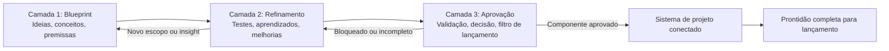
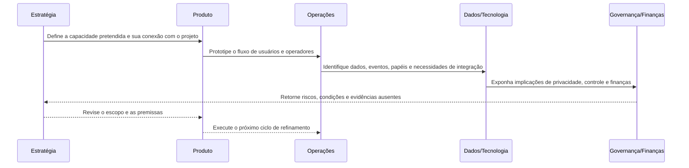
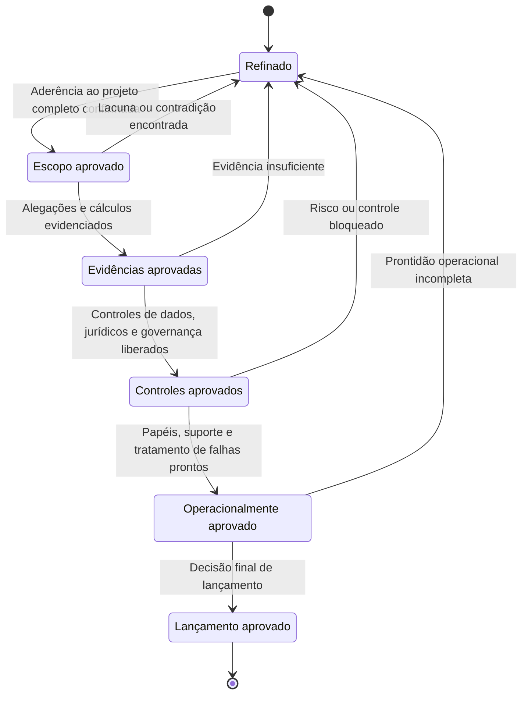
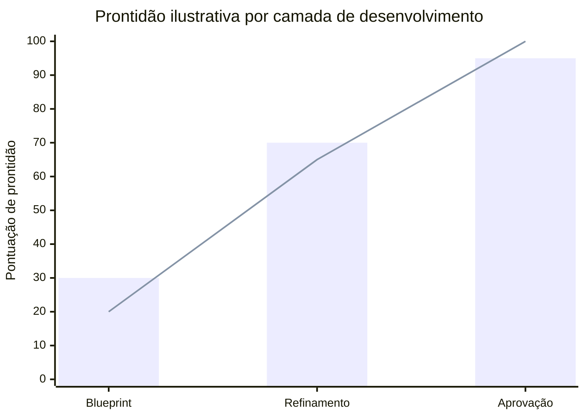

# Framework de Desenvolvimento de Projetos em Três Camadas do HUB

## Propósito

Este framework estabelece como o projeto HUB é desenvolvido, desde o seu primeiro rascunho conceitual até a aprovação final exigida para o lançamento no mercado.

O projeto deve sempre ser tratado como **um sistema completo de negócios e produto**. Documentos individuais, modelos, arquivos de pesquisa, interfaces, regras de governança e componentes operacionais são peças do mesmo projeto final. Eles devem ser conectados, revisados em contexto e evoluídos juntos.

Este framework não é um processo apenas para pilotos. Um piloto, teste ou validação pode ser usado onde for útil, mas não é a definição do projeto. O objetivo é construir e liberar o projeto completo, conforme escopado, para o lançamento.

## As três camadas

### Camada 1 — Blueprint

A camada de Blueprint contém as ideias, conceitos, premissas, hipóteses e escolhas arquiteturais amplas que definem o que o projeto pode vir a ser.

Nesta etapa:

- As ideias não precisam ser perfeitas.
- Os conceitos podem estar incompletos ou ser especulativos.
- Múltiplas alternativas podem coexistir.
- As premissas devem ser tornadas visíveis, e não escondidas.
- O escopo completo e os relacionamentos de longo prazo entre os componentes devem ser representados.
- Nenhum conceito deve ser tratado como final simplesmente por aparecer em um documento inicial.

O propósito desta camada é criar um mapa suficientemente completo do negócio e do produto, incluindo seus usuários, proposta de valor, modelo operacional, dados, tecnologia, governança, economia, marca, distribuição e requisitos de lançamento.

### Camada 2 — Refinamento

A camada de Refinamento fortalece o Blueprint por meio de investigação, comparação, teste, simulação, prototipagem e revisão.

Nesta etapa:

- As premissas são examinadas e classificadas.
- Os conceitos são melhorados, combinados, estreitados ou substituídos.
- Pequenos testes e validações são usados para gerar aprendizado.
- Os componentes de produto, negócio, finanças, dados e governança são refinados em conjunto.
- As partes fracas ou contraditórias são expostas e corrigidas.
- Nada é considerado permanentemente fixado.

O propósito desta camada não é proteger o Blueprint original. É tornar o projeto como um todo mais forte, permitindo que evidências e aprendizado mudem qualquer parte dele.

### Camada 3 — Aprovação

A camada de Aprovação é o filtro final antes que um componente, subsistema ou o projeto completo possa ser considerado pronto para o lançamento.

Nesta etapa:

- Os requisitos são verificados contra o escopo completo do projeto.
- Alegações, cálculos, fluxos de trabalho e controles exigem evidências.
- As dependências e consequências em todo o sistema são revisadas.
- Os componentes podem ser aprovados, aprovados condicionalmente, devolvidos para refinamento ou bloqueados.
- Os riscos não resolvidos devem ter um responsável e um tratamento aceito.
- A aprovação de lançamento deve cobrir o sistema completo de negócios e produto, e não apenas suas funcionalidades mais visíveis.

A aprovação é, portanto, uma decisão de governança, e não uma presunção de que o Blueprint estava correto desde o início.

## Como as camadas funcionam juntas

As camadas são progressivas, mas não estritamente lineares:

Um componente pode retroceder quando uma aprovação revela uma fraqueza ou quando o refinamento expõe um conceito ausente. Retroceder não é falha; é parte do desenvolvimento controlado do projeto.

## Fluxo de trabalho exemplificado: conectando uma oportunidade de negócio ao sistema HUB completo

O exemplo a seguir ilustra, de forma concisa, como uma capacidade pode atravessar as três camadas permanecendo conectada ao projeto mais amplo.

### 1. Blueprint — definir o sistema pretendido

O projeto propõe uma capacidade que ajuda uma instituição a configurar uma oportunidade, avaliar empresas participantes, recomendar ações, conectar partes qualificadas e reportar resultados.

Neste ponto, a equipe mapeia a cadeia completa:

```mermaid
flowchart LR
    A[Definição da oportunidade] --> B[Diagnóstico do negócio]
    B --> C[Resultado de evidência e prontidão]
    C --> D[Jornada recomendada]
    D --> E[Conexão assistida por pessoas]
    E --> F[Acompanhamento da implementação]
    F --> G[Relatório de resultado e valor]
    G --> H[Governança, dados e controles financeiros]
    H --> I[Capacidade pronta para lançamento]
```

O blueprint registra premissas como os atores envolvidos, os dados necessários, o valor esperado, os papéis operacionais, a lógica de receita, os controles de governança e como a capacidade se conecta ao restante da plataforma HUB.

### 2. Refinamento — testar e fortalecer o design

A equipe então examina a capacidade em partes menores. Pode testar as perguntas de diagnóstico, comparar regras alternativas de prontidão, prototipar o dashboard, simular a lógica financeira, revisar permissões de dados e medir o esforço manual necessário para operar o fluxo de trabalho.

O fluxo de trabalho é colaborativo, e não linear:

Cada ciclo pode melhorar, substituir ou remover parte do design original. A capacidade permanece parte do projeto como um todo mesmo quando sua implementação local muda.

### 3. Aprovação — aplicar o filtro final

Quando o refinamento está suficientemente maduro, a capacidade é revisada contra portões explícitos. Uma falha em qualquer portão devolve a capacidade ao refinamento, em vez de permitir que uma fraqueza não resolvida chegue ao lançamento.

A decisão final pode ser **aprovado**, **aprovado condicionalmente**, **bloqueado** ou **devolvido para refinamento**. A aprovação se aplica à capacidade definida e às suas dependências; ela não aprova automaticamente partes não relacionadas da plataforma.

### Visão ilustrativa de maturidade

Os valores abaixo são meramente ilustrativos. Eles mostram como a prontidão pode ser visualizada nas três camadas; não são resultados do projeto nem critérios de lançamento.

O gráfico nunca deve substituir as evidências subjacentes. Uma pontuação visual alta não é aprovação, a menos que o escopo, as evidências, os controles e os portões operacionais exigidos tenham todos sido liberados.

## Regras para trabalhar sob este framework

1. **Pense em sistemas.** Toda decisão deve ser considerada em relação ao escopo completo de negócios e produto.
2. **Separe maturidade de importância.** Um componente pode ser estrategicamente importante e ainda assim ser uma hipótese inicial de Blueprint.
3. **Rotule o estado do conhecimento.** Distinga ideias, premissas, observações, testes, evidências, decisões e aprovações.
4. **Permita a substituição.** Documentos e conceitos existentes são material de trabalho, não compromissos protegidos.
5. **Conecte as peças.** Novos trabalhos devem identificar quais componentes existentes afetam e quais dependências criam.
6. **Não confunda refinamento com aprovação.** Um resultado de teste promissor não libera automaticamente um componente para o lançamento.
7. **Não confunda documentação com conclusão.** Uma especificação detalhada não é evidência de que a capacidade especificada funciona.
8. **Use o projeto completo como contexto para trade-offs.** A otimização local não deve criar contradições no sistema mais amplo.
9. **Torne o bloqueio explícito.** Se um componente não puder prosseguir com segurança ou credibilidade, registre o motivo, as evidências necessárias e o caminho de volta para o refinamento.
10. **Lance somente após o filtro final.** O projeto está pronto quando os componentes exigidos passaram por suas aprovações aplicáveis e o sistema funciona como um todo coerente.

## Vocabulário de status de trabalho

Rótulos de status sugeridos para artefatos e decisões do projeto:

| Status | Significado |
|---|---|
| `blueprint` | Ideia, conceito, premissa ou direção ampla de design em estágio inicial. |
| `refining` | Sob investigação, teste, prototipagem ou revisão. |
| `conditionally-approved` | Aceitável com condições explícitas ou controles pendentes. |
| `approved` | Liberado para seu uso e escopo definidos. |
| `blocked` | Não pode prosseguir até que os problemas identificados sejam resolvidos. |
| `superseded` | Substituído por uma versão mais recente ou mais forte. |

## Definição de conclusão do projeto

O projeto HUB só está completo quando o sistema completo, conforme escopado — e não meramente um piloto, um documento, um protótipo ou um único módulo — tiver passado pelas validações finais exigidas.

Conclusão significa que o modelo de negócios, a experiência do produto, os processos operacionais, as estruturas de dados, a lógica financeira, a governança, a posição jurídica, a implementação técnica, os materiais de lançamento e o modelo de responsabilização estão coerentes, conectados e aprovados para uso no mercado.
