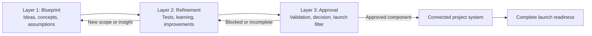
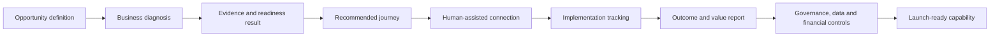
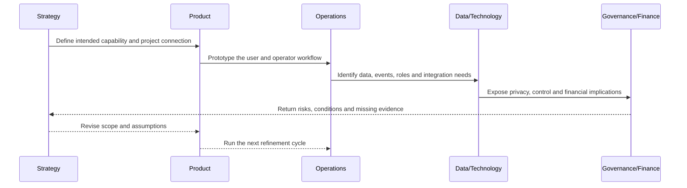
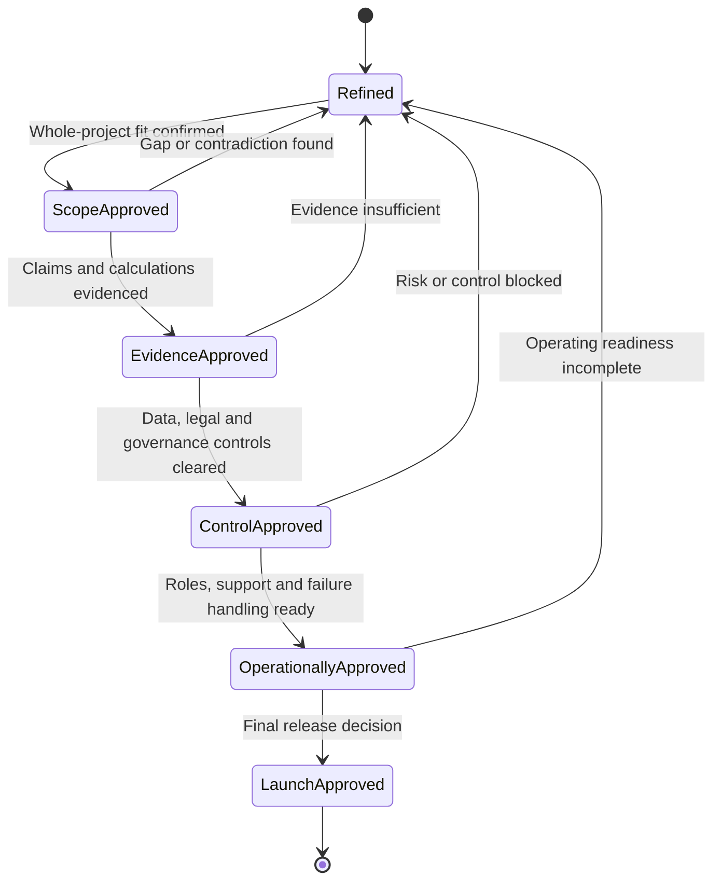
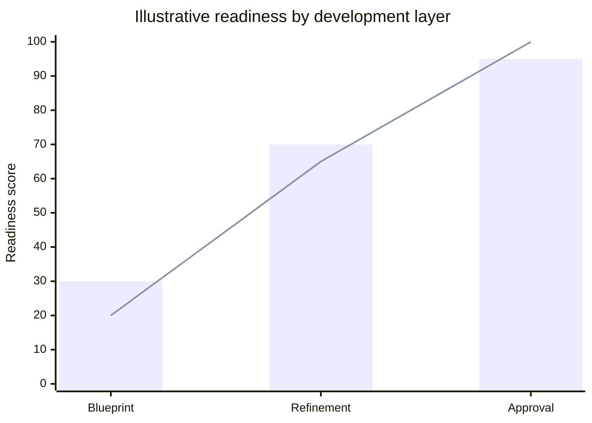

# HUB Three-Layer Project Development Framework

## Purpose

This framework establishes how the HUB project is developed from its first conceptual draft through the final approval required for market launch.

The project must always be treated as **one complete business and product system**. Individual documents, models, research files, interfaces, governance rules and operational components are pieces of the same final project. They must be connected, reviewed in context and evolved together.

This framework is not a pilot-only process. A pilot, test or validation may be used where useful, but it is not the definition of the project. The objective is to build and clear the complete scoped project for launch.

## The three layers

### Layer 1 — Blueprint

The Blueprint layer contains the ideas, concepts, assumptions, hypotheses and broad architectural choices that define what the project may become.

At this stage:

- Ideas do not need to be perfect.
- Concepts may be incomplete or speculative.
- Multiple alternatives may coexist.
- Assumptions should be made visible rather than hidden.
- The full scope and long-term relationships between components should be represented.
- No concept should be treated as final merely because it appears in an early document.

The purpose of this layer is to create a sufficiently complete map of the business and product, including its users, value proposition, operating model, data, technology, governance, economics, brand, distribution and launch requirements.

### Layer 2 — Refinement

The Refinement layer strengthens the Blueprint through investigation, comparison, testing, simulation, prototyping and revision.

At this stage:

- Assumptions are examined and classified.
- Concepts are improved, combined, narrowed or replaced.
- Small tests and validations are used to generate learning.
- Product, business, financial, data and governance components are refined together.
- Weak or contradictory parts are exposed and corrected.
- Nothing is considered permanently fixed.

The purpose of this layer is not to protect the original Blueprint. It is to make the whole project stronger by allowing evidence and learning to change any part of it.

### Layer 3 — Approval

The Approval layer is the final filter before a component, subsystem or the complete project can be considered ready for launch.

At this stage:

- Requirements are checked against the complete project scope.
- Claims, calculations, workflows and controls require evidence.
- Dependencies and consequences across the whole system are reviewed.
- Components may be approved, conditionally approved, returned for refinement or blocked.
- Unresolved risks must have an owner and an accepted treatment.
- Launch approval must cover the complete business and product system, not only its most visible features.

Approval is therefore a governance decision, not a presumption that the Blueprint was correct from the beginning.

## How the layers work together

The layers are progressive but not strictly linear:

A component may move backward when an approval reveals a weakness or when refinement exposes a missing concept. Moving backward is not failure; it is part of controlled project development.

## Example workflow: connecting a business opportunity to the complete HUB system

The following is a concise example of how one capability can move through all three layers while remaining connected to the broader project.

### 1. Blueprint — define the intended system

The project proposes a capability that helps an institution configure an opportunity, assess participating businesses, recommend actions, connect qualified parties and report outcomes.

At this point, the team maps the complete chain:

The blueprint records assumptions such as the actors involved, the data required, the expected value, the operating roles, the revenue logic, the governance controls and how the capability connects to the rest of the HUB platform.

### 2. Refinement — test and strengthen the design

The team then examines the capability in smaller pieces. It may test the diagnosis questions, compare alternative readiness rules, prototype the dashboard, simulate the financial logic, review data permissions and measure the manual effort required to operate the workflow.

The workflow is collaborative rather than linear:

Each cycle can improve, replace or remove part of the original design. The capability remains part of the whole project even when its local implementation changes.

### 3. Approval — apply the final filter

When refinement is sufficiently mature, the capability is reviewed against explicit gates. A failure at any gate returns the capability to refinement rather than allowing an unresolved weakness into launch.

The final decision may be **approved**, **conditionally approved**, **blocked** or **returned for refinement**. Approval applies to the defined capability and its dependencies; it does not automatically approve unrelated parts of the platform.

### Illustrative maturity view

The values below are illustrative only. They show how readiness can be visualized across the three layers; they are not project results or launch criteria.

The chart should never replace the underlying evidence. A high visual score is not approval unless the required scope, evidence, controls and operational gates have all been cleared.

## Rules for working under this framework

1. **Think in systems.** Every decision must be considered in relation to the full business and product scope.
2. **Separate maturity from importance.** A component may be strategically important while still being an early Blueprint hypothesis.
3. **Label the state of knowledge.** Distinguish ideas, assumptions, observations, tests, evidence, decisions and approvals.
4. **Allow replacement.** Existing documents and concepts are working material, not protected commitments.
5. **Connect the pieces.** New work must identify which existing components it affects and what dependencies it creates.
6. **Do not confuse refinement with approval.** A promising test result does not automatically clear a component for launch.
7. **Do not confuse documentation with completion.** A detailed specification is not evidence that the specified capability works.
8. **Use the whole project as the context for trade-offs.** Local optimization must not create contradictions in the broader system.
9. **Make blocking explicit.** If a component cannot safely or credibly proceed, record the reason, required evidence and path back to refinement.
10. **Launch only after the final filter.** The project is ready when the required components have passed their applicable approvals and the system works as one coherent whole.

## Working status vocabulary

Suggested status labels for project artifacts and decisions:

| Status | Meaning |
|---|---|
| `blueprint` | Early idea, concept, assumption or broad design direction. |
| `refining` | Under investigation, testing, prototyping or revision. |
| `conditionally-approved` | Acceptable with explicit conditions or remaining controls. |
| `approved` | Cleared for its defined use and scope. |
| `blocked` | Cannot proceed until identified issues are resolved. |
| `superseded` | Replaced by a newer or stronger version. |

## Definition of project completion

The HUB project is complete only when the full scoped system—not merely a pilot, a document, a prototype or a single module—has passed the required final validations.

Completion means that the business model, product experience, operating processes, data structures, financial logic, governance, legal position, technical implementation, launch materials and accountability model are coherent, connected and approved for market use.
