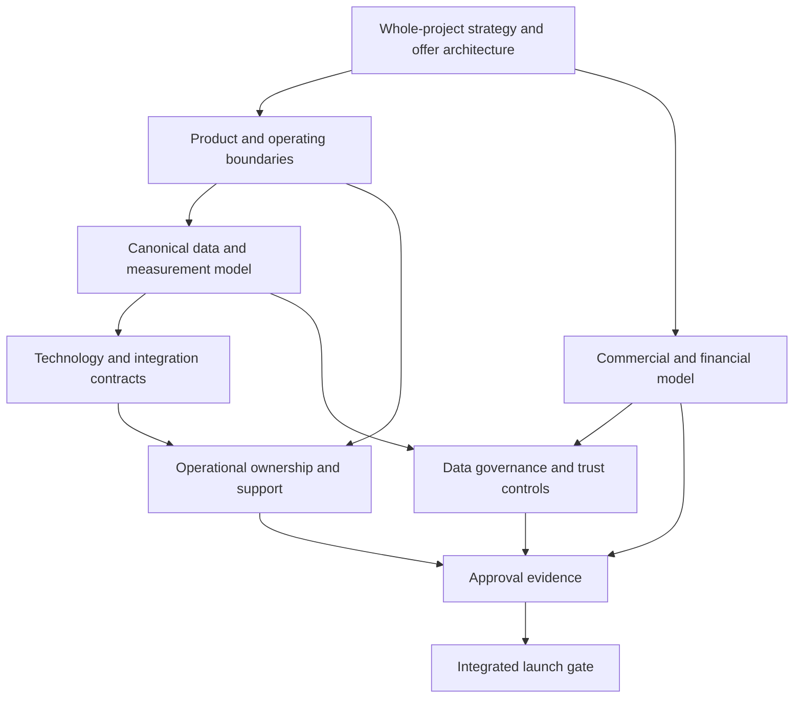

# HUB Project Gap Register

> [!info] Purpose
> This register traces what the complete HUB project still needs before its business, product, operating system and launch can be considered coherent and approved.

> [!warning] Scope rule
> A gap is not limited to customer validation. It may be a missing definition, missing connection, missing evidence, missing implementation, missing governance, missing validation or missing launch-readiness condition.

## 1. How to use this register

Each gap connects the whole-project blueprint to the work required in refinement and the condition required for final approval.

The individual YAML-backed gap notes are centralized in [[HUB_Project_Gaps.base]]. The original tables remain the consolidated source register; the notes provide property-level records for filtering, grouping and task linkage in Obsidian Bases.

```text
project component
→ current state/evidence
→ missing element
→ dependency
→ refinement action
→ approval condition
→ launch impact
```

### Gap types

| Type | Meaning |
|---|---|
| `definition` | The intended behavior, scope or boundary is not specified. |
| `connection` | The element exists but is disconnected from related project components. |
| `evidence` | A claim, assumption, calculation or outcome lacks sufficient support. |
| `implementation` | The design exists but no operational or technical capability exists. |
| `governance` | Ownership, rules, controls, legal treatment or accountability are incomplete. |
| `validation` | Testing, review, comparison or approval has not occurred. |
| `launch` | A required condition for market release is not ready. |

### Priority

- **Critical** — blocks a fundamental decision, claim, subsystem or launch path.
- **High** — materially weakens coherence, trust, economics or execution.
- **Medium** — important for completeness, scale or quality but not an immediate blocker.

### Status vocabulary

Use the project framework statuses: `blueprint`, `refining`, `conditionally-approved`, `approved`, `blocked` and `superseded`.

## 2. Gap summary

| Domain | Critical | High | Medium | Main risk |
|---|---:|---:|---:|---|
| Strategy and business model | 3 | 4 | 1 | The full vision has no single coherent commercial and operating spine yet. |
| Product and operations | 2 | 5 | 1 | The platform journey is specified conceptually but not operationally bounded. |
| Data and intelligence | 4 | 5 | 1 | Semantic architecture is ahead of physical data contracts and lineage. |
| Technology and integrations | 2 | 4 | 1 | Integration and security requirements are not executable specifications. |
| Finance and value | 3 | 3 | 1 | Illustrative economics could be mistaken for evidence-certified value. |
| Governance, legal and trust | 5 | 4 | 1 | Entity separation, data rights and Selo independence remain unresolved. |
| Market, GTM and partnerships | 2 | 4 | 1 | Distribution and category hypotheses are not connected to a repeatable route. |
| Brand and communications | 0 | 3 | 1 | External narrative is ahead of evidence and approved claims. |
| Launch and readiness | 3 | 4 | 1 | No integrated final release gate exists for the complete system. |
| **Total** | **24** | **35** | **9** | **68 registered gaps** |

Priorities are initial blueprint triage, not final decisions. They must be reviewed as dependencies change.

## 3. Strategy and business model

| ID | Priority | Type | Current state | Missing element | Refinement action | Approval condition |
|---|---|---|---|---|---|---|
| STR-001 | Critical | definition | Broad ecosystem vision and four conceptual units exist. | One coherent relationship between group units, offers, customers, operations and platform primitives. | Produce a whole-project operating model showing shared and unit-specific capabilities. | Strategy, operations, legal and finance approve one consistent system model. |
| STR-002 | Critical | definition | Multiple business fronts and revenue engines are proposed. | Offer architecture: who buys what, when, why, through which unit and with which recurring motion. | Build the offer-to-buyer-to-capability matrix. | Every launch offer has a defined buyer, value exchange, owner and economics. |
| STR-003 | Critical | connection | Long-term vision and near-term sequencing are both described. | A roadmap that preserves the full system while showing how components mature without contradicting one another. | Connect product, business, data, governance and launch roadmaps. | Dependencies and phase exit criteria are approved across domains. |
| STR-004 | High | evidence | Institutional distribution and verified implementation evidence are moat hypotheses. | Evidence that the proposed advantage is difficult to replace and can compound. | Define evidence sources, learning loops and defensibility tests. | The moat claim is supported or explicitly downgraded. |
| STR-005 | High | definition | Strategic partner applications are described as possibilities. | Partner role, commercial route, access, obligations, concentration limits and fallback paths. | Create a partner portfolio and dependency model. | No critical launch path depends on an unconfirmed partner. |
| STR-006 | High | validation | Category-sprawl risk is recognized. | Buyer-budget and category architecture across the full portfolio. | Map alternatives, budgets, buying triggers and overlaps by offer. | Positioning and target categories are accepted for each launch offer. |
| STR-007 | High | governance | Founder-led coordination is assumed. | Delegated authority, succession, capability ownership and decision forums. | Build a capability and authority map. | Critical decisions have non-founder owners and escalation paths. |
| STR-008 | Medium | connection | C.A.O.S. is the proposed operating backbone. | Explicit mapping from C.A.O.S. stages to platform modules, data, roles, deliverables and approvals. | Create a method-to-system traceability map. | The method is consistently represented across strategy, product and operations. |

## 4. Product and operations

| ID | Priority | Type | Current state | Missing element | Refinement action | Approval condition |
|---|---|---|---|---|---|---|
| PRD-001 | Critical | definition | Six modules and an end-to-end journey are described. | Product boundary: shared platform core, offer configuration and service operations. | Define capability taxonomy and module contracts. | Product scope is coherent and no module has hidden dependencies. |
| PRD-002 | Critical | implementation | UX sketches and workflow concepts exist. | Working product, operator console, permissions, tenant boundaries and support processes. | Convert the journey into system behavior, roles and acceptance criteria. | End-to-end workflow operates under controlled conditions. |
| PRD-003 | High | definition | Multiple actor types and white-label use are proposed. | Complete role, permission, tenant, entity and data-visibility model. | Build an authorization and tenancy matrix. | Security and governance approve access behavior for every actor. |
| PRD-004 | High | implementation | Diagnosis, evidence review, recommendation and matching are conceptually specified. | Versioned questionnaires, evidence workflows, explainable results and operator controls. | Specify state transitions, audit events and manual/automated boundaries. | Results are reproducible, reviewable and reversible. |
| PRD-005 | High | implementation | Journey, progress and outcome reporting are proposed. | Operational workflows for recruitment, curation, follow-through, exceptions and escalation. | Map service blueprints and standard operating procedures. | Operations can deliver the workflow without undocumented founder intervention. |
| PRD-006 | High | validation | Broad MVP exclusions are documented. | Evidence-based criteria for adding or removing modules and automation. | Create module expansion gates and decision records. | Every scope expansion has passed its gate. |
| PRD-007 | High | governance | Human review is preferred for high-impact decisions. | Human-in-the-loop responsibilities, overrides, appeals and audit trail. | Define review queues, decision rights and incident handling. | No high-impact decision is released without accountable review. |
| PRD-008 | Medium | launch | UI concepts show dashboards, mobile and SSO experiences. | Approved experience hierarchy and launch-supported surfaces. | Classify visuals as blueprint, prototype or deliverable. | External experience claims match the implemented and supported product. |

## 5. Data and intelligence

| ID | Priority | Type | Current state | Missing element | Refinement action | Approval condition |
|---|---|---|---|---|---|---|
| DAT-001 | Critical | definition | Conceptual nodes, edges and tables are mapped. | Canonical entity model with primary keys, foreign keys, cardinalities and object types. | Produce an approved logical and physical data model. | Data architecture signs off on identity and relationship semantics. |
| DAT-002 | Critical | implementation | Identity resolution is recognized as necessary. | Identity matching, merge, alias, survivorship and correction process across source systems. | Define identity service and reconciliation rules. | Test datasets demonstrate acceptable resolution and reversibility. |
| DAT-003 | Critical | definition | Events and indicators are cataloged. | Canonical event envelope, schema registry, versioning, idempotency and temporal rules. | Specify event contracts and lifecycle governance. | Producers and consumers pass contract and replay tests. |
| DAT-004 | Critical | evidence | Value tree and financial indicators are designed. | Traceable lineage from source data through metric, action, outcome and financial value. | Build metric lineage and evidence-register templates. | Every published claim has reproducible lineage and evidence status. |
| DAT-005 | High | connection | Indicator catalog, dashboards and value tree exist separately. | One semantic layer connecting definitions, formulas, dimensions, dashboards and decisions. | Create a canonical metric catalog and dependency graph. | No critical dashboard metric has an undocumented alternative definition. |
| DAT-006 | High | definition | Potential, influenced and realized value are recognized as distinct. | Formal attribution, deduplication, counterfactual and temporal rules. | Define value-state taxonomy and calculation policies. | Finance and data governance approve value classification. |
| DAT-007 | High | validation | M2/M3 indicators and model controls are proposed. | Baselines, comparison groups, sample rules, confidence, fairness and drift thresholds. | Create measurement and model validation protocols. | Indicator/model release gates have measurable thresholds and owners. |
| DAT-008 | High | governance | Consent and governance controls are listed. | Purpose-to-field map, consent propagation, retention/deletion behavior and derivative-data rules. | Build a data-purpose and lifecycle matrix. | LGPD and governance review confirms end-to-end propagation. |
| DAT-009 | High | implementation | Auditability, replay, reconciliation and export/delete are required. | Executable lineage, correction, replay, DSAR and portability workflows. | Prototype operational controls with test cases. | Control tests pass and evidence is retained. |
| DAT-010 | Medium | validation | Corrected data layer and source layer coexist. | Authoritative source-of-truth and change-control policy for source, corrected and derived artifacts. | Resolve correction-register contradictions and provenance status. | Approved artifact lineage is unambiguous. |

## 6. Technology and integrations

| ID | Priority | Type | Current state | Missing element | Refinement action | Approval condition |
|---|---|---|---|---|---|---|
| TEC-001 | Critical | implementation | Integration landscape and protocols are proposed. | Executable interface specifications: payloads, endpoints, authentication, ownership and versions. | Create integration contracts and a system-of-record matrix. | Each launch integration passes contract and security review. |
| TEC-002 | Critical | governance | Retry, DLQ, replay, quarantine and rollback are listed. | Reliability targets, failure ownership, runbooks, alerting and recovery tests. | Define SLOs, on-call ownership and recovery procedures. | Recovery drills meet approved service and data-integrity thresholds. |
| TEC-003 | High | definition | HUB platform, warehouse and intelligence engine are conceptual. | Target architecture, deployment boundaries, environments and nonfunctional requirements. | Produce solution architecture and environment strategy. | Architecture review approves scalability, security and maintainability. |
| TEC-004 | High | governance | Data isolation and secret rotation are implied. | Tenant isolation, IAM, secret management, audit logging and security incident process. | Complete threat model and security control matrix. | Security approval and remediation evidence exist. |
| TEC-005 | High | validation | Integrations are prioritized M0–M2. | Cost, latency, volume, rate-limit and availability assumptions for each priority. | Establish technical baselines and capacity model. | Technical economics support the business and launch plan. |
| TEC-006 | High | connection | Identity and integration maps are separate artifacts. | Cross-system identity and ownership map that drives integration behavior. | Connect integration keys to canonical data model. | Integration tests demonstrate correct entity resolution. |
| TEC-007 | Medium | launch | No software implementation or deployment configuration is present. | Release process, environment controls, support model and operational ownership. | Define delivery lifecycle and launch runbook. | Release, rollback and support readiness are approved. |

## 7. Finance and value

| ID | Priority | Type | Current state | Missing element | Refinement action | Approval condition |
|---|---|---|---|---|---|---|
| FIN-001 | Critical | evidence | ROI simulator contains illustrative assumptions. | Evidence-backed assumptions, sources, approvals and confidence levels. | Create an assumption register with provenance and owner. | No illustrative assumption is presented as a validated claim. |
| FIN-002 | Critical | definition | Several revenue engines are proposed. | Primary, secondary and expansion revenue architecture with recognition rules. | Build integrated revenue taxonomy and scenarios. | Finance approves revenue classification and reporting logic. |
| FIN-003 | Critical | validation | ROI, payback and benefit figures are reproducible but inconsistent. | Approved timing, ramp, net-benefit payback, attribution and double-counting methodology. | Rebuild the financial model with conservative, base and upside cases. | Financial model passes reconciliation and review. |
| FIN-004 | High | connection | Value tree and product indicators are separate. | Causal and commercial bridge from product activity to customer value and HUB revenue. | Link metrics to value levers and value-state rules. | Every claimed value path has an accepted evidence standard. |
| FIN-005 | High | governance | Commercial and restricted Institute economics should be separated. | Entity-level allocation, transfer pricing, restricted-fund controls and reporting. | Define financial separation and intercompany policies. | Legal, finance and governance approve separation. |
| FIN-006 | High | validation | Capital planning is required but amounts are unresolved. | Funding need, use of funds, tranches, runway, instrument and downside plan. | Build a connected capital and operating model. | Capital plan matches roadmap, hiring and delivery capacity. |
| FIN-007 | Medium | launch | Financial indicators include ARR/MRR/NRR and marketplace measures. | Definitions, denominators, cohorts, timing and source-of-truth ledger. | Approve financial KPI dictionary. | Finance certifies the KPI release process. |

## 8. Governance, legal and trust

| ID | Priority | Type | Current state | Missing element | Refinement action | Approval condition |
|---|---|---|---|---|---|---|
| GOV-001 | Critical | governance | Four-unit legal structure is conceptual. | Incorporation, ownership, accounts, authority, tax and intercompany evidence. | Commission legal/entity architecture and responsibility matrix. | Legal and finance approve the operating structure. |
| GOV-002 | Critical | governance | Data roles and rights are unresolved. | Controller/processor roles, lawful basis, permissions, derived-data rights and exit behavior. | Complete flow-by-flow data governance map. | Data protection review clears all launch flows. |
| GOV-003 | Critical | governance | Selo independence is identified as a blocker. | Independent governance charter, evaluator rules, conflicts, appeals and withdrawal process. | Draft Selo independence architecture and operating controls. | Independent review approves the Selo model. |
| GOV-004 | Critical | governance | Liability risks are cataloged. | Contractual allocation for recommendations, matches, suppliers, data incidents and public claims. | Build liability, insurance and indemnity matrix. | Legal and risk owners approve residual exposure. |
| GOV-005 | Critical | evidence | Governance controls and publication blocks are listed. | Executable evidence that controls operate across data, models, metrics and releases. | Define control tests, evidence retention and sign-off workflow. | Governance gate passes with no critical control gap. |
| GOV-006 | High | definition | IP chain of title is required. | Ownership and licensing of brand, C.A.O.S., content, software, schemas, data and derivatives. | Create IP register and contributor agreements. | Chain of title is complete and enforceable. |
| GOV-007 | High | implementation | Retention, DSAR, deletion and portability are required. | Operational workflows across derivatives, backups, caches, suppliers and partner exits. | Run lifecycle and deletion propagation tests. | Data rights tests pass within approved SLAs. |
| GOV-008 | High | governance | RACI exists but has multiple accountables and missing owners. | One accountable owner for each critical activity, including source stewardship and incident response. | Rebuild RACI and decision-rights matrix. | No critical process has ambiguous accountability. |
| GOV-009 | High | validation | Fairness, explainability, drift and human review are proposed. | Protected groups, thresholds, sample rules, model cards and rollback evidence. | Establish responsible-intelligence review process. | Model and recommendation controls are approved before release. |
| GOV-010 | Medium | launch | Public claims and Selo use require controls. | Approved claims library, evidence references, approval authority and withdrawal procedure. | Create communications and claims governance register. | Every external claim is traceable and approved. |

## 9. Market, GTM and partnerships

| ID | Priority | Type | Current state | Missing element | Refinement action | Approval condition |
|---|---|---|---|---|---|---|
| GTM-001 | Critical | definition | Multiple audiences and institutional routes are described. | Portfolio-level segmentation, buyer roles, budgets and buying processes. | Build buyer and offer architecture. | Launch segments and ownership are approved. |
| GTM-002 | Critical | evidence | Candidate opportunities and partner applications are hypotheses. | Documented demand, access, procurement route, participant authority and renewal path. | Create evidence log for each target route. | No route is treated as traction without evidence. |
| GTM-003 | High | connection | Founder-led, direct and partner channels are proposed. | Sequenced channel strategy and fallback that does not create concentration risk. | Model channel capacity, conversion and dependency. | GTM plan has diversified and measurable routes. |
| GTM-004 | High | validation | Competitor and alternative categories are mapped. | Buyer-ranked comparison, pricing, switching costs and differentiated proof. | Conduct structured alternative analysis. | Positioning claims survive comparison review. |
| GTM-005 | High | evidence | Market sizing variables are defined. | Bottom-up account universe, reachability, contract value, activation and renewal assumptions. | Build a source-backed market model. | Market model is transparent and scenario-tested. |
| GTM-006 | High | governance | Partner concentration limits are required. | Numeric thresholds for revenue, roadmap, capacity, data and reputation concentration. | Define concentration metrics and escalation policy. | Governance approves partner exposure limits. |
| GTM-007 | Medium | launch | Pitch materials present a broad value narrative. | External sales materials aligned to evidence state and approved claims. | Reconcile decks with the blueprint and claims register. | GTM materials pass evidence and legal review. |

## 10. Brand and communications

| ID | Priority | Type | Current state | Missing element | Refinement action | Approval condition |
|---|---|---|---|---|---|---|
| BRD-001 | High | connection | Brand promise, platform visuals and business fronts exist. | One coherent brand architecture across group units, products, partners and white-label contexts. | Create brand hierarchy and naming rules. | Brand governance approves the architecture. |
| BRD-002 | High | evidence | Decks and UI concepts show readiness, impact and value. | Claim-level evidence classification and approval status. | Build a claims-to-evidence matrix. | No visual or verbal claim exceeds its evidence state. |
| BRD-003 | High | definition | White-label is described as configurable. | Boundaries for attribution, visibility, methodology integrity and prohibited customization. | Define white-label standards and exceptions. | Product, brand and legal approve deployment rules. |
| BRD-004 | Medium | launch | Portuguese and English materials exist. | Language, localization and terminology governance for launch markets. | Create controlled glossary and translation process. | Launch materials are consistent and approved in each language. |

## 11. Launch and readiness

| ID | Priority | Type | Current state | Missing element | Refinement action | Approval condition |
|---|---|---|---|---|---|---|
| LCH-001 | Critical | launch | Roadmaps and module gates exist separately. | One integrated launch-readiness checklist covering business, product, data, technology, legal, finance, operations and communications. | Build the master launch gate and dependency graph. | All critical gates are approved or explicitly conditionally approved. |
| LCH-002 | Critical | launch | No production implementation, support model or release system is evidenced. | Deployable product, environments, monitoring, support, incident response and rollback. | Create launch operations plan and release runbook. | Operational readiness review passes. |
| LCH-003 | Critical | validation | Approval states are defined conceptually. | Approval authority, evidence package, review cadence, blockers and re-entry rules. | Create approval workflow and review packet templates. | Final approval can be independently audited. |
| LCH-004 | High | connection | Project assets are now organized by layer. | Complete traceability from blueprint requirement to refinement artifact, evidence and deliverable. | Build a requirements-to-evidence traceability matrix. | No launch-critical requirement is orphaned. |
| LCH-005 | High | governance | Risks, assumptions and dependencies are identified in principle. | Owners, dates, thresholds, escalation and decision records. | Seed the project-control registers and connect them to tasks. | Critical risks have accepted treatment or block launch. |
| LCH-006 | High | launch | Market launch is the final objective. | Readiness definition for customer onboarding, contracts, pricing, privacy notice, support and claims. | Define launch package by offer and market. | Commercial and operational launch checklist passes. |
| LCH-007 | Medium | validation | Existing approval artifacts include rejected/unapproved indicator material. | Clear promotion path from blocked/refining artifacts to approved deliverables. | Define artifact lifecycle and promotion rules. | Every launch artifact has a valid status and provenance. |

## 12. Dependency spine

The gaps are not independent. The most important dependency chain is:



### Suggested dependency order

1. Resolve whole-project strategy, offer and unit relationships (`STR-001`–`STR-003`).
2. Establish product capability boundaries and operating responsibilities (`PRD-001`–`PRD-005`).
3. Approve canonical data, event, metric and value semantics (`DAT-001`–`DAT-006`).
4. Define legal, data, IP, Selo and accountability controls (`GOV-001`–`GOV-008`).
5. Convert architecture into executable technology and operating specifications (`TEC-001`–`TEC-007`).
6. Rebuild financial, market and claims logic from approved definitions (`FIN-*`, `GTM-*`, `BRD-*`).
7. Assemble evidence packets and apply the integrated launch gate (`LCH-*`).

This is a dependency order, not a replacement for the full project roadmap. Multiple workstreams can refine in parallel when their interfaces are explicit.

## 13. Immediate register actions

The next project-management actions are:

- assign an owner and target layer to every Critical gap;
- convert each Critical gap into a tracked task or decision;
- create an assumptions register and decision register linked to gap IDs;
- define evidence required for each Critical approval condition;
- identify contradictions that must be resolved before downstream work is approved;
- establish a regular gap-review cycle;
- update each gap status as artifacts move from Blueprint to Refinement to Approval.

## 14. Definition of gap closure

A gap is closed only when:

1. the missing element is defined or implemented;
2. its dependencies are connected;
3. required evidence exists and is traceable;
4. an accountable owner has accepted the result;
5. the relevant approval condition has passed; and
6. the result does not create an unresolved contradiction elsewhere in the complete project.

Closing a gap does not mean the surrounding subsystem is automatically launch-ready. It means that the registered missing element has reached an accepted maturity state and can be referenced by downstream work.
