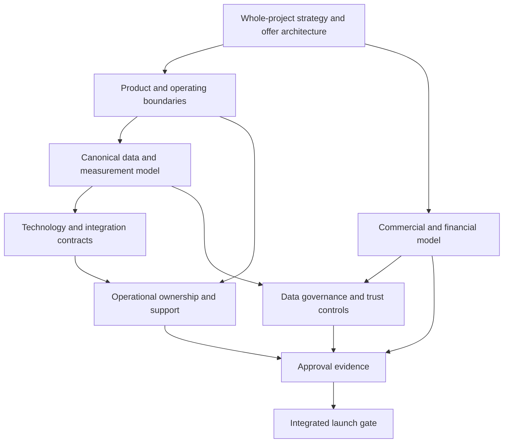

# Registro de Lacunas do Projeto HUB

> [!info] Propósito
> Este registro mapeia o que o projeto HUB completo ainda precisa antes que seus negócios, produto, sistema de operação e lançamento possam ser considerados coerentes e aprovados.

> [!warning] Regra de escopo
> Uma lacuna não se limita à validação com clientes. Pode ser uma definição ausente, uma conexão ausente, uma evidência ausente, uma implementação ausente, uma governança ausente, uma validação ausente ou uma condição de prontidão para lançamento ausente.

## 1. Como usar este registro

Cada lacuna conecta o blueprint do projeto completo ao trabalho exigido no refinamento e à condição necessária para a aprovação final.

As notas individuais de lacunas baseadas em YAML estão centralizadas em [[HUB_Project_Gaps.base]]. As tabelas originais permanecem como o registro-fonte consolidado; as notas fornecem registros no nível de propriedades para filtragem, agrupamento e vinculação a tarefas no Obsidian Bases.

```text
project component
→ current state/evidence
→ missing element
→ dependency
→ refinement action
→ approval condition
→ launch impact
```

### Tipos de lacuna

| Tipo | Significado |
|---|---|
| `definition` | O comportamento, escopo ou limite pretendido não está especificado. |
| `connection` | O elemento existe, mas está desconectado dos componentes relacionados do projeto. |
| `evidence` | Uma afirmação, premissa, cálculo ou resultado carece de suporte suficiente. |
| `implementation` | O design existe, mas não há capacidade operacional ou técnica. |
| `governance` | Propriedade, regras, controles, tratamento jurídico ou responsabilização estão incompletos. |
| `validation` | Testes, revisão, comparação ou aprovação ainda não ocorreram. |
| `launch` | Uma condição necessária para o lançamento no mercado não está pronta. |

### Prioridade

- **Crítica** — bloqueia uma decisão, afirmação, subsistema ou caminho de lançamento fundamental.
- **Alta** — enfraquece materialmente a coerência, a confiança, a economia ou a execução.
- **Média** — importante para a completude, a escala ou a qualidade, mas não é um bloqueador imediato.

### Vocabulário de status

Use os status do framework do projeto: `blueprint`, `refining`, `conditionally-approved`, `approved`, `blocked` e `superseded`.

## 2. Resumo de lacunas

| Domínio | Críticas | Altas | Médias | Principal risco |
|---|---:|---:|---:|---|
| Estratégia e modelo de negócios | 3 | 4 | 1 | A visão completa ainda não tem uma espinha dorsal comercial e operacional única e coerente. |
| Produto e operações | 2 | 5 | 1 | A jornada da plataforma é especificada conceitualmente, mas sem limites operacionais. |
| Dados e inteligência | 4 | 5 | 1 | A arquitetura semântica está à frente dos contratos físicos de dados e da linhagem. |
| Tecnologia e integrações | 2 | 4 | 1 | Os requisitos de integração e segurança não são especificações executáveis. |
| Finanças e valor | 3 | 3 | 1 | A economia ilustrativa pode ser confundida com valor certificado por evidências. |
| Governança, jurídico e confiança | 5 | 4 | 1 | A separação de entidades, os direitos sobre dados e a independência do Selo permanecem sem resolução. |
| Mercado, GTM e parcerias | 2 | 4 | 1 | As hipóteses de distribuição e categoria não estão conectadas a uma rota repetível. |
| Marca e comunicações | 0 | 3 | 1 | A narrativa externa está à frente das evidências e das afirmações aprovadas. |
| Lançamento e prontidão | 3 | 4 | 1 | Não existe um portão final integrado de liberação para o sistema completo. |
| **Total** | **24** | **35** | **9** | **68 lacunas registradas** |

As prioridades são uma triagem inicial do blueprint, não decisões finais. Devem ser revisadas conforme as dependências mudam.

## 3. Estratégia e modelo de negócios

| ID | Prioridade | Tipo | Estado atual | Elemento faltante | Ação de refinamento | Condição de aprovação |
|---|---|---|---|---|---|---|
| STR-001 | Crítica | definition | Visão ampla de ecossistema e quatro unidades conceituais existem. | Uma relação coerente entre unidades do grupo, ofertas, clientes, operações e primitivas da plataforma. | Produzir um modelo operacional de todo o projeto mostrando capacidades compartilhadas e específicas por unidade. | Estratégia, operações, jurídico e finanças aprovam um modelo de sistema consistente. |
| STR-002 | Crítica | definition | Múltiplas frentes de negócio e motores de receita são propostos. | Arquitetura de ofertas: quem compra o quê, quando, por quê, por qual unidade e com qual movimento recorrente. | Construir a matriz oferta–comprador–capacidade. | Toda oferta de lançamento tem comprador definido, troca de valor, responsável e economia. |
| STR-003 | Crítica | connection | Visão de longo prazo e sequenciamento de curto prazo estão ambos descritos. | Um roadmap que preserve o sistema completo enquanto mostra como os componentes amadurecem sem se contradizer. | Conectar os roadmaps de produto, negócio, dados, governança e lançamento. | Dependências e critérios de saída de fase são aprovados em todos os domínios. |
| STR-004 | Alta | evidence | Distribuição institucional e evidências verificadas de implementação são hipóteses de moat. | Evidências de que a vantagem proposta é difícil de substituir e pode se acumular. | Definir fontes de evidência, ciclos de aprendizado e testes de defensibilidade. | A alegação de moat é sustentada ou explicitamente rebaixada. |
| STR-005 | Alta | definition | Aplicações de parceiros estratégicos são descritas como possibilidades. | Papel do parceiro, rota comercial, acesso, obrigações, limites de concentração e caminhos alternativos. | Criar um portfólio de parceiros e um modelo de dependências. | Nenhum caminho crítico de lançamento depende de um parceiro não confirmado. |
| STR-006 | Alta | validation | O risco de dispersão de categorias é reconhecido. | Arquitetura de orçamentos de compradores e categorias em todo o portfólio. | Mapear alternativas, orçamentos, gatilhos de compra e sobreposições por oferta. | Posicionamento e categorias-alvo são aceitos para cada oferta de lançamento. |
| STR-007 | Alta | governance | Coordenação liderada pelos fundadores é presumida. | Autoridade delegada, sucessão, propriedade de capacidades e fóruns de decisão. | Construir um mapa de capacidades e autoridades. | Decisões críticas têm responsáveis que não são fundadores e caminhos de escalonamento. |
| STR-008 | Média | connection | C.A.O.S. é a espinha dorsal operacional proposta. | Mapeamento explícito das etapas do C.A.O.S. para módulos da plataforma, dados, papéis, entregáveis e aprovações. | Criar um mapa de rastreabilidade do método para o sistema. | O método é representado de forma consistente em estratégia, produto e operações. |

## 4. Produto e operações

| ID | Prioridade | Tipo | Estado atual | Elemento faltante | Ação de refinamento | Condição de aprovação |
|---|---|---|---|---|---|---|
| PRD-001 | Crítica | definition | Seis módulos e uma jornada ponta a ponta são descritos. | Fronteira do produto: núcleo compartilhado da plataforma, configuração de ofertas e operações de serviço. | Definir taxonomia de capacidades e contratos de módulos. | O escopo do produto é coerente e nenhum módulo tem dependências ocultas. |
| PRD-002 | Crítica | implementation | Esboços de UX e conceitos de fluxo de trabalho existem. | Produto funcional, console do operador, permissões, limites de tenant e processos de suporte. | Converter a jornada em comportamento de sistema, papéis e critérios de aceite. | O fluxo de trabalho ponta a ponta opera sob condições controladas. |
| PRD-003 | Alta | definition | Múltiplos tipos de atores e uso white-label são propostos. | Modelo completo de papéis, permissões, tenants, entidades e visibilidade de dados. | Construir uma matriz de autorização e tenancy. | Segurança e governança aprovam o comportamento de acesso para cada ator. |
| PRD-004 | Alta | implementation | Diagnóstico, revisão de evidências, recomendação e matching são especificados conceitualmente. | Questionários versionados, fluxos de evidências, resultados explicáveis e controles do operador. | Especificar transições de estado, eventos de auditoria e fronteiras manual/automatizado. | Os resultados são reproduzíveis, revisáveis e reversíveis. |
| PRD-005 | Alta | implementation | Relatórios de jornada, progresso e resultados são propostos. | Fluxos operacionais para recrutamento, curadoria, acompanhamento, exceções e escalonamento. | Mapear blueprints de serviço e procedimentos operacionais padrão. | As operações conseguem entregar o fluxo de trabalho sem intervenção indocumentada dos fundadores. |
| PRD-006 | Alta | validation | Exclusões amplas do MVP estão documentadas. | Critérios baseados em evidências para adicionar ou remover módulos e automação. | Criar portões de expansão de módulos e registros de decisão. | Toda expansão de escopo passou pelo seu portão. |
| PRD-007 | Alta | governance | Revisão humana é preferida para decisões de alto impacto. | Responsabilidades human-in-the-loop, overrides, recursos e trilha de auditoria. | Definir filas de revisão, direitos de decisão e tratamento de incidentes. | Nenhuma decisão de alto impacto é liberada sem revisão com responsável definido. |
| PRD-008 | Média | launch | Conceitos de UI mostram dashboards, experiências móveis e SSO. | Hierarquia de experiências aprovada e superfícies suportadas no lançamento. | Classificar visuais como blueprint, protótipo ou entregável. | As afirmações externas de experiência correspondem ao produto implementado e suportado. |

## 5. Dados e inteligência

| ID | Prioridade | Tipo | Estado atual | Elemento faltante | Ação de refinamento | Condição de aprovação |
|---|---|---|---|---|---|---|
| DAT-001 | Crítica | definition | Nós, arestas e tabelas conceituais estão mapeados. | Modelo canônico de entidades com chaves primárias, chaves estrangeiras, cardinalidades e tipos de objetos. | Produzir um modelo de dados lógico e físico aprovado. | A arquitetura de dados valida a semântica de identidade e relacionamentos. |
| DAT-002 | Crítica | implementation | A resolução de identidade é reconhecida como necessária. | Processo de matching de identidade, merge, alias, survivorship e correção entre sistemas de origem. | Definir serviço de identidade e regras de reconciliação. | Datasets de teste demonstram resolução e reversibilidade aceitáveis. |
| DAT-003 | Crítica | definition | Eventos e indicadores estão catalogados. | Envelope canônico de eventos, schema registry, versionamento, idempotência e regras temporais. | Especificar contratos de eventos e governança de ciclo de vida. | Produtores e consumidores passam nos testes de contrato e replay. |
| DAT-004 | Crítica | evidence | Árvore de valor e indicadores financeiros estão desenhados. | Linhagem rastreável desde os dados de origem até métrica, ação, resultado e valor financeiro. | Construir templates de linhagem de métricas e registro de evidências. | Toda afirmação publicada tem linhagem reproduzível e status de evidência. |
| DAT-005 | Alta | connection | Catálogo de indicadores, dashboards e árvore de valor existem separadamente. | Uma camada semântica conectando definições, fórmulas, dimensões, dashboards e decisões. | Criar um catálogo canônico de métricas e um grafo de dependências. | Nenhuma métrica crítica de dashboard tem definição alternativa não documentada. |
| DAT-006 | Alta | definition | Valor potencial, influenciado e realizado são reconhecidos como distintos. | Regras formais de atribuição, deduplicação, contrafactual e temporais. | Definir taxonomia de estados de valor e políticas de cálculo. | Finanças e governança de dados aprovam a classificação de valor. |
| DAT-007 | Alta | validation | Indicadores M2/M3 e controles de modelo são propostos. | Linhas de base, grupos de comparação, regras de amostragem, confiança, fairness e limiares de drift. | Criar protocolos de medição e validação de modelos. | Portões de liberação de indicadores/modelos têm limiares mensuráveis e responsáveis. |
| DAT-008 | Alta | governance | Controles de consentimento e governança estão listados. | Mapa finalidade-campo, propagação de consentimento, comportamento de retenção/exclusão e regras de dados derivados. | Construir uma matriz de dados-finalidade e ciclo de vida. | A revisão de LGPD e governança confirma a propagação ponta a ponta. |
| DAT-009 | Alta | implementation | Auditabilidade, replay, reconciliação e exportação/exclusão são exigidos. | Fluxos executáveis de linhagem, correção, replay, DSAR e portabilidade. | Prototipar controles operacionais com casos de teste. | Os testes de controle passam e as evidências são retidas. |
| DAT-010 | Média | validation | Camada de dados corrigidos e camada de origem coexistem. | Fonte da verdade autoritativa e política de controle de mudanças para artefatos de origem, corrigidos e derivados. | Resolver contradições do registro de correções e status de proveniência. | A linhagem dos artefatos aprovados é inequívoca. |

## 6. Tecnologia e integrações

| ID | Prioridade | Tipo | Estado atual | Elemento faltante | Ação de refinamento | Condição de aprovação |
|---|---|---|---|---|---|---|
| TEC-001 | Crítica | implementation | Panorama de integrações e protocolos são propostos. | Especificações de interface executáveis: payloads, endpoints, autenticação, propriedade e versões. | Criar contratos de integração e uma matriz de system-of-record. | Cada integração de lançamento passa na revisão de contrato e segurança. |
| TEC-002 | Crítica | governance | Retry, DLQ, replay, quarentena e rollback estão listados. | Metas de confiabilidade, propriedade de falhas, runbooks, alertas e testes de recuperação. | Definir SLOs, propriedade do on-call e procedimentos de recuperação. | Exercícios de recuperação atendem aos limiares aprovados de serviço e integridade de dados. |
| TEC-003 | Alta | definition | Plataforma HUB, warehouse e motor de inteligência são conceituais. | Arquitetura-alvo, limites de deployment, ambientes e requisitos não funcionais. | Produzir arquitetura de solução e estratégia de ambientes. | A revisão de arquitetura aprova escalabilidade, segurança e manutenibilidade. |
| TEC-004 | Alta | governance | Isolamento de dados e rotação de segredos são implícitos. | Isolamento de tenants, IAM, gestão de segredos, logs de auditoria e processo de incidentes de segurança. | Completar modelo de ameaças e matriz de controles de segurança. | Aprovação de segurança e evidências de remediação existem. |
| TEC-005 | Alta | validation | As integrações são priorizadas em M0–M2. | Premissas de custo, latência, volume, rate-limit e disponibilidade para cada prioridade. | Estabelecer linhas de base técnicas e modelo de capacidade. | A economia técnica sustenta o plano de negócio e de lançamento. |
| TEC-006 | Alta | connection | Mapas de identidade e integração são artefatos separados. | Mapa de identidade e propriedade entre sistemas que direciona o comportamento das integrações. | Conectar chaves de integração ao modelo canônico de dados. | Testes de integração demonstram resolução correta de entidades. |
| TEC-007 | Média | launch | Não há implementação de software nem configuração de deployment presentes. | Processo de release, controles de ambiente, modelo de suporte e propriedade operacional. | Definir ciclo de vida de entrega e runbook de lançamento. | Prontidão de release, rollback e suporte são aprovadas. |

## 7. Finanças e valor

| ID | Prioridade | Tipo | Estado atual | Elemento faltante | Ação de refinamento | Condição de aprovação |
|---|---|---|---|---|---|---|
| FIN-001 | Crítica | evidence | O simulador de ROI contém premissas ilustrativas. | Premissas respaldadas por evidências, fontes, aprovações e níveis de confiança. | Criar um registro de premissas com proveniência e responsável. | Nenhuma premissa ilustrativa é apresentada como afirmação validada. |
| FIN-002 | Crítica | definition | Vários motores de receita são propostos. | Arquitetura de receita primária, secundária e de expansão com regras de reconhecimento. | Construir taxonomia de receita integrada e cenários. | Finanças aprovam a classificação de receita e a lógica de relatórios. |
| FIN-003 | Crítica | validation | Figuras de ROI, payback e benefício são reproduzíveis, mas inconsistentes. | Metodologia aprovada de timing, ramp, payback de benefício líquido, atribuição e dupla contagem. | Reconstruir o modelo financeiro com cenários conservador, base e otimista. | O modelo financeiro passa por reconciliação e revisão. |
| FIN-004 | Alta | connection | Árvore de valor e indicadores de produto são separados. | Ponte causal e comercial da atividade do produto ao valor do cliente e à receita do HUB. | Vincular métricas a alavancas de valor e regras de estado de valor. | Todo caminho de valor alegado tem um padrão de evidência aceito. |
| FIN-005 | Alta | governance | A economia comercial e a do Instituto restrito devem ser separadas. | Alocação no nível de entidade, transfer pricing, controles de fundos restritos e relatórios. | Definir separação financeira e políticas intragrupo. | Jurídico, finanças e governança aprovam a separação. |
| FIN-006 | Alta | validation | Planejamento de capital é necessário, mas os valores estão indefinidos. | Necessidade de captação, uso dos recursos, tranches, runway, instrumento e plano de downside. | Construir um modelo de capital e operacional conectado. | O plano de capital corresponde ao roadmap, contratações e capacidade de entrega. |
| FIN-007 | Média | launch | Indicadores financeiros incluem ARR/MRR/NRR e medidas de marketplace. | Definições, denominadores, coortes, timing e ledger fonte da verdade. | Aprovar dicionário de KPIs financeiros. | Finanças certificam o processo de liberação de KPIs. |

## 8. Governança, jurídico e confiança

| ID | Prioridade | Tipo | Estado atual | Elemento faltante | Ação de refinamento | Condição de aprovação |
|---|---|---|---|---|---|---|
| GOV-001 | Crítica | governance | A estrutura jurídica de quatro unidades é conceitual. | Evidências de constituição, propriedade, contas, autoridade, tributos e operações intragrupo. | Contratar arquitetura jurídica/entidades e matriz de responsabilidades. | Jurídico e finanças aprovam a estrutura operacional. |
| GOV-002 | Crítica | governance | Papéis e direitos sobre dados estão indefinidos. | Papéis de controller/processor, base legal, permissões, direitos sobre dados derivados e comportamento de saída. | Completar mapa de governança de dados fluxo a fluxo. | A revisão de proteção de dados libera todos os fluxos de lançamento. |
| GOV-003 | Crítica | governance | A independência do Selo é identificada como bloqueador. | Carta de governança independente, regras de avaliadores, conflitos, recursos e processo de desligamento. | Elaborar arquitetura de independência do Selo e controles operacionais. | Revisão independente aprova o modelo do Selo. |
| GOV-004 | Crítica | governance | Riscos de responsabilidade civil estão catalogados. | Alocação contratual para recomendações, matchings, fornecedores, incidentes de dados e afirmações públicas. | Construir matriz de responsabilidade, seguros e indenizações. | Jurídico e responsáveis por risco aprovam a exposição residual. |
| GOV-005 | Crítica | evidence | Controles de governança e bloqueios de publicação estão listados. | Evidências executáveis de que os controles operam em dados, modelos, métricas e releases. | Definir testes de controle, retenção de evidências e fluxo de aprovação (sign-off). | O portão de governança passa sem lacuna crítica de controle. |
| GOV-006 | Alta | definition | A cadeia de titularidade de PI é necessária. | Propriedade e licenciamento de marca, C.A.O.S., conteúdo, software, schemas, dados e derivados. | Criar registro de PI e acordos de contribuidores. | A cadeia de titularidade está completa e é exigível. |
| GOV-007 | Alta | implementation | Retenção, DSAR, exclusão e portabilidade são exigidos. | Fluxos operacionais abrangendo derivados, backups, caches, fornecedores e saídas de parceiros. | Executar testes de ciclo de vida e propagação de exclusão. | Testes de direitos sobre dados passam dentro dos SLAs aprovados. |
| GOV-008 | Alta | governance | RACI existe, mas tem múltiplos accountable e responsáveis ausentes. | Um único responsável (accountable) para cada atividade crítica, incluindo stewardship das fontes e resposta a incidentes. | Reconstruir RACI e matriz de direitos de decisão. | Nenhum processo crítico tem responsabilização ambígua. |
| GOV-009 | Alta | validation | Fairness, explicabilidade, drift e revisão humana são propostos. | Grupos protegidos, limiares, regras de amostragem, model cards e evidências de rollback. | Estabelecer processo de revisão de inteligência responsável. | Controles de modelos e recomendações são aprovados antes do release. |
| GOV-010 | Média | launch | Afirmações públicas e uso do Selo exigem controles. | Biblioteca de afirmações aprovadas, referências de evidências, autoridade de aprovação e procedimento de retirada. | Criar registro de governança de comunicações e afirmações. | Toda afirmação externa é rastreável e aprovada. |

## 9. Mercado, GTM e parcerias

| ID | Prioridade | Tipo | Estado atual | Elemento faltante | Ação de refinamento | Condição de aprovação |
|---|---|---|---|---|---|---|
| GTM-001 | Crítica | definition | Múltiplos públicos e rotas institucionais são descritos. | Segmentação no nível de portfólio, papéis de compradores, orçamentos e processos de compra. | Construir arquitetura de compradores e ofertas. | Segmentos de lançamento e propriedade são aprovados. |
| GTM-002 | Crítica | evidence | Oportunidades candidatas e aplicações de parceiros são hipóteses. | Demanda documentada, acesso, rota de procurement, autoridade dos participantes e caminho de renovação. | Criar log de evidências para cada rota-alvo. | Nenhuma rota é tratada como tração sem evidências. |
| GTM-003 | Alta | connection | Canais liderados por fundadores, diretos e de parceiros são propostos. | Estratégia de canais sequenciada e fallback que não crie risco de concentração. | Modelar capacidade de canais, conversão e dependência. | O plano de GTM tem rotas diversificadas e mensuráveis. |
| GTM-004 | Alta | validation | Concorrentes e categorias alternativas estão mapeados. | Comparação ranqueada pelo comprador, precificação, custos de troca e prova diferenciada. | Conduzir análise estruturada de alternativas. | As afirmações de posicionamento sobrevivem à revisão comparativa. |
| GTM-005 | Alta | evidence | Variáveis de dimensionamento de mercado estão definidas. | Universo de contas bottom-up, alcançabilidade, valor de contrato, premissas de ativação e renovação. | Construir um modelo de mercado respaldado por fontes. | O modelo de mercado é transparente e testado por cenários. |
| GTM-006 | Alta | governance | Limites de concentração de parceiros são necessários. | Limiares numéricos para concentração de receita, roadmap, capacidade, dados e reputação. | Definir métricas de concentração e política de escalonamento. | Governança aprova limites de exposição a parceiros. |
| GTM-007 | Média | launch | Materiais de pitch apresentam narrativa ampla de valor. | Materiais de vendas externos alinhados ao estado de evidências e às afirmações aprovadas. | Reconciliar decks com o blueprint e o registro de afirmações. | Materiais de GTM passam pela revisão de evidências e jurídica. |

## 10. Marca e comunicações

| ID | Prioridade | Tipo | Estado atual | Elemento faltante | Ação de refinamento | Condição de aprovação |
|---|---|---|---|---|---|---|
| BRD-001 | Alta | connection | Promessa de marca, visuais da plataforma e frentes de negócio existem. | Uma arquitetura de marca coerente entre unidades do grupo, produtos, parceiros e contextos white-label. | Criar hierarquia de marca e regras de naming. | Governança de marca aprova a arquitetura. |
| BRD-002 | Alta | evidence | Decks e conceitos de UI mostram prontidão, impacto e valor. | Classificação de evidências no nível de afirmação e status de aprovação. | Construir uma matriz afirmação-evidência. | Nenhuma afirmação visual ou verbal excede seu estado de evidência. |
| BRD-003 | Alta | definition | White-label é descrito como configurável. | Limites para atribuição, visibilidade, integridade metodológica e customização proibida. | Definir padrões white-label e exceções. | Produto, marca e jurídico aprovam as regras de deployment. |
| BRD-004 | Média | launch | Materiais em português e inglês existem. | Governança de idioma, localização e terminologia para mercados de lançamento. | Criar glossário controlado e processo de tradução. | Materiais de lançamento são consistentes e aprovados em cada idioma. |

## 11. Lançamento e prontidão

| ID | Prioridade | Tipo | Estado atual | Elemento faltante | Ação de refinamento | Condição de aprovação |
|---|---|---|---|---|---|---|
| LCH-001 | Crítica | launch | Roadmaps e portões de módulos existem separadamente. | Um checklist integrado de prontidão para lançamento cobrindo negócios, produto, dados, tecnologia, jurídico, finanças, operações e comunicações. | Construir o portão mestre de lançamento e o grafo de dependências. | Todos os portões críticos estão aprovados ou explicitamente aprovados condicionalmente. |
| LCH-002 | Crítica | launch | Nenhuma implementação de produção, modelo de suporte ou sistema de release está evidenciado. | Produto implantável, ambientes, monitoramento, suporte, resposta a incidentes e rollback. | Criar plano de operações de lançamento e runbook de release. | A revisão de prontidão operacional passa. |
| LCH-003 | Crítica | validation | Estados de aprovação são definidos conceitualmente. | Autoridade de aprovação, pacote de evidências, cadência de revisão, bloqueadores e regras de reentrada. | Criar workflow de aprovação e templates de pacote de revisão. | A aprovação final pode ser auditada independentemente. |
| LCH-004 | Alta | connection | Os ativos do projeto agora estão organizados por camada. | Rastreabilidade completa do requisito do blueprint ao artefato de refinamento, evidência e entregável. | Construir uma matriz de rastreabilidade requisitos-evidências. | Nenhum requisito crítico para o lançamento fica órfão. |
| LCH-005 | Alta | governance | Riscos, premissas e dependências são identificados em princípio. | Responsáveis, datas, limiares, escalonamento e registros de decisão. | Popular os registros de controle do projeto e conectá-los às tarefas. | Riscos críticos têm tratamento aceito ou bloqueiam o lançamento. |
| LCH-006 | Alta | launch | O lançamento no mercado é o objetivo final. | Definição de prontidão para onboarding de clientes, contratos, precificação, aviso de privacidade, suporte e afirmações. | Definir pacote de lançamento por oferta e mercado. | O checklist de lançamento comercial e operacional passa. |
| LCH-007 | Média | validation | Artefatos de aprovação existentes incluem material de indicadores rejeitado/não aprovado. | Caminho claro de promoção de artefatos blocked/refining para entregáveis aprovados. | Definir ciclo de vida de artefatos e regras de promoção. | Todo artefato de lançamento tem status válido e proveniência. |

## 12. Espinha dorsal de dependências

As lacunas não são independentes. A cadeia de dependências mais importante é:



### Ordem de dependências sugerida

1. Resolver estratégia de todo o projeto, ofertas e relações entre unidades (`STR-001`–`STR-003`).
2. Estabelecer limites de capacidades do produto e responsabilidades operacionais (`PRD-001`–`PRD-005`).
3. Aprovar semântica canônica de dados, eventos, métricas e valor (`DAT-001`–`DAT-006`).
4. Definir controles jurídicos, de dados, PI, Selo e responsabilização (`GOV-001`–`GOV-008`).
5. Converter arquitetura em especificações tecnológicas e operacionais executáveis (`TEC-001`–`TEC-007`).
6. Reconstruir lógica financeira, de mercado e de afirmações a partir das definições aprovadas (`FIN-*`, `GTM-*`, `BRD-*`).
7. Montar pacotes de evidências e aplicar o portão integrado de lançamento (`LCH-*`).

Esta é uma ordem de dependências, não um substituto para o roadmap completo do projeto. Múltiplos fluxos de trabalho podem refinar em paralelo quando suas interfaces forem explícitas.

## 13. Ações imediatas do registro

As próximas ações de gestão do projeto são:

- atribuir um responsável e uma camada-alvo a cada lacuna Crítica;
- converter cada lacuna Crítica em uma tarefa rastreada ou decisão;
- criar um registro de premissas e um registro de decisões vinculados aos IDs das lacunas;
- definir as evidências exigidas para cada condição crítica de aprovação;
- identificar contradições que devem ser resolvidas antes que o trabalho downstream seja aprovado;
- estabelecer um ciclo regular de revisão de lacunas;
- atualizar o status de cada lacuna conforme os artefatos passam de Blueprint para Refinamento e Aprovação.

## 14. Definição de fechamento de lacuna

Uma lacuna só é fechada quando:

1. o elemento faltante é definido ou implementado;
2. suas dependências estão conectadas;
3. as evidências exigidas existem e são rastreáveis;
4. um responsável (accountable) aceitou o resultado;
5. a condição de aprovação pertinente foi atendida; e
6. o resultado não cria uma contradição não resolvida em outro lugar do projeto completo.

Fechar uma lacuna não significa que o subsistema envolvente esteja automaticamente pronto para lançamento. Significa que o elemento faltante registrado atingiu um estado de maturidade aceito e pode ser referenciado pelo trabalho downstream.
