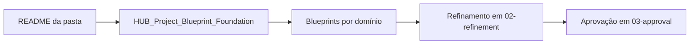
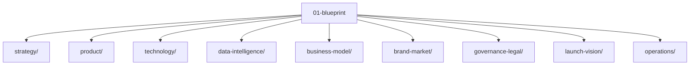

# 01-blueprint

Esta pasta reúne o blueprint do HUB: a camada onde a estratégia-base, a arquitetura conceitual e as decisões de direção ficam organizadas antes do refinamento e da aprovação.

## Como navegar

Use esta pasta quando quiser responder perguntas como:

- O que o HUB pretende ser?
- Qual é a estrutura do produto, negócio e tecnologia?
- Quais hipóteses ainda estão em nível de blueprint?
- Onde está a base para os próximos refinamentos?

## Fluxo de leitura recomendado

## Estrutura desta pasta

## O que existe aqui

- [`strategy/`](strategy/) — direção geral, fundação do projeto e material-base do blueprint.
- [`product/`](product/) — capacidades, experiência e forma do produto.
- [`technology/`](technology/) — arquitetura técnica-alvo e fronteiras de plataforma.
- [`data-intelligence/`](data-intelligence/) — modelo semântico, indicadores e inteligência do sistema.
- [`business-model/`](business-model/) — oferta, receita e arquitetura comercial.
- [`brand-market/`](brand-market/) — marca, posicionamento e mercado.
- [`governance-legal/`](governance-legal/) — governança, responsabilidades e fundamentos jurídicos.
- [`launch-vision/`](launch-vision/) — visão de lançamento, evolução e narrativa de entrada.
- [`operations/`](operations/) — modelo operacional e execução do blueprint.

## Arquivos-chave

- [`HUB_Project_Blueprint_Foundation.md`](strategy/HUB_Project_Blueprint_Foundation.md) — ponto de partida consolidado do blueprint.
- [`HUB_Product_and_Capability_Blueprint.md`](product/HUB_Product_and_Capability_Blueprint.md) — visão de produto e capacidades.
- [`HUB_Technology_Architecture_Blueprint.md`](technology/HUB_Technology_Architecture_Blueprint.md) — arquitetura de tecnologia-alvo.
- [`HUB_Data_and_Intelligence_Blueprint.md`](data-intelligence/HUB_Data_and_Intelligence_Blueprint.md) — dados, inteligência e indicadores.

## Regra prática

- Se a ideia ainda é ampla, comece em `strategy/`.
- Se a ideia já virou produto, vá para `product/`.
- Se a discussão é infraestrutura ou integrações, vá para `technology/`.
- Se a discussão é métrica, evento ou modelo semântico, vá para `data-intelligence/`.
- Se a discussão é oferta ou receita, vá para `business-model/`.

## Observação

Os conteúdos aqui são blueprint: servem para orientar, conectar e deixar as hipóteses explícitas. O refinamento e a aprovação acontecem nas camadas seguintes do repositório.
