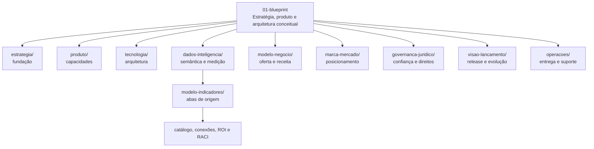

# 01 — Blueprint: Estratégia, Produto e Arquitetura Conceitual

> **Camada do projeto:** blueprint (hipóteses estruturadas, arquitetura pretendida e direção conceitual)
>
> **Próxima camada:** [`02-refinement/`](../02-refinement/)
>
> **Controle transversal:** [`00-project-control/`](../00-project-control/)

## Propósito desta pasta

`01-blueprint` é a camada em que o projeto HUB ganha forma antes de ser especificado, testado e aprovado.
Aqui ficam a visão do sistema completo, as hipóteses estratégicas, os limites conceituais de produto,
as fronteiras de tecnologia, a semântica de dados, o modelo de negócio, a marca, a governança,
as operações e a visão de lançamento.

O blueprint existe para tornar explícito o que se pretende construir, por que isso importa,
quais partes dependem umas das outras e quais perguntas ainda não têm resposta.
Ele preserva a ambição do HUB sem confundir intenção com implementação, catálogo com evidência,
modelo financeiro com resultado realizado ou desenho jurídico com parecer profissional.

Em termos práticos, esta pasta responde à pergunta: **“qual é o sistema que estamos propondo?”**
Ela não responde, sozinha, às perguntas “foi validado?”, “está implementado?” ou “pode ser lançado?”.
Essas perguntas pertencem ao refinamento, aos registros de evidência e aos gates de aprovação.

### A tese que conecta os domínios

O HUB é concebido como uma plataforma e um grupo de negócios que transforma diferenças,
capacidades, relacionamentos e sinais de ecossistema em decisões melhores, conexões qualificadas,
implementação e valor mensurável. A cadeia de valor proposta é:

```text
fontes → identidades → sinais → inteligência → ação → resultado → valor financeiro
```

A jornada operacional pretendida é:

```text
diagnosticar → planejar → conectar → implementar → medir → reconhecer → evoluir
```

O método C.A.O.S. organiza o trabalho em **Contexto, Arquitetura, Operação e Sustentação**.
Essa linguagem comum permite que estratégia, produto, dados, operação e governança descrevam
o mesmo sistema sem apagar as responsabilidades específicas de cada domínio.

## Como ler esta camada

Comece pela fundação estratégica para entender identidade, promessa, unidades e módulos.
Depois consulte o domínio que corresponde à sua pergunta e, em seguida, abra os blueprints dependentes.
Sempre registre uma hipótese, decisão, risco ou lacuna nova em `00-project-control`; não esconda uma
contradição em um documento local.

## Fluxo de leitura recomendado

```mermaid
flowchart LR
    A[Leia este README] --> B[Fundação estratégica]
    B --> C[Oferta e receita]
    C --> D[Produto e capacidades]
    D --> E[Dados e inteligência]
    E --> F[Tecnologia e integrações]
    F --> G[Operações]
    G --> H[Governança e jurídico]
    H --> I[Marca e mercado]
    I --> J[Lançamento e evolução]
    J --> K[Refinar em 02-refinement]
    K --> L[Aprovar nos gates seguintes]
```



O fluxo acima é uma recomendação, não uma ordem rígida. Os domínios podem ser investigados em paralelo,
desde que suas dependências, responsáveis e decisões não resolvidas permaneçam visíveis.

## Estrutura da pasta



## Os nove domínios do blueprint

Use a tabela como índice de decisão. Cada domínio possui um artefato principal, mas nenhum domínio
deve ser lido como silo: uma oferta precisa de produto, dados, operação, governança e lançamento coerentes.

| Domínio | Propósito | Perguntas que responde | Principais artefatos | Quando consultar |
|---|---|---|---|---|
| **Estratégia** | Consolidar identidade, tese, promessa, unidades, método C.A.O.S. e visão do sistema completo. | O que é o HUB? Que transformação pretende produzir? Quais módulos, atores e tensões existem? | [`HUB_Fundacao_Blueprint_Projeto.md`](estrategia/HUB_Fundacao_Blueprint_Projeto.md); documento-mãe em [`primeiro-rascunho-projeto/`](estrategia/primeiro-rascunho-projeto/). | Ao iniciar uma iniciativa, resolver direção, alinhar linguagem ou verificar se uma decisão local contradiz a visão maior. |
| **Produto** | Descrever a Plataforma HUB como capacidades, módulos, jornadas, perfis, permissões e fronteiras humano/automação. | Quem usa? Qual jornada é suportada? O que é núcleo compartilhado? O que continua conduzido por humanos? | [`HUB_Blueprint_Produto_e_Capacidades.md`](produto/HUB_Blueprint_Produto_e_Capacidades.md). | Ao discutir funcionalidades, MVP, UX, papéis, tenancy, matching, jornada, evidências ou critérios de capacidade. |
| **Tecnologia** | Definir arquitetura-alvo, sistemas de registro, integrações, APIs, eventos, segurança, ambientes e recuperação. | Onde cada fato vive? Como fontes se conectam? Como preservar isolamento, replay, auditoria e rollback? | [`HUB_Blueprint_Arquitetura_Tecnologica.md`](tecnologia/HUB_Blueprint_Arquitetura_Tecnologica.md). | Ao avaliar integrações, banco, warehouse/lakehouse, IAM, SLOs, observabilidade, contratos ou riscos técnicos. |
| **Dados e inteligência** | Organizar nós canônicos, indicadores, evidências, linhagem, consentimento, atribuição e estados de valor. | Qual é a definição da métrica? Qual a fonte? Como evitar dupla contagem? O que é potencial, influenciado, validado ou realizado? | [`HUB_Blueprint_Dados_e_Inteligencia.md`](dados-inteligencia/HUB_Blueprint_Dados_e_Inteligencia.md); [`modelo-indicadores/`](dados-inteligencia/modelo-indicadores/). | Ao criar métricas, eventos, dashboards, modelos, diagnósticos, benchmarks, indicadores financeiros ou regras de qualidade. |
| **Modelo de negócio** | Conectar frentes de negócio, compradores, ofertas, unidades responsáveis, operação e motores de receita. | Quem compra e paga? Qual troca de valor? É implementação, recorrência, projeto, marketplace ou funding restrito? | [`HUB_Blueprint_Oferta_e_Arquitetura_Receita.md`](modelo-negocio/HUB_Blueprint_Oferta_e_Arquitetura_Receita.md). | Ao preparar proposta, testar pricing, definir packaging, analisar ARR, separar Instituto e negócio ou mapear dependências comerciais. |
| **Marca e mercado** | Definir arquitetura de marca, categoria, públicos, rotas de distribuição, white-label, linguagem e afirmações. | Como o HUB deve ser compreendido? Para quem? Quais alternativas existem? O que pode ser afirmado? | [`HUB_Blueprint_Marca_e_Mercado.md`](marca-mercado/HUB_Blueprint_Marca_e_Mercado.md). | Ao escrever copy, deck, proposta, campanha, nomear módulos, avaliar parceiros, segmentos, claims ou localização. |
| **Governança e jurídico** | Tornar explícitos direitos, responsabilidades, contratos, PI, LGPD, incidentes e independência do Selo. | Quem decide? Quem controla dados? Como funcionam contratos, recursos, retenção, conflitos e alegações? | [`HUB_Blueprint_Governanca_e_Juridico.md`](governanca-juridico/HUB_Blueprint_Governanca_e_Juridico.md). | Antes de compartilhar dados, assinar contrato, publicar resultado, usar Selo, escolher entidade ou liberar automação de alto impacto. |
| **Visão de lançamento** | Definir unidade de release, escopo suportado, evidências, gates, promoção de status e evolução M0–M4. | O que precisa estar pronto para uma release coerente? O que está fora? Quando uma hipótese pode avançar? | [`HUB_Blueprint_Lancamento_e_Evolucao.md`](visao-lancamento/HUB_Blueprint_Lancamento_e_Evolucao.md). | Ao montar MVP, release plan, checklist de readiness, pacote de evidências, aprovação condicional ou roadmap. |
| **Operações** | Converter C.A.O.S. em entrega repetível com owners, filas, SOPs, SLAs, exceções, suporte e incidentes. | Quem executa cada etapa? Como um caso avança? Como tratar bloqueio, falha, recurso e escalonamento? | [`HUB_Blueprint_Modelo_Operacional.md`](operacoes/HUB_Blueprint_Modelo_Operacional.md). | Ao desenhar piloto, staffing, suporte, handoffs, runbooks, capacidade manual, parceiros ou transição para automação. |

## Foco especial: `dados-inteligencia/modelo-indicadores`

O diretório [`modelo-indicadores/`](dados-inteligencia/modelo-indicadores/) é a base de trabalho da
arquitetura de medição. Ele organiza o workbook em arquivos de origem e análises legíveis, permitindo
que nós, conexões, indicadores, valor, dashboards, governança e responsabilidades sejam discutidos
como um sistema único.

Embora seja comum chamar esse conjunto de “14 abas”, a estrutura numerada atualmente contém **15 abas,
de `00` a `14`**. A tabela abaixo preserva todos os nomes existentes e evita perder a aba `14_RACI`.

| Aba de origem | O que contém | Para que serve | Cuidados ao consultar |
|---|---|---|---|
| `00_Leia-me` | Escopo, convenções, legenda e instruções do workbook. | Orienta leitura, nomenclatura e limites de interpretação. | Leia primeiro; não trate convenções como aprovação. |
| `01_Mapa_Visual` | Visão visual dos componentes e do fluxo do sistema. | Ajuda a enxergar relações entre dados, produto, negócio e valor. | É mapa conceitual, não diagrama de implantação. |
| `02_Nos_de_Dados` | 25 nós, chaves, granularidade, origem, sensibilidade e atualização. | Define o vocabulário de entidades, fatos, eventos, controles e derivados. | Chaves e frequências ainda exigem modelo físico, owner e SLA. |
| `03_Conexoes` | Relações entre nós, direção, dependências e possíveis fluxos. | Torna explícita a rede causal e de dados que os nós isolados não mostram. | Validar cardinalidade, temporalidade, autorização e source of truth. |
| `04_Indicadores_Master` | Catálogo de 73 indicadores, fórmulas, fontes, owners, fases e evidências. | É o inventário principal de métricas para produto, operação, negócio e impacto. | Denominadores, pesos, atribuição e dupla contagem precisam de refinamento. |
| `05_Arvore_de_Valor` | 12 alavancas financeiras com leading indicators, outcomes e proteções. | Liga ações e capacidades a hipóteses de valor econômico. | Pipeline, GMV, adoção e ROI ilustrativo não equivalem a caixa realizado. |
| `06_Simulador_ROI` | Cenários e premissas para estimar investimento, benefício, payback e ROI. | Permite testar sensibilidade e conversar sobre hipóteses econômicas. | Valores são ilustrativos até baseline, atribuição, margem e validação financeira. |
| `07_Visoes_Dashboard` | Visões executivas, operacionais, de produto, inteligência e ecossistema. | Define quem precisa ver qual métrica e para qual decisão. | Dashboard não corrige definição ruim nem transforma métrica em evidência causal. |
| `08_Dicionario_Dados` | Campos, tipos, significado, regras, origem e uso esperado. | Serve de ponte entre semântica, schema físico e contratos de integração. | Completar nulabilidade, domínio, retenção, sensibilidade por atributo e steward. |
| `09_Eventos_Produto` | Eventos de jornada, produto, participação, matching e operação. | Instrumenta a cadeia de comportamento e permite medir adoção e progresso. | Cada evento precisa de envelope versionado, idempotência e finalidade. |
| `10_Integracoes` | Fontes externas, interfaces, cadência, direção e necessidades de integração. | Ajuda a sequenciar CRM, HRIS, ATS, LMS, ERP, procurement e BI. | Parceiro citado não é dependência disponível; exigir contrato e fallback. |
| `11_Governanca_LGPD` | Consentimento, finalidade, acesso, retenção, exclusão, papéis e controles. | Faz privacidade e governança atravessarem todos os fluxos de dados. | Não substitui revisão jurídica; papéis controlador/operador são por fluxo. |
| `12_Roadmap` | Fases, prioridades, dependências, marcos e evolução de capacidades. | Organiza M0–M4 e evita tentar lançar todo o sistema de uma vez. | Fase é sequência de investigação, não data nem prova de implementação. |
| `13_Matriz_Integracao` | Matriz cruzando domínios, sistemas, indicadores, eventos e responsáveis. | Mostra cobertura, lacunas e interfaces críticas entre camadas. | Confirmar donos, qualidade, custo, segurança e responsabilidade de dados. |
| `14_RACI` | Responsible, Accountable, Consulted e Informed para dados e indicadores. | Evita owners difusos e define quem executa, aprova e é informado. | Todo processo crítico deve ter um único accountable nomeado e backup. |

### Como usar as análises das abas

As análises em `abas-origem/*/*_analise.md` acrescentam interpretação, riscos, lacunas e recomendações.
Em particular, a análise de `04_Indicadores_Master` registra 73 indicadores, 20 priorizados para M0,
27 para M1 e 26 para M2; a de `02_Nos_de_Dados` registra 25 nós; e a de `05_Arvore_de_Valor`
explica por que atribuição e deduplicação são pré-condições para qualquer alegação financeira.
Use esses números como estado do artefato de blueprint, não como compromisso de entrega.

## Arquivos-chave

- **Fundação:** [`estrategia/HUB_Fundacao_Blueprint_Projeto.md`](estrategia/HUB_Fundacao_Blueprint_Projeto.md)
- **Documento-mãe de origem:** [`estrategia/primeiro-rascunho-projeto/00-origem/HUB_Escopo_Estrategico_Documento_Mae_v1.md`](estrategia/primeiro-rascunho-projeto/00-origem/HUB_Escopo_Estrategico_Documento_Mae_v1.md)
- **Produto:** [`produto/HUB_Blueprint_Produto_e_Capacidades.md`](produto/HUB_Blueprint_Produto_e_Capacidades.md)
- **Tecnologia:** [`tecnologia/HUB_Blueprint_Arquitetura_Tecnologica.md`](tecnologia/HUB_Blueprint_Arquitetura_Tecnologica.md)
- **Dados:** [`dados-inteligencia/HUB_Blueprint_Dados_e_Inteligencia.md`](dados-inteligencia/HUB_Blueprint_Dados_e_Inteligencia.md)
- **Oferta e receita:** [`modelo-negocio/HUB_Blueprint_Oferta_e_Arquitetura_Receita.md`](modelo-negocio/HUB_Blueprint_Oferta_e_Arquitetura_Receita.md)
- **Marca e mercado:** [`marca-mercado/HUB_Blueprint_Marca_e_Mercado.md`](marca-mercado/HUB_Blueprint_Marca_e_Mercado.md)
- **Governança:** [`governanca-juridico/HUB_Blueprint_Governanca_e_Juridico.md`](governanca-juridico/HUB_Blueprint_Governanca_e_Juridico.md)
- **Lançamento:** [`visao-lancamento/HUB_Blueprint_Lancamento_e_Evolucao.md`](visao-lancamento/HUB_Blueprint_Lancamento_e_Evolucao.md)
- **Operações:** [`operacoes/HUB_Blueprint_Modelo_Operacional.md`](operacoes/HUB_Blueprint_Modelo_Operacional.md)
- **Indicadores:** [`dados-inteligencia/modelo-indicadores/`](dados-inteligencia/modelo-indicadores/)

## Regras práticas: se sua ideia é X, vá para Y

| Se sua ideia/pergunta é... | Vá primeiro para... | Depois conecte com... |
|---|---|---|
| “Quero definir o que o HUB é.” | [`estrategia/`](estrategia/) | Marca, negócio e produto. |
| “Quero transformar a ideia em uma oferta.” | [`modelo-negocio/`](modelo-negocio/) | Produto, operações e finanças. |
| “Quero desenhar uma funcionalidade ou jornada.” | [`produto/`](produto/) | Dados, tecnologia e operações. |
| “Quero criar uma métrica, evento ou dashboard.” | [`dados-inteligencia/`](dados-inteligencia/) | Produto, tecnologia e governança. |
| “Quero integrar CRM, ERP, HRIS ou LMS.” | [`tecnologia/`](tecnologia/) | Dados, segurança e contratos. |
| “Quero decidir quem executa e atende.” | [`operacoes/`](operacoes/) | Produto, governança e lançamento. |
| “Quero publicar um claim, estudo ou ROI.” | [`governanca-juridico/`](governanca-juridico/) | Dados, finanças e marca. |
| “Quero escolher nome, público ou canal.” | [`marca-mercado/`](marca-mercado/) | Oferta, evidência e lançamento. |
| “Quero saber se pode entrar na release.” | [`visao-lancamento/`](visao-lancamento/) | Todos os oito domínios restantes. |
| “Encontrei uma contradição ou lacuna.” | [`00-project-control/`](../00-project-control/) | Registre gap, owner, evidência e decisão. |

## Conexão com `02-refinement`

### Gate congelado 2026-09-02 — G03.B2 (bloqueador)

**M0 ≈ F0 (4–6s) + MVP1 (8–12s) → refinement (P03)**, sempre com evidências do piloto Monks.
O gate só promove blueprint para refinement quando houver **>80% de cobertura dos FLD de M0**, **>60% dos KPIs de M0 conectados**, **5–10 recomendações**, **≥2 casos financeiros validados** e **envelope canônico + gate N24 de consentimento aprovados**.

**M1≈MVP2, M2≈MVP3 e M3–M4≈MVP4 permanecem blueprint draft**, com `gap_ids` em aberto (DAT-006, DAT-010, PRD-001, TEC-001 e GOV-004). Esses itens não entram no backlog promovido enquanto o gate M0 não passar.

Checklist auditável: [[../02-refinement/refinamento-modelo-dados/promocao-M0-gate-P03-v1|Gate M0 → P03]]. Matriz: [[../05-resources/Processar/Plataforma HUB/03-analises-processadas/Matriz_Convergencia_73_16_25_23_12_8|Matriz de Convergência]]. Glossário: [[../02-refinement/modelos-financeiros/HUB_Glossario_Financeiro_Congelado_v1|Glossário Financeiro v1]].

O blueprint descreve intenção; o refinement transforma intenção em trabalho verificável.
Para cada hipótese relevante, a próxima camada deve definir escopo, alternativa, requisito,
critério de aceite, evidência necessária, responsável, dependências, riscos e condição de saída.

Uma passagem saudável de camada segue este padrão:

1. Identificar a afirmação conceitual no blueprint.
2. Registrar a pergunta ou lacuna em `00-project-control`.
3. Criar investigação, experimento ou especificação em `02-refinement`.
4. Coletar evidências rastreáveis e registrar decisões.
5. Atualizar o blueprint quando a hipótese for estreitada, substituída ou invalidada.
6. Encaminhar somente o escopo sustentado para aprovação.

Refinement não é apenas “escrever mais detalhes”. Ele pode rejeitar uma premissa, reduzir o escopo,
alterar uma dependência, mudar o dono da capacidade ou retirar uma oferta. A visão completa continua
visível, mas o componente refinado precisa declarar exatamente o que será testado e em que limites.

## Conexão com `00-project-control`

`00-project-control` é a camada de coordenação e fonte de verdade para tarefas, gaps, decisões,
dependências, riscos, status e evidências. O README e os blueprints apontam a direção; o controle
registra quem fará o quê, até quando, com qual prova e sob qual autoridade.

Ao editar qualquer domínio, verifique se é necessário atualizar:

- o registro de lacunas e seus IDs;
- o mapa de dependências entre blueprints;
- uma decisão com alternativas e racional;
- uma tarefa de refinement com critério de saída;
- o RACI ou owner accountable;
- o registro de evidências e a data de revisão;
- o status do artefato e as condições de promoção.

Não use este README como substituto de uma decisão formal. Ele é um mapa de navegação e interpretação;
decisões operacionais devem viver nos registros apropriados de controle.

## Status: blueprint versus refinamento

Um artefato com status **blueprint**, `draft` ou equivalente pode conter nomes, números, fórmulas,
arquiteturas e fluxos propostos. Isso significa que a hipótese foi organizada, não que foi validada.

Um artefato em **refinamento** possui investigação ativa, critérios explícitos, fontes, testes,
responsáveis e decisões em elaboração. Ainda pode mudar e não deve ser usado como compromisso externo.

Um artefato **aprovado** só pode ser usado dentro do escopo, versão, período, público e condições
registrados no gate correspondente. Aprovação de um domínio não aprova automaticamente os demais.

### Distinções obrigatórias

- Arquitetura-alvo não é tecnologia implementada.
- Indicador catalogado não é indicador operacionalizado.
- ROI no simulador não é resultado financeiro realizado.
- Match ou recomendação não é contratação nem receita.
- Participação no programa não é reconhecimento pelo Selo.
- Possibilidade de parceiro não é parceria assinada.
- White-label não pode remover consentimento, auditoria ou integridade metodológica.
- Um dashboard verde não é prova de causalidade, impacto ou readiness.

## Regras de manutenção deste README

1. Mantenha os links relativos funcionando a partir desta pasta.
2. Preserve os dois diagramas Mermaid: leitura recomendada e estrutura.
3. Atualize a tabela de domínios quando um blueprint mudar de nome ou localização.
4. Atualize a tabela de abas quando novas fontes forem adicionadas ou uma aba for descontinuada.
5. Não promova hipóteses a fatos apenas porque ganharam uma seção ou uma visualização.
6. Rotule números ilustrativos, premissas, decisões pendentes e evidências observadas.
7. Ao encontrar conflito entre documentos, registre-o em `00-project-control` e mantenha ambos referenciados.
8. Consulte `02-refinement` antes de descrever um componente como especificado, testado ou implementado.

> **Resumo:** `01-blueprint` é o mapa do sistema HUB que pretendemos tornar real. Ele deve ser amplo,
> conectado e honesto sobre suas incertezas. O refinement testa e transforma esse mapa; o project control
> dá rastreabilidade; os gates de aprovação autorizam usos específicos.
