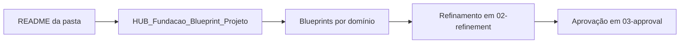
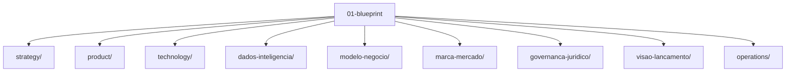

# 01-blueprint

Esta pasta reúne o blueprint do HUB: a camada onde a estratégia-base, a arquitetura conceitual e as decisões de direção ficam organizadas antes do refinamento e da aprovação.

## Como navegar

Use esta pasta quando quiser responder perguntas como:

- O que o HUB pretende ser?
- Qual é a estrutura do produto, negócio e tecnologia?
- Quais hipóteses ainda estão em nível de blueprint?
- Onde está a base para os próximos refinamentos?

## Fluxo de leitura recomendado

## Estrutura desta pasta

## O que existe aqui

- [`estrategia/`](estrategia/) — direção geral, fundação do projeto e material-base do blueprint.
- [`produto/`](produto/) — capacidades, experiência e forma do produto.
- [`tecnologia/`](tecnologia/) — arquitetura técnica-alvo e fronteiras de plataforma.
- [`dados-inteligencia/`](dados-inteligencia/) — modelo semântico, indicadores e inteligência do sistema.
- [`modelo-negocio/`](modelo-negocio/) — oferta, receita e arquitetura comercial.
- [`marca-mercado/`](marca-mercado/) — marca, posicionamento e mercado.
- [`governanca-juridico/`](governanca-juridico/) — governança, responsabilidades e fundamentos jurídicos.
- [`visao-lancamento/`](visao-lancamento/) — visão de lançamento, evolução e narrativa de entrada.
- [`operacoes/`](operacoes/) — modelo operacional e execução do blueprint.

## Arquivos-chave

- [`HUB_Fundacao_Blueprint_Projeto.md`](estrategia/HUB_Fundacao_Blueprint_Projeto.md) — ponto de partida consolidado do blueprint.
- [`HUB_Blueprint_Produto_e_Capacidades.md`](produto/HUB_Blueprint_Produto_e_Capacidades.md) — visão de produto e capacidades.
- [`HUB_Blueprint_Arquitetura_Tecnologica.md`](tecnologia/HUB_Blueprint_Arquitetura_Tecnologica.md) — arquitetura de tecnologia-alvo.
- [`HUB_Blueprint_Dados_e_Inteligencia.md`](dados-inteligencia/HUB_Blueprint_Dados_e_Inteligencia.md) — dados, inteligência e indicadores.

## Regra prática

- Se a ideia ainda é ampla, comece em `estrategia/`.
- Se a ideia já virou produto, vá para `produto/`.
- Se a discussão é infraestrutura ou integrações, vá para `tecnologia/`.
- Se a discussão é métrica, evento ou modelo semântico, vá para `dados-inteligencia/`.
- Se a discussão é oferta ou receita, vá para `modelo-negocio/`.

## Observação

Os conteúdos aqui são blueprint: servem para orientar, conectar e deixar as hipóteses explícitas. O refinamento e a aprovação acontecem nas camadas seguintes do repositório.
