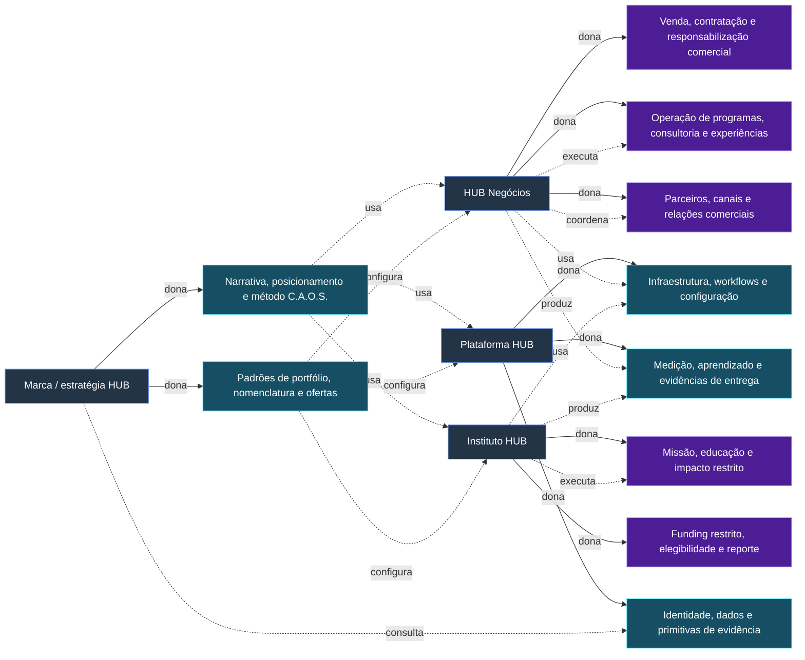

# Arquitetura de Ofertas e Receita do HUB

> [!warning] Limite do blueprint
> Este é um conceito operacional e comercial conectado, não um catálogo de ofertas validado, modelo financeiro aprovado ou decisão de lançamento. As premissas de comprador, precificação, jurídico, entrega e reconhecimento permanecem sujeitas a refinamento contra [[00-project-control/registro-lacunas/HUB_Registro_Lacunas_Projeto|o registro de gaps]].

## 1. Relação entre a marca HUB, HUB Negócios, Instituto HUB e Plataforma HUB

A **marca e estratégia HUB** é a camada coordenadora: ela possui a narrativa, o método C.A.O.S., os padrões, a lógica de portfólio e a direção em nível de grupo. Ela deve tornar o sistema legível sem fazer com que toda atividade pareça o mesmo produto ou serviço jurídico. A camada de marca, portanto, não é ela própria um balde de receita; ela governa como as ofertas são nomeadas, evidenciadas e conectadas.

O **HUB Negócios** é a unidade proposta de entrega comercial. Ele contrataria serviços de negócio, implementação, trabalho de consultoria, programas de ecossistema e relacionamentos comerciais, sujeito à confirmação de separação jurídica, autoridade e tratamento intercompany (**STR-001**). Sua responsabilidade comercial é vender e entregar resultados sem representar hipóteses como garantias.

O **Instituto HUB** é a unidade proposta orientada a missão para impacto restrito, educação e possivelmente atividade financiada por subsídios ou patrocínios. Fundos restritos, custos elegíveis, relatórios e fronteiras de transferência devem permanecer distintos das receitas comerciais; a unidade não deve ser usada para confundir economias comerciais e restritas (**STR-001**, **FIN-002**). Seu papel não é subsidiar automaticamente ofertas comerciais.

A **Plataforma HUB** é a camada de infraestrutura de software, dados, fluxos de trabalho e ecossistema. Pode ser operada por uma entidade dedicada ou por meio de um arranjo ainda não decidido (**STR-001**). As capacidades da plataforma são primitivas compartilhadas — identidade, inteligência, jornada, soluções, conexões, academia e fluxos de reconhecimento — configuradas para ofertas, mas não revendidas casualmente como funcionalidades não relacionadas. Receita de assinatura, licenciamento ou uso exigiria um proprietário definido e tratamento de reporte (**FIN-002**).

A relação pretendida é um ciclo controlado: a marca define a promessa e o método; o HUB Negócios traduz esse método em trabalho pago; a Plataforma HUB captura fluxos de trabalho repetíveis, evidências e efeitos de rede; o Instituto HUB apoia missões de impacto restrito onde funding e propósito permitirem. Um projeto pode envolver as quatro unidades, mas contratos, papéis de dados, PI, responsabilidade, responsabilização pela entrega e titularidade de receita devem ser explícitos, e não inferidos (**STR-001**, **FIN-002**). O Selo HUB permanece uma capacidade de reconhecimento potencialmente conectada, não uma garantia comercial: avaliação e implementação devem ser independentes e com conflitos controlados.

### 1.1 Matriz de capacidades das quatro unidades

Esta matriz é uma definição operacional de Blueprint, não uma decisão jurídica ou uma atribuição societária final. `✓` indica que a unidade usa ou participa da capacidade; `—` indica que não é a unidade primariamente responsável. A coluna **A único** estabelece um proprietário accountable por capacidade, mesmo quando a capacidade é compartilhada.

| Capacidade | Tipo | Marca / estratégia HUB | HUB Negócios | Instituto HUB | Plataforma HUB | A único |
|---|---|---:|---:|---:|---:|---|
| Narrativa, posicionamento e método C.A.O.S. | compartilhada | ✓ | ✓ | ✓ | ✓ | Marca / estratégia HUB |
| Padrões de portfólio, nomenclatura e arquitetura de ofertas | compartilhada | ✓ | ✓ | ✓ | ✓ | Marca / estratégia HUB |
| Venda, contratação e responsabilização por entrega comercial | específica | — | ✓ | — | — | HUB Negócios |
| Operação de programas, consultoria e experiências comerciais | específica | — | ✓ | — | — | HUB Negócios |
| Gestão de missão, educação e programas de impacto restrito | específica | — | — | ✓ | — | Instituto HUB |
| Gestão de funding restrito, elegibilidade e reporte de impacto | específica | — | — | ✓ | — | Instituto HUB |
| Infraestrutura de software, fluxos de trabalho e configuração de plataforma | compartilhada | ✓ | ✓ | ✓ | ✓ | Plataforma HUB |
| Identidade, dados operacionais e primitivas de evidência | compartilhada | ✓ | ✓ | ✓ | ✓ | Plataforma HUB |
| Medição, aprendizado e produção de evidências de entrega | compartilhada | ✓ | ✓ | ✓ | ✓ | Plataforma HUB |
| Desenvolvimento de canais, parceiros e relações comerciais | específica | — | ✓ | — | — | HUB Negócios |

**Regra de não sobreposição:** participação no uso ou na produção de uma capacidade não transfere sua titularidade. Qualquer contrato entre unidades, compartilhamento de dados, transferência de PI ou repasse financeiro deve explicitar a fronteira e permanecer sujeito ao refinamento de **STR-001**, **FIN-002** e aos blueprints downstream.

## 2. Três frentes de negócio: ofertas, clientes, parceiros e responsabilidades de entrega

As frentes são lentes de portfólio, não silos separados. Cada oferta deve identificar uma organização compradora, beneficiários participantes, unidade responsável, papéis de parceiros, configuração de plataforma e evidência de valor. Segmentação de portfólio, titularidade de orçamento e processo de compra permanecem abertos (**GTM-001**).

| Frente de negócio | Ofertas do blueprint | Tipos prováveis de cliente / beneficiário | Parceiros potenciais | Responsabilidade de entrega |
|---|---|---|---|---|
| **Mídia e Experiências** | Estratégia de campanha ou conteúdo; eventos e experiências inclusivas; ativação de empregador/marca; comunicações orientadas por insights; pacote de medição e aprendizado. | Empresas, instituições, associações, marcas, donos de eventos e conveners de ecossistema; participantes e audiências se beneficiam. | Parceiros de mídia, criação, eventos, cultura, pesquisa e distribuição. | O HUB Negócios possui escopo, relação com cliente e entrega comercial; parceiros executam componentes especializados; a Plataforma HUB apoia fluxos de audiência, jornada e evidências; o Instituto HUB participa apenas onde propósito e funding restrito permitirem. |
| **Impacto Financiável** | Diagnóstico de impacto; arquitetura de programa; portfólio de intervenções financiado; monitoramento, avaliação e aprendizado; academia de capacidades; reporte de impacto restrito. | Instituições, fundações, financiadores de interesse público, empresas com orçamentos de impacto, associações e participantes de programas. | Financiadores, avaliadores, ONGs, corpos educacionais, instituições públicas e organizações de implementação. | O Instituto HUB é o lar conceitual da atividade de propósito restrito; o HUB Negócios pode prestar serviços comerciais contratados separadamente; a Plataforma HUB fornece infraestrutura controlada de medição e fluxos de trabalho; avaliadores independentes protegem a integridade de evidências e reconhecimento. |
| **Ecossistemas Empresariais** | Inteligência de ecossistema; descoberta de fornecedores e talentos; conexões qualificadas e pareamento de oportunidades; programas de procurement e capacidades; acesso empresarial à plataforma; implementação e evolução. | Instituições, federações, associações, compradores corporativos, líderes de procurement/RH, fornecedores, especialistas e donos de oportunidades. | Associações, federações, provedores de HR/procurement/CRM, fornecedores, especialistas, redes financeiras e institucionais. | O HUB Negócios possui a responsabilização pelo programa comercial e pela implementação; a Plataforma HUB opera capacidades compartilhadas de identidade, inteligência, jornada, conexões e soluções; parceiros contribuem com oferta e acesso, mas não controlam evidências do HUB nem compromissos com clientes. |

A espinha dorsal de entrega C.A.O.S. é comum: **Contexto** diagnostica o comprador e o ecossistema; **Arquitetura** define o estado-alvo, escopo da oferta e medidas; **Operação** executa conteúdo, conexões, intervenções ou jornadas; **Sustentação** mede, governa, aprende e evolui. Isso preserva um vocabulário único, permitindo que um projeto de mídia, um programa financiado e um contrato de ecossistema empresarial tenham entregas e termos comerciais diferentes.

Os limites das ofertas devem ser registrados em uma matriz oferta-comprador-capacidade: quem assina, quem paga, quem participa, o que é entregue, quais módulos de plataforma são usados, qual parceiro é necessário, que evidência pode ser produzida e qual unidade assume o risco. Essa matriz é o refinamento exigido para **STR-002** e deve ser reconciliada com o trabalho de segmentação de portfólio em [[04-project-management/tarefas/BP-007_HUB_Go_To_Market_and_Partnerships]] (dependência do BP-007; não infer aqui seus segmentos finais).

### 2.1 Matriz oferta → comprador → unidade → capacidade → operação → receita → gap

Esta matriz transforma as ofertas candidatas das três frentes em unidades rastreáveis. Os compradores e motores de receita são hipóteses de Blueprint; não representam demanda validada, preço aprovado ou reconhecimento contábil. `N` = HUB Negócios, `I` = Instituto HUB, `P` = Plataforma HUB e `M` = Marca / estratégia HUB. A unidade indicada é a dona da oferta e da relação principal; capacidades compartilhadas continuam sob o proprietário definido na matriz de capacidades §1.1.

| Frente | Oferta candidata | Comprador primário | Unidade dona | Capacidade principal | Operação / troca de valor | Motor de receita | Gap |
|---|---|---|---|---|---|---|---|
| Mídia e Experiências | Estratégia de campanha ou conteúdo | Empresas, instituições e marcas | N | Narrativa C.A.O.S.; padrões de portfólio; entrega comercial | Diagnosticar contexto, definir estratégia, produzir conteúdo e medir aprendizado para o comprador | Projeto + implementação; recorrência de inteligência é hipótese | [[00-project-control/registro-lacunas/lacunas/STR-002\|STR-002]], [[00-project-control/registro-lacunas/lacunas/GTM-001\|GTM-001]] |
| Mídia e Experiências | Eventos e experiências inclusivas | Donos de eventos, marcas e conveners | N | Entrega comercial; infraestrutura e workflows; medição | Projetar e operar experiência, coordenar parceiros e entregar evidência de participação e resultado | Receita de projetos + implementação | [[00-project-control/registro-lacunas/lacunas/STR-002\|STR-002]], [[00-project-control/registro-lacunas/lacunas/STR-005\|STR-005]] |
| Mídia e Experiências | Ativação de empregador ou marca | Empresas e líderes de marca/RH | N | Padrões de portfólio; entrega comercial; parceiros e canais | Configurar campanha ou jornada, executar ativação e reportar evidências ao comprador | Receita de projetos + implementação | [[00-project-control/registro-lacunas/lacunas/STR-002\|STR-002]], [[00-project-control/registro-lacunas/lacunas/GTM-001\|GTM-001]] |
| Mídia e Experiências | Comunicações orientadas por insights | Empresas, instituições e associações | N | Identidade, dados e evidências; medição e aprendizado | Interpretar sinais do ecossistema, produzir comunicação e sustentar ciclo de aprendizado | Projeto; retainer recorrente é hipótese | [[00-project-control/registro-lacunas/lacunas/STR-002\|STR-002]], [[00-project-control/registro-lacunas/lacunas/FIN-002\|FIN-002]] |
| Mídia e Experiências | Pacote de medição e aprendizado | Empresas, instituições e donos de eventos | N | Medição e evidências; identidade e dados | Definir medidas, coletar evidências, validar resultados e devolver aprendizado operacional | Implementação + recorrência de inteligência | [[00-project-control/registro-lacunas/lacunas/STR-002\|STR-002]], [[00-project-control/registro-lacunas/lacunas/FIN-002\|FIN-002]] |
| Impacto Financiável | Diagnóstico de impacto | Instituições, fundações e financiadores | I | Missão e impacto restrito; medição e evidências | Diagnosticar problema, população e resultados possíveis sem prometer impacto não demonstrado | Projeto de impacto ou funding restrito; classificação a validar | [[00-project-control/registro-lacunas/lacunas/STR-002\|STR-002]], [[00-project-control/registro-lacunas/lacunas/FIN-002\|FIN-002]] |
| Impacto Financiável | Arquitetura de programa | Financiadores e instituições | I | Missão e impacto restrito; padrões de portfólio; workflows | Desenhar objetivos, intervenções, governança, indicadores e responsabilidades do programa | Funding restrito ou projeto de impacto; classificação a validar | [[00-project-control/registro-lacunas/lacunas/STR-002\|STR-002]], [[00-project-control/registro-lacunas/lacunas/FIN-002\|FIN-002]] |
| Impacto Financiável | Portfólio de intervenções financiado | Financiadores de interesse público e empresas com orçamento de impacto | I | Funding restrito; missão e impacto; parceiros e canais | Selecionar intervenções elegíveis, coordenar implementação e controlar custos e reporte | Funding restrito; não contar como ARR comercial | [[00-project-control/registro-lacunas/lacunas/STR-002\|STR-002]], [[00-project-control/registro-lacunas/lacunas/FIN-002\|FIN-002]] |
| Impacto Financiável | Monitoramento, avaliação e aprendizado | Financiadores, instituições e avaliadores | I | Medição e evidências; identidade e dados | Coletar dados, avaliar resultados, documentar limitações e ajustar o programa | Projeto de impacto + recorrência de medição; classificação a validar | [[00-project-control/registro-lacunas/lacunas/STR-002\|STR-002]], [[00-project-control/registro-lacunas/lacunas/FIN-002\|FIN-002]] |
| Impacto Financiável | Academia de capacidades | Instituições, organizações de implementação e participantes | I | Narrativa C.A.O.S.; missão e impacto; workflows | Entregar formação, aplicar método e registrar capacidades desenvolvidas | Receita de projetos ou recorrente; funding restrito somente se elegível | [[00-project-control/registro-lacunas/lacunas/STR-002\|STR-002]], [[00-project-control/registro-lacunas/lacunas/FIN-002\|FIN-002]] |
| Impacto Financiável | Reporte de impacto restrito | Financiadores e instituições concedentes | I | Funding restrito; medição e evidências | Consolidar uso de recursos, resultados, limitações e prestação de contas com ledger separado | Funding restrito; não é receita recorrente comercial | [[00-project-control/registro-lacunas/lacunas/STR-002\|STR-002]], [[00-project-control/registro-lacunas/lacunas/FIN-002\|FIN-002]] |
| Ecossistemas Empresariais | Inteligência de ecossistema | Instituições, federações e compradores corporativos | N | Identidade, dados e evidências; medição; entrega comercial | Mapear atores e necessidades, produzir inteligência acionável e registrar evidências | Implementação + recorrência de inteligência | [[00-project-control/registro-lacunas/lacunas/STR-002\|STR-002]], [[00-project-control/registro-lacunas/lacunas/GTM-001\|GTM-001]] |
| Ecossistemas Empresariais | Descoberta de fornecedores e talentos | Compradores corporativos, fornecedores e especialistas | N | Identidade, dados e evidências; parceiros e canais | Verificar perfis, qualificar necessidade e apresentar alternativas sem tratar match como tração | Recorrência de serviço; transação/marketplace permanece hipótese | [[00-project-control/registro-lacunas/lacunas/STR-002\|STR-002]], [[00-project-control/registro-lacunas/lacunas/GTM-002\|GTM-002]] |
| Ecossistemas Empresariais | Conexões qualificadas e pareamento de oportunidades | Compradores, fornecedores e donos de oportunidades | N | Parceiros e canais; identidade e dados; medição | Qualificar critérios, realizar pareamento, registrar aceite e acompanhar resultado | Recorrência ou projeto; taxa de transação permanece hipótese | [[00-project-control/registro-lacunas/lacunas/STR-002\|STR-002]], [[00-project-control/registro-lacunas/lacunas/GTM-002\|GTM-002]] |
| Ecossistemas Empresariais | Programas de procurement e capacidades | Líderes de procurement/RH, associações e federações | N | Entrega comercial; workflows; parceiros e canais | Diagnosticar processo, configurar programa, operar capacitação e medir adoção | Implementação + programa recorrente | [[00-project-control/registro-lacunas/lacunas/STR-002\|STR-002]], [[00-project-control/registro-lacunas/lacunas/STR-005\|STR-005]] |
| Ecossistemas Empresariais | Acesso empresarial à plataforma | Instituições e compradores corporativos | N | Infraestrutura e workflows; identidade e dados | Contratar acesso, provisionar configuração, suportar uso e reportar métricas de serviço | Implementação + licença/serviço recorrente; reconhecimento a validar | [[00-project-control/registro-lacunas/lacunas/STR-002\|STR-002]], [[00-project-control/registro-lacunas/lacunas/FIN-002\|FIN-002]] |
| Ecossistemas Empresariais | Implementação e evolução | Compradores corporativos e donos de ecossistemas | N | Entrega comercial; infraestrutura; medição e evidências | Configurar solução, executar rollout, operar suporte e evoluir com controle de mudanças | Receita de implementação + recorrência de serviço | [[00-project-control/registro-lacunas/lacunas/STR-002\|STR-002]], [[00-project-control/registro-lacunas/lacunas/FIN-002\|FIN-002]] |

**Regra de rastreabilidade:** cada linha ainda precisa ser refinada com JTBD, quem assina, quem paga, beneficiários, parceiro nomeado, risco, módulos de plataforma, evidência de demanda e critério de aceite. Até esse refinamento, a unidade dona e o motor de receita permanecem hipóteses controladas; nenhum comprador, preço, ARR ou resultado de impacto deve ser tratado como fato.

### 2.2 Segmentos e orçamentos de compradores de lançamento v1

As faixas abaixo são **hipóteses de orçamento para qualificação**, expressas em BRL e não em previsão de receita. Servem para testar ticket, ciclo de compra e capacidade de entrega; não são TAM, preço aprovado, tração ou compromisso de gasto. A validação deve registrar evidência de comprador, orçamento real, autoridade e rota alternativa em [[00-project-control/registro-lacunas/lacunas/GTM-001|GTM-001]] e [[00-project-control/registro-lacunas/lacunas/GTM-002|GTM-002]].

| Segmento de lançamento | Ofertas prioritárias | Quem assina | Quem paga / orçamento provável | Quem opera | Processo de compra | Faixa de orçamento a testar | Prioridade / hipótese |
|---|---|---|---|---|---|---|---|
| SEG-01 — Empresas com agenda de marca, comunicação ou empregador | Estratégia de campanha ou conteúdo; ativação de empregador ou marca; eventos e experiências | Diretor(a) de Marketing, Comunicação, Marca ou RH | Marketing, comunicação, marca ou people; verba anual e projeto de campanha | HUB Negócios com parceiros de criação, mídia e eventos | Briefing → diagnóstico → proposta → procurement → contrato por projeto; expansão depende de evidência de entrega | R$ 50 mil–R$ 250 mil por projeto; recorrência a testar separadamente | Alta; hipótese de entrada comercial via implementação |
| SEG-02 — Donos de ecossistemas, associações e federações | Inteligência de ecossistema; conexões qualificadas; programas de procurement e capacidades | Executivo(a) responsável pelo ecossistema, inovação ou programa | Programa institucional, inovação, membership ou patrocínio | HUB Negócios; Plataforma apoia identidade, conexões e evidências | Definição de desafio → seleção/mandato → contratação institucional → programa com marcos | R$ 100 mil–R$ 500 mil por programa; patrocínio somente se confirmado | Alta; hipótese de rota institucional, sem tratar parceiro como tração |
| SEG-03 — Compradores corporativos de procurement e RH | Descoberta de fornecedores e talentos; programas de procurement; acesso empresarial à plataforma | Diretor(a) de Procurement, Suprimentos, RH ou Operações | Procurement, transformação, inovação ou capacitação | HUB Negócios com Plataforma e fornecedores qualificados | Diagnóstico → piloto → validação de segurança/procurement → rollout → renovação | R$ 150 mil–R$ 600 mil no primeiro ciclo; R$ 20 mil–R$ 100 mil/mês a testar para serviço recorrente | Alta; hipótese de implementação seguida de serviço recorrente |
| SEG-04 — Fundações e financiadores de interesse público | Diagnóstico de impacto; arquitetura de programa; portfólio de intervenções; monitoramento e avaliação | Diretor(a) de Programa, Impacto ou Grants | Grant, fundo temático, patrocínio ou orçamento de impacto restrito | Instituto HUB e organizações de implementação; avaliador independente quando necessário | Chamada/mandato → desenho e elegibilidade → aprovação do funding → execução → reporte | R$ 250 mil–R$ 1,5 milhão por programa; faixa depende de instrumento e elegibilidade | Alta; funding restrito separado de receita comercial e ARR |
| SEG-05 — Instituições com agenda de impacto e educação | Academia de capacidades; monitoramento, avaliação e aprendizado; reporte de impacto restrito | Reitor(a), diretor(a) de programa, sustentabilidade ou desenvolvimento institucional | Educação, impacto, extensão, doação ou parceria institucional | Instituto HUB com Plataforma e avaliadores/educadores | Proposta institucional → análise de escopo → aprovação interna → contrato ou instrumento de funding | R$ 50 mil–R$ 300 mil por ciclo; recorrência somente após evidência de uso | Média; hipótese dependente de autoridade, funding e capacidade |
| SEG-06 — Empresas e instituições compradoras de acesso à Plataforma | Acesso empresarial à plataforma; inteligência de ecossistema; implementação e evolução | Sponsor executivo, Operações, Inovação ou Tecnologia | Transformação digital, operações, inovação ou unidade de negócio | HUB Negócios contrata; Plataforma provisiona e suporta; cliente opera o uso | Descoberta → avaliação técnica e de dados → piloto → contrato → onboarding | R$ 100 mil–R$ 500 mil de implementação; R$ 20 mil–R$ 150 mil/mês a testar para acesso/serviço | Média; hipótese condicionada a produto, segurança e SLOs downstream |

**Regras de qualificação:** (1) `quem assina`, `quem paga` e `quem opera` devem ser pessoas ou funções nomeadas no cenário real; (2) uma faixa só vira hipótese de demanda quando houver fonte, data, orçamento indicado ou comportamento de compra registrado; (3) funding restrito deve permanecer em ledger e reporte separados; (4) nenhum segmento é “tração” sem evidência escrita conforme GTM-002; (5) o primeiro ciclo deve testar uma oferta e um comprador, não o portfólio inteiro.

**Próxima evidência:** para cada segmento priorizado, preencher no log de [[02-refinement/pesquisa/log-evidencias-GTM|evidências GTM]] a rota, parceiro, status `hipótese` ou `tração`, fonte, link, fallback, responsável e data de revisão.

## 3. Motores de receita primários, secundários e de expansão

A hierarquia abaixo é lógica de sequenciamento, não uma previsão ou aprovação. O motor primário deve financiar entrega útil e gerar evidências repetíveis; os motores secundários devem aumentar retenção e valor do cliente; os motores de expansão devem seguir capacidade, governança e distribuição validadas, e não precedê-las (**FIN-002**, **STR-003**).

### Motor primário: adoção comercial conduzida por implementação

A espinha dorsal comercial inicial é proposta como diagnóstico, arquitetura e implementação pagos para instituições, empresas e donos de ecossistemas, com uma transição delimitada para acesso recorrente a plataforma/serviços. Isso reflete a premissa atual de que operações conduzidas por humanos revelam o que pode depois ser transformado em produto. Um engajamento primário poderia combinar um diagnóstico, um roadmap C.A.O.S., fluxo de trabalho configurado, curadoria de parceiros/soluções e acompanhamento. Não é uma promessa de ROI específico.

Contratos primários poderiam ser originados pelo HUB Negócios e usar a Plataforma HUB como infraestrutura habilitadora. Escopo, aceitação, controle de mudanças, suporte, processamento de dados, PI e responsabilidade devem ser explícitos. A conversão de implementação em acesso recorrente é uma hipótese a testar, não uma renovação presumida (**STR-002**, **GTM-001**).

### Motores secundários: acesso recorrente e programas repetidos

Receita secundária pode incluir assinaturas/licenças empresariais ou de ecossistema, retainers recorrentes de inteligência e medição, operações gerenciadas de jornada, programas de academia/capacidades e contratos repetidos de mídia/experiência ou programas de impacto. Recorrência exige um limite de serviço definido, gatilho de renovação, denominador, custo de suporte e responsável. Receita de assinatura não deve incluir obrigações de implementação não ganhas, fundos restritos ou repasses de marketplace (**FIN-002**).

### Motores de expansão: alavancagem de rede e portfólio

Motores de expansão potenciais incluem taxas de marketplace por soluções ou transações qualificadas; programas de ecossistema patrocinados ou financiados por parceiros; produtos de benchmark ou inteligência sujeitos a consentimento e anonimização; produção de mídia e experiências em escala; e serviços de reconhecimento ou relacionados ao Selo apenas sob governança independente. Esses motores dependem de fronteiras de produto, direitos de dados, linhagem de medição, controles de concentração de parceiros e independência do Selo (**STR-003**, **FIN-002**). Devem ser condicionados por evidências e capacidade operacional, não tratados como tração atual.

A lógica comercial completa é, portanto: implementação paga cria valor configurado e aprendizado; acesso recorrente sustenta fluxos de trabalho e medição; oportunidades de marketplace, rede, mídia, programas financiados e adjacentes a reconhecimento expandem o sistema quando seus controles separados estão satisfeitos. O roadmap deve conectar essas movimentações aos critérios de saída de produto, dados, governança e lançamento M0–M4, em vez de implicar disponibilidade simultânea (**STR-003**).

### 3.1 Taxonomia operacional e regra de reconhecimento v1

| Camada | Categoria | Natureza | Quando reconhecer | Tratamento ARR | Exemplo HUB | Controle obrigatório |
|---|---|---|---|---|---|---|
| Primária | Implementação | Comercial | Identificar as obrigações de desempenho e determinar, para cada uma, se a satisfação ocorre ao longo do período ou em momento específico. Reconhecer somente quando a obrigação correspondente for satisfeita; aceite ou marco são evidência apenas quando representarem essa satisfação. | **Não é ARR**; receita pontual de implementação | Diagnóstico C.A.O.S. ou configuração de workflow | Separar setup, migração, configuração e treinamento do serviço recorrente somente se forem obrigações distintas; registrar escopo, aceite, marcos e custos |
| Primária | Mídia e experiências / projetos | Comercial | Inventariar cada obrigação contratual — estratégia, produção, evento, mídia, medição e componentes de parceiros — e reconhecer cada obrigação quando satisfeita, ao longo do período ou em marco/momento específico, conforme entrega efetivamente realizada e evidenciada | **Não é ARR**; receita pontual de projeto | Evento inclusivo ou estratégia de conteúdo | Contratante, obrigações, critério de satisfação, marcos, parceiros e evidência; faturamento ou aceite administrativo não são gatilhos isolados |
| Secundária | Acesso à Plataforma / licença de software | Comercial | Distinguir acesso hospedado ou serviço contínuo de direito de uso de software. Analisar acesso ao longo do período; para licença, documentar disponibilização do direito e obrigações distintas de suporte, atualização, implementação ou hospedagem | **Pode compor ARR** somente para obrigação recorrente contratada e iniciada; licença pontual não é ARR por padrão | Acesso empresarial à plataforma | Alocação por obrigação, unidade e entidade contratante, período, limite de serviço, suporte, métricas e titularidade |
| Secundária | Assinatura ou serviço recorrente | Comercial | Reconhecer conceitualmente conforme o serviço é disponibilizado e prestado durante o período contratado. O início do serviço, e não faturamento ou renovação, é o marco operacional | **Pode compor ARR**; excluir setup, uso eventual, repasses, funding restrito e renovação não contratada | Retainer de inteligência ou jornada gerenciada | Início/fim do serviço, renovação contratada, denominador, churn, custo de suporte e evidência de prestação; aceite não substitui análise da obrigação |
| Expansão | Marketplace / transação qualificada | Comercial potencial; **adiado** | Antes do reconhecimento, documentar se o HUB atua como principal ou agente, considerando controle da solução, responsabilidade perante o cliente e riscos de cumprimento. Apresentação bruta ou líquida seguirá essa conclusão aprovada; não presumir tratamento líquido por haver repasse | **Não é ARR por padrão**; volume bruto ou repasse não é automaticamente receita HUB | Taxa de match ou transação, ainda não habilitada | Principal/agente, divulgação, conflito, tributos, dados, responsabilidade, cancelamentos, liquidação e aprovação de FIN-002 |
| Secundária ou expansão | Funding de impacto restrito | Restrita; não comercial | Classificar inicialmente como entrada de funding restrito; classificação e momento dependem do instrumento, entidade, elegibilidade, condições, reporte, período e eventual devolução | **Nunca é ARR comercial**; reportar em métrica restrita separada | Subsídio, doação ou patrocínio restrito do Instituto | Ring-fencing, custos elegíveis, ledger e reporte separados, devolução, rateio documentado e proibição de subsídio implícito |

> [!warning] Regra de maturidade financeira
> Esta é uma taxonomia conceitual de Blueprint. Nenhuma linha autoriza reconhecimento contábil, classificação fiscal, preço, ARR, margem ou transferência intercompany. Finanças deve validar o tratamento por obrigação contratual, entidade, jurisdição, ledger fonte da verdade e política de reporte em **FIN-002**.

**ARR (KPI gerencial):** receita recorrente anualizada, não conclusão de reconhecimento contábil. Incluir somente contraprestação recorrente contratada, ativa e atribuível a serviço recorrente iniciado, com período, unidade contratante e limite de serviço identificados. Excluir implementação, projetos, eventos, uso eventual, taxas transacionais, repasses, valores variáveis não comprometidos, funding restrito, créditos, descontos não normalizados e renovações ainda não contratadas. Registrar fórmula, data de medição e tratamento de cancelamentos, expansão e contração.

Os exemplos reproduzíveis e os campos mínimos para cenários estão em [[05-resources/planilhas/HUB_Taxonomia_Receita_Reconhecimento_v1|HUB_Taxonomia_Receita_Reconhecimento_v1]]. A tabela deve ser reconciliada com cada linha da matriz de ofertas §2.1 e com os cenários de contrato antes do gate P01.

## 4. Classificações de receita e fronteiras de titularidade

A taxonomia a seguir previne colisões de categoria. A classificação é conceitual até que finanças defina reconhecimento, timing, alocação de contratos, tratamento tributário, ledger fonte-da-verdade e regras de reporte (**FIN-002**).

| Classificação                           | Significado econômico                                                                                                   | Atividade HUB ilustrativa                                                                                     | Proprietário / fronteira primária                                                                                                                               |
| --------------------------------------- | ----------------------------------------------------------------------------------------------------------------------- | ------------------------------------------------------------------------------------------------------------- | --------------------------------------------------------------------------------------------------------------------------------------------------------------- |
| **Receita comercial**                   | Contraprestação de um cliente por uma oferta de propósito comercial.                                                    | Consultoria, acesso empresarial, programa gerenciado, serviço de mídia/experiência.                           | Unidade comercial contratante (proposto HUB Negócios); não funding restrito do Instituto.                                                                       |
| **Receita de implementação**            | Trabalho pago de setup, configuração, migração, onboarding, diagnóstico ou mudança necessário para ativar uma oferta.   | Diagnóstico C.A.O.S., configuração de tenant, design de fluxo de trabalho, onboarding de dados, treinamento.  | Proprietário da entrega e unidade contratante; escopo e aceitação devem ser separados das obrigações de serviço recorrente.                                     |
| **Receita recorrente**                  | Acesso ou serviço periódico contratado com obrigação contínua.                                                          | Assinatura/licença de plataforma, retainer de inteligência, jornada gerenciada, suporte ou acesso à academia. | Proprietário da plataforma e/ou serviço comercial conforme definido em contrato; exige métricas de renovação e serviço.                                         |
| **Receita de projetos**                 | Contraprestação fixa ou por marco para uma campanha, evento, programa financiado ou intervenção sob medida delimitados. | Projeto de mídia, evento, programa de impacto, pesquisa ou ativação de ecossistema.                           | Unidade contratante e proprietário de projeto nomeado; entregáveis, marcos e repasses de parceiros devem ser rastreáveis.                                       |
| **Receita/funding de impacto restrito** | Fundos legal ou contratualmente restritos a um propósito de impacto, educação ou missão.                                | Subsídio do Instituto, doação, patrocínio ou funding restrito de programa.                                    | Instituto HUB (conceitualmente), com ledger restrito, regras de custos elegíveis e reporte; não pode ser silenciosamente reclassificado como receita comercial. |

Um contrato pode conter múltiplas classificações, mas a alocação deve ser documentada no nível de obrigação. Implementação não deve ser apresentada como ARR; volume de transações de marketplace não deve ser apresentado como receita HUB; valor influenciado de clientes não deve ser apresentado como caixa realizado; funding restrito não deve ser contado como receita recorrente comercial. Essas distinções sustentam os princípios de estado de valor em [[01-blueprint/estrategia/HUB_Fundacao_Blueprint_Projeto]] e exigem refinamento de finanças (**FIN-002**).

## 5. Premissas, decisões não resolvidas e dependências entre blueprints

A arquitetura presume que um sistema HUB conectado pode suportar responsabilidades distintas de unidades, três frentes e monetização em estágios sem confusão de categoria. Também presume que distribuição institucional, evidências verificadas de implementação e uma camada semântica compartilhada podem compor valor; nada disso está validado neste Blueprint (**STR-001**, **STR-002**, **STR-003**, **GTM-001**). As seguintes dependências são explícitas:

- **Depende do BP-002:** fronteiras de produto/módulos, packaging, permissões e comportamento implementação-versus-plataforma. Este documento não deve inventar o produto mínimo ou as superfícies suportadas.
- **Depende do BP-003:** dados, inteligência, medição e linhagem de valor necessários para definir evidências, métricas de uso e valor defensável ao cliente.
- **Depende do BP-004:** sequenciamento tecnológico/de integração e premissas de custo que restringem a economia de entrega e o suporte recorrente.
- **Depende do BP-005:** governança, jurídico, entidades, PI, LGPD, responsabilidade e fronteiras de independência do Selo, incluindo se a arquitetura de quatro unidades é executável juridicamente.
- **Depende do BP-006:** finanças, reconhecimento, cenários, alocação de custos, tratamento de fundos restritos e definições de KPI; nenhum número nesta nota está financeiramente aprovado.
- **Depende do BP-007:** segmentos de portfólio, papéis de comprador, orçamentos, processos de compra, rotas, obrigações de parceiros e canais alternativos.
- **Depende do BP-008:** roadmap integrado, critérios de saída de fase e portões de lançamento/prontidão conectando o sistema completo (**STR-003**).

## Premissas Abertas e Decisões Não Resolvidas

| Premissa / decisão não resolvida | IDs de gap afetados | Ação de refinamento |
|---|---|---|
| As quatro unidades conceituais podem compartilhar método e plataforma mantendo fronteiras claras jurídicas, operacionais, de dados e de receita. | STR-001 | Produzir o modelo operacional do projeto completo e a matriz de responsabilidades legais/entidades; atribuir responsáveis e regras intercompany. |
| Cada frente pode ser expressa como um portfólio coerente de ofertas sem confundir compradores, orçamentos ou titularidade de categoria. | STR-002, GTM-001 | Construir a matriz oferta-comprador-capacidade e validar hipóteses de segmento, processo de compra e orçamento. |
| A adoção conduzida por implementação pode transitar para acesso recorrente ou serviços gerenciados em um limite de serviço sustentável. | STR-002, FIN-002 | Testar cenários de packaging, aceitação, renovação, custo de suporte e economia unitária usando evidências, não premissas ilustrativas. |
| Motores primários, secundários e de expansão podem ser separados para contabilidade, reporte e comunicação com clientes. | FIN-002 | Definir regras de reconhecimento, alocação de obrigações contratuais, dicionário de KPIs e ledger fonte-da-verdade. |
| Motores de marketplace, benchmark e adjacentes a reconhecimento podem operar sem conflitos, superestimação ou perda de confiança. | FIN-002, STR-001 | Estabelecer controles de dados, responsabilidade, divulgação, concentração e independência do Selo antes de decisões de expansão. |
| O roadmap completo pode preservar a ambição de longo prazo enquanto sequencia ofertas e capacidades de plataforma sem contradição. | STR-003 | Conectar roadmaps de produto, negócio, dados, governança e lançamento com critérios de saída de fase explícitos. |
| Rotas institucionais e de parceiros proporcionarão acesso, autoridade e potencial de renovação suficientes para o portfólio proposto. | GTM-001, STR-003 | Produzir logs de evidências de compradores, economia de rotas, obrigações de parceiros e cenários de canais alternativos; não contar possibilidades como tração. |
| Funding restrito do Instituto pode ser isolado (ring-fenced) e reportado sem subsidiar ou mascarar a economia comercial. | STR-001, FIN-002 | Definir política de fundos restritos, elegibilidade, regras de transfer pricing/intercompany e reporte separado. |
| O Selo HUB pode permanecer independente enquanto conectado ao ecossistema como uma capacidade de reconhecimento governada. | STR-001, FIN-002 | Redigir controles de avaliadores, conflitos, recursos, pagamento e alegações públicas; manter a comercialização do Selo não resolvida pendente revisão. |

## Dependências Entre Blueprints

Este artefato BP-001 é a espinha dorsal comercial dos demais documentos de blueprint, mas não pode resolver unilateralmente suas interfaces. Seu próximo refinamento deve ser uma matriz de rastreabilidade conectando cada oferta à [[01-blueprint/estrategia/HUB_Fundacao_Blueprint_Projeto]], ao modelo de capacidades do produto, aos estágios C.A.O.S., à linhagem de dados/métricas, às fronteiras de entidades e contratos, aos cenários de reconhecimento financeiro, às evidências de compradores e aos portões integrados de lançamento. Até que essas dependências sejam refinadas e aprovadas, todos os nomes de ofertas, titularidades, prioridades de receita e premissas de clientes permanecem conceitos de Blueprint.

A ordem de dependência é intencionalmente escalonada: resolver relações de unidades e ofertas (**STR-001**, **STR-002**); definir fronteiras de produto e operação; estabelecer semântica de dados e valor; definir controles jurídicos, LGPD, PI, responsabilidade e Selo; traduzir arquitetura em especificações técnicas e operacionais; reconstruir cenários de finanças e GTM; então montar evidências de aprovação e o portão integrado de lançamento (**STR-003**, **FIN-002**, **GTM-001**). Redação paralela pelos BP-002–BP-008 é esperada; interfaces não resolvidas devem permanecer visíveis em vez de serem silenciosamente preenchidas com conteúdo inventado.

## 6. Rastreabilidade do blueprint e declaração de maturidade

Este documento conecta a arquitetura de ofertas à identidade do projeto, ao método C.A.O.S., aos seis módulos conceituais da plataforma, às três frentes de negócio, à cadeia de dados/valor, à fundação de governança, ao sequenciamento M0–M4 e às hipóteses comerciais em [[01-blueprint/estrategia/HUB_Fundacao_Blueprint_Projeto]]. Destina-se a prevenir colisões de categoria e tornar explícitas as questões de titularidade, preservando espaço para refinamento. Não afirma demanda validada, parceiros confirmados, capacidade de produção, precificação aprovada, ROI certificado por evidências, aprovação financeira ou prontidão de lançamento. Toda decisão não resolvida permanece vinculada a um ou mais gaps registrados e deve ser revisitada antes da promoção de Blueprint para Refinamento ou Aprovação.
