# HUB Project Blueprint Foundation

> [!info] Purpose
> This note consolidates the project knowledge currently distributed across the strategy drafts, research notes, indicator architecture, workbooks, pitch materials and interface sketches. It is the starting point for shaping the complete HUB blueprint.

> [!warning] Maturity boundary
> This is a blueprint foundation, not a final business case, production specification or launch approval. Concepts, assumptions, illustrative figures and unvalidated options are intentionally preserved, but must remain clearly labeled as they move through [[00-project-control/framework/HUB_Three-Layer_Project_Development_Framework|the three-layer framework]].

## 1. Project identity

### Working name

**HUB** is being developed as a business group and an intelligence-enabled platform for organizing relationships, opportunities, capabilities, interventions and measurable outcomes across business ecosystems.

### Core promise

> **Diferenças que movimentam negócios.**

The project aims to convert diversity, capability, relationships and ecosystem activity into better decisions, qualified connections, implementation and measurable business value.

### Foundational transformation

The original project evolves DiverCidade from a thematic consultancy into an impact-oriented business group with reusable methods, platform infrastructure and measurable ecosystem outcomes.

The central operating chain is:

```text
diagnosticar → planejar → conectar → implementar → medir → reconhecer → evoluir
```

The data and value chain is:

```text
fontes → identidades → sinais → inteligência → ação → resultado → valor financeiro
```

## 2. Whole-project scope

The project is one connected system. The following components are not independent products; they are parts of the full intended business and product architecture:

1. Strategic positioning and brand.
2. Business-group and legal-entity architecture.
3. C.A.O.S. methodology and operating model.
4. Platform product and user experiences.
5. Data, intelligence, measurement and evidence systems.
6. Commercial model, revenue engines and financial logic.
7. Ecosystem relationships, partnerships and distribution.
8. Governance, LGPD, legal, IP, liability and recognition independence.
9. Delivery operations, accountability and support.
10. Launch, adoption, scale and continuous evolution.

The first usable workflow may be narrower than the total system, but it must be designed as a connected part of this whole rather than as a replacement for it.

## 3. Business architecture

### Four conceptual units

| Unit | Intended role | Current maturity |
|---|---|---|
| **HUB brand and strategy** | Positioning, method, standards, narrative and group direction. | Blueprint concept. |
| **HUB Negócios** | Commercial services, implementation, relationships and business value. | Blueprint concept; legal separation unconfirmed. |
| **Instituto HUB** | Restricted impact, education or mission-oriented activity. | Blueprint concept; funding and separation unresolved. |
| **Plataforma HUB** | Software, data, workflows, intelligence and ecosystem infrastructure. | Architectural blueprint; no production implementation evidenced. |

### Three business fronts

- **Mídia e Experiências** — content, communications, events and experiences.
- **Impacto Financiável** — impact programs, funding and measurable outcomes.
- **Ecossistemas Empresariais** — relationships, opportunities, suppliers, talent and institutional networks.

These fronts may become distinct offers, but the blueprint treats them as connected expressions of one HUB system.

## 4. Method and operating model

### C.A.O.S.

The C.A.O.S. method is the proposed operating backbone:

- **Contexto** — understand the organization, ecosystem, opportunity and constraints.
- **Arquitetura** — design the target state, relationships, responsibilities and measures.
- **Operação** — execute interventions, connections, journeys and workflows.
- **Sustentação** — measure, govern, recognize, learn and evolve.

### Intended value creation

HUB is intended to help participants and institutions:

- identify capabilities, gaps and opportunities;
- make fragmented information usable;
- qualify people, companies, suppliers and solutions;
- connect demand with capacity;
- guide implementation rather than only diagnosis;
- measure adoption, conversion, outcomes and value;
- create trusted evidence for decisions and recognition.

## 5. Platform blueprint

### Six conceptual modules

1. **HUB Intelligence** — diagnosis, evidence, indicators, maturity and insights.
2. **HUB Journey** — plans, recommendations, stages, actions and progress.
3. **HUB Solutions** — curated suppliers, specialists, content and interventions.
4. **HUB Connections** — opportunities, matching, introductions and follow-through.
5. **HUB Academy** — learning, capability development and enablement.
6. **HUB Recognition** — evidence-based recognition and the Selo HUB.

### Principal actors

- Institutions, associations, federations and ecosystem owners.
- Companies and participating organizations.
- Small businesses, suppliers and solution providers.
- People, talent, specialists and evaluators.
- Buyers, opportunity owners and partners.
- HUB operators, analysts, implementers and governance roles.

### Intended end-to-end journey

```mermaid
flowchart LR
    A[Configure context or opportunity] --> B[Onboard actors]
    B --> C[Diagnose capabilities and gaps]
    C --> D[Collect and review evidence]
    D --> E[Prioritize journey and intervention]
    E --> F[Curate solution or connection]
    F --> G[Implement and follow through]
    G --> H[Measure outcomes and value]
    H --> I[Recognize, learn and evolve]
```



The blueprint deliberately keeps high-impact interpretation, curation, matching and recognition under human responsibility until the relevant evidence, controls and approval gates exist.

## 6. Data and intelligence foundation

### Conceptual data model

The current indicator architecture describes approximately 25 conceptual nodes, including:

- person, company, entity, supplier and relationship;
- opportunity, skill, skill evidence, assessment and interaction;
- journey, recommendation, match, participation and program/project;
- contract, transaction, business metric and individual outcome;
- cohort, benchmark, risk/control, content/campaign;
- consent and model version.

The relationship model contains approximately 20 conceptual edges covering identity, skills, opportunities, recommendations, journeys, programs, outcomes, suppliers, matches, contracts, transactions, diagnosis, risks, metrics, cohorts, models and consent.

The physical dictionary currently defines approximately 41 fields across 16 tables, including dimensions for people, companies, entities, skills, cohorts and model versions, plus facts for skills, assessments, events, opportunities, matches, participation, contracts, transactions and business/financial metrics.

### Data principles to preserve

- Canonical identities and cross-system resolution.
- Stable keys, explicit object types and temporal relationships.
- Versioned events, indicators, taxonomies, formulas and models.
- Consent and purpose limitation by data flow.
- Evidence lineage from source record to metric, action, outcome and value.
- Auditability, replay, reconciliation, deletion and portability.
- Separation of potential, influenced, validated and realized value.

### Indicators and value tree

The current catalog contains approximately 73 indicators across people, companies/RH, procurement/suppliers, entities/ecosystem, marketing/media, product/platform, finance/impact and intelligence/data.

The value tree identifies 12 financial levers:

1. Productivity
2. Time-to-productivity
3. Retention
4. Recruitment
5. Procurement
6. Risk
7. Incremental revenue
8. HUB recurring revenue
9. Marketplace value
10. Entity or association value
11. Marketing value
12. Innovation and new markets

The current architecture is a measurement blueprint. It does not yet prove that leading indicators, pipeline, activity, adoption, matches or influenced revenue equal realized cash, margin or causal impact.

## 7. Technology and integration blueprint

The proposed integration landscape includes HRIS/payroll, ATS, LMS, CRM, ERP/finance, procurement/SRM, GRC/risk, BI, the HUB platform, intelligence services, consent management, media analytics, associations and a warehouse/lakehouse.

The current sequencing proposes:

- **M0:** CRM, platform, consent, entity and warehouse backbone.
- **M1:** HRIS, ATS, LMS, finance, procurement, intelligence and marketing.
- **M2:** client finance, client BI and risk/control systems.

Proposed technical behaviors include APIs, webhooks, xAPI, event streams, SFTP, private links, ELT, retries, dead-letter queues, replay, quarantine, reconciliation, fallback and rollback.

These remain architectural requirements. Payload contracts, owners, volumes, SLAs, tenant isolation, secret rotation, identity resolution and on-call responsibilities are not yet established.

## 8. Commercial and financial blueprint

### Potential revenue engines

- Ecosystem licensing.
- Enterprise subscription.
- Implementation-led adoption.
- Diagnostic and evolution programs.
- Marketplace fees.
- Media and experience projects.
- Impact financing or restricted Institute funding.
- Recognition and Selo-related services, subject to independence.

The project must distinguish commercial revenue, implementation revenue, recurring revenue, marketplace revenue, project revenue and restricted impact funding. No single engine is yet confirmed as the final commercial model.

### Illustrative economics

The existing ROI simulator uses illustrative assumptions including:

- R$600,000 annual license;
- R$250,000 implementation/services;
- R$100,000 internal cost;
- R$950,000 total investment;
- R$1,220,000 gross annual benefit;
- R$270,000 net benefit;
- 28.42% displayed simple ROI.

These values are not evidence-certified. The model contains timing, attribution, double-counting and payback inconsistencies that must be resolved before any external financial claim or approval.

## 9. Governance, legal and trust foundation

The blueprint requires:

- clear entity responsibilities and intercompany agreements;
- brand, method, content, software and data chain of title;
- controller/processor definitions for each data flow;
- purpose, legal basis, minimization, retention and deletion rules;
- participant, partner, supplier, evaluator and institution terms;
- liability, insurance, indemnity and incident responsibilities;
- data isolation, portability and exit procedures;
- explainability, fairness, drift and human review controls;
- publication gates for indicators, models, dashboards and financial claims.

### Selo HUB independence

The Selo HUB is strategically important but legally and operationally sensitive. Its future design must separate commercial implementation from evaluation, define evaluator appointment and payment, manage conflicts and recusals, establish appeals and withdrawals, control public claims and prevent commercial revenue from guaranteeing recognition.

The Selo is therefore a blueprint component that requires dedicated refinement and approval; it is not yet a cleared commercial capability.

## 10. Roadmap logic

The current architecture describes a staged evolution:

| Stage | Intended development |
|---|---|
| **M0** | IDs, taxonomy, event catalog, indicator catalog and operational dashboards. |
| **M1** | Source connections, graph, cohorts and matching. |
| **M2** | Value mart, experiments, attribution and financial sign-off. |
| **M3** | Predictive models, uplift, fairness, drift and model cards. |
| **M4** | Anonymous benchmarks, marketplace and multi-ecosystem scale. |

These stages are sequencing logic, not final dates. Each requires explicit exit criteria, owners, denominators, evidence and approval decisions.

## 11. What exists today

### Substantive assets

- First strategic master document in Markdown and DOCX.
- Second strategy draft and investor-readiness plan in English and Portuguese.
- Six research themes in English and Portuguese: beachhead, finance, governance/legal, GTM/partnerships, market/competition and product/MVP.
- Indicator source tabs, data dictionary, events, integrations, governance, roadmap, RACI and value-tree files.
- Cross-sheet syntheses, correction registers and validation reports.
- Original, enhanced and explicitly unapproved indicator workbooks.
- Pitch decks and UI sketches showing the intended narrative and experience.

### Current evidence state

| Area | Current state |
|---|---|
| Strategy | Rich conceptual architecture; material assumptions remain open. |
| Product | Detailed journey and module blueprint; no production implementation evidenced. |
| Data | Strong semantic model; physical keys, schemas and operating contracts incomplete. |
| Financials | Illustrative model and value tree; not evidence-certified. |
| Governance | Extensive control design; operational/legal proof incomplete. |
| Market | Alternatives and hypotheses mapped; customer and competitive validation incomplete. |
| Launch | Long-term roadmap exists; final launch criteria and approvals do not yet exist. |

## 12. Core assumptions to refine

1. Institutions will pay for coordinated ecosystem intelligence and implementation.
2. A trusted method plus evidence can improve business and ecosystem outcomes.
3. Institutional distribution can compound the value of the platform.
4. Verified implementation evidence can become a defensible asset.
5. A shared semantic and measurement layer can support multiple HUB offers.
6. Human-led operations can reveal what should become productized.
7. The four-unit group architecture can be made legally and operationally coherent.
8. Recognition can remain independent while connected to the broader HUB ecosystem.
9. Data permissions, identity resolution and outcome attribution can be governed at scale.
10. The commercial model can support both delivery economics and long-term platform development.

## 13. Major tensions to resolve in refinement

- Broad ecosystem vision versus focused sequencing.
- Platform subscription versus implementation-led adoption.
- Commercial business versus restricted impact activity.
- Selo strategic importance versus evaluator independence.
- Illustrative ROI versus evidence-certified financial claims.
- Conceptual nodes versus physical data structures.
- White-label flexibility versus brand and methodology integrity.
- Founder-led coordination versus scalable accountability.
- Rich indicator catalog versus a manageable operational measurement system.
- Named strategic partners as possibilities versus demonstrated commitments.

## 14. Blueprint questions

### Business and market

- What exact transformation does HUB own for each primary customer type?
- Which budgets, buying processes and recurring workflows can support the complete model?
- How do the three business fronts reinforce one another without creating category confusion?
- What is the relationship between institutional value, participant value and HUB revenue?

### Product and operations

- Which capabilities are shared platform primitives and which are offer-specific?
- What is always human-led, what is assisted and what may become automated?
- What is the minimum complete operating system needed to support the full project direction?
- How are operators, partners, evaluators and customers accountable across the journey?

### Data and intelligence

- What are the canonical entities, keys, event contracts and systems of record?
- How are recommendations, matches, interactions and outcomes defined and separated?
- How is value attributed without double counting or overstating causality?
- Which metrics are descriptive, leading, operational, experimental or financial?

### Governance and launch

- Which legal entities, contracts and IP boundaries are required?
- What evidence is required for each approval state?
- What blocks public claims, financial claims, model release or Selo use?
- What conditions must the complete system satisfy before launch?

## 15. Blueprint shaping principles

1. Treat the project as one complete system from concept to launch.
2. Preserve the full ambition while sequencing work deliberately.
3. Label every material statement by maturity and evidence state.
4. Prefer connected foundations over isolated features.
5. Allow refinement to replace any blueprint assumption.
6. Keep potential, influenced, validated and realized value distinct.
7. Make human responsibility, governance and accountability explicit.
8. Design data, product, business and legal structures together.
9. Use tests to strengthen the blueprint, not to shrink the project by default.
10. Require rigorous approval before treating a component as launch-ready.

## 16. Starting point for the next planning cycle

This note should become the reference point for building the next layer of project management:

- create a complete scope baseline;
- decompose the blueprint into connected workstreams;
- register assumptions, decisions, risks and dependencies;
- classify existing artifacts by Blueprint, Refinement or Approval status;
- define the evidence and approval criteria for each major subsystem;
- create the master roadmap and task system;
- identify contradictions that require deliberate resolution;
- keep the full project model visible while individual components mature.

This foundation is intentionally open to improvement. Its role is to give every future plan, task, test, decision and approval a shared place in the complete HUB project.
