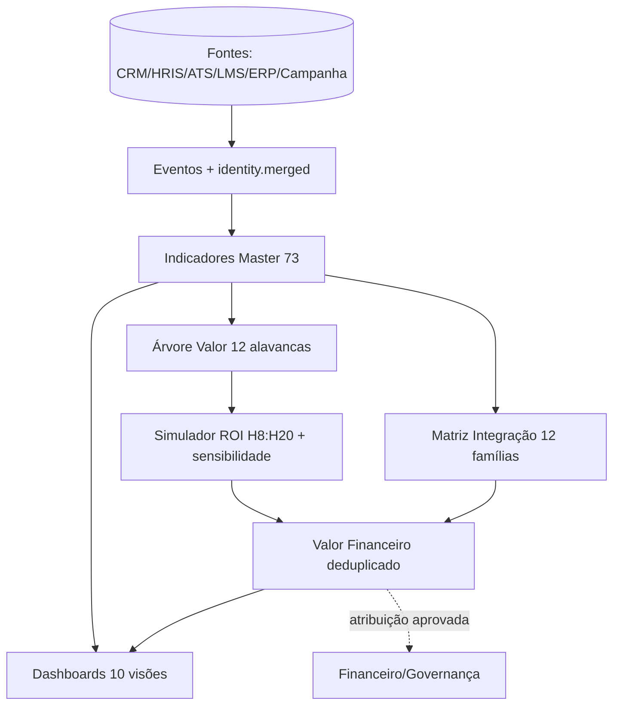

# Catálogo Canônico + Grafo v1 — P03-T05 (M03.C / G03.C1)

> **Status:** rascunho para validação Dados+Tech · **G03.C1** · Nenhuma métrica crítica com definição alternativa; catálogo permanece artefato de definição, sem certificação produção.
> **Fontes:** `04_Indicadores_Master.csv` (73 linhas), `05_Arvore_de_Valor`, `06_Simulador_ROI`, `07_Visoes_Dashboard`, `13_Matriz_Integracao` + sínteses [[01-work/dados-tech-financas/refinamento-modelo-dados/modelo-indicadores/sintese-entre-abas/indicator-financial-consistency|indicator-financial-consistency]].
>
> **Matriz unificada:** [[03-approved/nucleo-inteligencia/analises-processadas/Matriz_Convergencia_73_16_25_23_12_8|Matriz Convergencia]] — 73→16 KPIs, 25→23 nós, 12→8 módulos e M0-M4→F0-MVP4.

## 1. Resumo — 73 indicadores

**Total:** 73 indicadores em 8 vertentes: Pessoas 10, Empresas / RH 10, Compras / Fornecedores 9, Entidades / Ecossistema 8, Marketing / Mídia 8, Produto / Plataforma 10, Financeiro / Impacto 10, Inteligência / Dados 8.

| Vertente | Qtd | Prioridade M0 | Prioridade M1 | Prioridade M2 |
|---|---:|---|---|---|
| Pessoas | 10 | 6 | 4 | 0 |
| Empresas / RH | 10 | 6 | 4 | 0 |
| Produto / Plataforma | 10 | 7 | 3 | 0 |
| Entidades / Ecossistema | 8 | 4 | 4 | 0 |
| Marketing / Mídia | 8 | 4 | 4 | 0 |
| Compras / Fornecedores | 9 | 5 | 4 | 0 |
| Financeiro / Impacto | 10 | 5 | 5 | 0 |
| Inteligência / Dados | 8 | 3 | 5 | 0 |

## 2. Catálogo — ID | Indicador | Fórmula | Unidade | Dimensões | Owner | Tipo | Alavanca

| ID | Indicador | Fórmula | Unidade | Dimensões / cortes | Owner | Tipo | Alavanca financeira |
|---|---|---|---|---|---|---|---|
| PES-01 | Completude do perfil | campos essenciais preenchidos / campos essenciais esperados | % | empresa, região, persona | Produto | Leading | Qualidade / conversã |
| PES-02 | Índice de prontidão | Σ(nível × peso × confiança × recência) / Σ pesos | score 0–100 | competência, papel, cohort | Inteligência | Leading | Produtividade / cont |
| PES-03 | Gap crítico de capacidade | Σ pesos dos requisitos abaixo do nível mínimo | pontos | competência, função, empresa | RH | Leading | Produtividade / risc |
| PES-04 | Aceitação de recomendação | recomendações aceitas / recomendações entregues | % | modelo, tipo, canal | Produto | Leading | Conversão |
| PES-05 | Conclusão de jornada | jornadas concluídas / jornadas iniciadas | % | jornada, cohort, empresa | Produto / LMS | Leading | Produtividade / rete |
| PES-06 | Evolução de capacidade | score pós − score pré | p.p. ou score | competência, jornada, empresa | Inteligência | Lagging | Produtividade |
| PES-07 | Tempo até oportunidade | data oportunidade − data elegibilidade | dias | cohort, canal, empresa | Operações | Lagging | Receita / empregabil |
| PES-08 | Mobilidade / conexão efetiva | pessoas com outcome / pessoas com match aceito | % | tipo de outcome, cohort | Operações | Lagging | Receita / retenção |
| PES-09 | NPS da jornada | % promotores − % detratores | NPS | jornada, etapa, persona | CX | Lagging | Retenção / indicação |
| PES-10 | Valor gerado por pessoa | benefício financeiro atribuído / pessoas impactadas | R$/pessoa | empresa, programa, cohort | Financeiro | Lagging | Lucro / custo |
| RH-01 | Cobertura de capacidades | pessoas mapeadas / pessoas elegíveis | % | função, unidade, região | RH | Leading | Risco / planejamento |
| RH-02 | Risco de lacuna crítica | Σ(gap × criticidade × população exposta) | índice | função, unidade, capacidade | RH / Estratégia | Leading | Risco / produtividad |
| RH-03 | Time-to-fill | data aceite − data abertura | dias | função, senioridade, canal | Talent Acquisition | Lagging | Custo |
| RH-04 | Custo por contratação | custos atribuíveis / admissões | R$/contratação | canal, função, cohort | Talent Acquisition | Lagging | Custo |
| RH-05 | Qualidade da contratação | média ponderada(performance, retenção, fit) | score | função, canal, cohort | RH | Lagging | Produtividade / rete |
| RH-06 | Time-to-productivity | data marco − data admissão | dias | função, jornada, cohort | RH / Operação | Lagging | Produtividade |
| RH-07 | Turnover evitável | turnover controle − turnover exposto | p.p. | função, gestor, jornada | People Analytics | Lagging | Custo / retenção |
| RH-08 | Absenteísmo evitado | dias baseline − dias após | dias | unidade, cohort, causa | RH | Lagging | Produtividade / cust |
| RH-09 | Ganho de produtividade | pessoas × custo anual × % ganho × atribuição | R$ | unidade, programa, cohort | Financeiro | Lagging | Lucro / produtividad |
| RH-10 | ROI de desenvolvimento | (benefícios atribuídos − custo total) / custo total | % | programa, unidade, cohort | Financeiro / RH | Lagging | ROI |
| COM-01 | Cobertura de categorias | categorias cobertas / categorias prioritárias | % | categoria, região, porte | Compras | Leading | Risco / continuidade |
| COM-02 | Tempo de homologação | data aprovação − data início | dias | categoria, complexidade | Compras | Lagging | Custo / ciclo |
| COM-03 | Taxa de match elegível | matches elegíveis / matches gerados | % | categoria, modelo, entidade | Inteligência | Leading | Conversão / risco |
| COM-04 | Ciclo de contratação | data contrato − data demanda | dias | categoria, valor, complexidade | Compras | Lagging | Custo / receita |
| COM-05 | Conversão match → contrato | contratos / matches aceitos | % | categoria, entidade, empresa | Marketplace | Lagging | Receita / eficiência |
| COM-06 | Saving comprovado | (preço referência − preço realizado) × volume × atribuição | R$ | categoria, contrato, empresa | Compras / Financeiro | Lagging | Custo / margem |
| COM-07 | Desempenho do fornecedor | média ponderada(qualidade, prazo, SLA, risco) | score | categoria, fornecedor | Compras | Lagging | Risco / custo |
| COM-08 | Spend influenciado pela HUB | Σ valor dos contratos influenciados | R$ | categoria, empresa, entidade | Marketplace | Lagging | GMV / take rate |
| COM-09 | Risco de fornecimento evitado | perda esperada baseline × redução × atribuição | R$ | categoria, risco, empresa | Riscos | Lagging | Risco evitado |
| ENT-01 | Cobertura de associados | associados com dados / associados ativos | % | setor, região, porte | Entidade | Leading | Retenção / inteligên |
| ENT-02 | Ativação de associados | associados com evento-chave / associados elegíveis | % | serviço, segmento | CS | Leading | Retenção / expansão |
| ENT-03 | Densidade da rede | conexões efetivas / conexões qualificadas possíveis | % | tipo de conexão, setor | Inteligência | Lagging | Receita / inovação |
| ENT-04 | Valor entregue por associado | benefício atribuído / associados ativos | R$/associado | segmento, serviço | Financeiro / Entidade | Lagging | Retenção / receita |
| ENT-05 | Renovação de associados | renovações / contratos elegíveis | % | tier, segmento, uso | CS | Lagging | Receita recorrente |
| ENT-06 | Receita de novos serviços | Σ receita reconhecida de serviços com origem HUB | R$ | serviço, entidade, segmento | Comercial | Lagging | Receita / margem |
| ENT-07 | Adoção de benchmark | associados com ação / associados expostos | % | tema, segmento | Inteligência | Lagging | Produtividade / risc |
| ENT-08 | Impacto econômico do ecossistema | Σ benefícios atribuídos e deduplicados | R$ | entidade, setor, região | Financeiro | Lagging | Impacto / retenção |
| MKT-01 | Alcance qualificado | usuários únicos elegíveis alcançados | pessoas/empresas | canal, campanha, segmento | Marketing | Leading | Pipeline |
| MKT-02 | Custo por lead qualificado | custo de mídia / leads qualificados | R$/lead | canal, campanha, ICP | Marketing | Lagging | CAC / custo |
| MKT-03 | Conversão lead → oportunidade | oportunidades / leads qualificados | % | canal, campanha, segmento | Marketing / Vendas | Lagging | Pipeline / receita |
| MKT-04 | Pipeline influenciado | Σ valor oportunidade × probabilidade × peso de atribuição | R$ | canal, campanha, produto | RevOps | Lagging | Receita |
| MKT-05 | Margem incremental de campanha | receita incremental × margem × atribuição | R$ | canal, campanha, cohort | Financeiro / Marketing | Lagging | Lucro |
| MKT-06 | ROAS de margem | margem atribuída / investimento de mídia | x | canal, campanha | Marketing | Lagging | ROI |
| MKT-07 | CAC por produto | custos de marketing e vendas / novos clientes | R$/cliente | produto, canal, segmento | RevOps | Lagging | Unit economics |
| MKT-08 | Conteúdo → ação | usuários com evento-chave / usuários expostos | % | tema, canal, persona | Conteúdo | Leading | Conversão |
| PRO-01 | Ativação | usuários ativados / novos usuários | % | persona, origem, empresa | Produto | Leading | Retenção / conversão |
| PRO-02 | WAU/MAU | WAU / MAU | % | persona, módulo, empresa | Produto | Leading | Retenção |
| PRO-03 | Adoção por módulo | ativos no módulo / elegíveis | % | módulo, persona, plano | Produto | Leading | Expansão / churn |
| PRO-04 | Time-to-value | data primeiro valor − data início | dias | persona, produto, implantação | CS / Produto | Lagging | Churn / custo |
| PRO-05 | Retenção de cohort | ativos no período / cohort inicial | % | cohort, plano, módulo | Produto | Lagging | LTV / receita |
| PRO-06 | Churn de clientes | clientes cancelados / clientes no início | % | produto, segmento, uso | CS | Lagging | Receita recorrente |
| PRO-07 | Precisão do match | NDCG@k, precision@k ou aceitos/top k | score | modelo, oportunidade, segmento | Data Science | Lagging | Conversão / ciclo |
| PRO-08 | Uplift da recomendação | outcome tratamento − outcome controle | p.p. | modelo, ação, segmento | Data Science | Lagging | Receita / custo |
| PRO-09 | ARR | MRR recorrente × 12 | R$ | produto, entidade, segmento | Financeiro | Lagging | Receita recorrente |
| PRO-10 | LTV/CAC | ((ARPA × margem bruta) / churn mensal) / CAC | x | produto, cohort, segmento | Financeiro | Lagging | Unit economics |
| FIN-01 | Benefício bruto atribuído | Σ benefícios atribuídos por alavanca | R$ | cliente, programa, alavanca | Financeiro | Lagging | Valor total |
| FIN-02 | Benefício líquido | benefício bruto − investimento total | R$ | cliente, programa | Financeiro | Lagging | Lucro / ROI |
| FIN-03 | ROI do cliente | (benefício bruto − investimento) / investimento | % | cliente, programa, cenário | Financeiro | Lagging | ROI |
| FIN-04 | Payback | investimento / (benefício anual / 12) | meses | cliente, programa | Financeiro | Lagging | Caixa |
| FIN-05 | Margem incremental | receita incremental × margem × atribuição | R$ | cliente, produto, origem | Financeiro | Lagging | Lucro |
| FIN-06 | Custo evitado | custo baseline − custo realizado − custos de mudança | R$ | centro de custo, alavanca | Controladoria | Lagging | Custo / margem |
| FIN-07 | Risco evitado | (probabilidade × impacto) baseline − residual | R$ | risco, controle, cliente | Riscos | Lagging | Risco |
| FIN-08 | Receita HUB por vertente | Σ receita reconhecida por vertente | R$ | vertente, produto, cliente | Financeiro HUB | Lagging | Receita |
| FIN-09 | Margem de contribuição HUB | (receita − custos variáveis) / receita | % | produto, cliente, projeto | Financeiro HUB | Lagging | Margem |
| FIN-10 | Receita recorrente líquida | MRR inicial + expansão − contração − churn | R$/mês | produto, cohort, segmento | Financeiro HUB | Lagging | Receita recorrente |
| DAT-01 | Completude de dados críticos | valores válidos / valores esperados | % | fonte, campo, domínio | Data Governance | Leading | Confiabilidade |
| DAT-02 | Atualidade dos dados | registros no SLA / registros esperados | % | fonte, domínio | Data Engineering | Leading | Risco / decisão |
| DAT-03 | Taxa de identidade resolvida | identidades resolvidas / registros elegíveis | % | fonte, entidade | Data Engineering | Leading | Atribuição / qualida |
| DAT-04 | Cobertura de score | casos com score / casos elegíveis | % | modelo, segmento | Data Science | Leading | Escala |
| DAT-05 | Acurácia / calibração | métrica adequada ao modelo: AUC, MAE, Brier | score | modelo, cohort, segmento | Data Science | Lagging | Conversão / risco |
| DAT-06 | Fairness do modelo | máx diferença entre grupos em métrica definida | p.p. | grupo, modelo, decisão | AI Governance | Lagging | Risco / confiança |
| DAT-07 | Drift de dados / modelo | PSI / divergência / delta de performance | índice | feature, modelo, segmento | Data Science | Leading | Risco / performance |
| DAT-08 | Índice de confiança do impacto | média ponderada(baseline, controle, amostra, rastreabilid... | score 0–100 | indicador, cliente, programa | Inteligência / Financeiro | Lagging | Confiança |

## 3. Grafo de dependências

**Cadeia canônica:** `DAT-01/02/03` (identidade, evento, completude) → eventos/match → indicadores → contrato/transação → fato financeiro deduplicado → atribuição aprovada → dashboards/Simulador.

## 4. Resolução — definições alternativas (G03.C1)

| Métrica crítica | Definição alternativa detectada | Definição canônica v1 | Regra de controle |
|---|---|---|---|
| MRR / ARR / NRR | soma vs anualização vs variação | MRR = recorrência mensal contratada; ARR = MRR×12; NRR = (MRR inicial + expansão - churn)/MRR inicial | nunca somar; ARR é anualização, NRR é variação coorte |
| Retenção (PRO-06/ENT-05/RH-07/FIN-10) | produto vs entidade vs pessoas vs receita | 4 retenções separadas por entidade (person, company, product, revenue) | denominador e população distintos |
| Time-to-value vs time-to-productivity | funis diferentes | PRO-04 = time-to-value (jornada), RH-06 = time-to-productivity (pessoa) | unidade e população declaradas |
| Produtividade vs receita incremental | horas vs margem | escolher horas/custo evitado **ou** output/margem; fator realização | decompor mecanismo, janela, teto por pessoa/período |
| Pipeline vs receita | estágios mesmo funil | pipeline = potencial; só contrato/transação realizado entra no fato financeiro | Matriz Integração nó `período` + `estado` |
| Risco evitado | ex ante vs ex post | risco evitado = esperado; perda preservada = real | separar ex ante de ex post |

**Resultado G03.C1:** nenhuma métrica crítica mantém definição alternativa após §4; 73/73 com fórmula, dimensão, owner e dependência únicos.

## 5. Pendências G03.C1 → G03.C2

- [ ] Validar com Dados+Tech as 73 fórmulas e 12 alavancas contra `06_Simulador_ROI` (corrigir H20 payback bruto vs líquido).
- [ ] Resolver `02-review/bloqueado` gaps: 4 colunas retenção/governança já adicionadas em P03-T04; validar consistência financeira.
- [ ] Publicar `08_Dicionario_Dados` com chaves e `13_Matriz_Integracao` com nós canônicos antes de P05.

## 6. Rastreabilidade

- Tarefa: [[04-project-management/tarefas/P03-T05_Catalogo_Metricas_Grafo|P03-T05]]
- Gap: [[00-project-control/registro-lacunas/lacunas/DAT-005]]
- Blueprint: [[02-review/01-blueprint/dados-inteligencia/HUB_Blueprint_Dados_e_Inteligencia#2. Arquitetura de indicadores de origem conectada às capacidades do produto e aos resultados de negócio|BP-003 §2]]
- Síntese: [[01-work/dados-tech-financas/refinamento-modelo-dados/modelo-indicadores/sintese-entre-abas/indicator-financial-consistency|indicator-financial-consistency]]
