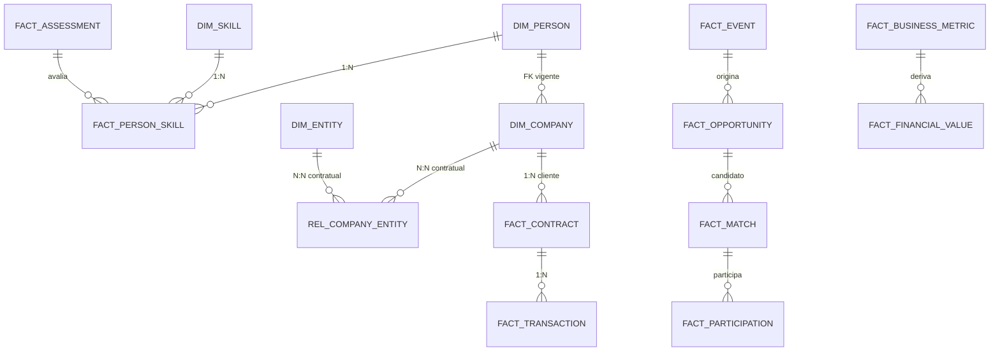

# Dicionário Físico Mapping v1 — P03-T04 (M03.B / G03.B2 **blocking: yes**)

> **Status:** rascunho para revisão Dados+Tech · **G03.B2** é bloqueador mínimo para liberar P03. Automação e cobertura adicional são extensões pós-MVP.
> **Depende de:** [[01-work/dados-tech-financas/refinamento-modelo-dados/modelo-logico-fisico-P03-T01-v1|modelo-logico-fisico-P03-T01-v1]] — 25 entidades com `canonical_id`.

## 1. Resumo — 18 tabelas físicas → entidades canônicas (54 campos)

| Tabela física | Campos | Entidade(s) canônica(s) | PK lógica | Propósito |
|---|---|---|---|---|
| `dim_person` | 4 | Person | `person_id` | Identidade pessoa pseudônima |
| `dim_company` | 3 | Company | `company_id` | Organização contratante |
| `dim_entity` | 1 | Entity | `entity_id` | Rede/entidade HUB |
| `rel_company_entity` | 6 | Company + Entity | `(tenant_id, company_id, entity_id, valid_from)` | Bridge N:N contratual, temporal e auditável |
| `dim_skill` | 2 | Skill | `skill_id` + `skill_version` | Taxonomia capacidade |
| `dim_cohort` | 1 | Cohort | `cohort_id` | População comparação |
| `dim_model_version` | 1 | ModelVersion | `model_version_id` | Versão modelo |
| `fact_person_skill` | 4 | Person + Skill + SkillEvidence | `person_id`+`skill_id`+`evidence_id` | Avaliação competência |
| `fact_assessment` | 3 | Assessment | `assessment_id` | Rodada diagnóstico |
| `fact_event` | 4 | Event | `event_id` | Evento canônico |
| `fact_opportunity` | 3 | Opportunity + Need | `opportunity_id` | Oportunidade + requisitos |
| `fact_match` | 3 | Match | `match_id` | Candidato matching |
| `fact_participation` | 2 | Participation | `participation_id` | Jornada/programa |
| `fact_contract` | 3 | Contract | `contract_id` | Contrato assinado; `company_id` é o papel Cliente |
| `fact_transaction` | 1 | Transaction | `transaction_id` | Transação reconhecida |
| `fact_business_metric` | 3 | BusinessMetric | `metric_id`+`period`+`cohort` | Métrica negócio |
| `fact_financial_value` | 4 | FinancialValue (deriv. BusinessMetric+Contract) | `financial_value_id` | Valor financeiro estados |
| `dim_consent` | 4 | Consent (N24) | `consent_id` | Bloqueador LGPD — finalidade, versão e revogação |

**Total:** 54 campos auditados no dicionário canônico; a expansão inclui `rel_company_entity` (bridge de primeira classe), `fact_contract.company_id` (papel Cliente), `dim_consent` (N24) e campos do envelope/evento.

**Regra Empresa–Entidade (E02):** `Company` ≠ `Entity`. Não existe FK direta entre as dimensões; toda ligação é lida e escrita exclusivamente em `rel_company_entity`. A bridge exige `tenant_id`, `provenance_ref`, `valid_from` e `valid_to`, com PK `(tenant_id, company_id, entity_id, valid_from)`, FKs para ambas as dimensões e `CHECK (valid_from < valid_to)`. Inclusões e encerramentos devem emitir `company_entity.linked`/`company_entity.unlinked` em `fact_event`; a evidência de tenant scoping, constraints e auditoria será publicada em `06-relatorios-validacao/entity-key-validation`.

### Gate de consentimento N24

| Tabela | Campo | Tipo | Chave | Entidade.Atributo canônico | Temporal |
|---|---|---|---|---|---|
| dim_consent | consent_id | UUID | PK | Consent.consent_id | `valid_from/to`, `version` |
| dim_consent | purpose | enum | — | Consent.purpose | `valid_from/to` |
| dim_consent | legal_basis | enum | — | Consent.legal_basis | `valid_from/to` |
| dim_consent | person_id | UUID | FK → dim_person.person_id | Consent.person_id (`titular_id` é alias legado) | `consent_status`, `revogado_em` |

`N24` é bloqueador: a coluna física canônica é `fact_consent.person_id` (`titular_id` é apenas alias legado); revogação propaga em até **5 minutos** para `fact_person_skill`, `fact_event` e `fact_match`; sem consentimento válido, novos usos e leituras sensíveis são rejeitados e registrados no CMP log.

## 2. Detalhamento — 48 campos → atributo canônico

| Tabela | Campo | Tipo | Chave | Entidade.Atributo canônico | Temporal |
|---|---|---|---|---|---|
| dim_person | person_id | UUID | PK | Person.person_id | `valid_from/to` |
| dim_person | company_id | UUID | FK → dim_company | Relationship.person_id+company_id | `valid_from/to` (via `rel_person_company`) |
| dim_person | consent_status | enum | — | Consent.status (por `purpose`) | `valid_from/to`, `version` |
| dim_person | profile_segment | string | — | Person.profile_segment | `valid_from/to` |
| dim_company | company_id | UUID | PK | Company.company_id | `valid_from/to` |
| dim_company | segment | enum | — | Company.segment | taxonomia versionada |
| dim_entity | entity_id | UUID | PK | Entity.entity_id | `valid_from/to` |
| rel_company_entity | company_id | UUID | FK → dim_company | Company.company_id (bridge) | `valid_from/to` |
| rel_company_entity | entity_id | UUID | FK → dim_entity | Entity.entity_id (bridge) | `valid_from/to` |
| rel_company_entity | tenant_id | UUID | escopo obrigatório | Tenant scoping da relação | toda vigência |
| rel_company_entity | valid_from | timestamp | PK componente | Início do vínculo contratual | obrigatório; UTC |
| rel_company_entity | valid_to | timestamp | — | Fim do vínculo contratual | obrigatório; UTC |
| rel_company_entity | provenance_ref | string | auditoria obrigatória | Referência da origem/evidência | imutável por versão |
| dim_skill | skill_id | UUID | PK | Skill.skill_id | `skill_version` |
| dim_skill | skill_version | string | — | Skill.version | `valid_from/to` |
| dim_cohort | cohort_id | UUID | PK | Cohort.cohort_id | `valid_from/to` |
| dim_model_version | model_version_id | UUID | PK | ModelVersion.model_version_id | `trained_from/to` |
| fact_person_skill | person_id | UUID | FK | Person.person_id | `assessed_at` |
| fact_person_skill | skill_id | UUID | FK | Skill.skill_id | `skill_version` |
| fact_person_skill | level | decimal 0–5 | — | SkillEvidence.level | `assessed_at`, `valid_to` |
| fact_person_skill | confidence | decimal 0–1 | — | SkillEvidence.confidence | `assessed_at` |
| fact_assessment | assessment_id | UUID | PK | Assessment.assessment_id | `assessed_at` |
| fact_assessment | person_id | UUID | FK | Person.person_id | `assessed_at` |
| fact_assessment | instrument_version | string | — | Assessment.instrument_version | `valid_from/to` |
| fact_event | event_id | UUID | PK | Event.event_id | `occurred_at`/`recorded_at` |
| fact_event | event_type | string | — | Event.event_type | `schema_version` |
| fact_event | subject_id | UUID | FK | Event.subject_canonical_id + object_type | `occurred_at` |
| fact_event | occurred_at | timestamp | — | Event.occurred_at (UTC) | `valid_from/to` quando aplicável |
| fact_opportunity | opportunity_id | UUID | PK | Opportunity.opportunity_id | `valid_from/to` |
| fact_opportunity | skill_id | UUID | FK | Skill.skill_id (via Need) | requisito ponderado |
| fact_opportunity | weight | decimal | — | Need.weight | `valid_from/to` |
| fact_match | match_id | UUID | PK | Match.match_id | `generated_at`, `expires_at` |
| fact_match | opportunity_id | UUID | FK | Opportunity.opportunity_id | `generated_at` |
| fact_match | confidence | decimal | — | Match.confidence | `model_version_id` |
| fact_participation | participation_id | UUID | PK | Participation.participation_id | `enrolled_at`/`completed_at` |
| fact_participation | person_id | UUID | FK | Person.person_id | `valid_from/to` |
| fact_contract | contract_id | UUID | PK | Contract.contract_id | `signed_at`, `valid_from/to` |
| fact_contract | company_id | UUID | FK → dim_company; obrigatório | Company.company_id como papel Cliente | `signed_at`, `valid_from/to` |
| fact_contract | opportunity_id | UUID | FK | Opportunity.opportunity_id | `valid_from/to` |
| fact_transaction | transaction_id | UUID | PK | Transaction.transaction_id | `recognized_at` |
| fact_business_metric | metric_id | UUID | PK parcial | BusinessMetric.metric_id | `definition_version`, `period` |
| fact_business_metric | period | date | — | BusinessMetric.period | `period` + `cohort_id` |
| fact_business_metric | value | decimal | — | BusinessMetric.value | `run_id`, `formula_version` |
| fact_financial_value | financial_value_id | UUID | PK | FinancialValue.id (BusinessMetric+Contract) | `recognized_at`, `state` |
| fact_financial_value | state | enum | — | FinancialValue.state (`potencial/influenciado/validado/realizado`) | `valid_from/to` |
| fact_financial_value | amount | decimal | — | FinancialValue.amount | `competence_date` |
| fact_financial_value | contract_id | UUID | FK | Contract.contract_id | `recognized_at` |

> **Contrato–Cliente (E02):** `fact_contract.company_id` é obrigatório e, junto de `contract_id`, materializa `Company` no papel `Cliente`; não é uma entidade `Cliente` adicional. A relação deve respeitar `tenant_id` e a vigência contratual da bridge quando houver vínculo Company–Entity.

## 3. Contradições `abas-origem/` vs `03-csv-corrigido/` — resolvidas

| Aspecto | `abas-origem/08_Dicionario_Dados.csv` (12 cols) | `03-csv-corrigido/08_Dicionario_Dados.csv` (16 cols) | Resolução (DAT-010) |
|---|---|---|---|
| Colunas | Tabela, Campo, Tipo, Definição, Chave, Obrigatório, Exemplo, Sensibilidade, Base legal, Origem, Frequência, Regra qualidade | + **Retenção, Controle de acesso, Consentimento/revogação, Evidência** | 4 colunas adicionadas são **mínimo bloqueador G03.B2** para lineage auditável; `abas-origem` é espelho histórico |
| `dim_person.company_id` | FK sem retenção declarada | + `60 meses ou contrato + obrigação legal`, `purpose-scoped RBAC` | Alinhado a LGPD — retenção por finalidade, não global |
| `dim_person.consent_status` | sem propagação | + `revogação bloqueia novos usos <=5 min`, `CMP log + propagation test` | Propagação finalidade derivada exigida por DAT-008/010 |
| `fact_person_skill` | nível/confiança sem evidência | + `consent event + load scan`, `range test + lineage` | Evidência reproduzível exigida |
| `fact_event` | 4 campos sem retenção | + `36 meses`, `restricted event role`, `ID uniqueness + DSAR link` | Retenção e DSAR auditáveis |
| Linhas | 41 campos (linhas 5–45) idênticas em conteúdo base | mesmas 41 linhas + metadados governança | Nenhuma divergência de Tipo/Definição/Chave; apenas metadados adicionados |

**Registro auditável:** `02-review/bloqueado/modelo-indicadores/rascunho-nao-aprovado-v2/indicadores-xlsx/04-registro-correcoes/corrections.csv` — 4 novas entradas `DAT010-001` a `DAT010-004` (categoria `governanca`, `schema`, `evidencias`) com `source_csv`=`08_Dicionario_Dados.csv`, `status=proposed` → `aprovado` após revisão Dados+Tech.

## 4. Diagrama físico simplificado

## 5. Pendências G03.B2 (blocking mínimo)

- [x] Dicionário 41 campos mapeado para entidades canônicas — **este arquivo**
- [ ] `04-registro-correcoes/corrections.csv` — 4 entradas DAT010 aprovadas por Dados+Tech (bloqueador)
- [ ] `06-relatorios-validacao/entity-key-validation` e `roi-recalculation` passarem com novo dicionário
- Extensões pós-MVP: automação reconciliação e cobertura adicional fontes

## 6. Rastreabilidade

- Tarefa: [[04-project-management/tarefas/P03-T04_Dicionario_Fisico_Mapping|P03-T04]]
- Gap: [[00-project-control/registro-lacunas/lacunas/DAT-010]] — blocking: yes em G03.B2
- Modelo: [[01-work/dados-tech-financas/refinamento-modelo-dados/modelo-logico-fisico-P03-T01-v1|P03-T01 v1]] — 25 entidades
- Fontes: `05-resources/fontes/modelo-indicadores/08_Dicionario_Dados.csv` (12 cols, espelho) vs `02-review/bloqueado/.../03-csv-corrigido/08_Dicionario_Dados.csv` (16 cols, fonte para reconstrução)
