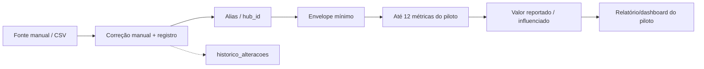

# Fluxos mínimos de linhagem, replay e DSAR — P03-T09

> **Escopo aprovado para o piloto SEBRAE (28/10):** evidência manual e reproduzível para a spine de 12 entidades, envelope mínimo, replay por `run_id`, reconciliação de `counts/keys/totals` e DSAR manual. Não é implementação da plataforma full.
>
> **Estado:** rascunho em revisão. O XLSX reconstruído e os três relatórios são evidência de trabalho não aprovada; não há promoção para `02-review/aprovado/` ou `03-approved/`.

## 1. Spine do piloto e linhagem mínima

As 12 entidades congeladas no piloto são: `fornecedor`, `comprador`, `oportunidade`, `inscricao`, `diagnostico`, `match`, `reuniao`, `proposta`, `contrato`, `receita_reportada`, `consentimento` e `historico_alteracoes`. Chaves e definições são as de [[01-work/dados-tech-financas/refinamento-modelo-dados/spine-piloto-minimo-v1]].

Cada transformação é anotada manualmente com `transformation`, `version`, `actor`, `time`, `quality`, `authorization` e `run_id`. A evidência fica no registro de alterações e nos logs do piloto; nenhum resultado é tratado como produção.

## 2. Envelope mínimo por evento

Toda mutação da spine gera, quando operacionalmente possível, um envelope com estes campos obrigatórios: `event_id`, `event_type`, `occurred_at` (UTC), `recorded_at` (UTC), `source_system`, `actor`, `entity_ref` e `payload_minimo`. `consentimento_id` é **condicional e obrigatório quando o payload contiver dado pessoal**. O contrato de referência é [[01-work/dados-tech-financas/refinamento-modelo-dados/envelope-evento-schema-P03-T03-v1]]; replay ordena por `occurred_at`.

## 3. Correção auditável (DAT-010)

No piloto, a correção é manual: registrar antes/depois, motivo, ator, horário, evidência e `run_id` em `04-registro-correcoes/corrections.csv`. Os quatro itens `DAT010-001..004` permanecem rastreáveis. A diferença entre fonte de origem e CSV corrigido (12/16 colunas) é uma evidência da reconstrução, não uma autorização para substituir a fonte silenciosamente.

Evidência direta: `02-review/bloqueado/modelo-indicadores/rascunho-nao-aprovado-v2/indicadores-xlsx/04-registro-correcoes/corrections.csv`.

## 4. Replay manual e reconciliação

1. Congelar os envelopes do lote, incluindo `event_id`, `schema_version`, `code_version` e `config_version` quando disponíveis.
2. Copiar o lote para uma execução isolada e atribuir `run_id` novo (exemplo: `run_001` → `run_002`); não escrever em produção.
3. Reprocessar manualmente na ordem de `occurred_at`.
4. Comparar e registrar **counts**, **keys** e **totals** (`counts/keys/totals`) entre as execuções; também anotar duplicatas, eventos tardios e deltas esperados, mesmo que não sejam automatizados.
5. Aceitar o replay do piloto somente quando a divergência for explicada e o ator/horário estiverem no `historico_alteracoes`.

Reconciliação mínima reproduzível (modelo de registro):

| Campo | `run_001` | `run_002` | Resultado esperado |
|---|---:|---:|---|
| `counts` por entidade/evento | registrar | registrar | igual ou delta explicado |
| conjunto de `keys` (`*_id`, `event_id`) | registrar hash/lista | registrar hash/lista | igualdade; sem órfão novo |
| `totals` financeiros (BRL) | registrar | registrar | igual ou delta explicado |

Os relatórios existentes registram `run_entity_key_P03T09_001`, `run_roi_P03T09_001` e `run_corrected_P03T09_001`; eles são referências históricas de validação, não prova de execução full atual. O piloto não reivindica reconciliação automatizada nem “3/3 full validation”.

## 5. DSAR e portabilidade manual

Para cada pedido, um operador registra titular, escopo, ator, timestamps, autorização, `run_id` e evidência de conclusão:

| Pedido | Procedimento manual do piloto | Escopo mínimo |
|---|---|---|
| `dsar.access` | localizar `person_id`/fornecedor e aliases; exportar JSON/CSV com provenance | spine do titular, consentimentos e eventos |
| `dsar.delete` | marcar exclusão, invalidar aliases e remover/quarentenar cópias controladas; registrar exceções | `identity_alias`, dimensões/fatos do piloto, features, caches, backups e exports parceiros quando existentes |
| `dsar.portability` | entregar export estruturado com schema, `valid_from/to` e provenance | dados do titular e consentimentos por finalidade |

Revogação de consentimento gera `consent.revoked` e marcação de quarentena manual; o alvo operacional do desenho é **≤5 min**, mas não está declarado como testado neste artefato. Referência de finalidade/retenção: [[01-work/dados-tech-financas/refinamento-modelo-dados/matriz-dados-finalidade-P03-T08-v1]].

## 6. XLSX reconstruído — evidência não aprovada

O arquivo foi reconstruído manualmente a partir de `03-csv-corrigido/` e `04-registro-correcoes/corrections.csv`, preservando a contradição 12/16 colunas para revisão. O escopo **full declarado** (41 campos, 15 abas de dados, 73 indicadores) é **não aprovado/deferred**; não pertence ao mínimo de 12 entidades/métricas do piloto e não pode ser promovido. A inspeção local do XLSX como ZIP encontrou 16 arquivos `xl/worksheets/sheet*.xml`, correspondentes a 16 planilhas visíveis: as 15 abas funcionais do manifesto (`00_Leia-me` até `14_RACI`) mais `00_DRAFT_NOTICE`. `00_DRAFT_NOTICE` é uma folha visível de aviso de rascunho, não oculta nem helper de dados; portanto a divergência era de escopo/nomenclatura (15 abas de dados versus 16 planilhas no pacote), não uma planilha XML órfã. A contagem autoritativa do workbook é **16 worksheets (15 funcionais + 1 aviso)**.

Arquivo: `02-review/bloqueado/modelo-indicadores/rascunho-nao-aprovado-v2/indicadores-xlsx/05-pastas-trabalho-rascunho/HUB_Mapa_Inteligencia_Dados_Indicadores_RECONSTRUIDO_P03-T09_v1.xlsx`.

Relatórios de trabalho, todos sob `02-review/bloqueado/modelo-indicadores/rascunho-nao-aprovado-v2/indicadores-xlsx/06-relatorios-validacao/`:

- `entity-key-validation-P03-T09.md` — relatório declara PASS histórico (45 entidades/42 eventos).
- `roi-recalculation-P03-T09.md` — relatório declara PASS reproduzível histórico (R$1.220.000 bruto, R$270.000 líquido, ROI 28,42%).
- `corrected-csv-validation-P03-T09.md` — relatório declara PASS histórico (15/15 CSVs, 16 colunas).

Esses artefatos não autorizam promoção, nem substituem aprovação Dados + Tech + LGPD em `DEC-P03-T09.md` (que não é criado por esta tarefa).

## 7. Bloqueios e fronteira full

- `DAT-009` (linhagem/replay/DSAR) e `DAT-010` (fonte verdade/XLSX) permanecem `blocking: yes` até revisão e decisão formal.
- Este documento não cria dados sintéticos, não executa pipeline full e não prova 3/3 validação full.
- Permanecem deferred: linhagem ponta a ponta automatizada, replay isolado automatizado, DSAR automatizado, reconciliação multi-fonte e o pacote completo 41/15/73.
- Promoção para `02-review/aprovado/` ou `03-approved/` exige validações realmente executadas e aprovação formal; não ocorre no piloto nem nesta tarefa (sem promoção para 02-review/aprovado ou 03-approved).

## 8. Rastreabilidade

- Tarefa: [[04-project-management/tarefas/P03-T09_Fluxos_Linhagem_Replay_DSAR|P03-T09]]
- Spine: [[01-work/dados-tech-financas/refinamento-modelo-dados/spine-piloto-minimo-v1]]
- Gaps: [[00-project-control/registro-lacunas/lacunas/DAT-009]] · [[00-project-control/registro-lacunas/lacunas/DAT-010]]
- Dependências: [[01-work/dados-tech-financas/refinamento-modelo-dados/modelo-logico-fisico-P03-T01-v1|P03-T01]] · [[01-work/dados-tech-financas/refinamento-modelo-dados/envelope-evento-schema-P03-T03-v1|P03-T03]] · [[01-work/dados-tech-financas/refinamento-modelo-dados/matriz-dados-finalidade-P03-T08-v1|P03-T08]]
