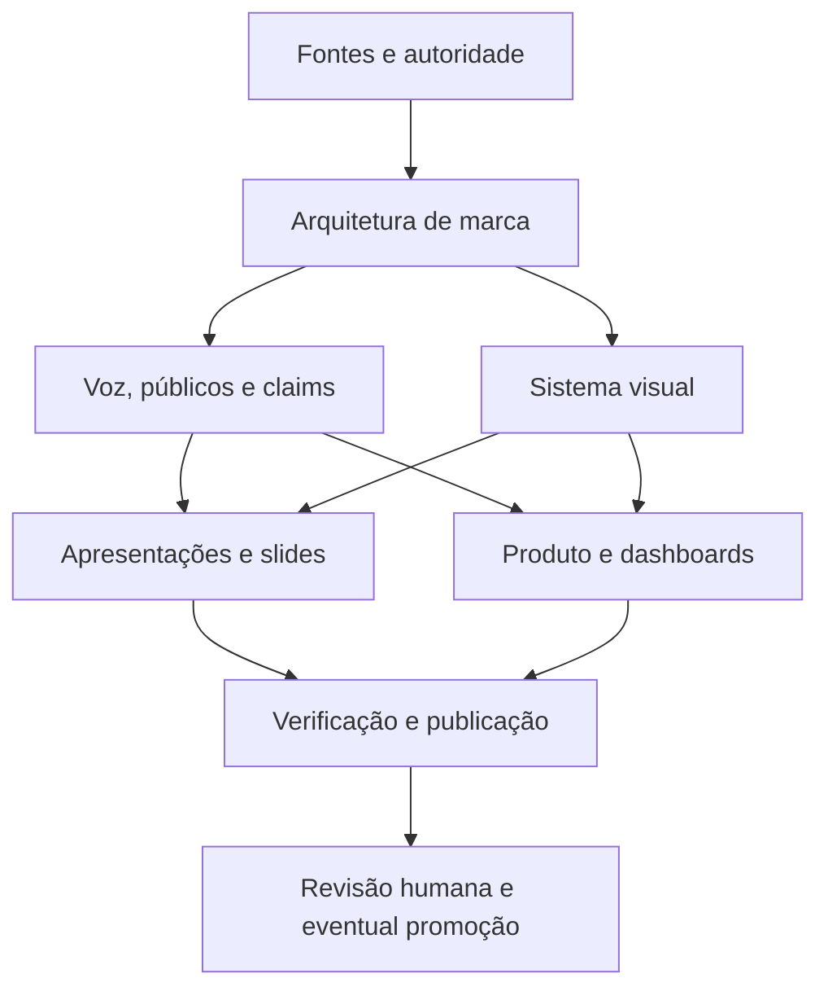

# Roteamento de agentes — Plataforma de Marca HUB

## 1. Roteamento rápido

| Necessidade | Primeiro agente | Próximo handoff |
|---|---|---|
| Nome, posicionamento, públicos ou arquitetura de marca | Estrategista de marca | Governança verbal; depois verificação |
| Claim, mensagem pública ou nível de evidência | Governança verbal | Estrategista de marca se mudar posicionamento; depois verificação |
| Cor, tipografia, grid, imagem ou acessibilidade visual | Sistema visual | Apresentações e Produto/Dashboards; depois verificação |
| Deck, narrativa ou biblioteca de slides | Sistema de apresentações | Governança verbal e Sistema visual; depois verificação |
| Dashboard, componente ou protótipo | Produto, protótipos e dashboards | Sistema visual e Governança verbal; depois verificação |
| Conflito entre documentos ou dúvida sobre maturidade | Verificação e integração | Coordenação humana |

## 2. Ordem de dependência

## 3. Primeira onda de delegação

### Onda 1 — entendimento e decisões

1. Estrategista de marca: mapear entidades, públicos, ofertas e decisões pendentes.
2. Governança verbal: transformar o claim registry em estrutura operacional sem aprovar claims.
3. Sistema visual: inventariar referências visuais e propor o conjunto mínimo de tokens, explicitamente provisório.

Essas tarefas podem ser executadas em paralelo porque seus arquivos de escrita são separados. Devem compartilhar somente evidências e dúvidas.

### Onda 2 — produção reutilizável

4. Sistema de apresentações: criar templates e biblioteca inicial com base nos outputs das ondas anteriores.
5. Produto, protótipos e dashboards: criar padrões de interface e visualização alinhados aos tokens.

Essas tarefas devem começar depois que a Onda 1 produzir uma primeira leitura de arquitetura, claims e tokens.

### Onda 3 — integração

6. Verificação e integração: revisar coerência, links, status, fontes, dependências e critérios de aceitação.
7. Coordenação humana: resolver decisões de marca, claims, white-label e aprovação.

## 4. Regras de escolha

- Se a tarefa muda o que a HUB diz, roteie para Governança verbal.
- Se a tarefa muda a relação entre entidades, roteie para Estrategista de marca.
- Se a tarefa muda como algo aparece, roteie para Sistema visual.
- Se a tarefa muda como algo é apresentado em narrativa, roteie para Sistema de apresentações.
- Se a tarefa muda como alguém usa ou interpreta um produto ou dashboard, roteie para Produto/Dashboards.
- Se a tarefa cruza dois ou mais domínios, escolha um agente principal e registre os demais como revisores, evitando escrita concorrente.

