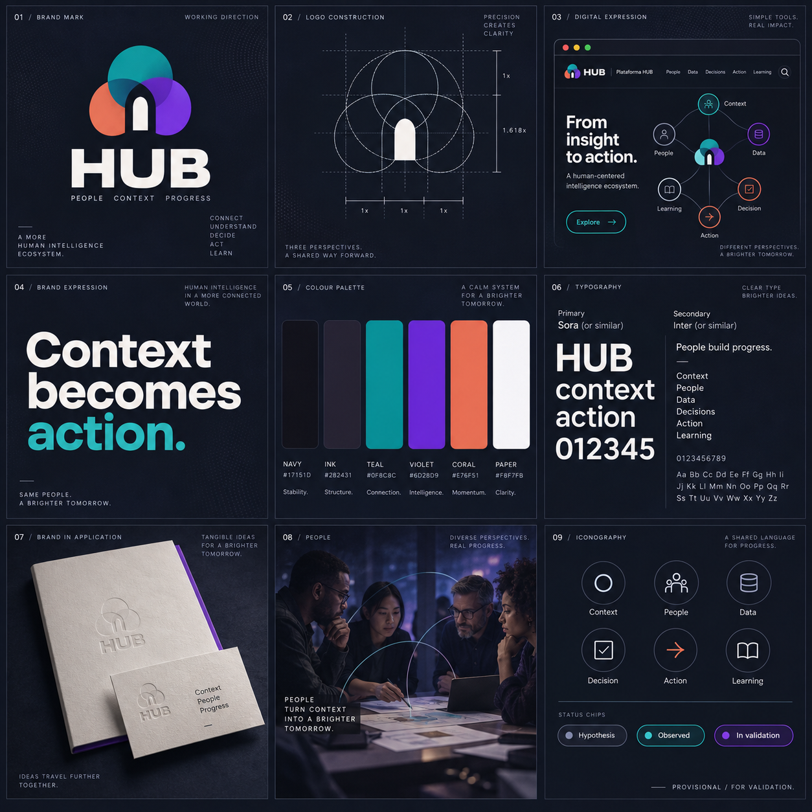

# HUB — brand kit / working direction



## Intent

Premium identity exploration for HUB as a human-centered intelligence ecosystem connecting context, data, people, decisions, action, and learning.

## System shown

- Geometric connection mark with three overlapping perspectives and a protected negative-space center.
- Navy/charcoal structure with paper white, teal connection, violet emphasis, and muted coral energy.
- Display sans direction similar to Sora with a readable utility sans direction similar to Inter.
- Editorial, calm-system applications across product, print, image direction, and iconography.
- Explicit maturity language: `hypothesis`, `observed`, `in validation`.

## Brand-guidelines application

The following tokens translate the board into reusable artifact guidance. They are implementation-ready recommendations, but remain provisional until the HUB identity system is approved.

```css
:root {
  --brand-primary: #6D28D9; /* emphasis / action */
  --brand-secondary: #0F8C8C; /* connection */
  --brand-accent: #E76F51; /* controlled energy */
  --brand-dark: #17151D; /* structure / strong text */
  --brand-light: #F8F7FB; /* paper / reading surface */
  --brand-text: #282431;
  --brand-text-muted: #6B6675;
  --brand-border: #E2DFEA;
  --font-display: 'Sora', system-ui, sans-serif;
  --font-body: 'Inter', system-ui, sans-serif;
  --font-mono: 'SFMono-Regular', 'Roboto Mono', monospace;
  --space-1: 4px;
  --space-2: 8px;
  --space-3: 12px;
  --space-4: 16px;
  --space-6: 24px;
  --space-8: 32px;
  --space-12: 48px;
  --space-16: 64px;
}
```

### Application rules

- Use `--brand-dark` for structure and primary text, `--brand-light` for reading surfaces, teal for relationships, and violet for emphasis or action.
- Use coral sparingly and never as the sole indicator of status, evidence, risk, maturity, or impact.
- Keep a minimum 4.5:1 contrast target for normal text and pair color with labels, icons, patterns, or position for status communication.
- Use Sora, or a licensed equivalent, for display and headings; use Inter, or a licensed equivalent, for body copy, controls, tables, and metrics.
- Use a 4 px base rhythm with recurring 8, 16, 24, 32, and 48 px spacing. Preserve generous whitespace and a single dominant message per surface.
- Maintain clear space around the HUB mark and do not place it over complex imagery without a controlled background or contrast check.
- For presentation artifacts, use dark navy covers with light text and light content surfaces with navy text; repeat one accent per surface rather than the full palette.

## Guardrails

This is a generated visual direction, not an approved logo, palette, type license, claim, certification, or public template. Validate logo ownership, source assets, font licensing, contrast, application behavior, and brand architecture before promotion to review or approval.
