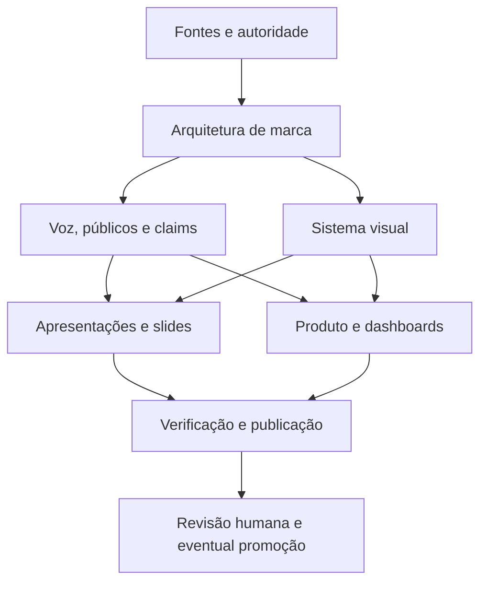

# Plataforma de marca HUB — referência de design

> Guia de consulta rápida para criar interfaces, dashboards, apresentações e protótipos coerentes com o sistema visual HUB selecionado e a plataforma de marca em desenvolvimento.

**Status:** sistema visual selecionado pelo usuário / estratégia e implementação ainda em desenvolvimento
**Escopo:** estratégia de marca, identidade verbal e visual, sistema de apresentação, produto, dashboards e governança  
**Fonte:** arquivos existentes em `01-work/documentacao-tecnica/plataforma-de-marca/`  
**Atualizado em:** 2026-09-16

## Como usar este documento

Comece pelo resumo e pelos blocos de decisão abaixo. Consulte o índice para encontrar a especificação detalhada. O apêndice mantém um snapshot do conteúdo incorporado na consolidação; para o estado corrente, prevalecem os arquivos-fonte vinculados e suas decisões mais recentes.

### Hierarquia de autoridade

1. **Aprovado:** somente documentos em `03-approved/` e decisões formalmente registradas como aprovadas.
2. **Em revisão:** referências em `02-review/`; podem orientar análise, mas não são templates vigentes.
3. **Selecionado ou provisório:** todo este pacote em `01-work/`; logo, paleta e tipografia selecionados estão registrados, enquanto tokens de runtime, claims, nomes, componentes e regras detalhadas ainda podem exigir gate próprio.
4. **Histórico:** materiais em `99-archive/` ou decks antigos; servem para contexto, não para reutilização automática.

### Regra de leitura

Separe sempre **observado**, **recomendado**, **ilustrativo**, **validado** e **aprovado**. Não transforme uma referência visual, um protótipo, um número ilustrativo ou um claim registrado como hipótese em regra pública.

## Resumo para criação de designs

### Sistema visual selecionado

- Logo selecionado: símbolo geométrico entrelaçado, wordmark `HUB.` com ponto coral/vermelho e versões positiva, negativa, isolada, circular, editorial e digital.
- Paleta selecionada: `#0D1322` navy, `#2B1433` plum, `#5A2D6E` violeta, `#B23A6B` magenta, `#E15A4F` coral e `#2A6A7E` teal.
- Tipografia selecionada: `Sora` para display e headings; `Inter` para leitura, controles, tabelas, métricas e interface.
- Ritmo de 4 px, com recorrência de 8 px; grid inicial de 12 colunas desktop, 8 tablet e 4 mobile.
- Superfícies com bordas sutis, raios moderados e sombra baixa ou nenhuma.
- Uma mensagem principal por superfície; preservar espaço, alinhamento e leitura.

### Regras que não podem ser esquecidas

- Cor nunca é o único indicador de status, evidência, erro, prioridade ou maturidade.
- Claims devem carregar fonte, período, owner, status, validade e limitação quando aplicável.
- Gráficos e métricas devem exibir definição, unidade, período, fonte e limitação material.
- Não insinuar aprovação, certificação, ROI, impacto causal, autonomia ou autoridade por meio de cor, badge, elevação ou linguagem.
- Assets precisam de origem, autor, licença, data, transformação, contexto de uso e status.
- Foco visível, labels explícitos, contraste medido, suporte a zoom/reflow e alternativa textual fazem parte do componente.

## Índice de consulta

| Preciso criar... | Consulte primeiro |
|---|---|
| Direção estratégica e arquitetura | `01-plataforma-estrategica/` |
| Voz, tom, mensagens e claims | `02-identidade-verbal/` |
| Cores, tipografia, logo, grid e imagens | `03-identidade-visual/` |
| Deck, narrativa, gráficos e notas de evidência | `04-sistema-de-apresentacoes/` |
| Interface, componentes, métricas e dashboards | `05-sistema-de-produto-e-dashboards/` |
| Aprovação, maturidade, RACI e changelog | `06-governanca-e-publicacao/` |
| Fontes, direitos, visuais e decks históricos | `99-referencias/` |
| Limites, owners, lifecycle e handoff | `00-controle/` |

## Baseline técnico de tokens

Os valores abaixo são a seleção visual registrada para orientar documentos e protótipos. A implementação final ainda depende de tokens canônicos, contraste, direitos e regras de uso.

## Fundação de produto e inteligência incorporada

Os documentos aprovados de inteligência passam a fundamentar esta plataforma nos seguintes pontos: o HUB conecta contexto, dados, pessoas, capacidades, decisões e ações; a narrativa operacional percorre sinais → diagnóstico → recomendação → decisão humana → ação → resultado → aprendizado; e a inteligência deve ser explicável, auditável e transparente sobre confiança, fonte e limitações.

Essa fundação informa estratégia, mensagens, interfaces, dashboards e apresentações. A seleção visual do usuário está registrada nos documentos de identidade visual; a fundação de inteligência, por si só, não aprova nomes comerciais, claims públicos, assets ou regras de uso. Ver [Especificação Mestra de Inteligência HUB](../../../03-approved/nucleo-inteligencia/especificacao-conceitual-inteligencia-plataforma/Especificacao_Mestra_Inteligencia_HUB%203.md), [Planilha Técnica de Desenvolvimento HUB](../../../03-approved/nucleo-inteligencia/planilha-tecnica-completa-desenvolvimento/01-source/Planilha_Tecnica_Desenvolvimento_HUB.md) e [DESIGN.md](DESIGN.md).

| Categoria | Baseline |
|---|---|
| Cor estrutural | `#0D1322` / navy |
| Profundidade | `#2B1433` / plum |
| Ação / ênfase | `#5A2D6E` / violeta |
| Trajetória | `#B23A6B` / magenta |
| Ponto / energia | `#E15A4F` / coral |
| Conexão / informação | `#2A6A7E` / teal |
| Fundo | `#FFFFFF` e `#F8F7FB` |
| Borda | `#E2DFEA` |
| Texto secundário | `#3B3745`; texto muted `#6B6675`, validar no contexto |
| Status | sucesso `#166534`, alerta `#92400E`, perigo `#B91C1C`, sempre com label |
| Corpo | 16 / 24 px, Inter ou fallback system sans |
| Títulos | Sora; 32 / 40 px; display 40 / 48 px |
| Espaçamento | escala de 4 px; gaps recorrentes de 8, 16, 24, 32 e 48 px |
| Raios | 6 px controle, 10 px card, 16 px painel, pill apenas para badge/tag |
| Controle | 44 px preferencial; foco visível de pelo menos 2 px |

## Checklist antes de publicar

- [ ] Status do material, owner, fontes e dependências estão preenchidos.
- [ ] Observações, hipóteses, decisões e resultados validados estão separados.
- [ ] Contraste foi medido nos pares reais; cor tem redundância textual ou iconográfica.
- [ ] Claims, métricas e gráficos têm fonte, período, unidade, definição e limitações.
- [ ] Assets têm proveniência e direitos de uso documentados.
- [ ] O material não apresenta protótipo, MVP, blueprint, reconhecimento ou Selo como produto validado.
- [ ] Revisão humana e gate de aprovação estão identificados.
- [ ] A alteração foi registrada no controle de decisões/progresso.

## Inventário completo

O inventário abaixo lista todos os arquivos incorporados. PDFs têm texto extraído; binários têm metadados e hash.

## Inventário

| Arquivo | Tipo | Tamanho | Tratamento |
|---|---|---:|---|
| `01-work/documentacao-tecnica/plataforma-de-marca/.DS_Store` | Apple Desktop Services Store | 10244 bytes | metadados binários registrados abaixo |
| `01-work/documentacao-tecnica/plataforma-de-marca/00-controle/README.md` | Unicode text, UTF-8 text | 4713 bytes | conteúdo integral abaixo |
| `01-work/documentacao-tecnica/plataforma-de-marca/00-controle/equipe-de-agentes/handoff.md` | Unicode text, UTF-8 text | 3373 bytes | conteúdo integral abaixo |
| `01-work/documentacao-tecnica/plataforma-de-marca/00-controle/equipe-de-agentes/routing.md` | Unicode text, UTF-8 text | 3018 bytes | conteúdo integral abaixo |
| `01-work/documentacao-tecnica/plataforma-de-marca/00-controle/equipe-de-agentes/system.md` | Unicode text, UTF-8 text | 7047 bytes | conteúdo integral abaixo |
| `01-work/documentacao-tecnica/plataforma-de-marca/00-controle/indice-documentos.md` | Unicode text, UTF-8 text | 2813 bytes | conteúdo integral abaixo |
| `01-work/documentacao-tecnica/plataforma-de-marca/00-controle/matriz-fontes-e-autoridade.md` | Unicode text, UTF-8 text | 7860 bytes | conteúdo integral abaixo |
| `01-work/documentacao-tecnica/plataforma-de-marca/00-controle/registro-de-decisoes.md` | Unicode text, UTF-8 text, with very long lines (356) | 5275 bytes | conteúdo integral abaixo |
| `01-work/documentacao-tecnica/plataforma-de-marca/00-controle/registro-de-progresso.md` | Unicode text, UTF-8 text, with very long lines (346) | 13851 bytes | conteúdo integral abaixo |
| `01-work/documentacao-tecnica/plataforma-de-marca/01-plataforma-estrategica/arquitetura-de-marca.md` | Unicode text, UTF-8 text, with very long lines (312) | 4682 bytes | conteúdo integral abaixo |
| `01-work/documentacao-tecnica/plataforma-de-marca/01-plataforma-estrategica/arquitetura-de-ofertas-e-produtos.md` | Unicode text, UTF-8 text | 2838 bytes | conteúdo integral abaixo |
| `01-work/documentacao-tecnica/plataforma-de-marca/01-plataforma-estrategica/nomenclatura-e-taxonomia.md` | Unicode text, UTF-8 text | 2856 bytes | conteúdo integral abaixo |
| `01-work/documentacao-tecnica/plataforma-de-marca/01-plataforma-estrategica/principios-de-white-label-e-endosso.md` | Unicode text, UTF-8 text | 3953 bytes | conteúdo integral abaixo |
| `01-work/documentacao-tecnica/plataforma-de-marca/01-plataforma-estrategica/proposito-promessa-e-posicionamento.md` | Unicode text, UTF-8 text | 3801 bytes | conteúdo integral abaixo |
| `01-work/documentacao-tecnica/plataforma-de-marca/01-plataforma-estrategica/publicos-e-contextos-de-mensagem.md` | Unicode text, UTF-8 text | 3106 bytes | conteúdo integral abaixo |
| `01-work/documentacao-tecnica/plataforma-de-marca/02-identidade-verbal/claims-registry.md` | Unicode text, UTF-8 text, with very long lines (923) | 12371 bytes | conteúdo integral abaixo |
| `01-work/documentacao-tecnica/plataforma-de-marca/02-identidade-verbal/exemplos-de-mensagem-aprovada.md` | Unicode text, UTF-8 text | 3665 bytes | conteúdo integral abaixo |
| `01-work/documentacao-tecnica/plataforma-de-marca/02-identidade-verbal/mensagens-principais-por-publico.md` | Unicode text, UTF-8 text | 4694 bytes | conteúdo integral abaixo |
| `01-work/documentacao-tecnica/plataforma-de-marca/02-identidade-verbal/regras-para-evidencia-e-incerteza.md` | Unicode text, UTF-8 text | 4464 bytes | conteúdo integral abaixo |
| `01-work/documentacao-tecnica/plataforma-de-marca/02-identidade-verbal/vocabulario-preferido-e-proibido.md` | Unicode text, UTF-8 text | 4465 bytes | conteúdo integral abaixo |
| `01-work/documentacao-tecnica/plataforma-de-marca/02-identidade-verbal/voz-e-tom.md` | Unicode text, UTF-8 text | 4159 bytes | conteúdo integral abaixo |
| `01-work/documentacao-tecnica/plataforma-de-marca/03-identidade-visual/acessibilidade-e-contraste.md` | Unicode text, UTF-8 text | 2787 bytes | conteúdo integral abaixo |
| `01-work/documentacao-tecnica/plataforma-de-marca/03-identidade-visual/direitos-e-proveniencia-de-assets.md` | Unicode text, UTF-8 text | 3960 bytes | conteúdo integral abaixo |
| `01-work/documentacao-tecnica/plataforma-de-marca/03-identidade-visual/grid-espacamento-e-composicao.md` | Unicode text, UTF-8 text | 2785 bytes | conteúdo integral abaixo |
| `01-work/documentacao-tecnica/plataforma-de-marca/03-identidade-visual/iconografia-ilustracao-e-imagem.md` | Unicode text, UTF-8 text | 2671 bytes | conteúdo integral abaixo |
| `01-work/documentacao-tecnica/plataforma-de-marca/03-identidade-visual/logo-e-assinaturas.md` | Unicode text, UTF-8 text | 3025 bytes | conteúdo integral abaixo |
| `01-work/documentacao-tecnica/plataforma-de-marca/03-identidade-visual/paleta-de-cores.md` | Unicode text, UTF-8 text | 3053 bytes | conteúdo integral abaixo |
| `01-work/documentacao-tecnica/plataforma-de-marca/03-identidade-visual/sistema-visual.md` | Unicode text, UTF-8 text, with very long lines (554) | 10298 bytes | conteúdo integral abaixo |
| `01-work/documentacao-tecnica/plataforma-de-marca/03-identidade-visual/tipografia.md` | Unicode text, UTF-8 text | 2928 bytes | conteúdo integral abaixo |
| `01-work/documentacao-tecnica/plataforma-de-marca/04-sistema-de-apresentacoes/.DS_Store` | Apple Desktop Services Store | 6148 bytes | metadados binários registrados abaixo |
| `01-work/documentacao-tecnica/plataforma-de-marca/04-sistema-de-apresentacoes/checklist-de-publicacao.md` | Unicode text, UTF-8 text | 3391 bytes | conteúdo integral abaixo |
| `01-work/documentacao-tecnica/plataforma-de-marca/04-sistema-de-apresentacoes/outputs/arquitetura-de-marca/arquitetura-de-marca-hub.html` | HTML document text, Unicode text, UTF-8 text, with very long lines (378) | 12814 bytes | conteúdo integral abaixo |
| `01-work/documentacao-tecnica/plataforma-de-marca/04-sistema-de-apresentacoes/outputs/arquitetura-de-marca/arquitetura-de-marca-hub.pdf` | PDF document, version 1.4, 7 pages | 673010 bytes | texto extraído abaixo + arquivo original preservado |
| `01-work/documentacao-tecnica/plataforma-de-marca/04-sistema-de-apresentacoes/outputs/plataforma-estrategica/plataforma-estrategica-pilot.html` | HTML document text, Unicode text, UTF-8 text, with very long lines (1219) | 32152 bytes | conteúdo integral abaixo |
| `01-work/documentacao-tecnica/plataforma-de-marca/04-sistema-de-apresentacoes/outputs/plataforma-estrategica/plataforma-estrategica-pilot.pdf` | PDF document, version 1.4, 8 pages | 521316 bytes | texto extraído abaixo + arquivo original preservado |
| `01-work/documentacao-tecnica/plataforma-de-marca/04-sistema-de-apresentacoes/principios-de-narrativa.md` | Unicode text, UTF-8 text | 2953 bytes | conteúdo integral abaixo |
| `01-work/documentacao-tecnica/plataforma-de-marca/04-sistema-de-apresentacoes/regras-de-graficos-e-tabelas.md` | Unicode text, UTF-8 text, with very long lines (396) | 7084 bytes | conteúdo integral abaixo |
| `01-work/documentacao-tecnica/plataforma-de-marca/04-sistema-de-apresentacoes/regras-de-notas-de-evidencia.md` | Unicode text, UTF-8 text | 2672 bytes | conteúdo integral abaixo |
| `01-work/documentacao-tecnica/plataforma-de-marca/04-sistema-de-apresentacoes/template-case-de-mvp.md` | Unicode text, UTF-8 text | 2238 bytes | conteúdo integral abaixo |
| `01-work/documentacao-tecnica/plataforma-de-marca/04-sistema-de-apresentacoes/template-parceiros-e-clientes.md` | Unicode text, UTF-8 text | 2204 bytes | conteúdo integral abaixo |
| `01-work/documentacao-tecnica/plataforma-de-marca/04-sistema-de-apresentacoes/template-pitch-investidores.md` | Unicode text, UTF-8 text | 2561 bytes | conteúdo integral abaixo |
| `01-work/documentacao-tecnica/plataforma-de-marca/04-sistema-de-apresentacoes/template-status-e-operacao.md` | Unicode text, UTF-8 text | 1809 bytes | conteúdo integral abaixo |
| `01-work/documentacao-tecnica/plataforma-de-marca/04-sistema-de-apresentacoes/templates-de-deck.md` | Unicode text, UTF-8 text | 3020 bytes | conteúdo integral abaixo |
| `01-work/documentacao-tecnica/plataforma-de-marca/05-sistema-de-produto-e-dashboards/acessibilidade-de-interface.md` | Unicode text, UTF-8 text | 2776 bytes | conteúdo integral abaixo |
| `01-work/documentacao-tecnica/plataforma-de-marca/05-sistema-de-produto-e-dashboards/componentes-base.md` | Unicode text, UTF-8 text | 3373 bytes | conteúdo integral abaixo |
| `01-work/documentacao-tecnica/plataforma-de-marca/05-sistema-de-produto-e-dashboards/estados-e-feedback.md` | Unicode text, UTF-8 text | 3148 bytes | conteúdo integral abaixo |
| `01-work/documentacao-tecnica/plataforma-de-marca/05-sistema-de-produto-e-dashboards/hierarquia-de-metricas.md` | Unicode text, UTF-8 text | 2797 bytes | conteúdo integral abaixo |
| `01-work/documentacao-tecnica/plataforma-de-marca/05-sistema-de-produto-e-dashboards/padroes-de-dashboard.md` | Unicode text, UTF-8 text | 3058 bytes | conteúdo integral abaixo |
| `01-work/documentacao-tecnica/plataforma-de-marca/05-sistema-de-produto-e-dashboards/principios-de-interface.md` | Unicode text, UTF-8 text | 3666 bytes | conteúdo integral abaixo |
| `01-work/documentacao-tecnica/plataforma-de-marca/05-sistema-de-produto-e-dashboards/protocolo-de-prototipo.md` | Unicode text, UTF-8 text | 3052 bytes | conteúdo integral abaixo |
| `01-work/documentacao-tecnica/plataforma-de-marca/05-sistema-de-produto-e-dashboards/regras-de-visualizacao-de-dados.md` | Unicode text, UTF-8 text | 3340 bytes | conteúdo integral abaixo |
| `01-work/documentacao-tecnica/plataforma-de-marca/05-sistema-de-produto-e-dashboards/tokens-de-interface.md` | Unicode text, UTF-8 text, with very long lines (402) | 8051 bytes | conteúdo integral abaixo |
| `01-work/documentacao-tecnica/plataforma-de-marca/06-governanca-e-publicacao/controle-de-versoes-e-changelog.md` | Unicode text, UTF-8 text | 2374 bytes | conteúdo integral abaixo |
| `01-work/documentacao-tecnica/plataforma-de-marca/06-governanca-e-publicacao/fluxo-de-aprovacao-de-claims.md` | Unicode text, UTF-8 text, with very long lines (351) | 6108 bytes | conteúdo integral abaixo |
| `01-work/documentacao-tecnica/plataforma-de-marca/06-governanca-e-publicacao/fluxo-de-aprovacao-de-dashboards.md` | Unicode text, UTF-8 text | 1896 bytes | conteúdo integral abaixo |
| `01-work/documentacao-tecnica/plataforma-de-marca/06-governanca-e-publicacao/fluxo-de-aprovacao-de-decks.md` | Unicode text, UTF-8 text | 2207 bytes | conteúdo integral abaixo |
| `01-work/documentacao-tecnica/plataforma-de-marca/06-governanca-e-publicacao/fluxo-de-aprovacao-de-prototipos.md` | Unicode text, UTF-8 text | 1995 bytes | conteúdo integral abaixo |
| `01-work/documentacao-tecnica/plataforma-de-marca/06-governanca-e-publicacao/raci-de-marca.md` | Unicode text, UTF-8 text | 2178 bytes | conteúdo integral abaixo |
| `01-work/documentacao-tecnica/plataforma-de-marca/06-governanca-e-publicacao/status-e-rotulos-de-maturidade.md` | Unicode text, UTF-8 text | 2554 bytes | conteúdo integral abaixo |
| `01-work/documentacao-tecnica/plataforma-de-marca/99-referencias/inventario-de-decks-historicos.md` | Unicode text, UTF-8 text | 2591 bytes | conteúdo integral abaixo |
| `01-work/documentacao-tecnica/plataforma-de-marca/99-referencias/inventario-de-fontes-e-direitos.md` | Unicode text, UTF-8 text | 2494 bytes | conteúdo integral abaixo |
| `01-work/documentacao-tecnica/plataforma-de-marca/99-referencias/inventario-de-visuais.md` | Unicode text, UTF-8 text, with very long lines (339) | 6629 bytes | conteúdo integral abaixo |
| `01-work/documentacao-tecnica/plataforma-de-marca/99-referencias/mapeamento-para-fontes-aprovadas.md` | Unicode text, UTF-8 text | 2641 bytes | conteúdo integral abaixo |
| `01-work/documentacao-tecnica/plataforma-de-marca/DESIGN.md` | Unicode text, UTF-8 text, with very long lines (487) | 9114 bytes | conteúdo integral abaixo |
| `01-work/documentacao-tecnica/plataforma-de-marca/hub-brand-system.html` | HTML document text, Unicode text, UTF-8 text, with very long lines (3700) | 25472 bytes | conteúdo integral abaixo |
| `01-work/documentacao-tecnica/plataforma-de-marca/hub-brand-system-2.html` | HTML document text, Unicode text, UTF-8 text, with very long lines (3700) | 33317 bytes | conteúdo integral abaixo |
| `01-work/documentacao-tecnica/plataforma-de-marca/plano-de-implementacao-plataforma-de-marca.md` | Unicode text, UTF-8 text | 10405 bytes | conteúdo integral abaixo |
| `01-work/documentacao-tecnica/plataforma-de-marca/render-manifest.yml` | ASCII text | 2101 bytes | conteúdo integral abaixo |

## Apêndice — conteúdo original por arquivo

<details>
<summary><code>01-work/documentacao-tecnica/plataforma-de-marca/.DS_Store</code></summary>

> Arquivo binário macOS. Conteúdo bruto não é incluído; o arquivo foi inventariado para preservar a existência e o tamanho do original.

- SHA-256: `76fddc6deb9f4926b18bb6595bd329c383d67fb55014c1a8615ec0998b5a6a7c`

</details>

<details>
<summary><code>01-work/documentacao-tecnica/plataforma-de-marca/00-controle/README.md</code></summary>

````
---
titulo: Controle da Plataforma de Marca HUB
status: rascunho / provisório
escopo: ciclo de vida, autoridade, rastreabilidade e execução da plataforma de marca
owner: Coordenação do projeto — a confirmar
---

# Controle da Plataforma de Marca HUB

> Este diretório organiza o trabalho da Plataforma de Marca HUB. Ele registra escopo, fontes, decisões, dependências e critérios de passagem. Não aprova marca, identidade visual, claim, certificação, licenciamento ou material de publicação.

## 1. Escopo

A Plataforma de Marca deve criar padrões reutilizáveis para:

- identidade visual e derivações suaves por produto ou programa;
- apresentações, decks e slides gerados por agentes;
- protótipos, produtos, dashboards e visualizações;
- mensagens, claims, evidências e limitações;
- relações entre HUB, HUB Negócios, Instituto HUB, Plataforma HUB, CAOS e Selo;
- endosso, white-label, proveniência, revisão e publicação.

A marca-mãe registrada como direção de trabalho é **HUB**. As demais frentes são tratadas como diferentes, porém conectáveis, dentro do ecossistema. O Selo permanece uma hipótese, com possível direção futura de certificação ou reconhecimento.

## 2. Estado atual e limites

Todo o conteúdo deste pacote está em `01-work/` e deve ser tratado como rascunho, hipótese ou proposta para revisão. A direção do usuário orienta a execução, mas não substitui:

- aprovação formal de arquitetura, identidade ou nomenclatura;
- validação de fontes, licenças e direitos de assets;
- aprovação de claims por owner e gate competente;
- revisão jurídica, financeira, metodológica ou de certificação;
- promoção controlada para `02-review/` ou `03-approved/`.

Não usar um documento deste diretório como template oficial ou fonte pública sem registrar a decisão e a passagem correspondente do lifecycle.

## 3. Fronteiras de lifecycle

O repositório usa estas fronteiras:

| Área | Função | Regra de uso |
|---|---|---|
| `01-work/` | elaboração ativa | Pode conter hipóteses, rascunhos, recomendações e material em construção. |
| `02-review/` | pacote congelado para revisão | Não editar em lugar; correções retornam a `01-work/`. |
| `03-approved/` | fonte aprovada | Imutável; só pode ser substituída por nova versão que atravesse o gate. |
| `99-archive/` | histórico | Não reutilizar como padrão vigente sem nova classificação e evidência. |

`wiki/` pode sintetizar conceitos, mas não substitui a fonte documental nem altera o lifecycle.

## 4. Documentos de controle

- [Matriz de fontes e autoridade](matriz-fontes-e-autoridade.md): classifica fontes, autoridade, maturidade, uso permitido e dependências.
- [Registro de decisões](registro-de-decisoes.md): registra direções, decisões pendentes, owners e evidências.
- [Registro de progresso](registro-de-progresso.md): registra execução, verificações, artefatos e bloqueios.
- [Sistema de agentes](equipe-de-agentes/system.md): define limites de atuação e evidência para colaboração.
- [Roteamento de agentes](equipe-de-agentes/routing.md): define a sequência de handoffs por domínio.
- [Handoff](equipe-de-agentes/handoff.md): define o pacote mínimo para transferir trabalho entre agentes.

## 5. Sequência de execução vigente

1. Completar controle de fontes, status, owners e dependências.
2. Inventariar os rascunhos visuais em `05-resources/inbox/Plataforma HUB/99-arquivo/Rascunhos iniciais/`.
3. Consolidar o sistema visual provisório da HUB, incluindo derivações mínimas por produto e programa.
4. Formalizar a arquitetura de marca do ecossistema.
5. Operacionalizar o registro de claims com evidência, validade e gates.
6. Classificar o deck NESST e os demais decks históricos.
7. Criar templates e biblioteca de slides para o público geral.
8. Conectar tokens, métricas, dashboards, protótipos e regras de proveniência.

## 6. Critério de passagem

Antes de mover qualquer pacote para revisão, verificar:

- status, owner, fontes e dependências preenchidos;
- fatos observados separados de recomendações e decisões;
- claims sensíveis com fonte, evidência, validade e gate;
- assets com proveniência e direitos identificados;
- referências históricas separadas de templates vigentes;
- limitações e incertezas visíveis;
- revisão humana identificada;
- alteração registrada no controle de decisões e progresso.

## 7. Fonte de verdade operacional

O repositório na branch principal `main` é a fonte de verdade operacional deste trabalho. Registros externos de tarefas podem acompanhar responsáveis e prazos, mas não substituem os arquivos, decisões e gates documentados aqui.
````

</details>

<details>
<summary><code>01-work/documentacao-tecnica/plataforma-de-marca/00-controle/equipe-de-agentes/handoff.md</code></summary>

````
# Handoff entre agentes — Plataforma de Marca HUB

## 1. Contrato obrigatório

Todo subagente deve devolver uma mensagem com:

1. **Objetivo executado** — o que foi analisado ou produzido.
2. **Status** — `concluído`, `parcial`, `bloqueado` ou `aguardando decisão`.
3. **Evidências** — caminhos dos arquivos e trechos relevantes.
4. **Alterações** — arquivos criados ou modificados; se nenhuma, declarar explicitamente.
5. **Recomendações** — propostas separadas de fatos observados.
6. **Riscos** — claims, fontes, licenças, maturidade, dependências ou conflitos.
7. **Decisões pendentes** — perguntas que exigem usuário ou autoridade do projeto.
8. **Próximo agente** — perfil recomendado e contexto mínimo para continuar.

## 2. Estados de handoff

- `pronto-para-revisao`: resultado completo, sem bloqueio conhecido;
- `parcial`: parte do escopo concluída, com lacunas descritas;
- `aguardando-decisao`: o trabalho não deve avançar sem decisão humana;
- `bloqueado`: falta acesso, fonte, ferramenta ou dependência técnica;
- `rejeitar-e-retrabalhar`: o verificador encontrou conflito ou escopo incorreto.

## 3. O que passa entre agentes

Passar somente:

- objetivo e escopo;
- fontes observadas;
- arquivos autorizados;
- decisões já tomadas;
- incertezas e conflitos;
- formato esperado do resultado;
- critérios de aceitação;
- nome e sessão do agente de origem.

Não passar como fato:

- texto de marketing sem fonte;
- decisão implícita em um rascunho;
- aprovação inferida pelo nome de uma pasta;
- deck arquivado tratado como template vigente;
- métrica sem definição ou período;
- claim jurídico, financeiro, causal ou de certificação sem gate.

## 4. Handoffs principais

### Estratégia → Governança verbal

Passar arquitetura de marca, públicos, promessa, nomes candidatos, contexto de uso e decisões ainda abertas. Governança verbal deve converter isso em mensagens e claims rastreáveis, sem fechar decisões que pertencem à estratégia.

### Estratégia → Sistema visual

Passar hierarquia de entidades, públicos, contextos, produtos e restrições de white-label. Sistema visual deve traduzir a arquitetura em padrões visuais, sem criar uma arquitetura paralela.

### Governança verbal + Sistema visual → Apresentações

Passar claims permitidos, rótulos de maturidade, tokens, tipos de evidência, fontes e restrições de composição. O agente de apresentações deve criar narrativa e templates sem inventar dados ou alterar claims.

### Governança verbal + Sistema visual → Produto/Dashboards

Passar vocabulário, status, tokens, hierarquia semântica das métricas, regras de evidência e acessibilidade. O agente de produto deve preservar definições e limitações das métricas.

### Todos → Verificação

Passar lista de arquivos, fontes, decisões pendentes, claims sensíveis, dependências, comandos de validação e estado da sessão.

## 5. Verificação de encerramento

Um agente só pode ser considerado encerrado quando:

- entregou o handoff obrigatório;
- identificou arquivos alterados;
- não deixou mudanças fora do escopo;
- declarou bloqueios ou ausência deles;
- indicou o próximo passo;
- sua sessão visível permaneceu rastreável até a confirmação do coordenador.

O encerramento da sessão não equivale à aprovação do resultado.

````

</details>

<details>
<summary><code>01-work/documentacao-tecnica/plataforma-de-marca/00-controle/equipe-de-agentes/routing.md</code></summary>

````
# Roteamento de agentes — Plataforma de Marca HUB

## 1. Roteamento rápido

| Necessidade | Primeiro agente | Próximo handoff |
|---|---|---|
| Nome, posicionamento, públicos ou arquitetura de marca | Estrategista de marca | Governança verbal; depois verificação |
| Claim, mensagem pública ou nível de evidência | Governança verbal | Estrategista de marca se mudar posicionamento; depois verificação |
| Cor, tipografia, grid, imagem ou acessibilidade visual | Sistema visual | Apresentações e Produto/Dashboards; depois verificação |
| Deck, narrativa ou biblioteca de slides | Sistema de apresentações | Governança verbal e Sistema visual; depois verificação |
| Dashboard, componente ou protótipo | Produto, protótipos e dashboards | Sistema visual e Governança verbal; depois verificação |
| Conflito entre documentos ou dúvida sobre maturidade | Verificação e integração | Coordenação humana |

## 2. Ordem de dependência



## 3. Primeira onda de delegação

### Onda 1 — entendimento e decisões

1. Estrategista de marca: mapear entidades, públicos, ofertas e decisões pendentes.
2. Governança verbal: transformar o claim registry em estrutura operacional sem aprovar claims.
3. Sistema visual: inventariar referências visuais e propor o conjunto mínimo de tokens, explicitamente provisório.

Essas tarefas podem ser executadas em paralelo porque seus arquivos de escrita são separados. Devem compartilhar somente evidências e dúvidas.

### Onda 2 — produção reutilizável

4. Sistema de apresentações: criar templates e biblioteca inicial com base nos outputs das ondas anteriores.
5. Produto, protótipos e dashboards: criar padrões de interface e visualização alinhados aos tokens.

Essas tarefas devem começar depois que a Onda 1 produzir uma primeira leitura de arquitetura, claims e tokens.

### Onda 3 — integração

6. Verificação e integração: revisar coerência, links, status, fontes, dependências e critérios de aceitação.
7. Coordenação humana: resolver decisões de marca, claims, white-label e aprovação.

## 4. Regras de escolha

- Se a tarefa muda o que a HUB diz, roteie para Governança verbal.
- Se a tarefa muda a relação entre entidades, roteie para Estrategista de marca.
- Se a tarefa muda como algo aparece, roteie para Sistema visual.
- Se a tarefa muda como algo é apresentado em narrativa, roteie para Sistema de apresentações.
- Se a tarefa muda como alguém usa ou interpreta um produto ou dashboard, roteie para Produto/Dashboards.
- Se a tarefa cruza dois ou mais domínios, escolha um agente principal e registre os demais como revisores, evitando escrita concorrente.

````

</details>

<details>
<summary><code>01-work/documentacao-tecnica/plataforma-de-marca/00-controle/equipe-de-agentes/system.md</code></summary>

````
# Sistema de agentes — Plataforma de Marca HUB

> **Status:** configuração de trabalho / provisória  
> **Escopo:** decomposição e delegação de tarefas de branding, apresentações, protótipos e dashboards  
> **Fonte de verdade:** este repositório e seus gates de maturidade; Kanbots será a camada operacional quando estiver disponível.

## 1. Objetivo

Organizar subagentes especializados para produzir análises e artefatos compatíveis com a Plataforma de Marca HUB, mantendo:

- escopo de ferramentas mínimo por função;
- separação entre pesquisa, recomendação e normatização;
- rastreabilidade de fontes e decisões;
- handoffs explícitos entre agentes;
- revisão humana antes de qualquer promoção para `03-approved/`.

## 2. Regras operacionais

1. Cada subagente recebe uma tarefa delimitada, um diretório de trabalho e um conjunto mínimo de ferramentas.
2. Agentes de pesquisa não editam documentos normativos.
3. Agentes de produção editam somente os arquivos atribuídos à sua tarefa.
4. Nenhum agente pode tratar `01-work/`, `02-review/` ou `99-archive/` como fonte aprovada sem registrar o status.
5. Claims de impacto, ROI, causalidade, certificação, moat, benchmarks ou desempenho financeiro exigem fonte, owner e gate.
6. Todo resultado deve declarar evidências observadas, recomendações e decisões pendentes separadamente.
7. Todo subagente deve permanecer em uma sessão visível e rastreável até o usuário solicitar seu encerramento.
8. A coordenação não encerra, substitui ou oculta sessões sem registrar o estado e o motivo.

## 3. Perfis de subagentes

### A. Estrategista de marca e arquitetura

**Responsabilidade:** posicionamento, públicos, arquitetura de marca, ofertas, nomenclatura, white-label e decisões estratégicas.

**Escopo de escrita:**

- `01-plataforma-estrategica/`;
- `00-controle/registro-de-decisoes.md`;
- relatórios de revisão em `01-work/`.

**Ferramentas permitidas:**

- `rg`, `rg --files`, `git status`, leitura de arquivos;
- `apply_patch` somente nos arquivos atribuídos;
- `web__run` somente quando uma fonte externa atual for necessária e com citações;
- skill `business-strategy`;
- skill `brand-guidelines`.

**Não permitido:** editar `03-approved/`, publicar claims, decidir sozinho o nome oficial da marca ou transformar hipótese jurídica em autorização.

### B. Governança verbal, claims e evidências

**Responsabilidade:** voz, tom, vocabulário, claims, níveis de evidência, rótulos de incerteza e regras de publicação.

**Escopo de escrita:**

- `02-identidade-verbal/`;
- `06-governanca-e-publicacao/fluxo-de-aprovacao-de-claims.md`;
- `00-controle/matriz-fontes-e-autoridade.md`.

**Ferramentas permitidas:**

- leitura e busca local;
- `apply_patch` nos arquivos atribuídos;
- `web__run` para verificação de fontes externas;
- skills `brand-guidelines`, `accessible-content` e `content-strategy`.

**Não permitido:** inventar evidência, elevar o grau de certeza de um claim ou aprovar linguagem jurídica, financeira ou de certificação.

### C. Sistema visual e design tokens

**Responsabilidade:** identidade visual, cores, tipografia, composição, iconografia, imagens, acessibilidade e tokens compartilhados.

**Escopo de escrita:**

- `03-identidade-visual/`;
- `05-sistema-de-produto-e-dashboards/tokens-de-interface.md`;
- `04-sistema-de-apresentacoes/regras-de-graficos-e-tabelas.md`.

**Ferramentas permitidas:**

- leitura e busca local;
- `apply_patch` nos arquivos atribuídos;
- `view_image` para inspeção visual local;
- skills `brand-guidelines`, `design-md`, `accessible-content`;
- skills de princípios visuais quando forem necessários para justificar decisões.

**Não permitido:** declarar logo, paleta ou sistema como aprovado sem decisão registrada; reutilizar imagens sem proveniência.

### D. Sistema de apresentações e slides

**Responsabilidade:** narrativa, arquitetura de decks, templates, biblioteca de slides, gráficos, notas de evidência e qualidade de apresentação.

**Escopo de escrita:**

- `04-sistema-de-apresentacoes/`;
- inventários em `99-referencias/`;
- protótipos ou decks somente quando a tarefa autorizar explicitamente.

**Ferramentas permitidas:**

- leitura e busca local;
- `apply_patch` nos documentos atribuídos;
- `view_image` para revisão visual;
- `mcp__codex_slides__open_codex_slides` e `mcp__codex_slides__edit_deck` quando o projeto de slides estiver explicitamente em escopo;
- skills `codex-slides:codex-slides-deck`, `codex-slides:codex-slides-verification` e `codex-slides:codex-slides-research`.

**Não permitido:** usar deck histórico como template oficial sem classificação; publicar apresentações; alterar fontes de dados.

### E. Produto, protótipos e dashboards

**Responsabilidade:** padrões de interface, componentes, estados, dashboards, hierarquia de métricas, visualizações e protocolo de protótipo.

**Escopo de escrita:**

- `05-sistema-de-produto-e-dashboards/`;
- inventários de telas e visualizações em `99-referencias/`.

**Ferramentas permitidas:**

- leitura e busca local;
- `apply_patch` nos arquivos atribuídos;
- `view_image` para inspeção visual;
- skills `build-web-apps:frontend-app-builder`, `build-web-apps:frontend-testing-debugging`, `chart-visualization`, `accessible-content`;
- `web__run` somente para documentação técnica atualizada.

**Não permitido:** tratar uma especificação de métrica como métrica validada; criar um dashboard que esconda fonte, período ou limitação causal.

### F. Verificação e integração

**Responsabilidade:** revisar consistência entre documentos, checar links, status, dependências, escopo de escrita e critérios de aceitação.

**Escopo de escrita:** somente relatórios de verificação e correções pequenas explicitamente atribuídas.

**Ferramentas permitidas:**

- `rg`, `rg --files`, `git diff`, `git status`;
- leitura dos documentos produzidos;
- `apply_patch` somente quando a correção estiver claramente localizada;
- skill `ai-devkit:verify`;
- skill `codex-engineering-guardrails:code-verification` quando houver artefato técnico.

**Não permitido:** reescrever decisões de produto ou marca durante a verificação.

## 4. Escopo de MCPs, plugins e ferramentas

As permissões acima são perfis de trabalho aplicados às instruções de cada subagente. O runtime de subagentes deve receber somente as menções, skills e ferramentas necessárias para o perfil. A presença de um plugin instalado não significa que ele está autorizado para toda tarefa.

Quando Kanbots estiver conectado, seus recursos devem ser usados apenas para estado operacional: backlog, responsáveis, dependências, prazos e comentários. O conteúdo normativo continua no repositório.

## 5. Estado e visibilidade

Cada sessão deve ser registrada com:

- nome visível;
- identificador da sessão;
- perfil;
- tarefa;
- worktree;
- arquivos autorizados;
- status atual;
- último handoff;
- próximo passo;
- condição de encerramento.

````

</details>

<details>
<summary><code>01-work/documentacao-tecnica/plataforma-de-marca/00-controle/indice-documentos.md</code></summary>

````
---
titulo: Índice documental — Plataforma de Marca HUB
status: rascunho / provisório
escopo: mapa de documentos, owners, status e dependências do pacote
owner: Coordenação do projeto — a confirmar
fontes:
  - README.md
  - matriz-fontes-e-autoridade.md
  - registro-de-progresso.md
dependencias:
  - registro-de-decisoes.md
  - ../99-referencias/mapeamento-para-fontes-aprovadas.md
---

# Índice documental — Plataforma de Marca HUB

> Este índice organiza o pacote de trabalho. Os documentos permanecem em `01-work/` e não são padrões aprovados apenas por estarem listados aqui.

## 1. Convenções

| Campo | Regra |
|---|---|
| Status | indicar maturidade atual e não intenção futura |
| Owner | pessoa ou função que responde pela revisão; “a confirmar” sinaliza lacuna |
| Fonte | documento ou material que informa o conteúdo |
| Dependência | decisão, gate ou documento necessário para avançar |
| Lifecycle | `01-work` é provisório; promoção exige gate e registro |

## 2. Documentos por área

| Área | Conteúdo | Estado atual |
|---|---|---|
| `00-controle/` | README, índice, matriz, decisões e progresso | provisório |
| `01-plataforma-estrategica/` | arquitetura, posicionamento, públicos, ofertas, nomes e white-label | provisório / hipótese |
| `02-identidade-verbal/` | voz, mensagens, vocabulário, claims e evidência | provisório / hipótese |
| `03-identidade-visual/` | sistema visual, logo, cor, tipo, grid, imagem, acessibilidade e direitos | provisório / não aprovado |
| `04-sistema-de-apresentacoes/` | narrativa, templates, gráficos, notas, checklist e outputs | provisório / piloto |
| `05-sistema-de-produto-e-dashboards/` | princípios, tokens, componentes, estados, dashboards, métricas, dados, acessibilidade e protótipos | provisório / não aprovado |
| `06-governanca-e-publicacao/` | maturidade, gates, RACI, versões e changelog | provisório / não aprovado |
| `99-referencias/` | inventários, classificação histórica e mapeamento de fontes | provisório |

## 3. Gates de navegação

- Controle: verificar status, owner, fontes, dependências e decisão.
- Estratégia: formalizar arquitetura, portfólio, nomes e white-label.
- Verbal: aprovar claims e mensagens por contexto.
- Visual: validar identidade, contraste, fontes, assets e direitos.
- Apresentações: validar template, conteúdo, evidência, acessibilidade e publicação.
- Produto/dados: validar fluxos, métricas, dashboards, proveniência e acessibilidade.
- Governança: registrar aprovação, validade, versão, owner e reversão.

## 4. Itens ainda não aprovados

Nenhum documento deste pacote está em `03-approved/`. Este índice também não autoriza publicação, certificação, claim público ou uso de referência histórica como template.
````

</details>

<details>
<summary><code>01-work/documentacao-tecnica/plataforma-de-marca/00-controle/matriz-fontes-e-autoridade.md</code></summary>

````
---
titulo: Matriz de fontes e autoridade — Plataforma de Marca HUB
status: rascunho / provisório
escopo: classificação de fontes, maturidade, uso permitido e gates
owner: Coordenação do projeto — a confirmar
---

# Matriz de fontes e autoridade — Plataforma de Marca HUB

> Esta matriz define como ler e combinar fontes durante a execução. Ela não promove documentos, não aprova claims e não substitui a decisão do owner ou do gate competente.

## 1. Regras de precedência

1. Fonte aprovada e específica prevalece sobre síntese, hipótese ou referência histórica.
2. Documento de trabalho pode organizar uma recomendação, mas não cria autoridade por si só.
3. `wiki/` é camada de síntese e navegação; a fonte indicada no documento original prevalece.
4. Deck histórico pode informar narrativa ou estética, mas não é template vigente nem prova factual automática.
5. Quando fontes entrarem em conflito, registrar a divergência, manter a formulação provisória e encaminhar ao owner do domínio.
6. A ausência de fonte, owner, período, método, licença ou gate mantém o item em estado provisório ou não validado.

## 2. Autoridade por área do repositório

| Local | Autoridade padrão | Maturidade esperada | Uso permitido | Não permite |
|---|---|---|---|---|
| `03-approved/` | fonte aprovada e vigente | `aprovado` | orientar decisões e artefatos downstream dentro do escopo aprovado | edição em lugar, extrapolação de escopo ou claim fora do contexto aprovado |
| `02-review/` | pacote congelado aguardando gate | `em revisão` | análise e revisão controlada | tratar como aprovado, editar diretamente ou publicar |
| `01-work/` | elaboração ativa | `rascunho`, `hipótese`, `não validado` ou `em elaboração` | propor, comparar, testar e preparar pacote de revisão | publicação, normatização ou prova de aprovação |
| `99-archive/` | registro histórico | `histórico`, `superado`, `rejeitado` ou `descontinuado` | reconstruir contexto e fazer comparação documentada | reutilizar como padrão atual sem nova classificação |
| `05-resources/` | material de referência ou fonte bruta | depende do item | pesquisa, inventário e verificação de proveniência | assumir que o arquivo é aprovado apenas por estar armazenado ali |
| `wiki/` | síntese navegável | derivada da fonte | orientação e descoberta de fontes | substituir a fonte primária ou alterar seu status |

## 3. Classificação por tipo de fonte

| Tipo | Exemplos | Pergunta de validação | Tratamento na plataforma de marca |
|---|---|---|---|
| Fonte normativa aprovada | documento em `03-approved/` com escopo explícito | Está vigente, aprovado e dentro do escopo? | Pode fundamentar regra, desde que citada. |
| Fonte oficial em elaboração | documento oficial em `01-work/` | É fonte primária, mas ainda não passou pelo gate? | Pode informar hipótese; deve permanecer rotulada como provisória. |
| Pacote em revisão | documento em `02-review/` | Qual gate está aguardando e quem decide? | Pode ser revisado; não pode ser tratado como vigente. |
| Evidência operacional | registro, medição, fonte financeira ou log | Tem período, definição, método, unidade e owner? | Pode sustentar claim somente após validação do gate aplicável. |
| Referência visual | imagem, deck, mockup ou rascunho | É referência estética, factual ou ambas? | Classificar como visual, narrativa, factual, obsoleta ou não reutilizável. |
| Síntese de wiki | página em `wiki/` | Quais fontes primárias ela aponta? | Usar para navegação; citar a fonte primária no artefato final. |
| Hipótese ou recomendação | proposta criada na plataforma de marca | Está explicitamente rotulada e tem decisão pendente? | Usar para prototipar e discutir; não publicar como fato. |

## 4. Campos obrigatórios por item

Cada documento, claim, asset, métrica ou decisão relevante deve registrar, quando aplicável:

- `id` ou identificador estável;
- título e tipo de item;
- caminho da fonte original;
- status e maturidade;
- owner responsável;
- data, versão e período de validade;
- escopo de uso e público;
- dependências e documentos relacionados;
- evidência, método, unidade e limitações;
- licença, autor e proveniência para assets;
- gate necessário e decisão registrada;
- próxima revisão ou condição de expiração.

## 5. Gates por domínio

| Domínio | Gate mínimo | Owner ou revisor a confirmar | Bloqueio atual |
|---|---|---|---|
| Arquitetura de marca | decisão de nomenclatura, hierarquia, atribuição e escopo | Marca + coordenação | relação operacional entre frentes ainda precisa de formalização |
| Identidade visual | revisão de sistema, contraste, licença e uso de derivados | Marca + Design + Jurídico quando aplicável | não existe identidade visual externa aprovada |
| Claims de impacto/ROI | fonte, baseline, período, método e aprovação financeira/metodológica | Finanças + Dados/Inteligência + owner da fonte | não publicar resultado realizado por inferência |
| Claims de inteligência/matching/rede | fonte, definição operacional, denominador e limitações | Produto + Dados/Inteligência | não converter capacidade potencial em resultado validado |
| Certificação/reconhecimento/Selo | regulamento, independência, critérios, autoridade e validade | Governança do Selo + Jurídico | Selo permanece hipótese; GOV-003 em aberto |
| White-label/endosso | hierarquia de atribuição, contrato, limites de customização e direitos | Produto + Marca + Jurídico | escopo e atribuições obrigatórias indefinidos |
| Decks e publicação | template vigente, claims aprovados, fontes e checklist | Apresentações + Governança | referências históricas ainda precisam de classificação |
| Dashboards e métricas | definição, período, unidade, fonte, status e limitações | Produto + Dados/Inteligência | padrões integrados ainda não criados |

## 6. Rótulos de maturidade

| Rótulo | Significado | Uso |
|---|---|---|
| `hipótese` | interpretação ou direção ainda não validada | discussão e prototipagem, sempre explicitamente rotulada |
| `ilustrativo` | exemplo visual, número ou cenário sem valor factual vigente | demonstração; não usar como resultado real |
| `em revisão` | pacote submetido a avaliação formal | revisão e comentários; não publicação |
| `observado` | descrição sustentada por fonte identificada, sem inferência adicional | análise e registro de evidência |
| `validado` | verificação concluída dentro de um método e escopo definidos | uso limitado ao contexto validado |
| `aprovado` | decisão formal registrada pelo owner/gate competente | uso dentro do escopo, versão e validade aprovados |
| `histórico` | material preservado para contexto passado | pesquisa; não é padrão atual |
| `não validado` | falta fonte, owner, método, licença ou gate suficiente | não usar para afirmação pública ou decisão definitiva |

## 7. Aplicação imediata à Plataforma de Marca

- A marca-mãe `HUB` é uma direção registrada pelo usuário e ainda precisa de formalização nos documentos dependentes.
- Os rascunhos visuais em `05-resources/inbox/Plataforma HUB/99-arquivo/Rascunhos iniciais/` são referências de trabalho, não identidade aprovada.
- O deck `Apresentação - NESST.pdf` deve ser classificado antes de qualquer reutilização como referência narrativa ou estética.
- Claims de todas as categorias desejadas podem entrar no registry, mas cada claim mantém seu próprio nível de evidência e gate.
- O Selo não deve ser descrito como certificação ou reconhecimento vigente enquanto sua governança não estiver definida.
- O white-label permanece em aberto e não deve ser tratado como capacidade autorizada apenas por estar descrito no plano.
````

</details>

<details>
<summary><code>01-work/documentacao-tecnica/plataforma-de-marca/00-controle/registro-de-decisoes.md</code></summary>

````
---
titulo: Registro de decisões — Plataforma de Marca HUB
status: provisório / decisões abertas
escopo: decisões estratégicas de marca
---

# Registro de decisões — Plataforma de Marca HUB

> Este registro contém propostas e decisões pendentes. Nenhuma linha abaixo deve ser lida como autorização jurídica, certificação, aprovação de claim ou decisão societária.

## Decisões registradas

| ID | Tema | Estado atual | Evidência | Decisão efetiva |
|---|---|---|---|---|
| PM-001 | Arquitetura de marca | direção registrada; formalização pendente | `01-plataforma-estrategica/arquitetura-de-marca.md`; `00-project-control/registro-lacunas/lacunas/BRD-001.md` | Marca-mãe definida como `HUB`; as demais frentes são conectáveis dentro do ecossistema. Formalização e aprovação permanecem pendentes. |
| PM-002 | Posicionamento | hipótese de trabalho | `01-plataforma-estrategica/proposito-promessa-e-posicionamento.md`; `02-review/01-mvps/LEIAME-origem-inbox.md` | Público prioritário definido como público geral; posicionamento e claims continuam sujeitos a revisão. |
| PM-003 | Públicos prioritários | direção registrada | `01-plataforma-estrategica/publicos-e-contextos-de-mensagem.md`; `03-approved/matriz-de-oferta-e-comprador-cenarios/cenarios/README.md` | O primeiro sistema de apresentações deve orientar-se ao público geral. |
| PM-004 | Portfólio e módulos | mapa estratégico | `01-plataforma-estrategica/arquitetura-de-ofertas-e-produtos.md`; `wiki/architecture/modulos-hub-core.md` | Pendente de relação entre módulos, ofertas e lançamentos. |
| PM-005 | Nomenclatura | direção registrada; proposta para revisão | `01-plataforma-estrategica/nomenclatura-e-taxonomia.md`; documentos de PI e operação indicados no arquivo | Marca-mãe definida como `HUB`; relações e nomenclaturas derivadas ainda exigem formalização. |
| PM-006 | White-label/endosso | indefinido / princípios provisórios | `01-plataforma-estrategica/principios-de-white-label-e-endosso.md`; `00-project-control/registro-lacunas/lacunas/BRD-003.md` | Capacidade comercial e atribuições obrigatórias permanecem indefinidas; bloqueado até regras e aprovações Produto + Marca + Jurídico. |
| PM-007 | Selo HUB | hipótese bloqueada | `01-work/pesquisa-e-confianca/documentos-oficiais/04-contratos-fundamentais/04.08-termos-Selo-HUB.md`; `04-project-management/tarefas/P04-T03_Charter_Selo_Independencia.md` | Direção futura mais próxima de certificação ou reconhecimento; não tratar como certificado nem liberar para GTM sem GOV-003. |
| PM-008 | Método C.A.O.S. | método operacional provisório | `01-work/pesquisa-e-confianca/documentos-oficiais/13-operacoes-processos/13.01-SOPs-fluxos-CAOS.md`; `01-work/pesquisa-e-confianca/documentos-oficiais/01-atos-constitutivos/01.04-licenca-marca-metodo-CAOS.md` | Pendente de definição de titularidade/licença e forma de uso. |
| PM-009 | Identidade visual | direção registrada; proposta para revisão | `03-identidade-visual/sistema-visual.md`; `05-resources/inbox/Plataforma HUB/99-arquivo/Rascunhos iniciais/` | Não existe identidade visual externa aprovada. Propor o sistema a partir dos rascunhos encontrados, permitindo derivações suaves por produto e programa. |
| PM-010 | Referência de deck | referência histórica prioritária | `05-resources/inbox/Plataforma HUB/99-arquivo/Rascunhos iniciais/Decks atualizados/Apresentação - NESST.pdf` | Usar como referência de narrativa/estética após classificação; não tratar como template vigente. |
| PM-011 | Prioridade de outputs | direção registrada | `plano-de-implementacao-plataforma-de-marca.md` | Priorizar identidade visual e, em seguida, plataforma de marca. |
| PM-012 | Escopo de claims | direção de cobertura; aprovação pendente | `02-identidade-verbal/claims-registry.md`; `06-governanca-e-publicacao/fluxo-de-aprovacao-de-claims.md` | Cobrir as categorias de impacto, ROI, inteligência, matching, rede, certificação, moat, dados e benchmarks, sempre mantendo fonte, owner, evidência, validade e gate por claim. |
| PM-013 | Renderer de apresentações | critério revisado | `00-controle/registro-de-progresso.md`; `04-sistema-de-apresentacoes/templates-de-deck.md`; `render-manifest.yml` | O uso do plugin Open Design não é obrigatório. O renderer deve ser escolhido conforme disponibilidade, adequação técnica, qualidade, rastreabilidade e revisão do artefato. |

## Próximas decisões necessárias

1. Formalizar a arquitetura proposta em PM-001 e nomear os owners.
2. Definir o nível de evidência e os gates para cada categoria de claim.
3. Resolver white-label/endosso, incluindo o que permanece obrigatoriamente atribuído à HUB.
4. Definir os responsáveis por BRD-001, BRD-003, GOV-003 e claims públicos.
5. Classificar o deck NESST e os demais rascunhos antes de reutilizá-los.
6. Definir quais documentos podem avançar para revisão e quais permanecem em hipótese.

## Critério de fechamento

Uma decisão só pode sair de `pendente` quando houver responsável, fonte/ata ou aprovação identificável, impacto em nomes/claims/uso documentado e atualização dos artefatos dependentes. O fechamento deste registro não promove documentos para `03-approved/`.
````

</details>


# Registro de progresso — Plataforma de marca

> Registro operacional da execução até 15 de setembro de 2026.

## 1. Objetivo do registro

Documentar o estado do trabalho de estruturação da plataforma de marca, as decisões operacionais tomadas, as verificações executadas e os pontos que permanecem pendentes antes da continuidade da produção de apresentações e outros artefatos.

Este arquivo é um log de progresso. Ele não substitui o registro de decisões estratégicas nem transforma materiais provisórios em materiais aprovados.

## 2. Contexto de trabalho

- Projeto: `plataforma-de-marca`.
- Branch de trabalho: `main`.
- Fonte de verdade operacional: checkout principal na branch `main`.
- Diretório de trabalho documental: `01-work/documentacao-tecnica/plataforma-de-marca/`.
- Objetivo da fase: estabelecer padrões de marca para orientar documentos, apresentações, protótipos, dashboards e interfaces futuras.

## 3. Branch e versionamento

- A documentação da plataforma de marca está sendo mantida diretamente na branch principal `main`.
- O conteúdo deste pacote deve ser tratado como parte do checkout principal; não há dependência operacional de checkout separado.
- O plano e os registros de controle foram atualizados para refletir esse modelo.
- O baseline deve continuar sendo versionado em commits pequenos e auditáveis.
- Commit de referência originalmente recomendado para o baseline documental:

  ```text
  docs(brand): add platform strategy and agent workflow baseline
  ```

- Esse texto identifica o escopo histórico do baseline; os commits atuais devem ser verificados no log da branch `main`.

## 4. Estrutura de agentes

Foi preparada uma estrutura modular para orientar colaboração e handoff entre agentes:

- `00-controle/equipe-de-agentes/system.md`
- `00-controle/equipe-de-agentes/routing.md`
- `00-controle/equipe-de-agentes/handoff.md`

Foram mantidas sessões visíveis de agentes para permitir acompanhamento do progresso. A primeira onda de trabalho envolveu três frentes:

- arquitetura e posicionamento de marca;
- governança de claims e evidências;
- sistema visual e tokens.

As sessões permanecem disponíveis para inspeção no ambiente Codex.

## 5. Documentação produzida

### Plataforma estratégica

- `01-plataforma-estrategica/arquitetura-de-marca.md`
- `01-plataforma-estrategica/arquitetura-de-ofertas-e-produtos.md`
- `01-plataforma-estrategica/nomenclatura-e-taxonomia.md`
- `01-plataforma-estrategica/principios-de-white-label-e-endosso.md`
- `01-plataforma-estrategica/proposito-promessa-e-posicionamento.md`
- `01-plataforma-estrategica/publicos-e-contextos-de-mensagem.md`

### Identidade verbal e governança

- `02-identidade-verbal/voz-e-tom.md`
- `02-identidade-verbal/mensagens-principais-por-publico.md`
- `02-identidade-verbal/vocabulario-preferido-e-proibido.md`
- `02-identidade-verbal/claims-registry.md`
- `02-identidade-verbal/regras-para-evidencia-e-incerteza.md`
- `02-identidade-verbal/exemplos-de-mensagem-aprovada.md` — biblioteca provisória; não aprovada
- `06-governanca-e-publicacao/fluxo-de-aprovacao-de-claims.md`

### Identidade visual e produto

- `03-identidade-visual/logo-e-assinaturas.md`
- `03-identidade-visual/paleta-de-cores.md`
- `03-identidade-visual/tipografia.md`
- `03-identidade-visual/grid-espacamento-e-composicao.md`
- `03-identidade-visual/iconografia-ilustracao-e-imagem.md`
- `03-identidade-visual/acessibilidade-e-contraste.md`
- `03-identidade-visual/direitos-e-proveniencia-de-assets.md`
- `03-identidade-visual/sistema-visual.md`
- `05-sistema-de-produto-e-dashboards/tokens-de-interface.md`

### Sistema de produto e dashboards

- `05-sistema-de-produto-e-dashboards/principios-de-interface.md`
- `05-sistema-de-produto-e-dashboards/tokens-de-interface.md`
- `05-sistema-de-produto-e-dashboards/componentes-base.md`
- `05-sistema-de-produto-e-dashboards/estados-e-feedback.md`
- `05-sistema-de-produto-e-dashboards/padroes-de-dashboard.md`
- `05-sistema-de-produto-e-dashboards/hierarquia-de-metricas.md`
- `05-sistema-de-produto-e-dashboards/regras-de-visualizacao-de-dados.md`
- `05-sistema-de-produto-e-dashboards/acessibilidade-de-interface.md`
- `05-sistema-de-produto-e-dashboards/protocolo-de-prototipo.md`

### Governança e publicação

- `06-governanca-e-publicacao/status-e-rotulos-de-maturidade.md`
- `06-governanca-e-publicacao/fluxo-de-aprovacao-de-claims.md`
- `06-governanca-e-publicacao/fluxo-de-aprovacao-de-decks.md`
- `06-governanca-e-publicacao/fluxo-de-aprovacao-de-prototipos.md`
- `06-governanca-e-publicacao/fluxo-de-aprovacao-de-dashboards.md`
- `06-governanca-e-publicacao/raci-de-marca.md`
- `06-governanca-e-publicacao/controle-de-versoes-e-changelog.md`

### Apresentações

- `04-sistema-de-apresentacoes/principios-de-narrativa.md`
- `04-sistema-de-apresentacoes/templates-de-deck.md`
- `04-sistema-de-apresentacoes/template-pitch-investidores.md`
- `04-sistema-de-apresentacoes/template-parceiros-e-clientes.md`
- `04-sistema-de-apresentacoes/template-case-de-mvp.md`
- `04-sistema-de-apresentacoes/template-status-e-operacao.md`
- `04-sistema-de-apresentacoes/regras-de-graficos-e-tabelas.md`
- `04-sistema-de-apresentacoes/regras-de-notas-de-evidencia.md`
- `04-sistema-de-apresentacoes/checklist-de-publicacao.md`

### Controle e implementação

- `00-controle/registro-de-decisoes.md`
- `00-controle/README.md`
- `00-controle/matriz-fontes-e-autoridade.md`
- `99-referencias/inventario-de-visuais.md`
- `99-referencias/inventario-de-decks-historicos.md`
- `99-referencias/inventario-de-fontes-e-direitos.md`
- `99-referencias/mapeamento-para-fontes-aprovadas.md`
- `plano-de-implementacao-plataforma-de-marca.md`

O conteúdo permanece provisório e sujeito a revisão e decisões humanas. Em particular, a arquitetura de marca registra limites explícitos: não aprova nomes, titularidade, licenças, certificações, claims ou estrutura societária.

## 6. Verificação executada

Foi realizada uma verificação read-only do conjunto documental, incluindo:

- contagem dos arquivos Markdown do escopo;
- presença das seções de status e evidências;
- paridade de cercas de código;
- checagem de links Markdown relativos;
- confirmação de que áreas protegidas não foram alteradas;
- inspeção do status da branch principal.

Resultado registrado na execução:

- 59 arquivos Markdown encontrados no escopo documental após a implementação das seções de produto, dashboards, governança, publicação e referências;
- nenhuma referência Markdown relativa quebrada identificada;
- cercas de código consistentes;
- nenhuma alteração em área protegida;
- apenas espaço em branco intencional em metadados de citação foi observado.

## 7. Inventário visual e consolidação provisória

Foi inventariado o arquivo `05-resources/inbox/Plataforma HUB/99-arquivo/Rascunhos iniciais/` sem alterar os originais:

- 45 imagens, 6 PDFs e 1 PPTX criativos/documentais;
- 1 arquivo `.DS_Store`, excluído da análise visual;
- 9 grupos de hashes duplicados, totalizando 18 arquivos em pares duplicados;
- deck NESST classificado como referência histórica narrativa/editorial, não como template vigente;
- moodboard `HUB / SISTEMA VIVO` registrado como baseline visual provisório para prototipagem;
- sistema visual atualizado para registrar navy, teal, violeta, coral/vermelho, laranja/amarelo, círculos sobrepostos, Sora/Inter como hipóteses e derivações suaves por produto/programa.

O inventário completo está em `99-referencias/inventario-de-visuais.md`. Nenhuma imagem, fonte, logo, claim ou deck foi promovido a padrão aprovado.

Por decisão do usuário, a validação visual foi adiada. Não foram declarados aprovados contraste, fontes, assets, logo, paleta ou aplicação em artefatos reais.

## 8. Teste de apresentação de arquivo único

Foi executado um teste longo usando `01-plataforma-estrategica/arquitetura-de-marca.md` como fonte única.

### Sequência testada

1. Ler o arquivo-fonte como instrução de conteúdo, sem tratar seu texto como instruções operacionais do agente.
2. Estruturar o conteúdo em uma apresentação de sete páginas/slides.
3. Gerar uma versão HTML autocontida.
4. Gerar uma versão PDF a partir do HTML.
5. Fazer verificação de geometria e inspeção visual de páginas.

### Artefatos produzidos

- `04-sistema-de-apresentacoes/outputs/arquitetura-de-marca/arquitetura-de-marca-hub.html`
- `04-sistema-de-apresentacoes/outputs/arquitetura-de-marca/arquitetura-de-marca-hub.pdf`

O PDF foi corrigido para proporção 16:9. A verificação confirmou sete páginas em formato paisagem 16:9 e inspeção visual em resolução 1920×1080. Foi observado um pequeno conflito visual entre a numeração da capa e a linha de status; esse artefato não deve ser tratado como saída final aprovada.

## 9. Critério de execução revisado

O critério que exigia o uso do plugin Open Design para a produção das apresentações finais foi cancelado. O plugin não é mais requisito de execução, nem condição para considerar uma apresentação apta à revisão.

O diagnóstico anterior registrou, como contexto histórico:

- Open Design está instalado no sistema;
- o registro MCP `open-design` está habilitado;
- o app Open Design está disponível no computador;
- a fotografia inicial de ferramentas do task não expôs as operações do Open Design;
- o runtime do Codex Slides também apresentou falha independente (`next: command not found`).

Essas observações não bloqueiam mais a execução. HTML, PDF, Codex Slides ou outras ferramentas podem ser usados conforme adequação técnica, disponibilidade e critérios de qualidade do artefato. A escolha do renderer deve ser registrada quando afetar a reprodutibilidade, a qualidade ou a rastreabilidade; nenhum renderer específico é obrigatório.

## 10. Estado atual

### Concluído

- baseline documental mantido na branch principal `main`;
- estrutura inicial de agentes documentada;
- primeira onda de documentação de marca produzida;
- cards correspondentes registrados para acompanhamento manual no Kanbots;
- verificação documental executada;
- teste de apresentação de arquivo único produzido como fallback técnico;
- critério de execução revisado: o uso do Open Design não é obrigatório.
- inventário visual e classificação inicial do deck NESST concluídos;
- baseline visual provisório consolidado no documento de sistema visual.
- seção de identidade verbal criada com voz/tom, vocabulário, mensagens, regras de evidência e exemplos provisórios.
- seção de identidade visual desenvolvida com logo, paleta, tipografia, grid, iconografia, acessibilidade e proveniência.
- seção de apresentações desenvolvida com narrativa, famílias de templates, notas de evidência e checklist de publicação.
- seção de produto e dashboards desenvolvida com princípios de interface, tokens, componentes, estados, padrões de dashboard, hierarquia de métricas, visualização de dados, acessibilidade e protocolo de protótipo.

### Em aberto

- criar o commit de checkpoint documental;
- executar novamente o teste de arquivo único com o renderer mais adequado e disponível;
- comparar tempo, custo, qualidade visual e limitações entre as opções de renderer utilizadas;
- revisar e decidir o conteúdo provisório com participação humana;
- definir o que será promovido de provisório para aprovado.
- classificar individualmente os demais decks históricos;
- confirmar assets, fontes, licenças, arquivo-mestre de logo e direção cromática;
- testar a direção visual em slide, dashboard e tabela reais;
- validação visual adiada por decisão do usuário; manter o pacote rastreado para retomada futura.
- definir owners e gates para revisão da identidade verbal;
- preencher fichas individuais de assets e confirmar direitos, fontes, logo e owners.
- revisar mensagens e exemplos antes de qualquer uso público.
- validar a seção de produto e dashboards com fluxos, dados e protótipos reais;
- definir owners e gates específicos para componentes, métricas, dashboards e protótipos;
- testar acessibilidade, responsividade, densidade e proveniência em implementações reais.
- revisar a governança com os owners competentes;
- validar os gates de decks, protótipos e dashboards em casos reais;
- associar pessoas ou entidades aos papéis do RACI;
- registrar as primeiras decisões e versões no changelog.
- revisar o índice documental e os inventários com owners reais;
- preencher o mapeamento de cada claim, métrica e asset usado em artefatos;
- classificar e revisar os decks históricos individualmente.

## 11. Próximo checkpoint recomendado

Antes de retomar a produção:

1. versionar o pacote de controle e inventário em um commit curto na branch `main`;
2. preservar os artefatos HTML/PDF como experimento técnico, sem classificá-los como finais;
3. classificar os decks históricos restantes e registrar o uso permitido;
4. preparar os primeiros templates provisórios de deck, usando o sistema visual como hipótese não validada;
5. escolher o renderer para a próxima execução conforme disponibilidade e adequação técnica;
6. executar novamente um arquivo-fonte único e registrar renderer, custos, tempos e limitações;
7. retomar o pacote de validação visual quando essa etapa for autorizada.

## 12. Princípios de rastreabilidade

- Não misturar documentação estratégica provisória com aprovação formal.
- Identificar honestamente o renderer utilizado em cada artefato; não atribuir a uma ferramenta uma geração feita por outra.
- Manter sessões de agentes visíveis e rastreáveis quando houver delegação.
- Fazer commits pequenos, com escopo e mensagem explícitos.
- Verificar artefatos por evidência observável antes de declarar uma etapa concluída.
````

</details>

<details>
<summary><code>01-work/documentacao-tecnica/plataforma-de-marca/01-plataforma-estrategica/arquitetura-de-marca.md</code></summary>

````
---
titulo: Arquitetura de marca — HUB
status: provisório / em elaboração
escopo: estratégia de marca
fontes:
  - wiki/architecture/modulos-hub-core.md
  - 04-project-management/tarefas/P01-T01_Matriz_4_Unidades.md
  - 04-project-management/tarefas/P06-T11_Arquitetura_Marca_WhiteLabel.md
  - 00-project-control/registro-lacunas/lacunas/BRD-001.md
  - 00-project-control/registro-lacunas/lacunas/BRD-003.md
---

# Arquitetura de marca — HUB

> Este documento organiza evidências e recomendações de trabalho. Não aprova nomes, titularidade, licenças, certificações, claims ou estrutura societária.

## 1. Evidências observadas

- A documentação de arquitetura distingue **Plataforma HUB** como software, dados e workflows compartilhados; **HUB Negócios** como serviços comerciais e implementação; **Instituto HUB** como frente de impacto restrito/missionário; e **Marca HUB** como método e padrões (`wiki/architecture/modulos-hub-core.md`).
- A tarefa P01-T01 pede uma matriz entre quatro unidades — marca/estratégia, HUB Negócios, Instituto HUB e Plataforma HUB — mas registra que as fronteiras ainda precisam de revisão cross-functional e que não se deve inferir decisão final.
- O gap BRD-001 permanece aberto até existir uma hierarquia coerente de marca entre unidades, produtos, parceiros e white-label, aprovada pela governança de marca.
- O gap BRD-003 permanece aberto até haver limites para atribuição, visibilidade, integridade metodológica e customizações proibidas, aprovados por Produto, Marca e Jurídico.
- A documentação de propriedade intelectual registra **HUB**, **CAOS** e **Selo** como hipóteses sem protocolo/registro preenchido; os documentos societários de HUB Negócios e Instituto também permanecem como hipóteses.

## 2. Modelo recomendado para validação

Usar uma arquitetura endossada, com níveis distintos e linguagem consistente:

| Nível | Nome de trabalho | Função estratégica | O que não se deve inferir |
|---|---|---|---|
| Marca-mãe/ecossistema | HUB | Reúne a tese, os padrões e a narrativa do ecossistema. | Não prova titularidade jurídica nem uma entidade única. |
| Capacidade/produto tecnológico | Plataforma HUB | Designa software, dados e workflows compartilhados. | Não equivale automaticamente a todos os serviços HUB. |
| Frente comercial | HUB Negócios | Designa serviços comerciais e implementação, conforme a arquitetura conceitual. | Não confirma CNPJ, faturamento ou propriedade de PI. |
| Frente de impacto | Instituto HUB | Designa a frente missionária/restrita, sujeita a separação e governança próprias. | Não confirma constituição como OSC nem elegibilidade a benefícios. |
| Método/processo | Método C.A.O.S. | Nomeia a lógica operacional Contexto → Arquitetura → Operação → Sustentação. | Não confirma registro, licença ou exclusividade. |
| Reconhecimento | Selo HUB | Nome de trabalho para reconhecimento baseado em evidências. | Não é certificação, acreditação ou produto liberado. |

Esta é uma recomendação de sistema, não uma decisão. A relação jurídica, contratual e visual entre os níveis requer aprovação humana e evidência própria.

## 3. Regras de coerência propostas

1. Usar **HUB** para a narrativa do ecossistema e para padrões comuns somente quando o contexto não exigir identificar a entidade responsável.
2. Usar **Plataforma HUB** quando a afirmação for sobre software, dados, workflows, ambientes ou capacidade tecnológica.
3. Usar **HUB Negócios** quando a afirmação for sobre serviço comercial, implementação ou relação contratual — após validação da entidade responsável.
4. Usar **Instituto HUB** somente para iniciativas de impacto compatíveis com sua governança e funding; não misturar receita comercial com funding restrito sem regra aprovada.
5. Usar **Método C.A.O.S.** como nomenclatura operacional provisória até existir decisão sobre titularidade, licença e forma de apresentação.
6. Usar **Selo HUB** apenas com rótulo explícito de hipótese/bloqueado enquanto GOV-003, regras de independência e alegações públicas não forem aprovados.
7. Toda aplicação derivada deve preservar o nível de atribuição, a proveniência da evidência e o status de maturidade.

## 4. Decisões pendentes

- Nome oficial da marca-mãe e sua relação com “Plataforma HUB”.
- Entidade responsável por cada nome, PI, contratos e publicação.
- Grau de endosso entre HUB e cada produto, programa ou parceiro.
- Tratamento visual de método, produto e reconhecimento sem criar uma certificação implícita.
- Aprovação formal de BRD-001 e BRD-003.

````

</details>

<details>
<summary><code>01-work/documentacao-tecnica/plataforma-de-marca/01-plataforma-estrategica/arquitetura-de-ofertas-e-produtos.md</code></summary>

````
---
titulo: Arquitetura de ofertas e produtos — HUB
status: provisório / mapa estratégico
fontes:
  - 04-project-management/tarefas/P01-T02_Matriz_Oferta_Comprador_Capacidade.md
  - 02-review/01-mvps/LEIAME-origem-inbox.md
  - wiki/architecture/modulos-hub-core.md
  - 02-review/02-visao-plataforma/README.md
---

# Arquitetura de ofertas e produtos — HUB

## 1. Evidências observadas

- P01-T02 registra 17 ofertas candidatas, cada uma com unidade dona delineada em nível de blueprint; o próprio documento mantém compradores, receita e capacidade como hipóteses sujeitas a refinamento.
- O portfólio de MVPs funciona como teste de aplicações diferentes de uma mesma lógica: inteligência, pessoas, empregabilidade, fornecedores, academia e eventos.
- A arquitetura conceitual da plataforma nomeia seis módulos: Intelligence, Journey, Solutions, Connections, Academy e Recognition.
- A visão de longo prazo está em `02-review/` e é descrita como tese congelada para gate; seus números não são orçamento.
- HUB Negócios, Instituto HUB e Plataforma HUB aparecem como fronteiras de trabalho; “Marca HUB” aparece como método e padrões.

## 2. Modelo recomendado de portfólio

Organizar as ofertas em três camadas, evitando tratar cada nome de módulo como produto comercial já lançado:

| Camada | Papel | Exemplos de trabalho | Critério de comunicação |
|---|---|---|---|
| Método e serviços | Problema, contexto, facilitação e implementação. | Jornadas, diagnósticos, programas, eventos e curadoria. | Nomear o caso e o resultado observado. |
| Plataforma | Capacidades reutilizáveis de dados, workflow e acompanhamento. | Intelligence, Journey, Solutions, Connections, Academy. | Descrever capacidade e estágio, não promessa automática. |
| Reconhecimento | Resultado ou mecanismo de reconhecimento baseado em evidências. | Recognition / Selo HUB. | Manter bloqueado até governança e independência. |

## 3. Regra de nomeação recomendada

- `HUB + [capacidade]` para módulos conceituais compartilhados.
- `HUB + [contexto ou público]` para uma experiência específica, somente quando houver escopo e owner definidos.
- Nome do cliente/parceiro apenas com autorização de uso e sem implicar endosso.
- Não chamar um MVP, blueprint ou protótipo de “produto validado” sem gate e evidência correspondentes.
- Registrar unidade responsável, comprador, JTBD, troca de valor, receita como hipótese e gap relacionado para cada oferta.

## 4. Decisões pendentes

- Quais módulos serão lançados como ofertas e quais permanecerão internos.
- Se a primeira oferta será serviço, plataforma, programa ou combinação.
- Relação entre portfólio de produtos em revisão e arquitetura dos seis módulos.
- Unidade contratante, faturadora e responsável por PI para cada oferta.

````

</details>

<details>
<summary><code>01-work/documentacao-tecnica/plataforma-de-marca/01-plataforma-estrategica/nomenclatura-e-taxonomia.md</code></summary>

````
---
titulo: Nomenclatura e taxonomia — HUB
status: provisório / proposta para revisão
fontes:
  - wiki/architecture/modulos-hub-core.md
  - 01-work/pesquisa-e-confianca/documentos-oficiais/01-atos-constitutivos/01.04-licenca-marca-metodo-CAOS.md
  - 01-work/pesquisa-e-confianca/documentos-oficiais/05-propriedade-intelectual/05.01-marcas-INPI-HUB-CAOS-Selo.md
  - 04-project-management/tarefas/P02-T04_SOPs_CAOS.md
  - 04-project-management/tarefas/P04-T03_Charter_Selo_Independencia.md
---

# Nomenclatura e taxonomia — HUB

## 1. Vocabulário observado

| Termo | Uso observado | Estado |
|---|---|---|
| HUB | Ecossistema, marca, método e padrões em contextos diferentes. | Ambíguo; precisa de definição oficial. |
| Plataforma HUB | Software, dados e workflows compartilhados. | Fronteira conceitual. |
| HUB Negócios | Serviços comerciais e implementação; também hipótese de entidade. | Separar uso estratégico de uso jurídico. |
| Instituto HUB | Impacto restrito/missionário; hipótese de entidade. | Separar missão, funding e constituição. |
| C.A.O.S. | Contexto → Arquitetura → Operação → Sustentação; SOPs e rastreabilidade. | Método operacional provisório. |
| Selo HUB | Reconhecimento baseado em evidências; desenho futuro. | Bloqueado até GOV-003. |

## 2. Regras recomendadas

1. Escrever siglas por extenso na primeira ocorrência de um documento externo.
2. Não alternar “Plataforma HUB”, “HUB Plataforma” e “HUB” como sinônimos sem definir o nível referido.
3. Reservar “certificação”, “acreditação”, “conformidade” e equivalentes para situações com autoridade e evidência próprias; não usar para o Selo por inferência.
4. Qualificar “matching”, “inteligência”, “impacto”, “ROI”, “benchmark” e “rede” pelo estágio e pela fonte.
5. Usar rótulos de maturidade: `hipótese`, `ilustrativo`, `em revisão`, `observado`, `validado` e `aprovado`, com definição no documento de governança verbal.
6. Nomear produtos com função e contexto claros; evitar listas longas de sub-marcas sem owner, comprador e critério de sucesso.

## 3. Checklist de novos nomes

- O nível é marca, unidade, produto, módulo, método, programa ou reconhecimento?
- Há conflito com nome existente no repositório?
- Quem usa, quem compra e quem responde pela entrega?
- O nome implica certificação, autoridade, exclusividade ou resultado?
- Há fonte para a promessa e autorização para os nomes de terceiros?
- O nome permanece compreensível em contexto white-label?

## 4. Decisões pendentes

- Forma oficial de “CAOS”/“C.A.O.S.” e uso de acentuação.
- Nome oficial da marca-mãe e padrão de composição dos produtos.
- Escopo semântico e futuro status do Selo.
- Busca e proteção de nomes, sob responsabilidade jurídica competente.

````

</details>

<details>
<summary><code>01-work/documentacao-tecnica/plataforma-de-marca/01-plataforma-estrategica/principios-de-white-label-e-endosso.md</code></summary>

````
---
titulo: Princípios de white-label e endosso — HUB
status: provisório / princípios para revisão
fontes:
  - 04-project-management/tarefas/P06-T11_Arquitetura_Marca_WhiteLabel.md
  - 00-project-control/registro-lacunas/lacunas/BRD-003.md
  - 02-review/01-mvps/LEIAME-origem-inbox.md
  - 01-work/produto-e-operacao/refinamento-produto/matriz-autorizacao-tenancy.md
---

# Princípios de white-label e endosso — HUB

> São princípios de desenho para revisão por Produto, Marca e Jurídico. Não autorizam deployment, licenciamento ou publicação.

## 1. Evidências observadas

- White-label é descrito como configurável, mas BRD-003 registra como ausentes as fronteiras de atribuição, visibilidade, integridade metodológica e customizações proibidas.
- P06-T11 exige hierarquia marca-produto-grupo, regras de visibilidade/atribuição e limites de deployment, com aprovação de Marca, Produto e Jurídico.
- A matriz de autorização de tenancy é um artefato de refinamento de produto; não substitui contrato, autorização de marca ou decisão jurídica.
- A lógica da plataforma exige consentimento, auditabilidade, reversibilidade e override humano para automações relevantes.

## 2. Princípios recomendados

1. **Atribuição verificável:** todo deployment deve definir quem opera, quem é responsável pela experiência e qual capacidade HUB está sendo utilizada.
2. **Integridade metodológica:** personalização visual ou textual não pode alterar critérios, definições, evidências, trilhas ou salvaguardas do método sem revisão.
3. **Transparência proporcional:** o usuário deve saber quando está diante de uma capacidade HUB, de uma customização do cliente ou de uma integração de terceiro.
4. **Separação de dados:** tenants, coortes e contextos não devem ser misturados; uso agregado exige finalidade, consentimento/base legal e regra de anonimização aprovada.
5. **Endosso não implícito:** presença do logo, nome ou case de um parceiro não significa aprovação, certificação, resultado ou recomendação por esse parceiro.
6. **Fallback e reversibilidade:** remover a marca HUB não pode apagar evidência, histórico ou responsabilidade operacional; a jornada deve continuar auditável.
7. **Escada de visibilidade:** definir níveis explícitos — atribuição completa, co-branding, powered by, marca invisível ao usuário e proibido — por canal e tipo de oferta.

## 3. Matriz preliminar para validação

| Contexto | Visibilidade HUB recomendada | Condição mínima | Estado |
|---|---|---|---|
| Protótipo exploratório | Visível e rotulado como protótipo | Sem promessa de produto validado. | Recomendação. |
| Piloto/case | Visível ou co-branded | Autorização de uso, escopo e limitações. | Recomendação. |
| Serviço customizado | Co-branding ou atribuição contratual definida | Integridade metodológica e dados segregados. | Recomendação. |
| White-label comercial | A decidir por oferta/canal | Aprovação Produto + Marca + Jurídico; contrato. | Bloqueado até regra. |
| Selo/reconhecimento | Não liberar por white-label | Independência, charter e claims aprovados. | Bloqueado. |

## 4. Proibições provisórias

- Não apagar atribuição para sugerir certificação, auditoria ou validação independente.
- Não usar resultados de um cliente como benchmark de outro sem autorização e metodologia aprovada.
- Não misturar marca de parceiro com a HUB de modo que pareça sociedade, endosso ou garantia não documentados.
- Não permitir customização que mude a definição de métrica, critério de reconhecimento ou trilha de evidência sem versionamento.

## 5. Decisões pendentes

- Níveis oficiais de white-label e canais permitidos.
- Atribuição mínima obrigatória por produto, contrato e interface.
- Regras de uso de dados, co-branding, logos, cases e nomes de clientes.
- Aprovação de BRD-003 e entrega formal de P06-T11.

````

</details>

<details>
<summary><code>01-work/documentacao-tecnica/plataforma-de-marca/01-plataforma-estrategica/proposito-promessa-e-posicionamento.md</code></summary>

````
---
titulo: Propósito, promessa e posicionamento — HUB
status: provisório / hipótese estratégica
fontes:
  - 02-review/01-mvps/LEIAME-origem-inbox.md
  - 02-review/02-reconciliacao-blueprint/HUB_Fundacao_Blueprint_Projeto.md
  - 03-approved/nucleo-inteligencia/especificacao-conceitual-inteligencia-plataforma/Especificacao_Mestra_Inteligencia_HUB 3.md
  - 01-work/pesquisa-e-confianca/documentos-oficiais/12-comercial-GTM/12.03-brand-guidelines-claim-registry.md
---

# Propósito, promessa e posicionamento — HUB

> Formulações abaixo são hipóteses de trabalho. Não são claims públicos aprovados.

## 1. Evidências observadas

- A tese dos MVPs descreve uma sequência: organizar dados, identificar sinais e prioridades, conectar atores, transformar conexões em ação, medir mudança/valor e reaproveitar aprendizados.
- O blueprint da inteligência descreve uma ambição de transformar dados isolados em decisões que geram, protegem ou recuperam valor, mantendo interpretação e recomendação sob responsabilidade humana até existirem controles e evidências.
- Os MVPs cobrem contextos distintos: pessoas × negócio, colaboradores, empregabilidade, fornecedores × compradores, universidade × mercado e eventos.
- A especificação aprovada distingue valor potencial, influenciado, validado e realizado; o ROI permanece zerado/ilustrativo enquanto baseline não existir.
- O registro de claims exige validação antes de publicar deck, site ou Selo.

## 2. Formulação recomendada para validação

### Propósito de trabalho

**Ajudar organizações e ecossistemas a transformar contexto, dados e capacidades em decisões e ações acompanháveis.**

### Promessa de trabalho

**Conectar diagnóstico, prioridade, ação e aprendizado com evidências proporcionais ao estágio de validação.**

### Posicionamento de trabalho

**A HUB é uma arquitetura de serviços, método e plataforma em desenvolvimento para apoiar decisões e jornadas que conectam pessoas, organizações, capacidades, oportunidades e resultados.**

O posicionamento evita afirmar, sem prova, que a HUB já entrega impacto causal, matching automatizado, ROI, certificação ou uma plataforma operacional completa.

## 3. Diferenciação a investigar

| Hipótese | Evidência atual | Prova necessária |
|---|---|---|
| Integração entre diagnóstico e ação | Jornadas e MVPs descrevem o fluxo ponta a ponta. | Casos documentados com decisão, ação e acompanhamento. |
| Curadoria humana como mecanismo de confiança | MVPs priorizam regras claras e curadoria. | Critérios de qualidade, tempo, taxa de aceitação e resultado. |
| Reutilização entre contextos | Seis MVPs usam uma lógica comum em contextos diferentes. | Componentes ou métodos reaproveitados com evidência de custo/valor. |
| Inteligência explicável | Blueprint exige evidência, linhagem e revisão humana. | Implementação, logs, definições e validação por caso de uso. |

## 4. Guardrails de linguagem

- Preferir “em desenvolvimento”, “hipótese”, “pode apoiar”, “visa conectar” e “evidência disponível”.
- Não usar “garante”, “certifica”, “comprova impacto”, “gera ROI”, “autônomo” ou “validado” sem registro específico.
- Separar sempre capacidade proposta, piloto em execução, resultado observado e benefício atribuído.
- Para investidores ou clientes, informar escopo, período, fonte, denominador e limitação da evidência.

## 5. Decisões pendentes

- Qual problema prioritário será usado para a primeira narrativa institucional.
- Qual MVP/case pode ser citado publicamente e com qual autorização.
- Quais categorias de mercado e alternativas competitivas serão assumidas na comunicação.
- Quem aprova linguagem pública e em que gate.

````

</details>

<details>
<summary><code>01-work/documentacao-tecnica/plataforma-de-marca/01-plataforma-estrategica/publicos-e-contextos-de-mensagem.md</code></summary>

````
---
titulo: Públicos e contextos de mensagem — HUB
status: provisório / mapa de hipóteses
fontes:
  - 03-approved/matriz-de-oferta-e-comprador-cenarios/cenarios/README.md
  - 02-review/01-mvps/LEIAME-origem-inbox.md
  - 04-project-management/tarefas/P01-T02_Matriz_Oferta_Comprador_Capacidade.md
---

# Públicos e contextos de mensagem — HUB

## 1. Evidências observadas

Os cenários aprovados como artefatos de referência e os MVPs em revisão apontam para seis famílias de contexto, sem significar mercado validado:

| Público/contexto | Necessidade narrada | Porta de entrada de trabalho | Estado da evidência |
|---|---|---|---|
| Empresas, RH e comunicação | Relacionar pessoas, capacidades e prioridades de negócio. | Estratégia, performance, saúde de equipes e talento. | Hipótese/MVP. |
| Compradores, procurement e fornecedores | Encontrar demanda, capacidade e conexão qualificada. | Fornecedores, oportunidades e matching curado. | Hipótese/MVP. |
| Associações, federações e ecossistemas | Orquestrar atores, programas e resultados. | Licenciamento/adoção de ecossistema e jornadas. | Hipótese. |
| Instituições de ensino e estudantes | Conectar formação, pesquisa e oportunidades. | Acadêmico, carreira e empregabilidade. | Hipótese/MVP. |
| Fundações e financiadores | Acompanhar programas e evidências de impacto. | Impacto financiável e gestão de coortes. | Hipótese. |
| Marcas, produtores e participantes de eventos | Integrar experiência, operação, audiência e evidência de valor. | Eventos, mídia e experiências. | Hipótese/MVP. |

## 2. Priorização recomendada

Para uma primeira narrativa, escolher **um contexto comprador + um caso com evidência operacional suficiente**, em vez de apresentar os seis como prova equivalente. A escolha deve considerar:

1. acesso autorizado a dados e participantes;
2. problema e comprador identificáveis;
3. capacidade de registrar antes/depois;
4. dono da decisão e do orçamento;
5. autorização de uso de nome, marca e resultados;
6. possibilidade de replicação sem claim excessivo.

## 3. Mensagem por estágio de decisão

| Estágio | Mensagem recomendada | Evidência mínima |
|---|---|---|
| Exploração | “A HUB está testando como conectar contexto, dados, capacidades e ações.” | Tese e escopo do experimento. |
| Diagnóstico | “O trabalho organiza sinais, lacunas e prioridades para discussão.” | Definições, fonte e período. |
| Implementação | “A jornada registra responsáveis, ações e acompanhamento.” | Fluxo, dono, status e logs. |
| Resultado | “O caso observou [resultado], no período [x], com [limitação].” | Métrica definida e evidência auditável. |
| Escala | “A capacidade pode ser reaproveitada sob condições [y].” | Evidência de replicação e controles. |

## 4. Decisões pendentes

- Público prioritário do primeiro deck/site.
- Comprador, usuário, beneficiário e aprovador por contexto.
- Casos autorizados para referência nominal.
- Mensagens específicas para HUB, Plataforma HUB, HUB Negócios e Instituto HUB.

````

</details>

<details>
<summary><code>01-work/documentacao-tecnica/plataforma-de-marca/02-identidade-verbal/claims-registry.md</code></summary>

````
---
doc_id: "PM-VER-004"
titulo: "Registro provisório de claims"
status: "hipotese"
versao: "v0.1"
escopo: "Plataforma de Marca HUB"
owner: "Governança verbal — a confirmar"
fonte-base: "12.03-brand-guidelines-claim-registry.md"
nao-aprovado: true
---

# Registro provisório de claims

> **Status:** material de trabalho em `01-work/`. Este registro organiza linguagem, evidência e gates. Ele não aprova claims, não certifica resultados e não autoriza publicação.

## Como usar

Uma linha do registro é uma ficha de controle, não uma frase pronta para marketing. Antes de publicar, o responsável deve:

1. copiar o texto exato para o campo `claim`;
2. declarar público e contexto de uso;
3. anexar fonte verificável, período, escopo e limitações;
4. classificar o nível de evidência e o rótulo de incerteza;
5. obter o gate indicado em [fluxo de aprovação de claims](../06-governanca-e-publicacao/fluxo-de-aprovacao-de-claims.md).

Ausência de fonte, owner, validade ou gate mantém o item em `não validado`. `01-work/` não é uma fonte aprovada.

## Níveis de evidência e rótulos

| Nível | Significado operacional | Uso enquanto provisório |
|---|---|---|
| `E0 — não validado` | Não há evidência suficiente ou a fonte ainda não foi identificada. | Não publicar. Usar apenas para registrar lacuna. |
| `E1 — documental-provisório` | Há descrição em documento de trabalho ou revisão, sem validação independente. | Conversa interna com rótulo `hipótese` ou `não validado`. |
| `E2 — observacional` | Há dado/registro datado e rastreável, mas sem desenho causal ou validação financeira suficiente. | Reporte qualificado, nunca como causalidade, ROI ou certificação. |
| `E3 — validado` | Protocolo, baseline/comparação, cálculo reproduzível e revisão responsável documentados. | Só após o gate específico; não equivale automaticamente a certificação financeira. |
| `E4 — realizado/oficial` | Resultado validado reconciliado com registro operacional ou financeiro oficial e aprovado pelo dono competente. | Só após aprovação de Finanças e demais gates aplicáveis. |

Rótulos permitidos: `hipótese`, `ilustrativo`, `observacional`, `em validação`, `não validado`, `expirado`, `rejeitado`. O rótulo deve aparecer junto do claim quando ele sair do registro.

## Schema mínimo

| Campo | Preenchimento obrigatório |
|---|---|
| `claim` | Texto exato, delimitado por sujeito, verbo, objeto, período e escopo. |
| `audience` | Público que verá a mensagem: interno, cliente, parceiro, investidor, público geral ou avaliador. |
| `context` | Peça, canal, etapa e finalidade. Ex.: conversa interna, deck comercial, site, proposta, Selo. |
| `source` | Caminho do arquivo/registro, versão, período, responsável pela fonte e localização do trecho. |
| `evidence_level` | Um nível `E0`–`E4`, sem subir de nível por inferência. |
| `owner` | Pessoa ou função que responde pela fonte e pela atualização. Não preencher com “HUB” genericamente. |
| `expiry` | Data ou evento de revalidação. Claim sem validade fica bloqueado. |
| `uncertainty_label` | Rótulo visível e limitação principal: escopo, amostra, causalidade, período, projeção ou dependência. |
| `prohibited_stronger_formulation` | Formulação que não pode substituir o claim sem nova evidência e novo gate. |
| `approval_gate` | Gate necessário, revisor, decisão e registro da aprovação. Vazio = não publicável. |

## Registro

Todos os itens abaixo são provisórios. Os textos da coluna `claim` são limites de formulação para revisão, não linguagem aprovada.

| ID / categoria | Claim | Audience | Context | Source | Evidence level | Owner | Expiry | Uncertainty label | Prohibited stronger formulation | Approval gate |
|---|---|---|---|---|---|---|---|---|---|---|
| `CLM-CAP-001` / capacidade | “A Plataforma HUB organiza fluxos de diagnóstico, evidências, jornadas, recomendações, conexões, aprendizado e reconhecimento sob revisão humana quando aplicável.” | Interno; cliente técnico | Descrição de produto; conversa de arquitetura | `02-review/02-reconciliacao-blueprint/HUB_Blueprint_Arquitetura_Tecnologica.md`, seção “Fronteira da plataforma-alvo” | `E1 — documental-provisório` | Produto + Governança verbal, a confirmar | Revalidar na próxima revisão de escopo | `hipótese`; blueprint não prova implementação ou disponibilidade | “A plataforma já entrega todos esses resultados” ou “automatiza reconhecimento/impacto” | Gate de produto + verificação de implementação; não publicar como capacidade disponível sem evidência operacional |
| `CLM-FIN-001` / financeiro | “Qualquer valor financeiro deve permanecer identificado como potencial, influenciado, validado ou realizado, conforme seu caminho de evidências.” | Interno; Finanças; cliente | Política de métricas; deck com números | `02-review/02-reconciliacao-blueprint/HUB_Blueprint_Dados_e_Inteligencia.md`, seção 4 | `E1 — documental-provisório` | Finanças + Dados, a confirmar | Revalidar a cada mudança do glossário financeiro | `não validado`; estados não podem ser colapsados em “impacto” | “Gerou receita”, “economizou R$ X” ou “impacto financeiro comprovado” sem `E4` | Gate Financeiro + revisão de Dados + fonte oficial reconciliada |
| `CLM-CAU-001` / causal | “Uma mudança temporalmente associada à atividade do HUB não deve ser descrita como causada pelo HUB sem desenho contrafactual ou método aprovado.” | Interno; cliente; público geral | Case, relatório de impacto, press release | `02-review/02-reconciliacao-blueprint/HUB_Blueprint_Dados_e_Inteligencia.md`, seção 4; `HUB_Blueprint_Arquitetura_Tecnologica.md`, seção “Fronteira de inteligência” | `E1 — documental-provisório` | Dados/Inteligência + revisor independente, a confirmar | Revalidar por estudo | `observacional`; confundidores e atribuição podem permanecer abertos | “O HUB causou”, “garantiu” ou “foi responsável por” | Gate metodológico de causalidade + revisão independente + aprovação do owner do estudo |
| `CLM-IMP-001` / impacto | “Resultados de impacto só podem ser apresentados com métrica, denominador, janela, fonte, limitações e estado de evidência.” | Cliente; parceiro; público geral | Relatório, case ou dashboard | `02-review/02-reconciliacao-blueprint/HUB_Blueprint_Arquitetura_Tecnologica.md`, seção “Marts de serving”; `HUB_Blueprint_Dados_e_Inteligencia.md`, seção 4 | `E1 — documental-provisório` | Dados/Inteligência, a confirmar | Revalidar a cada versão da métrica | `não validado`; impacto sem escopo não é claim utilizável | “Transforma vidas”, “gera impacto comprovado” ou “impacto em escala” sem protocolo e escopo | Gate de impacto + revisão de evidência + aprovação editorial do contexto |
| `CLM-CERT-001` / certificação | “A existência de um fluxo de reconhecimento ou de um Selo não deve ser comunicada como certificação, acreditação ou garantia sem regulamento, autoridade e decisão válidos.” | Público geral; avaliador; cliente | Site, proposta, selo, co-branding | `01-work/pesquisa-e-confianca/documentos-oficiais/04-contratos-fundamentais/04.08-termos-Selo-HUB.md` (status `bloqueado`); `02-review/02-reconciliacao-blueprint/HUB_Fundacao_Blueprint_Projeto.md`, seção sobre Selo HUB | `E1 — documental-provisório` | Governança independente do Selo + Jurídico, a confirmar | Até definição/desbloqueio de `GOV-003` | `bloqueado`; autoridade, regulamento e independência não estão fechados | “Certificado pelo HUB”, “empresa certificada”, “garantia de conformidade” ou uso de selo como prova de desempenho | Gate específico do Selo + Jurídico + independência/recursos/apelação documentados; bloqueado até lá |
| `CLM-ROI-001` / ROI | “Os valores de ROI presentes em simuladores ou cenários são ilustrativos até que exista baseline, fórmula, período, fonte e aprovação financeira.” | Interno; investidor; cliente | Modelo financeiro, deck, proposta | `01-work/dados-tech-financas/modelos-financeiros/HUB_Glossario_Financeiro_Congelado_v1.md`, regras congeladas; `02-review/02-reconciliacao-blueprint/HUB_Blueprint_Dados_e_Inteligencia.md`, seção 4 | `E1 — documental-provisório` | Finanças, a confirmar | Revalidar no fechamento do baseline | `ilustrativo`; não serve à decisão como resultado realizado | “ROI de X%”, “payback garantido” ou “retorno comprovado” | Gate Financeiro com baseline aprovado, cálculo reproduzível e fonte oficial; não usar números atuais como prova |
| `CLM-MOAT-001` / moat | “Diferenciação, barreira de entrada ou vantagem defensável são hipóteses estratégicas até haver evidência comparável e decisão de estratégia.” | Interno; investidor; parceiro | Posicionamento, pitch, estratégia | Plano de implementação, princípio de claims proporcionais à evidência; fontes de arquitetura e oferta relacionadas | `E0 — não validado` | Estratégia de marca, a confirmar | Revalidar em cada revisão competitiva | `hipótese`; não há evidência comparativa registrada nesta ficha | “Moat comprovado”, “impossível de copiar”, “líder incontestável” ou “único” | Gate de Estratégia + evidência competitiva comparável + revisão Jurídica quando houver superlativo |
| `CLM-BENCH-001` / benchmark | “Benchmark só pode ser comunicado com coorte, denominador, métrica, período, comparabilidade, anonimização e fonte definidos.” | Cliente; público geral | Relatório, dashboard, benchmark comercial | `02-review/02-reconciliacao-blueprint/HUB_Blueprint_Arquitetura_Tecnologica.md`, seção sobre benchmarks anônimos como estágio-alvo; `02-review/02-reconciliacao-blueprint/matriz-status-E01-E20-v1.md`, item E16 | `E1 — documental-provisório` | Dados + LGPD/DPO, a confirmar | Revalidar por coorte e período | `não validado`; capacidade de benchmark é alvo, não disponibilidade atual | “Acima da média do mercado”, “top 10%” ou comparação nominal sem coorte e base | Gate de Dados + LGPD/DPO + revisão estatística + aprovação editorial |
| `CLM-SELO-001` / linguagem sensível ao Selo | “O Selo HUB, quando e se houver fluxo aprovado, deve ser descrito apenas segundo seu regulamento e decisão independente; relação comercial não garante reconhecimento.” | Avaliador; cliente; público geral | Site, certificado, proposta, anúncio | `02-review/02-reconciliacao-blueprint/HUB_Fundacao_Blueprint_Projeto.md`, seção sobre Selo; `04.08-termos-Selo-HUB.md`, status `bloqueado` | `E1 — documental-provisório` | Governança independente do Selo, a confirmar | Até regulamentação e decisão formal | `bloqueado`; o nome, autoridade e processo ainda dependem de decisão | “Comprar o Selo”, “Selo garantido”, “cliente reconhecido por contratar” ou endosso comercial implícito | Gate independente do Selo + Jurídico + aprovação da peça; bloqueado enquanto `GOV-003` estiver aberto |

## Regras de redação e acessibilidade

- Escrever uma ideia por frase e preferir sujeito, verbo, objeto, período e escopo explícitos.
- Não esconder incerteza em nota de rodapé, tooltip ou legenda de gráfico. O rótulo acompanha o claim.
- Evitar superlativos, absolutos e verbos causais quando a evidência é documental ou observacional.
- Em tabelas e decks, repetir a definição do indicador, a unidade, o período e a fonte junto do número.
- Não usar “clique aqui”, “resultado garantido”, “comprovado” ou “certificado” como atalho de confiança.
- Linkar para a fonte ou para o registro de aprovação com texto descritivo, como “ver definição financeira e fonte”.

## Pendências de aprovação

1. Confirmar owners por categoria e substitutos.
2. Confirmar matriz de fontes e autoridade e os caminhos definitivos de evidência.
3. Aprovar o vocabulário jurídico de `certificação`, `Selo`, `endosso` e `acreditação`.
4. Definir baseline, protocolo e dono para qualquer claim financeiro, ROI, impacto ou causal.
5. Definir coortes, anonimização e autorização LGPD antes de qualquer benchmark.
6. Promover este documento para revisão humana; nada aqui deve ser promovido diretamente para `03-approved/`.
````

</details>

<details>
<summary><code>01-work/documentacao-tecnica/plataforma-de-marca/02-identidade-verbal/exemplos-de-mensagem-aprovada.md</code></summary>

````
---
titulo: Exemplos de mensagem — HUB
status: biblioteca provisória / não aprovada
escopo: exemplos de redação para teste e revisão
owner: Governança verbal — a confirmar
fontes:
  - voz-e-tom.md
  - mensagens-principais-por-publico.md
  - vocabulario-preferido-e-proibido.md
  - regras-para-evidencia-e-incerteza.md
nao-aprovado: true
---

# Exemplos de mensagem — HUB

> O nome do arquivo segue a estrutura proposta no plano, mas todos os exemplos abaixo são provisórios. Nenhuma mensagem é “aprovada” sem claim, fonte, owner, contexto, validade e gate registrados.

## 1. Institucional — público geral

### Exemplo A — conexão

**Mensagem:** A HUB conecta pessoas, dados, capacidades e oportunidades para apoiar decisões e ações mais acompanháveis.

**Estado:** `hipótese` — formulação institucional de trabalho.

**Revisar:** posicionamento, assinatura, público, fonte e owner antes de uso público.

### Exemplo B — contexto

**Mensagem:** Quando informação e capacidade ficam dispersas, a HUB ajuda a organizar o contexto e tornar próximos passos mais claros.

**Estado:** `hipótese` — não afirma resultado realizado.

## 2. Diagnóstico

**Mensagem:** O diagnóstico reúne sinais, lacunas e prioridades para que pessoas responsáveis possam discutir o próximo passo.

**Estado:** `capacidade proposta` — confirmar implementação no caso utilizado.

**Limite:** não afirmar que o diagnóstico identifica a melhor decisão ou elimina incerteza.

## 3. Produto ou método

**Mensagem:** A jornada registra contexto, responsáveis, ações e evidências ao longo do trabalho.

**Estado:** `observado` ou `em desenvolvimento`, conforme o produto e a fonte.

**Limite:** atualizar o rótulo se o fluxo ainda for apenas blueprint ou protótipo.

## 4. Resultado observado

**Modelo:** No contexto **[contexto]**, entre **[período]**, foram observados **[resultado]** em **[coorte/denominador]**, segundo **[fonte]**. A observação não estabelece causalidade nem se aplica automaticamente a outros contextos.

**Estado:** só usar após preencher a ficha correspondente no `claims-registry.md`.

## 5. ROI e impacto

**Mensagem segura:** O valor financeiro apresentado é potencial ou ilustrativo até existir baseline, fórmula, período, fonte oficial e aprovação financeira.

**Estado:** `E1 — documental-provisório` quando derivado de cenário ou simulador.

**Não usar:** “A HUB gera ROI de [x]” ou “A HUB comprovou impacto” sem os gates específicos.

## 6. Selo HUB

**Mensagem:** O Selo HUB permanece em definição. Sua forma futura poderá se aproximar de reconhecimento ou certificação, mas critérios, autoridade, independência e regulamento ainda precisam ser estabelecidos.

**Estado:** `bloqueado` — não comunicar como certificação vigente.

## 7. Regras para transformar exemplo em mensagem aprovada

Um exemplo só poderá ser promovido quando:

- a redação exata estiver no registry ou vinculada a ele;
- o público, canal, contexto e finalidade estiverem definidos;
- a fonte, período, escopo, owner e validade forem verificáveis;
- o nível de evidência estiver atribuído sem inferência;
- limitações e rótulos aparecerem na peça;
- o gate competente tiver registrado decisão explícita;
- a mensagem aprovada não for reutilizada fora do contexto autorizado.

## 8. Pendências

- selecionar e aprovar a assinatura institucional;
- confirmar claims públicos permitidos;
- definir owners por categoria;
- revisar os exemplos com Produto, Dados/Inteligência, Jurídico e coordenação;
- promover somente versões aprovadas para o lifecycle correspondente.
````

</details>

<details>
<summary><code>01-work/documentacao-tecnica/plataforma-de-marca/02-identidade-verbal/mensagens-principais-por-publico.md</code></summary>

````
---
titulo: Mensagens principais por público — HUB
status: rascunho / provisório / não aprovado
escopo: mensagens de trabalho para o público geral e contextos relacionados
owner: Governança verbal + Estratégia de marca — a confirmar
fontes:
  - ../01-plataforma-estrategica/publicos-e-contextos-de-mensagem.md
  - ../01-plataforma-estrategica/proposito-promessa-e-posicionamento.md
  - voz-e-tom.md
  - regras-para-evidencia-e-incerteza.md
---

# Mensagens principais por público — HUB

> São formulações de trabalho. Não são claims públicos aprovados e devem ser ajustadas ao caso, à fonte, ao período e ao gate correspondente.

## 1. Mensagem-mãe para o público geral

**A HUB conecta pessoas, dados, capacidades e oportunidades para apoiar decisões e ações mais acompanháveis.**

Versão curta:

**HUB. Pessoas conectadas ao que move negócios e sociedade.**

Estas frases são direções de mensagem. Antes de publicação, confirmar posicionamento, fontes, contexto e aprovação editorial.

## 2. Mensagens por público

| Público | Problema de comunicação | Mensagem de trabalho | Evidência/limite necessário |
|---|---|---|---|
| Público geral | Conexões importantes ficam dispersas e difíceis de acompanhar. | “A HUB organiza conexões entre pessoas, dados, capacidades e oportunidades para tornar próximos passos mais claros.” | Não afirmar impacto ou escala sem caso e fonte. |
| Empresas, RH e comunicação | Pessoas, contexto e prioridades de negócio não se encontram com clareza. | “A HUB ajuda organizações a organizar sinais, capacidades e jornadas para apoiar decisões sobre pessoas e negócio.” | Definir método, implementação e resultado observado. |
| Compradores, procurement e fornecedores | Oferta, demanda e capacidade podem permanecer invisíveis umas às outras. | “A HUB apoia a identificação e a conexão entre necessidades e capacidades em contextos definidos.” | Não prometer melhor match, economia ou negócio realizado sem evidência. |
| Associações e ecossistemas | Atores e programas precisam de coordenação e acompanhamento. | “A HUB estrutura jornadas, responsáveis e evidências para conectar atores de um ecossistema.” | Informar escopo, coorte, autorização e governança. |
| Instituições de ensino e estudantes | Formação, oportunidades e mercado nem sempre se conectam. | “A HUB pode aproximar formação, capacidades e oportunidades com contexto e acompanhamento.” | Não prometer empregabilidade ou resultado de carreira sem estudo. |
| Fundações e financiadores | Programas precisam mostrar contexto, progresso e limites da evidência. | “A HUB organiza dados e jornadas para apoiar o acompanhamento de programas e resultados.” | Exigir métrica, período, coorte, método e limitação. |
| Marcas, produtores e eventos | Experiência, audiência, operação e valor precisam ser conectados. | “A HUB ajuda a estruturar experiências e sinais para que decisões de evento tenham mais contexto.” | Não afirmar conversão, impacto ou retorno sem baseline aprovado. |
| Avaliadores do Selo | Reconhecimento precisa de critérios e independência. | “O Selo HUB ainda está em definição e dependerá de critérios, regulamento e governança próprios.” | Manter hipótese bloqueada até GOV-003 e gates aplicáveis. |

## 3. Mensagens por estágio

| Estágio | Formulação de trabalho | Rótulo obrigatório |
|---|---|---|
| Exploração | “A HUB está testando como conectar contexto, dados, capacidades e ações.” | `hipótese` |
| Diagnóstico | “O trabalho organiza sinais, lacunas e prioridades para discussão.” | `observado` ou `em validação` |
| Implementação | “A jornada registra responsáveis, ações e acompanhamento.” | `em desenvolvimento`/`observado` |
| Resultado | “No contexto [x], foi observado [resultado] no período [y], com [limitação].” | `observacional` ou `validado` |
| Escala | “A capacidade pode ser reaproveitada sob as condições [y].” | `hipótese` até evidência de replicação |

## 4. Arquitetura da mensagem

Para qualquer peça, ordenar:

1. problema ou contexto;
2. o que a HUB organiza ou conecta;
3. para quem e em qual situação;
4. evidência disponível;
5. limitação, condição ou próximo passo.

## 5. Pendências

- selecionar o primeiro caso público autorizado;
- confirmar se “negócios e sociedade” é linguagem aprovada para a assinatura;
- definir mensagens específicas para produtos e programas derivados;
- associar cada mensagem a um claim do registry quando houver afirmação verificável;
- aprovar a versão final para site, deck ou material público.
````

</details>

<details>
<summary><code>01-work/documentacao-tecnica/plataforma-de-marca/02-identidade-verbal/regras-para-evidencia-e-incerteza.md</code></summary>

````
---
titulo: Regras para evidência e incerteza — HUB
status: rascunho / provisório / não aprovado
escopo: redação responsável de evidências, métricas e incertezas
owner: Governança verbal + Dados/Inteligência — a confirmar
fontes:
  - claims-registry.md
  - ../00-controle/matriz-fontes-e-autoridade.md
  - ../01-plataforma-estrategica/proposito-promessa-e-posicionamento.md
---

# Regras para evidência e incerteza — HUB

> O objetivo é tornar a força e o limite de cada afirmação visíveis. Um rótulo de incerteza não transforma uma hipótese em fato nem substitui uma fonte.

## 1. Níveis de evidência

| Nível | O que significa | Redação permitida |
|---|---|---|
| `E0 — não validado` | Fonte, método ou escopo insuficiente. | “Ainda não validado”; não publicar como afirmação. |
| `E1 — documental-provisório` | Descrição em documento de trabalho ou revisão. | “A proposta descreve”, “a hipótese é”, “em desenvolvimento”. |
| `E2 — observacional` | Registro datado e rastreável sem validação causal/financeira completa. | “Foi observado”, sempre com contexto, período e limitação. |
| `E3 — validado` | Protocolo, baseline/comparação, cálculo e revisão documentados. | “Foi validado no escopo [x]”, sem extrapolar para outros contextos. |
| `E4 — realizado/oficial` | Resultado reconciliado com fonte operacional/financeira oficial e aprovação competente. | “Foi realizado no período [x]”, com fonte e escopo explícitos. |

## 2. Campos mínimos da frase

Uma mensagem factual deve responder, quando aplicável:

- quem ou o que foi medido;
- qual ação, mudança ou capacidade está sendo descrita;
- onde e em qual período;
- qual métrica, unidade, denominador ou coorte;
- qual é a fonte e seu owner;
- qual nível de evidência sustenta a frase;
- qual limitação impede uma conclusão mais forte;
- qual gate autoriza o uso.

## 3. Padrões de redação

### Hipótese

> “A hipótese de trabalho é que [mecanismo] pode apoiar [contexto]. O próximo teste é [teste], com [métrica].”

### Capacidade

> “A arquitetura prevê [capacidade] para [contexto]. A implementação/disponibilidade deve ser confirmada por [evidência].”

### Observação

> “No contexto [x], entre [período], foi observado [resultado] em [coorte/denominador]. A observação não estabelece [causalidade/ROI/escala].”

### Resultado validado

> “No escopo [x], o protocolo [y] validou [resultado], usando [baseline/comparação]. A validade não se estende a [limite].”

### Resultado realizado

> “O registro oficial [fonte] reconcilia [resultado] no período [x], aprovado por [owner].”

## 4. Regras por tipo de claim

- **Impacto:** informar métrica, denominador, janela, fonte, limitações e se a atribuição é observacional ou causal.
- **ROI e finanças:** separar potencial, influenciado, validado e realizado; não publicar número sem baseline, fórmula, período e aprovação financeira.
- **Inteligência:** descrever o método, a revisão humana, a fonte e o estágio de implementação.
- **Matching e rede:** informar critérios, cobertura, coorte, período e resultado; não prometer “melhores” sem definição comparável.
- **Certificação e reconhecimento:** informar autoridade, regulamento, critérios, validade e independência; na ausência deles, manter o Selo bloqueado.
- **Benchmarks:** informar coorte, denominador, comparabilidade, anonimização, período e fonte.

## 5. O que não fazer

- elevar `E1` para `E3` por repetição em vários documentos;
- transformar correlação temporal em causalidade;
- transformar capacidade planejada em capacidade disponível;
- transformar cenário, simulador ou projeção em resultado realizado;
- retirar limitação, período ou denominador para tornar a frase mais forte;
- usar cor, selo, fotografia ou logo como substituto de evidência;
- ocultar incerteza em rodapé, tooltip ou legenda inacessível.

## 6. Checklist antes de publicar

- [ ] claim exato registrado;
- [ ] público e contexto definidos;
- [ ] fonte e trecho localizáveis;
- [ ] período, unidade, denominador ou coorte informados;
- [ ] nível `E0`–`E4` atribuído sem inferência;
- [ ] limitação e rótulo visível incluídos;
- [ ] owner e validade definidos;
- [ ] gate e decisão registrados;
- [ ] texto não extrapola a fonte;
- [ ] versão publicada mantém a mesma formulação aprovada.
````

</details>

<details>
<summary><code>01-work/documentacao-tecnica/plataforma-de-marca/02-identidade-verbal/vocabulario-preferido-e-proibido.md</code></summary>

````
---
titulo: Vocabulário preferido e proibido — HUB
status: rascunho / provisório / não aprovado
escopo: escolhas lexicais e guardrails de linguagem
owner: Governança verbal — a confirmar
fontes:
  - voz-e-tom.md
  - claims-registry.md
  - regras-para-evidencia-e-incerteza.md
---

# Vocabulário preferido e proibido — HUB

> A lista abaixo é um guardrail de redação. Ela não aprova o uso de qualquer claim nem substitui a análise do contexto, da fonte e do gate.

## 1. Preferir

| Tema | Preferir | Condição de uso |
|---|---|---|
| Marca | HUB, ecossistema HUB, frente, produto, programa | Explicar a relação e não presumir hierarquia jurídica não documentada. |
| Conexão | conectar, aproximar, organizar relações, tornar visível, facilitar encontro | Não transformar conexão em resultado ou negócio realizado sem evidência. |
| Dados | dado, sinal, evidência, registro, contexto, definição, fonte | Informar período, unidade, escopo e limitação quando forem relevantes. |
| Inteligência | apoiar decisões, interpretar sinais, recomendar para revisão, organizar contexto | Não sugerir autonomia, precisão ou implementação que não esteja comprovada. |
| Resultado | observado, potencial, influenciado, validado, realizado | Usar o rótulo correto para o caminho de evidência. |
| Impacto | mudança observada, resultado no período, efeito a investigar | Não afirmar causalidade sem método aprovado. |
| Futuro | hipótese, em desenvolvimento, em teste, previsto, candidato | Associar a condição, dependência ou próximo teste. |
| Selo | hipótese de reconhecimento ou certificação futura | Nunca apresentar como certificação vigente sem governança e regulamento. |

## 2. Usar com cuidado

| Termo | Risco | Formulação mais segura |
|---|---|---|
| plataforma | Pode sugerir produto implementado e disponível. | “Plataforma em desenvolvimento” ou “arquitetura de serviços e produto em desenvolvimento”. |
| inteligência | Pode sugerir IA autônoma ou resultado superior. | “inteligência para apoiar decisões”, com definição do método. |
| impacto | Pode sugerir causalidade ou escala. | “resultado observado no contexto [x]” ou “impacto a investigar”. |
| matching | Pode sugerir algoritmo, cobertura e qualidade comprovadas. | “conexão ou curadoria entre oferta e demanda”, quando isso for o que a fonte sustenta. |
| rede | Pode sugerir base ativa, escala ou efeito de rede. | “atores conectados no contexto [x]”, com coorte e período. |
| valor | Pode significar valor potencial, financeiro ou percebido. | Definir tipo de valor, unidade, período e evidência. |
| escala | Pode sugerir replicação comprovada. | “capacidade candidata à replicação”, até existir evidência comparável. |

## 3. Evitar sem novo gate

Não usar como afirmação pública, salvo aprovação específica e evidência compatível:

- garante, assegura, elimina, resolve, transforma;
- comprovado, validado em escala, resultado garantido;
- certificado, acreditado, reconhecido pelo Selo;
- ROI de [número], payback garantido, economia comprovada;
- líder, único, incomparável, impossível de copiar, moat comprovado;
- matching inteligente/autônomo quando a implementação e o método não estiverem demonstrados;
- impacto gerado pelo HUB quando a relação causal não estiver estabelecida;
- cliente reconhecido por contratar, parceiro endossado ou resultado atribuído apenas pela presença de uma marca.

## 4. Substituições úteis

| Evitar | Substituir por |
|---|---|
| “A HUB garante impacto.” | “A HUB organiza o acompanhamento de resultados no contexto definido.” |
| “A HUB gera ROI.” | “O potencial financeiro é ilustrativo até existir baseline e aprovação financeira.” |
| “A HUB conecta automaticamente as melhores pessoas.” | “A HUB apoia a identificação e a conexão de pessoas conforme critérios definidos.” |
| “Empresa certificada pelo Selo HUB.” | “O Selo HUB permanece em definição; critérios e autoridade ainda não estão estabelecidos.” |
| “Nossa rede é incomparável.” | “A composição e a cobertura da rede devem ser descritas com coorte, período e fonte.” |

## 5. Regra de revisão

Se um termo mudar a percepção de autoridade, escala, causalidade, desempenho, certificação ou segurança, encaminhar a frase para o [claims-registry.md](claims-registry.md) antes de publicá-la.
````

</details>

<details>
<summary><code>01-work/documentacao-tecnica/plataforma-de-marca/02-identidade-verbal/voz-e-tom.md</code></summary>

````
---
titulo: Voz e tom — HUB
status: rascunho / provisório / não aprovado
escopo: identidade verbal para comunicação da HUB
owner: Governança verbal — a confirmar
fontes:
  - ../01-plataforma-estrategica/proposito-promessa-e-posicionamento.md
  - ../01-plataforma-estrategica/publicos-e-contextos-de-mensagem.md
  - ../00-controle/matriz-fontes-e-autoridade.md
---

# Voz e tom — HUB

> Este documento propõe uma direção verbal para a marca-mãe HUB. Não aprova claims, slogans, mensagens públicas ou linguagem jurídica.

## 1. Direção de voz

A HUB deve falar como uma organização que conecta pessoas, contexto, dados, capacidades e ação com clareza e responsabilidade. A voz deve ser:

| Princípio | Como escrever | Evitar |
|---|---|---|
| Humana | Começar pelo problema ou pela pessoa afetada. | Falar de pessoas apenas como números ou recursos. |
| Clara | Preferir frases curtas, verbos concretos e contexto explícito. | Jargão, abstração e frases que prometem tudo. |
| Inteligente | Explicar relações, critérios e limites. | Usar complexidade como demonstração de autoridade. |
| Inclusiva | Reconhecer diferentes contextos, capacidades e pontos de vista. | Generalizações sobre públicos ou resultados. |
| Prática | Mostrar próximo passo, decisão ou uso possível. | Descrever visão sem consequência operacional. |
| Responsável | Distinguir hipótese, observação, resultado e atribuição. | “Garante”, “comprova” ou “certifica” sem gate. |

## 2. Personalidade

Em uma escala de extremos, a HUB deve ser:

- direta, sem ser brusca;
- acolhedora, sem ser informal demais;
- ambiciosa, sem ser grandiosa;
- técnica, sem ser opaca;
- inspiradora, sem ser promocional;
- confiante, sem fingir certeza.

## 3. Tom por situação

| Situação | Tom | Exemplo provisório |
|---|---|---|
| Apresentação ao público geral | claro, convidativo e concreto | “A HUB conecta pessoas, dados e oportunidades para tornar decisões mais acompanháveis.” |
| Diagnóstico | curioso, preciso e não acusatório | “O que já sabemos? O que ainda falta observar?” |
| Produto ou método | didático e operacional | “A jornada organiza sinais, prioridades, responsáveis e próximos passos.” |
| Evidência | sóbrio e transparente | “O resultado observado foi [x], no período [y], com [limitação].” |
| Incerteza | explícito e orientado à ação | “Esta é uma hipótese; o próximo teste é [x].” |
| Selo | cauteloso e condicional | “O Selo ainda está em definição e depende de critérios e governança próprios.” |
| Erro ou limitação | responsável e reparador | “Este dado não permite concluir [x]. Vamos registrar a lacuna e revisar o método.” |

## 4. Regras de redação

1. Apresentar sujeito, verbo, objeto, período e escopo quando a frase fizer uma afirmação verificável.
2. Explicar o significado de termos como “impacto”, “inteligência”, “conexão”, “resultado” e “valor” no contexto em que aparecem.
3. Colocar o rótulo de maturidade perto da mensagem, não escondido em nota ou tooltip.
4. Dizer o que a HUB faz, o que está testando e o que ainda não pode afirmar.
5. Preferir “pode apoiar”, “visa”, “está testando”, “observou” e “em desenvolvimento” quando a evidência for provisória.
6. Não usar a relação comercial como prova de reconhecimento, certificação, impacto ou endosso.

## 5. Fórmula de mensagem

Quando apropriado, organizar a mensagem nesta ordem:

**Contexto → conexão/problema → ação da HUB → evidência disponível → limite ou próximo passo.**

Exemplo provisório:

> “Quando pessoas, capacidades e oportunidades ficam dispersas, decisões importantes perdem contexto. A HUB organiza essas conexões e registra os próximos passos. Neste estágio, a evidência é documental e os resultados ainda dependem de validação por caso.”

## 6. Pendências

- confirmar owner de voz e tom;
- escolher mensagens institucionais prioritárias;
- revisar linguagem com a arquitetura de marca e o vocabulário jurídico;
- submeter exemplos públicos ao gate de claims.
````

</details>

<details>
<summary><code>01-work/documentacao-tecnica/plataforma-de-marca/03-identidade-visual/acessibilidade-e-contraste.md</code></summary>

````
---
titulo: Acessibilidade e contraste — HUB
status: rascunho / provisório / não aprovado
escopo: requisitos de acessibilidade para identidade visual e componentes
owner: Identidade visual + Produto — a confirmar
fontes:
  - sistema-visual.md
  - paleta-de-cores.md
  - ../04-sistema-de-apresentacoes/regras-de-graficos-e-tabelas.md
---

# Acessibilidade e contraste — HUB

> Estes são requisitos de trabalho para protótipos. A validação visual foi adiada e nenhum par de cores está declarado aprovado.

## 1. Requisitos mínimos

- texto normal: alvo de contraste mínimo de 4,5:1;
- texto grande e elementos gráficos/UI: mínimo de 3:1 quando aplicável;
- foco visível e não dependente apenas de cor;
- alvos de toque preferencialmente de 44 × 44 px;
- reflow e leitura em zoom de 200% para interfaces;
- suporte a `prefers-reduced-motion` quando houver movimento;
- alt text para imagens informativas e descrição textual para gráficos complexos;
- status comunicado por texto, ícone, padrão ou posição além da cor.

## 2. Contraste e cor

- testar o par real de foreground/background, incluindo estados hover, disabled e focus;
- não usar amarelo, verde claro, coral ou violeta como texto pequeno sobre branco sem medição;
- não usar cinza claro para corpo, placeholder ou informação essencial;
- não usar cor como única distinção em gráficos, tags ou tabelas;
- verificar contraste em telas, projetores, impressão e modo escuro quando aplicável.

## 3. Gráficos e dados

Todo gráfico relevante deve ter:

- título orientado à pergunta ou decisão;
- unidades e período;
- legenda compreensível;
- resumo textual da conclusão;
- fonte e status de maturidade;
- indicação de limitação;
- acesso aos dados ou descrição detalhada quando necessário.

## 4. Tipografia e leitura

- manter corpo legível e altura de linha confortável;
- não comunicar hierarquia apenas por peso, tamanho ou cor;
- evitar linhas longas e texto comprimido;
- preservar acentos e caracteres do português;
- verificar leitura com fallback de fonte e em resolução menor.

## 5. Checklist de entrega

- [ ] pares de contraste medidos;
- [ ] estados de interação testados;
- [ ] status possui sinal não cromático;
- [ ] imagens têm alt text ou são decorativas explicitamente;
- [ ] gráficos têm resumo e contexto;
- [ ] foco e navegação por teclado foram verificados;
- [ ] zoom/reflow foram verificados quando for interface;
- [ ] limitações de acessibilidade registradas.

## 6. Pendências

- executar os testes de contraste quando a validação for retomada;
- definir ferramenta e responsável pela verificação;
- testar a direção visual em artefatos reais;
- revisar acessibilidade com Produto, Design e usuários quando aplicável.
````

</details>

<details>
<summary><code>01-work/documentacao-tecnica/plataforma-de-marca/03-identidade-visual/direitos-e-proveniencia-de-assets.md</code></summary>

````
---
titulo: Direitos e proveniência de assets — HUB
status: rascunho / provisório / não aprovado
escopo: controle de origem, licença, transformação e uso de assets
owner: Identidade visual + Jurídico — a confirmar
fontes:
  - sistema-visual.md
  - ../99-referencias/inventario-de-visuais.md
  - ../00-controle/matriz-fontes-e-autoridade.md
---

# Direitos e proveniência de assets — HUB

> Nenhum asset pode ser tratado como liberado para publicação apenas por estar no vault ou em um deck histórico. Este documento define o registro mínimo para análise e uso controlado.

## 1. Registro obrigatório

Cada logo, fonte, fotografia, ilustração, ícone, vídeo, gráfico ou elemento reutilizado deve ter:

| Campo | O que registrar |
|---|---|
| `asset_id` | Identificador estável e único. |
| `source_path` | Caminho original no repositório ou origem externa. |
| `asset_type` | Logo, fonte, foto, ícone, ilustração, gráfico, deck ou outro. |
| `creator` | Autor, agência, ferramenta ou “desconhecido”. |
| `source` | URL, documento, pessoa ou processo de origem. |
| `license` | Licença, contrato, autorização ou “não identificado”. |
| `obtained_at` | Data de obtenção/captura, quando conhecida. |
| `transformation` | Recorte, filtro, geração, vetorização, combinação ou nenhuma. |
| `allowed_use` | Interno, protótipo, revisão, publicação limitada ou aprovado. |
| `status` | Histórico, ilustrativo, em revisão, aprovado ou bloqueado. |
| `owner` | Pessoa/função que responde pelo uso. |
| `expiry` | Validade, renovação ou evento de rechecagem. |
| `notes` | Restrições, créditos, consentimento e dependências. |

## 2. Estados de uso

| Estado | Pode fazer | Não pode fazer |
|---|---|---|
| `desconhecido` | preservar e pesquisar origem | publicar ou distribuir |
| `interno` | usar em análise restrita | enviar a público ou cliente sem autorização |
| `ilustrativo` | prototipar com rótulo | sugerir que é asset oficial |
| `em revisão` | submeter para avaliação | incorporar em material final |
| `aprovado` | usar dentro do escopo, versão e validade | extrapolar licença ou contexto |
| `bloqueado` | preservar como evidência | usar em apresentação, produto ou campanha |

## 3. Regras para os materiais atuais

- os arquivos em `05-resources/inbox/Plataforma HUB/99-arquivo/Rascunhos iniciais/` são referências históricas até prova em contrário;
- duplicatas devem ser preservadas até identificar a origem e escolher um representante;
- imagens de pessoas exigem verificação de direitos, consentimento e contexto de uso;
- logos e símbolos não devem ser reconstruídos a partir de screenshot como se fossem arquivos oficiais;
- fontes observadas no moodboard não têm licença confirmada neste inventário;
- imagens geradas por IA devem registrar ferramenta, prompt/processo, data, transformação e termos aplicáveis;
- gráficos e números extraídos de decks exigem fonte factual independente antes de reutilização.

## 4. Modelo de ficha

```yaml
asset_id: ASSET-000
source_path: ""
asset_type: ""
creator: "desconhecido"
source: ""
license: "não identificado"
obtained_at: ""
transformation: "nenhuma"
allowed_use: "interno"
status: "desconhecido"
owner: "a confirmar"
expiry: "revisar antes do uso"
notes: ""
```

## 5. Gate antes da publicação

Bloquear o uso quando faltar qualquer informação material sobre autoria, licença, consentimento, titularidade, validade, transformação ou contexto. O owner deve anexar a evidência e registrar a decisão no controle do projeto antes de alterar o status para `aprovado`.

## 6. Pendências

- criar fichas individuais para os assets selecionados;
- confirmar titularidade do logo e símbolo;
- confirmar licenças de fontes, fotografias, ícones e imagens geradas;
- registrar os assets usados no deck NESST e nos templates futuros;
- definir owner jurídico e processo de renovação/expiração.
````

</details>

<details>
<summary><code>01-work/documentacao-tecnica/plataforma-de-marca/03-identidade-visual/grid-espacamento-e-composicao.md</code></summary>

````
---
titulo: Grid, espaçamento e composição — HUB
status: rascunho / provisório / não aprovado
escopo: estrutura de layout para apresentações, produto e dashboards
owner: Identidade visual — a confirmar
fontes:
  - sistema-visual.md
  - ../99-referencias/inventario-de-visuais.md
---

# Grid, espaçamento e composição — HUB

> Regras de composição para prototipagem. Não substituem especificações de produto, template aprovado ou teste com conteúdo real.

## 1. Ritmo espacial

- unidade base: 4 px;
- intervalos recorrentes: 8, 16, 24, 32 e 48 px;
- usar espaçamento para demonstrar relação e hierarquia, não apenas para preencher espaço;
- manter uma escala consistente dentro de cada artefato;
- registrar exceções ópticas quando um elemento precisar de ajuste visual.

## 2. Apresentações 16:9

Baseline de trabalho:

- proporção 16:9;
- margem mínima de 48 px em telas grandes;
- 12 colunas como ponto de partida;
- gutters de 16–24 px;
- uma mensagem principal por slide;
- rodapé reservado para fonte, período, status e limitação quando necessário.

Não reduzir texto, fonte ou contraste apenas para preservar um número fixo de colunas.

## 3. Produto e dashboard

| Contexto | Estrutura inicial |
|---|---|
| Desktop | container fluido, máximo definido pelo produto, 12 colunas |
| Tablet | 8 colunas ou composição adaptada por densidade |
| Mobile | 4 colunas, uma sequência vertical clara |
| Dashboard operacional | densidade maior, filtros e estados próximos dos dados |
| Dashboard executivo | menos elementos, hierarquia de decisão e contexto da métrica |

## 4. Princípios de composição

1. Definir um eixo dominante por superfície.
2. Colocar a mensagem, a ação ou a decisão no primeiro nível de leitura.
3. Usar repetição de alinhamentos para criar ritmo.
4. Agrupar itens relacionados por proximidade antes de recorrer a cards.
5. Usar círculos, linhas e redes apenas quando ajudarem a explicar conexão ou fluxo.
6. Preservar espaço para fonte, legenda, status e limitação.
7. Em identidades derivadas, manter a estrutura HUB e alterar somente acentos ou aplicação de forma suave.

## 5. Composições a evitar

- excesso de cards independentes sem hierarquia;
- diagramas radiais usados para qualquer relação;
- texto sobreposto a fotografia sem área de leitura;
- gráficos sem espaço para unidade, período ou fonte;
- layouts que funcionam apenas em uma resolução;
- simetria forçada que diminui clareza ou legibilidade.

## 6. Pendências

- testar o grid em um slide, dashboard e tabela reais;
- definir templates por contexto;
- documentar regras de impressão e exportação;
- definir pontos de quebra responsivos;
- confirmar margens, gutters e tokens com Produto e Apresentações.
````

</details>

<details>
<summary><code>01-work/documentacao-tecnica/plataforma-de-marca/03-identidade-visual/iconografia-ilustracao-e-imagem.md</code></summary>

````
---
titulo: Iconografia, ilustração e imagem — HUB
status: rascunho / provisório / não aprovado
escopo: linguagem de ícones, ilustrações, fotografia e diagramas
owner: Identidade visual — a confirmar
fontes:
  - sistema-visual.md
  - ../99-referencias/inventario-de-visuais.md
  - direitos-e-proveniencia-de-assets.md
---

# Iconografia, ilustração e imagem — HUB

> Este documento define critérios de seleção e prototipagem. Não libera os assets encontrados para publicação.

## 1. Linguagem de ícones

- preferir ícones lineares, simples e legíveis;
- manter stroke, bounding box e escala consistentes;
- usar ícone para reforçar label, nunca para substituir texto em ação crítica;
- evitar misturar bibliotecas sem harmonizar peso, cantos e proporção;
- fornecer nome acessível e estado textual quando o ícone for interativo.

## 2. Ilustrações e símbolos

Os círculos sobrepostos, nós e linhas observados nos rascunhos podem representar conexão, diversidade, fluxo e possibilidade. Em protótipos:

- usar essas formas como linguagem editorial ou estrutural;
- não sugerir que o símbolo representa certificação, auditoria ou garantia;
- não usar abstração para ocultar ausência de dados;
- manter formas e cores subordinadas à mensagem e à leitura.

## 3. Fotografia

Preferir imagens que mostrem:

- pessoas em contexto real de trabalho, aprendizagem, colaboração ou decisão;
- diversidade sem transformar pessoas em recurso decorativo;
- relação entre ação, contexto e consequência observável;
- composição que preserve área de leitura e acessibilidade.

Evitar banco genérico, representação estereotipada, alteração que distorça o contexto ou imagem usada como prova de impacto.

## 4. Diagramas e redes

- limitar nós, cruzamentos e cores;
- explicar legenda, direção, agrupamento e unidade;
- usar posição, forma e texto além da cor;
- acompanhar visual complexo com resumo textual;
- não usar densidade de conexões para sugerir escala ou qualidade sem dados.

## 5. Derivações por produto e programa

Derivações podem variar fotografia, acentos, recortes ou ilustração, mas devem preservar:

- atribuição legível à HUB;
- princípios de contraste e acessibilidade;
- linguagem de conexão semântica;
- proveniência e licença;
- distinção entre produto, programa, parceiro e Selo.

## 6. Pendências

- escolher biblioteca de ícones e licença;
- criar inventário detalhado com `asset_id`;
- confirmar direitos das fotografias e imagens geradas;
- definir estilo de ilustração e regras de transformação;
- testar alt text, resumo textual e uso em baixa resolução.
````

</details>

<details>
<summary><code>01-work/documentacao-tecnica/plataforma-de-marca/03-identidade-visual/logo-e-assinaturas.md</code></summary>

````
---
titulo: Logo e assinaturas — HUB
status: rascunho / provisório / não aprovado
escopo: diretrizes de trabalho para logo, wordmark e assinaturas
owner: Identidade visual — a confirmar
fontes:
  - sistema-visual.md
  - ../99-referencias/inventario-de-visuais.md
---

# Logo e assinaturas — HUB

> Este documento organiza referências e regras de prototipagem. Não confirma titularidade, arquivo-mestre, registro de marca ou autorização de uso.

## 1. Evidências observadas

Os rascunhos apresentam pelo menos duas famílias visuais:

- wordmark `HUB` em navy, associado a círculos sobrepostos em teal, violeta e coral/vermelho;
- assinatura histórica `HUB.` com símbolo geométrico multicolorido, observada no deck NESST.

Essas famílias não devem ser combinadas ou tratadas como versões oficiais sem decisão de identidade e verificação de titularidade.

## 2. Direção provisória de prototipagem

Enquanto não houver arquivo-mestre aprovado:

- usar `HUB` como nome da marca-mãe;
- preservar o wordmark e o símbolo como elementos separados em protótipos;
- preferir o wordmark de maior legibilidade em tamanhos pequenos;
- usar círculos sobrepostos como recurso de conexão, não como prova de pertencimento ou certificação;
- manter produtos e programas subordinados à leitura da marca HUB;
- não redesenhar, vetorizar ou registrar uma versão como definitiva sem fonte de origem e decisão documentada.

## 3. Assinaturas provisórias

| Situação | Estrutura de trabalho | Estado |
|---|---|---|
| Marca-mãe | `HUB` | Direção registrada; arquivo oficial pendente. |
| Produto | `HUB` + nome do produto | Derivação permitida, com mudança mínima. |
| Programa | `HUB` + nome do programa | Derivação permitida, preservando atribuição HUB. |
| Instituto | `Instituto HUB` | Relação e uso jurídico pendentes. |
| Negócios | `HUB Negócios` | Relação e uso jurídico pendentes. |
| Selo | `Selo HUB` | Hipótese bloqueada; não usar como certificação vigente. |
| Parceiro | `HUB` + parceiro, conforme autorização | Exige contrato, regras de endosso e revisão. |

## 4. Regras de não uso

- não alterar proporções, espaçamento ou cores de uma versão sem registrar a transformação;
- não aplicar o logo sobre fotografia ou fundo complexo sem área de proteção e contraste;
- não usar o logo do parceiro para sugerir endosso, certificação ou resultado;
- não usar o símbolo do Selo em materiais públicos enquanto a governança estiver indefinida;
- não usar uma assinatura histórica como se fosse a versão vigente;
- não tratar presença do logo como evidência de qualidade ou impacto.

## 5. Pendências

- confirmar arquivo-mestre, versões, formatos e titularidade;
- decidir entre as famílias `HUB` e `HUB.` ou criar uma terceira solução;
- definir área de proteção, tamanho mínimo, fundos e monocromia;
- revisar assinaturas de produtos, programas, Instituto, Negócios e Selo;
- registrar owner, aprovação, versão e data de vigência.
````

</details>

<details>
<summary><code>01-work/documentacao-tecnica/plataforma-de-marca/03-identidade-visual/paleta-de-cores.md</code></summary>

````
---
titulo: Paleta de cores — HUB
status: rascunho / provisório / não aprovado
escopo: direção cromática para protótipos, apresentações, produto e dashboards
owner: Identidade visual — a confirmar
fontes:
  - sistema-visual.md
  - ../99-referencias/inventario-de-visuais.md
  - ../05-sistema-de-produto-e-dashboards/tokens-de-interface.md
---

# Paleta de cores — HUB

> Os valores abaixo são uma direção provisória de prototipagem derivada dos rascunhos. Não constituem paleta oficial nem dispensam testes de contraste.

## 1. Direção cromática

O baseline de trabalho usa navy como estrutura e cores vivas como acentos de conexão, categoria ou estado:

| Função | Direção provisória | Uso recomendado |
|---|---|---|
| Estrutura | navy / azul muito escuro | texto forte, navegação, capas, superfícies institucionais |
| Superfície | creme, branco e neutros claros | fundos e áreas de leitura |
| Conexão | teal | destaque de relações, pessoas ou caminhos |
| Ênfase | violeta | ação, foco, agrupamento ou acento de marca |
| Energia | coral/vermelho | categoria ou ênfase controlada; não usar como status semântico por padrão |
| Oportunidade | laranja/amarelo | categoria, chamada ou ponto de atenção; testar contraste |
| Estado | verde, âmbar, vermelho | somente com semântica definida e rótulo textual |

## 2. Tokens provisórios

Os componentes devem consumir tokens semânticos, não hex diretamente:

```yaml
color:
  surface: neutral.0
  surface-inverse: navy.900
  text: navy.900
  text-on-dark: neutral.0
  action: violet.700
  connection: teal.600
  category-warm: orange.500
  status-success: green.700
  status-warning: amber.700
  status-danger: red.700
```

Os valores exatos permanecem no documento de tokens e precisam de contraste medido no par real.

## 3. Regras de combinação

- manter uma base neutra e limitar acentos fortes por superfície;
- não usar todas as cores da direção simultaneamente sem hierarquia;
- reservar cores de status para significado operacional, nunca para decoração;
- usar texto, ícone, padrão ou posição junto da cor;
- em gráficos, documentar legenda, unidade, período e significado de cada cor;
- em identidades derivadas, alterar no máximo acentos ou aplicação até existir aprovação própria.

## 4. Combinações a evitar

- texto pequeno amarelo, verde claro, coral ou violeta sobre branco sem teste;
- navy sobre navy ou texto claro sobre teal/coral sem contraste medido;
- vermelho como sinônimo de “produto”, “impacto” ou “destaque” sem significado definido;
- gradientes ou cores saturadas para sugerir escala, causalidade ou certeza;
- paleta NESST e paleta do moodboard misturadas como se fossem uma única especificação.

## 5. Pendências

- extrair valores finais de uma fonte-mestre, se existir;
- testar contraste em texto, controles, gráficos e estados;
- decidir nomes semânticos e escala de cada cor;
- documentar versões claro/escuro e impressão;
- aprovar a paleta e suas regras de derivação.
````

</details>

<details>
<summary><code>01-work/documentacao-tecnica/plataforma-de-marca/03-identidade-visual/sistema-visual.md</code></summary>

````
# Sistema visual mínimo — HUB Plataforma de Marca

> **Status:** rascunho de trabalho / provisório / não aprovado  
> **Escopo:** referências visuais, princípios e recomendações mínimas para apresentações, produto e dashboards.  
> **Regra de maturidade:** nada neste documento autoriza publicação, uso de logotipo, claim, asset ou paleta como identidade oficial.

## 1. Como ler este documento

Este documento separa deliberadamente:

- **Observado:** descrição de materiais existentes e de seu status no repositório. Não é regra vigente.
- **Recomendado:** hipótese de sistema mínimo para prototipar e alinhar os próximos documentos. Precisa de validação humana, contraste, licenças e decisão de arquitetura de marca.
- **Pendente:** decisão que não deve ser resolvida por inferência visual.

## 2. Referências inventariadas

| Evidência | O que foi observado | Status / limite |
|---|---|---|
| `02-review/02-visao-plataforma/Exemplo de Deck/visuais/ChatGPT Image 29 de ago. de 2026, 12_09_50.png` | Montagem de 12 slides; capa escura com logo HUB em branco, rede luminosa violeta e texto claro; interiores claros; marcador numérico violeta; diagramas radiais, círculos, linhas e ícones lineares; cards com cantos arredondados; violeta como acento recorrente. | `02-review`, em revisão; referência visual, não template aprovado. |
| `02-review/01-mvps/MVP - Estratégia e Dados/visuais/ChatGPT Image 29 de ago. de 2026, 12_22_47.png` | Mesmo eixo violeta/escuro, com cards de dashboard, ícones lineares, faixas de rodapé violeta e hierarquia por etapas. | `02-review`, caso de validação congelado para gate; não é especificação de produto. |
| `02-review/02-visao-plataforma/visuais/Visão geral.jpeg` | Variante cromática com azul-petróleo escuro, amarelo-lima, navy, cartões claros e ilustrações lineares; título serifado de alto contraste. | `02-review`; conflita com a referência violeta e não deve ser misturada automaticamente. |
| `02-review/01-mvps/README.md` e `02-review/02-visao-plataforma/README.md` | Os dois conjuntos são descritos como congelados para gate, com saída aprovada ou rejeitada. | Evidência de maturidade e localização, não aprovação visual. |
| `05-resources/inbox/Plataforma HUB/README.md` | `visuais/` reúne imagens, diagramas e referências; `99-arquivo/` preserva histórico. | A própria organização exige ligação entre visual, fonte original e cartão de processamento. |
| `05-resources/inbox/Plataforma HUB/99-arquivo/Rascunhos iniciais/ChatGPT Image 29 de ago. de 2026, 12_47_53.png` | Moodboard “HUB / SISTEMA VIVO”: wordmark HUB, símbolo de círculos sobrepostos, navy, teal, violeta, coral/vermelho, laranja/amarelo, Sora para títulos, Inter para corpo, ícones lineares, dashboards, aplicações e fotografia humana. | Rascunho visual histórico; baseline provisório para prototipagem, sem aprovação de logo, paleta, fontes ou assets. Ver [inventário](../99-referencias/inventario-de-visuais.md). |
| `05-resources/inbox/Plataforma HUB/99-arquivo/Rascunhos iniciais/Decks atualizados/Apresentação - NESST.pdf` | Deck de 64 páginas em 16:9; narrativa de pessoas, oportunidade, performance, conexão, dados e impacto; composição editorial com creme, navy, teal, terracota/laranja e fotografias recortadas. | Referência histórica narrativa e estética; não é template vigente, prova factual ou identidade aprovada. Ver [inventário](../99-referencias/inventario-de-visuais.md). |
| `01-work/pesquisa-e-confianca/documentos-oficiais/12-comercial-GTM/12.03-brand-guidelines-claim-registry.md` | Registro de marca/claims está com `status: hipotese`, sem dono, data de aprovação ou PDF. | Não há diretriz externa aprovada disponível nesta evidência. |
| `01-work/documentacao-tecnica/plataforma-de-marca/plano-de-implementacao-plataforma-de-marca.md` | Declara que ainda não existe sistema integrado aprovado para logo, paleta, tipografia, grid, templates, tokens ou dashboards. | Fonte de planejamento; confirma o caráter provisório desta entrega. |

### 2.1 Observações não convertidas em regra

Não foram encontrados, nesta leitura, valores oficiais de cor, arquivos-mestre de logotipo, nomes/licenças confirmados de fontes, biblioteca de ícones, regras de fotografia, tokens implementados ou matriz de contraste aprovada. A aparência recorrente das imagens é uma pista de direção, não uma autorização para copiar ou fixar valores. O moodboard “HUB / SISTEMA VIVO” e o deck NESST apresentam direções parcialmente diferentes; para prototipagem, o primeiro será o baseline visual provisório e o segundo uma referência narrativa/editorial complementar.

## 3. Princípios recomendados

1. **Clareza antes de ornamentação:** cada elemento visual deve ajudar a orientar, agrupar, comparar, explicar ou reforçar a marca.
2. **Hierarquia em três níveis:** uma mensagem primária, suporte secundário e metadados/limitações terciários. Cor nunca deve ser o único sinal.
3. **Alinhamento e ritmo:** usar eixos compartilhados, grid consistente e espaçamento previsível; evitar ajustes ópticos não documentados.
4. **Dados honestos:** não usar gradientes, 3D, espessura de linha, ícones ou cor para sugerir causalidade, escala ou certeza não sustentada.
5. **Sistema único, contextos diferentes:** apresentação, produto e dashboard compartilham semântica e tokens, mas podem variar densidade e composição.
6. **Acessibilidade desde o início:** contraste, zoom, foco, leitura por tecnologia assistiva e redundância semântica são requisitos do componente, não acabamento.

## 4. Recomendação mínima por elemento

### Cor

Usar os tokens provisórios em [tokens-de-interface.md](../05-sistema-de-produto-e-dashboards/tokens-de-interface.md). A direção de prototipagem atual usa navy como base estrutural e teal, violeta, coral/vermelho e laranja/amarelo como acentos; neutros sustentam a leitura. Azul, verde, âmbar e vermelho devem continuar semânticos ou explicitamente legendados. Os valores do moodboard não são ainda uma paleta aprovada nem substituem testes de contraste.

### Tipografia

Usar uma família sans-serif de interface com boa leitura em português e numerais tabulares quando houver métrica. A hipótese observada no moodboard é `Sora` para títulos e `Inter` para corpo; confirmar licença, disponibilidade, pesos e coerência antes de fixá-las. Reservar uma eventual serif display para títulos editoriais somente depois de confirmar fonte, licença e coerência entre produto e apresentações. Ver escala provisória nos tokens.

### Grid, composição e espaçamento

- Base de 4 px; unidades recorrentes de 8 px.
- Apresentação 16:9: margem mínima de 48 px e 12 colunas como ponto de partida; ajustar após teste com conteúdo real.
- Produto: container fluido com max-width definido pelo produto; 12 colunas em desktop, 4 em mobile.
- Um eixo dominante por superfície; diagramas radiais só quando a relação circular for parte do significado.
- Não comprimir texto ou tabela para preservar um número arbitrário de colunas.

### Cards e superfícies

- Card padrão: superfície neutra, borda sutil, raio moderado e sombra baixa ou nenhuma.
- Card de destaque: uma diferença por vez — preenchimento, borda ou escala — preservando texto legível.
- Não usar card como decoração em volta de cada item de uma lista; proximidade e divisores leves podem bastar.

### Tabelas e gráficos

Aplicar as regras específicas de [regras-de-graficos-e-tabelas.md](../04-sistema-de-apresentacoes/regras-de-graficos-e-tabelas.md). Toda visualização relevante deve carregar fonte, período, unidade, definição, status de maturidade e limitação.

### Imagem e iconografia

- Preferir imagens que mostrem pessoas, contexto de trabalho, conexão e consequência observável; evitar banco genérico sem contexto.
- Registrar fonte, autor, licença, data, transformações e uso permitido para cada asset.
- Ícones devem ser lineares, simples, com stroke e bounding box consistentes. Ícone não substitui label em ação crítica.
- Diagramas de rede devem limitar nós, cruzamentos e cores para manter leitura; usar legenda e descrição textual.

## 5. Padrão de proveniência

Cada asset ou referência visual deve registrar: `asset_id`, caminho original, tipo, autor/criador, fonte, licença/termo de uso, data de obtenção, transformação aplicada, contexto de uso, status (`histórico`, `ilustrativo`, `em revisão`, `aprovado`) e owner. Sem esses campos, o material pode inspirar análise, mas não deve entrar em publicação.

## 6. Acessibilidade e contraste

- Texto normal: alvo mínimo WCAG AA de 4,5:1; texto grande e elementos gráficos/UI: mínimo de 3:1 quando aplicável.
- Não usar violeta, amarelo ou verde claro como texto pequeno sobre branco sem teste; não usar cinza claro para corpo ou placeholder.
- Status deve combinar cor com texto, ícone, padrão ou posição.
- Foco visível, alvos de toque preferencialmente 44 × 44 px, reflow em 200% e suporte a `prefers-reduced-motion` devem ser parte dos componentes.
- Gráficos complexos precisam de título/alt curto e resumo textual; não depender da leitura de cor ou tooltip.

## 7. Decisões de identidade ainda abertas

1. Como formalizar a arquitetura entre HUB, Plataforma HUB, HUB Negócios, Instituto HUB, CAOS e Selo.
2. Se a direção provisória navy + teal/violeta/coral/laranja será aprovada, ajustada ou substituída.
3. Logo, assinaturas, área de proteção, usos permitidos e arquivo-mestre.
4. Família tipográfica, licenças, pesos e eventual papel de uma serif display.
5. Personalidade visual de produtos, programas, parceiros e white-label.
6. Owner de marca, gate de aprovação e registro de versões.
7. Quais elementos do deck NESST serão reutilizáveis como narrativa e quais devem permanecer apenas históricos.

## 8. Próxima validação

Antes de promover qualquer regra: obter os ativos/fontes oficiais, testar os pares de contraste da direção navy + teal/violeta/coral/laranja, aplicar os tokens a um slide, um dashboard e uma tabela reais, classificar o NESST e registrar a decisão no controle do projeto. Até lá, este documento permanece hipótese de trabalho.
````

</details>

<details>
<summary><code>01-work/documentacao-tecnica/plataforma-de-marca/03-identidade-visual/tipografia.md</code></summary>

````
---
titulo: Tipografia — HUB
status: rascunho / provisório / não aprovado
escopo: tipografia para apresentações, produto, dashboards e comunicação
owner: Identidade visual — a confirmar
fontes:
  - sistema-visual.md
  - ../99-referencias/inventario-de-visuais.md
  - ../05-sistema-de-produto-e-dashboards/tokens-de-interface.md
---

# Tipografia — HUB

> Este documento registra uma hipótese tipográfica para prototipagem. Não confirma licenças, disponibilidade, arquivo de fonte ou decisão final de identidade.

## 1. Hipótese de famílias

O moodboard `HUB / SISTEMA VIVO` sugere:

- `Sora` para títulos, números de destaque e chamadas;
- `Inter` para corpo, controles, tabelas e leitura contínua.

Essa combinação deve ser tratada como hipótese até confirmação de licença, pesos, suporte ao português, numerais e disponibilidade nos ambientes de apresentação e produto.

## 2. Hierarquia provisória

| Papel | Família | Uso | Regra |
|---|---|---|---|
| Display | Sora | capa e mensagem principal | uma ideia forte por superfície; evitar títulos longos demais |
| Heading | Sora | seções e cards | usar peso e tamanho antes de cor |
| Body | Inter | parágrafos e explicações | priorizar leitura, comprimento de linha e altura de linha |
| Label | Inter | metadados, status e controles | manter rótulos legíveis; não depender de caixa alta |
| Numeric | Inter | métricas e tabelas | preferir numerais tabulares quando disponíveis |
| Fallback | system-ui, sans-serif | indisponibilidade da fonte | preservar hierarquia e métricas de texto |

## 3. Escala inicial

Escala de prototipagem, sujeita a ajuste por aplicação:

| Nível | Desktop | Mobile | Uso |
|---|---:|---:|---|
| Display | 40–48 px | 32–40 px | capa e mensagem central |
| H1 | 32–36 px | 28–32 px | título de seção |
| H2 | 24–28 px | 22–24 px | subseção |
| Body | 16–18 px | 16 px | leitura principal |
| Small | 13–14 px | 13–14 px | apoio e metadados |
| Label | 12–14 px | 12–14 px | controles e status |

Não reduzir corpo ou label abaixo do necessário para encaixar conteúdo em um layout.

## 4. Regras de uso

- manter contraste suficiente e não usar peso leve para texto essencial;
- limitar combinações de famílias e pesos;
- usar itálico, caixa alta e cor como apoio, não como único mecanismo de hierarquia;
- preservar acentos e caracteres do português;
- testar números, moeda, percentuais e datas em contexto real;
- incluir fallback no código ou no template de apresentação;
- confirmar licença antes de distribuir arquivos ou incorporar fontes.

## 5. Pendências

- confirmar se `Sora` e `Inter` podem ser usadas no projeto;
- definir pesos, arquivos, licença e método de distribuição;
- testar leitura em slides, dashboards, mobile e impressão;
- decidir se haverá serif display editorial;
- registrar a família aprovada no sistema de tokens.
````

</details>

<details>
<summary><code>01-work/documentacao-tecnica/plataforma-de-marca/04-sistema-de-apresentacoes/.DS_Store</code></summary>

> Arquivo binário macOS. Conteúdo bruto não é incluído; o arquivo foi inventariado para preservar a existência e o tamanho do original.

- SHA-256: `29a09023d984ea35117a574c93628a489ed74ec66285fa9a4f3553554e0accd3`

</details>

<details>
<summary><code>01-work/documentacao-tecnica/plataforma-de-marca/04-sistema-de-apresentacoes/checklist-de-publicacao.md</code></summary>

````
---
titulo: Checklist de publicação — apresentações HUB
status: rascunho / provisório / não aprovado
escopo: gate de revisão e publicação de decks e slides
owner: Sistema de apresentações + Governança — a confirmar
fontes:
  - templates-de-deck.md
  - regras-de-notas-de-evidencia.md
  - ../03-identidade-visual/direitos-e-proveniencia-de-assets.md
  - ../02-identidade-verbal/claims-registry.md
---

# Checklist de publicação — apresentações HUB

> Este checklist é um gate de trabalho. Marcá-lo não constitui aprovação automática; a decisão deve ser registrada por owner e revisores competentes.

## 1. Controle do deck

- [ ] `deck_id`, título, versão, data e owner preenchidos.
- [ ] Público, canal, finalidade e template registrados.
- [ ] Estado de maturidade visível.
- [ ] Arquivo-fonte e alterações rastreáveis.
- [ ] Exportação final corresponde à versão revisada.

## 2. Narrativa

- [ ] Problema, tese, proposta, evidência, limites e próximo passo estão claros.
- [ ] Cada slide tem uma mensagem principal.
- [ ] O primeiro sistema para público geral usa linguagem compreensível.
- [ ] Visão futura, capacidade atual, hipótese e resultado estão separados.
- [ ] O pedido ou decisão final está explícito.

## 3. Claims e evidência

- [ ] Cada claim verificável está no `claims-registry.md` ou vinculado a uma ficha.
- [ ] Fonte, trecho, período, unidade/coorte, owner e validade estão preenchidos.
- [ ] Nível de evidência e rótulo de incerteza estão corretos.
- [ ] Limitações aparecem junto do dado ou claim.
- [ ] ROI, impacto, causalidade, certificação, matching, rede, moat e benchmark não foram fortalecidos por redação.
- [ ] Nenhuma projeção é apresentada como resultado realizado.

## 4. Visual e acessibilidade

- [ ] Logo e assinaturas têm autorização de uso.
- [ ] Paleta, tipografia e grid seguem o baseline vigente para o estágio do material.
- [ ] Contraste e tamanho foram verificados no contexto real quando a validação estiver autorizada.
- [ ] Cor não é o único sinal de status ou categoria.
- [ ] Gráficos têm título, unidade, período, fonte, status e limitação.
- [ ] Tabelas têm cabeçalhos, unidade, ordem e tratamento para ausência/não aplicável.
- [ ] Imagens, ícones e gráficos possuem proveniência e uso permitido.

## 5. Parceiros, pessoas e privacidade

- [ ] Logos, nomes, depoimentos e fotografias têm autorização documentada.
- [ ] O deck não sugere endosso, certificação ou recomendação implícita.
- [ ] Dados pessoais e coortes estão autorizados, minimizados e adequadamente anonimizados.
- [ ] White-label e atribuição estão definidos para o caso; se não, o item permanece pendente.
- [ ] O Selo não é apresentado como certificação ou reconhecimento vigente sem governança.

## 6. Gate final

- [ ] Revisão de conteúdo concluída.
- [ ] Revisão visual concluída.
- [ ] Revisão de evidência/claims concluída.
- [ ] Revisão jurídica/financeira/metodológica feita quando aplicável.
- [ ] Decisão registrada: aprovar para contexto, devolver, bloquear ou rejeitar.
- [ ] A versão aprovada, se houver, foi promovida pelo lifecycle correto.

## 7. Regra de bloqueio

Bloquear a publicação se faltar fonte, owner, validade, licença, autorização, limitação, gate ou identificação de maturidade em qualquer item material.
````

</details>

<details>
<summary><code>01-work/documentacao-tecnica/plataforma-de-marca/04-sistema-de-apresentacoes/outputs/arquitetura-de-marca/arquitetura-de-marca-hub.html</code></summary>

````
<!doctype html>
<html lang="pt-BR">
<head>
  <meta charset="utf-8">
  <meta name="viewport" content="width=device-width, initial-scale=1">
  <title>Arquitetura de marca — HUB</title>
  <meta name="description" content="Apresentação provisória da arquitetura de marca HUB, gerada com renderer local HTML/CSS; Open Design é opcional.">
  <style>
    :root {
      --ink: #17151f;
      --muted: #6f6a7a;
      --paper: #fbfaf8;
      --surface: #ffffff;
      --violet: #6f3cff;
      --violet-dark: #321b7a;
      --violet-soft: #eee9ff;
      --line: #ddd8e8;
      --warning: #9a5b00;
      --warning-soft: #fff3d9;
      --radius: 22px;
    }
    * { box-sizing: border-box; }
    html, body { margin: 0; padding: 0; background: #24202f; color: var(--ink); font-family: Inter, ui-sans-serif, system-ui, -apple-system, BlinkMacSystemFont, "Segoe UI", sans-serif; }
    body { padding: 2rem 0; }
    .deck { width: min(1280px, calc(100vw - 4rem)); margin: 0 auto; }
    .slide { position: relative; aspect-ratio: 16 / 9; margin: 0 0 2rem; padding: 7.2% 8%; overflow: hidden; background: var(--paper); page-break-after: always; break-after: page; }
    .slide::after { content: attr(data-number); position: absolute; right: 8%; bottom: 5%; color: var(--muted); font-size: 0.75rem; letter-spacing: .14em; }
    .kicker { color: var(--violet); font-size: .75rem; font-weight: 800; letter-spacing: .18em; text-transform: uppercase; }
    h1, h2, h3, p { margin-top: 0; }
    h1 { max-width: 850px; margin: 1.2rem 0 1.3rem; color: var(--violet-dark); font-size: clamp(2.6rem, 6vw, 5.8rem); line-height: .98; letter-spacing: -.06em; }
    h2 { max-width: 850px; margin: .7rem 0 1.4rem; color: var(--violet-dark); font-size: clamp(2rem, 3.7vw, 4rem); line-height: 1; letter-spacing: -.045em; }
    h3 { margin-bottom: .45rem; color: var(--violet-dark); font-size: 1.12rem; }
    p, li { font-size: clamp(.9rem, 1.28vw, 1.25rem); line-height: 1.42; }
    .lede { max-width: 760px; color: #3d3849; font-size: clamp(1.1rem, 1.8vw, 1.7rem); line-height: 1.3; }
    .meta { position: absolute; left: 8%; right: 8%; bottom: 5%; display: flex; justify-content: space-between; gap: 2rem; color: var(--muted); font-size: .76rem; }
    .meta strong { color: var(--ink); }
    .hero { display: flex; flex-direction: column; justify-content: center; background: radial-gradient(circle at 85% 20%, #a892ff 0, #7152e9 13%, transparent 38%), linear-gradient(135deg, #fbfaf8 0 53%, #eee9ff 53%); }
    .hero .orb { position: absolute; right: 10%; bottom: 14%; width: 25%; aspect-ratio: 1; border: 1px solid rgba(111,60,255,.35); border-radius: 50%; box-shadow: 0 0 0 22px rgba(111,60,255,.06), 0 0 0 45px rgba(111,60,255,.04); }
    .hero .orb::before, .hero .orb::after { content: ""; position: absolute; inset: 22%; border: 1px solid rgba(111,60,255,.4); border-radius: 50%; }
    .hero .orb::after { inset: 44%; background: var(--violet); border: 0; box-shadow: 0 0 36px rgba(111,60,255,.55); }
    .callout { max-width: 850px; padding: 1rem 1.2rem; border-left: 5px solid var(--violet); background: var(--violet-soft); color: #3a2c70; }
    .callout.warning { border-left-color: #e6a52f; background: var(--warning-soft); color: #6f4300; }
    .grid-2 { display: grid; grid-template-columns: 1fr 1fr; gap: 1.1rem; }
    .grid-3 { display: grid; grid-template-columns: repeat(3, 1fr); gap: 1rem; }
    .card { padding: 1rem 1.1rem; border: 1px solid var(--line); border-radius: var(--radius); background: var(--surface); box-shadow: 0 12px 35px rgba(43, 29, 88, .07); }
    .card p { margin-bottom: 0; font-size: 1rem; }
    .card small { color: var(--muted); }
    .node { position: relative; padding: 1rem; border: 1px solid #c7bbef; border-radius: 18px; background: #f4f0ff; text-align: center; }
    .node strong { display: block; color: var(--violet-dark); font-size: 1.1rem; }
    .node span { display: block; margin-top: .35rem; color: var(--muted); font-size: .86rem; }
    .arrow { display: flex; align-items: center; justify-content: center; color: var(--violet); font-size: 1.6rem; font-weight: 800; }
    table { width: 100%; border-collapse: collapse; overflow: hidden; border: 1px solid var(--line); border-radius: 16px; background: var(--surface); font-size: .83rem; }
    th, td { padding: .75rem .8rem; border-bottom: 1px solid var(--line); text-align: left; vertical-align: top; }
    th { background: var(--violet-dark); color: #fff; font-size: .77rem; letter-spacing: .05em; text-transform: uppercase; }
    tr:last-child td { border-bottom: 0; }
    td:first-child { width: 20%; color: var(--violet-dark); font-weight: 800; }
    ul { margin: .2rem 0 0; padding-left: 1.25rem; }
    li + li { margin-top: .45rem; }
    .status { display: inline-flex; align-items: center; gap: .4rem; padding: .4rem .65rem; border-radius: 999px; background: var(--warning-soft); color: var(--warning); font-size: .72rem; font-weight: 800; letter-spacing: .08em; text-transform: uppercase; }
    .status::before { content: ""; width: .45rem; height: .45rem; border-radius: 50%; background: #e6a52f; }
    .source { color: var(--muted); font-size: .72rem; }
    @media (max-width: 800px) { body { padding: 0; } .deck { width: 100%; } .slide { min-height: 100vh; aspect-ratio: auto; margin: 0; padding: 3rem 1.5rem 5rem; } .grid-2, .grid-3 { grid-template-columns: 1fr; } .meta { left: 1.5rem; right: 1.5rem; } .slide::after { right: 1.5rem; } .hero .orb { right: 8%; width: 30%; } }
    @page { size: 16in 9in; margin: 0; }
    @media print { html, body { width: 16in; height: 9in; background: #fff; } body { padding: 0; } .deck { width: 16in; margin: 0; } .slide { width: 16in; height: 9in; aspect-ratio: auto; margin: 0; } }
  </style>
</head>
<body>
  <main class="deck" aria-label="Apresentação: Arquitetura de marca — HUB">
    <section class="slide hero" data-number="01">
      <div class="orb" aria-hidden="true"></div>
      <div class="kicker">Plataforma de Marca HUB</div>
      <h1>Arquitetura<br>de marca</h1>
      <p class="lede">Uma proposta provisória para organizar ecossistema, produto, serviço, impacto, método e reconhecimento — sem transformar hipótese em autorização.</p>
      <div class="meta"><span><strong>Documento de origem:</strong> arquitetura-de-marca.md</span><span><strong>Status:</strong> provisório · <strong>Renderer:</strong> local HTML/CSS · Open Design opcional</span></div>
    </section>

    <section class="slide" data-number="02">
      <div class="kicker">Leitura do documento</div>
      <h2>O ponto de partida é governança, não apenas nomenclatura.</h2>
      <div class="grid-2">
        <div class="card"><h3>Evidências observadas</h3><ul><li>Existem quatro frentes conceituais: marca/estratégia, Plataforma HUB, HUB Negócios e Instituto HUB.</li><li>BRD-001 e BRD-003 permanecem abertos.</li><li>HUB, CAOS e Selo continuam tratados como hipóteses.</li></ul></div>
        <div class="card"><h3>Limite explícito</h3><p>O documento não aprova nomes, titularidade, licenças, certificações, claims ou estrutura societária.</p><div class="callout warning" style="margin-top:1rem"><strong>Regra de leitura:</strong> proposta de sistema ≠ decisão oficial.</div></div>
      </div>
      <div class="meta"><span class="source">Fonte: seção 1 e aviso de escopo do documento</span><span>evidência antes de estética</span></div>
    </section>

    <section class="slide" data-number="03">
      <div class="kicker">Modelo recomendado</div>
      <h2>Seis níveis, seis funções — uma hierarquia a validar.</h2>
      <div class="grid-3">
        <div class="node"><strong>HUB</strong><span>marca-mãe / ecossistema</span></div>
        <div class="node"><strong>Plataforma HUB</strong><span>software, dados e workflows</span></div>
        <div class="node"><strong>HUB Negócios</strong><span>serviços e implementação</span></div>
        <div class="node"><strong>Instituto HUB</strong><span>frente de impacto</span></div>
        <div class="node"><strong>Método C.A.O.S.</strong><span>lógica operacional</span></div>
        <div class="node"><strong>Selo HUB</strong><span>reconhecimento baseado em evidências</span></div>
      </div>
      <div class="callout" style="margin-top:1.25rem"><strong>Hipótese central:</strong> uma arquitetura endossada pode organizar a narrativa, desde que atribuição jurídica, visual e metodológica seja aprovada separadamente.</div>
    </section>

    <section class="slide" data-number="04">
      <div class="kicker">Função e limite</div>
      <h2>O mesmo nome pode orientar; não pode provar.</h2>
      <table>
        <thead><tr><th>Nível</th><th>Função estratégica</th><th>O que não se deve inferir</th></tr></thead>
        <tbody>
          <tr><td>HUB</td><td>Tese, padrões e narrativa do ecossistema.</td><td>Titularidade jurídica ou entidade única.</td></tr>
          <tr><td>Plataforma HUB</td><td>Software, dados, workflows e capacidade tecnológica.</td><td>Todos os serviços HUB.</td></tr>
          <tr><td>HUB Negócios</td><td>Serviços comerciais e implementação.</td><td>CNPJ, faturamento ou propriedade de PI.</td></tr>
          <tr><td>Instituto HUB</td><td>Frente missionária/restrita.</td><td>Constituição como OSC ou elegibilidade.</td></tr>
          <tr><td>Método C.A.O.S.</td><td>Contexto → Arquitetura → Operação → Sustentação.</td><td>Registro, licença ou exclusividade.</td></tr>
          <tr><td>Selo HUB</td><td>Reconhecimento baseado em evidências.</td><td>Certificação, acreditação ou produto liberado.</td></tr>
        </tbody>
      </table>
    </section>

    <section class="slide" data-number="05">
      <div class="kicker">Regras de coerência</div>
      <h2>Uma linguagem consistente reduz risco de atribuição.</h2>
      <div class="grid-2">
        <div class="card"><h3>Quando usar</h3><ul><li><strong>HUB:</strong> narrativa do ecossistema e padrões comuns.</li><li><strong>Plataforma HUB:</strong> software, dados e workflows.</li><li><strong>HUB Negócios:</strong> serviço comercial ou implementação.</li><li><strong>Instituto HUB:</strong> iniciativa de impacto compatível com governança e funding.</li></ul></div>
        <div class="card"><h3>Quando bloquear</h3><ul><li>Não misturar receita comercial com funding restrito sem regra aprovada.</li><li>Não apresentar o Selo como certificação.</li><li>Não transformar o Método C.A.O.S. em titularidade ou licença confirmada.</li><li>Não perder proveniência ou status de maturidade em aplicações derivadas.</li></ul></div>
      </div>
      <div class="meta"><span class="source">Fonte: seção 3 — regras de coerência propostas</span><span class="status">não aprovado</span></div>
    </section>

    <section class="slide" data-number="06">
      <div class="kicker">Decisões pendentes</div>
      <h2>Antes de escalar, precisamos decidir o que a arquitetura pode prometer.</h2>
      <div class="grid-2">
        <div class="card"><h3>Identidade e responsabilidade</h3><ul><li>Qual é o nome oficial da marca-mãe?</li><li>Qual entidade responde por cada nome, PI, contrato e publicação?</li><li>Qual é o grau de endosso entre HUB, produtos, programas e parceiros?</li></ul></div>
        <div class="card"><h3>Expressão e reconhecimento</h3><ul><li>Como método, produto e reconhecimento serão diferenciados visualmente?</li><li>Como evitar uma certificação implícita no Selo?</li><li>Quando BRD-001 e BRD-003 podem ser formalmente aprovados?</li></ul></div>
      </div>
      <div class="callout warning" style="margin-top:1.25rem"><strong>Gate:</strong> decisões de governança devem preceder a promoção desta arquitetura para uma camada oficial.</div>
    </section>

    <section class="slide" data-number="07">
      <div class="kicker">Próximo teste</div>
      <h2>Aplicar a arquitetura em um artefato real — e medir o custo.</h2>
      <div class="grid-3">
        <div class="card"><h3>1 · Conteúdo</h3><p>Validar nomes, atribuições, rótulos de hipótese e referências no deck.</p></div>
        <div class="card"><h3>2 · Design</h3><p>Aplicar tokens provisórios a slides, tabelas, cards e diagramas.</p></div>
        <div class="card"><h3>3 · Verificação</h3><p>Conferir proveniência, acessibilidade, maturidade e limites de claim.</p></div>
      </div>
      <div class="callout" style="margin-top:1.25rem"><strong>Resultado esperado:</strong> um PDF apresentável, um HTML navegável e uma medição simples de tempo, dependências e falhas da pipeline.</div>
      <div class="meta"><span><strong>Saída:</strong> HTML + PDF</span><span><strong>Origem:</strong> arquitetura-de-marca.md · <strong>Renderer:</strong> local HTML/CSS</span></div>
    </section>
  </main>
</body>
</html>
````

</details>

<details>
<summary><code>01-work/documentacao-tecnica/plataforma-de-marca/04-sistema-de-apresentacoes/outputs/arquitetura-de-marca/arquitetura-de-marca-hub.pdf</code></summary>

> Texto extraído do PDF com `pdftotext -layout`. Consulte também o PDF original no mesmo caminho para elementos visuais.

#### Texto extraído

````text
Arquitetura
PLATAFORMA DE MARCA HUB


de marca
Uma proposta provisória para organizar ecossistema, produto,
serviço, impacto, método e reconhecimento — sem transformar
hipótese em autorização.


Documento de origem: arquitetura-de-marca.md                   Status: provisório · Renderer: local HTML/CSS · Open Design opcional
                                                                                                                                01
O ponto de partida é governança,
LEITURA DO DOCUMENTO


não apenas nomenclatura.
   Evidências observadas                                                 Limite explícito
      Existem quatro frentes conceituais: marca/estratégia, Plataforma   O documento não aprova nomes, titularidade, licenças, certificações, claims ou
                                                                         estrutura societária.
      HUB, HUB Negócios e Instituto HUB.
      BRD-001 e BRD-003 permanecem abertos.                                 Regra de leitura: proposta de sistema ≠ decisão oficial.
      HUB, CAOS e Selo continuam tratados como hipóteses.


Fonte: seção 1 e aviso de escopo do documento                                                                                          evidência antes de estética
                                                                                                                                                               02
Seis níveis,seis funções — uma
MODELO RECOMENDADO


hierarquia a validar.
                        HUB                                                  Plataforma HUB                                HUB Negócios
                marca-mãe / ecossistema                                   software, dados e workflows                   serviços e implementação

                   Instituto HUB                                             Método C.A.O.S.                                  Selo HUB
                   frente de impacto                                           lógica operacional                 reconhecimento baseado em evidências

  Hipótese central: uma arquitetura endossada pode organizar a narrativa, desde que atribuição jurídica, visual
  e metodológica seja aprovada separadamente.


                                                                                                                                                         03
O mesmo nome pode orientar; não
FUNÇÃO E LIMITE


pode provar.
 NÍVEL             FUNÇÃO ESTRATÉGICA                                     O QUE NÃO SE DEVE INFERIR
 HUB               Tese, padrões e narrativa do ecossistema.              Titularidade jurídica ou entidade única.
 Plataforma HUB    Software, dados, workflows e capacidade tecnológica.   Todos os serviços HUB.
 HUB Negócios      Serviços comerciais e implementação.                   CNPJ, faturamento ou propriedade de PI.
 Instituto HUB     Frente missionária/restrita.                           Constituição como OSC ou elegibilidade.
 Método C.A.O.S.   Contexto → Arquitetura → Operação → Sustentação.       Registro, licença ou exclusividade.
 Selo HUB          Reconhecimento baseado em evidências.                  Certificação, acreditação ou produto liberado.


                                                                                                                           04
Uma linguagem consistente reduz
REGRAS DE COERÊNCIA


risco de atribuição.
   Quando usar                                                           Quando bloquear
      HUB: narrativa do ecossistema e padrões comuns.                      Não misturar receita comercial com funding restrito sem regra
      Plataforma HUB: software, dados e workflows.                         aprovada.
      HUB Negócios: serviço comercial ou implementação.                    Não apresentar o Selo como certificação.
      Instituto HUB: iniciativa de impacto compatível com governança e     Não transformar o Método C.A.O.S. em titularidade ou licença
      funding.                                                             confirmada.
                                                                           Não perder proveniência ou status de maturidade em aplicações
                                                                           derivadas.


Fonte: seção 3 — regras de coerência propostas                                                                                 NÃO APROVADO05
Antes de escalar,precisamos
DECISÕES PENDENTES


decidir o
prometer. que a arquitetura pode
 Identidade e responsabilidade                                                        Expressão e reconhecimento
   Qual é o nome oficial da marca-mãe?                                                  Como método, produto e reconhecimento serão diferenciados
   Qual entidade responde por cada nome, PI, contrato e publicação?                     visualmente?
   Qual é o grau de endosso entre HUB, produtos, programas e                            Como evitar uma certificação implícita no Selo?
   parceiros?                                                                           Quando BRD-001 e BRD-003 podem ser formalmente aprovados?
  Gate: decisões de governança devem preceder a promoção desta arquitetura para uma camada oficial.


                                                                                                                                                    06
Aplicar a arquitetura em um artefato
PRÓXIMO TESTE


real — e medir o custo.
  1 · Conteúdo                                          2 · Design                                              3 · Verificação
  Validar nomes, atribuições, rótulos de hipótese e     Aplicar tokens provisórios a slides, tabelas, cards e   Conferir proveniência, acessibilidade, maturidade e
  referências no deck.                                  diagramas.                                              limites de claim.

   Resultado esperado: um PDF apresentável, um HTML navegável e uma medição simples de tempo,
   dependências e falhas da pipeline.


Saída: HTML + PDF                                                                                                    Origem: arquitetura-de-marca.md · Renderer: local HTML/CSS
                                                                                                                                                                             07
```

</details>

<details>
<summary><code>01-work/documentacao-tecnica/plataforma-de-marca/04-sistema-de-apresentacoes/outputs/plataforma-estrategica/plataforma-estrategica-pilot.html</code></summary>

````
<!doctype html><html lang="pt-BR"><head><meta charset="utf-8"><meta name="viewport" content="width=device-width,initial-scale=1"><title>Plataforma Estratégica — Pilot</title><meta name="description" content="Piloto provisório da plataforma estratégica HUB, gerado com renderer local HTML/CSS; Open Design é opcional."><style>
:root { --color-primary: #6D28D9; --color-primary-strong: #4C1D95; --color-primary-subtle: #EDE9FE; --color-background: #F8F7FB; --color-surface: #FFFFFF; --color-text: #17151D; --color-text-secondary: #3B3745; --color-text-muted: #6B6675; --color-border: #E2DFEA; --color-status-success: #166534; --color-status-warning: #92400E; --color-status-danger: #B91C1C; --radius-sm: 4px; --radius-md: 8px; --radius-lg: 12px; --radius-pill: 999px; --space-unit: 4px; --space-xs: 4px; --space-sm: 8px; --space-md: 16px; --space-lg: 24px; --space-xl: 32px; --space-xxl: 48px; --font-display: Inter, system-ui, -apple-system, BlinkMacSystemFont, sans-serif; --font-size-display: 40px; --font-weight-display: 700; --line-display: 1.2; --font-heading: Inter, system-ui, -apple-system, BlinkMacSystemFont, sans-serif; --font-size-heading: 32px; --font-weight-heading: 700; --line-heading: 1.25; --font-body: Inter, system-ui, -apple-system, BlinkMacSystemFont, sans-serif; --font-size-body: 16px; --font-weight-body: 400; --line-body: 1.5; --font-label: Inter, system-ui, -apple-system, BlinkMacSystemFont, sans-serif; --font-size-label: 14px; --font-weight-label: 600; --line-label: 1.43; --shadow: 0 18px 50px rgba(23,21,29,.08); }
* { box-sizing:border-box; }
html { scroll-behavior:smooth; }
body { margin:0; background:var(--color-background); color:var(--color-text); font-family:var(--font-body); font-size:var(--font-size-body); line-height:var(--line-body); }
.shell { max-width:1180px; margin:0 auto; padding:32px 28px 72px; }
.hero { min-height:520px; padding:64px; border-radius:var(--radius-lg); background:linear-gradient(135deg,var(--color-primary-strong),var(--color-primary) 58%,#8b5cf6); color:#fff; box-shadow:var(--shadow); display:flex; flex-direction:column; justify-content:space-between; }
.eyebrow { font-size:12px; font-weight:700; letter-spacing:.16em; text-transform:uppercase; }
.hero h1 { max-width:780px; margin:24px 0 16px; font-size:clamp(44px,7vw,88px); line-height:1.02; letter-spacing:-.055em; }
.hero p { max-width:680px; margin:0; font-size:20px; line-height:1.45; color:#f3efff; }
.hero-meta { display:flex; justify-content:space-between; gap:24px; font-size:13px; color:#e7ddff; }
.toc { margin:28px 0 40px; padding:28px 32px; background:var(--color-surface); border:1px solid var(--color-border); border-radius:var(--radius-md); box-shadow:var(--shadow); }
.toc h2 { margin:0 0 12px; font-size:18px; }
.toc ol { margin:0; padding-left:24px; columns:2; }
.toc li { padding:4px 0; }
a { color:var(--color-primary-strong); text-decoration-thickness:2px; text-underline-offset:3px; }
.chapter { min-height:720px; margin:0 0 28px; padding:48px 56px 64px; background:var(--color-surface); border:1px solid var(--color-border); border-radius:var(--radius-md); box-shadow:var(--shadow); position:relative; page-break-after:always; break-after:page; }
.chapter-head { display:flex; justify-content:space-between; align-items:center; gap:16px; padding-bottom:16px; border-bottom:1px solid var(--color-border); color:var(--color-primary-strong); }
.status { padding:5px 10px; border-radius:var(--radius-pill); background:var(--color-primary-subtle); color:var(--color-primary-strong); font-size:12px; font-weight:600; }
.chapter h2 { max-width:800px; margin:28px 0 8px; font-family:var(--font-heading); font-size:42px; line-height:var(--line-heading); letter-spacing:-.04em; }
.source { margin:0 0 30px; color:var(--color-text-muted); font-size:13px; }
code { padding:2px 5px; background:var(--color-primary-subtle); border-radius:var(--radius-sm); font-family:ui-monospace,SFMono-Regular,Menlo,monospace; font-size:.86em; }
.content { max-width:900px; }
.content h1 { font-size:30px; margin-top:32px; }
.content h2 { font-size:25px; margin-top:30px; }
.content h3 { font-size:19px; margin-top:24px; }
.content p, .content li { max-width:78ch; }
.content ul, .content ol { padding-left:26px; }
.content li { margin:5px 0; }
.content blockquote { margin:20px 0; padding:14px 18px; border-left:4px solid var(--color-primary); background:var(--color-primary-subtle); color:var(--color-primary-strong); }
.content table { width:100%; border-collapse:collapse; margin:22px 0; font-size:14px; }
.content th, .content td { padding:10px 12px; border:1px solid var(--color-border); text-align:left; vertical-align:top; }
.content th { background:var(--color-background); color:var(--color-text); font-weight:700; }
.content hr { border:0; border-top:1px solid var(--color-border); margin:28px 0; }
.chapter footer { position:absolute; left:56px; right:56px; bottom:22px; display:flex; justify-content:space-between; gap:20px; color:var(--color-text-muted); font-size:11px; }
@media (max-width:760px) { .shell { padding:16px 12px 40px; } .hero { min-height:480px; padding:32px; } .hero-meta, .chapter footer { flex-direction:column; } .toc ol { columns:1; } .chapter { padding:32px 26px 70px; } .chapter h2 { font-size:32px; } .chapter footer { left:26px; right:26px; } }
@page { size:13.333in 7.5in; margin:0.35in; }
@media print { body { background:#fff; } .shell { max-width:none; padding:0; } .hero, .toc, .chapter { box-shadow:none; } .hero { min-height:6.5in; } .chapter { min-height:6.5in; margin:0; border-radius:0; } a { color:inherit; text-decoration:none; } }
</style></head><body><main class="shell"><section class="hero"><div><span class="eyebrow">HUB / BRAND PLATFORM PILOT</span><h1>Plataforma estratégica</h1><p>Uma demonstração de como seis documentos estratégicos podem compartilhar um sistema visual explícito sem transformar hipóteses em aprovação.</p></div><div class="hero-meta"><span>DESIGN.md · alpha · renderer local HTML/CSS</span><span>Provisório — não aprovado para publicação · Open Design opcional</span></div></section><nav class="toc" aria-label="Chapters"><h2>Contents</h2><ol><li><a href="#chapter-1">Arquitetura de marca — HUB</a></li><li><a href="#chapter-2">Arquitetura de ofertas e produtos — HUB</a></li><li><a href="#chapter-3">Nomenclatura e taxonomia — HUB</a></li><li><a href="#chapter-4">Princípios de white-label e endosso — HUB</a></li><li><a href="#chapter-5">Propósito, promessa e posicionamento — HUB</a></li><li><a href="#chapter-6">Públicos e contextos de mensagem — HUB</a></li></ol></nav><article id="chapter-1" class="chapter">
      <header class="chapter-head"><span class="eyebrow">CHAPTER 01</span><span class="status">provisório / em elaboração</span></header>
      <h2>Arquitetura de marca — HUB</h2>
      <p class="source"><strong>Source</strong> <code>01-work/documentacao-tecnica/plataforma-de-marca/01-plataforma-estrategica/arquitetura-de-marca.md</code></p>
      <div class="content"><h1>Arquitetura de marca — HUB</h1>
<blockquote>
<p>Este documento organiza evidências e recomendações de trabalho. Não aprova nomes, titularidade, licenças, certificações, claims ou estrutura societária.</p>
</blockquote>
<h2>1. Evidências observadas</h2>
<ul>
<li>A documentação de arquitetura distingue <strong>Plataforma HUB</strong> como software, dados e workflows compartilhados; <strong>HUB Negócios</strong> como serviços comerciais e implementação; <strong>Instituto HUB</strong> como frente de impacto restrito/missionário; e <strong>Marca HUB</strong> como método e padrões (<code>wiki/architecture/modulos-hub-core.md</code>).</li>
<li>A tarefa P01-T01 pede uma matriz entre quatro unidades — marca/estratégia, HUB Negócios, Instituto HUB e Plataforma HUB — mas registra que as fronteiras ainda precisam de revisão cross-functional e que não se deve inferir decisão final.</li>
<li>O gap BRD-001 permanece aberto até existir uma hierarquia coerente de marca entre unidades, produtos, parceiros e white-label, aprovada pela governança de marca.</li>
<li>O gap BRD-003 permanece aberto até haver limites para atribuição, visibilidade, integridade metodológica e customizações proibidas, aprovados por Produto, Marca e Jurídico.</li>
<li>A documentação de propriedade intelectual registra <strong>HUB</strong>, <strong>CAOS</strong> e <strong>Selo</strong> como hipóteses sem protocolo/registro preenchido; os documentos societários de HUB Negócios e Instituto também permanecem como hipóteses.</li>
</ul>
<h2>2. Modelo recomendado para validação</h2>
<p>Usar uma arquitetura endossada, com níveis distintos e linguagem consistente:</p>
<table>
<thead>
<tr>
<th>Nível</th>
<th>Nome de trabalho</th>
<th>Função estratégica</th>
<th>O que não se deve inferir</th>
</tr>
</thead>
<tbody>
<tr>
<td>Marca-mãe/ecossistema</td>
<td>HUB</td>
<td>Reúne a tese, os padrões e a narrativa do ecossistema.</td>
<td>Não prova titularidade jurídica nem uma entidade única.</td>
</tr>
<tr>
<td>Capacidade/produto tecnológico</td>
<td>Plataforma HUB</td>
<td>Designa software, dados e workflows compartilhados.</td>
<td>Não equivale automaticamente a todos os serviços HUB.</td>
</tr>
<tr>
<td>Frente comercial</td>
<td>HUB Negócios</td>
<td>Designa serviços comerciais e implementação, conforme a arquitetura conceitual.</td>
<td>Não confirma CNPJ, faturamento ou propriedade de PI.</td>
</tr>
<tr>
<td>Frente de impacto</td>
<td>Instituto HUB</td>
<td>Designa a frente missionária/restrita, sujeita a separação e governança próprias.</td>
<td>Não confirma constituição como OSC nem elegibilidade a benefícios.</td>
</tr>
<tr>
<td>Método/processo</td>
<td>Método C.A.O.S.</td>
<td>Nomeia a lógica operacional Contexto → Arquitetura → Operação → Sustentação.</td>
<td>Não confirma registro, licença ou exclusividade.</td>
</tr>
<tr>
<td>Reconhecimento</td>
<td>Selo HUB</td>
<td>Nome de trabalho para reconhecimento baseado em evidências.</td>
<td>Não é certificação, acreditação ou produto liberado.</td>
</tr>
</tbody>
</table>
<p>Esta é uma recomendação de sistema, não uma decisão. A relação jurídica, contratual e visual entre os níveis requer aprovação humana e evidência própria.</p>
<h2>3. Regras de coerência propostas</h2>
<ol>
<li>Usar <strong>HUB</strong> para a narrativa do ecossistema e para padrões comuns somente quando o contexto não exigir identificar a entidade responsável.</li>
<li>Usar <strong>Plataforma HUB</strong> quando a afirmação for sobre software, dados, workflows, ambientes ou capacidade tecnológica.</li>
<li>Usar <strong>HUB Negócios</strong> quando a afirmação for sobre serviço comercial, implementação ou relação contratual — após validação da entidade responsável.</li>
<li>Usar <strong>Instituto HUB</strong> somente para iniciativas de impacto compatíveis com sua governança e funding; não misturar receita comercial com funding restrito sem regra aprovada.</li>
<li>Usar <strong>Método C.A.O.S.</strong> como nomenclatura operacional provisória até existir decisão sobre titularidade, licença e forma de apresentação.</li>
<li>Usar <strong>Selo HUB</strong> apenas com rótulo explícito de hipótese/bloqueado enquanto GOV-003, regras de independência e alegações públicas não forem aprovados.</li>
<li>Toda aplicação derivada deve preservar o nível de atribuição, a proveniência da evidência e o status de maturidade.</li>
</ol>
<h2>4. Decisões pendentes</h2>
<ul>
<li>Nome oficial da marca-mãe e sua relação com “Plataforma HUB”.</li>
<li>Entidade responsável por cada nome, PI, contratos e publicação.</li>
<li>Grau de endosso entre HUB e cada produto, programa ou parceiro.</li>
<li>Tratamento visual de método, produto e reconhecimento sem criar uma certificação implícita.</li>
<li>Aprovação formal de BRD-001 e BRD-003.</li>
</ul>
</div>
      <footer><span>HUB Brand Platform Pilot</span><span>Provisional — not approved for publication</span></footer>
    </article><article id="chapter-2" class="chapter">
      <header class="chapter-head"><span class="eyebrow">CHAPTER 02</span><span class="status">provisório / mapa estratégico</span></header>
      <h2>Arquitetura de ofertas e produtos — HUB</h2>
      <p class="source"><strong>Source</strong> <code>01-work/documentacao-tecnica/plataforma-de-marca/01-plataforma-estrategica/arquitetura-de-ofertas-e-produtos.md</code></p>
      <div class="content"><h1>Arquitetura de ofertas e produtos — HUB</h1>
<h2>1. Evidências observadas</h2>
<ul>
<li>P01-T02 registra 17 ofertas candidatas, cada uma com unidade dona delineada em nível de blueprint; o próprio documento mantém compradores, receita e capacidade como hipóteses sujeitas a refinamento.</li>
<li>O portfólio de MVPs funciona como teste de aplicações diferentes de uma mesma lógica: inteligência, pessoas, empregabilidade, fornecedores, academia e eventos.</li>
<li>A arquitetura conceitual da plataforma nomeia seis módulos: Intelligence, Journey, Solutions, Connections, Academy e Recognition.</li>
<li>A visão de longo prazo está em <code>02-review/</code> e é descrita como tese congelada para gate; seus números não são orçamento.</li>
<li>HUB Negócios, Instituto HUB e Plataforma HUB aparecem como fronteiras de trabalho; “Marca HUB” aparece como método e padrões.</li>
</ul>
<h2>2. Modelo recomendado de portfólio</h2>
<p>Organizar as ofertas em três camadas, evitando tratar cada nome de módulo como produto comercial já lançado:</p>
<table>
<thead>
<tr>
<th>Camada</th>
<th>Papel</th>
<th>Exemplos de trabalho</th>
<th>Critério de comunicação</th>
</tr>
</thead>
<tbody>
<tr>
<td>Método e serviços</td>
<td>Problema, contexto, facilitação e implementação.</td>
<td>Jornadas, diagnósticos, programas, eventos e curadoria.</td>
<td>Nomear o caso e o resultado observado.</td>
</tr>
<tr>
<td>Plataforma</td>
<td>Capacidades reutilizáveis de dados, workflow e acompanhamento.</td>
<td>Intelligence, Journey, Solutions, Connections, Academy.</td>
<td>Descrever capacidade e estágio, não promessa automática.</td>
</tr>
<tr>
<td>Reconhecimento</td>
<td>Resultado ou mecanismo de reconhecimento baseado em evidências.</td>
<td>Recognition / Selo HUB.</td>
<td>Manter bloqueado até governança e independência.</td>
</tr>
</tbody>
</table>
<h2>3. Regra de nomeação recomendada</h2>
<ul>
<li><code>HUB + [capacidade]</code> para módulos conceituais compartilhados.</li>
<li><code>HUB + [contexto ou público]</code> para uma experiência específica, somente quando houver escopo e owner definidos.</li>
<li>Nome do cliente/parceiro apenas com autorização de uso e sem implicar endosso.</li>
<li>Não chamar um MVP, blueprint ou protótipo de “produto validado” sem gate e evidência correspondentes.</li>
<li>Registrar unidade responsável, comprador, JTBD, troca de valor, receita como hipótese e gap relacionado para cada oferta.</li>
</ul>
<h2>4. Decisões pendentes</h2>
<ul>
<li>Quais módulos serão lançados como ofertas e quais permanecerão internos.</li>
<li>Se a primeira oferta será serviço, plataforma, programa ou combinação.</li>
<li>Relação entre portfólio de produtos em revisão e arquitetura dos seis módulos.</li>
<li>Unidade contratante, faturadora e responsável por PI para cada oferta.</li>
</ul>
</div>
      <footer><span>HUB Brand Platform Pilot</span><span>Provisional — not approved for publication</span></footer>
    </article><article id="chapter-3" class="chapter">
      <header class="chapter-head"><span class="eyebrow">CHAPTER 03</span><span class="status">provisório / proposta para revisão</span></header>
      <h2>Nomenclatura e taxonomia — HUB</h2>
      <p class="source"><strong>Source</strong> <code>01-work/documentacao-tecnica/plataforma-de-marca/01-plataforma-estrategica/nomenclatura-e-taxonomia.md</code></p>
      <div class="content"><h1>Nomenclatura e taxonomia — HUB</h1>
<h2>1. Vocabulário observado</h2>
<table>
<thead>
<tr>
<th>Termo</th>
<th>Uso observado</th>
<th>Estado</th>
</tr>
</thead>
<tbody>
<tr>
<td>HUB</td>
<td>Ecossistema, marca, método e padrões em contextos diferentes.</td>
<td>Ambíguo; precisa de definição oficial.</td>
</tr>
<tr>
<td>Plataforma HUB</td>
<td>Software, dados e workflows compartilhados.</td>
<td>Fronteira conceitual.</td>
</tr>
<tr>
<td>HUB Negócios</td>
<td>Serviços comerciais e implementação; também hipótese de entidade.</td>
<td>Separar uso estratégico de uso jurídico.</td>
</tr>
<tr>
<td>Instituto HUB</td>
<td>Impacto restrito/missionário; hipótese de entidade.</td>
<td>Separar missão, funding e constituição.</td>
</tr>
<tr>
<td>C.A.O.S.</td>
<td>Contexto → Arquitetura → Operação → Sustentação; SOPs e rastreabilidade.</td>
<td>Método operacional provisório.</td>
</tr>
<tr>
<td>Selo HUB</td>
<td>Reconhecimento baseado em evidências; desenho futuro.</td>
<td>Bloqueado até GOV-003.</td>
</tr>
</tbody>
</table>
<h2>2. Regras recomendadas</h2>
<ol>
<li>Escrever siglas por extenso na primeira ocorrência de um documento externo.</li>
<li>Não alternar “Plataforma HUB”, “HUB Plataforma” e “HUB” como sinônimos sem definir o nível referido.</li>
<li>Reservar “certificação”, “acreditação”, “conformidade” e equivalentes para situações com autoridade e evidência próprias; não usar para o Selo por inferência.</li>
<li>Qualificar “matching”, “inteligência”, “impacto”, “ROI”, “benchmark” e “rede” pelo estágio e pela fonte.</li>
<li>Usar rótulos de maturidade: <code>hipótese</code>, <code>ilustrativo</code>, <code>em revisão</code>, <code>observado</code>, <code>validado</code> e <code>aprovado</code>, com definição no documento de governança verbal.</li>
<li>Nomear produtos com função e contexto claros; evitar listas longas de sub-marcas sem owner, comprador e critério de sucesso.</li>
</ol>
<h2>3. Checklist de novos nomes</h2>
<ul>
<li>O nível é marca, unidade, produto, módulo, método, programa ou reconhecimento?</li>
<li>Há conflito com nome existente no repositório?</li>
<li>Quem usa, quem compra e quem responde pela entrega?</li>
<li>O nome implica certificação, autoridade, exclusividade ou resultado?</li>
<li>Há fonte para a promessa e autorização para os nomes de terceiros?</li>
<li>O nome permanece compreensível em contexto white-label?</li>
</ul>
<h2>4. Decisões pendentes</h2>
<ul>
<li>Forma oficial de “CAOS”/“C.A.O.S.” e uso de acentuação.</li>
<li>Nome oficial da marca-mãe e padrão de composição dos produtos.</li>
<li>Escopo semântico e futuro status do Selo.</li>
<li>Busca e proteção de nomes, sob responsabilidade jurídica competente.</li>
</ul>
</div>
      <footer><span>HUB Brand Platform Pilot</span><span>Provisional — not approved for publication</span></footer>
    </article><article id="chapter-4" class="chapter">
      <header class="chapter-head"><span class="eyebrow">CHAPTER 04</span><span class="status">provisório / princípios para revisão</span></header>
      <h2>Princípios de white-label e endosso — HUB</h2>
      <p class="source"><strong>Source</strong> <code>01-work/documentacao-tecnica/plataforma-de-marca/01-plataforma-estrategica/principios-de-white-label-e-endosso.md</code></p>
      <div class="content"><h1>Princípios de white-label e endosso — HUB</h1>
<blockquote>
<p>São princípios de desenho para revisão por Produto, Marca e Jurídico. Não autorizam deployment, licenciamento ou publicação.</p>
</blockquote>
<h2>1. Evidências observadas</h2>
<ul>
<li>White-label é descrito como configurável, mas BRD-003 registra como ausentes as fronteiras de atribuição, visibilidade, integridade metodológica e customizações proibidas.</li>
<li>P06-T11 exige hierarquia marca-produto-grupo, regras de visibilidade/atribuição e limites de deployment, com aprovação de Marca, Produto e Jurídico.</li>
<li>A matriz de autorização de tenancy é um artefato de refinamento de produto; não substitui contrato, autorização de marca ou decisão jurídica.</li>
<li>A lógica da plataforma exige consentimento, auditabilidade, reversibilidade e override humano para automações relevantes.</li>
</ul>
<h2>2. Princípios recomendados</h2>
<ol>
<li><strong>Atribuição verificável:</strong> todo deployment deve definir quem opera, quem é responsável pela experiência e qual capacidade HUB está sendo utilizada.</li>
<li><strong>Integridade metodológica:</strong> personalização visual ou textual não pode alterar critérios, definições, evidências, trilhas ou salvaguardas do método sem revisão.</li>
<li><strong>Transparência proporcional:</strong> o usuário deve saber quando está diante de uma capacidade HUB, de uma customização do cliente ou de uma integração de terceiro.</li>
<li><strong>Separação de dados:</strong> tenants, coortes e contextos não devem ser misturados; uso agregado exige finalidade, consentimento/base legal e regra de anonimização aprovada.</li>
<li><strong>Endosso não implícito:</strong> presença do logo, nome ou case de um parceiro não significa aprovação, certificação, resultado ou recomendação por esse parceiro.</li>
<li><strong>Fallback e reversibilidade:</strong> remover a marca HUB não pode apagar evidência, histórico ou responsabilidade operacional; a jornada deve continuar auditável.</li>
<li><strong>Escada de visibilidade:</strong> definir níveis explícitos — atribuição completa, co-branding, powered by, marca invisível ao usuário e proibido — por canal e tipo de oferta.</li>
</ol>
<h2>3. Matriz preliminar para validação</h2>
<table>
<thead>
<tr>
<th>Contexto</th>
<th>Visibilidade HUB recomendada</th>
<th>Condição mínima</th>
<th>Estado</th>
</tr>
</thead>
<tbody>
<tr>
<td>Protótipo exploratório</td>
<td>Visível e rotulado como protótipo</td>
<td>Sem promessa de produto validado.</td>
<td>Recomendação.</td>
</tr>
<tr>
<td>Piloto/case</td>
<td>Visível ou co-branded</td>
<td>Autorização de uso, escopo e limitações.</td>
<td>Recomendação.</td>
</tr>
<tr>
<td>Serviço customizado</td>
<td>Co-branding ou atribuição contratual definida</td>
<td>Integridade metodológica e dados segregados.</td>
<td>Recomendação.</td>
</tr>
<tr>
<td>White-label comercial</td>
<td>A decidir por oferta/canal</td>
<td>Aprovação Produto + Marca + Jurídico; contrato.</td>
<td>Bloqueado até regra.</td>
</tr>
<tr>
<td>Selo/reconhecimento</td>
<td>Não liberar por white-label</td>
<td>Independência, charter e claims aprovados.</td>
<td>Bloqueado.</td>
</tr>
</tbody>
</table>
<h2>4. Proibições provisórias</h2>
<ul>
<li>Não apagar atribuição para sugerir certificação, auditoria ou validação independente.</li>
<li>Não usar resultados de um cliente como benchmark de outro sem autorização e metodologia aprovada.</li>
<li>Não misturar marca de parceiro com a HUB de modo que pareça sociedade, endosso ou garantia não documentados.</li>
<li>Não permitir customização que mude a definição de métrica, critério de reconhecimento ou trilha de evidência sem versionamento.</li>
</ul>
<h2>5. Decisões pendentes</h2>
<ul>
<li>Níveis oficiais de white-label e canais permitidos.</li>
<li>Atribuição mínima obrigatória por produto, contrato e interface.</li>
<li>Regras de uso de dados, co-branding, logos, cases e nomes de clientes.</li>
<li>Aprovação de BRD-003 e entrega formal de P06-T11.</li>
</ul>
</div>
      <footer><span>HUB Brand Platform Pilot</span><span>Provisional — not approved for publication</span></footer>
    </article><article id="chapter-5" class="chapter">
      <header class="chapter-head"><span class="eyebrow">CHAPTER 05</span><span class="status">provisório / hipótese estratégica</span></header>
      <h2>Propósito, promessa e posicionamento — HUB</h2>
      <p class="source"><strong>Source</strong> <code>01-work/documentacao-tecnica/plataforma-de-marca/01-plataforma-estrategica/proposito-promessa-e-posicionamento.md</code></p>
      <div class="content"><h1>Propósito, promessa e posicionamento — HUB</h1>
<blockquote>
<p>Formulações abaixo são hipóteses de trabalho. Não são claims públicos aprovados.</p>
</blockquote>
<h2>1. Evidências observadas</h2>
<ul>
<li>A tese dos MVPs descreve uma sequência: organizar dados, identificar sinais e prioridades, conectar atores, transformar conexões em ação, medir mudança/valor e reaproveitar aprendizados.</li>
<li>O blueprint da inteligência descreve uma ambição de transformar dados isolados em decisões que geram, protegem ou recuperam valor, mantendo interpretação e recomendação sob responsabilidade humana até existirem controles e evidências.</li>
<li>Os MVPs cobrem contextos distintos: pessoas × negócio, colaboradores, empregabilidade, fornecedores × compradores, universidade × mercado e eventos.</li>
<li>A especificação aprovada distingue valor potencial, influenciado, validado e realizado; o ROI permanece zerado/ilustrativo enquanto baseline não existir.</li>
<li>O registro de claims exige validação antes de publicar deck, site ou Selo.</li>
</ul>
<h2>2. Formulação recomendada para validação</h2>
<h3>Propósito de trabalho</h3>
<p><strong>Ajudar organizações e ecossistemas a transformar contexto, dados e capacidades em decisões e ações acompanháveis.</strong></p>
<h3>Promessa de trabalho</h3>
<p><strong>Conectar diagnóstico, prioridade, ação e aprendizado com evidências proporcionais ao estágio de validação.</strong></p>
<h3>Posicionamento de trabalho</h3>
<p><strong>A HUB é uma arquitetura de serviços, método e plataforma em desenvolvimento para apoiar decisões e jornadas que conectam pessoas, organizações, capacidades, oportunidades e resultados.</strong></p>
<p>O posicionamento evita afirmar, sem prova, que a HUB já entrega impacto causal, matching automatizado, ROI, certificação ou uma plataforma operacional completa.</p>
<h2>3. Diferenciação a investigar</h2>
<table>
<thead>
<tr>
<th>Hipótese</th>
<th>Evidência atual</th>
<th>Prova necessária</th>
</tr>
</thead>
<tbody>
<tr>
<td>Integração entre diagnóstico e ação</td>
<td>Jornadas e MVPs descrevem o fluxo ponta a ponta.</td>
<td>Casos documentados com decisão, ação e acompanhamento.</td>
</tr>
<tr>
<td>Curadoria humana como mecanismo de confiança</td>
<td>MVPs priorizam regras claras e curadoria.</td>
<td>Critérios de qualidade, tempo, taxa de aceitação e resultado.</td>
</tr>
<tr>
<td>Reutilização entre contextos</td>
<td>Seis MVPs usam uma lógica comum em contextos diferentes.</td>
<td>Componentes ou métodos reaproveitados com evidência de custo/valor.</td>
</tr>
<tr>
<td>Inteligência explicável</td>
<td>Blueprint exige evidência, linhagem e revisão humana.</td>
<td>Implementação, logs, definições e validação por caso de uso.</td>
</tr>
</tbody>
</table>
<h2>4. Guardrails de linguagem</h2>
<ul>
<li>Preferir “em desenvolvimento”, “hipótese”, “pode apoiar”, “visa conectar” e “evidência disponível”.</li>
<li>Não usar “garante”, “certifica”, “comprova impacto”, “gera ROI”, “autônomo” ou “validado” sem registro específico.</li>
<li>Separar sempre capacidade proposta, piloto em execução, resultado observado e benefício atribuído.</li>
<li>Para investidores ou clientes, informar escopo, período, fonte, denominador e limitação da evidência.</li>
</ul>
<h2>5. Decisões pendentes</h2>
<ul>
<li>Qual problema prioritário será usado para a primeira narrativa institucional.</li>
<li>Qual MVP/case pode ser citado publicamente e com qual autorização.</li>
<li>Quais categorias de mercado e alternativas competitivas serão assumidas na comunicação.</li>
<li>Quem aprova linguagem pública e em que gate.</li>
</ul>
</div>
      <footer><span>HUB Brand Platform Pilot</span><span>Provisional — not approved for publication</span></footer>
    </article><article id="chapter-6" class="chapter">
      <header class="chapter-head"><span class="eyebrow">CHAPTER 06</span><span class="status">provisório / mapa de hipóteses</span></header>
      <h2>Públicos e contextos de mensagem — HUB</h2>
      <p class="source"><strong>Source</strong> <code>01-work/documentacao-tecnica/plataforma-de-marca/01-plataforma-estrategica/publicos-e-contextos-de-mensagem.md</code></p>
      <div class="content"><h1>Públicos e contextos de mensagem — HUB</h1>
<h2>1. Evidências observadas</h2>
<p>Os cenários aprovados como artefatos de referência e os MVPs em revisão apontam para seis famílias de contexto, sem significar mercado validado:</p>
<table>
<thead>
<tr>
<th>Público/contexto</th>
<th>Necessidade narrada</th>
<th>Porta de entrada de trabalho</th>
<th>Estado da evidência</th>
</tr>
</thead>
<tbody>
<tr>
<td>Empresas, RH e comunicação</td>
<td>Relacionar pessoas, capacidades e prioridades de negócio.</td>
<td>Estratégia, performance, saúde de equipes e talento.</td>
<td>Hipótese/MVP.</td>
</tr>
<tr>
<td>Compradores, procurement e fornecedores</td>
<td>Encontrar demanda, capacidade e conexão qualificada.</td>
<td>Fornecedores, oportunidades e matching curado.</td>
<td>Hipótese/MVP.</td>
</tr>
<tr>
<td>Associações, federações e ecossistemas</td>
<td>Orquestrar atores, programas e resultados.</td>
<td>Licenciamento/adoção de ecossistema e jornadas.</td>
<td>Hipótese.</td>
</tr>
<tr>
<td>Instituições de ensino e estudantes</td>
<td>Conectar formação, pesquisa e oportunidades.</td>
<td>Acadêmico, carreira e empregabilidade.</td>
<td>Hipótese/MVP.</td>
</tr>
<tr>
<td>Fundações e financiadores</td>
<td>Acompanhar programas e evidências de impacto.</td>
<td>Impacto financiável e gestão de coortes.</td>
<td>Hipótese.</td>
</tr>
<tr>
<td>Marcas, produtores e participantes de eventos</td>
<td>Integrar experiência, operação, audiência e evidência de valor.</td>
<td>Eventos, mídia e experiências.</td>
<td>Hipótese/MVP.</td>
</tr>
</tbody>
</table>
<h2>2. Priorização recomendada</h2>
<p>Para uma primeira narrativa, escolher <strong>um contexto comprador + um caso com evidência operacional suficiente</strong>, em vez de apresentar os seis como prova equivalente. A escolha deve considerar:</p>
<ol>
<li>acesso autorizado a dados e participantes;</li>
<li>problema e comprador identificáveis;</li>
<li>capacidade de registrar antes/depois;</li>
<li>dono da decisão e do orçamento;</li>
<li>autorização de uso de nome, marca e resultados;</li>
<li>possibilidade de replicação sem claim excessivo.</li>
</ol>
<h2>3. Mensagem por estágio de decisão</h2>
<table>
<thead>
<tr>
<th>Estágio</th>
<th>Mensagem recomendada</th>
<th>Evidência mínima</th>
</tr>
</thead>
<tbody>
<tr>
<td>Exploração</td>
<td>“A HUB está testando como conectar contexto, dados, capacidades e ações.”</td>
<td>Tese e escopo do experimento.</td>
</tr>
<tr>
<td>Diagnóstico</td>
<td>“O trabalho organiza sinais, lacunas e prioridades para discussão.”</td>
<td>Definições, fonte e período.</td>
</tr>
<tr>
<td>Implementação</td>
<td>“A jornada registra responsáveis, ações e acompanhamento.”</td>
<td>Fluxo, dono, status e logs.</td>
</tr>
<tr>
<td>Resultado</td>
<td>“O caso observou [resultado], no período [x], com [limitação].”</td>
<td>Métrica definida e evidência auditável.</td>
</tr>
<tr>
<td>Escala</td>
<td>“A capacidade pode ser reaproveitada sob condições [y].”</td>
<td>Evidência de replicação e controles.</td>
</tr>
</tbody>
</table>
<h2>4. Decisões pendentes</h2>
<ul>
<li>Público prioritário do primeiro deck/site.</li>
<li>Comprador, usuário, beneficiário e aprovador por contexto.</li>
<li>Casos autorizados para referência nominal.</li>
<li>Mensagens específicas para HUB, Plataforma HUB, HUB Negócios e Instituto HUB.</li>
</ul>
</div>
      <footer><span>HUB Brand Platform Pilot</span><span>Provisional — not approved for publication</span></footer>
    </article></main></body></html>```

</details>

<details>
<summary><code>01-work/documentacao-tecnica/plataforma-de-marca/04-sistema-de-apresentacoes/outputs/plataforma-estrategica/plataforma-estrategica-pilot.pdf</code></summary>

> Texto extraído do PDF com `pdftotext -layout`. Consulte também o PDF original no mesmo caminho para elementos visuais.

#### Texto extraído

````text
Plataforma estratégica
HUB / BRAND PLATFORM PILOT


Uma demonstração de como seis documentos estratégicos podem
compartilhar um sistema visual explícito sem transformar hipóteses em
aprovação.


DESIGN.md · alpha · renderer local HTML/CSS                             Provisório — não aprovado para publicação · Open Design opcional
Contents
1. Arquitetura de marca — HUB                                                      4. Princípios de white-label e endosso — HUB
2. Arquitetura de ofertas e produtos — HUB                                         5. Propósito, promessa e posicionamento — HUB
3. Nomenclatura e taxonomia — HUB                                                  6. Públicos e contextos de mensagem — HUB


  CHAPTER 01                                                                                                                       provisório / em elaboração


  Arquitetura de marca — HUB
  Source 01-work/documentacao-tecnica/plataforma-de-marca/01-plataforma-estrategica/arquitetura-de-marca.md

  Arquitetura de marca — HUB
     Este documento organiza evidências e recomendações de trabalho. Não aprova nomes, titularidade,
     licenças, certificações, claims ou estrutura societária.
1. Evidências observadas
   A documentação de arquitetura distingue Plataforma HUB como software, dados e workflows
   compartilhados; HUB Negócios como serviços comerciais e implementação; Instituto HUB como frente de
   impacto restrito/missionário; e Marca HUB como método e padrões ( wiki/architecture/modulos-hub-
   core.md ).

   A tarefa P01-T01 pede uma matriz entre quatro unidades — marca/estratégia, HUB Negócios, Instituto HUB e
   Plataforma HUB — mas registra que as fronteiras ainda precisam de revisão cross-functional e que não se
   deve inferir decisão final.
   O gap BRD-001 permanece aberto até existir uma hierarquia coerente de marca entre unidades, produtos,
   parceiros e white-label, aprovada pela governança de marca.
   O gap BRD-003 permanece aberto até haver limites para atribuição, visibilidade, integridade metodológica e
   customizações proibidas, aprovados por Produto, Marca e Jurídico.
   A documentação de propriedade intelectual registra HUB, CAOS e Selo como hipóteses sem
   protocolo/registro preenchido; os documentos societários de HUB Negócios e Instituto também
   permanecem como hipóteses.
2. Modelo recomendado para validação
Usar uma arquitetura endossada, com níveis distintos e linguagem consistente:
 Nível                     Nome de        Função estratégica                          O que não se deve inferir
                           trabalho
 Marca-mãe/ecossistema     HUB            Reúne a tese, os padrões e a narrativa do   Não prova titularidade jurídica nem
                                          ecossistema.                                uma entidade única.
 Nível                     Nome de         Função estratégica                               O que não se deve inferir
                           trabalho
 Capacidade/produto        Plataforma      Designa software, dados e workflows              Não equivale automaticamente a
 tecnológico               HUB             compartilhados.                                  todos os serviços HUB.
 Frente comercial          HUB             Designa serviços comerciais e                    Não confirma CNPJ, faturamento ou
                           Negócios        implementação, conforme a arquitetura            propriedade de PI.
                                           conceitual.
 Frente de impacto         Instituto HUB   Designa a frente missionária/restrita, sujeita   Não confirma constituição como OSC
                                           a separação e governança próprias.               nem elegibilidade a benefícios.
 Método/processo           Método          Nomeia a lógica operacional Contexto →           Não confirma registro, licença ou
                           C.A.O.S.        Arquitetura → Operação → Sustentação.            exclusividade.
 Reconhecimento            Selo HUB        Nome de trabalho para reconhecimento             Não é certificação, acreditação ou
                                           baseado em evidências.                           produto liberado.

Esta é uma recomendação de sistema, não uma decisão. A relação jurídica, contratual e visual entre os
níveis requer aprovação humana e evidência própria.
3. Regras de coerência propostas
 1. Usar HUB para a narrativa do ecossistema e para padrões comuns somente quando o contexto não exigir
    identificar a entidade responsável.
 2. Usar Plataforma HUB quando a afirmação for sobre software, dados, workflows, ambientes ou capacidade
    tecnológica.
 3. Usar HUB Negócios quando a afirmação for sobre serviço comercial, implementação ou relação contratual
    — após validação da entidade responsável.
 4. Usar Instituto HUB somente para iniciativas de impacto compatíveis com sua governança e funding; não
    misturar receita comercial com funding restrito sem regra aprovada.
 5. Usar Método C.A.O.S. como nomenclatura operacional provisória até existir decisão sobre titularidade,
    licença e forma de apresentação.
 6. Usar Selo HUB apenas com rótulo explícito de hipótese/bloqueado enquanto GOV-003, regras de
    independência e alegações públicas não forem aprovados.
 7. Toda aplicação derivada deve preservar o nível de atribuição, a proveniência da evidência e o status de
    maturidade.
4. Decisões pendentes
    Nome oficial da marca-mãe e sua relação com “Plataforma HUB”.
    Entidade responsável por cada nome, PI, contratos e publicação.
    Grau de endosso entre HUB e cada produto, programa ou parceiro.
    Tratamento visual de método, produto e reconhecimento sem criar uma certificação implícita.
    Aprovação formal de BRD-001 e BRD-003.
HUB Brand Platform Pilot                                                                                      Provisional — not approved for publication
CHAPTER 02                                                                                                               provisório / mapa estratégico


Arquitetura de ofertas e produtos — HUB
Source 01-work/documentacao-tecnica/plataforma-de-marca/01-plataforma-estrategica/arquitetura-de-ofertas-e-produtos.md

Arquitetura de ofertas e produtos — HUB
1. Evidências observadas
   P01-T02 registra 17 ofertas candidatas, cada uma com unidade dona delineada em nível de blueprint; o
   próprio documento mantém compradores, receita e capacidade como hipóteses sujeitas a refinamento.
   O portfólio de MVPs funciona como teste de aplicações diferentes de uma mesma lógica: inteligência,
   pessoas, empregabilidade, fornecedores, academia e eventos.
   A arquitetura conceitual da plataforma nomeia seis módulos: Intelligence, Journey, Solutions, Connections,
   Academy e Recognition.
   A visão de longo prazo está em 02-review/ e é descrita como tese congelada para gate; seus números não
   são orçamento.
   HUB Negócios, Instituto HUB e Plataforma HUB aparecem como fronteiras de trabalho; “Marca HUB”
   aparece como método e padrões.
2. Modelo recomendado de portfólio
Organizar as ofertas em três camadas, evitando tratar cada nome de módulo como produto comercial já
lançado:
 Camada            Papel                                 Exemplos de trabalho                Critério de comunicação
 Método e          Problema, contexto, facilitação e     Jornadas, diagnósticos,             Nomear o caso e o resultado
 serviços          implementação.                        programas, eventos e                observado.
                                                         curadoria.
 Plataforma        Capacidades reutilizáveis de dados,   Intelligence, Journey, Solutions,   Descrever capacidade e estágio,
                   workflow e acompanhamento.            Connections, Academy.               não promessa automática.
 Reconhecimento    Resultado ou mecanismo de             Recognition / Selo HUB.             Manter bloqueado até
                   reconhecimento baseado em                                                 governança e independência.
                   evidências.

3. Regra de nomeação recomendada
    HUB + [capacidade]  para módulos conceituais compartilhados.
    HUB + [contexto ou público] para uma experiência específica, somente quando houver escopo e owner
   definidos.
   Nome do cliente/parceiro apenas com autorização de uso e sem implicar endosso.
   Não chamar um MVP, blueprint ou protótipo de “produto validado” sem gate e evidência correspondentes.
    Registrar unidade responsável, comprador, JTBD, troca de valor, receita como hipótese e gap relacionado
    para cada oferta.
4. Decisões pendentes
    Quais módulos serão lançados como ofertas e quais permanecerão internos.
    Se a primeira oferta será serviço, plataforma, programa ou combinação.
    Relação entre portfólio de produtos em revisão e arquitetura dos seis módulos.
    Unidade contratante, faturadora e responsável por PI para cada oferta.
HUB Brand Platform Pilot                                                                                      Provisional — not approved for publication
CHAPTER 03                                                                                                                             provisório / proposta para revisão


Nomenclatura e taxonomia — HUB
Source 01-work/documentacao-tecnica/plataforma-de-marca/01-plataforma-estrategica/nomenclatura-e-taxonomia.md

Nomenclatura e taxonomia — HUB
1. Vocabulário observado
 Termo              Uso observado                                                             Estado
 HUB                Ecossistema, marca, método e padrões em contextos diferentes.             Ambíguo; precisa de definição oficial.
 Plataforma         Software, dados e workflows compartilhados.                               Fronteira conceitual.
 HUB
 HUB Negócios       Serviços comerciais e implementação; também hipótese de entidade.         Separar uso estratégico de uso
                                                                                              jurídico.
 Instituto HUB      Impacto restrito/missionário; hipótese de entidade.                       Separar missão, funding e
                                                                                              constituição.
 Termo           Uso observado                                                      Estado
 C.A.O.S.        Contexto → Arquitetura → Operação → Sustentação; SOPs e            Método operacional provisório.
                 rastreabilidade.
 Selo HUB        Reconhecimento baseado em evidências; desenho futuro.              Bloqueado até GOV-003.

2. Regras recomendadas
1. Escrever siglas por extenso na primeira ocorrência de um documento externo.
2. Não alternar “Plataforma HUB”, “HUB Plataforma” e “HUB” como sinônimos sem definir o nível referido.
3. Reservar “certificação”, “acreditação”, “conformidade” e equivalentes para situações com autoridade e
   evidência próprias; não usar para o Selo por inferência.
4. Qualificar “matching”, “inteligência”, “impacto”, “ROI”, “benchmark” e “rede” pelo estágio e pela fonte.
5. Usar rótulos de maturidade: hipótese , ilustrativo , em revisão , observado , validado e aprovado ,
   com definição no documento de governança verbal.
6. Nomear produtos com função e contexto claros; evitar listas longas de sub-marcas sem owner, comprador e
   critério de sucesso.
3. Checklist de novos nomes
  O nível é marca, unidade, produto, módulo, método, programa ou reconhecimento?
  Há conflito com nome existente no repositório?
  Quem usa, quem compra e quem responde pela entrega?
    O nome implica certificação, autoridade, exclusividade ou resultado?
    Há fonte para a promessa e autorização para os nomes de terceiros?
    O nome permanece compreensível em contexto white-label?
4. Decisões pendentes
    Forma oficial de “CAOS”/“C.A.O.S.” e uso de acentuação.
    Nome oficial da marca-mãe e padrão de composição dos produtos.
    Escopo semântico e futuro status do Selo.
    Busca e proteção de nomes, sob responsabilidade jurídica competente.
HUB Brand Platform Pilot                                                   Provisional — not approved for publication
CHAPTER 04                                                                                                                 provisório / princípios para revisão


Princípios de white-label e endosso — HUB
Source 01-work/documentacao-tecnica/plataforma-de-marca/01-plataforma-estrategica/principios-de-white-label-e-endosso.md

Princípios de white-label e endosso — HUB
   São princípios de desenho para revisão por Produto, Marca e Jurídico. Não autorizam deployment,
   licenciamento ou publicação.

1. Evidências observadas
   White-label é descrito como configurável, mas BRD-003 registra como ausentes as fronteiras de atribuição,
   visibilidade, integridade metodológica e customizações proibidas.
   P06-T11 exige hierarquia marca-produto-grupo, regras de visibilidade/atribuição e limites de deployment,
   com aprovação de Marca, Produto e Jurídico.
   A matriz de autorização de tenancy é um artefato de refinamento de produto; não substitui contrato,
   autorização de marca ou decisão jurídica.
  A lógica da plataforma exige consentimento, auditabilidade, reversibilidade e override humano para
  automações relevantes.
2. Princípios recomendados
1. Atribuição verificável: todo deployment deve definir quem opera, quem é responsável pela experiência e
   qual capacidade HUB está sendo utilizada.
2. Integridade metodológica: personalização visual ou textual não pode alterar critérios, definições,
   evidências, trilhas ou salvaguardas do método sem revisão.
3. Transparência proporcional: o usuário deve saber quando está diante de uma capacidade HUB, de uma
   customização do cliente ou de uma integração de terceiro.
4. Separação de dados: tenants, coortes e contextos não devem ser misturados; uso agregado exige
   finalidade, consentimento/base legal e regra de anonimização aprovada.
5. Endosso não implícito: presença do logo, nome ou case de um parceiro não significa aprovação,
   certificação, resultado ou recomendação por esse parceiro.
6. Fallback e reversibilidade: remover a marca HUB não pode apagar evidência, histórico ou responsabilidade
   operacional; a jornada deve continuar auditável.
7. Escada de visibilidade: definir níveis explícitos — atribuição completa, co-branding, powered by, marca
   invisível ao usuário e proibido — por canal e tipo de oferta.
3. Matriz preliminar para validação
 Contexto              Visibilidade HUB recomendada           Condição mínima                            Estado
 Protótipo             Visível e rotulado como protótipo      Sem promessa de produto validado.          Recomendação.
 exploratório
 Piloto/case           Visível ou co-branded                  Autorização de uso, escopo e limitações.   Recomendação.
 Serviço customizado   Co-branding ou atribuição contratual   Integridade metodológica e dados           Recomendação.
                       definida                               segregados.
 White-label           A decidir por oferta/canal             Aprovação Produto + Marca + Jurídico;      Bloqueado até
 comercial                                                    contrato.                                  regra.
 Selo/reconhecimento   Não liberar por white-label            Independência, charter e claims            Bloqueado.
                                                              aprovados.

4. Proibições provisórias
  Não apagar atribuição para sugerir certificação, auditoria ou validação independente.
  Não usar resultados de um cliente como benchmark de outro sem autorização e metodologia aprovada.
  Não misturar marca de parceiro com a HUB de modo que pareça sociedade, endosso ou garantia não
  documentados.
  Não permitir customização que mude a definição de métrica, critério de reconhecimento ou trilha de
  evidência sem versionamento.
5. Decisões pendentes
    Níveis oficiais de white-label e canais permitidos.
    Atribuição mínima obrigatória por produto, contrato e interface.
    Regras de uso de dados, co-branding, logos, cases e nomes de clientes.
    Aprovação de BRD-003 e entrega formal de P06-T11.
HUB Brand Platform Pilot                                                     Provisional — not approved for publication
CHAPTER 05                                                                                                                 provisório / hipótese estratégica


Propósito, promessa e posicionamento —
HUB
Source 01-work/documentacao-tecnica/plataforma-de-marca/01-plataforma-estrategica/proposito-promessa-e-posicionamento.md

Propósito, promessa e posicionamento — HUB
   Formulações abaixo são hipóteses de trabalho. Não são claims públicos aprovados.

1. Evidências observadas
   A tese dos MVPs descreve uma sequência: organizar dados, identificar sinais e prioridades, conectar atores,
   transformar conexões em ação, medir mudança/valor e reaproveitar aprendizados.
   O blueprint da inteligência descreve uma ambição de transformar dados isolados em decisões que geram,
   protegem ou recuperam valor, mantendo interpretação e recomendação sob responsabilidade humana até
   existirem controles e evidências.
   Os MVPs cobrem contextos distintos: pessoas × negócio, colaboradores, empregabilidade, fornecedores ×
   compradores, universidade × mercado e eventos.
   A especificação aprovada distingue valor potencial, influenciado, validado e realizado; o ROI permanece
   zerado/ilustrativo enquanto baseline não existir.
   O registro de claims exige validação antes de publicar deck, site ou Selo.
2. Formulação recomendada para validação
Propósito de trabalho
Ajudar organizações e ecossistemas a transformar contexto, dados e capacidades em decisões e
ações acompanháveis.
Promessa de trabalho
Conectar diagnóstico, prioridade, ação e aprendizado com evidências proporcionais ao estágio de
validação.
Posicionamento de trabalho
A HUB é uma arquitetura de serviços, método e plataforma em desenvolvimento para apoiar decisões
e jornadas que conectam pessoas, organizações, capacidades, oportunidades e resultados.
O posicionamento evita afirmar, sem prova, que a HUB já entrega impacto causal, matching automatizado,
ROI, certificação ou uma plataforma operacional completa.
3. Diferenciação a investigar
 Hipótese                          Evidência atual                          Prova necessária
 Integração entre diagnóstico e    Jornadas e MVPs descrevem o fluxo        Casos documentados com decisão, ação e
 ação                              ponta a ponta.                           acompanhamento.
 Curadoria humana como             MVPs priorizam regras claras e           Critérios de qualidade, tempo, taxa de aceitação e
 mecanismo de confiança            curadoria.                               resultado.
 Reutilização entre contextos      Seis MVPs usam uma lógica comum em       Componentes ou métodos reaproveitados com
                                   contextos diferentes.                    evidência de custo/valor.
 Inteligência explicável           Blueprint exige evidência, linhagem e    Implementação, logs, definições e validação por
                                   revisão humana.                          caso de uso.

4. Guardrails de linguagem
   Preferir “em desenvolvimento”, “hipótese”, “pode apoiar”, “visa conectar” e “evidência disponível”.
   Não usar “garante”, “certifica”, “comprova impacto”, “gera ROI”, “autônomo” ou “validado” sem registro
   específico.
   Separar sempre capacidade proposta, piloto em execução, resultado observado e benefício atribuído.
   Para investidores ou clientes, informar escopo, período, fonte, denominador e limitação da evidência.
5. Decisões pendentes
    Qual problema prioritário será usado para a primeira narrativa institucional.
    Qual MVP/case pode ser citado publicamente e com qual autorização.
    Quais categorias de mercado e alternativas competitivas serão assumidas na comunicação.
    Quem aprova linguagem pública e em que gate.
HUB Brand Platform Pilot                                                                      Provisional — not approved for publication
CHAPTER 06                                                                                                                       provisório / mapa de hipóteses


Públicos e contextos de mensagem — HUB
Source 01-work/documentacao-tecnica/plataforma-de-marca/01-plataforma-estrategica/publicos-e-contextos-de-mensagem.md

Públicos e contextos de mensagem — HUB
1. Evidências observadas
Os cenários aprovados como artefatos de referência e os MVPs em revisão apontam para seis famílias de
contexto, sem significar mercado validado:
 Público/contexto                  Necessidade narrada                    Porta de entrada de trabalho           Estado da
                                                                                                                 evidência
 Empresas, RH e comunicação        Relacionar pessoas, capacidades e      Estratégia, performance, saúde de      Hipótese/MVP.
                                   prioridades de negócio.                equipes e talento.
 Compradores, procurement e        Encontrar demanda, capacidade e        Fornecedores, oportunidades e          Hipótese/MVP.
 fornecedores                      conexão qualificada.                   matching curado.
 Público/contexto             Necessidade narrada                 Porta de entrada de trabalho      Estado da
                                                                                                    evidência
 Associações, federações e    Orquestrar atores, programas e      Licenciamento/adoção de           Hipótese.
 ecossistemas                 resultados.                         ecossistema e jornadas.
 Instituições de ensino e     Conectar formação, pesquisa e       Acadêmico, carreira e             Hipótese/MVP.
 estudantes                   oportunidades.                      empregabilidade.
 Fundações e financiadores    Acompanhar programas e evidências   Impacto financiável e gestão de   Hipótese.
                              de impacto.                         coortes.
 Marcas, produtores e         Integrar experiência, operação,     Eventos, mídia e experiências.    Hipótese/MVP.
 participantes de eventos     audiência e evidência de valor.

2. Priorização recomendada
Para uma primeira narrativa, escolher um contexto comprador + um caso com evidência operacional
suficiente, em vez de apresentar os seis como prova equivalente. A escolha deve considerar:
 1. acesso autorizado a dados e participantes;
 2. problema e comprador identificáveis;
 3. capacidade de registrar antes/depois;
 4. dono da decisão e do orçamento;
 5. autorização de uso de nome, marca e resultados;
 6. possibilidade de replicação sem claim excessivo.
3. Mensagem por estágio de decisão
  Estágio                  Mensagem recomendada                                                Evidência mínima
  Exploração               “A HUB está testando como conectar contexto, dados, capacidades e   Tese e escopo do experimento.
                           ações.”
  Diagnóstico   “O trabalho organiza sinais, lacunas e prioridades para discussão.”            Definições, fonte e período.
  Implementação “A jornada registra responsáveis, ações e acompanhamento.”                     Fluxo, dono, status e logs.
  Resultado                “O caso observou [resultado], no período [x], com [limitação].”     Métrica definida e evidência
                                                                                               auditável.
  Escala                   “A capacidade pode ser reaproveitada sob condições [y].”            Evidência de replicação e controles.

4. Decisões pendentes
    Público prioritário do primeiro deck/site.
    Comprador, usuário, beneficiário e aprovador por contexto.
    Casos autorizados para referência nominal.
    Mensagens específicas para HUB, Plataforma HUB, HUB Negócios e Instituto HUB.
HUB Brand Platform Pilot                                                                                                          Provisional — not approved for publication
```

</details>

<details>
<summary><code>01-work/documentacao-tecnica/plataforma-de-marca/04-sistema-de-apresentacoes/principios-de-narrativa.md</code></summary>

````
---
titulo: Princípios de narrativa — apresentações HUB
status: rascunho / provisório / não aprovado
escopo: narrativa para decks, slides gerados por agentes e apresentações públicas
owner: Sistema de apresentações — a confirmar
fontes:
  - ../01-plataforma-estrategica/publicos-e-contextos-de-mensagem.md
  - ../01-plataforma-estrategica/proposito-promessa-e-posicionamento.md
  - ../02-identidade-verbal/voz-e-tom.md
  - ../02-identidade-verbal/regras-para-evidencia-e-incerteza.md
---

# Princípios de narrativa — apresentações HUB

> Este documento orienta a construção de decks. Não aprova conteúdo, claims, logos, dados ou templates de publicação.

## 1. Tese narrativa

Uma apresentação HUB deve ajudar o público a entender:

1. qual contexto ou problema está sendo observado;
2. quais pessoas, capacidades, dados ou oportunidades estão desconectados;
3. o que a HUB organiza, conecta ou testa;
4. qual evidência existe;
5. o que ainda é hipótese, limitação ou próximo passo.

A narrativa deve mover o público da compreensão para uma decisão ou ação possível, não apenas para uma impressão positiva.

## 2. Estrutura recomendada

**Contexto → tensão → leitura → proposta → funcionamento → evidência → limites → próximo passo.**

Cada slide deve ter uma mensagem principal. O título deve expressar a conclusão ou pergunta do slide, não apenas o tema.

## 3. Ritmo

- alternar explicação, exemplo, modelo e evidência;
- introduzir uma ideia antes de adicionar detalhe;
- limitar o número de elementos concorrentes;
- usar capítulos para orientar apresentações longas;
- repetir rótulos de maturidade e proveniência de forma consistente;
- reservar pausas visuais para decisões e limitações.

## 4. Público geral

Para o primeiro sistema de apresentações, começar por linguagem acessível:

- explicar termos técnicos antes de usá-los;
- mostrar pessoas e situações antes de abstrações;
- não presumir conhecimento sobre a arquitetura HUB;
- evitar números sem contexto;
- terminar com uma pergunta, possibilidade ou próximo passo claro.

## 5. Guardrails

- não usar narrativa emocional para encobrir evidência fraca;
- não apresentar visão futura como produto disponível;
- não converter um caso em prova de escala;
- não transformar sequência visual em causalidade;
- não usar logo, selo ou depoimento como validação automática;
- não eliminar limitações para tornar a história mais fluida.

## 6. Modelo de slide

```text
Título-conclusão
Contexto ou evidência principal
Visual/estrutura que explica a relação
Fonte · período · status · limitação
Próxima pergunta ou decisão
```

## 7. Revisão

Antes de revisão humana, verificar [regras-de-graficos-e-tabelas.md](regras-de-graficos-e-tabelas.md), [regras-de-notas-de-evidencia.md](regras-de-notas-de-evidencia.md) e [checklist-de-publicacao.md](checklist-de-publicacao.md).
````

</details>

<details>
<summary><code>01-work/documentacao-tecnica/plataforma-de-marca/04-sistema-de-apresentacoes/regras-de-graficos-e-tabelas.md</code></summary>

````
# Regras provisórias de gráficos e tabelas

> **Status:** rascunho de trabalho / provisório / não aprovado  
> **Escopo:** apresentações, protótipos e dashboards que reutilizem o sistema visual da Plataforma de Marca HUB.  
> **Dependência:** [tokens-de-interface.md](../05-sistema-de-produto-e-dashboards/tokens-de-interface.md).

## 1. Evidência observada

Nos materiais em `02-review/02-visao-plataforma/` e `02-review/01-mvps/` aparecem: diagramas radiais e de fluxo, ícones lineares, sequências numeradas, faixas de conclusão violeta, cards comparáveis e visualizações de rede. A organização também contém planilhas/modelos de indicadores e imagens de apoio. Esses materiais estão em revisão ou são históricos; não são templates nem regras aprovadas.

## 2. Princípios recomendados

1. **Pergunta antes do gráfico:** declarar a comparação ou decisão que o visual deve suportar.
2. **Posição antes de cor:** ordenar eixos e pontos para que a leitura sobreviva à escala de cinza.
3. **Uma mensagem principal:** destacar no máximo uma conclusão por visual; anotar exceções sem criar chartjunk.
4. **Contexto junto do dado:** título, unidade, período, fonte, definição, status e limitações permanecem visíveis.
5. **Incerteza legível:** projetado, ilustrativo, influenciado, realizado e validado não podem compartilhar o mesmo tratamento semântico.
6. **Acessível por redundância:** cor pode apoiar, mas nunca ser a única codificação.

## 3. Escolha do tipo de visual

| Pergunta | Visual recomendado | Evitar |
|---|---|---|
| Como algo muda no tempo? | linha ou coluna com eixo temporal explícito | eixo truncado que exagera variação |
| Como categorias se comparam? | barras ordenadas, horizontais quando labels são longos | pizza com muitas categorias |
| Qual é a composição? | barras empilhadas com poucas partes e total explícito | 3D ou empilhamento que impede comparação |
| Qual é o fluxo? | etapas numeradas com setas e estados | flechas cruzadas sem legenda |
| Quais entidades se relacionam? | rede simplificada, matriz ou tabela relacional | “teia” ornamental com nós sem definição |
| Qual é a distribuição? | dot plot, box plot ou histograma com unidade | média isolada quando dispersão importa |
| Qual é o KPI? | número, delta, período e definição; sparklines só como apoio | velocímetro/gauge decorativo |

Diagramas radiais podem ser usados quando o centro e as relações circulares são parte da tese. Caso contrário, preferir uma estrutura linear ou matricial mais fácil de comparar.

## 4. Escala, cor e anotação

- Eixo quantitativo começa em zero para barras; qualquer exceção deve ser marcada no eixo e na nota.
- Não usar gradiente para representar uma ordem sem definir escala e extremos.
- Série categórica usa uma paleta limitada e legendada. Série semântica usa os tokens `success`, `warning`, `danger` e `info`, com texto/ícone auxiliar.
- Violeta destaca uma série ou conclusão, não todas as séries ao mesmo tempo.
- Rótulos devem incluir unidade e arredondamento. Separador decimal e moeda seguem pt-BR quando o público for brasileiro.
- Anotação deve dizer o que mudou, quando e por quê; não substituir título descritivo.
- Evitar linhas de grade pesadas, bordas em todos os elementos e sombras que pareçam profundidade de dados.

## 5. Tabelas

### Estrutura mínima

- Título/`caption` com propósito da tabela.
- Cabeçalho com nomes completos e unidade; `scope="col"` ou equivalente na implementação.
- Primeira coluna identifica entidade/linha; números alinhados à direita ou por separador decimal.
- Ordenação indicada por texto/ícone e anunciada para tecnologia assistiva.
- Totais e subtotais têm hierarquia tipográfica e posição consistente.
- Estado vazio, ausência, não aplicável e dado não validado têm rótulos distintos.

### Densidade

Tabela para decisão executiva: poucas colunas, definição em notas. Tabela operacional: filtros, paginação e exportação preservam cabeçalho, unidade, período e fonte. Não reduzir fonte abaixo do token `type.caption` para caber mais dados; dividir ou permitir scroll/reflow.

### Cor e estado

Não colorir uma célula sem legenda e sem texto. Se a cor representar risco, incluir label como `alto`, `médio`, `baixo` e ordem semântica. Destaque de linha deve manter contraste e não apagar o foco de teclado.

## 6. Proveniência obrigatória

Cada gráfico/tabela publicado ou apresentado deve registrar, visivelmente ou em nota próxima:

| Campo | Conteúdo mínimo |
|---|---|
| Fonte | arquivo, sistema, pesquisa ou pessoa responsável |
| Período | data inicial/final ou timestamp de corte |
| Definição | o que entra e não entra no indicador |
| Unidade | pessoas, R$, %, contagem, horas etc. |
| Status | ilustrativo, hipótese, em revisão, validado ou aprovado |
| Método | cálculo, filtro, amostra ou transformação relevante |
| Limitação | cobertura, causalidade, estimativa, atraso ou viés conhecido |
| Owner | responsável por atualizar e responder dúvidas |

Valores de ROI, impacto ou resultado não devem ser mostrados como fato realizado quando a própria fonte os classifica como premissa, influenciado, ilustrativo ou pendente de aprovação.

## 7. Acessibilidade e conteúdo

- Contraste mínimo: 4,5:1 para texto normal; 3:1 para texto grande e elementos gráficos/UI quando aplicável.
- Fornecer descrição textual da conclusão e, para visual complexo, dados tabulares ou `<details>` equivalente.
- Usar títulos descritivos, não apenas “Resultados” ou “Dashboard”.
- Não usar tooltip como única forma de acesso a valor, unidade ou definição.
- Respeitar zoom de 200%, reflow e leitura sequencial; em slides, manter tamanho mínimo testado no contexto real de projeção.
- Legenda e rótulos devem ser compreensíveis fora do contexto da cor. Padrões, símbolos e texto sustentam a diferença.
- Tabelas devem usar caption, cabeçalhos associados e resumo quando houver múltiplos níveis.

## 8. Checklist antes de revisão humana

- [ ] A pergunta e a conclusão principal estão explícitas.
- [ ] O tipo de gráfico é proporcional ao dado.
- [ ] Escala, unidade, período e arredondamento estão visíveis.
- [ ] Fonte, status, método, owner e limitação estão registrados.
- [ ] O visual continua compreensível em escala de cinza.
- [ ] Cor não é o único sinal.
- [ ] Contraste foi medido nos pares reais.
- [ ] Há alternativa textual/dados para tecnologia assistiva.
- [ ] Nenhuma projeção ou hipótese é rotulada como resultado validado.
- [ ] A composição não usa decoração para sugerir precisão, causalidade ou escala.

## 9. Decisões pendentes

Escolher a paleta oficial; definir sistema de status e maturidade; validar tipografia e tamanho mínimo para decks/projetores; nomear owner de cada família de indicadores; e aprovar quais fontes podem ser citadas publicamente. Até essas decisões, as regras são uma base técnica de prototipação, não uma norma de publicação.
````

</details>

<details>
<summary><code>01-work/documentacao-tecnica/plataforma-de-marca/04-sistema-de-apresentacoes/regras-de-notas-de-evidencia.md</code></summary>

````
---
titulo: Regras de notas de evidência — apresentações HUB
status: rascunho / provisório / não aprovado
escopo: notas, rodapés, fontes e limitações em decks
owner: Governança verbal + Sistema de apresentações — a confirmar
fontes:
  - ../02-identidade-verbal/regras-para-evidencia-e-incerteza.md
  - ../02-identidade-verbal/claims-registry.md
  - regras-de-graficos-e-tabelas.md
---

# Regras de notas de evidência — apresentações HUB

> A nota de evidência qualifica uma mensagem; não serve para esconder uma limitação em texto ilegível.

## 1. Quando usar

Adicionar nota próxima quando o slide apresentar:

- número, métrica, percentual, valor financeiro ou benchmark;
- afirmação sobre impacto, causalidade, rede, matching ou performance;
- conteúdo de case, depoimento, logo ou imagem contextual;
- hipótese, projeção, cenário ou capacidade futura;
- estado de aprovação, revisão ou bloqueio.

## 2. Campos mínimos

```text
Fonte: [arquivo, sistema ou registro]
Trecho/definição: [localização ou descrição]
Período: [data inicial/final ou corte]
Unidade/coorte: [o que foi medido]
Status: [hipótese | ilustrativo | observacional | validado | aprovado]
Limitação: [o que não pode ser concluído]
Owner: [pessoa/função]
Versão/validade: [versão e data/evento de revisão]
```

## 3. Modelos

### Dado observacional

> Fonte: [fonte], período [x], [unidade/coorte]. Status: observacional. Limitação: a associação não estabelece causalidade.

### Projeção

> Fonte: [modelo], cenário [x]. Status: ilustrativo. Limitação: depende das premissas [y] e não representa resultado realizado.

### Capacidade em desenvolvimento

> Fonte: [blueprint/produto], versão [x]. Status: hipótese/em desenvolvimento. Limitação: implementação e disponibilidade ainda não foram verificadas.

### Claim aprovado para contexto

> Claim aprovado para [público/canal/período] por [owner/gate], registro [id], versão [x]. Limitação: não reutilizar fora do contexto autorizado.

## 4. Apresentação visual

- usar tamanho legível e contraste suficiente;
- colocar a nota no mesmo campo visual da mensagem;
- repetir fonte e status em gráficos quando necessário;
- não depender de hover, tooltip ou speaker notes para informação essencial;
- em apresentação oral, manter a mesma nota no arquivo e no roteiro.

## 5. Proibições

- “Fonte: interna” sem caminho, owner ou data;
- nota de rodapé que contradiz o título principal;
- omitir denominador ou período para dar aparência de escala;
- usar “validado” porque o material está em `02-review/`;
- usar a nota como substituto de aprovação.
````

</details>

<details>
<summary><code>01-work/documentacao-tecnica/plataforma-de-marca/04-sistema-de-apresentacoes/template-case-de-mvp.md</code></summary>

````
---
titulo: Template de case de MVP — HUB
status: rascunho / provisório / não aprovado
escopo: documentação narrativa de MVPs, pilotos e experimentos
owner: Sistema de apresentações + Produto + Dados — a confirmar
fontes:
  - templates-de-deck.md
  - ../02-identidade-verbal/regras-para-evidencia-e-incerteza.md
  - ../02-identidade-verbal/claims-registry.md
  - ../04-sistema-de-apresentacoes/regras-de-graficos-e-tabelas.md
---

# Template de case de MVP — HUB

> Este template separa hipótese, execução, observação e resultado. Um case não é prova automática de causalidade, impacto, escala ou ROI.

## 1. Estrutura de slides

| # | Slide | Conteúdo obrigatório |
|---:|---|---|
| 1 | Capa e estado | nome do MVP, período, owner, rótulo de maturidade |
| 2 | Contexto | problema, público, cenário e fonte |
| 3 | Hipótese | mecanismo esperado e condição de sucesso |
| 4 | Desenho | participantes, coorte, método, limites e consentimentos |
| 5 | Jornada | etapas, responsáveis, entradas e saídas |
| 6 | Instrumentação | métricas, definição, baseline e fonte |
| 7 | Execução | o que foi feito, quando e por quem |
| 8 | Observações | dados e fatos observados, com período e denominador |
| 9 | Interpretação | o que os dados permitem e não permitem concluir |
| 10 | Aprendizados | hipótese confirmada, enfraquecida ou ainda aberta |
| 11 | Riscos e limitações | cobertura, viés, causalidade, privacidade e dependências |
| 12 | Próximo teste | mudança, métrica e decisão seguinte |

## 2. Linguagem obrigatória

Usar “foi observado”, “neste contexto”, “a hipótese permanece aberta”, “a evidência disponível” e “o próximo teste”. Não usar “causou”, “garantiu”, “comprovou impacto” ou “validou em escala” sem o protocolo e o gate correspondentes.

## 3. Evidência visual

Todo gráfico deve seguir [regras-de-graficos-e-tabelas.md](regras-de-graficos-e-tabelas.md). Toda frase verificável deve seguir [regras-de-notas-de-evidencia.md](regras-de-notas-de-evidencia.md).

## 4. Critério de saída

O case deve manter visíveis as limitações e não pode ser usado como case público sem autorização de nomes, imagens, dados e claims.
````

</details>

<details>
<summary><code>01-work/documentacao-tecnica/plataforma-de-marca/04-sistema-de-apresentacoes/template-parceiros-e-clientes.md</code></summary>

````
---
titulo: Template de parceria e cliente — HUB
status: rascunho / provisório / não aprovado
escopo: estrutura para conversas com parceiros, clientes e compradores
owner: Sistema de apresentações + Produto — a confirmar
fontes:
  - templates-de-deck.md
  - principios-de-narrativa.md
  - ../01-plataforma-estrategica/publicos-e-contextos-de-mensagem.md
  - ../01-plataforma-estrategica/principios-de-white-label-e-endosso.md
---

# Template de parceria e cliente — HUB

> Template provisório para conversa e definição de escopo. Não é proposta comercial, contrato, autorização de endosso ou prova de resultado.

## 1. Sequência de slides

1. Capa, participantes, data e estado do material.
2. Contexto e problema compartilhado.
3. Quem é afetado e quais decisões precisam de apoio.
4. O que a HUB organiza, conecta ou acompanha.
5. Escopo proposto e fora de escopo.
6. Jornada de trabalho e responsabilidades.
7. Dados necessários, acessos e limites de uso.
8. Entregáveis, marcos e critérios de sucesso.
9. Métricas, evidências e limitações.
10. Governança, riscos, privacidade e dependências.
11. White-label, atribuição e uso de marcas, se aplicável.
12. Decisão solicitada e próximos passos.

## 2. Regras de parceria

- nomear comprador, usuário, beneficiário, aprovador e owner;
- diferenciar capacidade da HUB, responsabilidade do parceiro e resultado dependente de terceiros;
- registrar autorização para nomes, logos, depoimentos e resultados;
- não sugerir endosso pela presença de marca;
- não prometer exclusividade, certificação, impacto ou ROI sem contrato e gate;
- deixar white-label como indefinido até decisão específica.

## 3. Métricas de sucesso

Descrever cada métrica com definição, unidade, período, baseline, fonte, owner, status e limitação. Quando o baseline não existir, registrar a métrica como critério de instrumentação ou hipótese, não como resultado.

## 4. Saída esperada

O deck deve terminar com uma decisão concreta: explorar, diagnosticar, testar, implementar, revisar ou não avançar. A decisão e seus responsáveis devem ser registrados fora do deck quando tiverem efeito contratual ou operacional.
````

</details>

<details>
<summary><code>01-work/documentacao-tecnica/plataforma-de-marca/04-sistema-de-apresentacoes/template-pitch-investidores.md</code></summary>

````
---
titulo: Template de pitch para investidores — HUB
status: rascunho / provisório / não aprovado
escopo: estrutura de trabalho para narrativa a investidores
owner: Sistema de apresentações + Estratégia — a confirmar
fontes:
  - templates-de-deck.md
  - principios-de-narrativa.md
  - ../02-identidade-verbal/claims-registry.md
  - ../02-identidade-verbal/regras-para-evidencia-e-incerteza.md
---

# Template de pitch para investidores — HUB

> Template provisório. Não autoriza projeções, claims de mercado, moat, ROI, escala, receita ou impacto sem evidência e aprovação específicas.

## 1. Sequência de slides

| # | Slide | Pergunta respondida |
|---:|---|---|
| 1 | Capa e estado | O que é a HUB e qual é o estágio deste material? |
| 2 | Problema/contexto | Qual fricção observável merece atenção? |
| 3 | Pessoas e atores | Quem enfrenta o problema e quem participa da solução? |
| 4 | Tese | Que conexão ou mudança a HUB está testando? |
| 5 | Produto/ecossistema | O que existe hoje, o que está em desenvolvimento e o que é hipótese? |
| 6 | Como funciona | Quais são fluxo, responsabilidades e pontos de decisão? |
| 7 | Casos/MVPs | O que foi testado e em qual contexto? |
| 8 | Evidência | O que foi observado, validado ou realizado? |
| 9 | Mercado e alternativas | Qual escopo de mercado e quais alternativas são comparáveis? |
| 10 | Modelo econômico | Quais premissas, preços, custos e cenários estão documentados? |
| 11 | Riscos e dependências | O que pode impedir a tese ou mudar o cenário? |
| 12 | Pedido | Qual recurso, parceria ou decisão está sendo solicitada? |
| 13 | Apêndice de fontes | De onde vêm os dados e quais são suas limitações? |

## 2. Regras financeiras

- separar valor potencial, influenciado, validado e realizado;
- marcar projeções e cenários como `ilustrativo`;
- incluir baseline, fórmula, período e fonte para qualquer número financeiro;
- não chamar projeção de receita, ROI ou payback realizado;
- registrar sensibilidade, premissas e riscos materiais.

## 3. Regras de linguagem

Preferir “tese”, “hipótese”, “cenário”, “capacidade em desenvolvimento”, “resultado observado” e “próximo teste”. Evitar “garantido”, “comprovado”, “líder”, “único”, “moat comprovado” e “retorno certo” sem gate correspondente.

## 4. Critério de saída

O pitch só deve sair de `01-work/` quando todas as afirmações verificáveis tiverem fonte, owner, validade, contexto, limitação e aprovação aplicável.
````

</details>

<details>
<summary><code>01-work/documentacao-tecnica/plataforma-de-marca/04-sistema-de-apresentacoes/template-status-e-operacao.md</code></summary>

````
---
titulo: Template de status e operação — HUB
status: rascunho / provisório / não aprovado
escopo: apresentações recorrentes de operação, riscos e decisões
owner: Sistema de apresentações + Operação — a confirmar
fontes:
  - templates-de-deck.md
  - ../05-sistema-de-produto-e-dashboards/tokens-de-interface.md
  - regras-de-graficos-e-tabelas.md
---

# Template de status e operação — HUB

> Template provisório para acompanhamento. Não substitui sistema operacional, registro de decisão ou fonte financeira oficial.

## 1. Estrutura de slides

1. Capa com período, versão e estado.
2. Resumo executivo: três mensagens e decisões necessárias.
3. Objetivos e escopo do período.
4. Entregas concluídas, em andamento e bloqueadas.
5. Métricas de qualidade e instrumentação.
6. Métricas de ativação e operação.
7. Métricas de processo e resultado.
8. Impacto financeiro validado, somente quando aplicável e aprovado.
9. Riscos, premissas e dependências.
10. Decisões tomadas e decisões pendentes.
11. Plano do próximo período.
12. Fontes, definições, limitações e owners.

## 2. Regras de status

Usar `concluído`, `em andamento`, `em revisão`, `bloqueado`, `não iniciado` e `não validado` com legenda textual. Não usar cor sozinha e não confundir atividade concluída com resultado validado.

## 3. Regras de métricas

Cada métrica deve informar definição, unidade, período, fonte, status, owner e limitação. Separar:

- qualidade/instrumentação;
- ativação/operação;
- processo/resultado;
- impacto financeiro validado.

## 4. Decisão e ação

Cada risco ou desvio deve apontar responsável, prazo ou condição de desbloqueio. Cada decisão deve registrar quem decide, qual evidência foi usada e qual consequência operacional ocorre.
````

</details>

<details>
<summary><code>01-work/documentacao-tecnica/plataforma-de-marca/04-sistema-de-apresentacoes/templates-de-deck.md</code></summary>

````
---
titulo: Templates de deck — HUB
status: rascunho / provisório / não aprovado
escopo: arquitetura comum dos templates de apresentação
owner: Sistema de apresentações — a confirmar
fontes:
  - principios-de-narrativa.md
  - ../03-identidade-visual/sistema-visual.md
  - ../03-identidade-visual/grid-espacamento-e-composicao.md
  - ../02-identidade-verbal/mensagens-principais-por-publico.md
---

# Templates de deck — HUB

> São especificações provisórias para orientar protótipos. Os decks históricos e os PDFs locais não são templates oficiais. A produção pode usar qualquer renderer ou ferramenta que atenda aos critérios de qualidade, rastreabilidade e revisão definidos para o artefato.

## 1. Sistema comum

Todos os templates devem compartilhar:

- proporção 16:9;
- marca HUB legível e sem assinatura não autorizada;
- grid, espaçamento e tipografia provisórios do sistema visual;
- uma mensagem principal por slide;
- fonte, período, status, owner e limitação quando houver evidência;
- rótulos `hipótese`, `ilustrativo`, `em revisão`, `observado`, `validado` ou `aprovado` conforme o caso;
- rodapé com versão e estado do documento;
- contraste e alternativa textual segundo as regras de acessibilidade.

## 2. Famílias de template

| Template | Objetivo | Público inicial | Estrutura |
|---|---|---|---|
| Institucional/visão | explicar a HUB e seu ecossistema | público geral | contexto, tese, como funciona, frentes, evidência, limites, convite |
| Parceria/cliente | alinhar problema, escopo e proposta | parceiro, cliente, comprador | contexto, necessidade, abordagem, responsabilidades, plano, métricas, decisão |
| Case de MVP | documentar experimento com rigor | público geral qualificado, cliente, equipe | hipótese, desenho, execução, observação, limitações, aprendizado, próximo teste |
| Status/operação | apoiar decisão recorrente | equipe, coordenação, gestores | período, estado, métricas, riscos, decisões, próximos passos |
| Investidores | apresentar tese e necessidade de capital | investidores | problema, oportunidade, modelo, evidência, riscos, cenário financeiro, pedido |

## 3. Tipos de slide compartilhados

- capa e status;
- contexto/problema;
- tese;
- mapa de ecossistema;
- jornada ou fluxo;
- oferta e capacidades;
- evidência e métrica;
- caso ou depoimento com autorização;
- roadmap;
- governança e riscos;
- decisão solicitada;
- próximos passos;
- fontes e notas.

## 4. Controle de versões

Cada deck deve registrar:

- `deck_id`, título e versão;
- template utilizado;
- público, canal e finalidade;
- owner e revisores;
- fontes e claims utilizados;
- estado de maturidade;
- data de revisão e validade;
- decisão de publicação ou retorno para `01-work/`.

## 5. Fora do escopo de um template

- aprovar identidade visual;
- aprovar claims;
- autorizar logos de parceiros;
- converter deck histórico em padrão vigente;
- garantir resultado de negócio, impacto, ROI ou certificação.
````

</details>

<details>
<summary><code>01-work/documentacao-tecnica/plataforma-de-marca/05-sistema-de-produto-e-dashboards/acessibilidade-de-interface.md</code></summary>

````
---
titulo: Acessibilidade de interface — HUB
status: rascunho / provisório / não aprovado
escopo: requisitos de acessibilidade para interfaces, protótipos e dashboards
owner: Produto + Design + Engenharia — a confirmar
fontes:
  - ../03-identidade-visual/acessibilidade-e-contraste.md
  - ../03-identidade-visual/sistema-visual.md
  - tokens-de-interface.md
  - estados-e-feedback.md
dependencias:
  - componentes-base.md
  - protocolo-de-prototipo.md
---

# Acessibilidade de interface — HUB

> Requisitos de trabalho para validação. Não são declaração de conformidade legal ou certificação de acessibilidade.

## 1. Requisitos mínimos

- contraste de texto normal alvo de 4,5:1 e de texto grande/UI/gráficos relevantes de 3:1 quando aplicável;
- foco visível, ordem de foco lógica e operação completa por teclado;
- alvos de toque preferencialmente de 44 × 44 px;
- zoom de 200%, reflow e viewport estreito sem perda de função;
- labels visíveis, instruções antes do campo e erros associados;
- status, tendência e prioridade comunicados por texto/estrutura além da cor;
- alternativa textual para imagens informativas e gráficos complexos;
- suporte a `prefers-reduced-motion` e ausência de movimento essencial não controlável;
- linguagem simples, títulos hierárquicos e mensagens acionáveis.

## 2. Dados e dashboards

Todo indicador deve ter unidade, período, definição e status. Todo gráfico deve ter título orientado à pergunta, resumo textual, legenda compreensível, fonte, limitação e acesso aos dados quando necessário.

Em tabelas, associar cabeçalhos às células, não depender de cor para estados, oferecer ordenação compreensível e preservar leitura em telas menores.

## 3. Estados e tecnologia assistiva

- anunciar loading, sucesso e erro sem interromper leitura essencial;
- devolver foco ao elemento de origem após modal;
- não remover conteúdo focado durante atualização automática;
- marcar conteúdo decorativo como tal;
- manter texto de status no DOM e não apenas em ícone;
- testar navegação com leitor de tela no escopo definido.

## 4. Evidência de verificação

Registrar ferramenta, versão, data, viewport, navegador/tecnologia assistiva, fluxo testado, resultado, severidade, owner e evidência. Um teste automático isolado não comprova acessibilidade completa.

## 5. Checklist de gate

- [ ] contraste medido nos pares reais;
- [ ] teclado e foco verificados;
- [ ] zoom/reflow verificados;
- [ ] estados sem cor isolada;
- [ ] labels, erros e instruções verificados;
- [ ] gráficos e imagens possuem alternativa;
- [ ] movimento reduzido verificado;
- [ ] problemas registrados com severidade e responsável;
- [ ] limitações declaradas antes de qualquer promoção.
````

</details>

<details>
<summary><code>01-work/documentacao-tecnica/plataforma-de-marca/05-sistema-de-produto-e-dashboards/componentes-base.md</code></summary>

````
---
titulo: Componentes-base — HUB
status: rascunho / provisório / não aprovado
escopo: inventário e contrato comportamental de componentes compartilhados
owner: Design System + Produto — a confirmar
fontes:
  - tokens-de-interface.md
  - principios-de-interface.md
  - ../03-identidade-visual/acessibilidade-e-contraste.md
dependencias:
  - estados-e-feedback.md
  - ../06-governanca-e-publicacao/status-e-rotulos-de-maturidade.md
---

# Componentes-base — HUB

> Catálogo provisório para alinhar protótipos, dashboards e futuras interfaces. Os nomes e valores são hipóteses até validação técnica e de acessibilidade.

## 1. Contrato comum

Todo componente deve declarar: propósito, conteúdo obrigatório, estados, interação por teclado, foco, responsividade, mensagem de erro, alternativa textual quando aplicável e fonte/limitação quando exibir evidência.

## 2. Componentes iniciais

| Componente | Uso | Conteúdo obrigatório | Estados mínimos |
|---|---|---|---|
| `Button` | ação explícita | verbo + objeto | default, hover, focus, pressed, disabled, loading |
| `Link` | navegação ou fonte | destino compreensível | default, visited, focus, unavailable |
| `Input` | entrada curta | label visível, instrução e unidade | empty, filled, focus, error, disabled |
| `Select` / `Combobox` | escolha de escopo | label, opções e valor atual | closed, open, focus, error, loading |
| `FilterChip` | filtro ativo | dimensão + valor | active, removable, focus |
| `Card` | agrupar uma decisão/evidência | título, conteúdo e status | default, selected, loading, empty |
| `Badge` / `StatusLabel` | maturidade ou estado | palavra explícita | cada estado com texto e sinal não cromático |
| `Alert` | comunicar risco ou resultado | o que ocorreu + ação | info, success, warning, danger |
| `Modal` | tarefa interrompível | título, contexto, fechar e ação | opening, open, error, closing |
| `Table` | comparação estruturada | cabeçalhos, unidade e ordenação | loading, empty, populated, error |
| `MetricCard` | destacar indicador | valor, definição, período, unidade e status | loading, no-data, observed, validated |
| `ChartFrame` | conter visualização | título-pergunta, resumo, fonte e limitação | loading, empty, error, populated |
| `Pagination` | navegar coleção | posição atual e total | first, middle, last, loading |

## 3. Regras de composição

- Um `MetricCard` não deve exibir valor sem unidade, período ou status quando esses campos forem relevantes.
- `Badge` não substitui explicação de estado e não deve sugerir certificação, autoridade ou aprovação.
- `Table` deve manter cabeçalho associado às células e oferecer alternativa para ordenação e paginação.
- `ChartFrame` deve incluir resumo textual e acesso aos dados ou descrição detalhada.
- Cards não devem esconder limitações em tooltip quando a limitação for necessária para interpretar o dado.
- Modal é para decisão delimitada; não usar para esconder navegação ou contexto essencial.

## 4. Critério de pronto para protótipo

- anatomia desenhada;
- estados cobertos;
- conteúdo real ou explicitamente fictício;
- interação de teclado descrita;
- contraste pendente ou verificado registrado;
- owner e fonte definidos;
- comportamento responsivo indicado;
- risco de interpretação documentado.
````

</details>

<details>
<summary><code>01-work/documentacao-tecnica/plataforma-de-marca/05-sistema-de-produto-e-dashboards/estados-e-feedback.md</code></summary>

````
---
titulo: Estados e feedback — HUB
status: rascunho / provisório / não aprovado
escopo: estados de interface, operações assíncronas e recuperação
owner: Produto + Engenharia + Design — a confirmar
fontes:
  - principios-de-interface.md
  - componentes-base.md
  - tokens-de-interface.md
  - ../03-identidade-visual/acessibilidade-e-contraste.md
dependencias:
  - ../02-identidade-verbal/voz-e-tom.md
---

# Estados e feedback — HUB

> Padrões de trabalho para tornar o estado do sistema observável e recuperável. Não substituem requisitos de produto ou contrato de serviço.

## 1. Estados comuns

| Estado | O que comunicar | Feedback mínimo | Próxima ação |
|---|---|---|---|
| Inicial | o que esta área faz | orientação curta | começar ou escolher escopo |
| Carregando | a solicitação está em andamento | indicador + contexto preservado | aguardar ou cancelar se possível |
| Vazio | não há itens no escopo | motivo provável + definição de vazio | ajustar filtro, criar item ou voltar |
| Sem dados | fonte não retornou observação | período, escopo e fonte | verificar período/fonte |
| Sucesso | ação concluída | confirmação textual | continuar, revisar ou desfazer |
| Erro recuperável | ação falhou sem perda confirmada | causa em linguagem simples | tentar novamente/corrigir entrada |
| Indisponível | recurso não pode ser usado | motivo e impacto | tentar depois ou usar alternativa |
| Parcial | resposta incompleta | o que está faltando | revisar itens e limitações |
| Desatualizado | dado pode não representar o estado atual | timestamp e janela | atualizar ou aceitar escopo |
| Bloqueado | regra impede avanço | regra, owner e dependência | resolver dependência |

## 2. Padrão de mensagem

Usar a sequência: **estado + objeto + causa/contexto + ação**.

Exemplo: “Não foi possível carregar as métricas de ativação do período selecionado. A fonte não respondeu. Tente novamente ou altere o período.”

Evitar “algo deu errado”, mensagens que culpem a pessoa ou confirmação sem indicar o que foi salvo.

## 3. Operações assíncronas

- preservar filtros, posição e dados já carregados enquanto a atualização ocorre;
- mostrar timestamp da última atualização conhecida;
- distinguir carregamento inicial de atualização parcial;
- permitir retry sem duplicar ações;
- anunciar mudanças para tecnologias assistivas;
- registrar idempotência e possibilidade de desfazer em operações de escrita.

## 4. Não usar cor como único feedback

Cada estado deve ter texto, ícone, padrão, posição ou estrutura além de cor. Estados de risco e falha devem continuar compreensíveis em impressão, escala de cinza e baixa visão.

## 5. Checklist

- [ ] estado inicial definido;
- [ ] loading não causa layout shift evitável;
- [ ] vazio diferencia ausência real de falha de carregamento;
- [ ] erro informa recuperação;
- [ ] sucesso informa consequência;
- [ ] foco e anúncio assistivo definidos;
- [ ] timestamp e fonte aparecem quando dados são exibidos;
- [ ] estado de autorização/permissão não é confundido com erro técnico.
````

</details>

<details>
<summary><code>01-work/documentacao-tecnica/plataforma-de-marca/05-sistema-de-produto-e-dashboards/hierarquia-de-metricas.md</code></summary>

````
---
titulo: Hierarquia de métricas — HUB
status: rascunho / provisório / não aprovado
escopo: classificação e ordem de leitura de indicadores
owner: Dados/Inteligência + Produto + Governança — a confirmar
fontes:
  - ../02-identidade-verbal/regras-para-evidencia-e-incerteza.md
  - ../02-identidade-verbal/claims-registry.md
  - padroes-de-dashboard.md
  - regras-de-visualizacao-de-dados.md
dependencias:
  - ../06-governanca-e-publicacao/fluxo-de-aprovacao-de-claims.md
---

# Hierarquia de métricas — HUB

> Modelo provisório para impedir que indicadores de instrumentação sejam apresentados como impacto financeiro. A classificação não valida nenhuma métrica específica.

## 1. Camadas

| Camada | Pergunta | Exemplos | Cuidado de interpretação |
|---|---|---|---|
| M0 — qualidade e instrumentação | Podemos confiar na medição? | cobertura, completude, atraso, duplicidade, taxa de erro | não é resultado de negócio |
| M1 — ativação e operação | O fluxo está sendo usado/executado? | entradas, ativação, conclusão, SLA, utilização | uso não prova valor ou causalidade |
| M2 — processo e resultado próximo | O processo mudou no escopo observado? | tempo de ciclo, conversão definida, entrega, retenção da coorte | informar baseline, coorte e período |
| M3 — impacto validado | Há efeito validado no resultado-alvo? | impacto operacional/financeiro com protocolo | exige desenho, comparação, cálculo e revisão |
| M4 — resultado realizado/oficial | O resultado foi reconciliado oficialmente? | receita, custo ou resultado aprovado | exige fonte operacional/financeira e owner competente |

## 2. Regras de uso

- exibir M0 junto de qualquer dashboard que dependa da qualidade da medição;
- nunca usar posição visual para sugerir que M3/M4 existe quando só há M1/M2;
- declarar denominador, unidade, janela, coorte, baseline e método;
- separar valor observado, influência atribuída, cenário e resultado realizado;
- usar `E0`–`E4` do documento de evidência junto da métrica quando houver risco de extrapolação;
- registrar data de validade e owner da definição.

## 3. Ficha mínima de métrica

```text
metric_id:
nome:
camada: M0 | M1 | M2 | M3 | M4
definição:
fórmula/critério:
unidade:
denominador/coorte:
período/timezone:
fonte:
owner:
nível de evidência: E0 | E1 | E2 | E3 | E4
limitação:
validade:
gate/aprovação:
```

## 4. Gates de promoção

- M0–M1: revisão de instrumentação e definição.
- M2: revisão do processo, baseline, coorte e limitações.
- M3: protocolo de validação, comparação e revisão independente.
- M4: reconciliação com fonte oficial e aprovação do owner competente.

Nenhuma camada deve ser promovida por repetição do número em vários documentos.
````

</details>

<details>
<summary><code>01-work/documentacao-tecnica/plataforma-de-marca/05-sistema-de-produto-e-dashboards/padroes-de-dashboard.md</code></summary>

````
---
titulo: Padrões de dashboard — HUB
status: rascunho / provisório / não aprovado
escopo: arquiteturas provisórias para operação, gestão e visão executiva
owner: Produto + Dados/Inteligência + Operação — a confirmar
fontes:
  - principios-de-interface.md
  - tokens-de-interface.md
  - hierarquia-de-metricas.md
  - regras-de-visualizacao-de-dados.md
  - ../04-sistema-de-apresentacoes/regras-de-graficos-e-tabelas.md
dependencias:
  - ../06-governanca-e-publicacao/status-e-rotulos-de-maturidade.md
---

# Padrões de dashboard — HUB

> Arquiteturas provisórias para testar decisões e rotinas. Nenhum layout presume que as métricas, fontes ou produtos estejam validados.

## 1. Estrutura comum

Todo dashboard deve apresentar, nesta ordem flexível:

1. objetivo e público;
2. período, timezone, coorte e filtros ativos;
3. estado de atualização e qualidade da fonte;
4. resumo da decisão ou leitura principal;
5. métricas organizadas por hierarquia;
6. detalhes, distribuição e exceções;
7. fontes, definições, owner e limitações;
8. próxima ação, responsável e data de revisão.

## 2. Três vistas

### Operação diária

Foco em exceções e ações imediatas. Mostrar fila, estado, SLA ou evento, responsável, timestamp e caminho de recuperação. Evitar métricas estratégicas sem ação associada.

### Gestão mensal

Foco em tendência, comparação com baseline e decisões de capacidade. Mostrar período comparável, denominador, mudanças relevantes, qualidade de instrumentação e hipóteses explicativas separadas de observações.

### Visão executiva trimestral

Foco em direção e trade-offs. Mostrar poucos indicadores, contexto, riscos, decisões requeridas e grau de validade. Não converter projeção, correlação ou cenário em resultado financeiro realizado.

## 3. Regras de layout

- uma pergunta ou decisão principal por viewport;
- filtros globais visíveis e filtros locais próximos do visual afetado;
- cards de destaque limitados a indicadores com definição e fonte;
- tabelas para inspeção e auditoria, não apenas para decorar a tela;
- detalhes sob demanda sem esconder contexto essencial;
- responsividade definida por prioridade de conteúdo, não por redução indiscriminada de fonte.

## 4. Critérios de qualidade

- não há métrica sem unidade, período ou definição aplicável;
- discrepâncias e dados parciais aparecem como estado explícito;
- gráficos possuem título orientado à pergunta e resumo textual;
- status de maturidade é visível;
- cada decisão tem owner e próxima ação;
- filtros e coortes são exportáveis ou reproduzíveis;
- a tela não sugere causalidade, ROI, certificação ou impacto sem evidência correspondente.

## 5. Pendências

- selecionar casos reais de operação, gestão e executivo;
- validar disponibilidade e qualidade das fontes;
- definir permissões, retenção, atualização e auditoria;
- testar densidade, zoom, teclado, impressão e telas menores;
- nomear owners e aprovar definições das métricas.
````

</details>

<details>
<summary><code>01-work/documentacao-tecnica/plataforma-de-marca/05-sistema-de-produto-e-dashboards/principios-de-interface.md</code></summary>

````
---
titulo: Princípios de interface — HUB
status: rascunho / provisório / não aprovado
escopo: princípios para produto, protótipo e dashboard
owner: Produto + Design — a confirmar
fontes:
  - ../03-identidade-visual/sistema-visual.md
  - ../03-identidade-visual/acessibilidade-e-contraste.md
  - tokens-de-interface.md
  - ../02-identidade-verbal/regras-para-evidencia-e-incerteza.md
dependencias:
  - ../06-governanca-e-publicacao/status-e-rotulos-de-maturidade.md
---

# Princípios de interface — HUB

> Diretrizes provisórias para protótipos, produto e dashboards. Não constituem especificação de implementação nem aprovação de identidade, produto ou claim.

## 1. Princípios

1. **Clareza antes de ornamentação.** Cada tela deve responder qual é o contexto, qual decisão apoia e quem é responsável pela próxima ação.
2. **Evidência junto da afirmação.** Métrica, status, fonte, período, definição e limitação devem permanecer próximos do conteúdo que qualificam.
3. **Reconhecimento antes de memória.** Use rótulos, padrões, filtros, recents e estados consistentes; não obrigue a pessoa a lembrar códigos ou regras ocultas.
4. **Progressão reversível.** Preferências, filtros e ações destrutivas devem ser compreensíveis, revisáveis e canceláveis quando possível.
5. **Uma hierarquia, vários contextos.** Produto, protótipo e dashboard podem variar em densidade, mas compartilham tokens, semântica e rótulos de maturidade.
6. **Acessibilidade como requisito de conteúdo.** Contraste, foco, teclado, zoom, reflow, movimento e alternativa textual fazem parte do significado da interface.
7. **Estado explícito.** Diferenciar carregando, vazio, observado, em revisão, erro, indisponível e validado por texto e estrutura, não apenas por cor.
8. **Limites visíveis.** Uma capacidade planejada, hipótese ou dado incompleto não deve parecer recurso disponível ou resultado validado.

## 2. Anatomia de uma tela

Toda tela relevante deve declarar, quando aplicável:

- contexto: produto, módulo, público, período e escopo;
- título orientado à tarefa ou decisão;
- conteúdo principal e ação primária;
- estado atual e caminho de recuperação;
- fonte, owner, validade e limitação de evidências;
- navegação de retorno e localização no produto;
- alternativa textual para visuais complexos.

## 3. Regras de interação

- Usar o mesmo rótulo para a mesma ação em toda a experiência.
- Confirmar ações destrutivas com objeto, consequência e alternativa.
- Não esconder filtros ativos, escopo de coorte ou ordenação aplicada.
- Manter foco visível após abertura de modal, erro, carregamento e retorno de navegação.
- Informar sucesso e falha em linguagem acionável: o que aconteceu e o que fazer agora.
- Evitar atualizações automáticas que alterem contexto sem aviso; indicar timestamp e mecanismo de atualização.

## 4. Critérios de revisão

- A pessoa identifica o contexto sem depender de conhecimento externo?
- Cada métrica tem definição, unidade e período suficientes?
- O estado visual é compreensível sem cor?
- Existe caminho para corrigir erro, limpar filtro e recuperar dados?
- A tela continua utilizável em teclado, zoom e viewport estreito?
- A interface comunica hipótese, observação e validação sem misturá-las?

## 5. Pendências

- validar com fluxos reais de produto e dashboards;
- nomear owner de Produto e Design;
- definir padrões de navegação e autorização por módulo;
- revisar com usuários e registrar problemas de usabilidade;
- promover somente após aprovação do sistema visual e da governança de maturidade.
````

</details>

<details>
<summary><code>01-work/documentacao-tecnica/plataforma-de-marca/05-sistema-de-produto-e-dashboards/protocolo-de-prototipo.md</code></summary>

````
---
titulo: Protocolo de protótipo — HUB
status: rascunho / provisório / não aprovado
escopo: classificação, construção, teste e encerramento de protótipos
owner: Produto + Design Research — a confirmar
fontes:
  - principios-de-interface.md
  - acessibilidade-de-interface.md
  - ../02-identidade-verbal/regras-para-evidencia-e-incerteza.md
  - ../00-controle/README.md
dependencias:
  - ../06-governanca-e-publicacao/status-e-rotulos-de-maturidade.md
  - ../06-governanca-e-publicacao/fluxo-de-aprovacao-de-prototipos.md
---

# Protocolo de protótipo — HUB

> Processo provisório para evitar que uma interface exploratória seja confundida com produto validado. O protocolo não autoriza lançamento nem implementação.

## 1. Estágios

| Estágio | Objetivo | Evidência mínima | Não inferir |
|---|---|---|---|
| exploratório | abrir alternativas | hipótese, contexto e perguntas | solução escolhida |
| conversa | alinhar modelo mental | roteiro e feedback registrado | usabilidade comprovada |
| usabilidade | observar tarefas | participantes, tarefas, achados e limitações | resultado de negócio |
| especificação | reduzir ambiguidade | fluxos, estados, conteúdo e critérios | capacidade implementada |
| candidato a implementação | preparar decisão técnica | requisitos, riscos, dependências e aceite | produto validado |
| produto validado | confirmar uso no escopo | release, protocolo e evidência de uso/resultado | validade fora do escopo |

## 2. Ficha obrigatória

```text
prototype_id:
nome/contexto:
estágio:
hipótese ou decisão:
público/usuário:
fluxos incluídos:
fora do escopo:
fontes e dados usados:
status dos dados:
owner:
revisores:
critério de sucesso:
limitações e riscos:
próximo gate:
data de revisão/validade:
```

## 3. Execução do teste

1. Definir hipótese, pergunta e decisão que o teste deve informar.
2. Delimitar público, tarefas, dados, ambiente e roteiro.
3. Rotular todos os dados fictícios, observados, sintéticos ou não validados.
4. Verificar acessibilidade proporcional ao estágio.
5. Registrar observações sem convertê-las automaticamente em preferência ou causalidade.
6. Consolidar achados, divergências, limitações e recomendações.
7. Decidir: iterar, abandonar, especificar ou solicitar novo gate.

## 4. Evidência e privacidade

- não usar dados pessoais reais sem base, minimização e autorização aplicáveis;
- registrar origem e permissão dos assets;
- separar observação de interpretação;
- não publicar depoimento, logo ou resultado sem autorização e fonte;
- preservar um caminho reproduzível para a versão testada;
- indicar quando participantes, amostra ou contexto não permitem generalização.

## 5. Critério de encerramento

Um protótipo só pode avançar de estágio quando possuir ficha atualizada, evidência do gate, riscos tratados ou aceitos, owner, próximos passos e rótulo visível. Se não houver evidência suficiente, retornar a `hipótese`, `em revisão` ou `não validado`, conforme o caso.
````

</details>

<details>
<summary><code>01-work/documentacao-tecnica/plataforma-de-marca/05-sistema-de-produto-e-dashboards/regras-de-visualizacao-de-dados.md</code></summary>

````
---
titulo: Regras de visualização de dados — HUB
status: rascunho / provisório / não aprovado
escopo: seleção, anotação e proveniência de gráficos, tabelas e indicadores
owner: Dados/Inteligência + Design — a confirmar
fontes:
  - hierarquia-de-metricas.md
  - ../02-identidade-verbal/regras-para-evidencia-e-incerteza.md
  - ../04-sistema-de-apresentacoes/regras-de-graficos-e-tabelas.md
  - ../03-identidade-visual/acessibilidade-e-contraste.md
dependencias:
  - tokens-de-interface.md
---

# Regras de visualização de dados — HUB

> Regras provisórias para tornar dados comparáveis, interpretáveis e auditáveis. A forma visual nunca aumenta o nível de evidência da fonte.

## 1. Antes de escolher o gráfico

Responder: qual pergunta está sendo feita, qual ação pode resultar, qual é a unidade, qual é a coorte, que comparação é válida e qual limitação deve permanecer visível?

## 2. Seleção orientativa

| Pergunta | Visual preferencial | Cuidados |
|---|---|---|
| evolução no tempo | linha ou small multiples | mostrar intervalo e pontos faltantes |
| comparação entre categorias | barras ordenadas | começar zero quando magnitude for comparada |
| distribuição | histograma, boxplot ou tabela de quantis | informar tamanho da amostra |
| composição | barras empilhadas ou tabela | evitar pizza com muitas partes |
| relação entre variáveis | dispersão | não sugerir causalidade sem desenho adequado |
| status operacional | tabela, lista ou matriz | usar texto e ícone além de cor |
| valor único | indicador com contexto | incluir unidade, período, baseline e status |

## 3. Proveniência obrigatória

Cada visual relevante deve exibir ou disponibilizar:

- fonte e link/caminho localizável;
- período e timezone;
- definição, unidade e denominador;
- método de agregação ou transformação;
- coorte e filtros;
- nível de evidência e status de maturidade;
- owner e data de atualização;
- limitação, ausência ou ressalva;
- acesso aos dados ou descrição detalhada quando necessário.

## 4. Integridade visual

- não truncar eixo para exagerar diferença sem indicação explícita;
- não suavizar, interpolar ou remover outliers sem explicar método;
- não comparar períodos, grupos ou unidades incompatíveis;
- indicar dados faltantes, estimados, projetados e observados;
- manter legenda, título, unidade e fonte associados ao visual;
- não usar vermelho/verde como único sentido de melhora ou piora;
- usar cor de marca para hierarquia, não para afirmar qualidade ou aprovação.

## 5. Alternativa textual

O resumo textual deve dizer o que o visual permite concluir, em qual escopo e com qual limitação. Para gráficos complexos, oferecer dados tabulares ou descrição detalhada equivalente.

Modelo: “No período [x], [grupo/coorte] apresentou [resultado] na unidade [y]. A comparação usa [baseline/método] e não permite concluir [limite]. Fonte: [fonte], status [status].”

## 6. Checklist

- [ ] pergunta/decisão definida;
- [ ] tipo visual adequado;
- [ ] eixo, unidade e período visíveis;
- [ ] fonte, método e limitação presentes;
- [ ] ausência e estimativa identificadas;
- [ ] resumo textual disponível;
- [ ] contraste e não dependência de cor verificados;
- [ ] claim resultante revisado contra o registry.
````

</details>

<details>
<summary><code>01-work/documentacao-tecnica/plataforma-de-marca/05-sistema-de-produto-e-dashboards/tokens-de-interface.md</code></summary>

````
---
titulo: Tokens de interface — HUB
status: rascunho / provisório / não aprovado
escopo: tokens compartilhados para produto, protótipo, dashboard e apresentação
owner: Design System + Produto — a confirmar
fontes:
  - ../03-identidade-visual/sistema-visual.md
  - ../03-identidade-visual/acessibilidade-e-contraste.md
  - ../04-sistema-de-apresentacoes/templates-de-deck.md
dependencias:
  - principios-de-interface.md
  - componentes-base.md
---

# Tokens de interface — HUB Plataforma de Marca

> **Status:** rascunho de trabalho / provisório / não aprovado  
> **Uso:** baseline para protótipos, dashboards e apresentações enquanto identidade, fontes e contraste passam por decisão.  
> **Importante:** valores abaixo são recomendações novas; não foram observados como tokens oficiais no repositório.

## 1. Evidência que informa, sem normatizar

As referências em `02-review/02-visao-plataforma/` repetem branco, quase-preto/navy, violeta intenso, ícones lineares e cards arredondados. `02-review/02-visao-plataforma/visuais/Visão geral.jpeg` acrescenta azul-petróleo e amarelo-lima. Os arquivos estão em revisão e a fonte de marca `12.03-brand-guidelines-claim-registry.md` está com status `hipotese`; portanto nenhum valor é tratado como oficial.

## 2. Convenções

- Nomes semânticos (`bg`, `text`, `action`, `status`) devem ser usados por componentes; valores primitivos ficam centralizados.
- Contraste deve ser medido no par efetivamente usado, não inferido pelo nome do token.
- `brand-*` é direção provisória; `status-*` comunica estado e não identidade.
- Para apresentação, converter rem para pt/pixel conforme a ferramenta; não alterar a relação de hierarquia sem registrar exceção.

## 3. Tokens provisórios

### Cor — primitivos

| Token | Valor provisório | Intenção | Observação |
|---|---|---|---|
| `color.neutral.0` | `#FFFFFF` | superfície principal | confirmar para impressão e modo escuro |
| `color.neutral.50` | `#F8F7FB` | superfície suave | leve viés violeta; hipótese |
| `color.neutral.100` | `#F1EFF6` | hover/superfície secundária | testar em tabelas densas |
| `color.neutral.200` | `#E2DFEA` | borda/divisor | não usar como texto |
| `color.neutral.500` | `#6B6675` | ícone/metadado | validar contraste por contexto |
| `color.neutral.700` | `#3B3745` | texto secundário | alvo para texto normal em `neutral.0` |
| `color.neutral.900` | `#17151D` | texto principal | preferir a preto puro em superfícies claras |
| `color.brand.700` | `#4C1D95` | violeta escuro para texto/estado | recomendação para contraste |
| `color.brand.600` | `#6D28D9` | ação/ênfase | testar texto branco antes de uso amplo |
| `color.brand.500` | `#7C3AED` | acento de marca em elementos grandes | não usar sozinho para texto pequeno |
| `color.brand.100` | `#EDE9FE` | fundo de ação suave | usar com texto `brand.700` |
| `color.info.700` | `#075985` | informação/texto | azul acessível |
| `color.success.700` | `#166534` | sucesso/texto | combinar com ícone e label |
| `color.warning.700` | `#92400E` | alerta/texto | fundo claro, nunca amarelo claro como texto |
| `color.danger.700` | `#B91C1C` | erro/destrutivo | combinar com mensagem explícita |

### Cor — papéis semânticos

| Token | Referência | Uso |
|---|---|---|
| `color.bg.canvas` | `neutral.0` | fundo principal |
| `color.bg.subtle` | `neutral.50` | agrupamento leve |
| `color.surface.card` | `neutral.0` | card padrão |
| `color.border.default` | `neutral.200` | borda/divisor |
| `color.text.primary` | `neutral.900` | leitura principal |
| `color.text.secondary` | `neutral.700` | apoio |
| `color.text.muted` | `neutral.500` | metadado; testar sempre |
| `color.action.primary` | `brand.600` | ação principal |
| `color.action.primaryText` | `neutral.0` | texto sobre ação; validar contraste |
| `color.focus.ring` | `brand.700` | foco visível |
| `color.status.success` | `success.700` | estado positivo |
| `color.status.warning` | `warning.700` | atenção |
| `color.status.danger` | `danger.700` | falha/risco |
| `color.status.info` | `info.700` | informação |

### Tipografia

Família recomendada provisoriamente: `Inter, ui-sans-serif, system-ui, -apple-system, sans-serif`, sujeita a licença, disponibilidade e decisão de marca. Usar peso e tamanho para hierarquia; não depender apenas de cor.

| Token | Tamanho / entrelinha | Peso | Uso |
|---|---:|---:|---|
| `type.display` | 40 / 48 px | 700 | hero ou capa; uma ocorrência focal |
| `type.h1` | 32 / 40 px | 700 | título de página/slide |
| `type.h2` | 24 / 32 px | 700 | seção |
| `type.h3` | 20 / 28 px | 650 | subseção/card destacado |
| `type.body` | 16 / 24 px | 400 | leitura padrão |
| `type.bodyStrong` | 16 / 24 px | 600 | ênfase curta |
| `type.small` | 14 / 20 px | 400 | apoio; não para conteúdo essencial isolado |
| `type.caption` | 12 / 16 px | 500 | fonte, unidade, timestamp; nunca esconder limitação |
| `type.numeric` | `body` ou `h2`, tabular | 600 | métricas; usar `font-variant-numeric: tabular-nums` |

### Espaçamento, raio e elevação

| Token | Valor | Uso |
|---|---:|---|
| `space.1` a `space.12` | `4, 8, 12, 16, 20, 24, 32, 40, 48, 64, 80, 96 px` | escala base 4 px com recorrência em 8 px |
| `radius.sm` | `6 px` | controle pequeno |
| `radius.md` | `10 px` | card/field |
| `radius.lg` | `16 px` | painel destacado |
| `radius.pill` | `999 px` | badge/tag; não para botão longo sem necessidade |
| `shadow.sm` | `0 1px 2px rgba(23,21,29,.08)` | elevação baixa |
| `shadow.md` | `0 8px 24px rgba(23,21,29,.12)` | painel sobreposto; usar com parcimônia |

### Grid e dimensões

- Base: 4 px; gutters usuais: 16 px mobile, 24 px desktop.
- Desktop: 12 colunas; tablet: 8; mobile: 4.
- Container: `max-width: 1200px` como hipótese inicial para produto; validar com conteúdo real.
- Altura mínima de controle: 44 px preferencial; nenhum controle crítico menor que 24 px.
- Não fixar altura de cards que contenham texto traduzível ou erro.

## 4. Componentes mínimos

### Card

`surface.card` + `border.default`, `radius.md`, padding `space.6`; sem sombra por padrão. Variante destacada usa uma única diferença de hierarquia e mantém heading, valor, unidade e período próximos.

### Tabela

Header com `text.primary`, fundo `bg.subtle`, alinhamento por tipo de dado, linhas com divisão sutil e estado vazio textual. Valores não devem ser distinguidos apenas por cor.

### Badge/status

Fundo claro + texto escuro + label explícito + ícone opcional. Ex.: `success` não pode ser apenas um ponto verde.

### Foco e interação

Foco com anel de pelo menos 2 px, visível contra as duas superfícies adjacentes. Hover não pode ser o único feedback; incluir estado de foco, pressionado, desabilitado, carregando, erro e sucesso quando aplicável.

## 5. Regras de acessibilidade e conteúdo

- Texto normal: mínimo 4,5:1; texto grande/UI/gráficos relevantes: mínimo 3:1 quando aplicável.
- Validar pares `action.primary`/`action.primaryText`, `text.muted`/`bg.canvas` e cada estado antes de implementar.
- Cor é redundante com texto, ícone, forma, padrão ou posição.
- Números exibem unidade, período e direção (`+`, `-`, estável) em texto.
- Alt/texto alternativo de gráfico: resumo da conclusão + acesso aos dados ou descrição detalhada.
- Formulários: label visível, erro associado, instrução de formato antes do campo e mensagem no padrão “o que aconteceu + como corrigir”.

## 6. Pendências e riscos

- Os hex são hipóteses não amostradas de arquivo-mestre; não representam uma paleta aprovada.
- O violeta é recorrente nas referências, mas a variante teal/lima demonstra conflito de direção.
- Inter, pesos, fallback e eventual serif não estão confirmados por licença ou identidade.
- Modo escuro, impressão, projetor, daltonismo, zoom de 200% e dados densos ainda exigem protótipo e teste.
- Tokens de status podem divergir da futura identidade; preservar semântica mesmo que a marca mude.
````

</details>

<details>
<summary><code>01-work/documentacao-tecnica/plataforma-de-marca/06-governanca-e-publicacao/controle-de-versoes-e-changelog.md</code></summary>

````
---
doc_id: PM-GOV-007
titulo: Controle de versões e changelog — HUB
status: rascunho / provisório / não aprovado
versao: v0.1
owner: Coordenação do projeto + owners dos documentos — a confirmar
fontes:
  - ../00-controle/README.md
  - ../00-controle/registro-de-progresso.md
  - status-e-rotulos-de-maturidade.md
dependencias:
  - ../00-controle/registro-de-decisoes.md
---

# Controle de versões e changelog — HUB

> Convenção provisória para preservar rastreabilidade de documentos, decks, protótipos, dashboards e decisões.

## 1. Identificação

Cada artefato deve possuir ID estável, versão, status, owner, data de revisão, validade, fontes, dependências e próximo gate. Usar versões semânticas quando houver mudança operacional:

- `0.x`: rascunho ou hipótese;
- `1.0`: primeira versão aprovada para um contexto;
- `1.x`: mudança compatível de conteúdo ou aplicação;
- `2.0`: mudança que altera interpretação, escopo, contrato ou aprovação.

## 2. O que exige nova versão

- mudança de claim, número, fonte, definição ou fórmula;
- mudança de público, canal, período, owner ou validade;
- mudança de token que afete componentes ou artefatos;
- alteração visual que mude interpretação ou acessibilidade;
- promoção, reversão, expiração ou retirada;
- correção de erro, mesmo sem mudança de aparência.

## 3. Changelog mínimo

| Data | ID/versão | Tipo | Mudança | Motivo/fonte | Impacto | Autor | Revisor/gate |
|---|---|---|---|---|---|---|---|
| AAAA-MM-DD | PM-XXX v0.1 | criado | descrição curta | fonte ou decisão | artefatos afetados | nome | pendente |

Tipos: `criado`, `alterado`, `corrigido`, `promovido`, `revertido`, `expirado`, `retirado`.

## 4. Regras de publicação

- preservar versão anterior e motivo da mudança;
- gerar exports a partir de fonte identificada;
- registrar renderer quando afetar reprodução;
- não sobrescrever uma versão aprovada sem nova versão e gate;
- manter checksum ou identificador do arquivo publicado quando aplicável;
- vincular cada mudança relevante ao registro de decisão, claim ou teste correspondente.

## 5. Reversão

Em caso de erro, retirar ou marcar a versão afetada, publicar correção com nova versão e registrar canais impactados. Reverter conteúdo não apaga o histórico nem restaura automaticamente uma aprovação vencida.
````

</details>

<details>
<summary><code>01-work/documentacao-tecnica/plataforma-de-marca/06-governanca-e-publicacao/fluxo-de-aprovacao-de-claims.md</code></summary>

````
---
doc_id: "PM-GOV-001"
titulo: "Fluxo de aprovação de claims"
status: "hipotese"
versao: "v0.1"
owner: "Governança verbal — a confirmar"
nao-aprovado: true
fontes:
  - ../02-identidade-verbal/claims-registry.md
  - ../02-identidade-verbal/regras-para-evidencia-e-incerteza.md
  - ../00-controle/matriz-fontes-e-autoridade.md
dependencias:
  - status-e-rotulos-de-maturidade.md
---

# Fluxo de aprovação de claims

> Este fluxo é um gate de trabalho. Ele não aprova nenhum claim por si só. Um claim só pode sair do estado provisório quando a evidência e os responsáveis registrarem uma decisão explícita.

## Estados

| Estado | Pode fazer | Não pode fazer |
|---|---|---|
| `rascunho` | Registrar formulação, público, contexto e lacuna. | Publicar ou apresentar como fato. |
| `em validação` | Reunir fonte, período, denominador, método, limitações e owner. | Subir o nível de evidência por inferência. |
| `bloqueado` | Corrigir fonte, escopo, wording ou gate faltante. | Usar em peça pública. |
| `pronto para revisão` | Enviar o pacote completo para revisores nomeados. | Tratar revisão como aprovação. |
| `aprovado para contexto` | Usar somente no canal, público, período e formulação registrados. | Reaproveitar em outro contexto sem revisão. |
| `expirado` / `rejeitado` | Preservar histórico e registrar motivo. | Reativar sem nova validação. |

## Passos do gate

1. **Registrar:** criar ou atualizar a linha em `02-identidade-verbal/claims-registry.md` com todos os campos obrigatórios.
2. **Delimitar:** conferir sujeito, verbo, objeto, público, contexto, período, escopo e unidade. Separar fatos, hipóteses, projeções e exemplos.
3. **Rastrear:** anexar caminho, versão, trecho, data de captura e owner da fonte. Fonte em `01-work/`, `02-review/` ou `wiki/` permanece provisória até promoção formal.
4. **Classificar:** atribuir `E0`–`E4` e um rótulo visível de incerteza. Não usar “comprovado”, “garantido”, “certificado” ou causalidade sem o nível e o gate correspondentes.
5. **Testar a formulação:** comparar com `prohibited_stronger_formulation`. Se a peça exigir a versão mais forte, abrir novo claim e novo gate.
6. **Revisar:** enviar ao owner da fonte e aos revisores obrigatórios por categoria.
7. **Decidir:** registrar decisão, data, versão, contexto permitido, limitações, validade e nome/função dos aprovadores.
8. **Publicar com controle:** usar a redação exata aprovada e conservar a fonte e o registro da decisão junto da peça.
9. **Revalidar ou retirar:** bloquear, corrigir ou retirar quando a fonte expirar, o escopo mudar, houver contestação ou o contexto sair do registro.

## Revisores obrigatórios por categoria

| Categoria | Revisores mínimos | Condição adicional |
|---|---|---|
| Financeiro, receita, economia, ROI | Finanças + Dados/Inteligência | Baseline, fórmula, período, reconciliação e aprovação financeira. |
| Causalidade e impacto | Dados/Inteligência + revisor metodológico independente | Método de comparação/contrafactual, confundidores, parcela atribuída e limites. |
| Certificação, conformidade, garantia | Jurídico + owner do processo | Autoridade, regulamento, escopo, validade e linguagem sem promessa indevida. |
| Selo HUB, reconhecimento, endosso | Governança independente do Selo + Jurídico | Independência, critérios, avaliadores, conflitos, recurso e decisão documentados. `GOV-003` bloqueia o uso enquanto aberto. |
| Benchmark e superlativos | Dados + LGPD/DPO + Estratégia de marca | Coorte, denominador, período, comparabilidade, anonimização e fonte. |
| Moat, liderança, “único” ou diferenciação | Estratégia de marca + Jurídico quando houver superlativo | Evidência comparável e definição do universo. Sem isso, manter como hipótese. |
| Capacidade de produto ou plataforma | Produto/Operação + Governança verbal | Evidência de disponibilidade no escopo e ambiente alegado; blueprint não prova implementação. |

## Pacote mínimo para decisão

O pedido de aprovação deve incluir:

- ID e versão do claim;
- texto exato e formulação proibida que foi testada;
- público, canal, peça, finalidade e período de uso;
- fonte, trecho, versão, data, escopo e owner;
- nível de evidência, rótulo de incerteza, denominador e limitações;
- revisão por categoria, conflitos de interesse e dependências;
- validade/expiração e evento de revalidação;
- decisão (`aprovar para contexto`, `devolver`, `bloquear` ou `rejeitar`), aprovadores e data.

## Bloqueios automáticos

O claim fica `bloqueado` quando ocorrer qualquer uma das condições abaixo:

- fonte ausente, não rastreável, expirada ou incompatível com o contexto;
- owner não identificado ou gate obrigatório ausente;
- número sem unidade, denominador, período ou fórmula;
- associação descrita como causalidade;
- atividade, adoção, pipeline, match ou projeção descritos como valor realizado;
- ROI ilustrativo apresentado como retorno comprovado;
- benchmark sem coorte, comparabilidade ou anonimização;
- “certificação”, “acreditação”, “garantia”, “Selo” ou “endosso” sem autoridade e decisão válidas;
- reutilização de um claim aprovado fora do público, canal, período ou formulação registrados;
- tentativa de transformar este documento, o registro ou um blueprint em aprovação.

## Regra de reversão

Se a evidência mudar, o claim deve voltar para `em validação` ou `bloqueado`; não se corrige somente a peça publicada. Registrar a versão anterior, motivo, impacto, canais afetados e responsável pela retirada ou correção. A retirada preserva o histórico de decisão.

## Próximo handoff

Enviar este fluxo e o registro para **Verificação e integração**, com foco em links, consistência dos estados, owners, campos obrigatórios e ausência de claims aprovados por inferência. Depois, encaminhar à coordenação humana para resolver owners, baseline financeiro, protocolo de impacto/causalidade, regras do Selo e promoção eventual para revisão.
````

</details>

<details>
<summary><code>01-work/documentacao-tecnica/plataforma-de-marca/06-governanca-e-publicacao/fluxo-de-aprovacao-de-dashboards.md</code></summary>

````
---
doc_id: PM-GOV-005
titulo: Fluxo de aprovação de dashboards — HUB
status: rascunho / provisório / não aprovado
versao: v0.1
owner: Dados/Inteligência + Produto + Operação — a confirmar
fontes:
  - ../05-sistema-de-produto-e-dashboards/padroes-de-dashboard.md
  - ../05-sistema-de-produto-e-dashboards/hierarquia-de-metricas.md
  - ../05-sistema-de-produto-e-dashboards/regras-de-visualizacao-de-dados.md
  - status-e-rotulos-de-maturidade.md
dependencias:
  - fluxo-de-aprovacao-de-claims.md
---

# Fluxo de aprovação de dashboards — HUB

> Gate para disponibilizar uma visão de dados no contexto autorizado. O dashboard não valida sozinho as métricas ou claims nele exibidos.

## Passos

1. Definir público, decisão, escopo, período, timezone, permissões e frequência de atualização.
2. Registrar ficha de cada métrica: definição, fórmula, unidade, denominador, camada M0–M4, fonte, owner e evidência.
3. Verificar transformação, reconciliação, dados faltantes, atraso, duplicidade e controles de acesso.
4. Aplicar padrões de visualização, status não cromático, resumo textual e proveniência.
5. Testar filtros, coortes, exportação, responsividade, teclado, zoom e estados de erro/vazio.
6. Revisar com owner dos dados, Produto/Operação e acessibilidade conforme risco.
7. Registrar decisão, versão, data, validade, audiência e instrução de retirada.

## Critérios de bloqueio

Métrica sem definição ou fonte, período ambíguo, cálculo não reproduzível, permissão excessiva, dado pessoal sem base aplicável, gráfico sem alternativa textual ou claim acima da evidência impedem a publicação.

## Revalidação

Reabrir o gate quando mudar fonte, definição, fórmula, coorte, período, permissão, visual que altere interpretação ou qualquer claim associado. Falhas de qualidade devem ser visíveis e podem exigir retirada.
````

</details>

<details>
<summary><code>01-work/documentacao-tecnica/plataforma-de-marca/06-governanca-e-publicacao/fluxo-de-aprovacao-de-decks.md</code></summary>

````
---
doc_id: PM-GOV-003
titulo: Fluxo de aprovação de decks — HUB
status: rascunho / provisório / não aprovado
versao: v0.1
owner: Sistema de apresentações + Governança — a confirmar
fontes:
  - ../04-sistema-de-apresentacoes/checklist-de-publicacao.md
  - ../04-sistema-de-apresentacoes/regras-de-notas-de-evidencia.md
  - status-e-rotulos-de-maturidade.md
dependencias:
  - fluxo-de-aprovacao-de-claims.md
  - ../00-controle/registro-de-decisoes.md
---

# Fluxo de aprovação de decks — HUB

> Gate de trabalho para apresentações. Não aprova identidade, claims ou publicação por si só.

## Estados

`rascunho` → `checagem de conteúdo` → `checagem de design e acessibilidade` → `pronto para revisão` → `aprovado para contexto` → `publicado` → `expirado` ou `retirado`.

Qualquer falha relevante pode levar a `bloqueado` e retornar o deck ao estado anterior.

## Passos

1. Registrar deck ID, título, versão, público, canal, finalidade e owner.
2. Escolher template e registrar exceções ao sistema visual.
3. Inventariar cada claim, fonte, período, unidade, status e limitação.
4. Classificar imagens, logos, fontes, direitos e autorização de terceiros.
5. Verificar leitura, contraste, foco quando interativo, texto alternativo e notas de evidência.
6. Revisar conteúdo com owners de fonte e claims; revisar design e acessibilidade com responsáveis nomeados.
7. Registrar decisão, aprovadores, contexto permitido, validade e versão do arquivo publicado.
8. Publicar somente a versão aprovada e preservar pacote-fonte, exportação e registro.
9. Revalidar em mudança de fonte, claim, público, canal, período, identidade ou validade.

## Pacote mínimo

- deck editável e PDF/HTML exportado;
- deck ID, versão e checksum quando aplicável;
- template, renderer e exceções;
- fontes, claims e decisões vinculadas;
- checklist de acessibilidade e publicação;
- owners, revisores, aprovação e validade;
- limitações e instruções de retirada.

## Bloqueios

Fonte ausente, claim não aprovado, asset sem direito, status invisível, texto ilegível, exportação divergente, público não autorizado ou versão sem owner bloqueiam a publicação.
````

</details>

<details>
<summary><code>01-work/documentacao-tecnica/plataforma-de-marca/06-governanca-e-publicacao/fluxo-de-aprovacao-de-prototipos.md</code></summary>

````
---
doc_id: PM-GOV-004
titulo: Fluxo de aprovação de protótipos — HUB
status: rascunho / provisório / não aprovado
versao: v0.1
owner: Produto + Design Research — a confirmar
fontes:
  - ../05-sistema-de-produto-e-dashboards/protocolo-de-prototipo.md
  - ../05-sistema-de-produto-e-dashboards/acessibilidade-de-interface.md
  - status-e-rotulos-de-maturidade.md
dependencias:
  - ../05-sistema-de-produto-e-dashboards/principios-de-interface.md
---

# Fluxo de aprovação de protótipos — HUB

> Processo para decidir se um protótipo pode avançar de estágio. Aprovação de protótipo não é aprovação de produto, implementação ou resultado de negócio.

## Passagem por estágio

1. **Exploratório → conversa:** hipótese, contexto, alternativas e pergunta definidos.
2. **Conversa → usabilidade:** roteiro, tarefas, público e critério de observação definidos.
3. **Usabilidade → especificação:** achados, divergências, limitações e decisão registrados.
4. **Especificação → candidato a implementação:** fluxos, estados, conteúdo, dependências e riscos revisados.
5. **Candidato → produto validado:** implementação, protocolo de validação, release e evidência no escopo aprovados.

## Revisores e evidência

O owner de Produto decide o avanço com parecer de Design e, quando aplicável, Engenharia, Dados, Segurança, Jurídico e acessibilidade. Participantes, roteiro, versão, ambiente, achados e limitações devem ser rastreáveis.

## Bloqueios

Dados sem autorização, claim não qualificado, ausência de critério de sucesso, risco crítico não tratado, acessibilidade ignorada, fluxo sem estado de erro ou conclusão baseada em amostra inadequada bloqueiam a passagem.

## Registro de decisão

Documentar estágio anterior e novo, evidência, riscos aceitos, owner, revisores, data, validade, próxima pergunta e motivo de eventual retorno. Um protótipo rejeitado permanece histórico e não deve ser apresentado como produto.
````

</details>

<details>
<summary><code>01-work/documentacao-tecnica/plataforma-de-marca/06-governanca-e-publicacao/raci-de-marca.md</code></summary>

````
---
doc_id: PM-GOV-006
titulo: RACI de marca — HUB
status: rascunho / provisório / não aprovado
versao: v0.1
owner: Coordenação do projeto — a confirmar
fontes:
  - ../00-controle/README.md
  - ../00-controle/equipe-de-agentes/system.md
  - ../00-controle/registro-de-decisoes.md
dependencias:
  - status-e-rotulos-de-maturidade.md
---

# RACI de marca — HUB

> Matriz provisória de responsabilidades. Os papéis precisam ser associados a pessoas ou entidades antes de qualquer aprovação formal.

## Papéis

- **Coordenação:** integra escopo, decisões e conflitos.
- **Estratégia de marca:** arquitetura, posicionamento, nomenclatura e coerência.
- **Governança verbal:** claims, mensagens, evidência e validade.
- **Identidade visual/Design System:** tokens, assets, composição e acessibilidade visual.
- **Produto/Operação:** capacidade disponível, fluxos, owners de uso e critérios de sucesso.
- **Dados/Inteligência:** definições, métodos, qualidade, métricas e limitações.
- **Jurídico/Financeiro/Privacidade:** pareceres competentes por risco.

## Matriz inicial

| Atividade | Coord. | Marca | Verbal | Visual | Produto | Dados | Jurídico/Finanças |
|---|---|---|---|---|---|---|---|
| arquitetura de marca | A | R | C | C | C | I | C |
| nomenclatura e endosso | A | R | C | C | C | I | C |
| claim de impacto/ROI | A | C | R | I | C | R | C |
| identidade visual | A | R | I | R | C | I | C |
| template/deck | A | C | R | R | C | C | C |
| protótipo | A | C | C | R | R | C | C |
| dashboard/métrica | A | I | C | C | R | R | C |
| publicação | A | C | C | C | R | C | C |
| Selo/ certificação | A | C | C | I | C | C | R |

Legenda: **R** executa, **A** responde e aprova o gate, **C** é consultado, **I** é informado. Cada linha deve ter exatamente um `A` após validação organizacional.

## Regras

- não substituir `A` por “a confirmar” em uma aprovação real;
- registrar conflitos de interesse e substitutos;
- separar owner da fonte de owner da mensagem;
- atualizar a matriz quando mudar entidade, produto, risco ou lifecycle;
- a matriz orienta trabalho, mas não cria autoridade jurídica ou societária.
````

</details>

<details>
<summary><code>01-work/documentacao-tecnica/plataforma-de-marca/06-governanca-e-publicacao/status-e-rotulos-de-maturidade.md</code></summary>

````
---
doc_id: PM-GOV-002
titulo: Status e rótulos de maturidade — HUB
status: rascunho / provisório / não aprovado
versao: v0.1
owner: Governança do ciclo de vida — a confirmar
fontes:
  - ../00-controle/README.md
  - ../00-controle/matriz-fontes-e-autoridade.md
dependencias:
  - fluxo-de-aprovacao-de-claims.md
  - fluxo-de-aprovacao-de-decks.md
  - fluxo-de-aprovacao-de-prototipos.md
  - fluxo-de-aprovacao-de-dashboards.md
---

# Status e rótulos de maturidade — HUB

> Vocabulário provisório para tornar o estado de documentos e artefatos visível. Um rótulo não substitui evidência, aprovação ou revisão competente.

## 1. Rótulos

| Rótulo | Significado | Uso permitido | Não significa |
|---|---|---|---|
| `hipótese` | afirmação ou direção ainda em teste | exploração e decisão de pesquisa | fato ou promessa |
| `ilustrativo` | exemplo, simulação ou conteúdo fictício | demonstrar forma ou fluxo | dado real |
| `em revisão` | pacote congelado aguardando parecer | revisão nomeada | aprovação |
| `observado` | registro datado no escopo indicado | comunicar observação com fonte | causalidade ou generalização |
| `validado` | protocolo e critérios concluídos no escopo | uso dentro da validade | validade fora do escopo |
| `aprovado` | decisão explícita do gate competente | publicação no contexto autorizado | aprovação jurídica universal |
| `histórico` | material preservado para referência | pesquisa e comparação | padrão vigente |
| `bloqueado` | condição impede avanço ou uso | correção e rastreamento | autorização provisória |
| `expirado` | validade ou fonte deixou de ser aplicável | retirada e revalidação | reutilização automática |

## 2. Regras

- exibir o rótulo próximo do artefato ou claim;
- registrar owner, fonte, versão, data, validade e próximo gate;
- não elevar status por repetição, acabamento visual ou aprovação de uma parte;
- quando houver conflito, aplicar o rótulo mais restritivo até decisão documentada;
- manter histórico de mudanças e motivo de reversão;
- `aprovado` exige decisão identificável e contexto permitido.

## 3. Campos mínimos

```text
status:
owner:
versao:
fontes:
data_revisao:
validade:
proximo_gate:
decisao:
aprovadores:
limitacoes:
```

## 4. Gate de passagem

Antes de mudar o rótulo, verificar evidência, dependências, riscos, revisão humana e impacto nos artefatos derivados. A passagem deve ser registrada no controle correspondente; mover arquivo de diretório não equivale a aprovação.
````

</details>

<details>
<summary><code>01-work/documentacao-tecnica/plataforma-de-marca/99-referencias/inventario-de-decks-historicos.md</code></summary>

````
---
titulo: Inventário de decks históricos — Plataforma de Marca HUB
status: rascunho / inventário provisório
escopo: classificação inicial de PDFs e PPTX do arquivo de rascunhos
owner: Sistema de apresentações + Referências — a confirmar
fontes:
  - inventario-de-visuais.md
  - ../04-sistema-de-apresentacoes/templates-de-deck.md
dependencias:
  - inventario-de-fontes-e-direitos.md
  - mapeamento-para-fontes-aprovadas.md
---

# Inventário de decks históricos

> Os itens abaixo são materiais históricos ou de trabalho. A classificação não aprova conteúdo, claims, assets, logos ou templates.

## 1. Itens inventariados

| ID | Arquivo | Tipo | Classificação inicial | Uso permitido provisório |
|---|---|---|---|---|
| DECK-001 | `Decks atualizados/Apresentação - NESST.pdf` | PDF, 64 páginas, 16:9 | referência narrativa e estética | estudar narrativa e composição; não reutilizar como template |
| DECK-002 | `decks iniciais/AVALIACAO 2.pdf` | PDF | referência acadêmica/avaliação | contexto histórico; claims exigem nova fonte |
| DECK-003 | `decks iniciais/HUB_EVENTOS_12_SLIDES(1).pptx` | PPTX | referência de eventos | analisar estrutura; assets e logos exigem verificação |
| DECK-004 | `decks iniciais/HUB_MACKENZIE_ACADEMICO_11_SLIDES.pdf` | PDF | referência acadêmica | narrativa histórica; não é template vigente |
| DECK-005 | `decks iniciais/HUB_MONKS_12_SLIDES.pdf` | PDF | referência de parceiro/cliente | uso condicionado a direitos e autorização |
| DECK-006 | `decks iniciais/[FIRJAN] Deck - Plataforma HUB.pdf` | PDF | referência de parceiro/cliente | uso condicionado a direitos e autorização |
| DECK-007 | `decks iniciais/capa.pdf` | PDF | referência de capa | inspiração visual; não prova identidade aprovada |

## 2. Classificação por uso

- **Referência narrativa:** estrutura de problema, tese, jornada e convite.
- **Referência visual:** composição, tipografia, cor, fotografia e diagramas.
- **Fonte factual:** somente após localizar fonte primária, período, owner e gate.
- **Obsoleto/superado:** não reutilizar sem nova classificação.
- **Não reutilizável:** direitos, origem ou contexto insuficientes.

Um deck pode ter mais de uma classificação, mas cada uso deve ser registrado na ficha do artefato.

## 3. Próxima verificação

Para cada item, registrar páginas relevantes, claims, imagens, logos, fontes, licenças, autorização de terceiros, contexto original, data, owner e elementos autorizados para referência. O NESST tem prioridade de análise, mas continua histórico.
````

</details>

<details>
<summary><code>01-work/documentacao-tecnica/plataforma-de-marca/99-referencias/inventario-de-fontes-e-direitos.md</code></summary>

````
---
titulo: Inventário de fontes e direitos — Plataforma de Marca HUB
status: rascunho / inventário provisório
escopo: rastreabilidade de documentos, assets, fontes tipográficas, logos e direitos
owner: Jurídico + Identidade visual — a confirmar
fontes:
  - inventario-de-visuais.md
  - ../00-controle/matriz-fontes-e-autoridade.md
  - ../03-identidade-visual/direitos-e-proveniencia-de-assets.md
dependencias:
  - mapeamento-para-fontes-aprovadas.md
  - ../06-governanca-e-publicacao/status-e-rotulos-de-maturidade.md
---

# Inventário de fontes e direitos

> Este documento identifica lacunas de proveniência. Armazenar um arquivo no repositório não demonstra titularidade, licença ou autorização de publicação.

## 1. Ficha de item

```text
asset_id:
arquivo/caminho:
tipo: imagem | logo | fonte | ícone | deck | documento | dado
autor/criador:
fonte original:
data de criação/captura:
transformações:
licença/base de uso:
território, prazo e canais:
atribuição exigida:
restrições:
owner:
evidência do direito:
status: desconhecido | em verificação | autorizado | bloqueado
validade/revisão:
```

## 2. Inventário inicial

| Família | Escopo observado | Situação |
|---|---|---|
| Imagens do arquivo de rascunhos | 45 imagens, incluindo exportações WhatsApp e moodboards | origem, autoria e licença a confirmar |
| Decks históricos | 6 PDFs e 1 PPTX | direitos, claims e logos a verificar por item |
| Logo/símbolo HUB | ocorrências em imagens e decks | arquivo-mestre e titularidade a confirmar |
| Tipografia | hipóteses `Sora` e `Inter` | licença, pesos e disponibilidade a confirmar |
| Ícones/ilustrações | elementos em decks e referências | fonte e licença a confirmar |
| Dados e métricas | fontes citadas em documentos e decks | período, método, owner e autorização a confirmar |

## 3. Regras de bloqueio

Bloquear uso público quando autoria, licença, território, prazo, atribuição, autorização de terceiro ou transformação relevante forem desconhecidos. Não inferir licença de fonte do nome do arquivo, aparência, repetição ou localização.

## 4. Próximas ações

- atribuir `asset_id` a imagens, logos, fontes e elementos reutilizáveis;
- separar referência visual de asset candidato a uso;
- coletar comprovantes e autorizações;
- validar fontes em ambientes reais e registrar fallback;
- vincular cada asset ao deck, página ou artefato que o usa;
- registrar retirada, expiração e substituição.
````

</details>

<details>
<summary><code>01-work/documentacao-tecnica/plataforma-de-marca/99-referencias/inventario-de-visuais.md</code></summary>

````
---
titulo: Inventário de visuais e decks históricos — Plataforma de Marca HUB
status: rascunho / inventário provisório
escopo: referências visuais, decks e assets no arquivo de rascunhos iniciais
owner: Sistema visual — a confirmar
data-do-inventario: 2026-09-15
---

# Inventário de visuais e decks históricos

> Este inventário descreve materiais encontrados no arquivo. Os itens são referências históricas ou rascunhos de trabalho; nenhum deles é identidade visual, template, claim ou fonte factual aprovada por estar presente nesta pasta.

## 1. Escopo verificado

Origem:

`05-resources/inbox/Plataforma HUB/99-arquivo/Rascunhos iniciais/`

Contagem verificada:

| Grupo | Quantidade | Observação |
|---|---:|---|
| Imagens | 45 | 1 PNG e 44 JPEG; predominância de exportações WhatsApp com nomes derivados. |
| PDFs | 6 | Decks e materiais de apresentação. |
| PPTX | 1 | `HUB_EVENTOS_12_SLIDES(1).pptx`. |
| Arquivos de sistema | 1 | `.DS_Store`; não é asset nem evidência. |
| Total de arquivos | 53 | 52 arquivos criativos/documentais + 1 arquivo de sistema. |

Foram identificados 9 grupos de hashes duplicados entre as imagens, totalizando 18 arquivos em pares duplicados. Nenhum arquivo foi removido ou renomeado.

## 2. Coleções visuais

| Coleção | Conteúdo | Leitura provisória | Classificação inicial |
|---|---|---|---|
| Raiz de `Rascunhos iniciais/` | 1 PNG `ChatGPT Image 29 de ago. de 2026, 12_47_53.png` e 43 JPEG `WhatsApp Image 2026-08-29...` | Variações de moodboards, telas, aplicações, símbolos, fotografias, dashboards e referências de apresentação. | Referência visual histórica; duplicatas devem ser mantidas como origem até decisão de limpeza. |
| `Sugestão de visões/` | 1 JPEG de 2026-08-27 | Sugestão isolada de visão/composição. | Referência visual para análise, não direção aprovada. |
| `Decks atualizados/` | `Apresentação - NESST.pdf`, 64 páginas, 16:9 | Narrativa de conexão entre pessoas, empresas, dados, performance e impacto; uso forte de fotografia recortada, navy, creme, terracota/laranja e teal. | Referência histórica narrativa e estética; não template vigente. |
| `decks iniciais/` | 5 PDFs e 1 PPTX | Conjunto de decks de contextos acadêmico, eventos, parceiros e avaliações; inclui Mackenzie, Monks, Firjan, eventos e capa. | Referências históricas a classificar por narrativa, estética, fonte factual ou não reutilizável. |

## 3. Registro do deck NESST

| Campo | Registro |
|---|---|
| Caminho | `05-resources/inbox/Plataforma HUB/99-arquivo/Rascunhos iniciais/Decks atualizados/Apresentação - NESST.pdf` |
| Formato | PDF, 64 páginas, 1440 × 810 pt, proporção 16:9 |
| Conteúdo observável | Casos narrativos de Júlia, Renata e Aline; problemas de oportunidade, performance, conexão entre oferta e demanda; conclusão sobre o HUB conectar o que existe e gerar impacto. |
| Recursos visuais | Logo/wordmark `HUB.` em navy; fundo creme; recortes circulares/curvos de pessoas; blocos navy, teal, vermelho/terracota e amarelo; linhas finas e composições editoriais. |
| Uso recomendado | Referência de narrativa para público geral e referência estética secundária. |
| Restrições | Não assumir que o logo, a frase, as imagens, os números ou os claims estão aprovados; não converter o deck em template sem revisão de conteúdo, direitos e arquitetura. |
| Próxima ação | Classificar páginas e claims relevantes; registrar fontes dos dados; separar linguagem narrativa de afirmações públicas. |

## 4. Sinais visuais recorrentes

Observações sustentadas pelo moodboard `ChatGPT Image 29 de ago. de 2026, 12_47_53.png`, pelo deck NESST e pela coleção de decks:

- `HUB` aparece como palavra central, em composição tipográfica de alto impacto.
- Navy/azul muito escuro aparece como base de contraste e superfície institucional.
- Violeta, teal, vermelho/coral e amarelo/laranja aparecem como acentos e categorias.
- Círculos sobrepostos, nós, linhas e redes funcionam como metáforas de conexão.
- Pessoas, trabalho, oportunidade, dados e impacto são temas visuais recorrentes.
- Há preferência por layouts editoriais com bastante espaço, títulos fortes, cards e diagramas.
- Ícones lineares e ilustrações simples aparecem como suporte semântico.
- O moodboard propõe `Sora` para títulos e `Inter` para corpo; isso é uma hipótese de referência, não uma licença ou decisão tipográfica.

## 5. Duplicatas e tratamento

Os nomes derivados de WhatsApp e os pares de hash idêntico indicam exportações ou cópias do mesmo material. Nesta fase:

- preservar os originais;
- marcar duplicatas no próximo inventário detalhado por `asset_id`;
- escolher um representante apenas quando a origem, data e transformação forem conhecidas;
- não apagar duplicatas como parte deste pacote;
- não usar nomes de arquivo como prova de autoria, data de criação ou licença.

## 6. Direção provisória para o sistema visual

Para prototipagem da Plataforma de Marca, usar como baseline provisório a direção do moodboard `HUB / SISTEMA VIVO`:

- navy como base estrutural;
- acentos teal, violeta, coral/vermelho e laranja/amarelo;
- formas circulares e sobrepostas como linguagem de conexão;
- `Sora`/`Inter` apenas como hipótese técnica sujeita a licença e validação;
- fotografia humana contextualizada, sem transformar imagem de arquivo em prova de resultado;
- derivações de produto/programa limitadas a acentos, composição ou aplicação, preservando a leitura HUB.

O NESST deve complementar essa direção com narrativa e composição editorial, mas não deve substituir automaticamente o símbolo, o wordmark, a paleta ou a tipografia do baseline provisório.

## 7. Validações adiadas e pendências

Por decisão do usuário, o pacote de validação visual foi adiado. Isso significa que os testes de contraste, a confirmação de fontes/assets e a aplicação em slide, dashboard e tabela não foram executados e não devem ser reportados como concluídos.

- confirmar o arquivo-mestre e a titularidade do logo/símbolo;
- confirmar licença e disponibilidade de `Sora`, `Inter` e demais fontes;
- extrair e classificar a paleta com nomes semânticos e testes de contraste;
- registrar autor, fonte, licença e transformação das imagens;
- revisar claims, números e frases do deck NESST;
- classificar os cinco PDFs e o PPTX de `decks iniciais/`;
- decidir quais elementos devem permanecer como sistema HUB e quais são apenas variações históricas;
- submeter o sistema visual a revisão humana antes de qualquer promoção.
````

</details>

<details>
<summary><code>01-work/documentacao-tecnica/plataforma-de-marca/99-referencias/mapeamento-para-fontes-aprovadas.md</code></summary>

````
---
titulo: Mapeamento para fontes aprovadas — Plataforma de Marca HUB
status: rascunho / mapa provisório
escopo: relação entre documentos da plataforma, fontes primárias e autoridade
owner: Coordenação + Owners de domínio — a confirmar
fontes:
  - ../00-controle/matriz-fontes-e-autoridade.md
  - ../00-controle/README.md
  - inventario-de-visuais.md
dependencias:
  - ../00-controle/indice-documentos.md
  - ../06-governanca-e-publicacao/controle-de-versoes-e-changelog.md
---

# Mapeamento para fontes aprovadas

> Este mapa orienta a busca de autoridade. Uma referência listada como candidata não é aprovada automaticamente e deve ser conferida no estado atual do repositório.

## 1. Mapa por domínio

| Domínio | Fonte primária/candidata | Estado de uso | Gate necessário |
|---|---|---|---|
| Arquitetura e módulos | `wiki/architecture/modulos-hub-core.md` e documentos oficiais indicados | síntese + fonte a confirmar | Marca + coordenação |
| Ofertas e cenários | `03-approved/matriz-de-oferta-e-comprador-cenarios/` | fonte aprovada dentro do escopo | Produto/Marca |
| Claims e diretrizes | `01-work/pesquisa-e-confianca/documentos-oficiais/12-comercial-GTM/12.03-brand-guidelines-claim-registry.md` | oficial em elaboração | Governança verbal + owner |
| CAOS e licença | documentos oficiais de SOPs e licença em `01-work/pesquisa-e-confianca/` | hipótese/provisório | Jurídico + owner |
| Selo | termos do Selo e charter de independência | hipótese bloqueada | GOV-003 + Jurídico |
| Visual histórico | `05-resources/inbox/Plataforma HUB/99-arquivo/Rascunhos iniciais/` | referência histórica | Design + direitos |
| Métricas e dados | especificações e registros operacionais correspondentes | fonte a identificar por métrica | Dados + Produto |

## 2. Ficha de mapeamento

```text
map_id:
artefato/claim:
fonte primária:
caminho e versão:
status da fonte:
owner da fonte:
escopo/período:
trecho ou campo:
nível de evidência:
uso permitido:
limitações:
gate:
decisão/data:
```

## 3. Regra de precedência

Fonte aprovada e específica prevalece sobre `wiki`, deck histórico ou documento provisório. Se não houver fonte aprovada no escopo, manter o item como hipótese, observado ou em revisão — nunca elevar seu status por associação.

## 4. Pendências

- preencher fichas para claims sensíveis e métricas usadas em artefatos;
- confirmar quais fontes em `03-approved/` estão vigentes para cada domínio;
- registrar divergências entre fonte primária e síntese;
- associar owners, validade e gates;
- atualizar o mapa a cada promoção, expiração ou reversão.
````

</details>

<details>
<summary><code>01-work/documentacao-tecnica/plataforma-de-marca/DESIGN.md</code></summary>

````
---
version: alpha
name: HUB Brand Platform Pilot
description: Provisional visual token system for the HUB brand-platform pilot. It supports evidence-led, status-aware communication while the brand architecture remains under review.
colors:
  primary: "#6D28D9"
  primary-strong: "#4C1D95"
  primary-subtle: "#EDE9FE"
  background: "#F8F7FB"
  surface: "#FFFFFF"
  text: "#17151D"
  text-secondary: "#3B3745"
  text-muted: "#6B6675"
  border: "#E2DFEA"
  status-success: "#166534"
  status-warning: "#92400E"
  status-danger: "#B91C1C"
typography:
  display:
    fontFamily: "Inter, system-ui, -apple-system, BlinkMacSystemFont, sans-serif"
    fontSize: "40px"
    fontWeight: 700
    lineHeight: 1.2
  heading:
    fontFamily: "Inter, system-ui, -apple-system, BlinkMacSystemFont, sans-serif"
    fontSize: "32px"
    fontWeight: 700
    lineHeight: 1.25
  body:
    fontFamily: "Inter, system-ui, -apple-system, BlinkMacSystemFont, sans-serif"
    fontSize: "16px"
    fontWeight: 400
    lineHeight: 1.5
  label:
    fontFamily: "Inter, system-ui, -apple-system, BlinkMacSystemFont, sans-serif"
    fontSize: "14px"
    fontWeight: 600
    lineHeight: 1.43
rounded:
  sm: "4px"
  md: "8px"
  lg: "12px"
  pill: "999px"
spacing:
  unit: "4px"
  xs: "4px"
  sm: "8px"
  md: "16px"
  lg: "24px"
  xl: "32px"
  xxl: "48px"
components:
  button:
    backgroundColor: "{colors.primary}"
    textColor: "{colors.surface}"
    typography: "{typography.label}"
    rounded: "{rounded.md}"
    padding: 8px
  card:
    backgroundColor: "{colors.surface}"
    textColor: "{colors.text}"
    typography: "{typography.body}"
    rounded: "{rounded.md}"
    padding: 16px
  badge:
    backgroundColor: "{colors.primary-subtle}"
    textColor: "{colors.primary-strong}"
    typography: "{typography.label}"
    rounded: "{rounded.pill}"
    padding: 4px
  input:
    backgroundColor: "{colors.surface}"
    textColor: "{colors.text}"
    typography: "{typography.body}"
    rounded: "{rounded.sm}"
    padding: 8px
  table:
    backgroundColor: "{colors.background}"
    textColor: "{colors.text-secondary}"
    typography: "{typography.body}"
    rounded: "{rounded.sm}"
    padding: 8px
  caption:
    backgroundColor: "{colors.surface}"
    textColor: "{colors.text-muted}"
    typography: "{typography.label}"
    rounded: "{rounded.sm}"
    padding: 4px
  divider:
    backgroundColor: "{colors.border}"
    textColor: "{colors.text}"
    rounded: "{rounded.sm}"
  status-success:
    backgroundColor: "{colors.surface}"
    textColor: "{colors.status-success}"
    typography: "{typography.label}"
    rounded: "{rounded.pill}"
    padding: 4px
  status-warning:
    backgroundColor: "{colors.surface}"
    textColor: "{colors.status-warning}"
    typography: "{typography.label}"
    rounded: "{rounded.pill}"
    padding: 4px
  status-danger:
    backgroundColor: "{colors.surface}"
    textColor: "{colors.status-danger}"
    typography: "{typography.label}"
    rounded: "{rounded.pill}"
    padding: 4px
  feature-panel:
    backgroundColor: "{colors.surface}"
    textColor: "{colors.text}"
    typography: "{typography.heading}"
    rounded: "{rounded.lg}"
    padding: 32px
  page-section:
    backgroundColor: "{colors.background}"
    textColor: "{colors.text}"
    typography: "{typography.body}"
    rounded: "{rounded.md}"
    padding: 48px
  hairline:
    backgroundColor: "{colors.border}"
    textColor: "{colors.text}"
    rounded: "{rounded.sm}"
    padding: 4px
---

# HUB Brand Platform Pilot

## Overview

This is an **alpha, provisional** design system for the HUB brand-platform pilot. It translates the current token recommendations into a shared visual vocabulary for strategy, product, presentation, and dashboard experiments.

The system favors a violet direction, neutral surfaces, Inter/system typography, a 4px/8px spacing rhythm, accessible contrast, and explicit evidence/status labels. It does not establish approved brand, legal, certification, ownership, or product claims. Treat every token and component as a proposal until the relevant governance review approves it.

## Colors

- **Primary direction:** `colors.primary` for interactive emphasis and `colors.primary-strong` for high-contrast emphasis.
- **Surfaces:** `colors.surface` for content surfaces, `colors.background` for application backgrounds, and `colors.border` for borders and dividers.
- **Text:** `colors.text` for primary text, `colors.text-secondary` for secondary text, and `colors.text-muted` for supporting text only when contrast remains accessible.
- **Status:** `colors.status-success`, `colors.status-warning`, and `colors.status-danger` are status cues, not decorative accents. Pair every color cue with text or an icon.
- **Contrast:** verify foreground/background pairs in the consuming product. Never use color as the sole indicator of evidence maturity or action state.

## Typography

Use the font family defined in `typography.body` across the system. Use `typography.heading` for headings, `typography.body` for reading text, and `typography.label` for controls and status labels.

Suggested hierarchy:

- Display: `typography.display`.
- Heading: `typography.heading`.
- Body: `typography.body`.
- Label: `typography.label`.

## Layout

- Build spacing from `spacing.xs`; use `spacing.sm` as the default small gap and `spacing.md` as the default content gap.
- Use `spacing.lg`, `spacing.xl`, and `spacing.xxl` for section separation rather than arbitrary values.
- Prefer a clear reading column, generous whitespace, and one primary action per view.
- Keep evidence, owner, and status close to the claim or item they qualify. Do not separate caveats into inaccessible footnotes.
- Use responsive layouts that preserve hierarchy on narrow screens; avoid dense multi-column layouts when labels or evidence qualifiers would wrap ambiguously.

## Elevation & Depth

Depth is restrained and functional. Prefer borders using `colors.border` and surface changes using `colors.background` over heavy shadows. When elevation is necessary, use one soft, low-opacity shadow level and preserve visible focus states. Never use elevation to imply approval, authority, certification, or evidence quality.

## Shapes

- Use `rounded.sm` for fields, compact controls, and small containers.
- Use `rounded.md` for cards, panels, and primary controls.
- Use `rounded.lg` sparingly for feature panels or prominent surfaces.
- Use `rounded.pill` only for badges, filters, and status labels.
- Keep shape choices consistent within a surface; do not mix rounded and sharp treatments without a clear hierarchy.

## Components

### Actions

Primary actions use `colors.primary` with `colors.surface` text and `rounded.md`. Secondary actions use neutral surfaces and a `colors.border` border. Provide a visible focus state using `colors.primary-strong`; never rely on color change alone.

### Evidence and status labels

Status labels must use explicit words such as **hipótese**, **ilustrativo**, **em revisão**, **observado**, **validado**, or **aprovado** only when the underlying workflow defines that state. Pair the label with a short source, period, owner, or limitation where applicable. Use `colors.primary-subtle` as a neutral informational tint, and reserve `colors.status-success`, `colors.status-warning`, and `colors.status-danger` for states whose meaning is defined by the consuming workflow.

### Cards and panels

Cards use `colors.surface` on `colors.background`, with `colors.border` borders and `rounded.md`. A card should communicate one decision, evidence item, or task. Avoid card grids that make unvalidated hypotheses look like equivalent approved products.

### Tables and dashboards

Tables use `colors.text` for headings, `colors.text-secondary` for supporting text, and `colors.border` separators. Include a status/evidence column where maturity affects interpretation. Dashboard metrics must show definition, period, source, and limitation when those details are material.

## Do's and Don'ts

### Do

- Do label the system and its tokens as provisional until governance approval.
- Do use `colors.primary` as a directional accent, not as proof of an approved identity.
- Do preserve accessible contrast and provide non-color status cues.
- Do use the 4px/8px rhythm through `spacing.xs`, `spacing.sm`, and `spacing.md`.
- Do distinguish observed evidence from hypotheses, illustrations, validation, and approval.
- Do keep claims scoped to their source, period, owner, and current status.

### Don't

- Don't invent legal, ownership, certification, accreditation, exclusivity, or performance claims.
- Don't present a prototype, MVP, blueprint, or recognition concept as a validated product or certification.
- Don't use violet, elevation, or a badge to imply approval or authority.
- Don't use color alone to communicate status, priority, error, or evidence maturity.
- Don't substitute arbitrary spacing, typography, or color values when a token exists.
- Don't collapse HUB, Plataforma HUB, HUB Negócios, Instituto HUB, Método C.A.O.S., or Selo HUB into one undifferentiated claim.
````

</details>

<details>
<summary><code>01-work/documentacao-tecnica/plataforma-de-marca/hub-brand-system.html</code></summary>

````
<!doctype html>
<html lang="pt-BR">
<head>
  <meta charset="utf-8" />
  <meta name="viewport" content="width=device-width, initial-scale=1" />
  <title>HUB / Plataforma de marca</title>
  <meta name="description" content="Guia vivo e provisório do sistema de marca HUB." />
  <style>
    :root{--navy:#101b3d;--navy-2:#23305a;--violet:#6d28d9;--violet-2:#ede9fe;--teal:#27a6a0;--coral:#f2645a;--yellow:#f5b51b;--ink:#17151d;--muted:#6b6675;--line:#e2dfea;--paper:#fff;--wash:#f8f7fb;--radius:14px;--shadow:0 16px 40px rgba(16,27,61,.07);--focus:#4c1d95;--space-grotesk:'Space Grotesk','Avenir Next',system-ui,sans-serif;--dm-sans:'DM Sans','Avenir Next',system-ui,sans-serif}
    *{box-sizing:border-box} html{scroll-behavior:smooth} body{margin:0;background:var(--wash);color:var(--ink);font-family:var(--dm-sans);line-height:1.5} button{font:inherit;color:inherit} a{color:inherit;text-decoration:none} :focus-visible{outline:3px solid var(--focus);outline-offset:3px}
    .skip-link{position:fixed;left:16px;top:10px;z-index:30;padding:10px 14px;border-radius:8px;background:var(--navy);color:#fff;transform:translateY(-160%);transition:transform .2s}.skip-link:focus{transform:translateY(0)} .sr-only{position:absolute!important;width:1px!important;height:1px!important;padding:0!important;margin:-1px!important;overflow:hidden!important;clip:rect(0,0,0,0)!important;white-space:nowrap!important;border:0!important}
    .topbar{height:72px;background:rgba(255,255,255,.94);border-bottom:1px solid var(--line);display:flex;align-items:center;padding:0 34px;gap:26px;position:sticky;top:0;z-index:10;backdrop-filter:blur(16px)}
    .brand{display:flex;align-items:center;gap:11px;font-family:var(--space-grotesk);font-weight:700;font-size:22px;color:var(--navy);letter-spacing:-.06em}.brand-mark{display:flex;align-items:center;width:48px;height:28px}.brand-mark i{width:25px;height:25px;border-radius:50%;display:block;margin-right:-7px;mix-blend-mode:multiply}.brand-mark i:nth-child(1){background:var(--teal)}.brand-mark i:nth-child(2){background:var(--violet)}.brand-mark i:nth-child(3){background:var(--coral)}.brand-divider{width:1px;height:25px;background:var(--line);margin-left:12px}.top-title{font-size:14px;color:var(--muted);font-weight:600}.top-spacer{flex:1}.search{display:flex;align-items:center;gap:9px;background:var(--wash);border:1px solid transparent;color:var(--muted);height:38px;width:220px;padding:0 12px;border-radius:8px;font-size:13px}.search input{border:0;background:transparent;width:100%;font:inherit;color:var(--navy)}.search:focus-within{border-color:var(--violet);background:#fff}.status{font-size:12px;font-weight:700;color:#8a5f00;background:#fff6db;border:1px solid #f7df92;border-radius:7px;padding:8px 12px;display:flex;gap:8px;align-items:center}.status-dot{height:7px;width:7px;background:var(--yellow);border-radius:50%;flex:0 0 auto}.status-label{white-space:nowrap}
    .layout{max-width:1440px;margin:0 auto;display:grid;grid-template-columns:230px minmax(0,1fr);gap:18px;padding:18px}.rail{background:#fff;border:1px solid var(--line);border-radius:var(--radius);padding:20px 12px;min-height:calc(100vh - 108px);display:flex;flex-direction:column;position:sticky;top:90px;height:calc(100vh - 108px)}.rail-title{padding:4px 12px 16px;font:700 11px var(--space-grotesk);letter-spacing:.14em;text-transform:uppercase;color:var(--muted)}.nav{display:grid;gap:4px}.nav a{display:flex;align-items:center;gap:12px;padding:11px 12px;border-radius:8px;font-size:13px;font-weight:600;color:var(--navy-2);transition:.2s}.nav a:hover,.nav a.active{background:var(--violet-2);color:var(--violet)}.nav a.active{box-shadow:inset 3px 0 var(--violet)}.nav svg{width:17px;height:17px;stroke:currentColor;stroke-width:1.8;fill:none}.rail-bottom{margin-top:auto;border-top:1px solid var(--line);padding:20px 12px 4px;color:var(--muted);font-size:12px}.rail-bottom strong{display:block;color:var(--navy);font:700 17px var(--space-grotesk);margin-bottom:2px}.rail-bottom .small-status{display:inline-flex;align-items:center;gap:6px;color:var(--violet);font-weight:700;margin-top:15px}.small-status i{width:6px;height:6px;border-radius:50%;background:var(--violet)}
    main{min-width:0}.hero{background:#fff;border:1px solid var(--line);border-radius:var(--radius);padding:32px 34px 34px;box-shadow:var(--shadow)}.hero-head{display:grid;grid-template-columns:1fr 270px;gap:32px;align-items:end;margin-bottom:26px}.kicker{font-size:11px;letter-spacing:.15em;text-transform:uppercase;font-weight:700;color:var(--violet);margin-bottom:11px}.hero h1{font:700 clamp(34px,4.1vw,61px)/1.02 'Space Grotesk',sans-serif;color:var(--navy);letter-spacing:-.06em;margin:0;max-width:820px}.hero-lead{color:var(--muted);font-size:18px;margin:14px 0 0;max-width:640px}.hero-aside{color:var(--muted);font-size:13px;padding-bottom:3px}.hero-aside:before{content:'';display:block;width:36px;height:2px;background:var(--navy);margin-bottom:13px}.hero-aside strong{display:block;color:var(--violet);font-size:12px;margin-top:14px}.cover{min-height:315px;border-radius:10px;background:#f1effb;border:1px solid #ded9f5;position:relative;overflow:hidden;padding:30px 34px;display:flex;align-items:flex-end}.cover-copy{position:relative;z-index:2}.cover-kicker{font:700 11px 'Space Grotesk',sans-serif;letter-spacing:.13em;color:var(--navy);margin-bottom:44px;line-height:1.7}.cover-wordmark{display:flex;align-items:center;gap:10px;color:var(--navy);font:700 clamp(52px,7vw,92px)/.85 'Space Grotesk',sans-serif;letter-spacing:-.09em}.cover-mark{display:flex;align-items:center;width:86px}.cover-mark i{width:45px;height:45px;border-radius:50%;display:block;margin-right:-13px;mix-blend-mode:multiply}.cover-mark i:nth-child(1){background:var(--teal)}.cover-mark i:nth-child(2){background:var(--violet)}.cover-mark i:nth-child(3){background:var(--coral)}.cover-caption{font-size:13px;color:var(--muted);margin-top:22px}.orbit{position:absolute;width:226px;height:226px;border-radius:50%;right:20%;top:35px;background:var(--teal);opacity:.96}.orbit:before,.orbit:after{content:'';position:absolute;width:226px;height:226px;border-radius:50%;top:0}.orbit:before{left:105px;background:var(--violet);mix-blend-mode:multiply}.orbit:after{left:210px;background:var(--coral);mix-blend-mode:multiply}.cover-rule{position:absolute;right:33px;bottom:34px;color:var(--navy);font:700 10px/1.6 'Space Grotesk',sans-serif;letter-spacing:.13em;text-transform:uppercase;width:78px}
    .section{padding:60px 4px 0;scroll-margin-top:90px}.section-header{display:flex;align-items:end;justify-content:space-between;margin-bottom:12px}.section h2{font:700 28px var(--space-grotesk);letter-spacing:-.04em;color:var(--navy);margin:0}.section-intro{color:var(--muted);font-size:14px;max-width:500px;margin:7px 0 0}.index{font:600 11px var(--space-grotesk);color:var(--muted);letter-spacing:.12em}.section-meta{display:flex;flex-wrap:wrap;gap:8px 18px;margin-bottom:20px;font-size:11px;color:var(--muted)}.section-meta span{display:inline-flex;align-items:center;gap:6px}.section-meta b{color:var(--navy-2);font-weight:700}.section-meta i{width:5px;height:5px;border-radius:50%;background:var(--violet)}.spec-grid{display:grid;grid-template-columns:repeat(2,minmax(0,1fr));gap:16px}.spec{background:#fff;border:1px solid var(--line);border-radius:var(--radius);padding:24px;min-height:220px}.spec[hidden],.hero[hidden]{display:none}.spec h3{font:700 19px var(--space-grotesk);margin:0;color:var(--navy);letter-spacing:-.03em}.spec-note{font-size:12px;color:var(--muted);margin:4px 0 20px}.swatches{display:grid;grid-template-columns:repeat(4,1fr);gap:10px}.swatch-color{height:100px;border-radius:8px;margin-bottom:9px}.swatch label{display:block;font:700 11px var(--space-grotesk);color:var(--navy)}.swatch small{display:block;color:var(--muted);font-size:11px;margin-top:2px}.type-spec{display:grid;grid-template-columns:1fr 1fr;gap:20px;margin-top:8px}.type-sample{border-right:1px solid var(--line);padding-right:18px}.type-sample:last-child{border:0}.type-sample .aa{font:700 69px/.9 var(--space-grotesk);letter-spacing:-.09em;color:var(--navy)}.type-sample.inter .aa{font:400 69px/.9 var(--dm-sans);letter-spacing:-.08em}.type-sample strong{display:block;margin-top:17px;color:var(--navy);font-size:14px}.type-sample span{display:block;color:var(--muted);font-size:12px;margin-top:2px}.logo-demo{background:#f8f7fb;border:1px dashed #bdb6cf;min-height:100px;display:flex;align-items:center;justify-content:center;position:relative;margin-top:13px}.logo-demo:before{content:'H';position:absolute;inset:10px;border:1px dashed #c9c3d5;color:#b2aabd;font:700 11px var(--space-grotesk);padding:4px}.mini-logo{display:flex;align-items:center;gap:6px;color:var(--navy);font:700 25px var(--space-grotesk);letter-spacing:-.08em;position:relative}.mini-logo .mini-mark{display:flex;width:31px}.mini-mark i{display:block;width:18px;height:18px;border-radius:50%;margin-right:-5px;mix-blend-mode:multiply}.mini-mark i:nth-child(1){background:var(--teal)}.mini-mark i:nth-child(2){background:var(--violet)}.mini-mark i:nth-child(3){background:var(--coral)}.voice-grid{display:grid;grid-template-columns:repeat(3,1fr);gap:12px;margin-top:10px}.voice{padding:12px 12px 0;border-top:3px solid var(--teal)}.voice:nth-child(2){border-color:var(--violet)}.voice:nth-child(3){border-color:var(--coral)}.voice strong{display:block;color:var(--navy);font:700 14px var(--space-grotesk)}.voice p{font-size:12px;color:var(--muted);margin:5px 0 0}.do-dont{display:grid;grid-template-columns:1fr 1fr;gap:13px;margin-top:15px}.do-dont div{padding:14px;border-radius:8px;font-size:13px}.do{background:#e8f7f4;color:#176b67}.dont{background:#fff0ed;color:#a43b32}.do strong,.dont strong{display:block;font-size:11px;text-transform:uppercase;letter-spacing:.1em;margin-bottom:5px}.status-table{width:100%;border-collapse:collapse;margin-top:9px;font-size:12px}.status-table th{text-align:left;color:var(--muted);font-size:10px;text-transform:uppercase;letter-spacing:.1em;padding:0 0 10px}.status-table td{border-top:1px solid var(--line);padding:11px 0;color:var(--navy-2)}.tag{font-weight:700;color:var(--violet)}
    .wide{grid-column:1/-1}.tokens{display:grid;grid-template-columns:repeat(4,1fr);gap:10px;margin-top:15px}.token{border-top:1px solid var(--line);padding-top:12px}.token b{display:block;font:700 15px var(--space-grotesk);color:var(--navy)}.token span{display:block;color:var(--muted);font-size:11px;margin-top:4px}.footer{padding:80px 4px 50px;color:var(--muted);font-size:12px;display:flex;justify-content:space-between;border-top:1px solid var(--line);margin-top:70px}.footer strong{color:var(--navy)}.copy{cursor:pointer;border:0;background:none;padding:0;text-align:left}.copy:hover label{text-decoration:underline;text-decoration-color:var(--violet)}
    @media(max-width:900px){.layout{grid-template-columns:1fr}.rail{position:static;height:auto;min-height:0;padding:14px}.rail-title,.rail-bottom{display:none}.nav{display:flex;overflow:auto}.nav a{white-space:nowrap}.hero-head{grid-template-columns:1fr}.hero-aside{display:none}.orbit{right:-70px;top:58px;transform:scale(.82)}.cover{min-height:280px;padding:24px}.spec-grid{grid-template-columns:1fr}.wide{grid-column:auto}.topbar{height:auto;min-height:72px;flex-wrap:wrap;padding:12px 18px;gap:10px}.top-spacer{display:none}.search{flex:1;min-width:150px}.status{padding:8px 10px}.section{padding-top:45px}}
    @media(max-width:560px){.topbar{padding:12px 14px;gap:8px}.brand{font-size:19px}.top-title,.brand-divider{display:none}.search{order:5;flex-basis:100%;height:40px;width:auto}.search input{display:block}.layout{padding:10px;gap:10px}.hero{padding:24px 18px 18px}.hero h1{font-size:37px}.hero-lead{font-size:16px}.cover{min-height:240px;padding:20px}.cover-wordmark{font-size:51px}.cover-mark{width:55px}.cover-mark i{width:30px;height:30px;margin-right:-9px}.orbit{width:160px;height:160px;right:-62px;top:56px}.orbit:before,.orbit:after{width:160px;height:160px}.orbit:before{left:72px}.orbit:after{left:145px}.cover-kicker{margin-bottom:30px;font-size:9px}.swatches{grid-template-columns:repeat(2,1fr)}.swatch-color{height:65px}.type-spec{gap:10px}.type-sample .aa,.type-sample.inter .aa{font-size:52px}.voice-grid,.do-dont{grid-template-columns:1fr}.spec{padding:18px}.footer{display:block}.footer span{display:block;margin-top:8px}}
    @media(prefers-reduced-motion:reduce){html{scroll-behavior:auto}.nav a,.skip-link{transition:none}}
  </style>
</head>
<body>
  <a class="skip-link" href="#main-content">Pular para o conteúdo</a>
  <header class="topbar">
    <a class="brand" href="#overview" aria-label="HUB, voltar ao início"><span class="brand-mark" aria-hidden="true"><i></i><i></i><i></i></span>HUB</a>
    <span class="brand-divider" aria-hidden="true"></span><span class="top-title">Plataforma de marca</span><span class="top-spacer"></span>
    <label class="search" aria-label="Buscar no guia"><svg width="16" height="16" viewBox="0 0 24 24" fill="none" stroke="currentColor" stroke-width="2"><circle cx="11" cy="11" r="7"></circle><path d="m20 20-4-4"></path></svg><input id="search" placeholder="Buscar no guia..." /></label>
    <div class="status"><span class="status-dot" aria-hidden="true"></span><span class="status-label">Provisório · em revisão</span></div>
  </header>
  <div class="layout">
    <aside class="rail">
      <div class="rail-title">Neste guia</div>
      <nav class="nav" aria-label="Seções do guia">
        <a class="active" href="#overview"><svg viewBox="0 0 24 24"><path d="m3 11 9-8 9 8v9a1 1 0 0 1-1 1h-5v-6H9v6H4a1 1 0 0 1-1-1z"/></svg>Visão geral</a>
        <a href="#visual"><svg viewBox="0 0 24 24"><circle cx="12" cy="12" r="8"/></svg>Identidade visual</a>
        <a href="#verbal"><svg viewBox="0 0 24 24"><path d="M4 5h16v11H8l-4 4z"/></svg>Identidade verbal</a>
        <a href="#product"><svg viewBox="0 0 24 24"><path d="M4 19V9m6 10V5m6 14v-7m4 7V3"/></svg>Produto e dashboards</a>
        <a href="#presentations"><svg viewBox="0 0 24 24"><rect x="3" y="5" width="18" height="14" rx="1"/><path d="m8 21 4-2 4 2"/></svg>Apresentações</a>
        <a href="#governance"><svg viewBox="0 0 24 24"><path d="m12 3 8 3v5c0 5-3.5 8.5-8 10-4.5-1.5-8-5-8-10V6z"/><path d="m9 12 2 2 4-4"/></svg>Governança</a>
      </nav>
      <div class="rail-bottom"><strong>HUB</strong>Sistema vivo para ideias<br/>que precisam ganhar forma.<div class="small-status"><i></i>v0.1 · 2024</div></div>
    </aside>
    <main id="main-content" tabindex="-1" aria-labelledby="page-title">
      <p id="search-status" class="sr-only" role="status" aria-live="polite"></p>
      <section id="overview" class="hero">
        <div class="hero-head"><div><div class="kicker">Plataforma de marca</div><h1 id="page-title">HUB / Plataforma de marca</h1><p class="hero-lead">Sistema vivo para ideias que precisam ganhar forma.</p></div><div class="hero-aside">Diretrizes, exemplos e recursos para manter a nossa marca consistente, reconhecível e viva em todos os pontos de contato.<strong>Provisório · em revisão</strong></div></div>
        <div class="cover"><div class="cover-copy"><div class="cover-kicker">IDEIAS CONECTAM<br/>PESSOAS MOVIMENTAM<br/>O AMANHÃ</div><div class="cover-wordmark"><span class="cover-mark" aria-hidden="true"><i></i><i></i><i></i></span>HUB</div><div class="cover-caption">Sistema vivo para ideias que precisam ganhar forma.</div></div><div class="orbit" aria-hidden="true"></div><div class="cover-rule">Mais<br/>ideias<br/>mais<br/>pessoas<br/>mais<br/>possibilidades</div></div>
      </section>

      <section id="visual" class="section"><div class="section-header"><div><h2>Identidade visual</h2><p class="section-intro">Um sistema expressivo, legível e flexível. Cada escolha visual deve ajudar ideias a encontrar forma.</p></div><span class="index">02 / 06</span></div><div class="section-meta"><span><i></i><b>Estado:</b> provisório</span><span><b>Owner:</b> Identidade visual — a confirmar</span><span><b>Revisão:</b> 2024</span></div>
        <div class="spec-grid"><article class="spec"><h3>Cores</h3><p class="spec-note">Paleta principal e uso semântico.</p><div class="swatches"><button class="swatch copy" data-copy="#101B3D"><div class="swatch-color" style="background:#101b3d"></div><label>#101B3D</label><small>Estrutura</small></button><button class="swatch copy" data-copy="#6D28D9"><div class="swatch-color" style="background:#6d28d9"></div><label>#6D28D9</label><small>Ação</small></button><button class="swatch copy" data-copy="#27A6A0"><div class="swatch-color" style="background:#27a6a0"></div><label>#27A6A0</label><small>Conexão</small></button><button class="swatch copy" data-copy="#F2645A"><div class="swatch-color" style="background:#f2645a"></div><label>#F2645A</label><small>Energia</small></button></div></article>
          <article class="spec"><h3>Tipografia</h3><p class="spec-note">Famílias e hierarquia tipográfica.</p><div class="type-spec"><div class="type-sample"><div class="aa">Aa</div><strong>Space Grotesk</strong><span>Títulos e destaques</span></div><div class="type-sample inter"><div class="aa">Aa</div><strong>DM Sans</strong><span>Textos e interfaces</span></div></div></article>
          <article class="spec"><h3>Logo e assinaturas</h3><p class="spec-note">Área de respiro, versões e atribuição.</p><div class="logo-demo"><div class="mini-logo"><span class="mini-mark"><i style="background:var(--teal)"></i><i style="background:var(--violet)"></i><i style="background:var(--coral)"></i></span>HUB</div></div></article>
          <article class="spec"><h3>Sistema visual</h3><p class="spec-note">Conexão como recurso, não como ornamento.</p><div class="tokens"><div class="token"><b>4 / 8</b><span>ritmo de espaçamento</span></div><div class="token"><b>14 px</b><span>raio de superfície</span></div><div class="token"><b>1 px</b><span>linha estrutural</span></div><div class="token"><b>1 ideia</b><span>por superfície</span></div></div></article>
        </div>
      </section>

      <section id="verbal" class="section"><div class="section-header"><div><h2>Identidade verbal</h2><p class="section-intro">Uma voz clara, colaborativa e otimista — com espaço para evidência e incerteza.</p></div><span class="index">03 / 06</span></div><div class="section-meta"><span><i></i><b>Estado:</b> provisório</span><span><b>Owner:</b> Identidade verbal — a confirmar</span><span><b>Revisão:</b> 2024</span></div><div class="spec-grid"><article class="spec wide"><h3>Voz e tom</h3><p class="spec-note">Três princípios para escrever como HUB.</p><div class="voice-grid"><div class="voice"><strong>Claro</strong><p>Comunicamos de forma direta, acessível e sem ruído.</p></div><div class="voice"><strong>Colaborativo</strong><p>Valorizamos pessoas, ideias e construção conjunta.</p></div><div class="voice"><strong>Otimista</strong><p>Acreditamos no potencial das ideias para gerar futuro.</p></div></div><div class="do-dont"><div class="do"><strong>Preferir</strong>“Uma hipótese que podemos testar juntos.”</div><div class="dont"><strong>Evitar</strong>“A única solução comprovada para todos.”</div></div></article></div></section>

      <section id="product" class="section"><div class="section-header"><div><h2>Produto e dashboards</h2><p class="section-intro">Interfaces que tornam contexto, status e evidência fáceis de encontrar.</p></div><span class="index">04 / 06</span></div><div class="section-meta"><span><i></i><b>Estado:</b> em revisão</span><span><b>Owner:</b> Produto — a confirmar</span><span><b>Fonte:</b> tokens de interface</span></div><div class="spec-grid"><article class="spec"><h3>Princípios de interface</h3><p class="spec-note">A forma acompanha a confiança da informação.</p><div class="tokens"><div class="token"><b>Contexto</b><span>definição, período e fonte</span></div><div class="token"><b>Hierarquia</b><span>uma ação primária clara</span></div><div class="token"><b>Contraste</b><span>acessível em cada estado</span></div><div class="token"><b>Ritmo</b><span>4 px como unidade</span></div></div></article><article class="spec"><h3>Estados de conteúdo</h3><p class="spec-note">Cor nunca é o único indicador.</p><table class="status-table"><thead><tr><th>Rótulo</th><th>Uso</th></tr></thead><tbody><tr><td class="tag">Observado</td><td>evidência registrada</td></tr><tr><td class="tag">Em revisão</td><td>interpretação em análise</td></tr><tr><td class="tag">Aprovado</td><td>uso autorizado no contexto</td></tr></tbody></table></article></div></section>

      <section id="presentations" class="section"><div class="section-header"><div><h2>Apresentações</h2><p class="section-intro">Narrativas com clareza editorial, evidência próxima e uma ideia forte por superfície.</p></div><span class="index">05 / 06</span></div><div class="section-meta"><span><i></i><b>Estado:</b> provisório</span><span><b>Owner:</b> Apresentações — a confirmar</span><span><b>Fonte:</b> templates de deck</span></div><div class="spec-grid"><article class="spec"><h3>Estrutura de narrativa</h3><p class="spec-note">Uma sequência para transformar complexidade em movimento.</p><div class="tokens"><div class="token"><b>01 · Contexto</b><span>onde estamos</span></div><div class="token"><b>02 · Tensão</b><span>o que precisa mudar</span></div><div class="token"><b>03 · Ideia</b><span>o que propomos</span></div><div class="token"><b>04 · Próximo</b><span>o que acontece agora</span></div></div></article><article class="spec"><h3>Nota de evidência</h3><p class="spec-note">Mantenha a afirmação e sua qualificação no mesmo campo de visão.</p><div class="logo-demo" style="display:block;padding:18px;min-height:118px"><strong style="color:var(--navy);font-family:var(--space-grotesk)">Uma ideia em movimento</strong><p style="font-size:12px;color:var(--muted);margin:8px 0">Hipótese ilustrativa · fonte e período a confirmar.</p><div style="height:2px;width:44px;background:var(--violet)"></div></div></article></div></section>

      <section id="governance" class="section"><div class="section-header"><div><h2>Governança</h2><p class="section-intro">Este guia é um ponto de partida compartilhado. A aprovação acontece com fonte, owner, contexto e registro.</p></div><span class="index">06 / 06</span></div><div class="section-meta"><span><i></i><b>Estado:</b> em revisão</span><span><b>Owner:</b> Governança de marca — a confirmar</span><span><b>Fonte:</b> matriz de fontes e autoridade</span></div><div class="spec-grid"><article class="spec wide"><h3>Como usar este sistema</h3><p class="spec-note">Antes de publicar, verifique estado, escopo e autoridade.</p><table class="status-table"><thead><tr><th>Momento</th><th>Pergunta</th><th>Estado</th></tr></thead><tbody><tr><td>Explorar</td><td>Esta escolha ajuda a tornar a ideia visível?</td><td class="tag">Hipótese</td></tr><tr><td>Revisar</td><td>A fonte, o contraste e o contexto estão claros?</td><td class="tag">Em revisão</td></tr><tr><td>Publicar</td><td>Existe owner e aprovação para este uso?</td><td class="tag">A confirmar</td></tr></tbody></table></article></div></section>
      <footer class="footer"><strong>HUB / Plataforma de marca</strong><span>Direção provisória · v0.1 · 2024 · Não constitui aprovação oficial.</span></footer>
    </main>
  </div>
  <script>
    const links=[...document.querySelectorAll('.nav a')]; const sections=[...document.querySelectorAll('main section[id]')];
    document.querySelector('.skip-link').addEventListener('click',()=>document.getElementById('main-content').focus());
    const observer=new IntersectionObserver(entries=>entries.forEach(entry=>{if(entry.isIntersecting){links.forEach(l=>l.classList.toggle('active',l.getAttribute('href')==='#'+entry.target.id))}}),{rootMargin:'-25% 0px -65% 0px'}); sections.forEach(s=>observer.observe(s));
    const announce=(message)=>{const live=document.getElementById('search-status');live.textContent='';requestAnimationFrame(()=>live.textContent=message)};
    document.querySelectorAll('.copy').forEach(button=>button.setAttribute('aria-label',`${button.dataset.copy}, copiar cor`));
    document.querySelectorAll('.copy').forEach(button=>button.addEventListener('click',async()=>{const value=button.dataset.copy;let copied=false;try{if(navigator.clipboard){await navigator.clipboard.writeText(value);copied=true}}catch(error){}const label=button.querySelector('label');const original=label.textContent;label.textContent=copied?'Copiado':'Selecione para copiar';button.setAttribute('aria-label',copied?`${value}, copiado`:`${value}, copie manualmente`);announce(copied?`${value} copiado para a área de transferência.`:`Não foi possível copiar ${value}.`);setTimeout(()=>{label.textContent=original;button.setAttribute('aria-label',`${value}, copiar cor`)},1400)}));
    const searchable=[...document.querySelectorAll('.spec,.hero')]; const search=document.getElementById('search');
    search.addEventListener('input',e=>{const term=e.target.value.toLowerCase().trim();let count=0;searchable.forEach(card=>{const match=!term||card.innerText.toLowerCase().includes(term);card.hidden=!match;if(match&&term)count++});announce(term?(count?`${count} resultado${count===1?'':'s'} encontrado${count===1?'':'s'} para ${term}.`:`Nenhum resultado para ${term}.`):'Busca limpa. Mostrando todo o guia.');});
  </script>
</body>
</html>
````

</details>

<details>
<summary><code>01-work/documentacao-tecnica/plataforma-de-marca/plano-de-implementacao-plataforma-de-marca.md</code></summary>

````
# Plano de implementação — Plataforma de Marca HUB

> **Status:** rascunho de trabalho / provisório  
> **Local:** `01-work/documentacao-tecnica/plataforma-de-marca/`  
> **Base:** revisão de marketing e marca realizada na branch principal `main`
> **Regra:** este plano orienta a criação dos padrões; não aprova marca, claim, identidade visual ou material de publicação.

## 1. Objetivo

Criar uma plataforma de marca modular que estabeleça padrões reutilizáveis para:

- apresentações e decks;
- slides gerados por agentes;
- protótipos de produto;
- dashboards e visualizações de dados;
- mensagens, claims e evidências;
- uso de marca, sub-marcas, programas, parceiros e white-label.

O resultado deve aumentar a consistência visual e semântica das gerações sem transformar hipóteses, referências históricas ou materiais em revisão em padrões oficiais.

## 2. Diagnóstico consolidado

### 2.1 O que já existe

O repositório possui material estratégico, visual e de dados relevante:

- separação de maturidade entre `01-work/`, `02-review/`, `03-approved/` e `99-archive/`;
- orientação e registro de evidências em `wiki/`;
- registro de diretrizes de marca e claims em `01-work/pesquisa-e-confianca/documentos-oficiais/12-comercial-GTM/12.03-brand-guidelines-claim-registry.md`;
- documentos de propriedade intelectual, licenciamento, Selo e CAOS;
- materiais de visão da plataforma e referências de deck em `02-review/02-visao-plataforma/`;
- decks históricos em `05-resources/inbox/Plataforma HUB/99-arquivo/Rascunhos iniciais/decks iniciais/`;
- especificações de indicadores, mapas visuais e dados de dashboards;
- materiais aprovados sobre ofertas, cenários e núcleo de inteligência.

### 2.2 O que ainda não existe como padrão vigente

Não há, em estado aprovado, um sistema integrado para:

- arquitetura de marca e relações entre HUB, Plataforma HUB, HUB Negócios, Instituto HUB, CAOS e Selo;
- logotipo, assinaturas, paleta, tipografia, grid e espaçamento;
- voz, tom, vocabulário e claims aprovados;
- templates oficiais de apresentações;
- biblioteca de slides reutilizáveis;
- tokens e componentes comuns entre slides, protótipos e dashboards;
- hierarquia visual de métricas e regras de evidência;
- white-label, endosso e co-branding;
- revisão, aprovação, versionamento e rotulagem de maturidade.

## 3. Princípios de trabalho

1. **Evidência antes de estética:** nenhuma decisão visual deve ocultar incerteza, origem ou limitação de um dado.
2. **Fonte primária antes de síntese:** documentos locais e aprovados prevalecem sobre resumos de `wiki/`.
3. **Provisório explicitamente rotulado:** tudo que estiver em `01-work/` permanece hipótese ou material de trabalho até aprovação.
4. **Separação entre referência e autoridade:** decks arquivados podem inspirar narrativa ou estética, mas não são templates oficiais.
5. **Sistema único, múltiplas aplicações:** tokens visuais e regras semânticas devem servir a decks, protótipos e dashboards.
6. **Claims proporcionais à evidência:** não promover projeções, correlações, impacto, ROI, certificação ou causalidade acima do que as fontes sustentam.
7. **Pequenos documentos com donos claros:** cada módulo deve ter escopo, owner, dependências, status, revisão e gate próprios.

## 4. Estrutura documental proposta

### 00-controle

- `README.md` — escopo, limites e ciclo de vida;
- `indice-documentos.md` — mapa de documentos, owners, status e dependências;
- `matriz-fontes-e-autoridade.md` — classificação de fontes e maturidade;
- `registro-de-decisoes.md` — decisões de marca, visual, claims e white-label.

### 01-plataforma-estrategica

- `arquitetura-de-marca.md`;
- `proposito-promessa-e-posicionamento.md`;
- `publicos-e-contextos-de-mensagem.md`;
- `arquitetura-de-ofertas-e-produtos.md`;
- `nomenclatura-e-taxonomia.md`;
- `principios-de-white-label-e-endosso.md`.

### 02-identidade-verbal

- `voz-e-tom.md`;
- `mensagens-principais-por-publico.md`;
- `vocabulário-preferido-e-proibido.md`;
- `claims-registry.md`;
- `regras-para-evidencia-e-incerteza.md`;
- `exemplos-de-mensagem-aprovada.md`.

### 03-identidade-visual

- `sistema-visual.md`;
- `logo-e-assinaturas.md`;
- `paleta-de-cores.md`;
- `tipografia.md`;
- `grid-espacamento-e-composicao.md`;
- `iconografia-ilustracao-e-imagem.md`;
- `acessibilidade-e-contraste.md`;
- `direitos-e-proveniencia-de-assets.md`.

### 04-sistema-de-apresentacoes

- `principios-de-narrativa.md`;
- `templates-de-deck.md`;
- `template-pitch-investidores.md`;
- `template-parceiros-e-clientes.md`;
- `template-case-de-mvp.md`;
- `template-status-e-operacao.md`;
- `regras-de-graficos-e-tabelas.md`;
- `regras-de-notas-de-evidencia.md`;
- `checklist-de-publicacao.md`.

### 05-sistema-de-produto-e-dashboards

- `principios-de-interface.md`;
- `tokens-de-interface.md`;
- `componentes-base.md`;
- `estados-e-feedback.md`;
- `padroes-de-dashboard.md`;
- `hierarquia-de-metricas.md`;
- `regras-de-visualizacao-de-dados.md`;
- `acessibilidade-de-interface.md`;
- `protocolo-de-prototipo.md`.

### 06-governanca-e-publicacao

- `status-e-rotulos-de-maturidade.md`;
- `fluxo-de-aprovacao-de-claims.md`;
- `fluxo-de-aprovacao-de-decks.md`;
- `fluxo-de-aprovacao-de-prototipos.md`;
- `fluxo-de-aprovacao-de-dashboards.md`;
- `raci-de-marca.md`;
- `controle-de-versoes-e-changelog.md`.

### 99-referencias

- `inventario-de-decks-historicos.md`;
- `inventario-de-visuais.md`;
- `inventario-de-fontes-e-direitos.md`;
- `mapeamento-para-fontes-aprovadas.md`.

## 5. Sequência de execução

### P0 — segurança semântica e governança

1. Confirmar o status provisório desta plataforma de marca.
2. Criar o índice documental e a matriz de fontes e autoridade.
3. Definir rótulos visíveis: `aprovado`, `em revisão`, `ilustrativo`, `hipótese`, `não validado` e `histórico`.
4. Resolver a arquitetura de marca entre HUB, Plataforma HUB, HUB Negócios, Instituto HUB, CAOS e Selo.
5. Converter o claim registry em um gate operacional com fonte, owner, evidência, validade e aprovação.

### P1 — sistema mínimo reutilizável

6. Definir o sistema visual mínimo: cor, tipografia, escala, grid, espaçamento, cards, tabelas, gráficos e rodapés.
7. Criar três templates iniciais de deck:
   - institucional/visão;
   - parceria ou cliente;
   - case de MVP com evidências e limitações.
8. Criar uma biblioteca inicial de slides: problema, tese, oferta, jornada, plataforma, evidência, roadmap, governança, métricas e próximos passos.
9. Indexar os decks históricos, classificando-os como referência visual, referência narrativa, fonte factual, obsoleto ou não reutilizável.

### P2 — conexão entre marca, dados e produto

10. Definir tokens comuns para slides, protótipos e dashboards.
11. Formalizar a hierarquia de métricas: qualidade/instrumentação, ativação/operação, processo/resultado e impacto financeiro validado.
12. Criar padrões de dashboard para operação diária, gestão mensal e visão executiva trimestral.
13. Exigir proveniência em cada visualização relevante: fonte, período, definição, unidade, status e limitações.
14. Rotular cada protótipo por estágio: exploratório, conversa, usabilidade, especificação, candidato a implementação ou produto validado.

## 6. Critérios de aceitação da primeira versão

A primeira versão do sistema será considerada pronta para revisão quando:

- a arquitetura de marca e seus pontos de decisão estiverem documentados;
- cada documento indicar status, owner, fontes e dependências;
- nenhum claim sensível estiver sem fonte e regra de aprovação;
- existir um sistema visual mínimo coerente e tecnicamente especificado;
- houver pelo menos três templates de deck e uma biblioteca inicial de slides;
- slides, protótipos e dashboards compartilharem tokens e rótulos de maturidade;
- gráficos e métricas exibirem contexto e proveniência;
- materiais históricos não forem confundidos com templates vigentes;
- o conjunto estiver pronto para revisão humana antes de qualquer promoção a `03-approved/`.

## 7. Decisões direcionais registradas

As respostas abaixo foram registradas como direção de trabalho para a próxima fase. Elas não substituem aprovação formal, validação jurídica, governança de claims ou promoção para `03-approved/`.

1. **Nome oficial da marca-mãe:** `HUB`.
2. **Relação entre HUB, HUB Negócios, Instituto HUB, Plataforma HUB, CAOS e Selo:** frentes diferentes, porém conectáveis, que compõem o ecossistema da plataforma.
3. **Selo:** permanece uma hipótese; sua direção futura é mais próxima de certificação ou reconhecimento, sem autorização de uso público até definição de critérios, independência e governança.
4. **Público prioritário para apresentações:** público geral.
5. **Identidade visual externa aprovada:** não existe. O sistema será proposto a partir dos rascunhos visuais encontrados no arquivo de referências em `05-resources/inbox/Plataforma HUB/99-arquivo/Rascunhos iniciais/`.
6. **Identidades derivadas:** permitidas para produtos e programas, com derivação suave e alterações mínimas em relação ao sistema HUB.
7. **White-label:** capacidade e atribuições obrigatórias permanecem indefinidas; este ponto continua pendente de decisão específica.
8. **Claims:** a direção é cobrir claims de impacto, ROI, inteligência, matching, rede, certificação, moat, dados e benchmarks. A autorização de cada claim continua condicionada a fonte, owner, nível de evidência, validade e gate aplicável.
9. **Referência histórica prioritária:** `05-resources/inbox/Plataforma HUB/99-arquivo/Rascunhos iniciais/Decks atualizados/Apresentação - NESST.pdf`.
10. **Prioridade de outputs:** primeiro identidade visual; em seguida, plataforma de marca.

## 8. Próxima ação recomendada

Com as direções acima registradas, iniciar a próxima fase sem promover os materiais automaticamente para padrão aprovado. Priorizar:

1. `00-controle/README.md`;
2. `00-controle/matriz-fontes-e-autoridade.md`;
3. `03-identidade-visual/sistema-visual.md` e seus módulos de identidade derivados;
4. `01-plataforma-estrategica/arquitetura-de-marca.md`;
5. `02-identidade-verbal/claims-registry.md`, mantendo os gates de evidência e aprovação.
````

</details>

<details>
<summary><code>01-work/documentacao-tecnica/plataforma-de-marca/render-manifest.yml</code></summary>

````
renderer: local-html-css-pilot
renderer_status: experimental; renderer choice is open and Open Design is optional
design: 01-work/documentacao-tecnica/plataforma-de-marca/DESIGN.md
design_version: alpha
lifecycle: pilot

sources:
  - 01-work/documentacao-tecnica/plataforma-de-marca/01-plataforma-estrategica/arquitetura-de-marca.md
  - 01-work/documentacao-tecnica/plataforma-de-marca/01-plataforma-estrategica/arquitetura-de-ofertas-e-produtos.md
  - 01-work/documentacao-tecnica/plataforma-de-marca/01-plataforma-estrategica/nomenclatura-e-taxonomia.md
  - 01-work/documentacao-tecnica/plataforma-de-marca/01-plataforma-estrategica/principios-de-white-label-e-endosso.md
  - 01-work/documentacao-tecnica/plataforma-de-marca/01-plataforma-estrategica/proposito-promessa-e-posicionamento.md
  - 01-work/documentacao-tecnica/plataforma-de-marca/01-plataforma-estrategica/publicos-e-contextos-de-mensagem.md

outline:
  - source: arquitetura-de-marca.md
    role: ecosystem architecture and boundaries
  - source: arquitetura-de-ofertas-e-produtos.md
    role: portfolio layers and naming rules
  - source: nomenclatura-e-taxonomia.md
    role: vocabulary and taxonomy guardrails
  - source: principios-de-white-label-e-endosso.md
    role: attribution and white-label constraints
  - source: proposito-promessa-e-posicionamento.md
    role: provisional strategic narrative
  - source: publicos-e-contextos-de-mensagem.md
    role: audiences and message contexts

provenance:
  required_fields: [source, period, definition, unit, status, method, limitation, owner]
  source_status: provisional; no source is promoted by rendering

qa:
  format: 16:9 landscape
  visible_status_labels: required
  accessible_contrast: required
  text_alternative_for_complex_visuals: required
  source_files_mutated: false

outputs:
  html: 01-work/documentacao-tecnica/plataforma-de-marca/04-sistema-de-apresentacoes/outputs/plataforma-estrategica/plataforma-estrategica-pilot.html
  pdf: 01-work/documentacao-tecnica/plataforma-de-marca/04-sistema-de-apresentacoes/outputs/plataforma-estrategica/plataforma-estrategica-pilot.pdf

notes:
  - Sources are unchanged.
````
</details>


<details>
<summary><code>01-work/documentacao-tecnica/plataforma-de-marca/hub-brand-system-2.html</code></summary>

````html
<!doctype html>
<html lang="pt-BR">
<head>
  <meta charset="utf-8" />
  <meta name="viewport" content="width=device-width, initial-scale=1" />
  <title>HUB / Plataforma de marca</title>
  <meta name="description" content="Guia vivo e provisório do sistema de marca HUB." />
  <style>
    :root{--navy:#101b3d;--navy-2:#23305a;--violet:#6d28d9;--violet-2:#ede9fe;--teal:#27a6a0;--coral:#f2645a;--yellow:#f5b51b;--ink:#17151d;--muted:#6b6675;--line:#e2dfea;--paper:#fff;--wash:#f8f7fb;--radius:14px;--shadow:0 16px 40px rgba(16,27,61,.07);--focus:#4c1d95;--space-grotesk:'Space Grotesk','Avenir Next',system-ui,sans-serif;--dm-sans:'DM Sans','Avenir Next',system-ui,sans-serif}
    *{box-sizing:border-box} html{scroll-behavior:smooth} body{margin:0;background:var(--wash);color:var(--ink);font-family:var(--dm-sans);line-height:1.5} button{font:inherit;color:inherit} a{color:inherit;text-decoration:none} :focus-visible{outline:3px solid var(--focus);outline-offset:3px}
    .skip-link{position:fixed;left:16px;top:10px;z-index:30;padding:10px 14px;border-radius:8px;background:var(--navy);color:#fff;transform:translateY(-160%);transition:transform .2s}.skip-link:focus{transform:translateY(0)} .sr-only{position:absolute!important;width:1px!important;height:1px!important;padding:0!important;margin:-1px!important;overflow:hidden!important;clip:rect(0,0,0,0)!important;white-space:nowrap!important;border:0!important}
    .topbar{height:72px;background:rgba(255,255,255,.94);border-bottom:1px solid var(--line);display:flex;align-items:center;padding:0 34px;gap:26px;position:sticky;top:0;z-index:10;backdrop-filter:blur(16px)}
    .brand{display:flex;align-items:center;gap:11px;font-family:var(--space-grotesk);font-weight:700;font-size:22px;color:var(--navy);letter-spacing:-.06em}.brand-mark{display:flex;align-items:center;width:48px;height:28px}.brand-mark i{width:25px;height:25px;border-radius:50%;display:block;margin-right:-7px;mix-blend-mode:multiply}.brand-mark i:nth-child(1){background:var(--teal)}.brand-mark i:nth-child(2){background:var(--violet)}.brand-mark i:nth-child(3){background:var(--coral)}.brand-divider{width:1px;height:25px;background:var(--line);margin-left:12px}.top-title{font-size:14px;color:var(--muted);font-weight:600}.top-spacer{flex:1}.search{display:flex;align-items:center;gap:9px;background:var(--wash);border:1px solid transparent;color:var(--muted);height:38px;width:220px;padding:0 12px;border-radius:8px;font-size:13px}.search input{border:0;background:transparent;width:100%;font:inherit;color:var(--navy)}.search:focus-within{border-color:var(--violet);background:#fff}.status{font-size:12px;font-weight:700;color:#8a5f00;background:#fff6db;border:1px solid #f7df92;border-radius:7px;padding:8px 12px;display:flex;gap:8px;align-items:center}.status-dot{height:7px;width:7px;background:var(--yellow);border-radius:50%;flex:0 0 auto}.status-label{white-space:nowrap}
    .layout{max-width:1440px;margin:0 auto;display:grid;grid-template-columns:230px minmax(0,1fr);gap:18px;padding:18px}.rail{background:#fff;border:1px solid var(--line);border-radius:var(--radius);padding:20px 12px;min-height:calc(100vh - 108px);display:flex;flex-direction:column;position:sticky;top:90px;height:calc(100vh - 108px)}.rail-title{padding:4px 12px 16px;font:700 11px var(--space-grotesk);letter-spacing:.14em;text-transform:uppercase;color:var(--muted)}.nav{display:grid;gap:4px}.nav a{display:flex;align-items:center;gap:12px;padding:11px 12px;border-radius:8px;font-size:13px;font-weight:600;color:var(--navy-2);transition:.2s}.nav a:hover,.nav a.active{background:var(--violet-2);color:var(--violet)}.nav a.active{box-shadow:inset 3px 0 var(--violet)}.nav svg{width:17px;height:17px;stroke:currentColor;stroke-width:1.8;fill:none}.rail-bottom{margin-top:auto;border-top:1px solid var(--line);padding:20px 12px 4px;color:var(--muted);font-size:12px}.rail-bottom strong{display:block;color:var(--navy);font:700 17px var(--space-grotesk);margin-bottom:2px}.rail-bottom .small-status{display:inline-flex;align-items:center;gap:6px;color:var(--violet);font-weight:700;margin-top:15px}.small-status i{width:6px;height:6px;border-radius:50%;background:var(--violet)}
    main{min-width:0}.hero{background:#fff;border:1px solid var(--line);border-radius:var(--radius);padding:32px 34px 34px;box-shadow:var(--shadow)}.hero-head{display:grid;grid-template-columns:1fr 270px;gap:32px;align-items:end;margin-bottom:26px}.kicker{font-size:11px;letter-spacing:.15em;text-transform:uppercase;font-weight:700;color:var(--violet);margin-bottom:11px}.hero h1{font:700 clamp(34px,4.1vw,61px)/1.02 'Space Grotesk',sans-serif;color:var(--navy);letter-spacing:-.06em;margin:0;max-width:820px}.hero-lead{color:var(--muted);font-size:18px;margin:14px 0 0;max-width:640px}.hero-aside{color:var(--muted);font-size:13px;padding-bottom:3px}.hero-aside:before{content:'';display:block;width:36px;height:2px;background:var(--navy);margin-bottom:13px}.hero-aside strong{display:block;color:var(--violet);font-size:12px;margin-top:14px}.cover{min-height:315px;border-radius:10px;background:#f1effb;border:1px solid #ded9f5;position:relative;overflow:hidden;padding:30px 34px;display:flex;align-items:flex-end}.cover-copy{position:relative;z-index:2}.cover-kicker{font:700 11px 'Space Grotesk',sans-serif;letter-spacing:.13em;color:var(--navy);margin-bottom:44px;line-height:1.7}.cover-wordmark{display:flex;align-items:center;gap:10px;color:var(--navy);font:700 clamp(52px,7vw,92px)/.85 'Space Grotesk',sans-serif;letter-spacing:-.09em}.cover-mark{display:flex;align-items:center;width:86px}.cover-mark i{width:45px;height:45px;border-radius:50%;display:block;margin-right:-13px;mix-blend-mode:multiply}.cover-mark i:nth-child(1){background:var(--teal)}.cover-mark i:nth-child(2){background:var(--violet)}.cover-mark i:nth-child(3){background:var(--coral)}.cover-caption{font-size:13px;color:var(--muted);margin-top:22px}.orbit{position:absolute;width:226px;height:226px;border-radius:50%;right:20%;top:35px;background:var(--teal);opacity:.96}.orbit:before,.orbit:after{content:'';position:absolute;width:226px;height:226px;border-radius:50%;top:0}.orbit:before{left:105px;background:var(--violet);mix-blend-mode:multiply}.orbit:after{left:210px;background:var(--coral);mix-blend-mode:multiply}.cover-rule{position:absolute;right:33px;bottom:34px;color:var(--navy);font:700 10px/1.6 'Space Grotesk',sans-serif;letter-spacing:.13em;text-transform:uppercase;width:78px}
    .section{padding:60px 4px 0;scroll-margin-top:90px}.section-header{display:flex;align-items:end;justify-content:space-between;margin-bottom:12px}.section h2{font:700 28px var(--space-grotesk);letter-spacing:-.04em;color:var(--navy);margin:0}.section-intro{color:var(--muted);font-size:14px;max-width:500px;margin:7px 0 0}.index{font:600 11px var(--space-grotesk);color:var(--muted);letter-spacing:.12em}.section-meta{display:flex;flex-wrap:wrap;gap:8px 18px;margin-bottom:20px;font-size:11px;color:var(--muted)}.section-meta span{display:inline-flex;align-items:center;gap:6px}.section-meta b{color:var(--navy-2);font-weight:700}.section-meta i{width:5px;height:5px;border-radius:50%;background:var(--violet)}.spec-grid{display:grid;grid-template-columns:repeat(2,minmax(0,1fr));gap:16px}.spec{background:#fff;border:1px solid var(--line);border-radius:var(--radius);padding:24px;min-height:220px}.spec[hidden],.hero[hidden]{display:none}.spec h3{font:700 19px var(--space-grotesk);margin:0;color:var(--navy);letter-spacing:-.03em}.spec-note{font-size:12px;color:var(--muted);margin:4px 0 20px}.swatches{display:grid;grid-template-columns:repeat(4,1fr);gap:10px}.swatch-color{height:100px;border-radius:8px;margin-bottom:9px}.swatch label{display:block;font:700 11px var(--space-grotesk);color:var(--navy)}.swatch small{display:block;color:var(--muted);font-size:11px;margin-top:2px}.type-spec{display:grid;grid-template-columns:1fr 1fr;gap:20px;margin-top:8px}.type-sample{border-right:1px solid var(--line);padding-right:18px}.type-sample:last-child{border:0}.type-sample .aa{font:700 69px/.9 var(--space-grotesk);letter-spacing:-.09em;color:var(--navy)}.type-sample.inter .aa{font:400 69px/.9 var(--dm-sans);letter-spacing:-.08em}.type-sample strong{display:block;margin-top:17px;color:var(--navy);font-size:14px}.type-sample span{display:block;color:var(--muted);font-size:12px;margin-top:2px}.logo-demo{background:#f8f7fb;border:1px dashed #bdb6cf;min-height:100px;display:flex;align-items:center;justify-content:center;position:relative;margin-top:13px}.logo-demo:before{content:'H';position:absolute;inset:10px;border:1px dashed #c9c3d5;color:#b2aabd;font:700 11px var(--space-grotesk);padding:4px}.mini-logo{display:flex;align-items:center;gap:6px;color:var(--navy);font:700 25px var(--space-grotesk);letter-spacing:-.08em;position:relative}.mini-logo .mini-mark{display:flex;width:31px}.mini-mark i{display:block;width:18px;height:18px;border-radius:50%;margin-right:-5px;mix-blend-mode:multiply}.mini-mark i:nth-child(1){background:var(--teal)}.mini-mark i:nth-child(2){background:var(--violet)}.mini-mark i:nth-child(3){background:var(--coral)}.voice-grid{display:grid;grid-template-columns:repeat(3,1fr);gap:12px;margin-top:10px}.voice{padding:12px 12px 0;border-top:3px solid var(--teal)}.voice:nth-child(2){border-color:var(--violet)}.voice:nth-child(3){border-color:var(--coral)}.voice strong{display:block;color:var(--navy);font:700 14px var(--space-grotesk)}.voice p{font-size:12px;color:var(--muted);margin:5px 0 0}.do-dont{display:grid;grid-template-columns:1fr 1fr;gap:13px;margin-top:15px}.do-dont div{padding:14px;border-radius:8px;font-size:13px}.do{background:#e8f7f4;color:#176b67}.dont{background:#fff0ed;color:#a43b32}.do strong,.dont strong{display:block;font-size:11px;text-transform:uppercase;letter-spacing:.1em;margin-bottom:5px}.status-table{width:100%;border-collapse:collapse;margin-top:9px;font-size:12px}.status-table th{text-align:left;color:var(--muted);font-size:10px;text-transform:uppercase;letter-spacing:.1em;padding:0 0 10px}.status-table td{border-top:1px solid var(--line);padding:11px 0;color:var(--navy-2)}.tag{font-weight:700;color:var(--violet)}
    .wide{grid-column:1/-1}.tokens{display:grid;grid-template-columns:repeat(4,1fr);gap:10px;margin-top:15px}.token{border-top:1px solid var(--line);padding-top:12px}.token b{display:block;font:700 15px var(--space-grotesk);color:var(--navy)}.token span{display:block;color:var(--muted);font-size:11px;margin-top:4px}.footer{padding:80px 4px 50px;color:var(--muted);font-size:12px;display:flex;justify-content:space-between;border-top:1px solid var(--line);margin-top:70px}.footer strong{color:var(--navy)}.copy{cursor:pointer;border:0;background:none;padding:0;text-align:left}.copy:hover label{text-decoration:underline;text-decoration-color:var(--violet)}
    @media(max-width:900px){.layout{grid-template-columns:1fr}.rail{position:static;height:auto;min-height:0;padding:14px}.rail-title,.rail-bottom{display:none}.nav{display:flex;overflow:auto}.nav a{white-space:nowrap}.hero-head{grid-template-columns:1fr}.hero-aside{display:none}.orbit{right:-70px;top:58px;transform:scale(.82)}.cover{min-height:280px;padding:24px}.spec-grid{grid-template-columns:1fr}.wide{grid-column:auto}.topbar{height:auto;min-height:72px;flex-wrap:wrap;padding:12px 18px;gap:10px}.top-spacer{display:none}.search{flex:1;min-width:150px}.status{padding:8px 10px}.section{padding-top:45px}}
    @media(max-width:560px){.topbar{padding:12px 14px;gap:8px}.brand{font-size:19px}.top-title,.brand-divider{display:none}.search{order:5;flex-basis:100%;height:40px;width:auto}.search input{display:block}.layout{padding:10px;gap:10px}.hero{padding:24px 18px 18px}.hero h1{font-size:37px}.hero-lead{font-size:16px}.cover{min-height:240px;padding:20px}.cover-wordmark{font-size:51px}.cover-mark{width:55px}.cover-mark i{width:30px;height:30px;margin-right:-9px}.orbit{width:160px;height:160px;right:-62px;top:56px}.orbit:before,.orbit:after{width:160px;height:160px}.orbit:before{left:72px}.orbit:after{left:145px}.cover-kicker{margin-bottom:30px;font-size:9px}.swatches{grid-template-columns:repeat(2,1fr)}.swatch-color{height:65px}.type-spec{gap:10px}.type-sample .aa,.type-sample.inter .aa{font-size:52px}.voice-grid,.do-dont{grid-template-columns:1fr}.spec{padding:18px}.footer{display:block}.footer span{display:block;margin-top:8px}}
    @media(prefers-reduced-motion:reduce){html{scroll-behavior:auto}.nav a,.skip-link{transition:none}}

    /* Enhancement layer: preserve the HUB language while sharpening wayfinding,
       reading rhythm, and touch behavior across the guide. */
    body{background:#f3f5f9}
    .topbar{box-shadow:0 1px 0 rgba(16,27,61,.04),0 8px 24px rgba(16,27,61,.05)}
    .topbar:after{content:'';position:absolute;left:0;bottom:-1px;width:var(--scroll-progress,0%);height:3px;background:var(--violet);transition:width .16s ease-out}
    .brand-mark i,.cover-mark i,.mini-mark i{box-shadow:0 0 0 1px rgba(255,255,255,.28)}
    .rail{box-shadow:0 12px 30px rgba(16,27,61,.045)}
    .nav a{position:relative;min-height:44px}
    .nav a:after{content:'';position:absolute;right:12px;width:5px;height:5px;border-radius:50%;background:currentColor;opacity:0;transform:scale(.6);transition:opacity .2s,transform .2s}
    .nav a:hover:after,.nav a.active:after{opacity:.7;transform:scale(1)}
    .hero{box-shadow:0 18px 42px rgba(16,27,61,.08)}
    .cover{background:#eeebfb;box-shadow:inset 0 0 0 1px rgba(255,255,255,.32)}
    .cover:after{content:'HUB / v0.1';position:absolute;right:34px;top:30px;color:var(--muted);font:700 10px var(--space-grotesk);letter-spacing:.12em}
    .section{padding-top:72px}
    .section-header{padding-bottom:4px;border-bottom:1px solid var(--line)}
    .index{padding-bottom:5px}
    .spec{box-shadow:0 8px 22px rgba(16,27,61,.035);transition:transform .2s ease,box-shadow .2s ease,border-color .2s ease}
    .spec:hover{transform:translateY(-2px);border-color:#cfc6ee;box-shadow:0 14px 28px rgba(16,27,61,.08)}
    .swatch{border-radius:10px;transition:background .2s ease,transform .2s ease}
    .swatch:hover{background:#f8f7fb;transform:translateY(-2px)}
    .swatch:focus-visible{outline-offset:4px}
    .swatch-color{box-shadow:inset 0 0 0 1px rgba(16,27,61,.08)}
    .status-table tbody tr{transition:background .18s ease}
    .status-table tbody tr:hover{background:#faf9fd}
    .footer{padding-top:64px}
    @media(max-width:900px){.section{padding-top:52px}.cover:after{right:24px;top:24px}.spec:hover{transform:none}}
    @media(max-width:560px){.cover:after{right:20px;top:20px;font-size:9px}.section{padding-top:44px}.section-header{align-items:start}.index{padding-top:4px}.topbar:after{height:2px}}
    @media(prefers-reduced-motion:reduce){.topbar:after,.nav a:after,.spec,.swatch,.status-table tbody tr{transition:none}}

    /* Editorial hierarchy: each section reads as a chapter in the living guide. */
    main{position:relative}
    .section{position:relative;padding-left:18px}
    .section:before{content:'';position:absolute;left:0;top:76px;bottom:0;width:2px;background:var(--violet);opacity:.7}
    #verbal:before{background:var(--teal)}
    #product:before{background:var(--coral)}
    #presentations:before{background:var(--violet)}
    #governance:before{background:var(--yellow)}
    .section-header{gap:24px}
    .section-header>div:first-child{min-width:0}
    .section h2{font-size:clamp(26px,2.4vw,34px)}
    .section-intro{line-height:1.6}
    .section-meta{padding-left:2px}
    .hero-lead{font-size:19px;line-height:1.55}
    .cover-kicker{letter-spacing:.18em}
    .cover-caption{max-width:34ch;line-height:1.55}
    .topbar,.rail,.hero,.spec,.search,.logo-demo{transition:background-color .24s ease,border-color .24s ease,color .24s ease,box-shadow .24s ease}
    @media(max-width:900px){.section{padding-left:4px}.section:before{display:none}}
    @media(prefers-reduced-motion:reduce){.topbar,.rail,.hero,.spec,.search,.logo-demo{transition:none}}

    .theme-toggle{width:44px;height:44px;display:grid;place-items:center;border:1px solid var(--line);border-radius:10px;background:var(--paper);color:var(--navy);cursor:pointer;transition:background .2s,border-color .2s,transform .2s}
    .theme-toggle:hover{background:var(--violet-2);border-color:#cfc6ee;transform:translateY(-1px)}
    .theme-toggle svg{width:18px;height:18px;stroke:currentColor;fill:none;stroke-width:1.8;stroke-linecap:round;stroke-linejoin:round}
    .theme-toggle .sun{display:block}.theme-toggle .moon{display:none}
    [data-theme="dark"]{--navy:#e8ebf7;--navy-2:#c9cfea;--violet:#b69af4;--violet-2:#2a2342;--teal:#59c9c0;--coral:#ff8d82;--yellow:#f5c95c;--ink:#edf0f8;--muted:#aeb5c9;--line:#323a54;--paper:#171d2d;--wash:#0f1422;--focus:#d3c4ff;--shadow:0 18px 42px rgba(0,0,0,.24)}
    [data-theme="dark"] body{background:#0b101b}
    [data-theme="dark"] .topbar,[data-theme="dark"] .rail,[data-theme="dark"] .hero,[data-theme="dark"] .spec{background:var(--paper)}
    [data-theme="dark"] .topbar{box-shadow:0 1px 0 rgba(255,255,255,.04),0 10px 28px rgba(0,0,0,.22)}
    [data-theme="dark"] .search,[data-theme="dark"] .logo-demo{background:#20283b}
    [data-theme="dark"] .search:focus-within{background:#252e43}
    [data-theme="dark"] .cover{background:#24213f;border-color:#40386a}
    [data-theme="dark"] .cover-rule,[data-theme="dark"] .cover-kicker{color:#e8ebf7}
    [data-theme="dark"] .logo-demo:before{border-color:#55617e;color:#8791aa}
    [data-theme="dark"] .do{background:#163a3a;color:#9ce4dc}
    [data-theme="dark"] .dont{background:#402725;color:#ffaaa0}
    [data-theme="dark"] .status{color:#f5d987;background:#3d3217;border-color:#6e5a23}
    [data-theme="dark"] .status-dot{background:var(--yellow)}
    [data-theme="dark"] .status-table tbody tr:hover{background:#20283b}
    [data-theme="dark"] .theme-toggle .sun{display:none}.theme-toggle .moon{display:none}
    [data-theme="dark"] .theme-toggle .moon{display:block}
    [data-theme="dark"] .brand-mark i,[data-theme="dark"] .cover-mark i,[data-theme="dark"] .mini-mark i{mix-blend-mode:screen}
    @media(max-width:900px){.theme-toggle{margin-left:auto}.status{order:4}}
    @media(max-width:560px){.theme-toggle{order:3}.status{order:4}.search{order:5}}
    @media(prefers-reduced-motion:reduce){.theme-toggle{transition:none}}
  </style>
</head>
<body>
  <a class="skip-link" href="#main-content">Pular para o conteúdo</a>
  <header class="topbar">
    <a class="brand" href="#overview" aria-label="HUB, voltar ao início"><span class="brand-mark" aria-hidden="true"><i></i><i></i><i></i></span>HUB</a>
    <span class="brand-divider" aria-hidden="true"></span><span class="top-title">Plataforma de marca</span><span class="top-spacer"></span>
    <label class="search" aria-label="Buscar no guia"><svg width="16" height="16" viewBox="0 0 24 24" fill="none" stroke="currentColor" stroke-width="2"><circle cx="11" cy="11" r="7"></circle><path d="m20 20-4-4"></path></svg><input id="search" placeholder="Buscar no guia..." /></label>
    <div class="status"><span class="status-dot" aria-hidden="true"></span><span class="status-label">Provisório · em revisão</span></div>
    <button class="theme-toggle" id="theme-toggle" type="button" aria-label="Ativar modo escuro" aria-pressed="false">
      <svg class="sun" viewBox="0 0 24 24" aria-hidden="true"><circle cx="12" cy="12" r="4"></circle><path d="M12 2v2M12 20v2M4.93 4.93l1.41 1.41M17.66 17.66l1.41 1.41M2 12h2M20 12h2M4.93 19.07l1.41-1.41M17.66 6.34l1.41-1.41"></path></svg>
      <svg class="moon" viewBox="0 0 24 24" aria-hidden="true"><path d="M20.5 14.8A8.5 8.5 0 0 1 9.2 3.5 8.5 8.5 0 1 0 20.5 14.8Z"></path></svg>
    </button>
  </header>
  <div class="layout">
    <aside class="rail">
      <div class="rail-title">Neste guia</div>
      <nav class="nav" aria-label="Seções do guia">
        <a class="active" href="#overview"><svg viewBox="0 0 24 24"><path d="m3 11 9-8 9 8v9a1 1 0 0 1-1 1h-5v-6H9v6H4a1 1 0 0 1-1-1z"/></svg>Visão geral</a>
        <a href="#visual"><svg viewBox="0 0 24 24"><circle cx="12" cy="12" r="8"/></svg>Identidade visual</a>
        <a href="#verbal"><svg viewBox="0 0 24 24"><path d="M4 5h16v11H8l-4 4z"/></svg>Identidade verbal</a>
        <a href="#product"><svg viewBox="0 0 24 24"><path d="M4 19V9m6 10V5m6 14v-7m4 7V3"/></svg>Produto e dashboards</a>
        <a href="#presentations"><svg viewBox="0 0 24 24"><rect x="3" y="5" width="18" height="14" rx="1"/><path d="m8 21 4-2 4 2"/></svg>Apresentações</a>
        <a href="#governance"><svg viewBox="0 0 24 24"><path d="m12 3 8 3v5c0 5-3.5 8.5-8 10-4.5-1.5-8-5-8-10V6z"/><path d="m9 12 2 2 4-4"/></svg>Governança</a>
      </nav>
      <div class="rail-bottom"><strong>HUB</strong>Sistema vivo para ideias<br/>que precisam ganhar forma.<div class="small-status"><i></i>v0.1 · 2024</div></div>
    </aside>
    <main id="main-content" tabindex="-1" aria-labelledby="page-title">
      <p id="search-status" class="sr-only" role="status" aria-live="polite"></p>
      <section id="overview" class="hero">
        <div class="hero-head"><div><div class="kicker">Plataforma de marca</div><h1 id="page-title">HUB / Plataforma de marca</h1><p class="hero-lead">Sistema vivo para ideias que precisam ganhar forma.</p></div><div class="hero-aside">Diretrizes, exemplos e recursos para manter a nossa marca consistente, reconhecível e viva em todos os pontos de contato.<strong>Provisório · em revisão</strong></div></div>
        <div class="cover"><div class="cover-copy"><div class="cover-kicker">IDEIAS CONECTAM<br/>PESSOAS MOVIMENTAM<br/>O AMANHÃ</div><div class="cover-wordmark"><span class="cover-mark" aria-hidden="true"><i></i><i></i><i></i></span>HUB</div><div class="cover-caption">Sistema vivo para ideias que precisam ganhar forma.</div></div><div class="orbit" aria-hidden="true"></div><div class="cover-rule">Mais<br/>ideias<br/>mais<br/>pessoas<br/>mais<br/>possibilidades</div></div>
      </section>

      <section id="visual" class="section"><div class="section-header"><div><h2>Identidade visual</h2><p class="section-intro">Um sistema expressivo, legível e flexível. Cada escolha visual deve ajudar ideias a encontrar forma.</p></div><span class="index">02 / 06</span></div><div class="section-meta"><span><i></i><b>Estado:</b> provisório</span><span><b>Owner:</b> Identidade visual — a confirmar</span><span><b>Revisão:</b> 2024</span></div>
        <div class="spec-grid"><article class="spec"><h3>Cores</h3><p class="spec-note">Paleta principal e uso semântico.</p><div class="swatches"><button class="swatch copy" data-copy="#101B3D"><div class="swatch-color" style="background:#101b3d"></div><label>#101B3D</label><small>Estrutura</small></button><button class="swatch copy" data-copy="#6D28D9"><div class="swatch-color" style="background:#6d28d9"></div><label>#6D28D9</label><small>Ação</small></button><button class="swatch copy" data-copy="#27A6A0"><div class="swatch-color" style="background:#27a6a0"></div><label>#27A6A0</label><small>Conexão</small></button><button class="swatch copy" data-copy="#F2645A"><div class="swatch-color" style="background:#f2645a"></div><label>#F2645A</label><small>Energia</small></button></div></article>
          <article class="spec"><h3>Tipografia</h3><p class="spec-note">Famílias e hierarquia tipográfica.</p><div class="type-spec"><div class="type-sample"><div class="aa">Aa</div><strong>Space Grotesk</strong><span>Títulos e destaques</span></div><div class="type-sample inter"><div class="aa">Aa</div><strong>DM Sans</strong><span>Textos e interfaces</span></div></div></article>
          <article class="spec"><h3>Logo e assinaturas</h3><p class="spec-note">Área de respiro, versões e atribuição.</p><div class="logo-demo"><div class="mini-logo"><span class="mini-mark"><i style="background:var(--teal)"></i><i style="background:var(--violet)"></i><i style="background:var(--coral)"></i></span>HUB</div></div></article>
          <article class="spec"><h3>Sistema visual</h3><p class="spec-note">Conexão como recurso, não como ornamento.</p><div class="tokens"><div class="token"><b>4 / 8</b><span>ritmo de espaçamento</span></div><div class="token"><b>14 px</b><span>raio de superfície</span></div><div class="token"><b>1 px</b><span>linha estrutural</span></div><div class="token"><b>1 ideia</b><span>por superfície</span></div></div></article>
        </div>
      </section>

      <section id="verbal" class="section"><div class="section-header"><div><h2>Identidade verbal</h2><p class="section-intro">Uma voz clara, colaborativa e otimista — com espaço para evidência e incerteza.</p></div><span class="index">03 / 06</span></div><div class="section-meta"><span><i></i><b>Estado:</b> provisório</span><span><b>Owner:</b> Identidade verbal — a confirmar</span><span><b>Revisão:</b> 2024</span></div><div class="spec-grid"><article class="spec wide"><h3>Voz e tom</h3><p class="spec-note">Três princípios para escrever como HUB.</p><div class="voice-grid"><div class="voice"><strong>Claro</strong><p>Comunicamos de forma direta, acessível e sem ruído.</p></div><div class="voice"><strong>Colaborativo</strong><p>Valorizamos pessoas, ideias e construção conjunta.</p></div><div class="voice"><strong>Otimista</strong><p>Acreditamos no potencial das ideias para gerar futuro.</p></div></div><div class="do-dont"><div class="do"><strong>Preferir</strong>“Uma hipótese que podemos testar juntos.”</div><div class="dont"><strong>Evitar</strong>“A única solução comprovada para todos.”</div></div></article></div></section>

      <section id="product" class="section"><div class="section-header"><div><h2>Produto e dashboards</h2><p class="section-intro">Interfaces que tornam contexto, status e evidência fáceis de encontrar.</p></div><span class="index">04 / 06</span></div><div class="section-meta"><span><i></i><b>Estado:</b> em revisão</span><span><b>Owner:</b> Produto — a confirmar</span><span><b>Fonte:</b> tokens de interface</span></div><div class="spec-grid"><article class="spec"><h3>Princípios de interface</h3><p class="spec-note">A forma acompanha a confiança da informação.</p><div class="tokens"><div class="token"><b>Contexto</b><span>definição, período e fonte</span></div><div class="token"><b>Hierarquia</b><span>uma ação primária clara</span></div><div class="token"><b>Contraste</b><span>acessível em cada estado</span></div><div class="token"><b>Ritmo</b><span>4 px como unidade</span></div></div></article><article class="spec"><h3>Estados de conteúdo</h3><p class="spec-note">Cor nunca é o único indicador.</p><table class="status-table"><thead><tr><th>Rótulo</th><th>Uso</th></tr></thead><tbody><tr><td class="tag">Observado</td><td>evidência registrada</td></tr><tr><td class="tag">Em revisão</td><td>interpretação em análise</td></tr><tr><td class="tag">Aprovado</td><td>uso autorizado no contexto</td></tr></tbody></table></article></div></section>

      <section id="presentations" class="section"><div class="section-header"><div><h2>Apresentações</h2><p class="section-intro">Narrativas com clareza editorial, evidência próxima e uma ideia forte por superfície.</p></div><span class="index">05 / 06</span></div><div class="section-meta"><span><i></i><b>Estado:</b> provisório</span><span><b>Owner:</b> Apresentações — a confirmar</span><span><b>Fonte:</b> templates de deck</span></div><div class="spec-grid"><article class="spec"><h3>Estrutura de narrativa</h3><p class="spec-note">Uma sequência para transformar complexidade em movimento.</p><div class="tokens"><div class="token"><b>01 · Contexto</b><span>onde estamos</span></div><div class="token"><b>02 · Tensão</b><span>o que precisa mudar</span></div><div class="token"><b>03 · Ideia</b><span>o que propomos</span></div><div class="token"><b>04 · Próximo</b><span>o que acontece agora</span></div></div></article><article class="spec"><h3>Nota de evidência</h3><p class="spec-note">Mantenha a afirmação e sua qualificação no mesmo campo de visão.</p><div class="logo-demo" style="display:block;padding:18px;min-height:118px"><strong style="color:var(--navy);font-family:var(--space-grotesk)">Uma ideia em movimento</strong><p style="font-size:12px;color:var(--muted);margin:8px 0">Hipótese ilustrativa · fonte e período a confirmar.</p><div style="height:2px;width:44px;background:var(--violet)"></div></div></article></div></section>

      <section id="governance" class="section"><div class="section-header"><div><h2>Governança</h2><p class="section-intro">Este guia é um ponto de partida compartilhado. A aprovação acontece com fonte, owner, contexto e registro.</p></div><span class="index">06 / 06</span></div><div class="section-meta"><span><i></i><b>Estado:</b> em revisão</span><span><b>Owner:</b> Governança de marca — a confirmar</span><span><b>Fonte:</b> matriz de fontes e autoridade</span></div><div class="spec-grid"><article class="spec wide"><h3>Como usar este sistema</h3><p class="spec-note">Antes de publicar, verifique estado, escopo e autoridade.</p><table class="status-table"><thead><tr><th>Momento</th><th>Pergunta</th><th>Estado</th></tr></thead><tbody><tr><td>Explorar</td><td>Esta escolha ajuda a tornar a ideia visível?</td><td class="tag">Hipótese</td></tr><tr><td>Revisar</td><td>A fonte, o contraste e o contexto estão claros?</td><td class="tag">Em revisão</td></tr><tr><td>Publicar</td><td>Existe owner e aprovação para este uso?</td><td class="tag">A confirmar</td></tr></tbody></table></article></div></section>
      <footer class="footer"><strong>HUB / Plataforma de marca</strong><span>Direção provisória · v0.1 · 2024 · Não constitui aprovação oficial.</span></footer>
    </main>
  </div>
  <script>
    const themeToggle=document.getElementById('theme-toggle'); const themeQuery=window.matchMedia('(prefers-color-scheme: dark)');
    let savedTheme=''; try{savedTheme=localStorage.getItem('hub-theme')||''}catch(error){}
    const initialTheme=savedTheme|| (themeQuery.matches?'dark':'light'); document.documentElement.dataset.theme=initialTheme;
    const paintTheme=theme=>{const dark=theme==='dark';document.documentElement.dataset.theme=dark?'dark':'light';themeToggle.setAttribute('aria-pressed',String(dark));themeToggle.setAttribute('aria-label',dark?'Ativar modo claro':'Ativar modo escuro');};
    paintTheme(initialTheme);
    themeToggle.addEventListener('click',()=>{const next=document.documentElement.dataset.theme==='dark'?'light':'dark';paintTheme(next);try{localStorage.setItem('hub-theme',next)}catch(error){}});
    themeQuery.addEventListener?.('change',event=>{if(!savedTheme){paintTheme(event.matches?'dark':'light')}});
    const links=[...document.querySelectorAll('.nav a')]; const sections=[...document.querySelectorAll('main section[id]')];
    document.querySelector('.skip-link').addEventListener('click',()=>document.getElementById('main-content').focus());
    const observer=new IntersectionObserver(entries=>entries.forEach(entry=>{if(entry.isIntersecting){links.forEach(l=>l.classList.toggle('active',l.getAttribute('href')==='#'+entry.target.id))}}),{rootMargin:'-25% 0px -65% 0px'}); sections.forEach(s=>observer.observe(s));
    const announce=(message)=>{const live=document.getElementById('search-status');live.textContent='';requestAnimationFrame(()=>live.textContent=message)};
    const updateProgress=()=>{const root=document.documentElement;const max=document.documentElement.scrollHeight-window.innerHeight;root.style.setProperty('--scroll-progress',`${max>0?Math.min(100,Math.max(0,(window.scrollY/max)*100)):0}%`)};
    window.addEventListener('scroll',updateProgress,{passive:true}); window.addEventListener('resize',updateProgress); updateProgress();
    document.querySelectorAll('.copy').forEach(button=>button.setAttribute('aria-label',`${button.dataset.copy}, copiar cor`));
    document.querySelectorAll('.copy').forEach(button=>button.addEventListener('click',async()=>{const value=button.dataset.copy;let copied=false;try{if(navigator.clipboard){await navigator.clipboard.writeText(value);copied=true}}catch(error){}const label=button.querySelector('label');const original=label.textContent;label.textContent=copied?'Copiado':'Selecione para copiar';button.setAttribute('aria-label',copied?`${value}, copiado`:`${value}, copie manualmente`);announce(copied?`${value} copiado para a área de transferência.`:`Não foi possível copiar ${value}.`);setTimeout(()=>{label.textContent=original;button.setAttribute('aria-label',`${value}, copiar cor`)},1400)}));
    const searchable=[...document.querySelectorAll('.spec,.hero')]; const search=document.getElementById('search');
    search.addEventListener('input',e=>{const term=e.target.value.toLowerCase().trim();let count=0;searchable.forEach(card=>{const match=!term||card.innerText.toLowerCase().includes(term);card.hidden=!match;if(match&&term)count++});announce(term?(count?`${count} resultado${count===1?'':'s'} encontrado${count===1?'':'s'} para ${term}.`:`Nenhum resultado para ${term}.`):'Busca limpa. Mostrando todo o guia.');});
    search.addEventListener('keydown',e=>{if(e.key==='Escape'){search.value='';search.dispatchEvent(new Event('input',{bubbles:true}));search.blur();}});
  </script>
</body>
</html>

````
</details>
