# Instrução Visual — Vault Isolado de Documentos Oficiais (Completo)

> **Para colar em nova sessão:** copie o bloco `PROMPT PARA O AGENTE (COMPLETO)` ao final desta nota. Ele contém tudo para criar o vault do zero com 01-08 + 09-14.

> [!danger] Regra de isolamento
> Este vault **NÃO** sincroniza com `The New HUB dev-2`. Não copie `TaskNotes`, `05-resources/inbox`, datasets ou `System/attachments`. Apenas os dois mapas entram como referência inicial.

> [!info] Dois mapas canônicos
> - `GOV-MAP-001` → `HUB_Mapa_Documentos_Oficiais_v1.md` → pastas `01-08` (32 docs obrigatórios)
> - `GOV-MAP-002` → `HUB_Mapa_Documentos_Nao_Obrigatorios_v1.md` → pastas `09-14` (27 docs não-obrigatórios mas requeridos)

---

## 1. Visão Geral — Mapa Visual das Pastas (01-14)

```mermaid
flowchart TB
    ROOT["📦 HUB_Documentos_Oficiais/<br/>(vault raiz isolado)"]

    ROOT --> C00["00-controle/<br/>índice, 2 mapas, decisões"]
    ROOT --> C01["01-atos-constitutivos<br/>5 docs"]
    ROOT --> C02["02-registros-governamentais<br/>5 docs"]
    ROOT --> C03["03-licencas-autorizacoes<br/>5 docs"]
    ROOT --> C04["04-contratos-fundamentais<br/>8 docs"]
    ROOT --> C05["05-propriedade-intelectual<br/>5 docs"]
    ROOT --> C06["06-conformidade-LGPD<br/>5 docs"]
    ROOT --> C07["07-fiscal-contabil<br/>5 docs"]
    ROOT --> C08["08-trabalhista<br/>4 docs"]

    ROOT --> C09["09-governanca-corporativa<br/>6 docs — AGORA"]
    ROOT --> C10["10-financeiro-estrategico<br/>6 docs"]
    ROOT --> C11["11-pessoas-cultura<br/>6 docs"]
    ROOT --> C12["12-comercial-GTM<br/>5 docs"]
    ROOT --> C13["13-operacoes-processos<br/>4 docs"]
    ROOT --> C14["14-tecnologia-produto<br/>5 docs"]

    ROOT --> C99["99-arquivo<br/>superado / rejeitado"]

    style ROOT fill:#0f172a,stroke:#38bdf8,color:#fff,stroke-width:2px
    style C00 fill:#1e293b,stroke:#f59e0b,color:#fff
    style C01 fill:#164e63,stroke:#67e8f9,color:#fff
    style C02 fill:#164e63,stroke:#67e8f9,color:#fff
    style C03 fill:#4c1d95,stroke:#c4b5fd,color:#fff
    style C04 fill:#14532d,stroke:#4ade80,color:#fff
    style C05 fill:#7c2d12,stroke:#fb923c,color:#fff
    style C06 fill:#831843,stroke:#f472b6,color:#fff
    style C07 fill:#1e3a5f,stroke:#60a5fa,color:#fff
    style C08 fill:#3f3f46,stroke:#a1a1aa,color:#fff
    style C09 fill:#422006,stroke:#fdba74,color:#fff
    style C10 fill:#1e1b4b,stroke:#a5b4fc,color:#fff
    style C11 fill:#14532d,stroke:#86efac,color:#fff
    style C12 fill:#831843,stroke:#f9a8d4,color:#fff
    style C13 fill:#1c1917,stroke:#a8a29e,color:#fff
    style C14 fill:#0c4a6e,stroke:#7dd3fc,color:#fff
    style C99 fill:#27272a,stroke:#71717a,color:#a1a1aa
```



### Árvore de pastas (copiar estrutura exata)

```
HUB_Documentos_Oficiais/                  ← raiz do novo vault (Obsidian vault separado)
│
├── 00-controle/                          ← ÍNDICE E RASTREABILIDADE
│   ├── 00-indice-vault.md                ← índice navegável (tabela 01-14)
│   ├── 01-mapa-documentos-oficiais.md    ← CÓPIA GOV-MAP-001 (01-08, obrigatório)
│   ├── 02-mapa-documentos-nao-obrigatorios.md ← CÓPIA GOV-MAP-002 (09-14, requerido)
│   ├── 03-decisao-GOV-001-estrutura-societaria.md
│   ├── 04-matriz-CNPJ-oferta-receita.md
│   └── _templates/
│       ├── template-documento-oficial.md       ← para 01-08 (com protocolo/orgao)
│       └── template-documento-nao-obrigatorio.md ← para 09-14 (com prioridade/gatilho)
│
├── 01-atos-constitutivos/                ← 5 DOCS — ANTES DE QUALQUER CNPJ
│   ├── 01.01-contrato-social-HUB-Negocios.md
│   ├── 01.02-estatuto-ata-Instituto-HUB.md
│   ├── 01.03-acordo-socios-vesting.md
│   ├── 01.04-licenca-marca-metodo-CAOS.md
│   └── 01.05-livro-registro-socios.md
├── 02-registros-governamentais/          ← 5 DOCS — APÓS JUNTA/CARTÓRIO
│   ├── 02.01-CNPJ-DBE-NIRE.md
│   ├── 02.02-inscricao-municipal-alvara.md
│   ├── 02.03-inscricao-estadual.md
│   ├── 02.04-certificado-digital-eCNPJ.md
│   └── 02.05-CEIS-CNO.md
├── 03-licencas-autorizacoes/             ← 5 DOCS — CONDICIONAIS À OFERTA
│   ├── 03.01-AVCB-bombeiros-ambiental.md
│   ├── 03.02-eventos-ECAD.md
│   ├── 03.03-credenciamento-MEC.md
│   ├── 03.04-titulo-OSC-OSCIP-CEBAS.md
│   └── 03.05-selo-certificacao-INMETRO.md  # bloqueado GOV-003
├── 04-contratos-fundamentais/            ← 8 DOCS — ARQUITETURA MODULAR
│   ├── 04.01-MSA-acordo-quadro-cliente.md
│   ├── 04.02-SOW-ordem-jornada.md
│   ├── 04.03-termos-plataforma-SLA.md
│   ├── 04.04-DPA-cronograma-fluxos.md
│   ├── 04.05-contrato-fornecedores-avaliadores.md
│   ├── 04.06-contrato-intercompany.md
│   ├── 04.07-termo-voluntariado-cessao.md
│   └── 04.08-termos-Selo-HUB.md            # bloqueado GOV-003
├── 05-propriedade-intelectual/           ← 5 DOCS — INPI
│   ├── 05.01-marcas-INPI-HUB-CAOS-Selo.md
│   ├── 05.02-cessao-PI-empregados.md
│   ├── 05.03-registro-software.md
│   ├── 05.04-inventario-PI-open-source.md
│   └── 05.05-dominios-registro-br.md
├── 06-conformidade-LGPD/                 ← 5 DOCS — ANPD
│   ├── 06.01-ROPA-registro-operacoes.md
│   ├── 06.02-politica-privacidade-DPO.md
│   ├── 06.03-RIPD-impacto.md
│   ├── 06.04-politica-seguranca-incidentes.md
│   └── 06.05-notificacao-incidente-ANPD.md
├── 07-fiscal-contabil/                   ← 5 DOCS — REFORMA TRIBUTÁRIA
│   ├── 07.01-regime-tributario.md
│   ├── 07.02-NFSe-NFe.md
│   ├── 07.03-ECD-ECF-EFD-Reinf.md
│   ├── 07.04-mapeamento-IBS-CBS-EC132.md
│   └── 07.05-politica-reconhecimento-receita.md
├── 08-trabalhista/                       ← 4 DOCS — eSOCIAL
│   ├── 08.01-eSocial-FGTS.md
│   ├── 08.02-contratos-PJ.md
│   ├── 08.03-PGR-PCMSO-LTCAT.md
│   └── 08.04-confidencialidade-nao-concorrencia.md
│
├── 09-governanca-corporativa/            ← 6 DOCS — NÃO OBRIGATÓRIO, REQUERIDO AGORA
│   ├── 09.01-cap-table-vesting.md          # AGORA
│   ├── 09.02-acordo-socios-completo.md     # AGORA
│   ├── 09.03-board-advisory-charter.md     # 0-6M
│   ├── 09.04-registro-decisoes-alcadas.md  # 0-6M
│   ├── 09.05-codigo-conduta-conflito.md    # 0-6M
│   └── 09.06-politica-partes-relacionadas.md # 0-6M
├── 10-financeiro-estrategico/            ← 6 DOCS
│   ├── 10.01-business-plan-12-18m.md       # AGORA
│   ├── 10.02-modelo-financeiro-3D.md       # AGORA
│   ├── 10.03-orcamento-fluxo-caixa.md      # 0-6M
│   ├── 10.04-manual-politicas-contabeis.md # 0-6M
│   ├── 10.05-valuation-captacao.md         # 6-18M
│   └── 10.06-controles-internos-auditoria.md # 6-18M
├── 11-pessoas-cultura/                   ← 6 DOCS
│   ├── 11.01-organograma-RACI-JDs.md       # AGORA
│   ├── 11.02-handbook-colaborador.md       # 0-6M
│   ├── 11.03-remuneracao-ESOP.md           # 0-6M
│   ├── 11.04-NDA-cessao-PI.md              # AGORA
│   ├── 11.05-onboarding-offboarding.md     # 0-6M
│   └── 11.06-codigo-cultura.md             # 6-18M
├── 12-comercial-GTM/                     ← 5 DOCS
│   ├── 12.01-politica-preco-packaging.md   # AGORA
│   ├── 12.02-sales-playbook.md             # 0-6M
│   ├── 12.03-brand-guidelines-claim-registry.md # 0-6M
│   ├── 12.04-politica-parcerias.md         # 0-6M
│   └── 12.05-pipeline-criterios-tracao.md  # 0-6M
├── 13-operacoes-processos/               ← 4 DOCS
│   ├── 13.01-SOPs-CAOS.md                  # 0-6M
│   ├── 13.02-matriz-riscos-BCP.md          # 6-18M
│   ├── 13.03-gestao-fornecedores-SLA.md    # 0-6M
│   └── 13.04-politica-compras-reembolso.md # 0-6M
├── 14-tecnologia-produto/                ← 5 DOCS
│   ├── 14.01-arquitetura-dados-dicionario.md # 0-6M
│   ├── 14.02-seguranca-IAM.md              # 0-6M
│   ├── 14.03-model-cards-fairness.md       # 0-6M
│   ├── 14.04-backup-DRP.md                 # 6-18M
│   └── 14.05-roadmap-release-gate.md       # 0-6M
│
└── 99-arquivo/                           ← HISTÓRICO
    ├── superado/
    ├── rejeitado/
    └── descontinuado/
```

**Total:** 15 pastas ativas + 2 arquivo + **64 arquivos `.md`** (32 obrigatórios 01-08 + 27 não-obrigatórios 09-14 + 5 em 00-controle + 2 templates)

---

## 2. O que vai em cada pasta

| Pasta | Tipo | Quando criar | O que guardar | Status |
|---|---|---|---|---|
| `00-controle/` | controle | Primeiro | 2 mapas, decisão GOV-001, matriz CNPJ×oferta, 2 templates | `ativo` |
| `01-08` | **obrigatório** | Antes/depois CNPJ | Ver GOV-MAP-001 — Junta, CNPJ, INPI, LGPD, fiscal | `hipotese → registrado` |
| `09-governanca-corporativa/` | **requerido** | `AGORA` 09.01/09.02 antes de investidor | Cap table, acordo sócios, board, alçadas | `hipotese → aprovado` |
| `10-financeiro-estrategico/` | **requerido** | `AGORA` 10.01/10.02 antes de captar | Business plan, modelo 3D, políticas CPC 47 | `hipotese → em_uso` |
| `11-pessoas-cultura/` | **requerido** | `AGORA` 11.04 antes de dar acesso | NDA/PI, organograma, handbook, ESOP | `hipotese → em_uso` |
| `12-comercial-GTM/` | **requerido** | `AGORA` 12.01 antes de proposta | Preço, playbook, brand/claim registry | `hipotese → em_uso` |
| `13-operacoes-processos/` | **requerido** | 0-6M | SOPs C.A.O.S., riscos/BCP | `hipotese → em_uso` |
| `14-tecnologia-produto/` | **requerido** | 0-6M | Arquitetura, IAM, model cards, DRP | `hipotese → em_uso` |
| `99-arquivo/` | histórico | Quando superar | Versões antigas com motivo | `superado` |

---

## 3. Templates

### 3a. Para 01-08 — `template-documento-oficial.md`

```markdown
---
doc_id: "01.01"
titulo: "Contrato Social — HUB Negócios"
pasta: "01-atos-constitutivos"
tipo: oficial_obrigatorio
status: hipotese # hipotese | em_contratacao | registrado | aprovado | bloqueado | nao_aplicavel
entidade_dona: "HUB Negócios (hipótese - GOV-001)"
orgao: "Junta Comercial do Estado"
base_legal: "Código Civil art. 997 + REDESIM"
gatilho: "Antes de pedir CNPJ"
gap_id: GOV-001
data_assinatura: ""
protocolo: ""
arquivo_pdf: ""
tags: [constitutivo, GOV-001]
---

# 01.01 — Contrato Social — HUB Negócios

## Finalidade
## Checklist de evidência
- [ ] Minuta v0.1 revisada OAB
- [ ] Assinatura digital
- [ ] Protocolo nº ___
- [ ] PDF arquivado
## Pendências
- GOV-001: aguardando quantos CNPJs
```

### 3b. Para 09-14 — `template-documento-nao-obrigatorio.md`

```markdown
---
doc_id: "09.01"
titulo: "Cap Table + Vesting"
pasta: "09-governanca-corporativa"
tipo: nao_obrigatorio_requerido
status: hipotese # hipotese | em_elaboracao | aprovado | em_uso | adiado
entidade_dona: "Marca HUB (grupo)"
gatilho: "Antes de conversar com investidor/banco"
prioridade: AGORA # AGORA | 0-6M | 6-18M
quem_pede: "Investidor, banco"
gap_id: GOV-001
data_aprovacao: ""
arquivo_pdf: ""
tags: [governanca, AGORA]
---

# 09.01 — Cap Table + Vesting

## Finalidade
## Quem vai pedir e quando
> Investidor/banco pede na primeira conversa.

## Checklist
- [ ] Tabela sócios/%/vesting/cliff
- [ ] Aprovado pelos founders
- [ ] Versão arquivada
## Pendências
```

---

## 4. Como o agente deve criar o vault (passo a passo)

```bash
mkdir -p HUB_Documentos_Oficiais/{00-controle/_templates,01-atos-constitutivos,02-registros-governamentais,03-licencas-autorizacoes,04-contratos-fundamentais,05-propriedade-intelectual,06-conformidade-LGPD,07-fiscal-contabil,08-trabalhista,09-governanca-corporativa,10-financeiro-estrategico,11-pessoas-cultura,12-comercial-GTM,13-operacoes-processos,14-tecnologia-produto,99-arquivo/{superado,rejeitado,descontinuado}}
# 1. criar 2 templates
# 2. copiar GOV-MAP-001 para 00-controle/01-mapa-documentos-oficiais.md
# 3. copiar GOV-MAP-002 para 00-controle/02-mapa-documentos-nao-obrigatorios.md
# 4. gerar 32 + 27 = 59 arquivos .md vazios a partir dos templates (IDs 01.01-14.05)
# 5. criar 00-controle/00-indice-vault.md com tabela 01-14
# 6. criar 00-controle/03-decisao-GOV-001-estrutura-societaria.md
```

---

## 5. PROMPT PARA O AGENTE (COMPLETO) — copie e cole em nova sessão

```
Você está no vault HUB_Documentos_Oficiais — vault ISOLADO de documentos oficiais do projeto HUB.

OBJETIVO: Criar a estrutura COMPLETA de pastas e arquivos para documentação 01-14, separada do vault "The New HUB dev-2" para evitar contaminação.

DATA BASE: 2026-09-02, Brasil.

REFERÊNCIAS CANÔNICAS (vault de projeto):
- 01-work/documentos-oficiais/_controle/HUB_Mapa_Documentos_Oficiais_v1.md (GOV-MAP-001) → 01-08, 32 docs OBRIGATÓRIOS
- 01-work/documentos-oficiais/_controle/HUB_Mapa_Documentos_Nao_Obrigatorios_v1.md (GOV-MAP-002) → 09-14, 27 docs NÃO-OBRIGATÓRIOS MAS REQUERIDOS
- 01-work/documentos-oficiais/_controle/HUB_Instrucao_Vault_Documentos_Oficiais.md (esta instrução, v2)

ESTRUTURA A CRIAR (15 pastas + 64 arquivos):

HUB_Documentos_Oficiais/
├── 00-controle/ (2 mapas + índice + decisão GOV-001 + 2 templates)
├── 01-atos-constitutivos/ (5: 01.01-01.05)
├── 02-registros-governamentais/ (5: 02.01-02.05)
├── 03-licencas-autorizacoes/ (5: 03.01-03.05, 03.05 bloqueado GOV-003)
├── 04-contratos-fundamentais/ (8: 04.01-04.08, 04.08 bloqueado GOV-003)
├── 05-propriedade-intelectual/ (5: 05.01-05.05)
├── 06-conformidade-LGPD/ (5: 06.01-06.05)
├── 07-fiscal-contabil/ (5: 07.01-07.05, 07.04 IBS/CBS EC132/2023)
├── 08-trabalhista/ (4: 08.01-08.04)
├── 09-governanca-corporativa/ (6: 09.01-09.06, 09.01/09.02 = AGORA)
├── 10-financeiro-estrategico/ (6: 10.01-10.06, 10.01/10.02 = AGORA)
├── 11-pessoas-cultura/ (6: 11.01-11.06, 11.04 = AGORA)
├── 12-comercial-GTM/ (5: 12.01-12.05, 12.01 = AGORA)
├── 13-operacoes-processos/ (4: 13.01-13.04)
├── 14-tecnologia-produto/ (5: 14.01-14.05)
└── 99-arquivo/{superado,rejeitado,descontinuado}

ÁRVORE DETALHADA: ver HUB_Instrucao_Vault_Documentos_Oficiais.md §1 (v2) no vault de projeto.

TAREFAS:
1. mkdir -p com todas as 15 pastas
2. Criar 00-controle/_templates/template-documento-oficial.md (tipo: oficial_obrigatorio) e template-documento-nao-obrigatorio.md (tipo: nao_obrigatorio_requerido, com prioridade)
3. Copiar GOV-MAP-001 → 00-controle/01-mapa-documentos-oficiais.md e GOV-MAP-002 → 00-controle/02-mapa-documentos-nao-obrigatorios.md
4. Gerar 59 arquivos .md vazios a partir dos templates, um por ID (01.01-14.05), com doc_id, gap_id, prioridade e status inicial preenchidos (hipotese; bloqueado para 03.05/04.08; ADIAR pastas 03 condicional)
5. Criar 00-controle/00-indice-vault.md com tabela navegável 01-14 (Doc | Tipo | Prioridade | Status | Protocolo)
6. Criar 00-controle/03-decisao-GOV-001-estrutura-societaria.md com pergunta bloqueadora: quantos CNPJs? (1/2/3/4)

REGRAS:
- Vault isolado: não copiar TaskNotes, 05-resources/inbox ou datasets.
- 09.01, 09.02, 10.01, 10.02, 11.01, 11.04, 12.01 = AGORA — criar primeiro, status hipotese mas prioridade AGORA.
- Documentos 03.05 e 04.08 começam como bloqueado (GOV-003 Selo).
- Frontmatter deve ter doc_id igual ao mapa e tipo correto.
- pt-BR.
- Ao finalizar: ls -R + find ... -name "*.md" | wc -l (deve dar 64+5 controle = 69) e confirmar pronto para preenchimento.

Valide com: find HUB_Documentos_Oficiais -type f -name "*.md" | wc -l
```

---

## 6. Validação rápida após criação

```bash
find HUB_Documentos_Oficiais -type f -name "*.md" | wc -l  # deve retornar 69 (59 docs + 5 controle + 2 templates + 2 mapas copiados + 1 índice)
tree HUB_Documentos_Oficiais -L 2
```

> Instrução v2 salva em: `01-work/documentos-oficiais/_controle/HUB_Instrucao_Vault_Documentos_Oficiais.md` (substitui v1)
> Mapa obrigatório: `HUB_Mapa_Documentos_Oficiais_v1.md` (GOV-MAP-001, 01-08)
> Mapa não-obrigatório: `HUB_Mapa_Documentos_Nao_Obrigatorios_v1.md` (GOV-MAP-002, 09-14)
