# HUB_Documentos_Oficiais

Vault isolado para documentos oficiais do HUB.

## Mapa de pastas

```mermaid
flowchart TB
  ROOT["HUB_Documentos_Oficiais/"]
  C00["00-controle/"]
  C01["01-atos-constitutivos/"]
  C02["02-registros-governamentais/"]
  C03["03-licencas-autorizacoes/"]
  C04["04-contratos-fundamentais/"]
  C05["05-propriedade-intelectual/"]
  C06["06-conformidade-LGPD/"]
  C07["07-fiscal-contabil/"]
  C08["08-trabalhista/"]
  C09["09-governanca-corporativa/"]
  C10["10-financeiro-estrategia/"]
  C11["11-pessoas-cultura/"]
  C12["12-comercial-GTM/"]
  C13["13-operacoes-processos/"]
  C14["14-tecnologia-produto/"]
  C99["99-arquivo/"]

  ROOT --> C00
  ROOT --> C01
  ROOT --> C02
  ROOT --> C03
  ROOT --> C04
  ROOT --> C05
  ROOT --> C06
  ROOT --> C07
  ROOT --> C08
  ROOT --> C09
  ROOT --> C10
  ROOT --> C11
  ROOT --> C12
  ROOT --> C13
  ROOT --> C14
  ROOT --> C99
```

### Legenda curta

- `00-controle/` — índice, mapa e decisões de governança
- `01-08/` — documentos obrigatórios e operacionais-base
- `09-14/` — documentos não obrigatórios, mas requeridos para escala
- `99-arquivo/` — histórico, versões superadas e itens rejeitados

## Escopo

- `01-08` — documentos obrigatórios (constitutivos, registros, licenças, contratos, PI, LGPD, fiscal, trabalhista)
- `09-14` — documentos não obrigatórios mas requeridos para governança, finanças, pessoas, comercial, operações e produto

## Ordem de uso

1. Ler `00-controle/00-indice-vault.md`
2. Resolver `GOV-001` em `00-controle/02-decisao-GOV-001-estrutura-societaria.md`
3. Preencher `00-controle/03-matriz-CNPJ-oferta-receita.md`
4. Promover documentos de `hipotese` para `em_elaboracao`, `aprovado` e `em_uso`

## Regras rápidas

- Não misturar com arquivos do vault de projeto fora desta pasta.
- `03-licencas-autorizacoes/` e `08-trabalhista/` podem ficar com `.gitkeep` quando não aplicáveis.
- `11.04` deve ser assinado antes de qualquer acesso a código/dados sensíveis.
- `10.04` e `12.03` são checkpoints obrigatórios antes de faturar/publicar.

## Referências

- [Relatório de Exceções de Idioma — pt-BR](relatorio-excecoes-idioma-pt-BR.md)
- `HUB_Instrucao_Vault_Documentos_Oficiais.md`
- `00-controle/01-mapa-documentos-oficiais.md`
- `00-controle/00-indice-vault.md`
