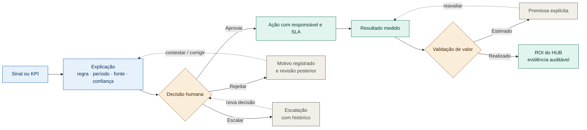
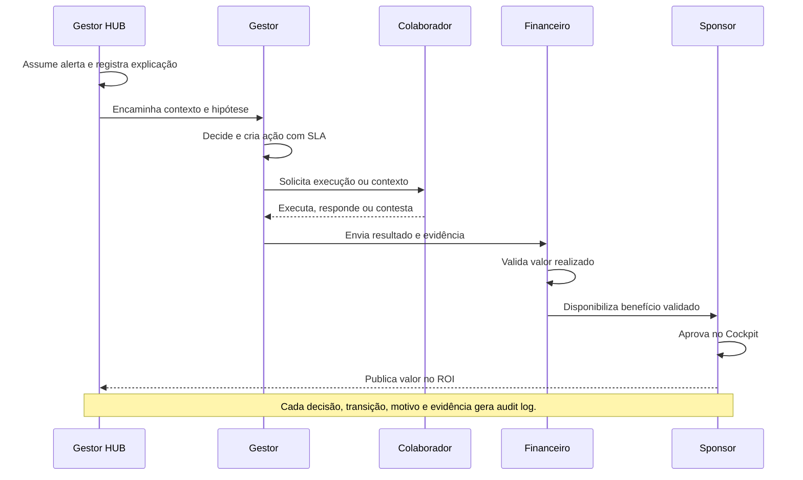
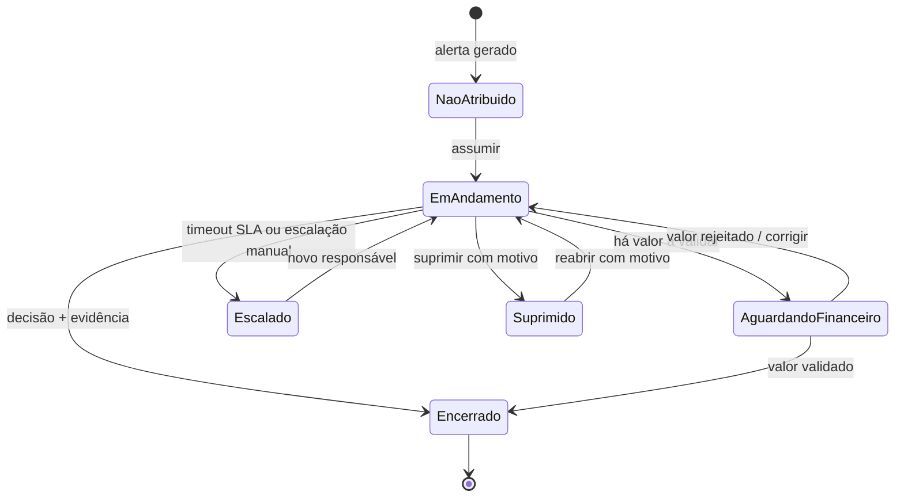

# Plano de Mapeamento das Telas da Plataforma HUB

## Objetivo

Transformar a especificação técnica do HUB em um mapa navegável de telas, fluxos, perfis, permissões e estados de interface.

Este documento é um plano de produto e wireframe. Ele não substitui a especificação aprovada, não aprova novas funcionalidades e não transforma valores ilustrativos em metas definitivas.

## Princípios de leitura

- As telas `SCR-01` a `SCR-09` são o inventário explícito da aba `10_TELAS_OUTPUTS`.
- As telas de detalhe, ação e estado descritas neste plano são propostas derivadas das ações, critérios de aceite, regras de alerta e requisitos de governança.
- Valores, thresholds, fontes e relações marcados como propostos, ilustrativos ou pendentes devem continuar identificados no wireframe.
- Cada recomendação, alerta ou score deve expor origem, regra, período, confiança, limites e possibilidade de contestação.
- Decisões humanas, aprovações financeiras, dados sensíveis e ações relevantes devem possuir histórico auditável.

## Resultado esperado

Produzir três artefatos conectados:

1. **Sitemap da plataforma** — hierarquia e rotas de todas as telas.
2. **Matriz de acesso** — o que cada perfil pode visualizar e executar.
3. **Fluxos principais** — especialmente `sinal → explicação → decisão → ação → valor medido`.

### Sitemap completo (diagrama de apoio; proposta)

O diagrama abaixo reúne todas as telas mapeadas neste plano: autenticação, shell global, telas funcionais, telas oficiais do MVP, detalhes e ações propostas, além das telas MVP+1. Ele não cria rotas novas nem altera a classificação MVP/MVP+1; serve como índice visual para a leitura das seções seguintes.

```mermaid
flowchart TD
    HUB[Plataforma HUB]

    subgraph AUTH[Autenticação]
        A1[Login / SSO]
        A2[MFA]
        A3[Seleção de organização / tenant]
        A4[Acesso negado / sessão expirada]
        A1 --> A2 --> A3
        A3 -. falha .-> A4
    end

    subgraph SHELL[Shell global]
        B1[Navegação principal]
        B2[Seletor de organização]
        B3[Seletor de período e escopo]
        B4[Busca global<br/>/busca]
        B5[Notificações<br/>/notificacoes]
        B6[Ajuda / explicabilidade<br/>/ajuda]
        B7[Perfil do usuário]
        B8[Breadcrumbs de auditoria]
    end

    subgraph MVP[Telas oficiais do MVP]
        C1[SCR-01 Cockpit executivo<br/>WF-01 · /cockpit]
        C2[SCR-02 Painel do gestor<br/>WF-02 · /gestao]
        C3[SCR-03 Minha jornada<br/>WF-06 · /minha-jornada]
        C4[SCR-04 Governança de KPIs<br/>WF-04]
        C5[SCR-05 Alertas e decisões<br/>WF-03 · /alertas]
        C6[SCR-06 ROI do HUB<br/>WF-05 · /roi]
        C7[SCR-07 Diagnóstico de dados<br/>WF-07 · /dados]
    end

    subgraph DETAILS[Telas de detalhe e ação propostas]
        D1[Detalhe de KPI]
        D2[Análise de drivers]
        D3[Simulador de cenário]
        D4[Detalhe de cliente]
        D5[Evidência de ROI]
        D6[Detalhe da equipe]
        D7[Detalhe da pessoa]
        D8[Detalhe da meta]
        D9[Detalhe de capacidade]
        D10[Detalhe do alerta]
        D11[Editor de plano de ação]
        D12[Editor de check-in]
        D13[Detalhe de feedback]
        D14[Perfil de skills]
        D15[Plano de desenvolvimento]
        D16[Formulário de contestação]
        D17[Criar KPI / editar rascunho]
        D18[Enviar para aprovação]
        D19[Aprovar / rejeitar]
        D20[Comparar versões]
        D21[Visualizar lineage]
        D22[Explicar alerta]
        D23[Atribuir responsável]
        D24[Registrar decisão]
        D25[Criar ação / escalar / encerrar]
        D26[Trilha de auditoria]
        D27[Detalhe do benefício]
        D28[Anexar evidência]
        D29[Validar valor financeiro]
        D30[Ajustar premissa]
        D31[Comparar estimado e realizado]
        D32[Detalhe da fonte]
        D33[Detalhe da execução do job]
        D34[Detalhe de rejeições]
        D35[Confirmar reprocessamento]
        D36[Relatório de qualidade]
    end

    subgraph FUNCTIONAL[Telas funcionais globais]
        E1[Administração de usuários<br/>/admin/usuarios]
        E2[Administração de tenants<br/>/admin/tenants]
        E3[Visor de auditoria<br/>/admin/auditoria]
        E4[Consentimento e privacidade<br/>/privacidade/finalidades]
        E5[Detalhe de notificação<br/>/alertas/:id]
        E6[Ajuda por tópico<br/>/ajuda/:topico]
    end

    subgraph FUTURE[MVP+1 · contrato/rotas, sem wireframe completo]
        F1[SCR-08 Marketplace de fornecedores]
        F2[SCR-09 API de indicadores]
    end

    HUB --> AUTH
    AUTH --> SHELL
    SHELL --> MVP
    SHELL --> FUNCTIONAL
    SHELL -. MVP+1 .-> FUTURE

    C1 --> D1 --> D2 --> D3
    C1 --> D4
    C1 --> D5
    C2 --> D6
    C2 --> D7 --> D8
    C2 --> D9
    C2 --> D10 --> D11
    C3 --> D12 --> D13
    C3 --> D8
    C3 --> D14 --> D15
    C3 --> D16
    C4 --> D17 --> D18 --> D19
    C4 --> D20
    C4 --> D21
    C5 --> D10
    C5 --> D22 --> D23 --> D24 --> D25
    C5 --> D26
    C6 --> D27 --> D28 --> D29
    C6 --> D30
    C6 --> D31
    C7 --> D32
    C7 --> D33 --> D34 --> D35
    C7 --> D36
    B5 --> E5
    B6 --> E6

    classDef root fill:#e8e5f8,stroke:#534ab7,color:#26215c;
    classDef global fill:#e6f1fb,stroke:#185fa5,color:#042c53;
    classDef mvp fill:#e1f5ee,stroke:#0f6e56,color:#04342c;
    classDef proposed fill:#faeeda,stroke:#854f0b,color:#412402;
    classDef future fill:#f1efe8,stroke:#5f5e5a,color:#444441;
    class HUB root;
    class A1,A2,A3,A4,B1,B2,B3,B4,B5,B6,B7,B8,E1,E2,E3,E4,E5,E6 global;
    class C1,C2,C3,C4,C5,C6,C7 mvp;
    class D1,D2,D3,D4,D5,D6,D7,D8,D9,D10,D11,D12,D13,D14,D15,D16,D17,D18,D19,D20,D21,D22,D23,D24,D25,D26,D27,D28,D29,D30,D31,D32,D33,D34,D35,D36 proposed;
    class F1,F2 future;
```



## 1. Camada global da aplicação

Estas áreas são compartilhadas por todos os perfis e devem ser desenhadas antes das telas de domínio:

```text
Autenticação
├── Login / SSO
├── MFA
├── Seleção de organização ou tenant
└── Acesso negado / sessão expirada

Shell global
├── Navegação principal
├── Seletor de organização
├── Seletor de período e escopo
├── Busca
├── Notificações
├── Ajuda / explicabilidade
├── Perfil do usuário
└── Breadcrumbs sensíveis à auditoria
```

A navegação deve variar por perfil. Executivo, Gestor, Colaborador, RH, Financeiro, Gestor HUB e Dados/Admin não devem receber o mesmo menu.

### 1.1 Telas de primeira classe (não apenas shell)

Busca global, Notificações, Ajuda/explicabilidade, Perfil, Administração (usuários, tenants, papéis, visor de auditoria) e Consentimento/LGPD (finalidade, retenção, grupos mínimos) são telas próprias com rotas, não apenas componentes do shell. Mapear como:

```text
Globais funcionais
├── Busca global (/busca)
├── Notificações (/notificacoes → deep-link para /alertas/:id)
├── Ajuda / explicabilidade (/ajuda, /ajuda/:topico)
├── Administração (/admin/usuarios, /admin/tenants, /admin/auditoria)
└── Consentimento e privacidade (/privacidade/finalidades)
```

### 1.2 Requisitos não-funcionais do wireframe

- Responsivo: definir breakpoints (ex.: desktop ≥1280, tablet, mobile) — Cockpit e Painel primeiro em desktop; Minha jornada mobile-friendly.
- Acessibilidade: alvo WCAG 2.2 AA (contraste, foco, navegação por teclado, rótulos).
- Sistema de design: referenciar tokens/componentes antes da Fase 3; sem estilos ad-hoc.
- Performance e freshness: cada tela com KPI exibe `atualizado em + fonte`; definir tempo-alvo de carregamento do Cockpit na validação com Monks.
- Tom de voz: seguir regra "correlação não implica causalidade; não inferir causa" em todos os textos de alerta, driver e recomendação.

## 2. Inventário oficial de telas

### MVP

#### SCR-01 — Cockpit executivo

- **Perfis:** Executivo, Sponsor (ver Glossário de perfis em §2.1).
- **Objetivo:** visualizar negócio e decisões prioritárias.
- **Componentes:** receita, margem, pessoas, clientes, cenários e ROI.
- **Filtros:** período, empresa, área e cliente.
- **Ações:** abrir driver, simular e aprovar.
- **Entrada:** KPIs reconciliados (`FIN-01`, `ALO-01`, `PEO-01`, `HUB-04`), lineage e freshness por KPI; escopo tenant + período.
- **Saída:** decisão aprovada/rejeitada com justificativa → Central de alertas/decisões (SCR-05) e Evidência de ROI (SCR-06); audit log.
- **Dados/KPIs:** `FIN-01`, `ALO-01`, `PEO-01`, `HUB-04`.
- **Origem técnica:** MOD-01; 06_KPIS; 10_TELAS_OUTPUTS SCR-01.
- **Aceite:** KPIs reconciliados e drill-down autorizado.

#### SCR-02 — Painel do gestor

- **Perfil:** Gestor.
- **Objetivo:** acompanhar equipe e agir continuamente.
- **Componentes:** metas, capacidade, performance, alertas e ações.
- **Filtros:** período, projeto e pessoa.
- **Ações:** decidir, criar ação e revisar meta.
- **Entrada:** metas e ciclos (MOD-02), alertas com regra/período/risco (`ALT-01..08` a selecionar no MVP), contexto da equipe limitada à hierarquia do gestor.
- **Saída:** ação criada/atribuída com responsável + prazo + SLA → SCR-05; pedido de contexto ao colaborador; audit log.
- **Regra crítica:** não inferir causa; pedir contexto.
- **Origem técnica:** MOD-02; 09_REGRAS_ALERTAS; 12_BACKLOG.
- **Aceite:** ação auditável e acesso limitado à hierarquia.

#### SCR-03 — Minha jornada

- **Perfil:** Colaborador.
- **Objetivo:** compreender progresso e desenvolvimento.
- **Componentes:** metas, check-ins, feedbacks, skills e plano.
- **Filtros:** ciclo e projeto.
- **Ações:** atualizar, responder e contestar.
- **Entrada:** metas, ciclos, feedbacks e skills do próprio usuário (MOD-02); política de visibilidade RH.
- **Saída:** check-in respondido, contestação/correção registrada → fila de revisão do gestor/RH; audit log.
- **Origem técnica:** MOD-02; 03_PERFIS; 11_SEGURANCA_LGPD (finalidade e minimização).
- **Aceite:** origem visível e contestável; ausência de dado explicada.

#### SCR-04 — Governança de KPIs

- **Perfis:** RH, Financeiro, Admin.
- **Objetivo:** criar e versionar indicadores.
- **Componentes:** definição, fórmula, owner, meta, alertas e versões.
- **Filtros:** domínio, status e owner.
- **Ações:** propor, aprovar e versionar.
- **Entrada:** rascunho de KPI (fórmula, owner, domínio, meta ilustrativa pendente de validação), versão anterior + diff, lineage.
- **Saída:** KPI versionado com dupla aprovação quando financeiro; evento de versionamento → lineage e telas consumidoras; audit log.
- **Origem técnica:** 06_KPIS (16 KPIs); 05_DICIONARIO; 12_BACKLOG.
- **Aceite:** histórico preservado e dupla aprovação financeira quando aplicável.

#### SCR-05 — Central de alertas e decisões

- **Perfil principal:** Gestor HUB.
- **Objetivo:** converter sinais em decisões.
- **Componentes:** fila, explicação, responsável, prazo, decisão e valor.
- **Filtros:** status, severidade e área.
- **Ações:** assumir, decidir, escalar e encerrar.
- **Entrada:** alerta com regra, período, confiança, severidade e explicação (`ALT-01..08` — priorizar 3–5 no MVP, ver Pendências).
- **Saída:** decisão registrada (aprovar/rejeitar/escalar/encerrar/suprimir) + ação com SLA → ROI (SCR-06) quando houver valor; audit log obrigatório.
- **Origem técnica:** MOD-01 + MOD-08; 09_REGRAS_ALERTAS; 07_RELACOES (hipóteses, não causalidade).
- **Aceite:** tudo gera audit log e o SLA é calculado.

#### SCR-06 — ROI do HUB

- **Perfis:** Sponsor, Financeiro.
- **Objetivo:** provar valor e qualidade do uso.
- **Componentes:** custos, benefícios, decisões, adoção e payback.
- **Filtros:** período, área e decisão.
- **Ações:** validar, anexar evidência e ajustar premissa.
- **Entrada:** benefício estimado + premissas + decisão de origem (SCR-05) + evidência anexada.
- **Saída:** benefício validado (realizado) separado de estimado; aprovação financeira; audit log.
- **Origem técnica:** MOD-08; 14_ROI_HUB; 12_BACKLOG.
- **Aceite:** separar sempre valor estimado de valor gerado validado.

#### SCR-07 — Diagnóstico de dados

- **Perfis:** Dados, Admin.
- **Objetivo:** monitorar integração e confiabilidade.
- **Componentes:** jobs, freshness, rejeições, lineage e qualidade.
- **Filtros:** fonte, domínio e data.
- **Ações:** reprocessar e baixar rejeições.
- **Entrada:** execuções de jobs/integrações (08_INTEGRACOES), fontes (04_FONTES_DADOS, 12 fontes — confirmar Monks), rejeições e métricas de qualidade.
- **Saída:** reprocessamento confirmado com escopo explícito; export de rejeições; evento de qualidade → lineage dos KPIs afetados; audit log.
- **Origem técnica:** 04_FONTES_DADOS; 05_DICIONARIO; 08_INTEGRACOES.
- **Aceite:** erro nunca silencioso e lineage disponível por KPI.

### MVP+1 / fases seguintes

#### SCR-08 — Marketplace de fornecedores

- **Perfis:** Comprador, Fornecedor.
- **Componentes:** demanda, catálogo, matching, TCO completo, risco e justificativa.
- **Ações:** convidar, propor e comparar.
- **Entrada:** demanda de compra + catálogo/propostas + TCO, risco, qualidade e prazo.
- **Saída:** comparativo com justificativa obrigatória → aprovação; audit log.
- **Origem técnica:** MOD-05; Fase MVP+1 (fora da primeira rodada de wireframes).
- **Aceite:** TCO, risco, qualidade, prazo e justificativa obrigatórios.

#### SCR-09 — API de indicadores

- **Perfis:** Sistemas, BI, Admin.
- **Componentes:** endpoints, versão, metadados e paginação.
- **Ações:** consultar e exportar.
- **Entrada:** token com escopo RBAC, versão da API, filtros e paginação.
- **Saída:** payload versionado + metadados (lineage, freshness) ou erro padronizado; logs de consumo.
- **Origem técnica:** 08_INTEGRACOES; 10_TELAS_OUTPUTS SCR-09; política de versionamento a definir.
- **Aceite:** RBAC, versionamento, logs, limites e códigos de erro.

### 2.1 Glossário de perfis e fora de escopo

- **Executivo:** visão agregada cross-empresa; aprova decisões estratégicas. **Sponsor:** subconjunto do Executivo focado em ROI do HUB (SCR-06); não confundir com aprovador financeiro operacional.
- **Gestor:** vê apenas sua hierarquia (ABAC por `manager_id` + tenant). **Gestor HUB:** opera a fila central de alertas cross-áreas (SCR-05). **Colaborador:** vê apenas os próprios dados + contexto agregado permitido por política RH.
- **RH / Financeiro / Dados / Admin:** funções de governança; Financeiro com dupla aprovação em KPIs/benefícios financeiros. **Comprador / Fornecedor / Sistemas / BI:** apenas MVP+1 (SCR-08/09). **Candidato / Aluno / Universidade / Comunidade:** MOD-03/06/07, Fase 2 — fora deste mapa.
- **Fora de escopo deste mapa:** MOD-06 Acadêmico e MOD-07 Comunidades e Eventos (Fase 2, sem telas neste plano).

## 3. Telas de detalhe e ação propostas

As telas oficiais são destinos. Para formar fluxos completos, mapear as seguintes telas de apoio como propostas:

```text
Cockpit executivo
├── Detalhe de KPI
├── Análise de drivers
├── Simulador de cenário
├── Detalhe de cliente
└── Evidência de ROI

Painel do gestor
├── Detalhe da equipe
├── Detalhe da pessoa
├── Detalhe da meta
├── Detalhe de capacidade
├── Detalhe do alerta
└── Editor de plano de ação

Minha jornada
├── Detalhe da meta
├── Editor de check-in
├── Detalhe de feedback
├── Perfil de skills
├── Plano de desenvolvimento
└── Formulário de contestação

Governança de KPIs
├── Criar KPI
├── Editar rascunho
├── Enviar para aprovação
├── Aprovar / rejeitar
├── Comparar versões
└── Visualizar lineage

Alertas e decisões
├── Explicar este alerta
├── Atribuir responsável
├── Registrar decisão
├── Criar ação
├── Escalar
├── Encerrar alerta
└── Ver trilha de auditoria

ROI do HUB
├── Detalhe do benefício
├── Anexar evidência
├── Validar valor financeiro
├── Ajustar premissa
└── Comparar estimado e realizado

Diagnóstico de dados
├── Detalhe da fonte
├── Detalhe da execução do job
├── Detalhe de rejeições
├── Confirmar reprocessamento
└── Relatório de qualidade
```

## 4. Matriz inicial de acesso

**Legenda (válida para todas as células):** `Ver` = leitura agregada, sem editar; `Limitado` = leitura restrita por ABAC (hierarquia/tenant/política RH); `Completo` = CRUD no escopo do perfil; `Propor` = criar rascunho, sem aprovar; `Aprovar` = aprovar/rejeitar decisão, KPI ou valor; `Agir` = executar ações operacionais (assumir, atribuir, criar ação, escalar, encerrar); `—` = sem acesso (deny-by-default: menu oculto; acesso direto por URL retorna `acesso negado` + audit log).

**Dimensões ABAC a reconciliar com a matriz formal:** tenant/organização, hierarquia (`manager_id`), sensibilidade do campo (ex.: salário mascarado para Gestor), finalidade LGPD e retenção. Toda célula `Ver/Limitado` deve declarar no wireframe quais campos são mascarados.

| Tela | Executivo | Gestor | Colaborador | RH | Financeiro | Gestor HUB | Dados/Admin |
|---|---:|---:|---:|---:|---:|---:|---:|
| Cockpit executivo | Ver | Limitado | — | Ver | Ver | Ver | — |
| Painel do gestor | — | Completo | — | Ver | — | Ver | — |
| Minha jornada | — | — | Completo | Conforme política | — | — | — |
| Governança de KPIs | Aprovar | Propor | — | Completo | Aprovar | Completo | Ver |
| Alertas e decisões | Aprovar | Agir | Próprios | Agir em sinais de pessoas | Validar valor | Completo | — |
| ROI do HUB | Ver | — | — | — | Completo | Completo | Ver |
| Diagnóstico de dados | — | — | — | — | — | Ver | Completo |
| Marketplace de fornecedores | — | — | — | — | Ver | Ver | — |
| API de indicadores | — | — | — | — | Ver | Admin | Completo |

Esta matriz é inicial e precisa ser reconciliada com a matriz formal de RBAC/ABAC, tenant, hierarquia, sensibilidade e finalidade. Regra: acesso negado nunca expõe existência de dado sensível; apenas `Acesso negado` genérico + log.

## 5. Fluxos prioritários

**Pontos de entrada (todos os fluxos):** login, deep-link (URL), notificação push/e-mail → detalhe, busca global → KPI/alerta/pessoa. Todo fluxo desenhado a partir do login deve declarar também a entrada por notificação e por busca.

**Ramos de exceção obrigatórios:** rejeição de aprovação (com motivo), timeout de SLA → escalação automática, contestação do colaborador → correção → revalidação, falha de reprocessamento, supressão → reabertura de alerta.

### Modelo comum de decisão e mensuração (diagrama de apoio; proposta)

Este é o fluxo transversal que conecta as telas e orienta a composição dos wireframes. A etapa de valor deve manter separado o que é estimado do que foi validado como realizado.



### Fluxo executivo

```text
Login
→ Cockpit executivo
→ Detalhe de KPI ou risco
→ Análise de driver
→ Simulação de cenário
→ Aprovar decisão
→ Evidência de ROI
```

### Fluxo do gestor

```text
Login
→ Painel do gestor
→ Detalhe do alerta
→ Tela de explicabilidade
→ Adicionar contexto
→ Criar ação
→ Atribuir responsável
→ Acompanhar SLA
→ Encerrar ou escalar
```

### Fluxo do colaborador

```text
Login
→ Minha jornada
→ Detalhe da meta
→ Check-in
→ Feedback
→ Skills / plano de desenvolvimento
→ Contestar ou corrigir informação
```

### Fluxo financeiro

```text
Login
→ Cockpit executivo ou ROI do HUB
→ Detalhe do benefício
→ Revisar premissas
→ Validar valor realizado
→ Anexar evidência
→ Aprovar resultado financeiro
```

### Fluxo de dados/HUB

```text
Login
→ Diagnóstico de dados
→ Detalhe da fonte ou job
→ Revisar problema de qualidade
→ Reprocessar ou exportar rejeições
→ Ver lineage do KPI
→ Consultar auditoria
```

### Fluxo de governança (RH/Admin)

```text
Login
→ Governança de KPIs
→ Criar rascunho / editar rascunho
→ Enviar para aprovação
→ Aprovar / rejeitar (com motivo; dupla aprovação se financeiro)
→ Versionar → lineage atualizada
→ [conflito de edição concorrente → resolver diff → re-submeter]
```

### Fluxo de ponta a ponta (handoff cross-perfil)

```text
Alerta gerado (regra ALT)
→ Gestor HUB assume e explica (SCR-05)
→ Gestor adiciona contexto e cria ação (SCR-02)
→ Colaborador executa / contesta (SCR-03)
→ Financeiro valida valor realizado + evidência (SCR-06)
→ Sponsor aprova no Cockpit (SCR-01)
→ Valor medido publicado no ROI
```

### Handoff entre perfis (diagrama de apoio; proposta)

Use este diagrama para verificar, em cada wireframe, quem recebe o contexto, qual ação é permitida e qual evidência precisa seguir adiante.



### Ciclo de vida do alerta (diagrama de apoio; proposta)

As transições abaixo tornam visíveis os estados obrigatórios e os caminhos de exceção já descritos no plano. Toda transição deve registrar ator, motivo, regra e timestamp.



> SCR-08 (Marketplace) e SCR-09 (API) ficam deferidos para MVP+1: mapear apenas contrato/rotas nesta rodada, sem wireframes completos.

## 6. Estados obrigatórios por tela

**Tier universal (toda tela):** carregando; normal; vazio; erro de integração; acesso negado; ação pendente; sucesso da ação.

**Tier condicional (apenas onde aplicável, declarar por tela na Fase 3):** dados parciais; dados desatualizados (`atualizado em + fonte`); dado sensível oculto (telas de pessoas/finanças); filtro sem resultado (distinto de vazio real); histórico e auditoria (telas de decisão, KPI, ROI); conflito de versão / edição concorrente (SCR-04); sessão expirada no meio da ação; falha de MFA.

Para alertas, incluir também `não atribuído`, `em andamento`, `aguardando validação financeira`, `escalado`, `suprimido` e `encerrado`.

**Transições de alerta (resumo):** `não atribuído → em andamento` (assumir; Gestor HUB/Gestor); `em andamento → aguardando validação financeira` (quando houver valor; Financeiro); `→ encerrado` (com decisão + evidência); `→ escalado` (timeout SLA ou manual); `→ suprimido` (com motivo; apenas Gestor HUB/Admin); `suprimido → em andamento` (reabertura com motivo). Toda transição gera audit log com ator, motivo e regra.

## 7. Matriz de rastreabilidade

Cada wireframe deve apontar para a origem técnica correspondente. A tabela abaixo é o núcleo MVP; o Apêndice A lista a cobertura completa (todas as telas de §2–§3). Telas sem linha nesta matriz não entram na Fase 3.

| ID wireframe | Tela | Rota proposta | Fonte | Perfis | Ação principal | Dados/KPIs | Governança |
|---|---|---|---|---|---|---|---|
| WF-01 | Cockpit executivo | `/cockpit` | SCR-01 | Executivo, Sponsor | Abrir driver / aprovar | Receita, margem, ROI | Acesso agregado |
| WF-02 | Painel do gestor | `/gestao` | SCR-02 | Gestor | Criar ação | Metas, capacidade, alertas | Limite hierárquico |
| WF-03 | Detalhe do alerta | `/alertas/:id`, `/alertas/:id/explicacao` | SCR-05, ALT-01..08 | Gestor, Gestor HUB | Decidir / escalar | Regra, período, risco | Explicabilidade + auditoria |
| WF-04 | Detalhe do KPI | `/kpis/:id`, `/kpis/:id/versoes`, `/kpis/:id/lineage` | SCR-04 | RH, Financeiro, Admin | Aprovar / versionar | Fórmula, owner, lineage | Aprovação dupla |
| WF-05 | Validação de ROI | `/roi`, `/roi/beneficios/:id` | SCR-06 | Financeiro, Sponsor | Validar benefício | Estimado vs. realizado | Evidência financeira |
| WF-06 | Minha jornada + contestação | `/minha-jornada`, `/minha-jornada/contestar` | SCR-03 | Colaborador | Responder / contestar | Metas, feedbacks | Origem visível + contestável |
| WF-07 | Diagnóstico de dados | `/dados`, `/dados/fontes/:id`, `/dados/jobs/:id` | SCR-07 | Dados, Admin | Reprocessar | Jobs, rejeições, lineage | Erro nunca silencioso |

**Convenção de rotas:** kebab-case, substantivos no plural para coleções (`/alertas`, `/kpis`), `:id` para detalhe, sufixos `/explicacao`, `/versoes`, `/lineage`, `/evidencias` para subvisões. Telas de ação usam o detalhe + drawer/modal (`/alertas/:id?acao=escalar`), sem rota própria, salvo auditoria (`/auditoria`).

## 8. Sequência de execução

**Escopo desta rodada:** 7 telas MVP (SCR-01..07 → WF-01..WF-07). SCR-08/09 (MVP+1) entram apenas com contrato/rotas; MOD-06/07 (Fase 2) fora de escopo.

### Fase 1 — Inventário e arquitetura

- Confirmar as nove telas oficiais.
- Separar MVP, MVP+1 e Fase 2.
- Identificar telas propostas de detalhe e ação.
- Definir nomenclatura, IDs e rotas.

### Fase 2 — Permissões e jornadas

- Validar a matriz de perfis.
- Desenhar os fluxos Executivo, Gestor, Colaborador, Financeiro e Dados/HUB.
- Mapear acessos negados e dados ocultos.
- Confirmar os pontos de decisão humana.

### Fase 3 — Wireframes

- Desenhar o shell global + telas de primeira classe (§1.1).
- Desenhar as sete telas MVP prioritárias.
- Desenhar os detalhes necessários para o fluxo de alerta e ROI.
- Adicionar estados de carregamento, vazio, erro e auditoria.

### Fase 4 — Validação

- Revisar com Produto, Dados, RH, Financeiro e Segurança/LGPD.
- Reconciliar com fontes, KPIs, regras e backlog.
- Validar com o piloto Monks.
- Registrar decisões, pendências e mudanças.

**Donos por tema:** matriz RBAC/ABAC + LGPD → Segurança/LGPD + Admin; fórmulas/metas → Financeiro + RH; alertas e SLAs (3–5 do MVP) → Gestor HUB + Monks; ROI/evidência → Financeiro + Sponsor; fontes e dicionário → Dados; fluxos e wireframes → Produto.

**Piloto Monks (recorte mínimo):** confirmar fontes/amostras, 3–5 alertas com responsáveis e SLAs, metas ilustrativas a validar, padrão de evidência para atribuir ROI ao HUB (ver `13_PILOTO_MONKS` na fonte). Sem esse recorte, Fase 3 não inicia.

## 9. Critério de conclusão

O mapa estará pronto para a próxima etapa quando:

- todas as telas `SCR-01..09` estiverem localizadas no sitemap;
- cada tela possuir perfis, objetivo, entrada, saída e ações;
- os fluxos prioritários estiverem conectados ponta a ponta;
- as telas propostas estiverem marcadas como propostas;
- os estados críticos estiverem representados;
- permissões e dados sensíveis estiverem explicitados;
- cada tela tiver rastreabilidade para módulo, KPI, regra, backlog ou requisito de governança;
- pendências de validação estiverem registradas antes de qualquer promoção para aprovado.
- cada wireframe WF-01..WF-07 possuir rota proposta (§7) e tier de estados declarado (§6);
- SCR-08/09 possuírem contrato/rotas e marcação MVP+1 explícita (sem wireframe completo nesta rodada).

## Resoluções técnicas desta rodada

As decisões abaixo resolvem tecnicamente cinco pendências do plano. Elas são propostas de produto/arquitetura derivadas da fonte aprovada e ainda não equivalem à aprovação do plano nem à validação do piloto.

### Navegação e nomenclatura

- A navegação principal do MVP seguirá a ordem: **Cockpit** (`/cockpit`), **Gestão** (`/gestao`), **Minha jornada** (`/minha-jornada`), **KPIs** (`/kpis`), **Alertas** (`/alertas`), **ROI** (`/roi`) e **Dados** (`/dados`).
- **Administração**, **Busca**, **Notificações**, **Ajuda** e **Privacidade** serão acessadas como áreas globais, condicionadas ao perfil, sem ocupar a navegação primária de todos os usuários.
- A nomenclatura visível será: “Cockpit executivo”, “Painel do gestor”, “Minha jornada”, “Governança de KPIs”, “Alertas e decisões”, “ROI do HUB” e “Diagnóstico de dados”.
- A navegação deve ocultar destinos sem permissão e preservar deep-links autorizados; acesso negado, sessão expirada e tenant inválido permanecem estados explícitos.

### Dados sintéticos de exemplo

Os wireframes usarão exclusivamente dados sintéticos, sem nomes, e-mails, identificadores ou valores reais. O conjunto mínimo será composto por:

- dois tenants (`Acme Brasil` e `Beta Serviços`), três áreas e três projetos;
- quatro perfis de usuário: Executivo, Gestor, Colaborador e Financeiro;
- seis pessoas sintéticas, duas equipes e metas com progresso, ciclo, peso e KPI relacionado;
- quatro alertas demonstrativos: queda persistente, risco por ociosidade, margem em risco e meta mal definida;
- dois benefícios de ROI, sempre separados entre estimado e validado, com evidência sintética;
- duas fontes, três execuções de job, uma rejeição e um exemplo de dado desatualizado.

Cada fixture deverá exibir `DADO SINTÉTICO`, `atualizado em`, fonte fictícia, tenant, período e estado de confiança. Nenhum fixture poderá ser interpretado como baseline, meta aprovada ou evidência financeira real.

### Telas de detalhe da primeira rodada

Entram na primeira rodada apenas os detalhes necessários para os fluxos de KPI, alerta, ação, ROI e diagnóstico de dados:

`D1` Detalhe de KPI; `D2` Análise de drivers; `D3` Simulador de cenário; `D10` Detalhe do alerta; `D11` Editor de plano de ação; `D22` Explicar alerta; `D23` Atribuir responsável; `D24` Registrar decisão; `D25` Criar ação / escalar / encerrar; `D27` Detalhe do benefício; `D28` Anexar evidência; `D29` Validar valor financeiro; `D31` Comparar estimado e realizado; `D32` Detalhe da fonte; `D33` Detalhe da execução do job; `D34` Detalhe de rejeições; `D35` Confirmar reprocessamento.

Ficam fora da primeira rodada, para uma etapa posterior: detalhe de cliente, detalhe da equipe, detalhe da pessoa, detalhe da meta, detalhe de capacidade, detalhe de feedback, perfil de skills, plano de desenvolvimento, formulário de contestação, criar KPI/editar rascunho, enviar para aprovação, aprovar/rejeitar, comparar versões, visualizar lineage, trilha de auditoria e relatório de qualidade. Esses itens continuam mapeados como propostas e não são cancelados.

### Política proposta para a API `SCR-09`

- Versionamento por URL: `/api/v1`; mudanças incompatíveis exigem uma nova versão maior. Mudanças compatíveis usam a mesma versão e devem aparecer em metadados/documentação.
- Resposta de sucesso: envelope `{ "data": [...], "meta": { "api_version", "source", "freshness", "lineage" }, "pagination": { "next_cursor", "has_more" } }`.
- Paginação por cursor, com `limit=50` por padrão e máximo de `200`; o cursor é opaco e vinculado ao tenant, filtros e versão consultados.
- Erros usam `application/problem+json`, com `type`, `title`, `status`, `detail`, `code`, `request_id` e, quando aplicável, `retry_after`.
- Códigos mínimos: `400` filtro/paginação inválida, `401` não autenticado, `403` sem escopo, `404` recurso inexistente, `409` conflito de versão, `429` limite excedido e `503` fonte indisponível.
- Respostas `429` e `503` devem incluir `Retry-After`; todo consumo registra tenant, consumidor, endpoint, versão, filtros não sensíveis, status, latência e `request_id`, sem registrar tokens ou dados sensíveis.

### Apêndice A fechado para a cobertura desta rodada

O Apêndice A foi preenchido com o rastreamento disponível na fonte aprovada e no backlog inicial. Onde a fonte não especifica um ID único, o plano conserva a indicação `a confirmar` em vez de inventar cobertura.

## Pendências abertas

- [x] Confirmar a navegação principal e a nomenclatura final — proposta técnica registrada acima; validação de Produto permanece necessária.
- [ ] Validar a matriz RBAC/ABAC por perfil, tenant, hierarquia e sensibilidade — baseline provisório para wireframes registrado no [pacote de validação](./pacote-validacao-mapeamento-telas-hub.md); aceite final pendente.
- [ ] Selecionar os alertas prioritários do MVP.
- [ ] Confirmar thresholds e metas ilustrativas com o piloto.
- [x] Definir dados de exemplo para os wireframes — fixtures sintéticos e limites de uso registrados acima.
- [x] Confirmar quais telas de detalhe entram na primeira rodada — recorte técnico registrado acima; priorização final permanece necessária.
- [ ] Validar o fluxo de ROI com Financeiro.
- [ ] Registrar aprovação antes de promover este plano para uma especificação de interface — autorização provisória limitada a wireframes sintéticos registrada no [pacote de validação](./pacote-validacao-mapeamento-telas-hub.md).
- [x] Definir política de versionamento da API (SCR-09) e padrão de erro/paginação — política proposta registrada acima; aprovação técnica permanece necessária.
- [ ] Confirmar regra de dupla aprovação financeira e máscaras de sensibilidade por campo — baseline provisório registrado no [pacote de validação](./pacote-validacao-mapeamento-telas-hub.md); ratificação institucional pendente.
- [x] Fechar Apêndice A (cobertura completa WF × SCR × MOD × KPI/ALT × Backlog) antes da Fase 3 — cobertura preenchida abaixo; itens `a confirmar` continuam dependentes de validação.

## Apêndice A — Cobertura completa (preencher antes da Fase 3)

| Tela §2–§3 | WF | MOD | KPI/Regra | Backlog | Status |
|---|---|---|---|---|---|
| SCR-01 Cockpit | WF-01 | MOD-01 | FIN-01, ALO-01, PEO-01, HUB-04 | BL-007, BL-013 | MVP |
| SCR-02 Painel gestor | WF-02 | MOD-02 | KPI-PERF-01/02, ALO-01/02 | BL-007, BL-008, BL-012 | MVP |
| SCR-03 Minha jornada | WF-06 | MOD-02 | Performance, skills, plano | BL-003, BL-009, BL-017 | MVP |
| SCR-04 Governança KPIs | WF-04 | MOD-01/02 | 16 KPIs; fórmulas e metas a aprovar | BL-006, BL-008, BL-016 | MVP |
| SCR-05 Alertas/decisões | WF-03 | MOD-01/08 | ALT-01..08; 3–5 a selecionar | BL-010, BL-011, BL-016 | MVP |
| SCR-06 ROI | WF-05 | MOD-08 | KPI-HUB-04; estimado vs. validado | BL-005, BL-011, BL-014, BL-015 | MVP |
| SCR-07 Dados | WF-07 | MOD-01/08 | 12 fontes, jobs, qualidade e lineage | BL-002, BL-003, BL-004, BL-005, BL-007 | MVP |
| SCR-08 Marketplace | — (contrato) | MOD-05 | TCO/risco/justificativa | BL-018 | MVP+1 |
| SCR-09 API | — (contrato) | 08_INTEGRACOES | versionamento/logs/limites | BL-001, BL-006, BL-016; política proposta acima | MVP+1 |
| Detalhes/ações §3 | herdado do WF pai | idem pai | idem pai | BL-006, BL-010, BL-011, BL-015, BL-017 | proposta |
