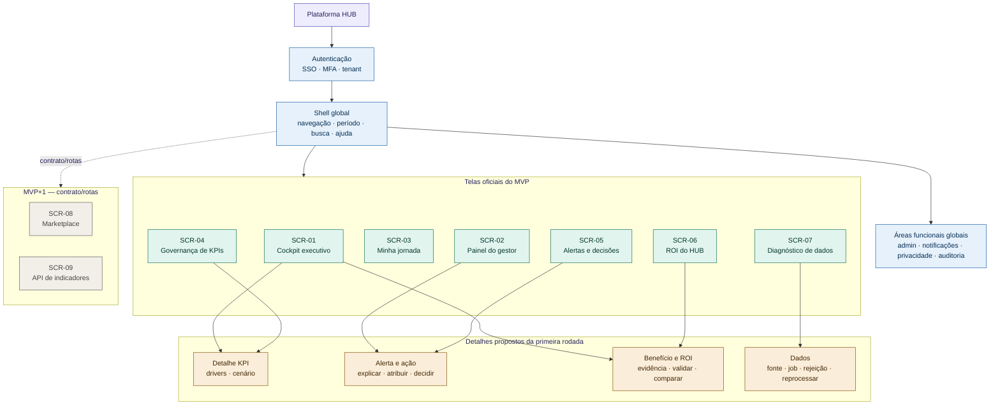
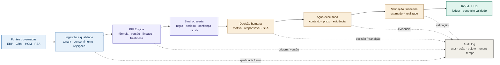
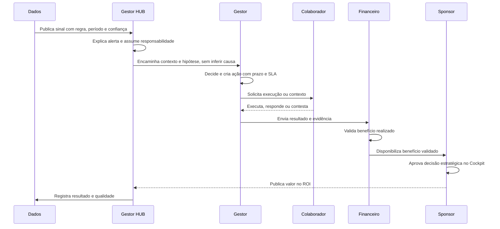
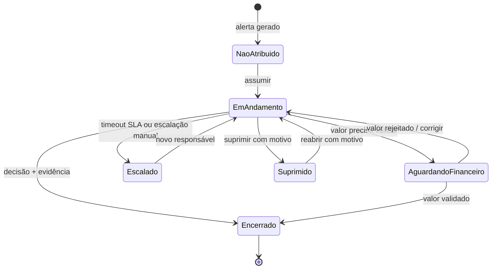

# Arquitetura HUB — Multidiagramas Mermaid

> **Status:** provisório para validação estrutural. As telas oficiais `SCR-01..09`, os wireframes `WF-01..07` e os detalhes propostos preservam a classificação do [plano de mapeamento](plano-mapeamento-telas-plataforma-hub.md). Este documento não aprova rotas, regras de acesso ou produção.

## Como ler

As quatro vistas respondem a perguntas diferentes:

1. **Estrutura:** onde cada camada e tela se localiza?
2. **Fluxo de valor:** como um sinal chega a uma decisão e ao ROI?
3. **Handoff:** qual perfil recebe contexto e qual ação executa?
4. **Estado:** como um alerta progride, escala, é suprimido ou encerra?

O [preview estrutural](./preview-arquitetura-hub-mermaid.html) apresenta as quatro vistas lado a lado e mantém uma legenda de escopo, rastreabilidade e validação.

## 1. Estrutura de navegação e telas

**Validação estrutural:** uma única entrada passa por autenticação, shell e escopo de tenant antes de chegar às telas. MVP+1 não recebe ligação sólida de wireframe. Os detalhes estão agrupados por fluxo e continuam explicitamente propostos.

## 2. Fluxo de dados, decisão e valor

**Validação de governança:** nenhum alerta vira ação ou valor medido sem decisão humana, responsável, evidência e trilha auditável. A relação entre sinal e ação não deve ser apresentada como causalidade comprovada.

## 3. Handoff entre perfis

**Validação de responsabilidade:** o fluxo separa explicação, execução, contestação, validação financeira e aprovação estratégica. Cada transição deve registrar ator, motivo, objeto, timestamp e tenant.

## 4. Ciclo de vida do alerta

**Validação de estados:** todas as transições têm ator, motivo, regra e timestamp. `Suprimido` exige motivo e permissão; `Encerrado` exige decisão e evidência; valor rejeitado retorna ao trabalho, não desaparece.

## Matriz de validação

| Vista | Fonte primária | Critério de aceite | Estado |
|---|---|---|---|
| Estrutura | Sitemap do plano; `SCR-01..09` | MVP, MVP+1 e detalhes propostos não se confundem | Validada estruturalmente |
| Fluxo de valor | `SCR-01`, `SCR-05`, `SCR-06`; ROI HUB | sinal → decisão → ação → validação → ROI | Validada estruturalmente |
| Handoff | Perfis e fluxos do plano; matriz de autorização | cada perfil recebe apenas o contexto autorizado | Requer teste RBAC/ABAC |
| Estados | Estados obrigatórios e ciclo de alerta | erro, vazio, acesso negado, auditoria e transições críticas explícitos | Validada estruturalmente |
| Produção | Pacote de validação | sem dados reais antes de testes e aprovação | Não autorizada |

## Pendências residuais

- [ ] Renderizar e revisar visualmente em um renderer Mermaid compatível.
- [ ] Testar SEC-01..SEC-08 em ambiente executável.
- [ ] Ratificar a matriz RBAC/ABAC com Segurança/LGPD e Admin.
- [ ] Confirmar 3–5 alertas e thresholds com o piloto Monks.
- [ ] Validar ROI com Financeiro/Sponsor.

