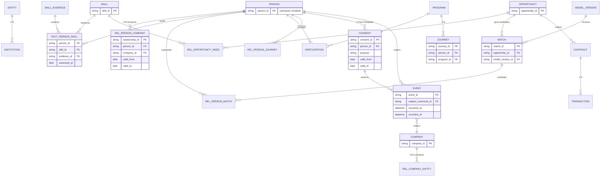

# Modelo Lógico/Físico v1 — P03-T01 (M03.A)

> **Status:** rascunho para revisão Arquitetura de Dados · **G03.A1** · Não constitui aprovação. Revisão por Dados + Tech requerida antes de promover para `03-approval`.
> **Origem:** síntese de [[01-work/refinamento-modelo-dados/modelo-indicadores/sintese-entre-abas/entity-key-crosswalk|entity-key-crosswalk]] + blueprint [[01-work/dados-inteligencia/HUB_Blueprint_Dados_e_Inteligencia#1. Entidades canônicas, nós, relacionamentos, chaves, tipos de objeto e regras temporais|BP-003 §1]].

## 1. Entidades canônicas (26) — PK estável

Cada entidade tem `canonical_id` imutável (PK lógica), `tenant_id`, `object_type`, `created_at`, `updated_at`, `valid_from`, `valid_to`, `record_status`, `provenance_ref`. IDs de origem ficam em `identity_alias` (externo → interno).

| # | Entidade | PK lógica | FKs principais | Tipo objeto | Temporalidade |
|---|---|---|---|---|---|
| 1 | Person | `person_id` | — | Identidade e organização | `valid_from/to` + `observed_at` |
| 2 | Company | `company_id` | — | Identidade e organização | `valid_from/to` |
| 3 | Entity (HUB) | `entity_id` | — | Identidade e organização | `valid_from/to` |
| 4 | Institution | `institution_id` | `entity_id` FK | Identidade e organização | `valid_from/to` |
| 5 | Supplier | `supplier_id` | `company_id` (opcional) | Identidade e organização | `valid_from/to` + homologação |
| 6 | Specialist | `specialist_id` | `person_id` FK | Identidade e organização | `valid_from/to` |
| 7 | Relationship | `relationship_id` | `person_id`, `company_id`, `entity_id` | Identidade e organização | `valid_from/to`, `relationship_type` |
| 8 | Skill | `skill_id` | — | Capacidade e evidência | `skill_version`, `valid_from/to` |
| 9 | SkillEvidence | `evidence_id` | `person_id`, `skill_id` | Capacidade e evidência | `assessed_at`, `valid_to`, `instrument_version` |
| 10 | Assessment | `assessment_id` | `person_id`, `instrument_version` | Capacidade e evidência | `assessed_at`, `valid_to` |
| 11 | Cohort | `cohort_id` | — | Capacidade e evidência | `valid_from/to`, `cohort_version` |
| 12 | Opportunity | `opportunity_id` | `company_id`, `institution_id` | Oportunidade e interação | `valid_from/to`, `lifecycle_status` |
| 13 | Need | `need_id` | `opportunity_id`, `skill_id` | Oportunidade e interação | `valid_from/to`, requisito ponderado |
| 14 | Match | `match_id` | `opportunity_id`, `model_version_id` | Oportunidade e interação | `generated_at`, `expires_at`, `confidence` |
| 15 | Introduction | `introduction_id` | `match_id` | Oportunidade e interação | `occurred_at`, `accepted_at` |
| 16 | Participation | `participation_id` | `person_id`, `program_id` | Oportunidade e interação | `enrolled_at`, `completed_at`, `status` |
| 17 | Journey | `journey_id` | `person_id`, `program_id` | Entrega e oferta | `valid_from/to`, `version`, `status` |
| 18 | Program | `program_id` | `institution_id` | Entrega e oferta | `valid_from/to` |
| 19 | Solution | `solution_id` | `supplier_id` | Entrega e oferta | `valid_from/to` |
| 20 | Contract | `contract_id` | `opportunity_id`, `company_id` | Comercial e resultados | `signed_at`, `valid_from/to` |
| 21 | Transaction | `transaction_id` | `contract_id` | Comercial e resultados | `recognized_at`, `competence_date` |
| 22 | BusinessMetric | `metric_id` | — | Comercial e resultados | `definition_version`, `period`, `cohort_id` |
| 23 | Consent | `consent_id` | `person_id`, `purpose` | Governança e inteligência | `valid_from/to`, `version`, `status` |
| 24 | Event | `event_id` | `subject_canonical_id` | Governança e inteligência | `occurred_at`, `recorded_at`, `schema_version` |
| 25 | ModelVersion | `model_version_id` | — | Governança e inteligência | `trained_from/to`, `valid_from/to` |

> **Regra G03.A1:** nenhuma entidade acima fica sem `canonical_id` estável. Chaves naturais (e-mail, registro fiscal, `contract_number`) são apenas aliases em `identity_alias`.

### N24 Consentimento — bloqueador LGPD

`N24` é um nó bloqueador: sem consentimento válido para a finalidade, ficam bloqueadas a leitura, utilização e derivação de dados sensíveis (incluindo `FLD-005`, `FLD-006`, `FLD-007` e `FLD-028`). O registro mínimo é `consent_id`, `purpose`, `legal_basis`, `titular_id`, `version`, `valid_from/to`, `status` e `revogado_em`; revogação deve propagar para derivados em até **5 minutos**, com log CMP auditável.

### N26 Decisão

`N26 Decision` é entidade operacional com `decision_id` (FLD-021), `recommendation_id`, `estimated_value` (FLD-022) e `realized_value` (FLD-023). Liga alerta/recomendação a ação humana e ao ledger de valor; toda decisão exige motivo, decisor e evidência.

> Campos N01 `nome_social` e localização sensível dependem de N24; o gate também se aplica ao `fact_person_skill`, `fact_event` e `fact_match` quando houver finalidade sensível.

## 2. Relacionamentos — PK/FK, cardinalidade, temporalidade

| Relação | Tabela / Bridge | FKs | Cardinalidade | Temporal |
|---|---|---|---|---|
| Person–Company | `rel_person_company` | `person_id` → `dim_person`, `company_id` → `dim_company` | N:N temporal, sem sobreposição incompatível | `valid_from/to`, `relationship_type=employment` |
| Company–Entity | `rel_company_entity` | `company_id`, `entity_id` | N:N contratual | `valid_from/to` |
| Person–Skill | `fact_person_skill` | `person_id`, `skill_id`, `evidence_id` | N:N com score | `assessed_at`, `valid_to`, `skill_version` |
| Opportunity–Need | `rel_opportunity_need` | `opportunity_id`, `skill_id` | 1:N requisitos | `weight`, `mandatory`, `need_version` |
| Person–Match | `rel_person_match` | `person_id`, `match_id`, `model_version_id` | N:N ranqueada | `generated_at`, `rank`, `expires_at` |
| Opportunity–Match | `rel_opportunity_match` | `opportunity_id`, `match_id` | 1:N candidatos | `confidence`, `review_status` |
| Person–Journey | `rel_person_journey` | `person_id`, `journey_id` | N:N com participação | `enrolled_at`, `status`, `valid_to` |
| Journey–Program | `rel_journey_program` | `journey_id`, `program_id` | N:1 | `valid_from/to` |
| Program–Cohort | `rel_program_cohort` | `program_id`, `cohort_id` | N:N | `valid_from/to` |
| Consent–Person–Purpose | `fact_consent` | `person_id`, `purpose`, `consent_id` | 1:N por finalidade | `valid_from/to`, `version`, `status` histórico |
| Event–Subject | `fact_event` | `subject_canonical_id` + `object_type` | N:1 por evento | `occurred_at` (UTC), `recorded_at`, `idempotency_key` |
| Contract–Transaction | `fact_transaction` | `contract_id` FK | 1:N | `recognized_at`, `competence_date`, `touchpoint_id` |

## 3. Tipos de objeto — família canônica

| Família | Objetos | Referência blueprint |
|---|---|---|
| Identidade e organização | Person, Company, Entity, Institution, Supplier, Specialist, Relationship | §1 Famílias |
| Capacidade e evidência | Skill, SkillEvidence, Assessment, Cohort | §1 |
| Oportunidade e interação | Opportunity, Need, Match, Introduction, Participation | §1 |
| Entrega e oferta | Journey, Program, Solution | §1 |
| Comercial e resultados | Contract, Transaction, BusinessMetric | §1 |
| Governança e inteligência | Consent, Event, ModelVersion | §1 |

## 4. Regras temporais — convenção única

- `valid_from` inclusive, `valid_to` exclusivo; `NULL` = ainda vigente.
- `occurred_at` = tempo do mundo real (UTC), `recorded_at` = ingestão, `observed_at` = coleta evidência.
- Timezone sempre UTC armazenado; exibição local apenas na camada apresentação.
- Eventos atrasados mantêm `occurred_at` original; `recorded_at` registra chegada.
- Correções criam nova versão com `valid_from` novo; histórico preservado (não overwrite).
- Relações Pessoa–Empresa, Consentimento, Participação, Contrato exigem intervalo de vigência explícito.

## 5. Diagrama ER (lógico)

## 6. Crosswalk externo → interno (identidade)

Tabela `identity_alias`:

| Campo | Descrição |
|---|---|
| `hub_id` | `canonical_id` interno (PK lógica) |
| `external_id` | ID origem (ex: `person_external_id`, CRM `company_id`) |
| `source_system` | HRIS, CRM, ATS, LMS, ERP, SRM |
| `object_type` | Person, Company, etc. |
| `match_method` | deterministic / probabilistic / human_review |
| `confidence` | score 0–1 |
| `valid_from/to` | vigência do vínculo |
| `is_current` | boolean — alias vigente |

Regra: nunca fazer join direto entre IDs externos; sempre resolver via `hub_id`. Reuso e fusão não apagam histórico.

## 7. Pendências G03.A1 → G03.A2

- [ ] Aprovar glossário de aliases (`Interação`→`Event`, `Conteúdo/campanha`→`Content/Campaign`) — ver §2 Nomes canônicos do `entity-key-crosswalk.md`.
- [ ] Popular `identity_alias` com dataset representativo (DEX / CRM) e testar merge/divisão reversível.
- [ ] Criar constraints físicas (FK, unique, check `valid_from < valid_to`, sem sobreposição Pessoa–Empresa incompatível) + testes de órfãos/unicidade.
- [ ] Publicar `08_Dicionario_Dados` atualizado com `object_id` obrigatório + `object_type` em todo `fact_event`.

## 8. Rastreabilidade

- Tarefa: [[04-project-management/tarefas/P03-T01_Modelo_Logico_Fisico|P03-T01]]
- Gap: [[00-project-control/registro-lacunas/lacunas/DAT-001]]
- Blueprint: [[01-work/dados-inteligencia/HUB_Blueprint_Dados_e_Inteligencia#1. Entidades canônicas, nós, relacionamentos, chaves, tipos de objeto e regras temporais|BP-003 §1]]
- Síntese: [[01-work/refinamento-modelo-dados/modelo-indicadores/sintese-entre-abas/entity-key-crosswalk|entity-key-crosswalk]] §10–12
