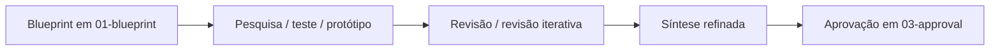
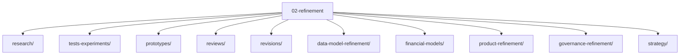

# 02-refinement

Esta camada reúne o material de refinamento do HUB: pesquisas, testes, protótipos, revisões, versões iteradas e sínteses que transformam blueprint em algo mais verificável.

## Quando usar esta pasta

Use `02-refinement/` quando você já tiver uma direção inicial em `01-blueprint/` e precisar:

- validar hipóteses;
- comparar alternativas;
- consolidar evidências;
- revisar materiais derivados;
- preparar conteúdo para aprovação.

## Fluxo de leitura recomendado

## Estrutura desta camada

## O que existe aqui

- [`research/`](research/) — pesquisas, validações e leituras de suporte.
- [`tests-experiments/`](tests-experiments/) — testes, provas de conceito e experimentos.
- [`prototypes/`](prototypes/) — protótipos e simulações.
- [`reviews/`](reviews/) — revisões e análises críticas.
- [`revisions/`](revisions/) — versões reescritas ou ajustadas após feedback.
- [`data-model-refinement/`](data-model-refinement/) — sínteses e ajustes do modelo de dados e indicadores.
- [`financial-models/`](financial-models/) — refinamentos de lógica e requisitos financeiros.
- [`product-refinement/`](product-refinement/) — ajustes de produto, fluxo e escopo.
- [`governance-refinement/`](governance-refinement/) — LGPD, controles, papéis e governança.
- [`strategy/`](strategy/) — refinamentos da estratégia-base e documento-mãe.

## Arquivos de referência

- [`../01-blueprint/README.md`](../01-blueprint/README.md) — visão geral da camada anterior.
- [`../README.md`](../README.md) — visão geral do repositório.
- [`research/second-project-draft/pt-BR/HUB_v2_product_mvp_research-pt-BR.md`](research/second-project-draft/pt-BR/HUB_v2_product_mvp_research-pt-BR.md) — exemplo de pesquisa em pt-BR.
- [`data-model-refinement/indicator-model/cross-sheet-synthesis/README.md`](data-model-refinement/indicator-model/cross-sheet-synthesis/README.md) — síntese dos indicadores.

## Como trabalhar aqui

1. Parta de um blueprint existente.
2. Traga pesquisa, teste ou revisão para dentro desta camada.
3. Registre o que mudou e por quê.
4. Separe claramente hipótese, evidência e decisão.
5. Promova o resultado para `03-approval/` quando houver maturidade suficiente.

## Regra prática

- Se ainda é ideia, volte para `01-blueprint/`.
- Se já virou evidência, fique em `02-refinement/`.
- Se já é decisão de aprovação, siga para `03-approval/`.

## Contribuição

- Escreva em pt-BR.
- Não duplique o blueprint; refine o que já existe.
- Cite sempre a origem do material derivado.
- Mantenha nomes e status consistentes com o restante do repositório.
