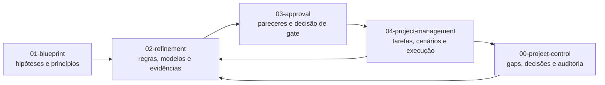
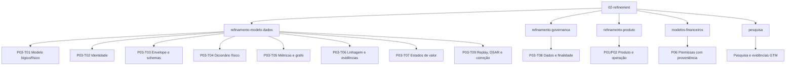
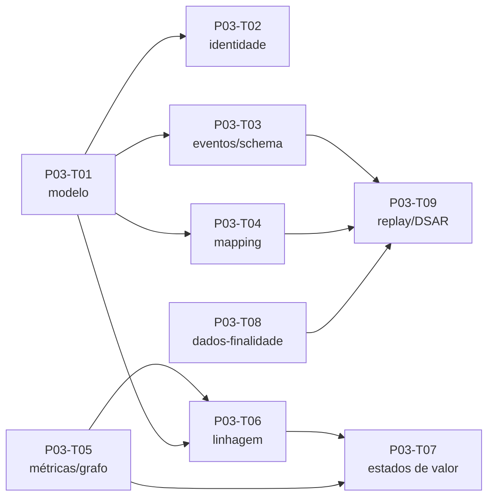

# 02 — Refinamento: Da Hipótese ao Especificado

## Propósito

Esta pasta é a camada de **refinamento** da Plataforma HUB.
Ela transforma os blueprints da pasta `01-blueprint/` em especificações suficientemente precisas para revisão, aprovação e execução.
O refinamento não é apenas uma coleção de rascunhos: é o lugar onde hipóteses ganham escopo, critérios, dependências, responsáveis, evidências, versões e condições de aceite.

Os documentos desta camada ainda podem estar em `rascunho`, `em-revisao` ou `proposta`.
Portanto, um artefato aqui descrito não deve ser interpretado como política aprovada, contrato, evidência de tração ou liberação para produção sem o respectivo gate.

## O que entra e o que sai

| Entrada | Tratamento no refinamento | Saída esperada |
|---|---|---|
| Blueprint de produto, dados, operações ou GTM | Decomposição em regras observáveis e decisões pendentes | Especificação revisável |
| Tarefas de `04-project-management/` | Vinculação a entregáveis, owners e critérios de aceite | Artefato rastreável |
| Pesquisa e premissas | Separação explícita entre fato, hipótese e lacuna | Registro de evidências |
| Contradições entre fontes | Registro da diferença, decisão proposta e impacto | Correção auditável |
| Necessidades de aprovação | Pacote com dependências e pendências | Insumo para `03-approval/` |

## Visão geral do fluxo entre camadas

O refinamento consome a intenção e os modelos do blueprint, detalha a implementação conceitual e devolve um pacote que pode ser examinado por Dados, Tech, Produto, Governança, LGPD e Finanças.
Depois da aprovação, os artefatos aprovados orientam a execução e o acompanhamento em `04-project-management/`.

### Relação com `03-approval`

O refinamento prepara o material para aprovação.
Cada documento informa status, origem, dependências, lacunas, versão, pendências e rastreabilidade.
O gate de aprovação deve confirmar, no mínimo, escopo, evidência, owner, riscos, controles, critérios de rollback e compatibilidade com os demais documentos.

### Relação com `04-project-management`

Após a decisão, as pendências convertidas em trabalho executável devem virar tarefas, cenários, marcos ou relatórios em `04-project-management/`.
O refinamento continua sendo a referência para o **o quê** e o **por quê**; o gerenciamento de projetos registra o **quem**, **quando**, **como executar** e **qual resultado foi observado**.

## Estrutura interna

## Refinamento do modelo de dados

Esta subpasta concentra oito entregáveis P03: T01, T02, T03, T04, T05, T06, T07 e T09.
Em conjunto, eles formam uma cadeia que vai da entidade canônica à evidência reproduzível, passando por eventos, métricas, valor, correção e direitos do titular.

### Catálogo dos entregáveis P03

| Código | Nome | Entregável |
|---|---|---|
| P03-T01 | Modelo lógico/físico | 25 entidades canônicas, PK/FK, cardinalidade, temporalidade e `identity_alias` |
| P03-T02 | Serviço de identidade | Regras de matching, merge, alias, survivorship, FP/FN e reversibilidade |
| P03-T03 | Envelope evento/schema | Envelope canônico, Schema Registry, versionamento, idempotência e replay |
| P03-T04 | Dicionário físico/mapping | Mapeamento de 41 campos e 16 tabelas físicas para entidades canônicas |
| P03-T05 | Catálogo métricas/grafo | 73 indicadores, fórmulas, owners, alavancas e grafo de dependências |
| P03-T06 | Templates linhagem/evidências | Modelo de origem até valor, registro de evidências e cálculo reproduzível |
| P03-T07 | Taxonomia estados de valor | Definição e critérios de promoção: potencial, influenciado, validado e realizado |
| P03-T09 | Fluxos linhagem/replay/DSAR | Correção, replay, reconciliação, portabilidade, exclusão e XLSX reconstruído |

### P03-T01 — Modelo lógico/físico

O arquivo [`modelo-logico-fisico-P03-T01-v1.md`](refinamento-modelo-dados/modelo-logico-fisico-P03-T01-v1.md) define a espinha dorsal do domínio.
Ele estabelece 25 entidades, `canonical_id` estável, relações, famílias de objetos, chaves externas e convenção temporal em UTC.
Também define que IDs de origem devem ser resolvidos por `identity_alias`, sem joins diretos entre sistemas externos.

Este é o documento-base para identidade, eventos, dicionário físico e fluxos de replay.
Suas regras de `valid_from`, `valid_to`, `occurred_at`, `recorded_at` e preservação histórica devem ser reutilizadas, não reinterpretadas em cada documento.

### P03-T02 — Especificação de identidade

O arquivo [`especificacao-identidade-P03-T02-v1.md`](refinamento-modelo-dados/especificacao-identidade-P03-T02-v1.md) especifica matching determinístico, probabilístico e com revisão humana.
Define limiares de confiança, fila de revisão, regras de merge, aliases e sobrevivência de atributos.
Inclui dataset sintético, metas de falso positivo, falso negativo e reversibilidade de `merge → split → re-merge`.

Depende diretamente de P03-T01 porque usa o `canonical_id` e a tabela `identity_alias`.
Também é pré-requisito para a qualidade da atribuição, do matching e dos indicadores derivados.

### P03-T03 — Envelope canônico e Schema Registry

O arquivo [`envelope-evento-schema-P03-T03-v1.md`](refinamento-modelo-dados/envelope-evento-schema-P03-T03-v1.md) define o contrato mínimo para cada evento.
Abrange `event_id`, `event_type`, `schema_version`, produtor, tenant, sujeito canônico, payload, consentimento, idempotência, causalidade, qualidade e classificação de segurança.

O mesmo documento estabelece regras para mudanças compatíveis, aditivas, breaking e semânticas, além dos testes produtor-consumidor e do replay de snapshots.
Depende do modelo temporal e das chaves canônicas de P03-T01.

### P03-T04 — Dicionário físico e mapping

O arquivo [`dicionario-fisico-mapping-P03-T04-v1.md`](refinamento-modelo-dados/dicionario-fisico-mapping-P03-T04-v1.md) traduz o modelo conceitual em 16 tabelas físicas e 41 campos auditados.
Para cada campo, registra tipo, chave, entidade e atributo canônico, temporalidade e propósito.

Ele também resolve a diferença entre o CSV histórico de 12 colunas e a versão corrigida de 16 colunas, que acrescenta retenção, controle de acesso, consentimento/revogação e evidência.
É um bloqueador de G03.B2 e deve ser validado antes de reconstruções e cálculos dependentes.

### P03-T05 — Catálogo de métricas e grafo

O arquivo [`catalogo-metricas-grafo-P03-T05-v1.md`](refinamento-modelo-dados/catalogo-metricas-grafo-P03-T05-v1.md) consolida 73 indicadores em oito vertentes.
Cada métrica possui fórmula, unidade, dimensões, owner, tipo (leading ou lagging) e alavanca financeira.

O grafo conecta fontes, eventos, indicadores, árvore de valor, simulador ROI, fatos financeiros e dashboards.
O documento também resolve definições concorrentes de ARR, retenção, time-to-value, produtividade, pipeline, receita e risco evitado.
Ele é a fonte canônica para qualquer premissa financeira que use um indicador P03.

### P03-T06 — Templates de linhagem e evidências

O arquivo [`templates-linhagem-evidencias-P03-T06-v1.md`](refinamento-modelo-dados/templates-linhagem-evidencias-P03-T06-v1.md) padroniza o caminho `origem → métrica → ação → resultado → valor`.
Exige campos de transformação, versão, ator/serviço, tempo, qualidade, autorização, `run_id` e `formula_version`.

Inclui um caminho financeiro ponta a ponta, registro de evidência, regra contra dupla contagem e comandos ilustrativos para reproduzir cálculos.
Depende do catálogo P03-T05 e das entidades P03-T01.

### P03-T07 — Taxonomia de estados de valor

O arquivo [`taxonomia-estados-valor-P03-T07-v1.md`](refinamento-modelo-dados/taxonomia-estados-valor-P03-T07-v1.md) impede que potencial, associação observada, resultado validado e valor realizado sejam misturados.
Define evidência mínima, métodos de atribuição, contrafactual, deduplicação, janela temporal e exigências para chegar ao ledger.

Depende de P03-T05 e P03-T06.
Sua regra central é que nenhuma promoção de estado ocorre automaticamente: toda transição exige período, coorte, versões, execução reproduzível e revisão apropriada.

### P03-T09 — Linhagem, correção, replay e DSAR

O arquivo [`fluxos-linhagem-replay-dsar-P03-T09-v1.md`](refinamento-modelo-dados/fluxos-linhagem-replay-dsar-P03-T09-v1.md) integra os fluxos operacionais.
Descreve detecção e registro de correções, snapshots imutáveis, novos `run_id`, reconciliação, acesso, exclusão e portabilidade de dados.

Também documenta a reconstrução do XLSX com CSV corrigido e as validações de entidades, ROI e cobertura de colunas.
Depende de P03-T01, P03-T03 e P03-T08; por isso funciona como ponte entre modelo, governança e validação.

### Dependências entre os oito artefatos

## Refinamento de governança

O arquivo [`matriz-dados-finalidade-P03-T08-v1.md`](refinamento-governanca/matriz-dados-finalidade-P03-T08-v1.md) relaciona dado, finalidade, base legal, retenção, propagação de consentimento, exclusão, portabilidade e evidência.
Ele cobre onboarding, diagnóstico, matching, medição, dashboard, contrato e transação.

O documento determina que a revogação de consentimento gere evento e bloqueie novos usos em até cinco minutos, com derivados em quarentena.
Também diferencia vault de identidade, dados analíticos e auditoria, mantendo a exigência de revisão conjunta por LGPD e Governança.

## Refinamento de produto

### Filas, overrides e trilha

[`filas-revisao-overrides.md`](refinamento-produto/filas-revisao-overrides.md) define filas human-in-the-loop para diagnóstico, elegibilidade, recomendação sensível, matching, medição/claim e selo.
Cada fila possui gatilho, dono, SLA, entrada e saída.
Overrides exigem resultado original, novo resultado, motivo, evidência, revisor, timestamp, expiração e reavaliação de derivados.

### Fichas operacionais

[`fichas-operacionais-P01-T02-v1.md`](refinamento-produto/fichas-operacionais-P01-T02-v1.md) detalha 17 ofertas em Mídia e Experiências, Impacto Financiável e Ecossistemas Empresariais.
Cada ficha explicita JTBD, comprador, parceiros, riscos e critérios de sucesso.
As fichas são hipóteses operacionais: não representam demanda validada, preço, contrato ou compromisso de entrega.

### RACI

[`RACI_v1.md`](refinamento-produto/RACI_v1.md) garante exatamente um Accountable por atividade crítica.
Define responsabilidades de estratégia, portfólio, entrega, produto, dados, trust e pessoas, além de delegação, backup e escalonamento.
O fundador patrocina e desbloqueia excepcionalmente; owners delegados mantêm backlog, gates e evidências.

### Autorização e tenancy

[`matriz-autorizacao-tenancy.md`](refinamento-produto/matriz-autorizacao-tenancy.md) combina ator, papel, tenant, permissão, visibilidade e comportamento esperado.
Adota negação por padrão, menor privilégio, finalidade, separação de funções, isolamento de tenant, auditabilidade e reversibilidade.
White-label pode mudar marca e terminologia, mas nunca remove evidência, trilha, consentimento, retenção ou independência do Selo.

## Modelos financeiros

[`registro-premissas-v0.md`](modelos-financeiros/registro-premissas-v0.md) é o registro de premissas com proveniência para P06-T01.
Toda premissa crítica precisa de fonte, data, confiança, dono, próxima evidência e vínculo com indicador P03 ou baseline P05.

[`HUB_Taxonomia_Receita_Reconhecimento_v1.md`](modelos-financeiros/HUB_Taxonomia_Receita_Reconhecimento_v1.md) organiza as categorias de receita, as regras conceituais de reconhecimento e os campos mínimos para cenários de contrato. É um rascunho controlado para validação de Finanças em `FIN-002` e atende ao entregável `P01-T03`.

Valores do simulador, como ROI, benefício, payback e LTV/CAC, permanecem ilustrativos até haver ledger deduplicado, reconciliação e evidência suficiente.
Linhas `TBD` não devem ser apagadas: elas documentam bloqueios e guiam a próxima investigação.

## Pesquisa

[`HUB_v2_limites_concentracao_parceiros_propostos.md`](pesquisa/HUB_v2_limites_concentracao_parceiros_propostos.md) propõe thresholds de concentração em receita, roadmap, capacidade, dados e reputação.
As faixas warning/critical são hipóteses controladas, não benchmarks normativos ou política aprovada.

[`log-evidencias-GTM.md`](pesquisa/log-evidencias-GTM.md) acompanha rotas GTM, parceiros, status, evidência disponível, fallback, owner e próxima prova necessária.
Todas as rotas permanecem `hipótese` até existir evidência escrita rastreável de problema, comprador, orçamento, próximo passo e, quando aplicável, proposta, piloto ou acordo aceito.

## Tabela de rastreabilidade

| Tarefa | Arquivo de refinamento | Relação |
|---|---|---|
| P01-T02 | [`fichas-operacionais-P01-T02-v1.md`](refinamento-produto/fichas-operacionais-P01-T02-v1.md) | Fichas das 17 ofertas |
| P01-T05 | [`log-evidencias-GTM.md`](pesquisa/log-evidencias-GTM.md) | Evidências por rota GTM |
| P01-T06 | [`HUB_v2_limites_concentracao_parceiros_propostos.md`](pesquisa/HUB_v2_limites_concentracao_parceiros_propostos.md) | Limites de concentração |
| P02-T03 | [`matriz-autorizacao-tenancy.md`](refinamento-produto/matriz-autorizacao-tenancy.md) | Autorização e isolamento |
| P02-T05 | [`filas-revisao-overrides.md`](refinamento-produto/filas-revisao-overrides.md) | Revisão humana e overrides |
| P02-T06 | [`RACI_v1.md`](refinamento-produto/RACI_v1.md) | Accountable único |
| P03-T01 | [`modelo-logico-fisico-P03-T01-v1.md`](refinamento-modelo-dados/modelo-logico-fisico-P03-T01-v1.md) | Modelo canônico |
| P03-T02 | [`especificacao-identidade-P03-T02-v1.md`](refinamento-modelo-dados/especificacao-identidade-P03-T02-v1.md) | Matching e merge |
| P03-T03 | [`envelope-evento-schema-P03-T03-v1.md`](refinamento-modelo-dados/envelope-evento-schema-P03-T03-v1.md) | Contrato de eventos |
| P03-T04 | [`dicionario-fisico-mapping-P03-T04-v1.md`](refinamento-modelo-dados/dicionario-fisico-mapping-P03-T04-v1.md) | Mapping físico |
| P03-T05 | [`catalogo-metricas-grafo-P03-T05-v1.md`](refinamento-modelo-dados/catalogo-metricas-grafo-P03-T05-v1.md) | Métricas e dependências |
| P03-T06 | [`templates-linhagem-evidencias-P03-T06-v1.md`](refinamento-modelo-dados/templates-linhagem-evidencias-P03-T06-v1.md) | Linhagem reproduzível |
| P03-T07 | [`taxonomia-estados-valor-P03-T07-v1.md`](refinamento-modelo-dados/taxonomia-estados-valor-P03-T07-v1.md) | Estados do valor |
| P03-T08 | [`matriz-dados-finalidade-P03-T08-v1.md`](refinamento-governanca/matriz-dados-finalidade-P03-T08-v1.md) | Finalidade e ciclo de vida |
| P03-T09 | [`fluxos-linhagem-replay-dsar-P03-T09-v1.md`](refinamento-modelo-dados/fluxos-linhagem-replay-dsar-P03-T09-v1.md) | Replay, DSAR e correção |
| P06-T01 | [`registro-premissas-v0.md`](modelos-financeiros/registro-premissas-v0.md) | Premissas financeiras |
| P01-T03 | [`HUB_Taxonomia_Receita_Reconhecimento_v1.md`](modelos-financeiros/HUB_Taxonomia_Receita_Reconhecimento_v1.md) | Taxonomia de receita e reconhecimento |

## Regras práticas

1. Crie um novo refinamento quando uma hipótese exigir decisão independente, contrato de dados, regra operacional, evidência ou aprovação própria.
2. Antes de criar arquivo, procure um refinamento existente que possa ser versionado ou complementado.
3. Use a convenção `PXX-TYY-vN`, por exemplo `P03-T04-v1`.
4. Mantenha nomes descritivos, sem acentos em nomes de arquivo quando houver integração automatizada.
5. Inclua frontmatter com título, `task_id`, fase, status, data, origem, gaps e tags.
6. Registre explicitamente dependências e artefatos que serão consumidos por outros documentos.
7. Diferencie sempre `hipótese`, `proposta`, `rascunho`, `validado` e `aprovado`.
8. Não promova um número ilustrativo a fato sem fonte, data, método, owner e evidência.
9. Preserve versões anteriores; correções devem ser aditivas e auditáveis.
10. Para dados pessoais, documente finalidade, base legal, retenção, consentimento, acesso e DSAR.
11. Para métricas e valor, informe período, coorte, denominador, fórmula, versão e `run_id`.
12. Para mudanças críticas, registre impacto, rollback, aprovação necessária e dependências downstream.

## Como contribuir: ciclo de refinamento

1. **Identificar a hipótese ou lacuna.** Vincule-a ao blueprint e ao gap correspondente.
2. **Definir o entregável.** Escolha tarefa, owner, escopo, consumidores e critério de aceite.
3. **Especificar.** Escreva regras observáveis, tabelas, exemplos, limites e exceções.
4. **Conectar.** Adicione links relativos para tarefas, fontes, decisões e refinamentos dependentes.
5. **Testar.** Use dataset sintético, fixture, replay, cálculo reproduzível ou cenário operacional conforme o caso.
6. **Revisar.** Solicite parecer das funções afetadas e registre divergências, condições e pendências.
7. **Empacotar para aprovação.** Garanta status, versão, evidências, riscos, owner e critério de gate.
8. **Promover somente após decisão.** Atualize o status e copie/promova o artefato conforme o processo de `03-approval/`.
9. **Executar e observar.** Crie tarefas e relatórios em `04-project-management/` e mantenha a rastreabilidade.
10. **Retroalimentar.** Incorpore aprendizados, correções e novas evidências em uma nova versão, preservando o histórico.

## Arquivos-chave

- [Modelo lógico/físico P03-T01](refinamento-modelo-dados/modelo-logico-fisico-P03-T01-v1.md)
- [Identidade P03-T02](refinamento-modelo-dados/especificacao-identidade-P03-T02-v1.md)
- [Envelope e schema P03-T03](refinamento-modelo-dados/envelope-evento-schema-P03-T03-v1.md)
- [Dicionário físico P03-T04](refinamento-modelo-dados/dicionario-fisico-mapping-P03-T04-v1.md)
- [Catálogo de métricas P03-T05](refinamento-modelo-dados/catalogo-metricas-grafo-P03-T05-v1.md)
- [Linhagem P03-T06](refinamento-modelo-dados/templates-linhagem-evidencias-P03-T06-v1.md)
- [Estados de valor P03-T07](refinamento-modelo-dados/taxonomia-estados-valor-P03-T07-v1.md)
- [Dados e finalidade P03-T08](refinamento-governanca/matriz-dados-finalidade-P03-T08-v1.md)
- [Replay e DSAR P03-T09](refinamento-modelo-dados/fluxos-linhagem-replay-dsar-P03-T09-v1.md)
- [Premissas financeiras](modelos-financeiros/registro-premissas-v0.md)
- [Taxonomia de receita e reconhecimento](modelos-financeiros/HUB_Taxonomia_Receita_Reconhecimento_v1.md)
- [Log de evidências GTM](pesquisa/log-evidencias-GTM.md)

## Nota de status

Este README descreve a organização e a finalidade da camada de refinamento.
Os status efetivos, pendências e condições de aprovação permanecem nos documentos individuais e devem ser consultados antes de qualquer execução.
