# Instrução Visual — Vault Isolado de Documentos Oficiais

> **Para colar em nova sessão:** copie o bloco `PROMPT PARA O AGENTE` ao final desta nota. Ele contém tudo que o próximo agente precisa para criar o vault do zero.

> [!danger] Regra de isolamento
> Este vault **NÃO** sincroniza com `The New HUB dev-2`. Não copie `TaskNotes`, `05-resources/Processar`, datasets ou `System/attachments` para cá. Apenas o mapa `HUB_Mapa_Documentos_Oficiais_v1.md` entra como referência inicial.

---

## 1. Visão Geral — Mapa Visual das Pastas

```mermaid
flowchart TB
    ROOT["📦 HUB_Documentos_Oficiais/<br/>(vault raiz isolado)"]

    ROOT --> C00["00-controle/<br/>índice, mapa, decisões GOV-001"]
    ROOT --> C01["01-atos-constitutivos/<br/>5 docs — sem isso nada existe"]
    ROOT --> C02["02-registros-governamentais/<br/>5 docs — CNPJ, prefeitura"]
    ROOT --> C03["03-licencas-autorizacoes/<br/>5 docs — condicionais por oferta"]
    ROOT --> C04["04-contratos-fundamentais/<br/>8 docs — arquitetura modular"]
    ROOT --> C05["05-propriedade-intelectual/<br/>5 docs — INPI, PI, domínios"]
    ROOT --> C06["06-conformidade-LGPD/<br/>5 docs — ROPA, DPO, RIPD"]
    ROOT --> C07["07-fiscal-contabil/<br/>5 docs — IBS/CBS, ECD, NFS-e"]
    ROOT --> C08["08-trabalhista/<br/>4 docs — eSocial, PJ, PGR/PCMSO"]
    ROOT --> C99["99-arquivo/<br/>superado / rejeitado"]

    style ROOT fill:#0f172a,stroke:#38bdf8,color:#fff,stroke-width:2px
    style C00 fill:#1e293b,stroke:#f59e0b,color:#fff
    style C01 fill:#164e63,stroke:#67e8f9,color:#fff
    style C02 fill:#164e63,stroke:#67e8f9,color:#fff
    style C03 fill:#4c1d95,stroke:#c4b5fd,color:#fff
    style C04 fill:#14532d,stroke:#4ade80,color:#fff
    style C05 fill:#7c2d12,stroke:#fb923c,color:#fff
    style C06 fill:#831843,stroke:#f472b6,color:#fff
    style C07 fill:#1e3a5f,stroke:#60a5fa,color:#fff
    style C08 fill:#3f3f46,stroke:#a1a1aa,color:#fff
    style C99 fill:#27272a,stroke:#71717a,color:#a1a1aa
```



### Árvore de pastas (copiar estrutura exata)

```
HUB_Documentos_Oficiais/                  ← raiz do novo vault (Obsidian vault separado)
│
├── 00-controle/                          ← ÍNDICE E RASTREABILIDADE — não contém documento oficial em si
│   ├── 00-indice-vault.md                ← índice navegável de todo o vault (tabela de status)
│   ├── 01-mapa-documentos-oficiais.md    ← CÓPIA de HUB_Mapa_Documentos_Oficiais_v1.md (fonte canônica)
│   ├── 02-decisao-GOV-001-estrutura-societaria.md  ← decisão: quantos CNPJs? (bloqueia 80% dos docs)
│   ├── 03-matriz-CNPJ-oferta-receita.md  ← qual CNPJ fatura qual oferta (BP-001 §2.1)
│   └── _templates/
│       └── template-documento-oficial.md ← template com frontmatter padrão (ver §3)
│
├── 01-atos-constitutivos/                ← 5 DOCS — ANTES DE QUALQUER CNPJ
│   ├── 01.01-contrato-social-HUB-Negocios.md
│   ├── 01.02-estatuto-ata-Instituto-HUB.md
│   ├── 01.03-acordo-socios-vesting.md
│   ├── 01.04-licenca-marca-metodo-CAOS.md
│   └── 01.05-livro-registro-socios.md
│
├── 02-registros-governamentais/          ← 5 DOCS — APÓS JUNTA/CARTÓRIO
│   ├── 02.01-CNPJ-DBE-NIRE.md
│   ├── 02.02-inscricao-municipal-alvara.md
│   ├── 02.03-inscricao-estadual.md
│   ├── 02.04-certificado-digital-eCNPJ.md
│   └── 02.05-CEIS-CNO.md
│
├── 03-licencas-autorizacoes/             ← 5 DOCS — CONDICIONAIS À OFERTA
│   ├── 03.01-AVCB-bombeiros-ambiental.md
│   ├── 03.02-eventos-ECAD.md
│   ├── 03.03-credenciamento-MEC.md
│   ├── 03.04-titulo-OSC-OSCIP-CEBAS.md
│   └── 03.05-selo-certificacao-INMETRO.md
│
├── 04-contratos-fundamentais/            ← 8 DOCS — ARQUITETURA MODULAR (BP-006 §2)
│   ├── 04.01-MSA-acordo-quadro-cliente.md
│   ├── 04.02-SOW-ordem-jornada.md
│   ├── 04.03-termos-plataforma-SLA.md
│   ├── 04.04-DPA-cronograma-fluxos.md
│   ├── 04.05-contrato-fornecedores-avaliadores.md
│   ├── 04.06-contrato-intercompany.md
│   ├── 04.07-termo-voluntariado-cessao.md
│   └── 04.08-termos-Selo-HUB.md
│
├── 05-propriedade-intelectual/           ← 5 DOCS — INPI
│   ├── 05.01-marcas-INPI-HUB-CAOS-Selo.md
│   ├── 05.02-cessao-PI-empregados.md
│   ├── 05.03-registro-software.md
│   ├── 05.04-inventario-PI-open-source.md
│   └── 05.05-dominios-registro-br.md
│
├── 06-conformidade-LGPD/                 ← 5 DOCS — ANPD
│   ├── 06.01-ROPA-registro-operacoes.md
│   ├── 06.02-politica-privacidade-DPO.md
│   ├── 06.03-RIPD-impacto.md
│   ├── 06.04-politica-seguranca-incidentes.md
│   └── 06.05-notificacao-incidente-ANPD.md
│
├── 07-fiscal-contabil/                   ← 5 DOCS — REFORMA TRIBUTÁRIA 2026
│   ├── 07.01-regime-tributario.md
│   ├── 07.02-NFSe-NFe.md
│   ├── 07.03-ECD-ECF-EFD-Reinf.md
│   ├── 07.04-mapeamento-IBS-CBS-EC132.md
│   └── 07.05-politica-reconhecimento-receita.md
│
├── 08-trabalhista/                       ← 4 DOCS — eSOCIAL
│   ├── 08.01-eSocial-FGTS.md
│   ├── 08.02-contratos-PJ.md
│   ├── 08.03-PGR-PCMSO-LTCAT.md
│   └── 08.04-confidencialidade-nao-concorrencia.md
│
└── 99-arquivo/                           ← HISTÓRICO — nunca deletar, só arquivar
    ├── superado/
    ├── rejeitado/
    └── descontinuado/
```

**Total:** 9 pastas ativas + 1 arquivo + 37 arquivos `.md` (5+5+5+8+5+5+5+4 + 4 em 00-controle + 1 template)

---

## 2. O que vai em cada pasta — regra de 1 linha + arquivo por documento

| Pasta | Quando criar | O que guardar (PDF assinado + .md espelho) | Status permitido |
|---|---|---|---|
| `00-controle/` | Primeiro | Índice, cópia do mapa, decisão GOV-001. **Nenhum documento oficial.** | `ativo` |
| `01-atos-constitutivos/` | Antes do CNPJ | Minutas → versões assinadas → alterações. Cada arquivo = 1 documento do mapa. | `hipótese → registrado` |
| `02-registros-governamentais/` | Após Junta/Cartório | Protocolos REDESIM, cartões CNPJ, alvarás, e-CNPJ. | `hipótese → registrado` |
| `03-licencas-autorizacoes/` | Ao ativar oferta | Só crie se `Gatilho` do mapa for atingido. Enquanto não, deixe com `.gitkeep` + nota `não aplicável`. | `condicional / adiado` |
| `04-contratos-fundamentais/` | Antes do 1º cliente | Templates versionados (`v0.1 minuta` → `v1.0 aprovado jurídico`). | `hipótese → aprovado` |
| `05-propriedade-intelectual/` | Imediato | Pedidos INPI, comprovantes, contratos de cessão. | `hipótese → registrado` |
| `06-conformidade-LGPD/` | Antes de tratar dado | ROPA, políticas, RIPD, canal DPO. | `hipótese → aprovado` |
| `07-fiscal-contabil/` | Na abertura | Opção tributária, NFS-e, ECD/ECF, mapeamento IBS/CBS. | `hipótese → registrado` |
| `08-trabalhista/` | Ao contratar | eSocial, contratos PJ/CLT, PGR/PCMSO. | `condicional` |
| `99-arquivo/` | Quando superar | Versões antigas com motivo e data. Nunca deletar. | `superado` |

---

## 3. Template de cada arquivo .md (colar em `_templates/template-documento-oficial.md`)

```markdown
---
doc_id: "01.01" # mesmo ID do mapa
titulo: "Contrato Social — HUB Negócios"
pasta: "01-atos-constitutivos"
status: hipotese # hipotese | em_contratacao | registrado | aprovado | bloqueado | nao_aplicavel
entidade_dona: "HUB Negócios (hipótese - GOV-001)"
orgao: "Junta Comercial do Estado"
base_legal: "Código Civil art. 997 + REDESIM"
gatilho: "Antes de pedir CNPJ"
gap_id: GOV-001
data_assinatura: ""
protocolo: ""
arquivo_pdf: "" # caminho para PDF assinado em anexo
tags: [constitutivo, GOV-001]
---

# 01.01 — Contrato Social — HUB Negócios

## Finalidade (1 linha)
> Por que este documento existe.

## Checklist de evidência
- [ ] Minuta v0.1 revisada por advogado OAB
- [ ] Assinatura com certificado digital
- [ ] Protocolo Junta / Cartório nº ___
- [ ] PDF arquivado em anexo

## Histórico
| Data | Versão | O que mudou | Autor |
|---|---|---|---|
| 2026-09-02 | v0.1 | Esqueleto |  |

## Pendências
- GOV-001: aguardando decisão de quantos CNPJs
```

---

## 4. Como o agente deve criar o vault (passo a passo)

1. `mkdir -p HUB_Documentos_Oficiais/{00-controle/_templates,01-atos-constitutivos,02-registros-governamentais,03-licencas-autorizacoes,04-contratos-fundamentais,05-propriedade-intelectual,06-conformidade-LGPD,07-fiscal-contabil,08-trabalhista,99-arquivo/{superado,rejeitado,descontinuado}}`
2. Criar `00-controle/_templates/template-documento-oficial.md` com o template acima.
3. Copiar `HUB_Mapa_Documentos_Oficiais_v1.md` para `00-controle/01-mapa-documentos-oficiais.md` (manter IDs).
4. Gerar os 37 arquivos `.md` vazios a partir do template, um por linha do mapa (§1 árvore), já com `doc_id` e `gap_id` preenchidos.
5. Criar `00-controle/00-indice-vault.md` com tabela de status (colunas: Doc | Pasta | Status | Protocolo | Link PDF).
6. Deixar pastas condicionais (`03-*`, `08-*`) com `.gitkeep` e nota `não aplicável até gatilho`.
7. Não conectar este vault ao git de `The New HUB dev-2`. É repo separado.

---

## 5. PROMPT PARA O AGENTE — copie e cole em nova sessão

```
Você está no vault HUB_Documentos_Oficiais — vault ISOLADO de documentos oficiais do projeto HUB.

OBJETIVO: Criar a estrutura completa de pastas e arquivos para armazenar documentação oficial (contratos, registros governamentais, licenças) separada do vault de projeto "The New HUB dev-2" para evitar contaminação de dados.

DATA BASE LEGAL: 2026-09-02, Brasil, legislação federal vigente (EC 132/2023 em transição IBS/CBS, LGPD, Código Civil, etc.)

REFERÊNCIA CANÔNICA: 02-refinement/refinamento-governanca/HUB_Mapa_Documentos_Oficiais_v1.md do vault de projeto — contém 32 linhas (8 blocos) com Documento | Natureza | Entidade dona | Órgão/Base legal | Gatilho | Gap ID. Use como fonte da verdade para IDs e gatilhos.

ESTRUTURA A CRIAR (9 pastas + 37 arquivos):

HUB_Documentos_Oficiais/
├── 00-controle/ (índice, cópia do mapa, decisão GOV-001, template)
├── 01-atos-constitutivos/ (5 docs: 01.01 a 01.05)
├── 02-registros-governamentais/ (5 docs: 02.01 a 02.05)
├── 03-licencas-autorizacoes/ (5 docs: 03.01 a 03.05 - condicionais)
├── 04-contratos-fundamentais/ (8 docs: 04.01 a 04.08 - 04.08 bloqueado por GOV-003)
├── 05-propriedade-intelectual/ (5 docs: 05.01 a 05.05)
├── 06-conformidade-LGPD/ (5 docs: 06.01 a 06.05)
├── 07-fiscal-contabil/ (5 docs: 07.01 a 07.05 - incluir 07.04 IBS/CBS EC132)
├── 08-trabalhista/ (4 docs: 08.01 a 08.04)
└── 99-arquivo/{superado,rejeitado,descontinuado}

ÁRVORE DETALHADA E NOMES EXATOS: ver 02-refinement/refinamento-governanca/HUB_Instrucao_Vault_Documentos_Oficiais.md §1 no vault de projeto.

TAREFAS:
1. Criar pastas com mkdir -p
2. Criar _templates/template-documento-oficial.md com frontmatter padrão (doc_id, titulo, pasta, status, entidade_dona, orgao, base_legal, gatilho, gap_id, protocolo, arquivo_pdf)
3. Copiar HUB_Mapa_Documentos_Oficiais_v1.md para 00-controle/01-mapa-documentos-oficiais.md
4. Gerar 37 arquivos .md vazios a partir do template, um por documento do mapa, com IDs e gaps preenchidos, status inicial = hipotese (ou bloqueado para 03.05 e 04.08, condicional para pastas 03 e 08)
5. Criar 00-controle/00-indice-vault.md com tabela de status navegável
6. Criar 00-controle/02-decisao-GOV-001-estrutura-societaria.md com pergunta bloqueadora: quantos CNPJs? (1/2/3/4)

REGRAS:
- Vault isolado: não copiar TaskNotes, 05-resources/Processar ou datasets do vault de projeto.
- Pastas condicionais (03, 08) começam com .gitkeep + nota "não aplicável até gatilho".
- Documentos 03.05 e 04.08 (Selo) começam como bloqueado por GOV-003.
- Todo arquivo .md deve ter frontmatter YAML com doc_id igual ao mapa.
- Idioma: pt-BR.
- Ao finalizar, liste pastas e arquivos criados e confirme que o agente seguinte pode começar a preencher.

Valide com: ls -R e contagem de 37 arquivos .md + 1 template + 1 índice.
```

---

## 6. Validação rápida após criação

```bash
# no novo vault
find HUB_Documentos_Oficiais -type f -name "*.md" | wc -l  # deve retornar 39 (37 docs + 1 template + 1 índice + 1 mapa copiado)
tree HUB_Documentos_Oficiais -L 2  # ou ls -R
```

> Arquivo de instrução salvo em: `02-refinement/refinamento-governanca/HUB_Instrucao_Vault_Documentos_Oficiais.md`
> Mapa canônico salvo em: `02-refinement/refinamento-governanca/HUB_Mapa_Documentos_Oficiais_v1.md`
