# Fundação do Blueprint do Projeto HUB

> [!info] Propósito
> Esta nota consolida o conhecimento do projeto atualmente distribuído entre os rascunhos de estratégia, notas de pesquisa, arquitetura de indicadores, workbooks, materiais de pitch e esboços de interface. É o ponto de partida para moldar o blueprint completo do HUB.

> [!warning] Limite de maturidade
> Esta é uma fundação de blueprint, não um caso de negócio final, especificação de produção ou aprovação de lançamento. Conceitos, premissas, valores ilustrativos e opções não validadas são intencionalmente preservados, mas devem permanecer claramente rotulados enquanto atravessam [[00-project-control/framework/HUB_Framework_Desenvolvimento_Projeto_Tres_Camadas|o framework de três camadas]].

## 1. Identidade do projeto

### Nome de trabalho

O **HUB** está sendo desenvolvido como um grupo de negócios e uma plataforma habilitada por inteligência para organizar relacionamentos, oportunidades, capacidades, intervenções e resultados mensuráveis em ecossistemas empresariais.

### Promessa central

> **Diferenças que movimentam negócios.**

O projeto visa converter diversidade, capacidade, relacionamentos e atividade de ecossistema em melhores decisões, conexões qualificadas, implementação e valor de negócio mensurável.

### Transformação fundadora

O projeto original evolui a DiverCidade de uma consultoria temática para um grupo de negócios orientado a impacto, com métodos reutilizáveis, infraestrutura de plataforma e resultados de ecossistema mensuráveis.

A cadeia operacional central é:

```text
diagnosticar → planejar → conectar → implementar → medir → reconhecer → evoluir
```

A cadeia de dados e valor é:

```text
fontes → identidades → sinais → inteligência → ação → resultado → valor financeiro
```

## 2. Escopo do projeto completo

O projeto é um sistema conectado. Os componentes a seguir não são produtos independentes; são partes da arquitetura completa pretendida de negócios e produto:

1. Posicionamento estratégico e marca.
2. Arquitetura de grupo de negócios e entidades legais.
3. Metodologia C.A.O.S. e modelo operacional.
4. Produto de plataforma e experiências de usuário.
5. Sistemas de dados, inteligência, medição e evidências.
6. Modelo comercial, motores de receita e lógica financeira.
7. Relacionamentos de ecossistema, parcerias e distribuição.
8. Governança, LGPD, jurídico, PI, responsabilidade e independência de reconhecimento.
9. Operações de entrega, responsabilização e suporte.
10. Lançamento, adoção, escala e evolução contínua.

O primeiro fluxo de trabalho utilizável pode ser mais estreito que o sistema total, mas deve ser projetado como uma parte conectada deste todo, e não como sua substituição.

## 3. Arquitetura de negócios

### Quatro unidades conceituais

| Unidade | Papel pretendido | Maturidade atual |
|---|---|---|
| **HUB marca e estratégia** | Posicionamento, método, padrões, narrativa e direção do grupo. | Conceito em blueprint. |
| **HUB Negócios** | Serviços comerciais, implementação, relacionamentos e valor de negócio. | Conceito em blueprint; separação jurídica não confirmada. |
| **Instituto HUB** | Atividade restrita de impacto, educação ou missão. | Conceito em blueprint; financiamento e separação não resolvidos. |
| **Plataforma HUB** | Software, dados, fluxos de trabalho, inteligência e infraestrutura de ecossistema. | Blueprint arquitetural; nenhuma implementação de produção comprovada. |

### Três frentes de negócio

- **Mídia e Experiências** — conteúdo, comunicações, eventos e experiências.
- **Impacto Financiável** — programas de impacto, financiamento e resultados mensuráveis.
- **Ecossistemas Empresariais** — relacionamentos, oportunidades, fornecedores, talentos e redes institucionais.

Essas frentes podem se tornar ofertas distintas, mas o blueprint as trata como expressões conectadas de um único sistema HUB.

## 4. Método e modelo operacional

### C.A.O.S.

O método C.A.O.S. é a espinha dorsal operacional proposta:

- **Contexto** — entender a organização, o ecossistema, a oportunidade e as restrições.
- **Arquitetura** — desenhar o estado-alvo, relacionamentos, responsabilidades e medidas.
- **Operação** — executar intervenções, conexões, jornadas e fluxos de trabalho.
- **Sustentação** — medir, governar, reconhecer, aprender e evoluir.

### Criação de valor pretendida

O HUB destina-se a ajudar participantes e instituições a:

- identificar capacidades, lacunas e oportunidades;
- tornar utilizável informação fragmentada;
- qualificar pessoas, empresas, fornecedores e soluções;
- conectar demanda com capacidade;
- guiar a implementação, e não apenas o diagnóstico;
- medir adoção, conversão, resultados e valor;
- criar evidências confiáveis para decisões e reconhecimento.

## 5. Blueprint da plataforma

### Seis módulos conceituais

1. **HUB Intelligence** — diagnóstico, evidências, indicadores, maturidade e insights.
2. **HUB Journey** — planos, recomendações, etapas, ações e progresso.
3. **HUB Solutions** — fornecedores curados, especialistas, conteúdo e intervenções.
4. **HUB Connections** — oportunidades, pareamento, apresentações e acompanhamento.
5. **HUB Academy** — aprendizado, desenvolvimento de capacidades e habilitação.
6. **HUB Recognition** — reconhecimento baseado em evidências e o Selo HUB.

### Atores principais

- Instituições, associações, federações e proprietários de ecossistemas.
- Empresas e organizações participantes.
- Pequenas empresas, fornecedores e provedores de soluções.
- Pessoas, talentos, especialistas e avaliadores.
- Compradores, donos de oportunidades e parceiros.
- Operadores, analistas, implementadores e papéis de governança do HUB.

### Jornada ponta a ponta pretendida

```mermaid
flowchart LR
    A[Configure context or opportunity] --> B[Onboard actors]
    B --> C[Diagnose capabilities and gaps]
    C --> D[Collect and review evidence]
    D --> E[Prioritize journey and intervention]
    E --> F[Curate solution or connection]
    F --> G[Implement and follow through]
    G --> H[Measure outcomes and value]
    H --> I[Recognize, learn and evolve]
```



O blueprint mantém deliberadamente a interpretação de alto impacto, curadoria, pareamento e reconhecimento sob responsabilidade humana até que as evidências, controles e portões de aprovação relevantes existam.

## 6. Fundação de dados e inteligência

### Modelo de dados conceitual

A arquitetura atual de indicadores descreve os nós conceituais (pessoa, empresa, entidade, fornecedor, vínculo, oportunidade, competência, evidência, diagnóstico, interação, jornada, recomendação, match, participação, programa/projeto, contrato, transação, métrica de negócio, resultado individual, coorte, benchmark, risco/controle, conteúdo/campanha, consentimento, versão de modelo), incluindo:

- pessoa, empresa, entidade, fornecedor e relacionamento;
- oportunidade, habilidade, evidência de habilidade, avaliação e interação;
- jornada, recomendação, match, participação e programa/projeto;
- contrato, transação, métrica de negócio e resultado individual;
- coorte, benchmark, risco/controle, conteúdo/campanha;
- consentimento e versão de modelo.

O modelo de relacionamentos contém 20 arestas na camada-fonte conceitual (identidade, habilidades, oportunidades, recomendações, jornadas, programas, resultados, fornecedores, matches, contratos, transações, diagnóstico, riscos, métricas, coortes, modelos e consentimento); o contrato refinado aprovado é `REL-01`–`REL-12`, com a equivalência E→REL em `02-review/02-reconciliacao-blueprint/mapeamento-identidade-relacoes-sequenciamento-v1.md`.

O dicionário físico aprovado define **47 campos** (`FLD-001`–`FLD-047`), com escopo técnico `N01`–`N26` (incluindo `N26` Decisão), abrangendo dimensões para pessoas, empresas, entidades, habilidades, coortes e versões de modelo, além de fatos para avaliações, eventos, oportunidades, matches, participação, contratos, transações e métricas de negócio/financeiras — ver planilha técnica aba `05_DICIONARIO` e matriz de convergência.

### Princípios de dados a preservar

- Identidades canônicas e resolução entre sistemas.
- Chaves estáveis, tipos de objeto explícitos e relacionamentos temporais.
- Eventos, indicadores, taxonomias, fórmulas e modelos versionados.
- Consentimento e limitação de propósito por fluxo de dados.
- Linhagem de evidências do registro de origem até métrica, ação, resultado e valor.
- Auditabilidade, replay, reconciliação, exclusão e portabilidade.
- Separação de valor potencial, influenciado, validado e realizado.

### Indicadores e árvore de valor

O catálogo atual contém 73 indicadores master nas áreas de pessoas, empresas/RH, compras/fornecedores, entidades/ecossistema, marketing/mídia, produto/plataforma, finanças/impacto e inteligência/dados — 20 em M0, 27 em M1, 26 em M2 — com corte de implementação aprovado de 16 `KPI-*` (matriz de convergência `73→16`).

A árvore de valor identifica 12 alavancas financeiras:

1. Produtividade
2. Time-to-productivity
3. Retenção
4. Recrutamento
5. Compras/procurement
6. Risco
7. Receita incremental
8. Receita recorrente do HUB
9. Valor de marketplace
10. Valor de entidade ou associação
11. Valor de marketing
12. Inovação e novos mercados

A arquitetura atual é um blueprint de medição. Ela ainda não prova que indicadores antecedentes, pipeline, atividade, adoção, matches ou receita influenciada equivalem a caixa realizada, margem ou impacto causal.

## 7. Blueprint de tecnologia e integração

O cenário de integração proposto inclui HRIS/folha de pagamento, ATS, LMS, CRM, ERP/finanças, procurement/SRM, GRC/risco, BI, a plataforma HUB, serviços de inteligência, gestão de consentimento, analytics de mídia, associações e um warehouse/lakehouse.

O sequenciamento atual propõe:

- **M0 (candidatos arquiteturais, não compromisso de release):** CRM, plataforma, consentimento, entidade e espinha dorsal de warehouse. A relação entre estes candidatos e as integrações do MVP/piloto está na seção "Matriz de sequenciamento — M0 arquitetural × MVP/piloto" de `HUB_Blueprint_Arquitetura_Tecnologica.md`.
- **M1:** HRIS, ATS, LMS, finanças, procurement, inteligência e marketing.
- **M2:** finanças do cliente, BI do cliente e sistemas de risco/controle.

Comportamentos técnicos propostos incluem APIs, webhooks, xAPI, streams de eventos, SFTP, links privados, ELT, retries, dead-letter queues, replay, quarentena, reconciliação, fallback e rollback.

Estes permanecem requisitos arquiteturais. Contratos de payload, responsáveis, volumes, SLAs, isolamento de tenant, rotação de segredos, resolução de identidade e responsabilidades de on-call ainda não estão estabelecidos.

## 8. Blueprint comercial e financeiro

### Potenciais motores de receita

- Licenciamento de ecossistema.
- Assinatura empresarial.
- Adoção conduzida por implementação.
- Programas de diagnóstico e evolução.
- Taxas de marketplace.
- Projetos de mídia e experiências.
- Financiamento de impacto ou funding restrito do Instituto.
- Serviços de reconhecimento e relacionados ao Selo, sujeitos à independência.

O projeto deve distinguir receita comercial, receita de implementação, receita recorrente, receita de marketplace, receita de projetos e funding restrito de impacto. Nenhum motor único está ainda confirmado como o modelo comercial final.

### Economia — valores aprovados

A aba `14_ROI` aprovada da planilha técnica está **zerada** (custos, benefícios e ROI `0,0%`), aguardando o baseline Monks: *"Sem baseline Monks, ROI permanece zero/ilustrativo."* O simulador histórico abaixo é exemplo ilustrativo superado — mantido apenas como registro do exercício original, sem valor de decisão. Ver auditoria reconciliada em `02-review/02-reconciliacao-blueprint/06_Simulador_ROI_analise.md`.

## 9. Fundação de governança, jurídico e confiança

O blueprint exige:

- responsabilidades claras das entidades e acordos entre empresas;
- cadeia de titularidade de marca, método, conteúdo, software e dados;
- definições de controlador/operador para cada fluxo de dados;
- regras de finalidade, base legal, minimização, retenção e exclusão;
- termos de participante, parceiro, fornecedor, avaliador e instituição;
- responsabilidades de responsabilidade civil, seguros, indenização e incidentes;
- isolamento de dados, portabilidade e procedimentos de saída;
- controles de explicabilidade, justiça, drift e revisão humana;
- portões de publicação para indicadores, modelos, dashboards e alegações financeiras.

### Independência do Selo HUB

O Selo HUB é estrategicamente importante, mas sensível do ponto de vista jurídico e operacional. Seu design futuro deve separar implementação comercial de avaliação, definir nomeação e pagamento de avaliadores, gerenciar conflitos e suspeições, estabelecer recursos e desistências, controlar alegações públicas e impedir que receita comercial garanta reconhecimento.

O Selo é, portanto, um componente de blueprint que exige refinamento e aprovação dedicados; ainda não é uma capacidade comercial liberada.

## 10. Lógica do roadmap

A arquitetura atual descreve uma evolução em estágios:

| Estágio | Desenvolvimento pretendido |
|---|---|
| **M0** | IDs, taxonomia, catálogo de eventos, catálogo de indicadores e dashboards operacionais. |
| **M1** | Conexões de fontes, grafo, coortes e pareamento. |
| **M2** | Value mart, experimentos, atribuição e sign-off financeiro. |
| **M3** | Modelos preditivos, uplift, justiça, drift e model cards. |
| **M4** | Benchmarks anônimos, marketplace e escala multi-ecossistema. |

Esses estágios são lógica de sequenciamento, não datas finais. Cada um exige critérios de saída explícitos, responsáveis, denominadores, evidências e decisões de aprovação.

## 11. O que existe hoje

### Ativos substantivos

- Primeiro documento-mestre estratégico em Markdown e DOCX.
- Segundo rascunho de estratégia e plano de prontidão para investidores em inglês e português.
- Seis temas de pesquisa em inglês e português: beachhead, finanças, governança/jurídico, GTM/parcerias, mercado/concorrência e produto/MVP.
- Abas-fonte de indicadores, dicionário de dados, eventos, integrações, governança, roadmap, RACI e arquivos de árvore de valor.
- Sínteses entre abas, registros de correção e relatórios de validação.
- Workbooks de indicadores original, aprimorado e explicitamente não aprovado.
- Pitch decks e esboços de UI mostrando a narrativa e a experiência pretendidas.

### Estado atual das evidências

| Área | Estado atual |
|---|---|
| Estratégia | Arquitetura conceitual rica; premissas materiais permanecem abertas. |
| Produto | Blueprint detalhado de jornada e módulos; nenhuma implementação de produção comprovada. |
| Dados | Modelo semântico forte; chaves físicas, schemas e contratos operacionais incompletos. |
| Financeiro | Modelo ilustrativo e árvore de valor; não certificado por evidências. |
| Governança | Design de controles extenso; prova operacional/jurídica incompleta. |
| Mercado | Alternativas e hipóteses mapeadas; validação de clientes e concorrência incompleta. |
| Lançamento | Roadmap de longo prazo existe; critérios finais de lançamento e aprovações ainda não existem. |

## 12. Premissas centrais a refinar

1. Instituições pagarão por inteligência de ecossistema coordenada e implementação.
2. Um método confiável mais evidências pode melhorar resultados de negócios e de ecossistema.
3. Distribuição institucional pode compor o valor da plataforma.
4. Evidências verificadas de implementação podem se tornar um ativo defensável.
5. Uma camada semântica e de medição compartilhada pode suportar múltiplas ofertas do HUB.
6. Operações conduzidas por humanos podem revelar o que deve ser transformado em produto.
7. A arquitetura de grupo de quatro unidades pode se tornar coerente jurídica e operacionalmente.
8. O reconhecimento pode permanecer independente enquanto conectado ao ecossistema HUB mais amplo.
9. Permissões de dados, resolução de identidade e atribuição de resultados podem ser governadas em escala.
10. O modelo comercial pode suportar tanto a economia de entrega quanto o desenvolvimento de longo prazo da plataforma.

## 13. Principais tensões a resolver no refinamento

- Visão ampla de ecossistema versus sequenciamento focado.
- Assinatura de plataforma versus adoção conduzida por implementação.
- Negócio comercial versus atividade de impacto restrita.
- Importância estratégica do Selo versus independência dos avaliadores.
- ROI ilustrativo versus alegações financeiras certificadas por evidências.
- Nós conceituais versus estruturas de dados físicas.
- Flexibilidade white-label versus integridade de marca e metodologia.
- Coordenação conduzida pelo fundador versus responsabilização escalável.
- Catálogo rico de indicadores versus um sistema operacional de medição gerenciável.
- Parceiros estratégicos nomeados como possibilidades versus compromissos demonstrados.

## 14. Perguntas do blueprint

### Negócios e mercado

- Que transformação exata o HUB possui para cada tipo de cliente primário?
- Quais orçamentos, processos de compra e fluxos de trabalho recorrentes podem suportar o modelo completo?
- Como as três frentes de negócio se reforçam mutuamente sem criar confusão de categoria?
- Qual é a relação entre valor institucional, valor do participante e receita do HUB?

### Produto e operações

- Quais capacidades são primitivas compartilhadas da plataforma e quais são específicas de cada oferta?
- O que é sempre conduzido por humanos, o que é assistido e o que pode se tornar automatizado?
- Qual é o sistema operacional mínimo completo necessário para suportar a direção completa do projeto?
- Como operadores, parceiros, avaliadores e clientes são responsabilizados ao longo da jornada?

### Dados e inteligência

- Quais são as entidades canônicas, chaves, contratos de eventos e sistemas de registro?
- Como recomendações, matches, interações e resultados são definidos e separados?
- Como o valor é atribuído sem dupla contagem ou superestimação de causalidade?
- Quais métricas são descritivas, antecedentes, operacionais, experimentais ou financeiras?

### Governança e lançamento

- Quais entidades legais, contratos e fronteiras de PI são necessários?
- Que evidências são exigidas para cada estado de aprovação?
- O que bloqueia alegações públicas, alegações financeiras, lançamento de modelos ou uso do Selo?
- Que condições o sistema completo deve satisfazer antes do lançamento?

## 15. Princípios de moldagem do blueprint

1. Tratar o projeto como um sistema completo, do conceito ao lançamento.
2. Preservar a ambição total enquanto sequencia o trabalho deliberadamente.
3. Rotular cada declaração material por maturidade e estado de evidência.
4. Preferir fundações conectadas a funcionalidades isoladas.
5. Permitir que o refinamento substitua qualquer premissa do blueprint.
6. Manter distintos os valores potencial, influenciado, validado e realizado.
7. Tornar explícitas a responsabilidade humana, a governança e a responsabilização.
8. Projetar estruturas de dados, produto, negócios e jurídicas em conjunto.
9. Usar testes para fortalecer o blueprint, não para encolher o projeto por padrão.
10. Exigir aprovação rigorosa antes de tratar um componente como pronto para lançamento.

## 16. Ponto de partida para o próximo ciclo de planejamento

Esta nota deve se tornar o ponto de referência para construir a próxima camada de gerenciamento do projeto:

- criar uma linha de base completa de escopo;
- decompor o blueprint em workstreams conectados;
- registrar premissas, decisões, riscos e dependências;
- classificar artefatos existentes por status de Blueprint, Refinamento ou Aprovação;
- definir os critérios de evidência e aprovação para cada subsistema principal;
- criar o roadmap mestre e o sistema de tarefas;
- identificar contradições que exigem resolução deliberada;
- manter o modelo completo do projeto visível enquanto componentes individuais amadurecem.

Esta fundação é intencionalmente aberta a melhorias. Seu papel é dar a todo plano, tarefa, teste, decisão e aprovação futuros um lugar compartilhado no projeto HUB completo.

## Histórico de aprovação

- Data: 2026-09-23
- Decisão: decisão direta do usuário (promoção 02-review → 03-approved)
- Aprovador: Paulo Rezende
- Commit: ver mensagem do commit de promoção no git log
