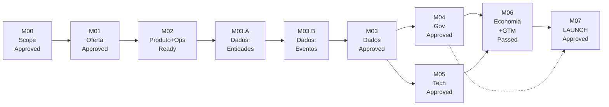

# Marcos do Plano de Fases v1 — Gates P00→P07

> [!info] Como usar
> Um marco = um gate de fase **aprovado**. Sem gate aprovado, a próxima fase não inicia trabalho que dependa dele (ver [`HUB_Plano_Fases_v1`](file:///Users/paulorezende/Library/Mobile%20Documents/iCloud~md~obsidian/Documents/Work/WORK/HUB/Projects/2026/The%20New%20HUB%20dev-2/04-project-management/planos-mestres/HUB_Plano_Fases_v1.md) §2 Mapa de dependências). Cada marco lista: depende de, evidência exigida, critério de aprovação e onde registrar a decisão. Checkboxes são operacionais — marque apenas com evidência linkada e decisão em `00-project-control/decisoes/`.

> [!warning] Sem datas fictícias
> Este arquivo registra **ordem, dependência e evidência** — não calendário. Datas entram quando cada gate for agendado no [`cronograma-fases-v1.base`](file:///Users/paulorezende/Library/Mobile%20Documents/iCloud~md~obsidian/Documents/Work/WORK/HUB/Projects/2026/The%20New%20HUB%20dev-2/04-project-management/cronogramas/cronograma-fases-v1.base) (view Timeline) + `atas-reuniao/`.

> [!warning] Estado e evidência
> Os checkboxes abaixo permanecem desmarcados até existir pacote de revisão, evidência linkada e decisão nominal em `00-project-control/decisoes/`. `rascunho`, `em-execucao` e `em-revisao` não liberam a fase seguinte; nenhum marco neste arquivo constitui aprovação formal.

---

## M00 — Fundação & Alinhamento Aprovado

| Campo | Valor |
|---|---|
| **Fase** | P00 (pré-execução) |
| **Depende de** | — |
| **Libera** | P01 |
| **Dono (A)** | PF Rezende |
| **Evidência** | `00-project-control/escopo/` baseline + RACI provisório publicado |
| **Decisão** | `00-project-control/decisoes/DEC-M00-*.md` |

- [ ] `HUB_Plano_Fases_v1.md` validado com stakeholders
- [ ] Donos P01–P07 nomeados (preenche RACI §6 do master)
- [ ] `HUB_Tarefas_Projeto.base` + `HUB_Lacunas_Projeto.base` atualizados com owners
- [ ] Canvas `Fases_Projeto.canvas` arquivado ou redesenhado para P01–P07

> **Gate:** scope approved → P01 pode iniciar. Sem isso, qualquer trabalho P01 é em risco de redefinição.

---

## M01 — Arquitetura de Oferta & Negócio Aprovada

| Campo | Valor |
|---|---|
| **Fase** | [`P01_Arquitetura_Oferta_Negocio`](file:///Users/paulorezende/Library/Mobile%20Documents/iCloud~md~obsidian/Documents/Work/WORK/HUB/Projects/2026/The%20New%20HUB%20dev-2/04-project-management/planos-fase/P01_Arquitetura_Oferta_Negocio.md) |
| **Depende de** | M00 |
| **Libera** | P02 (duro) · P06 hipóteses (soft) |
| **Dono (A)** | PF Rezende (Estratégia) + Finanças |
| **Gaps** | `STR-001,002,003` · `FIN-002` · `GTM-001` |
| **Pacote revisão** | `03-approval/pacotes-revisao/P01-Oferta-Negocio.md` |
| **Decisão** | `00-project-control/decisoes/DEC-M01-*.md` |

- [ ] **G01.1** Ofertas com unidade dona única, comprador, troca valor e premissa linkada a gap
- [ ] **G01.2** Sem oferta em 2 unidades sem regra propriedade + acordo intragrupo
- [ ] **G01.3** Taxonomia receita com regra ARR vs pontual vs restrita
- [ ] **G01.4** Rotas críticas com fallback se parceiro = hipótese
- [ ] **G01.5** Segmentos aprovados por Finanças+Jurídico+Ops (assinaturas)
- [ ] **G01.6** Roadmap P01→P07 sem contradição entre domínios
- [ ] **G01.7** Revisão por Estratégia, Finanças, Jurídico, Ops

> **Condição STR-003:** permanece aberto até haver evidência, responsável aceito e decisão interdomínios registrada. A existência deste marco não autoriza converter hipótese, piloto ou parceiro não validado em tração, receita ou prontidão.

> **Evidência G01.6:** consultar [[04-project-management/planos-mestres/HUB_Plano_Fases_v1#2.1 Dependências e regra de liberação dos gates]] e [[04-project-management/planos-mestres/HUB_Plano_Fases_v1#3.1 Critérios de saída consolidados por domínio]]. A consolidação é preparatória; este checkbox só pode ser marcado após revisão e decisão formal.

---

## M02 — Produto & Operação Prontos

| Campo | Valor |
|---|---|
| **Fase** | [`P02_Produto_Operacao`](file:///Users/paulorezende/Library/Mobile%20Documents/iCloud~md~obsidian/Documents/Work/WORK/HUB/Projects/2026/The%20New%20HUB%20dev-2/04-project-management/planos-fase/P02_Produto_Operacao.md) |
| **Depende de** | M01 |
| **Libera** | P03 |
| **Dono (A)** | Produto |
| **Gaps** | `PRD-001,002,003,004,005,007` · `STR-007/008` · `GOV-008` |
| **Pacote revisão** | `03-approval/pacotes-revisao/P02-Produto-Operacao.md` |

- [ ] **G02.1** 6 módulos com fronteira `núcleo / oferta-específico / serviço-humano`
- [ ] **G02.2** Jornada com estados+eventos+regra manual/assistido/automatizado
- [ ] **G02.3** Matriz ator×permissão aprovada por Segurança+Governança
- [ ] **G02.4** Questionário versionado, prontidão reproduzível
- [ ] **G02.5** SOPs por estágio C.A.O.S. com dono + SLA
- [ ] **G02.6** RACI sem ambiguidade (GOV-008)
- [ ] **G02.7** Autoridade delegada documentada (STR-007) + mapa C.A.O.S. (STR-008)

---

## M03 — Dados Canônicos (spine) — 3 sub-marcos

> P03 é spine; dividir para liberar P04/P05 cedo. M03 completo é gate para P06.

### M03.A — Entidades & Identidade (libera P04 + P05 iniciarem)

| Campo | Valor |
|---|---|
| **Fase** | [`P03_Dados_Canonicos`](file:///Users/paulorezende/Library/Mobile%20Documents/iCloud~md~obsidian/Documents/Work/WORK/HUB/Projects/2026/The%20New%20HUB%20dev-2/04-project-management/planos-fase/P03_Dados_Canonicos.md) §6 Sub-gate S3A |
| **Depende de** | M02 |
| **Libera** | P04 full · P05 start |
| **Gaps** | `DAT-001,002` |

- [ ] **G03.A1** Entidades canônicas com PK/FK/cardinalidade/tipos/temporalidade
- [ ] **G03.A2** Matching/merging/survivorship testado com métrica FP/FN + reversibilidade

### M03.B — Eventos & Contratos (libera P05 detalhar payloads)

| Campo | Valor |
|---|---|
| **Depende de** | M03.A |
| **Libera** | P05 contratos |
| **Gaps** | `DAT-003`, `DAT-010` (**blocking: yes** at G03.B2) |

- [ ] **G03.B1** Envelope evento + schema registry + idempotência + replay
- [ ] **G03.B2** Dicionário físico mapeado; `03-csv-corrigido/` reconciliado (**DAT-010; blocking: yes**)

### M03 — Dados Completos (libera P06)

| Campo | Valor |
|---|---|
| **Depende de** | M03.B |
| **Libera** | P06 |
| **Gaps** | `DAT-004,005,006,008,009` |
| **Pacote revisão** | `03-approval/pacotes-revisao/P03-Dados-Canonicos.md` |
| **Decisão** | `00-project-control/decisoes/DEC-M03-*.md` |

- [ ] **G03.C1** Catálogo 73 indicadores sem definição alternativa
- [ ] **G03.C2** Linhagem origem→valor demonstrada ponta a ponta
- [ ] **G03.C3** Taxonomia `potencial/influenciado/validado/realizado` aprovada
- [ ] **G03.C4** Mapa finalidade-campo + DSAR/replay testado (LGPD)
- [ ] **G03.C5** XLSX reconstruído validado (`06-relatorios-validacao/`)

---

## M04 — Governança & Confiança Aprovada

| Campo | Valor |
|---|---|
| **Fase** | [`P04_Governanca_Confianca`](file:///Users/paulorezende/Library/Mobile%20Documents/iCloud~md~obsidian/Documents/Work/WORK/HUB/Projects/2026/The%20New%20HUB%20dev-2/04-project-management/planos-fase/P04_Governanca_Confianca.md) |
| **Depende de** | M03.A (pode iniciar) · M03.B recomendado |
| **Paralelo com** | M05 |
| **Dono (A)** | Jurídico |
| **Gaps** | `GOV-001..009` |
| **Pacote revisão** | `03-approval/pacotes-revisao/P04-Governanca-Confianca.md` |

- [ ] **G04.1** Estrutura 4 unidades aprovada (parecer jurídico, não slide)
- [ ] **G04.2** Fluxos com controller/processor + base legal + retenção (LGPD libera)
- [ ] **G04.3** Carta Selo independente ou Selo permanece `bloqueado` (GOV-003)
- [ ] **G04.4** Matriz responsabilidade aprovada
- [ ] **G04.5** Registro PI completo
- [ ] **G04.6** DSAR/exclusão em derivados/backups testados
- [ ] **G04.7** RACI sem ambiguidade + dono não-fundador
- [ ] **G04.8** Model cards + fairness/drift
- [ ] **G04.9** Testes de controle passam

---

## M05 — Tecnologia Contratual Aprovada

| Campo | Valor |
|---|---|
| **Fase** | [`P05_Tecnologia_Contratual`](file:///Users/paulorezende/Library/Mobile%20Documents/iCloud~md~obsidian/Documents/Work/WORK/HUB/Projects/2026/The%20New%20HUB%20dev-2/04-project-management/planos-fase/P05_Tecnologia_Contratual.md) |
| **Depende de** | M03.B |
| **Paralelo com** | M04 |
| **Dono (A)** | Tech |
| **Gaps** | `TEC-001..007`; `TEC-005` e `TEC-007` (**blocking: yes** nos G05.4/G05.7) |
| **Pacote revisão** | `03-approval/pacotes-revisao/P05-Tecnologia.md` |

- [ ] **G05.1** Arquitetura-alvo aprovada
- [ ] **G05.2** Contratos M0 com review contrato+segurança
- [ ] **G05.3** Testes integração com resolução identidade correta
- [ ] **G05.4** Baseline técnico integrado em P06 (**TEC-005; blocking: yes**)
- [ ] **G05.5** Threat model + tenancy/IAM/secrets
- [ ] **G05.6** SLOs + runbooks + recuperação testados
- [ ] **G05.7** Release/rollback aprovado (**TEC-007; blocking: yes**)

---

## M06 — Economia & GTM com Evidência Aprovados

| Campo | Valor |
|---|---|
| **Fase** | [`P06_Economia_GTM_Evidencia`](file:///Users/paulorezende/Library/Mobile%20Documents/iCloud~md~obsidian/Documents/Work/WORK/HUB/Projects/2026/The%20New%20HUB%20dev-2/04-project-management/planos-fase/P06_Economia_GTM_Evidencia.md) |
| **Depende de** | M03 + M04 + M05 |
| **Libera** | M07 |
| **Dono (A)** | Finanças |
| **Gaps** | `FIN-001,003..007` · `GTM-002..007` · `BRD-001..003` · `STR-004..006` |
| **Pacote revisão** | `03-approval/pacotes-revisao/P06-Economia-GTM.md` |

> **Backlog pós-MVP:** `BRD-004` (governança de idioma, localização e terminologia) não compõe o conjunto de gaps nem o gate M06.

> **Condição de entrada:** `STR-003` deve estar evidenciado e aceito para qualquer claim, projeção ou rota comercial; se continuar aberto, o gate permanece bloqueado para esses itens e não pode ser contado como tração.

- [ ] **G06.1** Registro premissas sem TBD crítico
- [ ] **G06.2** Modelo 3 cenários reconciliado, sem dupla contagem
- [ ] **G06.3** Ponte produto→valor demonstrada
- [ ] **G06.4** Separação comercial vs restrito aprovada
- [ ] **G06.5** Plano capital casa com roadmap+capacidade
- [ ] **G06.6** KPIs ARR/MRR/NRR com definições + ledger
- [ ] **G06.7** Mercado bottom-up com contas nomeadas
- [ ] **G06.8** GTM diversificado, limites concentração aprovados
- [ ] **G06.9** Posicionamento sobrevive a review comparativa
- [ ] **G06.10** Decks passam em evidência+jurídico
- [ ] **G06.11** Marca + white-label aprovados
- [ ] **G06.12** Moat rebaixado ou sustentado

---

## M07 — Portão de Lançamento (LAUNCH APPROVED)

| Campo | Valor |
|---|---|
| **Fase** | [`P07_Portao_Lancamento`](file:///Users/paulorezende/Library/Mobile%20Documents/iCloud~md~obsidian/Documents/Work/WORK/HUB/Projects/2026/The%20New%20HUB%20dev-2/04-project-management/planos-fase/P07_Portao_Lancamento.md) |
| **Depende de** | M06 + M04 (gov) |
| **Dono (A)** | Controle Projeto |
| **Gaps** | `LCH-001..007` · `STR-003`; `LCH-007` (**blocking: yes** no G07.7) |
| **Artefatos** | `03-approval/portao-lancamento/portao-mestre-v1.md` + runbook + matriz rastreabilidade |

- [ ] **G07.1** Portão mestre sem crítico em `blueprint`
- [ ] **G07.2** Produto implantável + rollback exercitados
- [ ] **G07.3** Workflow aprovação auditável (autoridade nomeada)
- [ ] **G07.4** Rastreabilidade sem órfão crítico
- [ ] **G07.5** Riscos com dono+limiar+tratamento
- [ ] **G07.6** Checklist comercial (contratos, preço, privacidade, suporte)
- [ ] **G07.7** Artefatos com status válido; `06-deliverables/` só pós-aprovação (**LCH-007; blocking: yes**)
- [ ] **G07.8** Roadmap sem contradição

> **Definição de completo:** `M07 Launch Approved` = `M01..M06` aprovados + G07.1..8 + sistema coerente (framework Definição de conclusão). Piloto isolado não é lançamento.
>
> **Condição STR-003:** `STR-003` precisa de evidência, responsável aceito e decisão interdomínios antes de M07; enquanto pendente, lançamento e qualquer claim dependente permanecem bloqueados.

---

## Como registrar cada marco

1. Crie `00-project-control/decisoes/DEC-M0X-YYYY-MM-DD.md` a partir de [`template-decisao.md`](file:///Users/paulorezende/Library/Mobile%20Documents/iCloud~md~obsidian/Documents/Work/WORK/HUB/Projects/2026/The%20New%20HUB%20dev-2/00-project-control/decisoes/template-decisao.md) quando o gate for votado.
2. Anexe `03-approval/pacotes-revisao/P0X-*.md` como evidência.
3. Atualize `status` no arquivo `P0x_*.md` correspondente (`rascunho` → `em-execucao` → `em-revisao` → `aprovado`).
4. Marque o checkbox aqui + atualize [`cronograma-fases-v1.base`](file:///Users/paulorezende/Library/Mobile%20Documents/iCloud~md~obsidian/Documents/Work/WORK/HUB/Projects/2026/The%20New%20HUB%20dev-2/04-project-management/cronogramas/cronograma-fases-v1.base) — o status propaga para as views.
5. Registre em `04-project-management/atas-reuniao/` a ata do gate.

## Referências

- [`HUB_Plano_Fases_v1.md`](file:///Users/paulorezende/Library/Mobile%20Documents/iCloud~md~obsidian/Documents/Work/WORK/HUB/Projects/2026/The%20New%20HUB%20dev-2/04-project-management/planos-mestres/HUB_Plano_Fases_v1.md) §2–§8
- [`HUB_Registro_Lacunas_Projeto.md` §14 Definição de fechamento de lacuna](file:///Users/paulorezende/Library/Mobile%20Documents/iCloud~md~obsidian/Documents/Work/WORK/HUB/Projects/2026/The%20New%20HUB%20dev-2/00-project-control/registro-lacunas/HUB_Registro_Lacunas_Projeto.md)
- [`HUB_Framework_Desenvolvimento_Projeto_Tres_Camadas.md`](file:///Users/paulorezende/Library/Mobile%20Documents/iCloud~md~obsidian/Documents/Work/WORK/HUB/Projects/2026/The%20New%20HUB%20dev-2/00-project-control/framework/HUB_Framework_Desenvolvimento_Projeto_Tres_Camadas.md)
