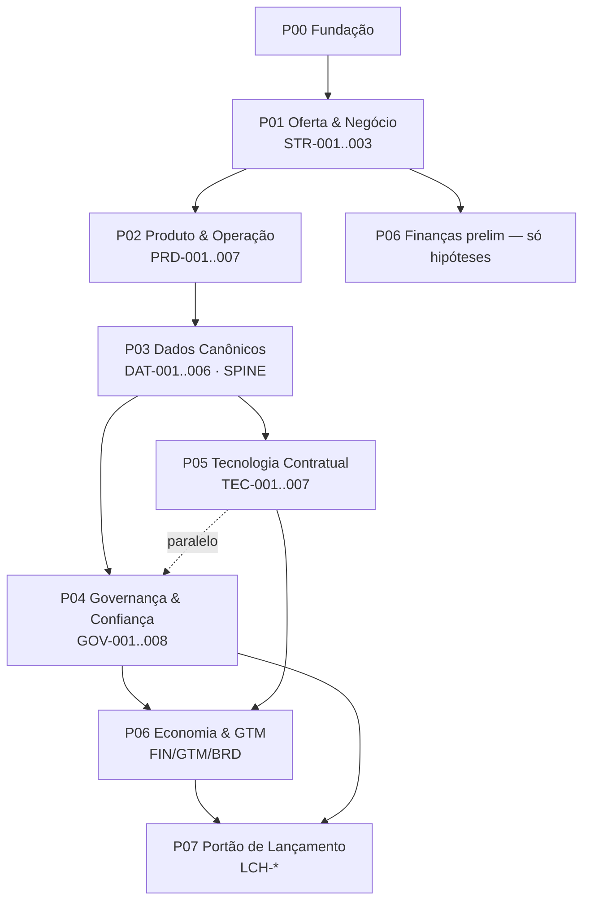
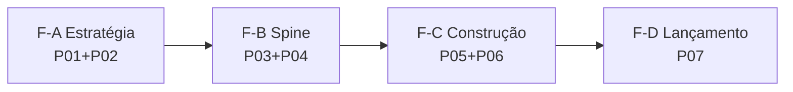

# HUB — Plano Diretor de Fases v1

> [!info] Propósito
> Transformar o inventário atual (~115 pastas, 68 gaps, 8 tarefas BP) em **7 fases sequenciais com gates verificáveis**. Cada fase fecha um conjunto de gaps antes de liberar trabalho downstream — evita retrabalho financeiro/tecnológico antes da semântica de dados estar travada. Este plano complementa (não substitui) o [`HUB_Framework_Desenvolvimento_Projeto_Tres_Camadas`](file:///Users/paulorezende/Library/Mobile%20Documents/iCloud~md~obsidian/Documents/Work/WORK/HUB/Projects/2026/The%20New%20HUB%20dev-2/00-project-control/framework/HUB_Framework_Desenvolvimento_Projeto_Tres_Camadas.md) e o [`HUB_Fundacao_Blueprint_Projeto`](file:///Users/paulorezende/Library/Mobile%20Documents/iCloud~md~obsidian/Documents/Work/WORK/HUB/Projects/2026/The%20New%20HUB%20dev-2/01-blueprint/estrategia/HUB_Fundacao_Blueprint_Projeto.md).

> [!warning] Maturidade
> Plano de gestão (`04-project-management/`), não evidência aprovada. Cada fase permanece `blueprint` até passar por `02-refinement/` → `03-approval/` → `06-deliverables/`. Nenhum gate é auto-aprovado.

---

## 1. Como ler este plano

- **Fases (P01–P07):** unidades sequenciais de planejamento e execução. Cada fase tem: objetivo, gaps que fecha, BP-task âncora, entradas/saídas, critérios de saída (gate) e dono provisório.
- **Gaps (68):** fonte de verdade em [`HUB_Registro_Lacunas_Projeto.md`](file:///Users/paulorezende/Library/Mobile%20Documents/iCloud~md~obsidian/Documents/Work/WORK/HUB/Projects/2026/The%20New%20HUB%20dev-2/00-project-control/registro-lacunas/HUB_Registro_Lacunas_Projeto.md) e [`HUB_Lacunas_Projeto.base`](file:///Users/paulorezende/Library/Mobile%20Documents/iCloud~md~obsidian/Documents/Work/WORK/HUB/Projects/2026/The%20New%20HUB%20dev-2/00-project-control/registro-lacunas/HUB_Lacunas_Projeto.base). Nenhuma fase está completa enquanto seus gaps críticos não atenderem aos 6 critérios de fechamento (§14 do registro).
- **Camadas:** dentro de cada fase o trabalho atravessa `01-blueprint` → `02-refinement` → `03-approval`. Este plano orquestra a **ordem entre fases**, não dentro da fase.
- **Roteamento:** ler na camada mais madura, escrever na menos madura (ver `project-map.md` § Onde escrever / Onde ler).

```
Fase P(n) completa (gate aprovado)
        │
        ├──→ libera P(n+1) para iniciar trabalho de blueprint/refinamento
        │
        └──→ se reprovada → volta para refinamento (não avança)
```

---

## 2. Mapa de dependências (por que esta ordem)

Derivado de [`HUB_Registro_Lacunas_Projeto.md`](file:///Users/paulorezende/Library/Mobile%20Documents/iCloud~md~obsidian/Documents/Work/WORK/HUB/Projects/2026/The%20New%20HUB%20dev-2/00-project-control/registro-lacunas/HUB_Registro_Lacunas_Projeto.md) §12 Espinha dorsal:



**Regra de ouro:** `P03 Dados Canônicos` é o **spine**. Nenhuma economia reconstruída (FIN-003), contrato de integração (TEC-001) ou alegação de valor (BRD-002) pode ser aprovada antes de `DAT-001` (entidades/chaves), `DAT-003` (event envelope) e `DAT-006` (taxonomia de valor) estarem aprovadas. Hoje `FIN-001` e `DAT-004` mostram exatamente o custo de violar isso — ROI 28,42% ilustrativo tratado como evidência.

### 2.1 Dependências e regra de liberação dos gates

| Gate | Depende de | Libera | Regra de bloqueio |
|---|---|---|---|
| **P00** | — | P01 | Sem baseline de escopo e RACI provisório, P01 permanece trabalho de risco. |
| **P01** | P00 | P02; hipóteses de P06 somente | Oferta, comprador, capacidade, receita e rota devem estar rastreáveis; `STR-001..003`, `FIN-002` e `GTM-001` continuam abertos até evidência/aceite. |
| **P02** | P01 | P03 | Sem fronteiras de módulo, jornada, permissões, SOPs e RACI, não há contrato confiável para dados. |
| **P03.A** | P02 | P04; descoberta técnica de P05 | Só identidade/entidades; P05 só detalha contratos após P03.B; não libera economia, claims ou lançamento. |
| **P03.B** | P03.A | Contratos detalhados de P05 | Só eventos/dicionário físico; P06 continua bloqueado. |
| **P03** | P03.B | P06 (com P04 e P05 ainda obrigatórios) | Entidades, eventos, métricas, linhagem e taxonomia de valor aprovados; é o spine do sistema. |
| **P04** | P03.A (P03.B recomendado) | P06 e contribuição para P07 | Sem LGPD, responsabilidade, PI, Selo e controles aprovados, claims, funding restrito e lançamento ficam bloqueados. |
| **P05** | P03.B | P06 e contribuição para P07 | Sem contratos, segurança, SLOs, recuperação e rollback testados, não há capacidade técnica aprovada. |
| **P06** | P03 + P04 + P05 | P07 | Finanças/GTM são evidência auditada; hipóteses não podem ser contadas como tração. |
| **P07** | P06 + P04 | Lançamento, somente se aprovado | Qualquer crítico em blueprint, risco sem tratamento ou rastreabilidade órfã bloqueia o lançamento. |

> **Estado dos gates:** esta tabela define critérios e ordem, não registra aprovação. Cada liberação exige pacote de revisão, evidência rastreável e decisão nominal em `00-project-control/decisoes/`. Enquanto isso não existir, o gate permanece `em-revisao` ou `bloqueado`.

**Paralelismo permitido:**

| Janela | Paralelo seguro | Por quê |
|---|---|---|
| Após P01 gate | P02 pesquisa + P06 hipóteses preliminares | P06 fica em `Hipótese`, não `Comprovado` |
| Após P03 gate | P04 + P05 em paralelo | Compartilham o mesmo contrato de dados, sem dependência mútua direta |
| Sempre | `00-project-control/registro-lacunas/` + `decisoes/` + `riscos/` | Transversal, não bloqueia |

**Paralelismo proibido:** qualquer FIN/GTM/BRD que afirme valor ou TM antes de P03+P04 gates.

---

## 3. As 7 fases — visão executiva

| Fase | Nome | Gaps críticos que fecha | Task BP âncora | Saída principal | Dono provisório | Gate |
|---|---|---|---|---|---|---|
| **P00** | Fundação & Alinhamento (0–2 sem) | — | — | Scope baseline + RACI provisório + canvas P1–P7 | PF Rezende | Scope approved |
| **P01** | Arquitetura de Oferta & Negócio | `STR-001,002,003` · `FIN-002` · `GTM-001` | `BP-001` | Matriz oferta–comprador–capacidade + taxonomia receita | PF Rezende + Finanças | Oferta aprovada |
| **P02** | Produto & Operação | `PRD-001,002` · `STR-007` · `GOV-008` | `BP-002` + `BP-005` | Fronteiras de módulos + matriz permissão + SOPs C.A.O.S. | Produto + Ops | Operability ready |
| **P03** | Dados Canônicos (spine) | `DAT-001..006` · `DAT-008` | `BP-003` | Modelo lógico/físico + event envelope + catálogo métricas | Dados | Data arch approved |
| **P04** | Governança & Confiança | `GOV-001..005` · `GOV-008` | `BP-006` | Estrutura entidades + LGPD map + Selo charter | Jurídico | Legal/Sec approved |
| **P05** | Tecnologia Contratual | `TEC-001..004` · `TEC-006` | `BP-004` | Contratos API/evento + SLOs + threat model | Tech | Arch/Sec approved |
| **P06** | Economia & GTM com Evidência | `FIN-001,003,006` · `GTM-002..006` · `BRD-002` | `BP-007` + parte `BP-001` | Modelo financeiro reconstruído + claim library + GTM routes | Finanças + GTM | Evidence audit passed |
| **P07** | Portão de Lançamento | `LCH-001..007` · `STR-003` | `BP-008` | Checklist integrado + runbook + workflow aprovação | Controle Projeto | Launch Approved |

> Detalhamento completo em [`04-project-management/planos-fase/P01_*.md`](file:///Users/paulorezende/Library/Mobile%20Documents/iCloud~md~obsidian/Documents/Work/WORK/HUB/Projects/2026/The%20New%20HUB%20dev-2/04-project-management/planos-fase) — um arquivo por fase com entradas/saídas, critérios de saída verificáveis e backlog de tarefas.

**Cobertura de gaps:** P01–P07 fecham **24 gaps críticos + 22 dos 35 altos** diretamente. Restante (`DAT-007/010`, `TEC-005/007`, `BRD-004`, `LCH-007` etc. — prioridade Média/Alta não bloqueadora) fica como backlog pós-MVP dentro de cada fase (ver `Fora de escopo` em cada P).

**Roadmap M0–M4 (da Fundação §10) mapeado:**

| Roadmap | Conteúdo | Fase dona |
|---|---|---|
| M0 | IDs, taxonomia, eventos, indicadores, dashboards operacionais | P03 (saída) |
| M1 | Conexões de fontes, grafo, coortes, pareamento | P03+P05 |
| M2 | Value mart, experimentos, atribuição, sign-off financeiro | P06 |
| M3 | Modelos, drift, fairness, model cards | Pós-P07 (roadmap futuro) |
| M4 | Benchmarks anônimos, marketplace, multi-ecossistema | Pós-P07 |

### 3.1 Critérios de saída consolidados por domínio

Os critérios abaixo são a versão de coordenação do gate. Os checklists normativos permanecem nos planos de fase e em [[04-project-management/marcos/marcos-fases-v1]]. Nenhum item abaixo implica aceite formal.

| Fase | Saída mínima verificável | Domínios reconciliados | Evidência/gap vinculante |
|---|---|---|---|
| **P01** | Matriz oferta→comprador→unidade→capacidade→operação→receita→gap; taxonomia de receita; rotas com fallback; roadmap sem contradição (**G01.6**). | Negócio, produto, finanças, operações, governança e lançamento. | P01-T01/P01-T02; G01.1–G01.7; `STR-001..003`, `FIN-002`, `GTM-001`. |
| **P02** | Fronteiras dos 6 módulos, jornada/eventos, ator×permissão, diagnóstico reproduzível, SOPs com SLA e RACI sem ambiguidade. | Produto, operações, segurança, dados e governança. | G02.1–G02.7; `PRD-*`, `STR-007/008`, `GOV-008`. |
| **P03** | Entidades/chaves e matching testados; envelope/schema/replay; catálogo de métricas, linhagem, taxonomia de valor, LGPD e XLSX reconciliado. | Dados, produto, finanças, governança e tecnologia. | G03.A1–G03.C5; `DAT-001..006`, `DAT-008..010`. P03.A/P03.B liberam apenas o trabalho indicado. |
| **P04** | Estrutura e responsabilidades jurídicas; base legal/retenção/DSAR; PI; Selo independente ou bloqueado; fairness/drift e controles testados. | Governança, jurídico, dados, finanças e operações. | G04.1–G04.9; `GOV-001..009`. |
| **P05** | Arquitetura e contratos M0; integração por chaves P03; baseline de custo/latência/volume; threat model; SLO/on-call/recovery e rollback. | Tecnologia, dados, segurança, operações e finanças. | G05.1–G05.7; `TEC-001..007`. |
| **P06** | Modelo financeiro em 3 cenários sem dupla contagem; ponte produto→valor; separação restrito/comercial; KPIs ledger; mercado e GTM com logs, diversificação e claims revisados. | Finanças, GTM, produto, dados, jurídico e governança. | G06.1–G06.12; `FIN-*`, `GTM-*`, `BRD-*`, com `STR-003` condicionante. |
| **P07** | Portão mestre, produto implantável, workflow auditável, rastreabilidade sem órfãos, riscos tratados, checklist comercial e ciclo de vida de artefatos. | Todos os domínios + controle de projeto. | G07.1–G07.8; `LCH-001..007`, `STR-003`. Lançamento só após M01–M06 aprovados. |

**Regra de coerência P01→P07:** produto e negócio definem o que pode ser prometido; P03 define o que pode ser medido; P04 define o que pode ser usado/alegado; P05 define o que pode ser operado; P06 define o que pode ser financiado e vendido; P07 verifica a composição. Uma hipótese, piloto ou artefato em blueprint não é convertido em aprovação, tração ou prontidão por este roadmap.

---

## 4. Alternativa leve: corte em 4 fases

Se 7 fases for granular demais para o ritmo atual, colapsar sem violar dependências:

| Corte 4 fases | Agrupa | Quando usar |
|---|---|---|
| **F-A Estratégia** | P01+P02 | Time enxuto, precisa de narrativa investidor rápida |
| **F-B Spine** | P03+P04 | Quando jurídico/dados precisam andar juntos |
| **F-C Construção** | P05+P06 | Quando tech e economia são o mesmo time |
| **F-D Lançamento** | P07 | Idem |



**Trade-off:** 4 fases é mais rápido de gerenciar, mas gates ficam muito amplos (ex: F-B aprova dados + jurídico juntos — risco de 8 gaps críticos num único gate). **Recomendação:** começar em **7 fases** até P03 gate; se o ritmo permitir, colapsar P04+P05 e P06 em execução. Este plano mantém os 7 arquivos mesmo no modo 4-fases — só muda o agrupamento de gates no `cronogramas/`.

---

## 5. Cronograma indicativo (sem datas fictícias)

> Durações são **esforço relativo**, não calendário. Preencher em [`04-project-management/cronogramas/`](file:///Users/paulorezende/Library/Mobile%20Documents/iCloud~md~obsidian/Documents/Work/WORK/HUB/Projects/2026/The%20New%20HUB%20dev-2/04-project-management/cronogramas) após atribuir donos reais.

| Fase | Esforço | Dependência dura | Pode sobrepor com |
|---|---|---|---|
| P00 | 1–2 sem | — | — |
| P01 | 3–4 sem | P00 gate | — |
| P02 | 3–4 sem | P01 gate | P06 hipóteses |
| P03 | 4–6 sem | P02 gate | — |
| P04 | 3–4 sem | P03 gate | P05 |
| P05 | 3–5 sem | P03 gate | P04 |
| P06 | 4–6 sem | P03+P04+P05 gates | — |
| P07 | 2–3 sem | P06+P04 gates | — |

**Caminho crítico:** `P00 → P01 → P02 → P03 → P06 → P07` (P04/P05 são paralelizáveis). Atraso em P03 atrasa tudo — é o spine.

---

## 6. Donos provisórios & RACI (a preencher)

> Atual: todos `BP-*` com `owner: PF Rezende`. Este plano propõe especialização; confirmar em [`00-project-control/decisoes/`](file:///Users/paulorezende/Library/Mobile%20Documents/iCloud~md~obsidian/Documents/Work/WORK/HUB/Projects/2026/The%20New%20HUB%20dev-2/00-project-control/decisoes) + atualizar `HUB_Lacunas_Projeto.base`.

| Fase | Accountable (A) | Responsible (R) | Consulted (C) | Informed (I) |
|---|---|---|---|---|
| P00 | PF Rezende | PF Rezende | — | Todos |
| P01 | PF Rezende (Estratégia) | Finanças + Produto | Jurídico, GTM | Tech |
| P02 | Produto | Ops + Produto | Dados, Jurídico | Finanças |
| P03 | Dados | Dados + Tech | Produto, Jurídico | Finanças |
| P04 | Jurídico | Jurídico + Dados | Finanças, Produto | Tech |
| P05 | Tech | Tech + Dados | Ops, Jurídico | Finanças |
| P06 | Finanças | Finanças + GTM | Dados, Jurídico | Produto |
| P07 | Controle Projeto | Todos os As | — | — |

> Preencher `owner` real em cada `P0x_*.md`. Sem `A` único, o gate não pode ser aprovado (`GOV-008`).

---

## 7. Como usar este plano no dia a dia

### Para planejar
1. Abra este arquivo para ver **ordem e gates**.
2. Entre no `P0x_*.md` da fase ativa — ele tem o checklist de entrada/saída.
3. Crie/atualize tarefas em [`04-project-management/tarefas/`](file:///Users/paulorezende/Library/Mobile%20Documents/iCloud~md~obsidian/Documents/Work/WORK/HUB/Projects/2026/The%20New%20HUB%20dev-2/04-project-management/tarefas) com `gap_ids` da fase + `dependencies: [P0x]`.
4. Tarefas operacionais curtas (≤1 semana) ficam em [`TaskNotes/Tasks/`](file:///Users/paulorezende/Library/Mobile%20Documents/iCloud~md~obsidian/Documents/Work/WORK/HUB/Projects/2026/The%20New%20HUB%20dev-2/TaskNotes/Tasks) com link para a tarefa BP/phase correspondente.

### Para refinar & aprovar
- Escreva refinamento em `02-refinement/<dominio>/` citando `P0x` + gap.
- Monte pacote em `03-approval/pacotes-revisao/P0x-*.md`.
- Só mova para `03-approval/aprovado/` via gate de `P0x`. Nunca pule gate.

### Para status & retrospectiva
- Atualize [`04-project-management/relatorios-status/`](file:///Users/paulorezende/Library/Mobile%20Documents/iCloud~md~obsidian/Documents/Work/WORK/HUB/Projects/2026/The%20New%20HUB%20dev-2/04-project-management/relatorios-status) por fase (não por domínio).
- Registre decisões em [`00-project-control/decisoes/`](file:///Users/paulorezende/Library/Mobile%20Documents/iCloud~md~obsidian/Documents/Work/WORK/HUB/Projects/2026/The%20New%20HUB%20dev-2/00-project-control/decisoes) usando [`template-decisao.md`](file:///Users/paulorezende/Library/Mobile%20Documents/iCloud~md~obsidian/Documents/Work/WORK/HUB/Projects/2026/The%20New%20HUB%20dev-2/00-project-control/decisoes/template-decisao.md) quando um gate for aprovado/bloqueado.

---

## 8. Riscos do sequenciamento

| Risco | Mitigação neste plano |
|---|---|
| P03 atrasa e arrasta P04–P07 | P03 tem sub-gates (entidades → eventos → métricas) para liberar P04/P05 parcialmente |
| Pressão para afirmar FIN/GTM antes de P03 | P06 bloqueado até P03+P04+P05 — status `Hipótese` até lá |
| Canvas atual (`Fases_Projeto.canvas`) sugere paralelismo irrestrito | Este plano substitui agrupamento temático por ordem de dependência; manter canvas como referência histórica em `99-archive/` se redesenhado |
| TaskNotes desconectado de BP | Cada `P0x` lista `gap_ids` e `TaskNotes` correspondentes a vincular |

---

## 9. Próximos passos

- [ ] **Validar** este plano com stakeholders (gate P00).
- [ ] **Atribuir** donos reais por fase (preencher RACI §6) e atualizar `HUB_Lacunas_Projeto.base` + `HUB_Tarefas_Projeto.base`.
- [ ] **Criar** `04-project-management/cronogramas/cronograma-fases-v1.base` (Bases timeline) a partir do §5.
- [ ] **Criar** `04-project-management/marcos/marcos-fases-v1.md` — um marco por gate.
- [ ] **Vincular** `TaskNotes/Tasks/*MVP*.md` aos `P0x` correspondentes.
- [ ] **Arquivar** ou redesenhar [`Fases_Projeto.canvas`](file:///Users/paulorezende/Library/Mobile%20Documents/iCloud~md~obsidian/Documents/Work/WORK/HUB/Projects/2026/The%20New%20HUB%20dev-2/00-project-control/escopo/fases-projeto/rascunho/Fases_Projeto.canvas) para refletir P01–P07 ao invés de clusters temáticos.

---

## 10. Referências

- [`HUB_Framework_Desenvolvimento_Projeto_Tres_Camadas.md`](file:///Users/paulorezende/Library/Mobile%20Documents/iCloud~md~obsidian/Documents/Work/WORK/HUB/Projects/2026/The%20New%20HUB%20dev-2/00-project-control/framework/HUB_Framework_Desenvolvimento_Projeto_Tres_Camadas.md) — regras das 3 camadas
- [`HUB_Fundacao_Blueprint_Projeto.md`](file:///Users/paulorezende/Library/Mobile%20Documents/iCloud~md~obsidian/Documents/Work/WORK/HUB/Projects/2026/The%20New%20HUB%20dev-2/01-blueprint/estrategia/HUB_Fundacao_Blueprint_Projeto.md) — identidade, 4 unidades, 6 módulos, roadmap M0–M4
- [`HUB_Registro_Lacunas_Projeto.md`](file:///Users/paulorezende/Library/Mobile%20Documents/iCloud~md~obsidian/Documents/Work/WORK/HUB/Projects/2026/The%20New%20HUB%20dev-2/00-project-control/registro-lacunas/HUB_Registro_Lacunas_Projeto.md) §2 Resumo + §12 Espinha dorsal — dependências e 68 gaps
- [`HUB_Tarefas_Projeto.base`](file:///Users/paulorezende/Library/Mobile%20Documents/iCloud~md~obsidian/Documents/Work/WORK/HUB/Projects/2026/The%20New%20HUB%20dev-2/04-project-management/tarefas/HUB_Tarefas_Projeto.base) — 8 BP tasks (BP-001..008)
- [`HUB_Escopo_Estrategico_Documento_Mae_v2_Pronta_Investidor_pt-BR.md`](file:///Users/paulorezende/Library/Mobile%20Documents/iCloud~md~obsidian/Documents/Work/WORK/HUB/Projects/2026/The%20New%20HUB%20dev-2/04-project-management/planos-mestres/HUB_Escopo_Estrategico_Documento_Mae_v2_Pronta_Investidor_pt-BR.md) — tese investidor (não validada)

> **Manutenção:** ao mover/criar arquivos, atualizar também [`project-map.md`](file:///Users/paulorezende/Library/Mobile%20Documents/iCloud~md~obsidian/Documents/Work/WORK/HUB/Projects/2026/The%20New%20HUB%20dev-2/project-map.md) (tabela navegável + árvore de pastas).

---

## 11. Glossário de terminologia

> Códigos de identificação usados nas fases, gaps e tarefas deste plano. Códigos `P##` referem-se às fases; códigos `XXX-###` referem-se a gaps de domínio; `BP-###` referem-se a blueprint tasks.

### Fases (P)

| Código | Significado |
|---|---|
| **P00** | Fundação & Alinhamento — scope baseline + RACI provisório |
| **P01** | Arquitetura de Oferta & Negócio |
| **P02** | Produto & Operação |
| **P03** | Dados Canônicos (spine) |
| **P04** | Governança & Confiança |
| **P05** | Tecnologia Contratual |
| **P06** | Economia & GTM com Evidência |
| **P07** | Portão de Lançamento |

### Prefixos de gap por domínio

| Prefixo | Domínio |
|---|---|
| **STR-** | Estratégia / Oferta & Negócio |
| **PRD-** | Produto |
| **DAT-** | Dados Canônicos |
| **GOV-** | Governança & Confiança |
| **TEC-** | Tecnologia Contratual |
| **FIN-** | Finanças / Economia |
| **GTM-** | Go-to-Market |
| **BRD-** | Business Requirements / proposta de valor |
| **LCH-** | Launch / Portão de Lançamento |

### Blueprint tasks

| Código | Significado |
|---|---|
| **BP-001** | Blueprint task de Oferta & Negócio |
| **BP-002** | Blueprint task de Produto |
| **BP-003** | Blueprint task de Dados Canônicos (spine) |
| **BP-004** | Blueprint task de Tecnologia Contratual |
| **BP-005** | Blueprint task de Operação |
| **BP-006** | Blueprint task de Governança |
| **BP-007** | Blueprint task de Finanças / GTM |
| **BP-008** | Blueprint task de Lançamento |

### Exemplos citados neste plano

| Código | Contexto de uso neste documento |
|---|---|
| **DAT-001** | Entidades/chaves — pré-requisito do spine (P03) |
| **DAT-003** | Event envelope — pré-requisito do spine (P03) |
| **DAT-006** | Taxonomia de valor — pré-requisito do spine (P03) |
| **DAT-004** | Gap que mostrou custo de violar o spine |
| **FIN-003** | Economia reconstruída — bloqueada até P03+P04+P05 |
| **TEC-001** | Contrato de integração — bloqueado até DAT aprovado |
| **BRD-002** | Alegação de valor — bloqueada até DAT aprovado |
| **LHC-007 / LCH-007** | Gap de lançamento não bloqueador (backlog pós-MVP) |

> **Nota:** por inconsistência do registro de gaps, `LHC-007` aparece no §3 como `LCH-007`. Ambos referem-se ao mesmo gap de domínio Launch.
