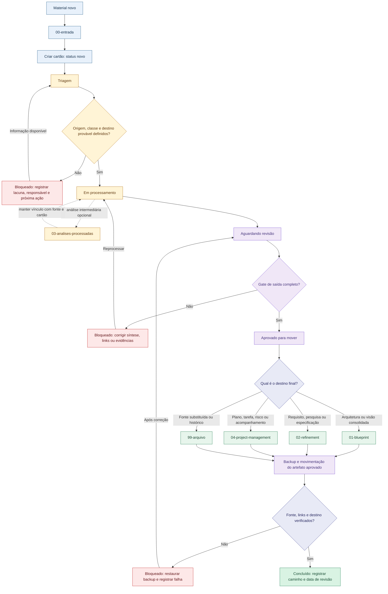

# Manifesto de Processamento

Este manifesto controla como materiais entram, são analisados, revisados e encaminhados. O arquivo original permanece preservado; o cartão de processamento registra o trabalho e a decisão.

## Escopo

O fluxo aplica-se a materiais Markdown e binários recebidos ou produzidos em `05-resources/Processar/Plataforma HUB/`. Cada arquivo ou lote coerente deve ter um cartão de processamento estável em `00-entrada/`; o arquivo original não é apagado, renomeado ou movido durante o processamento.

## Fluxo visual



## Contrato de dados

Todo cartão de processamento usa este frontmatter:

```yaml
---
tipo: cartao-processamento
status: novo
destino:
classe: fonte
origem:
proprietario:
data-entrada: 2026-08-31
data-revisao:
fonte-original:
documento-resultado:
substitui:
---
```

Os valores permitidos para `status` são: `novo`, `triagem`, `em-processamento`, `aguardando-revisao`, `aprovado-para-mover`, `concluido`, `bloqueado` e `arquivado`.

Os valores permitidos para `destino` são: `01-blueprint`, `02-refinement`, `04-project-management` e `99-arquivo`.

Os valores permitidos para `classe` são: `fonte`, `derivado`, `decisao` e `apoio`.

Materiais binários são acompanhados por cartões Markdown; o cartão registra a origem, o processamento, o resultado e a decisão sem substituir a fonte original.

## Transições de estado

| Estado | Significado | Próxima ação obrigatória |
|---|---|---|
| `novo` | Material chegou e ainda não foi examinado. | Identificar origem e contexto. |
| `triagem` | Tipo, relevância e classe estão sendo definidos. | Definir proprietário e destino provável. |
| `em-processamento` | Conteúdo está sendo resumido, convertido ou analisado. | Registrar fatos, hipóteses, decisões e lacunas. |
| `aguardando-revisao` | O processamento foi feito, mas ainda não foi validado. | Revisar conteúdo, links e destino. |
| `aprovado-para-mover` | O resultado passou pelo gate de saída. | Mover somente o artefato aprovado. |
| `concluido` | O resultado está no destino final e foi referenciado. | Monitorar apenas se houver nova evidência. |
| `bloqueado` | Falta informação, autorização, acesso ou decisão. | Registrar o bloqueio e responsável por removê-lo. |
| `arquivado` | A fonte foi preservada para rastreabilidade, sem uso corrente. | Não usar como especificação vigente. |

## Gate de saída

Um item só pode receber `aprovado-para-mover` quando:

- [ ] origem e contexto estão identificados;
- [ ] fonte, derivado, decisão ou apoio estão classificados;
- [ ] fatos, hipóteses, decisões e lacunas foram separados;
- [ ] proprietário e data de revisão estão registrados;
- [ ] destino final está definido;
- [ ] existe um documento-resultado ou justificativa explícita para arquivar;
- [ ] fonte original e artefato derivado estão ligados;
- [ ] dados pessoais ou confidenciais foram avaliados;
- [ ] links relativos foram testados.

O movimento só ocorre após o gate, e somente o artefato aprovado é encaminhado. Análises intermediárias podem permanecer em `03-analises-processadas/`, sempre ligadas ao cartão e à fonte original.

## Fila operacional

Abra [[HUB_Fila_Processamento]] para consultar a fila ativa, os bloqueios, os itens aguardando revisão e os artefatos prontos para mover.

## Procedimento de movimentação

1. Confirmar que o cartão está em `aprovado-para-mover`.
2. Confirmar que o destino é exatamente um dos quatro destinos permitidos.
3. Confirmar que o documento-resultado e a fonte original estão ligados.
4. Fazer uma cópia de segurança do arquivo antes do movimento.
5. Mover somente o artefato aprovado; não mover automaticamente todo o lote.
6. Reabrir os links de origem e resultado.
7. Atualizar `status` para `concluido`, preencher `data-revisao` e registrar o novo caminho.
8. Se a validação falhar, restaurar a cópia de segurança e marcar o cartão como `bloqueado`.

## Rotina de uso

1. Colocar materiais novos em `00-entrada/`.
2. Criar um cartão por arquivo ou lote coerente.
3. Trabalhar a fila pela view `Fila ativa`.
4. Usar `bloqueado` quando faltar informação, nunca esconder o problema movendo o arquivo.
5. Revisar a view `Aguardando revisão` antes de aprovar movimentos.
6. Mover apenas itens em `Prontos para mover`.
7. Conferir a view `Concluídos` ao final da sessão.

## Limite de automação

Não introduzir relocação automática enquanto a equipe não tiver usado o fluxo manual em pelo menos um lote delimitado e concordado sobre o vocabulário de estados. Até que essas duas condições sejam cumpridas, a triagem, a revisão e qualquer movimentação permanecem manuais.
