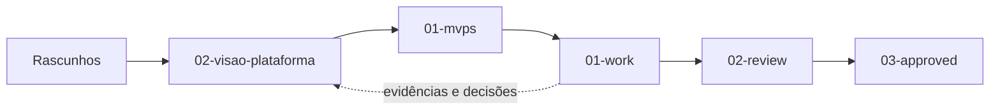
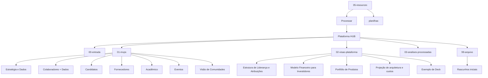

# 05 — Recursos: Arquivos de Processamento, MVPs e Memória do Projeto

> Staging de materiais brutos, rascunhos arquivados, hipóteses de MVP e artefatos da visão completa da Plataforma HUB.
>
> > [!info] Submissão 2026-09-05
> > `inbox/Plataforma HUB/01-mvps/`, `02-visao-plataforma/` e `00-entrada/01-acordo-parceria/` foram
> > submetidos ao gate e vivem agora em `02-review/` (congelados, `em-revisao`). As seções abaixo que
> > os descrevem permanecem como catálogo; os links apontam para o endereço atual.

## 1. Propósito desta pasta

`05-resources/` é o acervo operacional da HUB: guarda os arquivos que ainda estão sendo triados, os materiais de referência e os modelos que sustentam decisões de produto, negócio e investimento.

Esta pasta não é apenas um depósito de anexos. Ela preserva a memória de como uma hipótese nasceu, quais formatos foram utilizados, que premissas foram consideradas e quais artefatos podem alimentar as áreas refinadas do projeto.

### `inbox/` versus material refinado

| Espaço | Função | Tratamento esperado |
|---|---|---|
| `inbox/` | Inbox e triagem de documentos, imagens, apresentações, planilhas e rascunhos. | Ler, classificar, extrair decisões e encaminhar para a área adequada. |
| `00-entrada/` | Entrada de novos materiais antes da classificação. | Classificar em `01-mvps`, `02-visao-plataforma`, `03-analises-processadas` ou `99-arquivo`. |
| `01-mvps/` | Casos concretos, delimitados e mensuráveis para testar a tese. | Usar como ponte entre hipótese, execução e evidência. |
| `02-visao-plataforma/` | Visão de longo prazo, arquitetura, portfólio, finanças e organização. | Consultar como referência estratégica; validar premissas antes de divulgar. |
| `03-analises-processadas/` | Análises, conversões e reconciliações derivadas dos materiais de origem. | Preservar vínculo com a fonte e não tratar como material vigente sem revisão. |
| `99-arquivo/` | Histórico de versões e ideias que não são a fonte corrente. | Manter como memória; não usar como especificação vigente sem revisão. |
| `planilhas/` | Apoios tabulares e taxonomias auxiliares da pasta de recursos. | Preservar versionamento e registrar a finalidade de cada arquivo. |

O conteúdo aqui pode conter hipóteses, números ilustrativos e decisões provisórias. A presença de um arquivo não significa aprovação, compromisso comercial, orçamento contratado ou obrigação jurídica.

## 2. Mapa de evolução dos materiais

O fluxo é orientador, não uma regra de movimento automático. Um documento só deve migrar quando tiver propósito, proprietário, status e fonte claramente registrados.

## 3. Estrutura de diretórios

## 4. `inbox/Plataforma HUB/99-arquivo/Rascunhos iniciais/`

Este diretório reúne a primeira camada de exploração visual e conceitual da HUB.

Há muitos arquivos gerados ou recebidos em sequência, principalmente imagens `.jpeg` e `.png`, além de `.pdf` e `.pptx` de decks e propostas iniciais.

Os nomes podem refletir exportações automáticas, como séries `WhatsApp Image ...`, e não necessariamente representam uma versão nomeada ou aprovada.

O status **arquivado** significa que o material foi preservado para rastreabilidade, comparação e recuperação de contexto.

Não significa que a ideia foi descartada para sempre, nem que o visual ou texto é a referência atual.

Antes de reutilizar qualquer rascunho, verificar se ele conflita com a visão consolidada, a governança de dados ou o escopo do MVP vigente.

Quando um rascunho contiver uma decisão ainda relevante, registrar a decisão em documento textual refinado e manter o arquivo original apenas como fonte.

Exemplos de conteúdo encontrado incluem sequências de imagens de WhatsApp, visuais de sugestão de visões, decks iniciais e exportações de protótipos.

## 5. `../02-review/02-visao-plataforma/`

Esta é a visão de longo prazo: descreve o ecossistema que a HUB poderá construir depois que as hipóteses mais importantes forem validadas em casos reais.

### 5.1 Estrutura de Liderança e Atribuições

O diretório documenta a tese organizacional, o núcleo executivo horizontal, Heads de Verticais, responsabilidades, fronteiras de decisão, remuneração e cenários pós-MVP.

O desenho enfatiza um CORE compartilhado, verticais com conhecimento específico e comunidades que emergem das relações geradas pelas frentes.

O README local funciona como síntese; `Estrutura e Atribuições.docx` e a planilha de remuneração permanecem como fontes editáveis.

→ [Síntese de liderança e atribuições](inbox/Plataforma%20HUB/02-visao-plataforma/Estrutura%20de%20Liderança%20e%20Atribuições/README.md)

### 5.2 Modelo Financeiro para Investidores

O modelo combina assinaturas, projetos, eventos e success fees em uma tese de receita híbrida e recorrente.

O workbook possui resumo, premissas, preços, CAPEX/OPEX, projeção de cinco anos, unit economics, sensibilidade, checks e fontes.

Os indicadores do cenário-base incluem receita, EBITDA, empresas ativas, ARR, break-even, payback, LTV/CAC e MOIC ilustrativo.

Os números são saídas dependentes de premissas editáveis; precisam ser substituídos por contratos, propostas, custos de cloud, CAC, churn e dados operacionais antes de qualquer uso externo.

→ [Síntese do modelo financeiro](inbox/Plataforma%20HUB/02-visao-plataforma/Modelo%20Financeiro%20para%20Investidores/README.md)

### 5.3 Portfólio de Produtos

O portfólio apresenta duas jornadas conectadas: **Comunidades** e **Empresas**.

Na jornada Comunidades, a HUB cuida, prepara, conecta e expande pessoas, profissionais, fornecedores, criadores, pesquisadores e organizações.

Na jornada Empresas, transforma dados de pessoas, mercado e ecossistema em estratégia, desempenho, desenvolvimento e resultado.

Os documentos detalham produtos de inteligência, performance, saúde de times, talentos, desenvolvimento, carreira, mérito e impacto de negócio.

→ [Síntese do portfólio](inbox/Plataforma%20HUB/02-visao-plataforma/Portfólio%20de%20Produtos/README.md)

### 5.4 Projeção de arquitetura e custos

Este diretório transforma escopo funcional em estimativas iniciais de produto, tecnologia, dados, IA, QA, DevOps, segurança, infraestrutura e operação.

O princípio é um CORE modular com identidade, perfis, permissões, consentimento, integrações, notificações, analytics, administração, auditoria e logs.

As verticais — Estratégia & Dados, Colaboradores, Candidatos, Fornecedores, Acadêmico, Eventos e Comunidades — podem ser implantadas de modo independente quando fizer sentido.

O modelo não é orçamento definitivo: é instrumento para priorizar, comparar reutilização e calibrar custo com volume, integrações, segurança e equipe.

→ [Síntese de arquitetura e custos](inbox/Plataforma%20HUB/02-visao-plataforma/Projeção%20de%20arquitetura%20e%20custos%20-%20Plataforma/README.md)

### 5.5 Exemplo de Deck

Contém referência visual para apresentações e comunicação da tese. Use como inspiração de narrativa e linguagem visual, não como especificação funcional.

## 6. `../02-review/01-mvps/`

Esta é a área central de validação. Os MVPs não tentam construir toda a plataforma de uma vez; testam hipóteses em contextos reais, com escopo limitado, curadoria humana, regras simples e medição de resultado.

O padrão comum é: contexto → dados → diagnóstico → prioridade → ação → conexão → resultado → aprendizado.

O README detalhado desta pasta documenta fluxos, escopos, KPIs, governança, fases de execução, decisões adiadas e relação com a arquitetura completa.

→ [README detalhado de MVPs](inbox/Plataforma%20HUB/01-mvps/README.md)

### Síntese dos seis MVPs

| MVP | Contexto | Escala | Hipótese | Economia indicativa |
|---|---|---:|---|---:|
| **Monks — Estratégia & Dados** | Pessoas × negócio | Case controlado | Dados podem gerar leitura executiva, sinais, prioridades e ações úteis. | Custo R$ 170.620; caixa R$ 17.320; diferido R$ 153.300. |
| **Bblend — Colaboradores + Dados** | Pessoas dentro da empresa | 80 colaboradores, 8 gestores, 6 áreas, 24 KPIs | Competências, talentos e oportunidades internas podem ser ligados ao resultado. | Custo R$ 228.880; caixa R$ 24.780; diferido R$ 204.100. |
| **Firjan — Candidatos** | Formação → oportunidade → contratação | 10 empresas, até 1.000 candidatos, cerca de 50 oportunidades | A HUB pode reduzir o gap entre formação, entrevista e contratação. | Custo R$ 276.580; caixa R$ 41.280; diferido R$ 235.300. |
| **Sebrae/GINGA — Fornecedores** | Fornecedores × compradores | 100 fornecedores, 100 compradores, cerca de 200 demandas | Demandas reais podem gerar matches, propostas e negócios qualificados. | Custo R$ 241.100; caixa R$ 30.800; diferido R$ 210.300. |
| **Mackenzie — Acadêmico** | Universidade × mercado | Aplicação institucional delimitada | Conhecimento e projetos acadêmicos podem atender necessidades empresariais. | Aplicar modelo de referência Firjan; validar orçamento no caso escolhido. |
| **HUB Eventos** | Pessoas → experiência → negócio | 1 evento, 1.000 participantes, 10 marcas | Público, trabalhadores, fornecedores e marcas podem gerar evidência de retorno. | Custo R$ 341.840; caixa R$ 40.640; diferido R$ 301.200. |

Os valores acima são síntese de memória econômica, não orçamento ou promessa. Para detalhes de escopo e indicadores, consultar o README local de cada MVP.

### 6.1 Estratégia e Dados — Monks

Primeiro laboratório da frente Estratégia & Dados, com upload e padronização de dados, visão executiva, cruzamento pessoas × negócio, sinais baseados em regras, prioridades, plano de ação e acompanhamento antes/depois.

O case deve provar utilidade da leitura, qualidade dos cruzamentos, adoção das ações, evolução dos indicadores, economia de análise manual e disposição para pagar.

→ [README do MVP Monks](inbox/Plataforma%20HUB/01-mvps/MVP%20-%20Estratégia%20e%20Dados/README.md)

### 6.2 Colaboradores + Dados — Bblend

Conecta resultado do negócio, perfis, competências, gaps, oportunidades internas, matching curado e planos de desenvolvimento.

O dimensionamento de referência considera 80 colaboradores, 8 gestores, 6 áreas, 12 oportunidades e aproximadamente 60 matches.

→ [README do MVP Bblend](inbox/Plataforma%20HUB/01-mvps/MVP%20-%20Colaboradores%20%2B%20Dados/README.md)

### 6.3 Candidatos — Firjan

Conecta pessoas formadas às vagas de empresas associadas e acompanha shortlist, candidatura, entrevistas, contratação e impacto.

Os indicadores principais incluem aderência, tempo até oportunidade, conversões do funil, lacunas de competências e motivos de não avanço.

→ [README do MVP Firjan](inbox/Plataforma%20HUB/01-mvps/MVP%20-%20Candidatos/README.md)

### 6.4 Fornecedores — Sebrae/GINGA

Testa diagnóstico de maturidade, demandas, matching, curadoria, reuniões, negociação e registro de negócios sem marketplace completo.

O foco de escala é a operação, a curadoria e o acompanhamento do funil, e não a infraestrutura bruta para 200 usuários.

→ [README do MVP Sebrae/GINGA](inbox/Plataforma%20HUB/01-mvps/MVP%20-%20Fornecedores/README.md)

### 6.5 Acadêmico — Mackenzie

Usa a estrutura de Candidatos como referência para conectar alunos, docentes, pesquisadores, universidades, empresas, projetos, bolsas, estágios e carreira.

Deve começar por um caso institucional bem delimitado, mantendo o módulo independente até que integrações demonstrem valor.

→ [README do MVP Acadêmico](inbox/Plataforma%20HUB/01-mvps/MVP%20-%20Acadêmico/README.md)

### 6.6 Eventos

É uma demonstração integrada de pessoas, experiência e negócio. A HUB complementa — não substitui — ticketing, credenciamento, financeiro e gestão de palco.

O MVP mede ativações, experiência, acessibilidade, segurança, leads consentidos, valor movimentado e intenção de renovação.

→ [README do MVP Eventos](inbox/Plataforma%20HUB/01-mvps/MVP%20-%20Eventos/README.md)

### 6.7 Visão de Comunidades

Comunidades é uma camada de pertencimento e continuidade que nasce das relações das verticais; não precisa ser um MVP independente no início.

Perfil, consentimento e histórico devem permanecer conectados ao CORE para evitar recadastro e reinício de jornada.

→ [README da Visão de Comunidades](inbox/Plataforma%20HUB/01-mvps/Visão%20de%20Comunidades/README.md)

## 7. Apoios tabulares e taxonomias

Os apoios tabulares e taxonomias devem permanecer em `planilhas/` quando forem auxiliares e não pertencerem a uma camada de refinamento específica.

`HUB_Taxonomia_Receita_Reconhecimento_v1.md` foi movido para `01-work/dados-tech-financas/modelos-financeiros/`, onde passa a ser o artefato de refinamento financeiro ligado ao `FIN-002` e à tarefa `P01-T03`.

Ao adicionar uma planilha ou tabela, informe no nome a versão, registre a finalidade e indique se é fonte, cópia de trabalho ou saída.

## 8. Tipos de arquivo e uso esperado

| Extensão | Uso predominante | Cuidados |
|---|---|---|
| `.xlsx` | Modelos financeiros, custos de MVP, capacidade, cenários e unit economics. | Números são premissas editáveis; revisar abas, fórmulas, checks e fontes. |
| `.docx` | Portfólios, teses de produto, liderança, comunidades e documentos de contexto. | O README pode sintetizar, mas o documento-fonte conserva detalhes de edição. |
| `.pdf` / `.pptx` | Decks, apresentações, propostas e materiais de comunicação. | Tratar como referência de narrativa; confirmar se está vigente. |
| `.jpeg` / `.png` | Visuais de apoio, protótipos, diagramas e exportações de tela. | Não presumir que uma imagem seja requisito funcional ou decisão aprovada. |
| `.md` | Sínteses, instruções, taxonomias e documentação navegável. | Manter links relativos e declarar status e escopo. |

## 9. Arquivos-chave

- [Índice de MVPs](inbox/Plataforma%20HUB/01-mvps/README.md)
- [Portfólio completo](inbox/Plataforma%20HUB/02-visao-plataforma/Portfólio%20de%20Produtos/README.md)
- [Modelo financeiro](inbox/Plataforma%20HUB/02-visao-plataforma/Modelo%20Financeiro%20para%20Investidores/README.md)
- [Liderança e atribuições](inbox/Plataforma%20HUB/02-visao-plataforma/Estrutura%20de%20Liderança%20e%20Atribuições/README.md)
- [Arquitetura e custos](inbox/Plataforma%20HUB/02-visao-plataforma/Projeção%20de%20arquitetura%20e%20custos%20-%20Plataforma/README.md)
- [MVP Monks](inbox/Plataforma%20HUB/01-mvps/MVP%20-%20Estratégia%20e%20Dados/README.md)
- [MVP Bblend](inbox/Plataforma%20HUB/01-mvps/MVP%20-%20Colaboradores%20%2B%20Dados/README.md)
- [MVP Firjan](inbox/Plataforma%20HUB/01-mvps/MVP%20-%20Candidatos/README.md)
- [MVP Sebrae/GINGA](inbox/Plataforma%20HUB/01-mvps/MVP%20-%20Fornecedores/README.md)
- [MVP Mackenzie](inbox/Plataforma%20HUB/01-mvps/MVP%20-%20Acadêmico/README.md)
- [MVP Eventos](inbox/Plataforma%20HUB/01-mvps/MVP%20-%20Eventos/README.md)
- [Visão de Comunidades](inbox/Plataforma%20HUB/01-mvps/Visão%20de%20Comunidades/README.md)
- [Taxonomia de receita e reconhecimento](../01-work/dados-tech-financas/modelos-financeiros/HUB_Taxonomia_Receita_Reconhecimento_v1.md)

Os arquivos binários correspondentes ficam nas mesmas pastas dos READMEs. Ao referenciá-los, manter o nome exato e codificar espaços como `%20` quando o consumidor exigir URL.

## 10. Regras práticas de organização

### Deve permanecer em `05-resources`

1. Material bruto recebido ou produzido durante descoberta.
2. Rascunhos arquivados necessários para histórico e comparação.
3. Planilhas de hipótese, custo, capacidade e cenários ainda em validação.
4. Documentos de referência que alimentam sínteses, MVPs e decisões.
5. Visuais que explicam uma hipótese, jornada ou proposta.
6. Artefatos cuja origem, versão ou status ainda precisam de triagem.

### Deve migrar para `01-work`

1. Arquitetura e escopo consolidados como referência estrutural.
2. Contratos de módulos, entidades, integrações e decisões técnicas consolidadas.
3. Requisitos, fluxos, jornadas e critérios de aceite refinados.
4. Aprendizados de entrevistas, pilotos e testes convertidos em decisões operacionais.
5. Regras de governança que deixaram de ser hipótese.

### Deve migrar para `02-review` / `03-approved`

1. Pacotes congelados de revisão com gate, dono e data (`02-review/`).
2. Finais assinados pelo gate, nunca editados no lugar (`03-approved/`).

### Deve migrar para `04-project-management`

1. Plano de trabalho, responsáveis, marcos, riscos e dependências.
2. Cronogramas, atas, decisões de acompanhamento e status de entrega.
3. Custos aprovados para controle, orçamento e acompanhamento de execução.
4. Critérios de saída e indicadores de progresso do projeto.

### Quando arquivar

Arquive quando o material tiver sido substituído por uma versão nomeada, quando a hipótese tiver sido encerrada, quando o piloto tiver terminado ou quando a fonte for importante apenas para rastreabilidade.

Preserve o nome original, evite sobrescrever a fonte e registre a data, motivo e documento substituto sempre que possível.

### Quando processar

Processe quando houver uma decisão implícita, dado novo, proposta comercial, mudança de escopo ou material que possa alimentar uma hipótese ativa.

O processamento mínimo é: identificar origem, resumir conteúdo, classificar status, extrair decisões, apontar lacunas e criar link para o documento refinado.

O fluxo operacional é controlado pelo [Manifesto de Processamento](inbox/Plataforma%20HUB/manifesto-processamento.md) e pela [Fila de Processamento](inbox/Plataforma%20HUB/HUB_Fila_Processamento.base).

### Piloto verificado

O caminho completo do piloto Firjan pode ser percorrido a partir desta página:

1. [Manifesto de Processamento](inbox/Plataforma%20HUB/manifesto-processamento.md)
2. [Fila de Processamento](inbox/Plataforma%20HUB/HUB_Fila_Processamento.base)
3. [Cartão do piloto Firjan](inbox/Plataforma%20HUB/00-entrada/piloto-firjan-processamento.md)
4. [Fonte original — workbook Firjan](inbox/Plataforma%20HUB/01-mvps/MVP%20-%20Candidatos/fontes/HUB_MVP_Firjan_10_Empresas_1000_Candidatos.xlsx)
5. [Resultado refinado do piloto](../01-work/pesquisa-e-confianca/pesquisa/piloto-firjan-processamento.md)

O cartão mantém os vínculos recíprocos com a fonte e o resultado; o workbook permanece preservado no caminho original.

## 11. Observação econômica sobre os MVPs

Cada planilha deve separar três camadas que não podem ser confundidas:

| Camada | Significado |
|---|---|
| **Custo econômico** | Valor total de produto, design, tecnologia, dados, QA, segurança, operação e trabalho realizado. |
| **Caixa pré-aporte** | Desembolso efetivo necessário antes de um investimento ou aporte. |
| **Valor diferido** | Trabalho de fundadores ou time feito sem pagamento imediato, mas que possui valor econômico e precisa ser registrado. |

Um MVP sem cobrança para o cliente não é economicamente gratuito.

O caixa pode ser pequeno enquanto o custo econômico é alto, pois parte do trabalho foi diferida pelos fundadores ou pelo time.

Essa distinção permite estimar capital necessário, reconhecer contribuição dos sócios e entender o esforço que precisa cair antes da escala.

Crédito de sócio, reembolso, comissão, equity, vesting ou obrigação futura não nasce automaticamente da planilha.

Qualquer formalização deve ser avaliada e registrada separadamente com orientação jurídica e contábil.

## 12. Checklist antes de fechar uma triagem

- [ ] O arquivo tem origem e contexto identificáveis?
- [ ] O status está claro: rascunho, ativo, substituído ou arquivado?
- [ ] Existe README ou síntese apontando sua finalidade?
- [ ] As premissas foram separadas de fatos observados?
- [ ] Os números indicam unidade, período e fonte?
- [ ] Dados pessoais ou confidenciais estão protegidos?
- [ ] O material precisa migrar para 01-work, 02-review, 03-approved ou 04-project-management?
- [ ] Os links relativos foram testados a partir deste README?

> **Regra de ouro:** `05-resources` conserva o caminho da descoberta; `01-work`, `02-review` e `03-approved` transformam essa descoberta em elaboração, decisão de gate e final compartilhável. `04-project-management` governa a execução.
