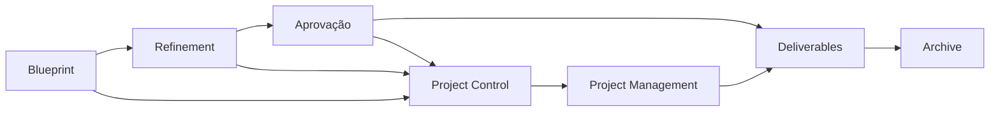

# The New HUB

Este repositório é o centro operacional do HUB: aqui vivem a estratégia, o blueprint, o refinamento, as aprovações, a gestão do projeto, os recursos de apoio, as entregas finais e o histórico arquivado.

## Setup rápido

```bash
git clone <url-do-repositorio>
cd "The New HUB dev-2"
```

Depois disso:

1. Abra o repositório no Obsidian.
2. Confirme que o `project-map.md` está disponível na raiz.
3. Use o `README.md` da raiz e o [README da pasta blueprint](01-blueprint/README.md) para orientação inicial.
4. Confirme que os plugins comunitários listados em `.obsidian/community-plugins.json` estão instalados e ativados.
5. Para o fluxo de tarefas, consulte [`TaskNotes/Start Here.md`](TaskNotes/Start%20Here.md).

O arquivo [`mdbase.yaml`](mdbase.yaml) configura o TaskNotes para usar `_types/` como pasta de definições e `TaskNotes/` como espaço de trabalho das tarefas.

## Como ler este repositório

Se você chegou agora, siga esta ordem:

1. Leia [`README.md`](README.md) para entender a estrutura geral.
2. Abra o [`project-map.md`](project-map.md) para enxergar o mapa vivo do repositório.
3. Vá para o framework em [`HUB_Framework_Desenvolvimento_Projeto_Tres_Camadas.md`](00-project-control/framework/HUB_Framework_Desenvolvimento_Projeto_Tres_Camadas.md).
4. Depois revise a fundação do projeto em [`HUB_Fundacao_Blueprint_Projeto.md`](01-blueprint/estrategia/HUB_Fundacao_Blueprint_Projeto.md).
5. Se houver lacunas, consulte o gap register em [`HUB_Registro_Lacunas_Projeto.md`](00-project-control/registro-lacunas/HUB_Registro_Lacunas_Projeto.md).
6. Para entender a ordem de execução, abra o plano diretor em [`HUB_Plano_Fases_v1.md`](04-project-management/planos-mestres/HUB_Plano_Fases_v1.md) (fases P01→P07, cronograma e marcos).

## Visão geral das camadas



## Mapa principal de pastas

```mermaid
flowchart TB
    R[Raiz do projeto]
    R --> PC[00-project-control]
    R --> BP[01-blueprint]
    R --> RF[02-refinement]
    R --> AP[03-approval]
    R --> PM[04-project-management]
    R --> RS[05-resources]
    R --> DL[06-deliverables]
    R --> AR[99-archive]
    R --> TN[TaskNotes]
    R --> SYS[System]
    R --> TYP[_types]

    PC --> PCF[decisoes / dependencias / escopo / framework / indices / premissas / registro-lacunas / registro-mudancas / riscos]
    BP --> BPF[estrategia / produto / modelo-negocio / tecnologia / dados-inteligencia / visao-lancamento / operacoes / marca-mercado / governanca-juridico]
    RF --> RFF[estrategia / modelos-financeiros / pesquisa / prototipos / refinamento-governanca / refinamento-modelo-dados / refinamento-produto / revisoes / revisoes-iteradas / testes-experimentos]
    AP --> APF[evidencias / pacotes-revisao / criterios-aprovacao / aprovado / bloqueado / aprovado-condicionalmente / portao-lancamento]
    PM --> PMF[planos-mestres / planos-fase / tarefas / marcos / cronogramas / registros-trabalho / relatorios-status / atas-reuniao / retrospectivas]
    RS --> RSF[documentos / materiais-origem / referencias-externas / imagens / apresentacoes / conjuntos-dados / planilhas / modelos]
    DL --> DLF[dados / governanca / investidor / lancamento / negocio / produto]
    AR --> ARF[descontinuado / rejeitado / superado / instantaneos-historicos]
    TN --> TNF[Start Here / Tasks / Views]
    SYS --> SYSF[Plugins docs]
    TYP --> TYPF[task.md]
```



## O que cada pasta significa

- [`00-project-control/`](00-project-control/) — regras do jogo: framework, escopo, decisões, dependências, premissas, riscos, gaps, registro de mudanças (4 notas + template) e índices.
- [`01-blueprint/`](01-blueprint/) — a visão-base do projeto: estratégia, produto, negócios, tecnologia, dados, governança e visão de lançamento.
- [`02-refinement/`](02-refinement/) — onde a proposta é testada, comparada, melhorada e substituída quando necessário (spine P03: 9 rascunhos G03.A1–C5 + `refinamento-governanca/` com os mapas `HUB_Mapa_Documentos_Oficiais_v1.md` / `HUB_Mapa_Documentos_Nao_Obrigatorios_v1.md` e a instrução `HUB_Instrucao_Vault_Documentos_Oficiais.md` + `refinamento-produto/` com 4 artefatos).
- [`03-approval/`](03-approval/) — evidências e pacotes de revisão para decidir o que pode avançar, o que fica bloqueado e o que precisa de ajuste (bloqueado: modelo de indicadores não aprovado + relatórios entity-key/ROI/corrected-CSV).
- [`04-project-management/`](04-project-management/) — planejamento e controle: plano diretor P01→P07, 7 planos de fase, 56 tarefas P01→P07 + 8 BP, marcos M00→M07, cronogramas (Bases) + base de execução (9 views), atas (01/09 Alinhamento + 02/09 SEBRAE/Ginga estruturadas + `.docx` + `_template-ata.md`), cenários P01-S01→S06 (6 segmentos), logs de progresso (`logs-progresso/` P01/P02/P03) e status.
- [`04-project-management/registro-mestre/`](04-project-management/registro-mestre/) — matriz canônica de coordenação das 56 tarefas, dependências, gaps, critérios, evidências e status.
- [`05-resources/`](05-resources/) — materiais de apoio e origem: `Processar/Plataforma HUB/` (151 arquivos — 7 MVPs + visão de plataforma com Arquitetura-Custos 96 telas + Rascunhos), documentos, referências, imagens, apresentações, datasets, planilhas e templates.
- [`06-deliverables/`](06-deliverables/) — saídas prontas para uso fora do repositório, quando aprovadas.
- [`99-archive/`](99-archive/) — tudo o que foi substituído, rejeitado, descontinuado ou preservado por histórico.
- [`TaskNotes/`](TaskNotes/) — 30 notas operacionais de tarefas, visualizações Bases (agenda, kanban, calendário, pomodoro, relações) + a view `documentacao-oficial.base` para o vault isolado e guia inicial do fluxo.
- [`System/`](System/) — documentação de apoio sobre plugins, Bases, Dataview, Datacore, gráficos, Canvas e TaskNotes (7 docs incluindo `JSON Canvas Spec.md`) + `attachments/` (áudios das atas).
- [`_types/`](%5Ftypes/) — definições de tipos usadas pelo mdbase/TaskNotes.
- [`.obsidian/`](.obsidian/) — configurações do vault, plugins comunitários, 13 temas e workspace do Obsidian.
- [`.omo/`](.omo/) — planos e artefatos de orquestração do OhMyOpenCode.
- [`.logs/`](.logs/) — logs de execução de subtasks e agentes.
- [`mdbase.yaml`](mdbase.yaml) — configuração do sistema de tipos e exclusões do mdbase.

## Regras de navegação

- Comece em `00-project-control/` quando precisar entender contexto, limites e decisões.
- Use `01-blueprint/` para responder “o que estamos construindo?”.
- Use `02-refinement/` para responder “o que foi testado, revisado ou melhorado?”.
- Use `03-approval/` para responder “isso já pode ser considerado válido?”.
- Use `04-project-management/` para responder “o que está em andamento agora?”.
- Use `05-resources/` para localizar a matéria-prima do trabalho.
- Use `06-deliverables/` para encontrar o que já está pronto para distribuição.
- Use `99-archive/` para consultar histórico, mas não para continuar trabalho ativo.
- Use `TaskNotes/` para revisar tarefas por agenda, kanban e visões Bases.
- Use `System/` quando precisar consultar a documentação local das ferramentas do vault.
- Não edite manualmente arquivos compilados dos plugins em `.obsidian/plugins/`, salvo quando a manutenção do vault exigir isso.

## Arquivos-chave

- [`HUB_Framework_Desenvolvimento_Projeto_Tres_Camadas.md`](00-project-control/framework/HUB_Framework_Desenvolvimento_Projeto_Tres_Camadas.md) — descreve o processo central do projeto.
- [`HUB_Fundacao_Blueprint_Projeto.md`](01-blueprint/estrategia/HUB_Fundacao_Blueprint_Projeto.md) — ponto de partida consolidado para a arquitetura do HUB.
- [`HUB_Registro_Lacunas_Projeto.md`](00-project-control/registro-lacunas/HUB_Registro_Lacunas_Projeto.md) — lista transversal de lacunas, riscos e pendências (68 notas `lacunas/` BRD/DAT/FIN/GOV/TEC).
- [`HUB_Mapa_Documentos_Oficiais_v1.md`](02-refinement/refinamento-governanca/HUB_Mapa_Documentos_Oficiais_v1.md) — matriz canônica 01-08 dos documentos oficiais obrigatórios.
- [`HUB_Mapa_Documentos_Nao_Obrigatorios_v1.md`](02-refinement/refinamento-governanca/HUB_Mapa_Documentos_Nao_Obrigatorios_v1.md) — matriz canônica 09-14 dos documentos não-obrigatórios mas requeridos.
- [`HUB_Instrucao_Vault_Documentos_Oficiais.md`](02-refinement/refinamento-governanca/HUB_Instrucao_Vault_Documentos_Oficiais.md) — instrução visual do vault isolado `HUB_Documentos_Oficiais`.
- [`HUB_Lacunas_Projeto.base`](00-project-control/registro-lacunas/HUB_Lacunas_Projeto.base) — base de dados dos gaps.
- [`HUB_Tarefas_Projeto.base`](04-project-management/tarefas/HUB_Tarefas_Projeto.base) — base central das tarefas do blueprint (BP-001..008).
- [`HUB_Tarefas_Fases_Execucao.base`](04-project-management/registros-trabalho/HUB_Tarefas_Fases_Execucao.base) — base de execução das 56 tarefas de fase (9 views: por Fase, Crítico `★`, Paralelizáveis, Kanban, Prioridade, Por Dono, Portfolio, Bloqueadas, Gaps).
- [`matriz-fases-tarefas-v1.md`](04-project-management/registro-mestre/matriz-fases-tarefas-v1.md) — fonte de coordenação fase/tarefa, com 56 linhas P01–P07 (P01 7 `concluido`, P02 6 `concluido`, P03 9 `em-revisao`, P04–P07 34 `pendente`).
- [`HUB_Plano_Fases_v1.md`](04-project-management/planos-mestres/HUB_Plano_Fases_v1.md) — plano diretor de faseamento sequencial P01→P07 (spine DAT, GOV/TEC paralelizáveis, alternativa 4-fases + §11 Glossário).
- [`HUB_Escopo_Estrategico_Documento_Mae_v2_*.md`](02-refinement/estrategia/segundo-rascunho-projeto/) — Doc-Mãe v2 Investor Ready (3 variantes: `Investor_Ready_pt-BR`, `Pronta_Investidor`, `Plano_Prontidao_Investidor`).
- [`P01_Arquitetura_Oferta_Negocio.md`](04-project-management/planos-fase/P01_Arquitetura_Oferta_Negocio.md) — P01 oferta & negócio (STR/FIN/GTM) → `BP-001`.
- [`P02_Produto_Operacao.md`](04-project-management/planos-fase/P02_Produto_Operacao.md) — P02 produto & operação (PRD) → `BP-002`+`BP-005`.
- [`P03_Dados_Canonicos.md`](04-project-management/planos-fase/P03_Dados_Canonicos.md) — P03 spine dados canônicos (DAT-001..010, sub-gates M03.A/B/C) → `BP-003`.
- [`P04_Governanca_Confianca.md`](04-project-management/planos-fase/P04_Governanca_Confianca.md) — P04 governança & confiança (GOV-001..009) → `BP-006`.
- [`P05_Tecnologia_Contratual.md`](04-project-management/planos-fase/P05_Tecnologia_Contratual.md) — P05 tecnologia contratual (TEC-001..007) → `BP-004`.
- [`P06_Economia_GTM_Evidencia.md`](04-project-management/planos-fase/P06_Economia_GTM_Evidencia.md) — P06 economia & GTM com evidência → `BP-007`.
- [`P07_Portao_Lancamento.md`](04-project-management/planos-fase/P07_Portao_Lancamento.md) — P07 portão de lançamento (LCH-001..007) → `BP-008`.
- [`P01-T01`→`P07-T07`](04-project-management/tarefas/) — 56 tarefas de execução (P01 7 + P02 6 + P03 9 + P04 8 + P05 7 + P06 12 + P07 7) com `phase`, `gap_ids`, `dependencies`.
- [`cronograma-fases-v1.base`](04-project-management/cronogramas/cronograma-fases-v1.base) — cronograma Bases com 6 views (Timeline, Caminho Crítico, Paralelizáveis, Por Dono, Portfolio, Gaps).
- [`marcos-fases-v1.md`](04-project-management/marcos/marcos-fases-v1.md) — marcos M00→M07 + sub-gates M03.A/B com critérios G01.x→G07.x.
- [`template-decisao.md`](00-project-control/decisoes/template-decisao.md) — modelo para registrar decisões.
- [`_template-ata.md`](04-project-management/atas-reuniao/_template-ata.md) — template canônico de ata estruturada (TL;DR, decisões, ações `- [ ] @dono`, callouts colapsados, `audio.mp3`).
- [`Transcript Alinhamento - Plataforma.md`](04-project-management/atas-reuniao/Transcript%20Alinhamento%20-%20Plataforma.md) — ata estruturada 01/09/2026 (decisões piloto 50/50, valor hora R$180–250, infra Hostinger, MRR R$15k).
- [`Transcript meeting SEBRAE 02-09-2026.md`](04-project-management/atas-reuniao/Transcript%20meeting%20SEBRAE%2002-09-2026.md) — ata estruturada 02/09/2026 SEBRAE/Ginga (evento 28/10 30 fornecedores, 10 decisões, 10 ações, MVP validado; + `.docx` 51 KB docx padrão).
- [`template-reuniao.md`](04-project-management/atas-reuniao/template-reuniao.md) — redirect legado para `_template-ata.md`.
- [`P01-entregaveis-*.md` / `P02-*.md` / `P03-*.md`](04-project-management/registros-trabalho/logs-progresso/) — logs consolidados de entregáveis por fase (P01 6 itens, P02 6, P03 18 artefatos) + `Sat 29 Aug 2026.md`.
- [`TaskNotes/Start Here.md`](TaskNotes/Start%20Here.md) — guia inicial do fluxo de tarefas.
- [`TaskNotes/Views/tasks-default.base`](TaskNotes/Views/tasks-default.base) — visão padrão das tarefas (7 views: agenda, calendar, kanban, mini-calendar, pomodoro, relationships, tasks).
- [`_types/task.md`](%5Ftypes/task.md) — definição do tipo de tarefa.
- [`mdbase.yaml`](mdbase.yaml) — configuração do sistema de tipos e exclusões.
- [`System/Plugins docs/`](System/Plugins%20docs/) — documentação local das ferramentas de Obsidian (7 docs: Charts, Dataview Charts, JSON Canvas Spec, Obsidian Base, Task Notes, Tracker, datacore).

## Como usar

- Para entender o projeto: comece por este README e pelo `project-map.md`.
- Para entender a ordem de execução: abra [`HUB_Plano_Fases_v1.md`](04-project-management/planos-mestres/HUB_Plano_Fases_v1.md) e o [`cronograma-fases-v1.base`](04-project-management/cronogramas/cronograma-fases-v1.base) (Timeline P01→P07).
- Para trabalhar na estratégia: entre em `01-blueprint/`.
- Para controlar execução: use `04-project-management/` — fases em `planos-fase/`, 56 tarefas em `tarefas/P01-T01→P07-T07`, execução em `registros-trabalho/HUB_Tarefas_Fases_Execucao.base` (9 views), gates em `marcos/marcos-fases-v1.md`.
- Para coordenar execução: consulte primeiro a [`matriz-fases-tarefas-v1.md`](04-project-management/registro-mestre/matriz-fases-tarefas-v1.md); as notas individuais em `tarefas/` continuam sendo a fonte da intenção e dos critérios.
- Para consultar fontes e materiais: use `05-resources/`.
- Para revisar entregas: use `03-approval/` e `06-deliverables/`.

## Setup da camada de refinamento

Use esta camada quando o blueprint já existir e você quiser transformar hipótese em material mais verificável.

Fluxo recomendado:

1. Abra a pasta correta dentro de `02-refinement/`.
2. Leia o artefato de pesquisa ou síntese relacionado.
3. Compare com o blueprint de origem em `01-blueprint/`.
4. Registre gaps, decisões e evidências novas antes de mover algo para aprovação.

## Como usar a camada de refinamento

- Use `pesquisa/` para pesquisas e validações exploratórias.
- Use `testes-experimentos/` para testes, provas de conceito e experimentos.
- Use `prototipos/` para protótipos e simulações.
- Use `revisoes/` e `revisoes-iteradas/` para feedback e versões iteradas.
- Use `refinamento-modelo-dados/` para sínteses semânticas e ajustes de dados.
- Use `modelos-financeiros/` para requisitos e refinamentos financeiros.
- Use `refinamento-produto/` para ajustar escopo, fluxo e experiência.
- Use `refinamento-governanca/` para LGPD, controle e responsabilidades.

## Contribuição nesta camada

1. Escreva em pt-BR.
2. Mantenha o status do material claro: rascunho, pesquisa, revisão, refinamento ou aprovado.
3. Não duplique o que já existe em `01-blueprint/`; refina-se aqui, não se reescreve o original.
4. Sempre cite o artefato de origem quando a nota for derivada.
5. Se o resultado virar decisão consolidada, promova o conteúdo para a camada correta.

## Como contribuir

1. Mantenha os arquivos em pt-BR.
2. Prefira editar a pasta correta em vez de duplicar conteúdo.
3. Preserve a estrutura de camadas do projeto.
4. Atualize os links internos quando mover ou criar arquivos.
5. Se a mudança afetar o mapa do projeto, atualize também o `project-map.md`.
6. Antes de abrir PR ou enviar alterações, revise se não há arquivos não relacionados no working tree.
7. Logs de execução ficam em `.logs/`; não edite manualmente.
8. Planos e artefatos do orquestrador ficam em `.omo/`; não edite manualmente.

## Como usar o repositório no dia a dia

Se você estiver **planejando**, vá para `01-blueprint/` + [`HUB_Plano_Fases_v1.md`](04-project-management/planos-mestres/HUB_Plano_Fases_v1.md) (ordem P01→P07).

Se você estiver **pesquisando ou testando**, vá para `02-refinement/` (cite a fase `P0x` e o gap correspondente).

Se você estiver **decidindo aprovação**, vá para `03-approval/` (monte o pacote em `pacotes-revisao/` e valide no gate `marcos-fases-v1.md`).

Se você estiver **executando o projeto**, vá para `04-project-management/` — fases em `planos-fase/`, 56 tarefas em `tarefas/P01-T01→P07-T07`, base de execução em `registros-trabalho/HUB_Tarefas_Fases_Execucao.base` (Kanban por Fase/Status/Prioridade), cronograma em `cronogramas/cronograma-fases-v1.base`, gates em `marcos/marcos-fases-v1.md`.

Se você estiver **procurando materiais de apoio**, vá para `05-resources/`.

Se você estiver **buscando a entrega final**, vá para `06-deliverables/` (só entra o que saiu de `03-approval/aprovado/`).

Se você estiver **auditando o passado**, vá para `99-archive/`.

## Convenções de leitura

- `blueprint` = hipótese ou direção base.
- `refining` = material em evolução.
- `aprovado-condicionalmente` = pode avançar com ressalvas.
- `aprovado` = pronto para uso.
- `bloqueado` = precisa de dependência ou decisão.
- `superado` = substituído por uma versão melhor.
- `descontinuado` = desativado, sem intenção de retomada.
- `rejeitado` = não aprovado e arquivado.

## Sequenciamento atual (faseamento P01→P07)

O projeto agora possui um **faseamento sequencial** para gestão eficiente:

- **P01 Oferta & Negócio** → **P02 Produto & Operação** → **P03 Dados Canônicos (spine, sub-gates M03.A/B/C)** → **P04 Governança** ↔ **P05 Tecnologia** (paralelizáveis) → **P06 Economia & GTM** → **P07 Portão de Lançamento**
- Detalhe em [`HUB_Plano_Fases_v1.md`](04-project-management/planos-mestres/HUB_Plano_Fases_v1.md) e em cada `P0x` em [`planos-fase/`](04-project-management/planos-fase/)
- **56 tarefas de execução** em [`tarefas/P01-T01→P07-T07`](04-project-management/tarefas/) (7+6+9+8+7+12+7) com `phase`, `gap_ids`, `dependencies`, organizadas pela base [`HUB_Tarefas_Fases_Execucao.base`](04-project-management/registros-trabalho/HUB_Tarefas_Fases_Execucao.base) (9 views: por Fase, Crítico `★`, Kanban, Prioridade, Por Dono, Gaps)
- Cronograma visual em [`cronograma-fases-v1.base`](04-project-management/cronogramas/cronograma-fases-v1.base) (views: Timeline, Caminho Crítico, Paralelizáveis, Por Dono)
- Gates verificáveis em [`marcos-fases-v1.md`](04-project-management/marcos/marcos-fases-v1.md) (M00→M07, critérios G01.x→G07.x)
- Alternativa leve de **4 fases** documentada no plano diretor para times enxutos

## Estado atual do projeto

- A matriz canônica registra 56 tarefas: P01=7 `concluido`, P02=6 `concluido`, P03=9 `em-revisao` (rascunhos G03.A1–G03.C5 entregues em `02-refinement/refinamento-modelo-dados/` + `02-refinement/refinamento-governanca/`), P04=8 `pendente`, P05=7 `pendente`, P06=12 `pendente` e P07=7 `pendente` (total 13 `concluido`/`- [x]`, 34 `pendente`/`- [ ]` + 9 `em-revisao`/`- [ ]`).
- Os requisitos mínimos de `DAT-010` (G03.B2), `TEC-005` (G05.4), `TEC-007` (G05.7) e `LCH-007` (G07.7) são bloqueadores dos respectivos gates; extensões estão classificadas como pós-MVP.
- `P03-T01` (modelo lógico 25 entidades) a `P03-T09` (fluxos+XLSX reconstruído + validações entity-key/ROI/corrected-CSV) estão em `em-revisao` para validação Dados+Tech+LGPD; `P07-T01` depende explicitamente de `P04-T01` e `P06-T02`. P07 permanece pendente e não aprovado.
- Atas: `Transcript Alinhamento - Plataforma.md` (01/09, TL;DR + 10 ações, piloto 50/50 R$180–250) + `Transcript meeting SEBRAE 02-09-2026.md/.docx` (02/09, TL;DR + 10 decisões/10 ações, evento 28/10 30 fornecedores, MVP SEBRAE/Ginga validado) estruturadas com `_template-ata.md` canônico; `template-reuniao.md` mantido como redirect. Áudios em `System/attachments/` (`reuniao plataforma-sebrae.mp3`). Infra piloto: 1× Hostinger KVM-8; produção 3× (2 app + 1 DB), futuro HA 2 DB + 2 BI.
- Refinamento P03 spine: 9 rascunhos v1 (`modelo-logico-fisico`, `especificacao-identidade` + dataset sintético, `envelope-evento-schema` + fixture `schema-registry`, `dicionario-fisico-mapping`, `catalogo-metricas-grafo`, `templates-linhagem-evidencias`, `taxonomia-estados-valor`, `matriz-dados-finalidade-P03-T08-v1`, `fluxos-linhagem-replay-dsar`) + `refinamento-produto/` (4 artefatos P01-T02/P02-T03..T06) verificáveis em `registros-trabalho/logs-progresso/P03-*.md`.
- `05-resources/Processar/Plataforma HUB/` com 151 arquivos (7 MVPs + visão de plataforma: Arquitetura-Custos 96 telas, CAPEX/OPEX, Dashboard) permanece como fila de processamento — não é evidência aprovada até promoção via `02-refinement` → `03-approval`.
- A sincronização operacional reflete `9494c74` (working tree com SEBRAE `.docx` não rastreado); último push `origin/main` foi `72f6d43` — remoto `publish` não é atualizado automaticamente.

## Observação

O [`project-map.md`](project-map.md) complementa este README com um mapa vivo da estrutura (atualizado em 2026-09-02 após `9494c74` — atas SEBRAE + 05-resources/Processar) e deve ser consultado quando você quiser navegar com rapidez sem reexplorar o repositório inteiro.
