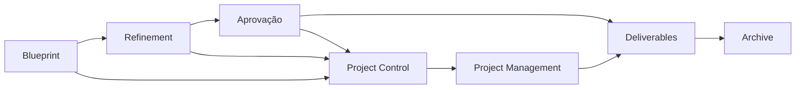

# The New HUB

Este repositório é o centro operacional do HUB: aqui vivem a estratégia, o blueprint, o refinamento, as aprovações, a gestão do projeto, os recursos de apoio, as entregas finais e o histórico arquivado.

## Setup rápido

```bash
git clone <url-do-repositorio>
cd "The New HUB dev-2"
```

Depois disso:

1. Abra o repositório no Obsidian.
2. Confirme que o `project-map.md` está disponível na raiz.
3. Use o `README.md` da raiz e o [README da pasta blueprint](01-blueprint/README.md) para orientação inicial.
4. Confirme que os plugins comunitários listados em `.obsidian/community-plugins.json` estão instalados e ativados.
5. Para o fluxo de tarefas, consulte [`TaskNotes/Start Here.md`](TaskNotes/Start%20Here.md).

O arquivo [`mdbase.yaml`](mdbase.yaml) configura o TaskNotes para usar `_types/` como pasta de definições e `TaskNotes/` como espaço de trabalho das tarefas.

## Como ler este repositório

Se você chegou agora, siga esta ordem:

1. Leia [`README.md`](README.md) para entender a estrutura geral.
2. Abra o [`project-map.md`](project-map.md) para enxergar o mapa vivo do repositório.
3. Vá para o framework em [`HUB_Framework_Desenvolvimento_Projeto_Tres_Camadas.md`](00-project-control/framework/HUB_Framework_Desenvolvimento_Projeto_Tres_Camadas.md).
4. Depois revise a fundação do projeto em [`HUB_Fundacao_Blueprint_Projeto.md`](01-blueprint/estrategia/HUB_Fundacao_Blueprint_Projeto.md).
5. Se houver lacunas, consulte o gap register em [`HUB_Registro_Lacunas_Projeto.md`](00-project-control/registro-lacunas/HUB_Registro_Lacunas_Projeto.md).

## Visão geral das camadas



## Mapa principal de pastas

```mermaid
flowchart TB
    R[Raiz do projeto]
    R --> PC[00-project-control]
    R --> BP[01-blueprint]
    R --> RF[02-refinement]
    R --> AP[03-approval]
    R --> PM[04-project-management]
    R --> RS[05-resources]
    R --> DL[06-deliverables]
    R --> AR[99-archive]
    R --> TN[TaskNotes]
    R --> SYS[System]
    R --> TYP[_types]

    PC --> PCF[framework / escopo / decisoes / riscos / dependencias / indices]
    BP --> BPF[estrategia / produto / modelo-negocio / tecnologia / dados / visao-lancamento / operacoes / marca-mercado / governanca-juridico]
    RF --> RFF[pesquisa / testes-experimentos / prototipos / revisoes / revisoes-iteradas / estrategia / produto / refinamento-modelo-dados / modelos-financeiros]
    AP --> APF[evidencias / pacotes-revisao / criterios-aprovacao / aprovado / bloqueado / aprovado-condicionalmente / portao-lancamento]
    PM --> PMF[planos-diretores / planos-fase / tarefas / marcos / cronogramas / registros-trabalho / relatorios-status / atas-reuniao / retrospectivas]
    RS --> RSF[documentos / materiais-origem / referencias-externas / imagens / apresentacoes / conjuntos-dados / planilhas / modelos]
    DL --> DLF[business / product / data / governance / investor / launch]
    AR --> ARF[descontinuado / rejeitado / superado / instantaneos-historicos]
    TN --> TNF[Start Here / Views / bases de tarefas]
    SYS --> SYSF[documentação de plugins e ferramentas Obsidian]
    TYP --> TYPF[definições de tipos mdbase]
```



## O que cada pasta significa

- [`00-project-control/`](00-project-control/) — regras do jogo: framework, escopo, decisões, riscos, dependências, gaps e índices.
- [`01-blueprint/`](01-blueprint/) — a visão-base do projeto: estratégia, produto, negócios, tecnologia, dados, governança e visão de lançamento.
- [`02-refinement/`](02-refinement/) — onde a proposta é testada, comparada, melhorada e substituída quando necessário.
- [`03-approval/`](03-approval/) — evidências e pacotes de revisão para decidir o que pode avançar, o que fica bloqueado e o que precisa de ajuste.
- [`04-project-management/`](04-project-management/) — planejamento e controle: tarefas, marcos, cronogramas, reuniões, status e logs.
- [`05-resources/`](05-resources/) — materiais de apoio e origem: documentos, referências, imagens, apresentações, datasets, planilhas e templates.
- [`06-deliverables/`](06-deliverables/) — saídas prontas para uso fora do repositório, quando aprovadas.
- [`99-archive/`](99-archive/) — tudo o que foi substituído, rejeitado, descontinuado ou preservado por histórico.
- [`TaskNotes/`](TaskNotes/) — orientação e visualizações Bases para gerenciamento de tarefas.
- [`System/`](System/) — documentação de apoio sobre plugins, Bases, Dataview, Datacore, gráficos, Canvas e TaskNotes.
- [`_types/`](%5Ftypes/) — definições de tipos usadas pelo mdbase/TaskNotes.
- [`.obsidian/`](.obsidian/) — configurações do vault, plugins comunitários, temas e workspace do Obsidian.
- [`mdbase.yaml`](mdbase.yaml) — configuração do sistema de tipos e exclusões do mdbase.

## Regras de navegação

- Comece em `00-project-control/` quando precisar entender contexto, limites e decisões.
- Use `01-blueprint/` para responder “o que estamos construindo?”.
- Use `02-refinement/` para responder “o que foi testado, revisado ou melhorado?”.
- Use `03-approval/` para responder “isso já pode ser considerado válido?”.
- Use `04-project-management/` para responder “o que está em andamento agora?”.
- Use `05-resources/` para localizar a matéria-prima do trabalho.
- Use `06-deliverables/` para encontrar o que já está pronto para distribuição.
- Use `99-archive/` para consultar histórico, mas não para continuar trabalho ativo.
- Use `TaskNotes/` para revisar tarefas por listas, agenda, calendário e kanban.
- Use `System/` quando precisar consultar a documentação local das ferramentas do vault.
- Não edite manualmente arquivos compilados dos plugins em `.obsidian/plugins/`, salvo quando a manutenção do vault exigir isso.

## Arquivos-chave

- [`HUB_Framework_Desenvolvimento_Projeto_Tres_Camadas.md`](00-project-control/framework/HUB_Framework_Desenvolvimento_Projeto_Tres_Camadas.md) — descreve o processo central do projeto.
- [`HUB_Fundacao_Blueprint_Projeto.md`](01-blueprint/estrategia/HUB_Fundacao_Blueprint_Projeto.md) — ponto de partida consolidado para a arquitetura do HUB.
- [`HUB_Registro_Lacunas_Projeto.md`](00-project-control/registro-lacunas/HUB_Registro_Lacunas_Projeto.md) — lista transversal de lacunas, riscos e pendências.
- [`HUB_Lacunas_Projeto.base`](00-project-control/registro-lacunas/HUB_Lacunas_Projeto.base) — base de dados dos gaps.
- [`HUB_Blueprint_Tasks.base`](HUB_Tarefas_Projeto.base) — base de tarefas do blueprint.
- [`TaskNotes/Views/tasks-default.base`](TaskNotes/Views/tasks-default.base) — visão padrão das tarefas.
- [`_types/task.md`](%5Ftypes/task.md) — definição do tipo de tarefa.
- [`System/Plugins docs/`](System/Plugins%20docs/) — documentação local das ferramentas de Obsidian.

## Como usar

- Para entender o projeto: comece por este README e pelo `project-map.md`.
- Para trabalhar na estratégia: entre em `01-blueprint/`.
- Para controlar execução: use `04-project-management/`.
- Para consultar fontes e materiais: use `05-resources/`.
- Para revisar entregas: use `03-approval/` e `06-deliverables/`.

## Setup da camada de refinamento

Use esta camada quando o blueprint já existir e você quiser transformar hipótese em material mais verificável.

Fluxo recomendado:

1. Abra a pasta correta dentro de `02-refinement/`.
2. Leia o artefato de pesquisa ou síntese relacionado.
3. Compare com o blueprint de origem em `01-blueprint/`.
4. Registre gaps, decisões e evidências novas antes de mover algo para aprovação.

## Como usar a camada de refinamento

- Use `pesquisa/` para pesquisas e validações exploratórias.
- Use `testes-experimentos/` para testes, provas de conceito e experimentos.
- Use `prototipos/` para protótipos e simulações.
- Use `revisoes/` e `revisoes-iteradas/` para feedback e versões iteradas.
- Use `refinamento-modelo-dados/` para sínteses semânticas e ajustes de dados.
- Use `modelos-financeiros/` para requisitos e refinamentos financeiros.
- Use `refinamento-produto/` para ajustar escopo, fluxo e experiência.
- Use `refinamento-governanca/` para LGPD, controle e responsabilidades.

## Contribuição nesta camada

1. Escreva em pt-BR.
2. Mantenha o status do material claro: rascunho, pesquisa, revisão, refinamento ou aprovado.
3. Não duplique o que já existe em `01-blueprint/`; refina-se aqui, não se reescreve o original.
4. Sempre cite o artefato de origem quando a nota for derivada.
5. Se o resultado virar decisão consolidada, promova o conteúdo para a camada correta.

## Como contribuir

1. Mantenha os arquivos em pt-BR.
2. Prefira editar a pasta correta em vez de duplicar conteúdo.
3. Preserve a estrutura de camadas do projeto.
4. Atualize os links internos quando mover ou criar arquivos.
5. Se a mudança afetar o mapa do projeto, atualize também o `project-map.md`.
6. Antes de abrir PR ou enviar alterações, revise se não há arquivos não relacionados no working tree.

## Como usar o repositório no dia a dia

Se você estiver **planejando**, vá para `01-blueprint/`.

Se você estiver **pesquisando ou testando**, vá para `02-refinement/`.

Se você estiver **decidindo aprovação**, vá para `03-approval/`.

Se você estiver **executando o projeto**, vá para `04-project-management/`.

Se você estiver **procurando materiais de apoio**, vá para `05-resources/`.

Se você estiver **buscando a entrega final**, vá para `06-deliverables/`.

Se você estiver **auditando o passado**, vá para `99-archive/`.

## Convenções de leitura

- `blueprint` = hipótese ou direção base.
- `refining` = material em evolução.
- `aprovado-condicionalmente` = pode avançar com ressalvas.
- `aprovado` = pronto para uso.
- `bloqueado` = precisa de dependência ou decisão.
- `superado` = substituído por uma versão melhor.

## Observação

O [`project-map.md`](project-map.md) complementa este README com um mapa vivo da estrutura e deve ser consultado quando você quiser navegar com rapidez sem reexplorar o repositório inteiro.
