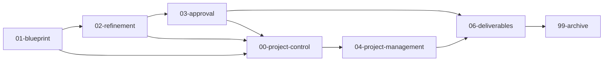

# The New HUB

Este repositório é o centro operacional do HUB: aqui vivem a estratégia, o blueprint, o refinamento, as aprovações, a gestão do projeto, os recursos de apoio, as entregas finais e o histórico arquivado.

## Setup rápido

```bash
git clone <url-do-repositorio>
cd "The New HUB dev-2"
```

Depois disso:

1. Abra o repositório no Obsidian.
2. Leia este arquivo e o [`project-map.md`](project-map.md).
3. Consulte o [`README da pasta blueprint`](01-blueprint/README.md) para a visão conceitual.
4. Confirme os 10 plugins comunitários listados em `.obsidian/community-plugins.json`.
5. Para o fluxo operacional, consulte [`TaskNotes/Start Here.md`](TaskNotes/Start%20Here.md).

> **Nota sobre o estado local:** o repositório rastreia o tema `March` e os 10 plugins habilitados. Outros 12 temas e 11 plugins inativos podem continuar instalados localmente, mas não fazem parte do índice Git. Cache e áudios também permanecem locais e ignorados.

## Como ler este repositório

1. Leia [`project-map.md`](project-map.md) para a estrutura atual.
2. Abra o framework em [`HUB_Framework_Desenvolvimento_Projeto_Tres_Camadas.md`](00-project-control/framework/HUB_Framework_Desenvolvimento_Projeto_Tres_Camadas.md).
3. Revise a fundação em [`HUB_Fundacao_Blueprint_Projeto.md`](01-blueprint/estrategia/HUB_Fundacao_Blueprint_Projeto.md).
4. Consulte o registro de lacunas em [`HUB_Registro_Lacunas_Projeto.md`](00-project-control/registro-lacunas/HUB_Registro_Lacunas_Projeto.md).
5. Para a ordem de execução, abra [`HUB_Plano_Fases_v1.md`](04-project-management/planos-mestres/HUB_Plano_Fases_v1.md).

## Camadas e pastas principais



| Pasta | Função atual |
|---|---|
| [`00-project-control/`](00-project-control/) | Framework, escopo, decisões, gaps e registros de mudança. |
| [`01-blueprint/`](01-blueprint/) | Estratégia, produto, negócio, tecnologia, dados, governança, operações e lançamento. |
| [`02-refinement/`](02-refinement/) | Pesquisas e refinamentos; o spine P03 tem 9 entregáveis em revisão. |
| [`03-approval/`](03-approval/) | `bloqueado/` e `pacotes-revisao/`; o modelo de indicadores continua bloqueado. |
| [`04-project-management/`](04-project-management/) | Planos P01–P07, 56 tarefas de fase + BP, marcos, cronogramas, atas, cenários e logs. |
| [`05-resources/`](05-resources/) | Fila `Processar/Plataforma HUB/`, com 143 arquivos rastreados e 7 MVPs. |
| [`06-deliverables/`](06-deliverables/) | Área flat reservada; atualmente contém apenas `.gitkeep`. |
| [`99-archive/`](99-archive/) | Snapshots históricos e material superado. |
| [`TaskNotes/`](TaskNotes/) | 22 tarefas operacionais atuais, 2 notas em `Archive/` e views Bases. |
| [`System/`](System/) | 69 arquivos de documentação local em 5 famílias; anexos ficam fora do Git. |
| [`.agents/`](.agents/) | Skills e artefatos de agentes versionados no projeto. |

## Estado atual

- P01 (Oferta & Negócio): 7 tarefas concluídas.
- P02 (Produto & Operação): 6 tarefas concluídas.
- P03 (Dados Canônicos): 9 tarefas em revisão.
- P04–P07: 34 tarefas pendentes.
- `GOV-001` — decisão sobre a estrutura societária/CNPJs — é o principal bloqueador da documentação oficial.
- O epic do vault isolado de documentos oficiais está em andamento; suas notas de controle permanecem em `TaskNotes/Tasks/` e os mapas/instrução foram restaurados em `02-refinement/refinamento-governanca/`.

O faseamento completo é: `P01` → `P02` → `P03` (spine de dados) → `P04` ↔ `P05` → `P06` → `P07`.

## Arquivos-chave

- [`HUB_Framework_Desenvolvimento_Projeto_Tres_Camadas.md`](00-project-control/framework/HUB_Framework_Desenvolvimento_Projeto_Tres_Camadas.md) — processo central.
- [`HUB_Fundacao_Blueprint_Projeto.md`](01-blueprint/estrategia/HUB_Fundacao_Blueprint_Projeto.md) — fundação consolidada.
- [`HUB_Registro_Lacunas_Projeto.md`](00-project-control/registro-lacunas/HUB_Registro_Lacunas_Projeto.md) — gaps, riscos e pendências (68 notas).
- [`HUB_Plano_Fases_v1.md`](04-project-management/planos-mestres/HUB_Plano_Fases_v1.md) — plano diretor P01→P07.
- [`matriz-fases-tarefas-v1.md`](04-project-management/registro-mestre/matriz-fases-tarefas-v1.md) — coordenação das tarefas de fase.
- [`HUB_Tarefas_Fases_Execucao.base`](04-project-management/registros-trabalho/HUB_Tarefas_Fases_Execucao.base) — execução em 9 views Bases.
- [`HUB_Mapa_Documentos_Oficiais_v1.md`](02-refinement/refinamento-governanca/HUB_Mapa_Documentos_Oficiais_v1.md) — matriz dos documentos obrigatórios.
- [`HUB_Mapa_Documentos_Nao_Obrigatorios_v1.md`](02-refinement/refinamento-governanca/HUB_Mapa_Documentos_Nao_Obrigatorios_v1.md) — matriz dos documentos requeridos não obrigatórios.
- [`HUB_Instrucao_Vault_Documentos_Oficiais.md`](02-refinement/refinamento-governanca/HUB_Instrucao_Vault_Documentos_Oficiais.md) — instrução do vault isolado.
- `TaskNotes/Tasks/Documentação Oficial — Epic Vault Isolado HUB (01-14).md` — epic de controle do vault isolado de documentos oficiais.
- `TaskNotes/Tasks/GOV-001 — Decidir estrutura societária (quantos CNPJs).md` — decisão bloqueadora para a documentação oficial.

## Regras de navegação

- Use `01-blueprint/` para entender o que está sendo proposto.
- Use `02-refinement/` para pesquisas, testes e material em evolução.
- Use `03-approval/` para revisar evidências e bloqueios.
- Use `04-project-management/` para executar o plano.
- Use `05-resources/` para consultar a matéria-prima; ela não é evidência aprovada.
- Use `06-deliverables/` apenas para entregas aprovadas.
- Use `99-archive/` para consultar o passado, não para continuar trabalho ativo.
- Use `TaskNotes/` para tarefas operacionais e suas views.
- Não edite manualmente código compilado em `.obsidian/plugins/`.

## Manutenção

- Escreva documentação em pt-BR e preserve os links internos.
- Quando a estrutura de pastas mudar, atualize este README e o [`project-map.md`](project-map.md).
- Não trate blueprint ou refinamento como contrato, aprovação ou evidência de produção.
- Não arquive P03 nem remova views enquanto o trabalho estiver em revisão ou uso ativo.
- Assets locais ignorados não devem ser adicionados ao Git sem decisão explícita.
