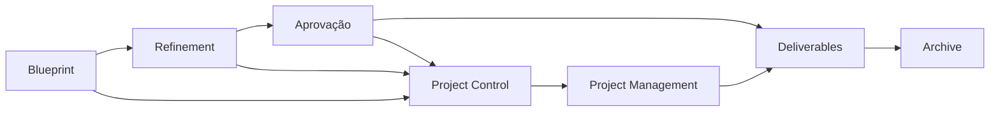
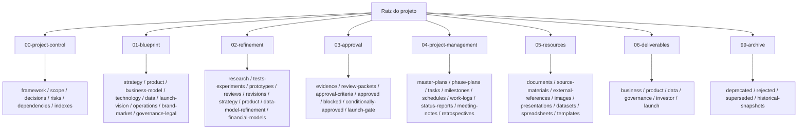

# The New HUB

Este repositório é o centro operacional do HUB: aqui vivem a estratégia, o blueprint, o refinamento, as aprovações, a gestão do projeto, os recursos de apoio, as entregas finais e o histórico arquivado.

## Setup rápido

```bash
git clone <url-do-repositorio>
cd "The New HUB dev-2"
```

Depois disso:

1. Abra o repositório no Obsidian.
2. Confirme que o `project-map.md` está disponível na raiz.
3. Use o `README.md` da raiz e o [README da pasta blueprint](01-blueprint/README.md) para orientação inicial.

## Como ler este repositório

Se você chegou agora, siga esta ordem:

1. Leia [`README.md`](README.md) para entender a estrutura geral.
2. Abra o [`project-map.md`](project-map.md) para enxergar o mapa vivo do repositório.
3. Vá para o framework em [`HUB_Three-Layer_Project_Development_Framework.md`](00-project-control/framework/HUB_Three-Layer_Project_Development_Framework.md).
4. Depois revise a fundação do projeto em [`HUB_Project_Blueprint_Foundation.md`](01-blueprint/strategy/HUB_Project_Blueprint_Foundation.md).
5. Se houver lacunas, consulte o gap register em [`HUB_Project_Gap_Register.md`](00-project-control/gap-register/HUB_Project_Gap_Register.md).

## Visão geral das camadas



## Mapa principal de pastas



## O que cada pasta significa

- [`00-project-control/`](00-project-control/) — regras do jogo: framework, escopo, decisões, riscos, dependências, gaps e índices.
- [`01-blueprint/`](01-blueprint/) — a visão-base do projeto: estratégia, produto, negócios, tecnologia, dados, governança e visão de lançamento.
- [`02-refinement/`](02-refinement/) — onde a proposta é testada, comparada, melhorada e substituída quando necessário.
- [`03-approval/`](03-approval/) — evidências e pacotes de revisão para decidir o que pode avançar, o que fica bloqueado e o que precisa de ajuste.
- [`04-project-management/`](04-project-management/) — planejamento e controle: tarefas, marcos, cronogramas, reuniões, status e logs.
- [`05-resources/`](05-resources/) — materiais de apoio e origem: documentos, referências, imagens, apresentações, datasets, planilhas e templates.
- [`06-deliverables/`](06-deliverables/) — saídas prontas para uso fora do repositório, quando aprovadas.
- [`99-archive/`](99-archive/) — tudo o que foi substituído, rejeitado, descontinuado ou preservado por histórico.

## Regras de navegação

- Comece em `00-project-control/` quando precisar entender contexto, limites e decisões.
- Use `01-blueprint/` para responder “o que estamos construindo?”.
- Use `02-refinement/` para responder “o que foi testado, revisado ou melhorado?”.
- Use `03-approval/` para responder “isso já pode ser considerado válido?”.
- Use `04-project-management/` para responder “o que está em andamento agora?”.
- Use `05-resources/` para localizar a matéria-prima do trabalho.
- Use `06-deliverables/` para encontrar o que já está pronto para distribuição.
- Use `99-archive/` para consultar histórico, mas não para continuar trabalho ativo.

## Arquivos-chave

- [`HUB_Three-Layer_Project_Development_Framework.md`](00-project-control/framework/HUB_Three-Layer_Project_Development_Framework.md) — descreve o processo central do projeto.
- [`HUB_Project_Blueprint_Foundation.md`](01-blueprint/strategy/HUB_Project_Blueprint_Foundation.md) — ponto de partida consolidado para a arquitetura do HUB.
- [`HUB_Project_Gap_Register.md`](00-project-control/gap-register/HUB_Project_Gap_Register.md) — lista transversal de lacunas, riscos e pendências.
- [`HUB_Project_Gaps.base`](00-project-control/gap-register/HUB_Project_Gaps.base) — base de dados dos gaps.
- [`HUB_Blueprint_Tasks.base`](04-project-management/tasks/HUB_Blueprint_Tasks.base) — base de tarefas do blueprint.

## Como usar

- Para entender o projeto: comece por este README e pelo `project-map.md`.
- Para trabalhar na estratégia: entre em `01-blueprint/`.
- Para controlar execução: use `04-project-management/`.
- Para consultar fontes e materiais: use `05-resources/`.
- Para revisar entregas: use `03-approval/` e `06-deliverables/`.

## Setup da camada de refinamento

Use esta camada quando o blueprint já existir e você quiser transformar hipótese em material mais verificável.

Fluxo recomendado:

1. Abra a pasta correta dentro de `02-refinement/`.
2. Leia o artefato de pesquisa ou síntese relacionado.
3. Compare com o blueprint de origem em `01-blueprint/`.
4. Registre gaps, decisões e evidências novas antes de mover algo para aprovação.

## Como usar a camada de refinamento

- Use `research/` para pesquisas e validações exploratórias.
- Use `tests-experiments/` para testes, provas de conceito e experimentos.
- Use `prototypes/` para protótipos e simulações.
- Use `reviews/` e `revisions/` para feedback e versões iteradas.
- Use `data-model-refinement/` para sínteses semânticas e ajustes de dados.
- Use `financial-models/` para requisitos e refinamentos financeiros.
- Use `product-refinement/` para ajustar escopo, fluxo e experiência.
- Use `governance-refinement/` para LGPD, controle e responsabilidades.

## Contribuição nesta camada

1. Escreva em pt-BR.
2. Mantenha o status do material claro: rascunho, pesquisa, revisão, refinamento ou aprovado.
3. Não duplique o que já existe em `01-blueprint/`; refina-se aqui, não se reescreve o original.
4. Sempre cite o artefato de origem quando a nota for derivada.
5. Se o resultado virar decisão consolidada, promova o conteúdo para a camada correta.

## Como contribuir

1. Mantenha os arquivos em pt-BR.
2. Prefira editar a pasta correta em vez de duplicar conteúdo.
3. Preserve a estrutura de camadas do projeto.
4. Atualize os links internos quando mover ou criar arquivos.
5. Se a mudança afetar o mapa do projeto, atualize também o `project-map.md`.
6. Antes de abrir PR ou enviar alterações, revise se não há arquivos não relacionados no working tree.

## Como usar o repositório no dia a dia

Se você estiver **planejando**, vá para `01-blueprint/`.

Se você estiver **pesquisando ou testando**, vá para `02-refinement/`.

Se você estiver **decidindo aprovação**, vá para `03-approval/`.

Se você estiver **executando o projeto**, vá para `04-project-management/`.

Se você estiver **procurando materiais de apoio**, vá para `05-resources/`.

Se você estiver **buscando a entrega final**, vá para `06-deliverables/`.

Se você estiver **auditando o passado**, vá para `99-archive/`.

## Convenções de leitura

- `blueprint` = hipótese ou direção base.
- `refining` = material em evolução.
- `conditionally-approved` = pode avançar com ressalvas.
- `approved` = pronto para uso.
- `blocked` = precisa de dependência ou decisão.
- `superseded` = substituído por uma versão melhor.

## Observação

O [`project-map.md`](project-map.md) complementa este README com um mapa vivo da estrutura e deve ser consultado quando você quiser navegar com rapidez sem reexplorar o repositório inteiro.
