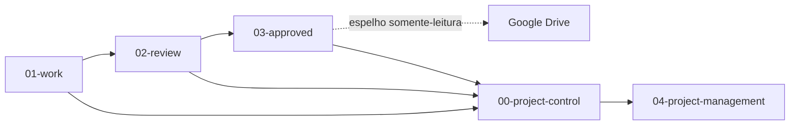

# The New HUB

Este repositório é o centro operacional do HUB — **fonte única de verdade** (vault iCloud).
Aqui vivem o trabalho em elaboração, as revisões, os finais aprovados, a gestão do projeto,
os recursos de apoio e o histórico arquivado.

**Regra das fronteiras:** um arquivo, um status, um lugar. Rascunho nunca divide endereço com aprovado.
Promoção = mover + carimbar, nunca editar no lugar.

## Setup rápido

```bash
git clone <url-do-repositorio>
cd "The New HUB dev-2"
```

Depois disso:

1. Abra o repositório no Obsidian.
2. Leia este arquivo e o [`project-map.md`](project-map.md).
3. Leia os guardas de fronteira: [`01-work/README.md`](01-work/README.md), [`02-review/README.md`](02-review/README.md), [`03-approved/README.md`](03-approved/README.md).
4. Confirme os 10 plugins comunitários listados em `.obsidian/community-plugins.json`.
5. Para o fluxo operacional, consulte [`TaskNotes/Start Here.md`](TaskNotes/Start%20Here.md).

> **Nota sobre o estado local:** o repositório rastreia o tema `March` e os 10 plugins habilitados. Outros temas e plugins inativos podem continuar instalados localmente, mas não fazem parte do índice Git. Cache e áudios também permanecem locais e ignorados.

## Como ler este repositório

1. Leia [`project-map.md`](project-map.md) para a estrutura atual.
2. Abra o framework em [`HUB_Framework_Desenvolvimento_Projeto_Tres_Camadas.md`](00-project-control/framework/HUB_Framework_Desenvolvimento_Projeto_Tres_Camadas.md).
3. **Agentes: antes de criar, mover ou promover qualquer arquivo**, leia o contrato normativo em [`HUB_Framework_Fronteiras_Lifecycle.md`](00-project-control/framework/HUB_Framework_Fronteiras_Lifecycle.md) e declare qual transição está executando.
3. Leia a fundação em [`HUB_Fundacao_Blueprint_Projeto.md`](01-work/mercado-e-direcao/estrategia/HUB_Fundacao_Blueprint_Projeto.md).
4. Consulte o registro de lacunas em [`HUB_Registro_Lacunas_Projeto.md`](00-project-control/registro-lacunas/HUB_Registro_Lacunas_Projeto.md).
5. Para a ordem de execução, abra [`HUB_Plano_Fases_v1.md`](04-project-management/planos-mestres/HUB_Plano_Fases_v1.md).

## Fronteiras e pastas principais



| Pasta | Função atual |
|---|---|
| [`01-work/`](01-work/) | **Tudo que está em elaboração**, por domínio. `status:` só `rascunho \| em-elaboracao`. Inclui `documentos-oficiais/` (shell aspiracional — nada ali é oficial, ver GOV-001). |
| [`02-review/`](02-review/) | **Pacotes congelados aguardando gate** (`pacotes/`) + bloqueados (`bloqueado/`). `status:` só `em-revisao`. Sem edições aqui. |
| [`03-approved/`](03-approved/) | **Só finais assinados** (hoje: `cenarios/` P01-S01…S06). `status:` só `aprovado`. Nunca editado no lugar. Espelhado no Drive com paths idênticos. |
| [`00-project-control/`](00-project-control/) | Framework, escopo, decisões, gaps e registros de mudança. |
| [`04-project-management/`](04-project-management/) | Planos P01–P07, tarefas de fase + BP, marcos, cronogramas, atas, cenários (ponteiro) e logs. |
| [`05-resources/`](05-resources/) | `inbox/` (fila de triagem, ex-`Processar/`) + `fontes/` (fontes tabulares). Matéria-prima, nunca evidência aprovada. |
| [`99-archive/`](99-archive/) | Origens, superado, backups e histórico. Consultar o passado, não continuar trabalho ativo. |
| [`TaskNotes/`](TaskNotes/) | Tarefas operacionais e views Bases. |
| [`System/`](System/) | Documentação local de plugins; anexos ficam fora do Git. |
| [`.agents/`](.agents/) | Skills e artefatos de agentes versionados no projeto. |

Pastas aposentadas em 2026-09-05: `01-blueprint/` → `01-work/`, `02-refinement/` → `01-work/`, `03-approval/` → `02-review/`, `06-deliverables/` → `03-approved/`, `05-resources/Processar/` → `05-resources/inbox/`. Histórico preservado via `git log --follow` (stubs de redirecionamento removidos em 2026-09-05).

## Estado atual

- P01 (Oferta & Negócio): 7 tarefas concluídas; cenários P01-S01…S06 assinados em [`03-approved/matriz-de-oferta-e-comprador-cenarios/cenarios/`](03-approved/matriz-de-oferta-e-comprador-cenarios/cenarios/).
- P02 (Produto & Operação): 6 tarefas concluídas.
- P03 (Dados Canônicos): 9 itens + gate em elaboração em [`01-work/dados-tech-financas/refinamento-modelo-dados/`](01-work/dados-tech-financas/refinamento-modelo-dados/) — todos `rascunho`, nada em revisão.
- P04–P07: 34 tarefas pendentes.
- `GOV-001` — decisão sobre a estrutura societária/CNPJs — é o principal bloqueador da documentação oficial.
- O shell de documentos oficiais vive em [`01-work/pesquisa-e-confianca/documentos-oficiais/`](01-work/pesquisa-e-confianca/documentos-oficiais/) (taxonomia 01–14 preservada como forma do futuro).

O faseamento completo é: `P01` → `P02` → `P03` (spine de dados) → `P04` ↔ `P05` → `P06` → `P07`.

## Arquivos-chave

- [`HUB_Framework_Desenvolvimento_Projeto_Tres_Camadas.md`](00-project-control/framework/HUB_Framework_Desenvolvimento_Projeto_Tres_Camadas.md) — processo central.
- [`HUB_Fundacao_Blueprint_Projeto.md`](01-work/mercado-e-direcao/estrategia/HUB_Fundacao_Blueprint_Projeto.md) — fundação consolidada.
- [`HUB_Registro_Lacunas_Projeto.md`](00-project-control/registro-lacunas/HUB_Registro_Lacunas_Projeto.md) — gaps, riscos e pendências.
- [`HUB_Plano_Fases_v1.md`](04-project-management/planos-mestres/HUB_Plano_Fases_v1.md) — plano diretor P01→P07.
- [`matriz-fases-tarefas-v1.md`](04-project-management/registro-mestre/matriz-fases-tarefas-v1.md) — coordenação das tarefas de fase.
- [`HUB_Mapa_Documentos_Oficiais_v1.md`](01-work/pesquisa-e-confianca/documentos-oficiais/_controle/HUB_Mapa_Documentos_Oficiais_v1.md) — matriz dos documentos obrigatórios (rascunho).
- [`HUB_Instrucao_Vault_Documentos_Oficiais.md`](01-work/pesquisa-e-confianca/documentos-oficiais/_controle/HUB_Instrucao_Vault_Documentos_Oficiais.md) — instrução do vault de documentos oficiais.
- [`2026-09-05-reestruturacao-fronteiras-lifecycle.md`](00-project-control/registro-mudancas/2026-09-05-reestruturacao-fronteiras-lifecycle.md) — registro desta reestruturação.

## Regras de navegação

- Use `01-work/` para elaborar. Dúvida e hipótese são bem-vindas — rotuladas.
- Use `02-review/` para acompanhar gates. Não edite pacotes em revisão.
- Use `03-approved/` para consumir e compartilhar finais. Para mudar um aprovado, abra nova versão em `01-work/`.
- Use `04-project-management/` para executar o plano.
- Use `05-resources/` para consultar a matéria-prima; ela não é evidência aprovada.
- Use `99-archive/` para consultar o passado, não para continuar trabalho ativo.
- Use `TaskNotes/` para tarefas operacionais e suas views.
- Não edite manualmente código compilado em `.obsidian/plugins/`.

## Manutenção

- Escreva documentação em pt-BR e preserve os links internos.
- Quando a estrutura de pastas mudar, atualize este README e o [`project-map.md`](project-map.md).
- `status:` do frontmatter deve ser igual ao da pasta: `01-work` = `rascunho|em-elaboracao`, `02-review` = `em-revisao`, `03-approved` = `aprovado`, `99-archive` = `superado|rejeitado|descontinuado`.
- Aprovados nunca são editados no lugar; obsoletos vão para `99-archive/`.
- Assets locais ignorados não devem ser adicionados ao Git sem decisão explícita.
