<!-- git-hash: ca54b39 -->
<!-- last-synced: 2026-08-26T16:25:14-03:00 -->

# Mapa do Projeto

## Modelo operacional

O repositório é gerenciado como um sistema completo de negócio e produto por meio de três camadas:

1. **Blueprint** — conceitos, premissas e arquitetura geral.
2. **Refinamento** — pesquisa, testes, protótipos, melhorias e substituições.
3. **Aprovação** — revisão baseada em evidências: aprovação, aprovação condicional ou bloqueio.

Gestão de projeto transversal, recursos, entregáveis e áreas de arquivo permanecem fora das três camadas.

## Conteúdo atual

| Área | Papel atual |
|---|---|
| `00-project-control/` | Framework, escopo, decisões, premissas, riscos, dependências e índices. |
| `01-blueprint/` | Primeiro rascunho estratégico e arquitetura de indicadores/dados de origem. |
| `02-refinement/` | Estratégia V2, pesquisa e síntese do modelo de dados. |
| `03-approval/` | Material do modelo de indicadores não aprovado e futuros portões de aprovação. |
| `04-project-management/` | Casa central de planos, tarefas, marcos, cronogramas, logs e status. |
| `05-resources/` | Documentos estratégicos, plano de ação, imagens de referência, esboços de UI, apresentações, materiais de origem, datasets e templates. |
| `06-deliverables/` | Saídas finais uma vez aprovadas para uso externo. |
| `99-archive/` | Material histórico e superado. |
| `TaskNotes/` | Orientação e visualizações Bases para gerenciamento de tarefas. |
| `System/` | Documentação local de plugins, Bases, Dataview, Datacore, gráficos, Canvas e TaskNotes. |
| `_types/` | Definições de tipos usadas pelo mdbase/TaskNotes. |
| `.obsidian/` | Configurações do vault, plugins comunitários, temas e workspace. |

Fundação primária do blueprint: [`HUB_Project_Blueprint_Foundation.md`](01-blueprint/strategy/HUB_Project_Blueprint_Foundation.md).

Registro transversal de gaps: [`HUB_Project_Gap_Register.md`](00-project-control/gap-register/HUB_Project_Gap_Register.md).

Base de Gaps: [`HUB_Project_Gaps.base`](00-project-control/gap-register/HUB_Project_Gaps.base).

Registro de tarefas do blueprint: [`HUB_Blueprint_Tasks.base`](04-project-management/tasks/HUB_Blueprint_Tasks.base).

Configuração do sistema de tipos: [`mdbase.yaml`](mdbase.yaml).

Guia inicial de tarefas: [`TaskNotes/Start Here.md`](TaskNotes/Start%20Here.md).

Visão padrão das tarefas: [`TaskNotes/Views/tasks-default.base`](TaskNotes/Views/tasks-default.base).

Documentação local de plugins: [`System/Plugins docs/`](System/Plugins%20docs/).

## Regras

- Mantenha planos, tarefas e logs centralizados em `04-project-management/`.
- Mantenha material de origem em `05-resources/`; não o trate como evidência aprovada.
- Marque a maturidade explicitamente: `blueprint`, `refining`, `conditionally-approved`, `approved`, `blocked` ou `superseded`.
- Conecte artefatos relacionados entre camadas em vez de duplicar conteúdo.
- Mova um artefato para trás quando a aprovação revelar um gap ou contradição.
- Mantenha as definições de tipos em `_types/` e as visualizações de tarefas em `TaskNotes/Views/`.
- Trate `System/` como documentação de referência local, não como área de trabalho do produto.

## Mapa da hierarquia de pastas

Abaixo está um diagrama de hierarquia mermaid traçando todos os níveis de pastas deste projeto (arquivos excluídos por clareza).

```mermaid
flowchart TB
    %% Top-level folders
    TC["00-project-control"]:::projctrl
    TB01["01-blueprint"]:::blueprint
    TB02["02-refinement"]:::refinement
    TB03["03-approval"]:::approval
    TB04["04-project-management"]:::pmgmt
    TB05["05-resources"]:::resources
    TB06["06-deliverables"]:::deliverables
    TN99["99-archive"]:::archive
    TTN["TaskNotes"]:::tasknotes
    TSYS["System"]:::system
    TTYPES["_types"]:::types

    %% Connections from root
    root --> TC
    root --> TB01
    root --> TB02
    root --> TB03
    root --> TB04
    root --> TB05
    root --> TB06
    root --> TN99
    root --> TTN
    root --> TSYS
    root --> TTYPES

    %% Level 2: subfolders within each top-level folder
    %% 00-project-control
    PC_assumptions["assumptions"]:::pc_sub
    PC_change_log["change-log"]:::pc_sub
    PC_decisions["decisions"]:::pc_sub
    PC_dependencies["dependencies"]:::pc_sub
    PC_framework["framework"]:::pc_sub
    PC_gap_register["gap-register"]:::pc_sub
    PC_indexes["indexes"]:::pc_sub
    PC_risks["risks"]:::pc_sub
    PC_scope["scope"]:::pc_sub
    TC --> PC_assumptions
    TC --> PC_change_log
    TC --> PC_decisions
    TC --> PC_dependencies
    TC --> PC_framework
    TC --> PC_gap_register
    TC --> PC_indexes
    TC --> PC_risks
    TC --> PC_scope

    %% 01-blueprint
    BP_brand["brand-market"]:::bp_sub
    BP_business["business-model"]:::bp_sub
    BP_data["data-intelligence"]:::bp_sub
    BP_governance["governance-legal"]:::bp_sub
    BP_launch["launch-vision"]:::bp_sub
    BP_operations["operations"]:::bp_sub
    BP_product["product"]:::bp_sub
    BP_strategy["strategy"]:::bp_sub
    BP_technology["technology"]:::bp_sub
    TB01 --> BP_brand
    TB01 --> BP_business
    TB01 --> BP_data
    TB01 --> BP_governance
    TB01 --> BP_launch
    TB01 --> BP_operations
    TB01 --> BP_product
    TB01 --> BP_strategy
    TB01 --> BP_technology
    BP_technology --> first_draft["first-project-draft"]

    %% 02-refinement
    RF_data_model["data-model-refinement"]:::rf_sub
    RF_financial["financial-models"]:::rf_sub
    RF_governance["governance-refinement"]:::rf_sub
    RF_product["product-refinement"]:::rf_sub
    RF_prototypes["prototypes"]:::rf_sub
    RF_research["research"]:::rf_sub
    RF_reviews["reviews"]:::rf_sub
    RF_revisions["revisions"]:::rf_sub
    RF_strategy["strategy"]:::rf_sub
    RF_tests["tests-experiments"]:::rf_sub
    TB02 --> RF_data_model
    TB02 --> RF_financial
    TB02 --> RF_governance
    TB02 --> RF_product
    TB02 --> RF_prototypes
    TB02 --> RF_research
    TB02 --> RF_reviews
    TB02 --> RF_revisions
    TB02 --> RF_strategy
    TB02 --> RF_tests

    %% 03-approval
    AP_criteria["approval-criteria"]:::ap_sub
    AP_approved["approved"]:::ap_sub
    AP_blocked["blocked"]:::ap_sub
    AP_cond_approved["conditionally-approved"]:::ap_sub
    AP_evidence["evidence"]:::ap_sub
    AP_launch_gate["launch-gate"]:::ap_sub
    AP_review_packets["review-packets"]:::ap_sub
    TB03 --> AP_criteria
    TB03 --> AP_approved
    TB03 --> AP_blocked
    TB03 --> AP_cond_approved
    TB03 --> AP_evidence
    TB03 --> AP_launch_gate
    TB03 --> AP_review_packets

    %% 04-project-management
    PM_master["master-plans"]:::pm_sub
    PM_meeting["meeting-notes"]:::pm_sub
    PM_milestones["milestones"]:::pm_sub
    PM_phase["phase-plans"]:::pm_sub
    PM_retrospectives["retrospectives"]:::pm_sub
    PM_schedules["schedules"]:::pm_sub
    PM_status["status-reports"]:::pm_sub
    PM_tasks["tasks"]:::pm_sub
    PM_worklogs["work-logs"]:::pm_sub
    TB04 --> PM_master
    TB04 --> PM_meeting
    TB04 --> PM_milestones
    TB04 --> PM_phase
    TB04 --> PM_retrospectives
    TB04 --> PM_schedules
    TB04 --> PM_status
    TB04 --> PM_tasks
    TB04 --> PM_worklogs

    %% 05-resources
    RS_datasets["datasets"]:::rs_sub
    RS_documents["documents"]:::rs_sub
    RS_external["external-references"]:::rs_sub
    RS_images["images"]:::rs_sub
    RS_presentations["presentations"]:::rs_sub
    RS_source["source-materials"]:::rs_sub
    RS_spreadsheets["spreadsheets"]:::rs_sub
    RS_templates["templates"]:::rs_sub
    TB05 --> RS_datasets
    TB05 --> RS_documents
    TB05 --> RS_external
    TB05 --> RS_images
    TB05 --> RS_presentations
    TB05 --> RS_source
    TB05 --> RS_spreadsheets
    TB05 --> RS_templates

    %% 06-deliverables
    DL_business["business"]:::dl_sub
    DL_data["data"]:::dl_sub
    DL_governance["governance"]:::dl_sub
    DL_investor["investor"]:::dl_sub
    DL_launch["launch"]:::dl_sub
    DL_product["product"]:::dl_sub
    TB06 --> DL_business
    TB06 --> DL_data
    TB06 --> DL_governance
    TB06 --> DL_investor
    TB06 --> DL_launch
    TB06 --> DL_product

    %% 99-archive
    AR_deprecated["deprecated"]:::ar_sub
    AR_historical["historical-snapshots"]:::ar_sub
    AR_rejected["rejected"]:::ar_sub
    AR_superseded["superseded"]:::ar_sub
    TN99 --> AR_deprecated
    TN99 --> AR_historical
    TN99 --> AR_rejected
    TN99 --> AR_superseded

    %% TaskNotes, System and type definitions
    TTN --> TN_views["Views"]:::tn_sub
    TTN --> TN_start["Start Here.md"]:::tn_sub
    TSYS --> SYS_plugins["Plugins docs"]:::sys_sub
    TTYPES --> TYPE_task["task.md"]:::type_sub

    %% Styling classes
    classDef projctrl fill:#e3f2fd,stroke:#1565c0,stroke-width:2px;
    classDef blueprint  fill:#e8f5e9,stroke:#2e7d32,stroke-width:2px;
    classDef refinement fill:#e3e5f5,stroke:#1a237e,stroke-width:2px;
    classDef approval   fill:#fce4ec,stroke:#c2185b,stroke-width:2px;
    classDef pmgmt      fill:#fff3e0,stroke:#ef6c00,stroke-width:2px;
    classDef resources  fill:#f1f8e9,stroke:#388e3c,stroke-width:2px;
    classDef deliverables fill:#e1f5fe,stroke:#01579b,stroke-width:2px;
    classDef archive    fill:#fafafa,stroke:#607d8b,stroke-width:2px;
    classDef tasknotes  fill:#fff8e1,stroke:#f9a825,stroke-width:2px;
    classDef system     fill:#ede7f6,stroke:#5e35b1,stroke-width:2px;
    classDef types      fill:#fbe9e7,stroke:#d84315,stroke-width:2px;
    classDef pc_sub     fill:#e3f2fd,stroke:#1565c0,stroke-width:1px,stroke-dasharray: 5 5;
    classDef bp_sub     fill:#e8f5e9,stroke:#2e7d32,stroke-width:1px,stroke-dasharray: 5 5;
    classDef rf_sub     fill:#e3e5f5,stroke:#1a237e,stroke-width:1px,stroke-dasharray: 5 5;
    classDef ap_sub     fill:#fce4ec,stroke:#c2185b,stroke-width:1px,stroke-dasharray: 5 5;
    classDef pm_sub     fill:#fff3e0,stroke:#ef6c00,stroke-width:1px,stroke-dasharray: 5 5;
    classDef rs_sub     fill:#f1f8e9,stroke:#388e3c,stroke-width:1px,stroke-dasharray: 5 5;
    classDef dl_sub     fill:#e1f5fe,stroke:#01579b,stroke-width:1px,stroke-dasharray: 5 5;
    classDef ar_sub     fill:#fafafa,stroke:#607d8b,stroke-width:1px,stroke-dasharray: 5 5;
    classDef tn_sub     fill:#fff8e1,stroke:#f9a825,stroke-width:1px,stroke-dasharray: 5 5;
    classDef sys_sub    fill:#ede7f6,stroke:#5e35b1,stroke-width:1px,stroke-dasharray: 5 5;
    classDef type_sub   fill:#fbe9e7,stroke:#d84315,stroke-width:1px,stroke-dasharray: 5 5;
```

