<!-- git-hash: 72f6d4323d68684ea695c9e43c1f510b722b5436 -->
<!-- last-synced: 2026-09-02T01:38:11-03:00 -->

# Mapa do Projeto

## Modelo operacional

O repositório é gerenciado como um sistema completo de negócio e produto por meio de três camadas:

1. **Blueprint** — conceitos, premissas e arquitetura geral.
2. **Refinamento** — pesquisa, testes, protótipos, melhorias e substituições.
3. **Aprovação** — revisão baseada em evidências: aprovação, aprovação condicional ou bloqueio.

Gestão de projeto transversal, recursos, entregáveis e áreas de arquivo permanecem fora das três camadas.

## Estrutura atual

| Área                     | Papel atual                                                                                          |
| ------------------------ | ---------------------------------------------------------------------------------------------------- |
| `00-project-control/`    | Framework, escopo, decisões, premissas, riscos, dependências, gaps (68 notas), índices e registro de mudanças (4 notas + template). |
| `01-blueprint/`          | Visão-base estratégica, arquitetura de produto, negócio, dados, tecnologia, governança e lançamento (9 domínios). |
| `02-refinement/`         | Estratégia V2, pesquisas, testes, protótipos, revisões e refinamento do modelo de dados — spine P03 9 rascunhos G03.A1–C5 (lógico/físico, identidade+dataset, envelope+fixture, dicionário, catálogo, linhagem, taxonomia, matriz LGPD, fluxos+XLSX) + produto/gov. |
| `03-approval/`           | Critérios, evidências, pacotes de revisão, estados de aprovação e material bloqueado (modelo indicadores não aprovado + 03-csv-corrigido/04-registro-correcoes/06-relatorios-validacao). |
| `04-project-management/` | Planos (mestre P01–P07 + fases), 56 tarefas P01→P07 + BP, matriz canônica, marcos (M00–M07 + M03.A/B), cronogramas + base execução (9 views), atas (transcript 01/09 + `_template-ata.md`), logs-progresso (P01/P02/P03 + Sat 29 Aug), retrospectivas e status. |
| `05-resources/`          | Documentos, materiais de origem, referências, imagens, apresentações, datasets, planilhas e modelos. |
| `06-deliverables/`       | Saídas finais organizadas por dados, governança, investidor, lançamento, negócio e produto.          |
| `99-archive/`            | Material descontinuado, rejeitado, superado e instantâneos históricos.                               |
| `TaskNotes/`             | Notas de tarefas (25 operacionais) e visualizações Bases — agenda, calendário, kanban, mini-calendar, pomodoro, relações e tasks. |
| `System/`                | Documentação local de plugins, Canvas, Bases, Dataview e TaskNotes (7 docs: Charts, Dataview Charts, JSON Canvas Spec, Obsidian Base, Task Notes, Tracker, datacore). |
| `_types/`                | Definições de tipos usadas pelo mdbase/TaskNotes (`task.md`).                                        |
| `.obsidian/`             | Configurações do vault, plugins (7 ativos), 13 temas e workspace.                                    |
| `.omo/`                  | Planos e artefatos de orquestração do OhMyOpenCode.                                                  |
| `.logs/`                 | Logs de execução de subtasks e agentes.                                                              |

## Árvore completa de pastas

> Inventário exaustivo de todas as pastas e subpastas do repositório (exclui `.git/` interno e `.obsidian/plugins/` compilado). Cada linha traz **caminho + descrição curta do propósito**.

```
.  — raiz do projeto (vault Obsidian + repo git; contém README.md, project-map.md, mdbase.yaml e pastas de camadas)
│
├── .git/  — histórico e metadados do git (não editar manualmente)
├── .logs/  — logs de execução de subtasks/agentes (ex.: subtask2.log)
│   └── (arquivos de log por execução)
├── .obsidian/  — configurações do vault Obsidian (workspace, hotkeys, appearance)
│   ├── icons/  — ícones customizados do vault
│   ├── plugins/  — plugins comunitários instalados (código compilado — não editar manualmente)
│   └── themes/  — temas instalados do Obsidian (13 temas)
│       ├── Blossom/  — tema Blossom
│       ├── Dark Moss/  — tema Dark Moss
│       ├── Dracula + LYT/  — tema Dracula + LYT
│       ├── Glass Robo/  — tema Glass Robo
│       ├── March/  — tema March
│       ├── Modern GenZ Vibedose/  — tema Modern GenZ Vibedose
│       ├── Nebula/  — tema Nebula
│       ├── Royal Velvet/  — tema Royal Velvet
│       ├── Slytherin/  — tema Slytherin
│       ├── Sodalite/  — tema Sodalite
│       ├── Terminal2K/  — tema Terminal2K
│       ├── Vicious/  — tema Vicious
│       └── WY Console/  — tema WY Console
├── .omo/  — orquestração OhMyOpenCode (planos e artefatos do agente)
│   └── plans/  — planos salvos (ex.: traducao-pastas-arquivos-ptbr-plan.md)
│
├── 00-project-control/  — CONTROLE DO PROJETO — regras do jogo, limites e registros transversais
│   ├── decisoes/  — decisões registradas com justificativa e template-decisao.md
│   ├── dependencias/  — dependências internas e externas do projeto
│   ├── escopo/  — escopo completo e atual do projeto
│   │   └── fases-projeto/  — fases do projeto
│   │       └── rascunho/  — canvas sequencial P00→P07 com gates (Fases_Projeto.canvas — redesenhado 2026-08-27, spine P03)
│   ├── framework/  — framework de desenvolvimento das três camadas (HUB_Framework_... .md/.pdf)
│   ├── indices/  — índices de navegação entre camadas e artefatos
│   ├── premissas/  — premissas que exigem refinamento ou evidência
│   ├── registro-lacunas/  — registro transversal de lacunas, riscos e pendências
│   │   └── lacunas/  — notas individuais de gap (BRD-*, DAT-*, FIN-*, GOV-*, TEC-* — ~68 notas)
│   ├── registro-mudancas/  — mudanças materiais de escopo, estrutura ou decisões (4 notas: 2026-08-26-faseamento-P01-P07-cronograma-marcos + 2026-08-26-tarefas-56-execucao-base + 2026-08-27-remocao-receita-marketplace + 2026-08-31-diretorio-arquivos-filtrados + template-registro-mudanca.md)
│   └── riscos/  — riscos, mitigações e responsáveis
│
├── 01-blueprint/  — BLUEPRINT — visão-base do HUB antes de refinamento e aprovação
│   ├── dados-inteligencia/  — dados, inteligência e modelo semântico do HUB
│   │   └── modelo-indicadores/  — modelo de indicadores (espelho do Mapa de Inteligência)
│   │       ├── abas-origem/  — espelho em CSV + análise por aba do xlsx origem (14 abas)
│   │       │   ├── 00-manifesto/  — manifesto/folha de rosto do modelo (manifest.csv)
│   │       │   ├── 00_Leia-me/  — instruções de leitura do modelo (csv + analise.md)
│   │       │   ├── 01_Mapa_Visual/  — mapa visual do modelo (csv + analise.md)
│   │       │   ├── 02_Nos_de_Dados/  — nós de dados / entidades (csv + analise.md)
│   │       │   ├── 03_Conexoes/  — conexões entre nós (csv + analise.md)
│   │       │   ├── 04_Indicadores_Master/  — catálogo master de indicadores (csv + analise.md)
│   │       │   ├── 05_Arvore_de_Valor/  — árvore de valor / value tree (csv + analise.md)
│   │       │   ├── 06_Simulador_ROI/  — simulador de ROI (csv + analise.md)
│   │       │   ├── 07_Visoes_Dashboard/  — visões de dashboard (csv + analise.md)
│   │       │   ├── 08_Dicionario_Dados/  — dicionário de dados (csv + analise.md)
│   │       │   ├── 09_Eventos_Produto/  — eventos de produto para instrumentação (csv + analise.md)
│   │       │   ├── 10_Integracoes/  — integrações previstas (csv + analise.md)
│   │       │   ├── 11_Governanca_LGPD/  — governança e LGPD (csv + analise.md)
│   │       │   ├── 12_Roadmap/  — roadmap do modelo de dados (csv + analise.md)
│   │       │   ├── 13_Matriz_Integracao/  — matriz de integração (csv + analise.md)
│   │       │   └── 14_RACI/  — matriz RACI de responsabilidades (csv + analise.md)
│   │       └── pastas-trabalho/  — pasta de trabalho com o xlsx canônico (HUB_Mapa_Inteligencia_...xlsx)
│   ├── estrategia/  — direção geral e fundação do blueprint
│   │   └── primeiro-rascunho-projeto/  — primeiro rascunho do documento-mãe estratégico
│   │       └── 00-origem/  — origem do doc-mãe v1 (.docx)
│   ├── governanca-juridico/  — governança, responsabilidades e fundamentos jurídicos
│   ├── marca-mercado/  — marca, posicionamento e mercado
│   ├── modelo-negocio/  — oferta, receita e arquitetura comercial
│   ├── operacoes/  — modelo operacional e execução
│   ├── produto/  — capacidades, experiência e forma do produto
│   ├── tecnologia/  — arquitetura técnica-alvo e fronteiras de plataforma
│   └── visao-lancamento/  — visão de lançamento, evolução e narrativa de entrada
│
├── 02-refinement/  — REFINAMENTO — onde o blueprint é testado, comparado e melhorado
│   ├── estrategia/  — refinamento estratégico (ponte blueprint → v2)
│   │   └── segundo-rascunho-projeto/  — segundo rascunho do documento-mãe (3 variantes: Investor_Ready_pt-BR + Pronta_Investidor + Plano_Prontidao_Investidor)
│   ├── modelos-financeiros/  — requisitos e refinamentos de modelo financeiro
│   ├── pesquisa/  — pesquisas e validações exploratórias por domínio
│   │   └── segundo-rascunho-projeto/  — pesquisas que embasam o doc-mãe v2 (6 arquivos: beachhead, financial_model, governance_legal, gtm_partnerships, market_competitive, product_mvp)
│   │       └── pt-BR/  — traduções pt-BR das pesquisas v2 (governança, financeiro, mercado, produto)
│   ├── prototipos/  — protótipos e simulações
│   ├── refinamento-governanca/  — refinamento de LGPD, controle e responsabilidades (matriz-dados-finalidade-P03-T08-v1.md — 5 fluxos × 41 campos, base legal/retenção/DSAR)
│   ├── refinamento-modelo-dados/  — sínteses semânticas e ajustes do modelo de dados (9 rascunhos P03-T01..T09 v1: modelo lógico/físico 25 entidades, especificacao-identidade+dataset sintético, envelope-evento-schema+fixture, dicionario-fisico 41 campos, catalogo-metricas 73, templates-linhagem, taxonomia-estados, matriz-dados-finalidade, fluxos-linhagem-replay-DSAR+XLSX reconstruído)
│   │   └── modelo-indicadores/  — refinamento específico do modelo de indicadores
│   │       ├── dataset-identidade-sintetico-P03-T02.csv  — dataset sintético 20 pessoas/40 aliases/15 pares rotulados
│   │       ├── pastas-trabalho/  — xlsx melhorado (HUB_Mapa_Inteligencia_...xlsx + MELHORADO_v1.1.xlsx)
│   │       └── sintese-entre-abas/  — sínteses cross-aba (crosswalk de chaves, consistência financeira, governança, catálogo métricas)
│   │   └── schema-registry/  — registry de schemas (fixtures/identity.merged.v1.0.valid.json)
│   ├── refinamento-produto/  — ajustes de escopo, fluxo e experiência do produto (4 artefatos: fichas-operacionais-P01-T02-v1.md 17 fichas, matriz-autorizacao-tenancy.md, filas-revisao-overrides.md, RACI_v1.md)
│   ├── revisoes/  — feedback e revisões pontuais
│   ├── revisoes-iteradas/  — versões iteradas / ciclos de revisão
│   └── testes-experimentos/  — testes, provas de conceito e experimentos
│
├── 03-approval/  — APROVAÇÃO — evidências e portões de decisão (aprovado / condicional / bloqueado)
│   ├── aprovado/  — artefatos aprovados e prontos para uso
│   ├── aprovado-condicionalmente/  — artefatos aprovados com ressalvas
│   ├── bloqueado/  — artefatos bloqueados por gap, dependência ou reprovação
│   │   └── modelo-indicadores/  — material bloqueado do modelo de indicadores
│   │       └── rascunho-nao-aprovado-v2/  — rascunho v2 não aprovado (evidência de bloqueio)
│   │           └── indicadores-xlsx/  — pacote xlsx bloqueado e seus derivados de correção/validação
│   │               ├── 03-csv-corrigido/  — CSVs corrigidos por aba (fonte para reconstrução validada)
│   │               │   ├── 00-manifest/  — manifesto corrigido
│   │               │   ├── 00_Leia-me/  — Leia-me corrigido
│   │               │   ├── 01_Mapa_Visual/  — Mapa Visual corrigido
│   │               │   ├── 02_Nos_de_Dados/  — Nós de Dados corrigido
│   │               │   ├── 03_Conexoes/  — Conexões corrigido
│   │               │   ├── 04_Indicadores_Master/  — Indicadores Master corrigido
│   │               │   ├── 05_Arvore_de_Valor/  — Árvore de Valor corrigido
│   │               │   ├── 06_Simulador_ROI/  — Simulador ROI corrigido
│   │               │   ├── 07_Visoes_Dashboard/  — Visões Dashboard corrigido
│   │               │   ├── 08_Dicionario_Dados/  — Dicionário de Dados corrigido
│   │               │   ├── 09_Eventos_Produto/  — Eventos de Produto corrigido
│   │               │   ├── 10_Integracoes/  — Integrações corrigido
│   │               │   ├── 11_Governanca_LGPD/  — Governança LGPD corrigido
│   │               │   ├── 12_Roadmap/  — Roadmap corrigido
│   │               │   ├── 13_Matriz_Integracao/  — Matriz Integração corrigido
│   │               │   └── 14_RACI/  — RACI corrigido
│   │               ├── 04-registro-correcoes/  — registro de correções (fingerprints, approval, roadmap-raci, roi-assumptions)
│   │               ├── 05-pastas-trabalho-rascunho/  — pasta de trabalho do rascunho não aprovado (UNAPPROVED_DRAFT_v0.xlsx)
│   │               └── 06-relatorios-validacao/  — relatórios de validação (entity-key, corrected-csv, roi-recalculation, correction)
│   ├── criterios-aprovacao/  — critérios e checklists de aprovação
│   ├── evidencias/  — evidências que sustentam decisões de aprovação
│   ├── pacotes-revisao/  — pacotes montados para revisão por stakeholders
│   └── portao-lancamento/  — portão de lançamento (go/no-go)
│
├── 04-project-management/  — GESTÃO DO PROJETO — planejamento e controle transversal
│   ├── atas-reuniao/  — atas de reunião (Transcript Alinhamento - Plataforma.md 01/09/2026 estruturada + _template-ata.md canônico + template-reuniao.md redirect)
│   ├── cronogramas/  — cronogramas do projeto (cronograma-fases-v1.base — 6 views Bases: Timeline, Caminho Crítico, Paralelizáveis, Por Dono, Portfolio, Gaps)
│   ├── marcos/  — marcos e milestones (marcos-fases-v1.md — M00→M07 + sub-gates M03.A/B, critérios G01.x→G07.x)
│   ├── planos-fase/  — planos por fase (P01_Arquitetura_Oferta_Negocio → P07_Portao_Lancamento — 7 fases spine DAT com sub-gates M03.A/B/C, GOV/TEC paralelizáveis)
│   ├── planos-mestres/  — planos diretores / master plans (HUB_Plano_Fases_v1.md — Plano Diretor P01–P07 + alternativa 4-fases + §11 Glossário; HUB_Escopo_Estrategico_Documento_Mae_v2_*.md — 3 variantes Investor Ready)
│   ├── registro-mestre/  — matriz canônica de coordenação fase/tarefa (matriz-fases-tarefas-v1.md — 56 linhas P01–P07, P01 7 concluido/P02 6 concluido/P03 9 em-revisao/P04–P07 34 pendente)
│   ├── registros-trabalho/  — logs + base de execução (HUB_Tarefas_Fases_Execucao.base — 9 views: por Fase, Crítico `★`, Paralelizáveis, Kanban, Prioridade, Por Dono, Portfolio, Bloqueadas, Gaps) + logs-progresso/ (P01/P02/P03 entregáveis + Sat 29 Aug 2026.md)
│   ├── relatorios-status/  — relatórios de status periódicos + template-relatorio-status.md
│   ├── retrospectivas/  — retrospectivas de ciclo/sprint
│   └── tarefas/  — tarefas do blueprint (BP-001..008) + 56 tarefas de fase (P01-T01→P07-T07, 7+6+9+8+7+12+7) + HUB_Tarefas_Projeto.base e HUB_Tarefas_Fases_Execucao (via registros-trabalho) + README
│
├── 05-resources/  — RECURSOS — matéria-prima e materiais de apoio (não são evidência aprovada)
│   ├── apresentacoes/  — apresentações
│   │   └── pitch-decks/  — pitch decks (SEBRAE 2026, FIRJAN)
│   ├── conjuntos-dados/  — datasets de apoio
│   ├── documentos/  — documentos de referência e estratégia avulsa
│   ├── imagens/  — imagens gerais do projeto
│   │   └── esbocos-ui/  — esboços de UI (prints WhatsApp / wireframes)
│   ├── materiais-origem/  — materiais de origem brutos
│   ├── modelos/  — templates e modelos reutilizáveis
│   ├── planilhas/  — planilhas financeiras e de apoio (ex.: HUB_Mapa_Financeiro_...)
│   └── referencias-externas/  — referências externas e benchmarks
│
├── 06-deliverables/  — ENTREGÁVEIS — saídas finais prontas para distribuição quando aprovadas
│   ├── dados/  — entregáveis de dados e inteligência
│   ├── governanca/  — entregáveis de governança
│   ├── investidor/  — entregáveis para investidor
│   ├── lancamento/  — entregáveis de lançamento
│   ├── negocio/  — entregáveis de negócio
│   └── produto/  — entregáveis de produto
│
├── 99-archive/  — ARQUIVO — histórico preservado, fora do fluxo ativo
│   ├── descontinuado/  — material descontinuado sem intenção de retomada
│   ├── instantaneos-historicos/  — snapshots históricos
│   ├── rejeitado/  — material rejeitado em revisão
│   └── superado/  — material superado (Fases_Projeto_v0_clusters_tematicos.canvas — clusters temáticos arquivado 2026-08-27)
│
├── TaskNotes/  — TAREFAS OPERACIONAIS — notas e visões do plugin TaskNotes
│   ├── Tasks/  — notas de tarefa operacionais (fluxo TaskNotes, separado do blueprint)
│   └── Views/  — visões Bases (agenda-default, mini-calendar, pomodoro-stats, relationships, tasks-default, etc.)
│
├── System/  — SISTEMA — documentação local de referência das ferramentas do vault
│   └── Plugins docs/  — docs locais por plugin (7 docs)
│       ├── Charts Plugin Docs/  — documentação do Charts
│       ├── Dataview Charts/  — documentação Dataview Charts
│       ├── JSON Canvas Spec.md  — especificação JSON Canvas 1.0
│       ├── Obsidian Base/  — documentação do Obsidian Bases
│       ├── Task Notes/  — documentação do Task Notes
│       ├── Tracker Plugin/  — documentação do Tracker
│       └── datacore/  — documentação do Datacore
│
└── _types/  — TIPOS — definições de tipos do mdbase/TaskNotes (ex.: task.md)
```

> **Total inventariado:** ~120 pastas + 66 notas de tarefas (8 BP + 56 P0x) navegáveis (exclui `.git` e `.obsidian/plugins` compilado). Cada `*.base`, `*.canvas` e `*.md` relevante permanece no caminho indicado acima; pastas com `.gitkeep` estão reservadas para uso futuro. Novos: `02-refinement/refinamento-modelo-dados/schema-registry/fixtures`, `04-project-management/registros-trabalho/logs-progresso`, `04-project-management/atas-reuniao` (transcript + template canônico).

## Anexo para agentes — tabela navegável (machine-readable)

> Esta seção é otimizada para `aivectormemory_recall` / grep / routing automático. Cada linha é um chunk independente com `caminho | camada | propósito | conteúdo-chave | estado`.

| Caminho | Camada | Propósito (1 linha) | Conteúdo-chave | Estado |
|---|---|---|---|---|
| `.` | raiz | Vault Obsidian + repo git; ponto de entrada do projeto | `README.md`, `project-map.md`, `mdbase.yaml` | ativo |
| `.git/` | infra | Histórico e metadados do git | objetos, refs, HEAD | não editar |
| `.logs/` | infra | Logs de execução de subtasks/agentes | `subtask2.log` | ativo |
| `.obsidian/` | infra | Configurações do vault Obsidian | `workspace.json`, `app.json`, `hotkeys.json` | ativo |
| `.obsidian/icons/` | infra | Ícones customizados do vault | ícones svg/json | ativo |
| `.obsidian/plugins/` | infra | Plugins comunitários compilados | código por plugin | não editar |
| `.obsidian/themes/` | infra | Temas instalados do Obsidian | 13 temas | ativo |
| `.obsidian/themes/Blossom/` | infra | Tema Blossom | `theme.css`, `manifest.json` | ativo |
| `.obsidian/themes/Dark Moss/` | infra | Tema Dark Moss | tema | ativo |
| `.obsidian/themes/Dracula + LYT/` | infra | Tema Dracula + LYT | `theme.css`, `manifest.json` | ativo |
| `.obsidian/themes/Glass Robo/` | infra | Tema Glass Robo | tema | ativo |
| `.obsidian/themes/March/` | infra | Tema March | tema | ativo |
| `.obsidian/themes/Modern GenZ Vibedose/` | infra | Tema Modern GenZ Vibedose | tema | ativo |
| `.obsidian/themes/Nebula/` | infra | Tema Nebula | `theme.css`, `manifest.json` | ativo |
| `.obsidian/themes/Royal Velvet/` | infra | Tema Royal Velvet | tema | ativo |
| `.obsidian/themes/Slytherin/` | infra | Tema Slytherin | `theme.css`, `manifest.json` | ativo |
| `.obsidian/themes/Sodalite/` | infra | Tema Sodalite | `theme.css`, `manifest.json` | ativo |
| `.obsidian/themes/Terminal2K/` | infra | Tema Terminal2K | tema | ativo |
| `.obsidian/themes/Vicious/` | infra | Tema Vicious | `theme.css`, `manifest.json` | ativo |
| `.obsidian/themes/WY Console/` | infra | Tema WY Console | tema | ativo |
| `.omo/` | infra | Orquestração OhMyOpenCode | planos e artefatos do agente | ativo |
| `.omo/plans/` | infra | Planos salvos do orquestrador | `traducao-pastas-arquivos-ptbr-plan.md` | ativo |
| `00-project-control/` | controle | Regras do jogo e registros transversais | framework, escopo, decisões, gaps | ativo |
| `00-project-control/decisoes/` | controle | Decisões registradas com justificativa | `template-decisao.md` | ativo |
| `00-project-control/dependencias/` | controle | Dependências internas e externas | `.gitkeep` | reservado |
| `00-project-control/escopo/` | controle | Escopo completo e atual do projeto | canvas de fases | ativo |
| `00-project-control/escopo/fases-projeto/` | controle | Fases do projeto | `Fases_Projeto.canvas` | ativo |
| `00-project-control/escopo/fases-projeto/rascunho/` | controle | Canvas sequencial P00→P07 com gates (spine P03, redesenhado 2026-08-27) | `Fases_Projeto.canvas` | ativo |
| `00-project-control/framework/` | controle | Framework das três camadas | `HUB_Framework_...md/.pdf` | ativo |
| `00-project-control/indices/` | controle | Índices de navegação entre camadas | `.gitkeep` | reservado |
| `00-project-control/premissas/` | controle | Premissas que exigem evidência | `.gitkeep` | reservado |
| `00-project-control/registro-lacunas/` | controle | Registro transversal de lacunas/riscos/pendências | `HUB_Registro_...md`, `HUB_Lacunas_...base` | ativo |
| `00-project-control/registro-lacunas/lacunas/` | controle | Notas individuais de gap (≈68 notas) | `BRD-*`, `DAT-*`, `FIN-*`, `GOV-*`, `TEC-*` | ativo |
| `00-project-control/registro-mudancas/` | controle | Mudanças materiais de escopo/estrutura/decisões | 4 notas: `2026-08-26-faseamento-P01-P07-cronograma-marcos` + `2026-08-26-tarefas-56-execucao-base` + `2026-08-27-remocao-receita-marketplace` + `2026-08-31-diretorio-arquivos-filtrados` + `template-registro-mudanca.md` | ativo |
| `00-project-control/riscos/` | controle | Riscos, mitigações e responsáveis | `.gitkeep` | reservado |
| `01-blueprint/` | blueprint | Visão-base do HUB antes de refinamento/aprovação | 9 domínios | ativo |
| `01-blueprint/dados-inteligencia/` | blueprint | Dados, inteligência e modelo semântico | `HUB_Blueprint_Dados_e_Inteligencia.md` | ativo |
| `01-blueprint/dados-inteligencia/modelo-indicadores/` | blueprint | Modelo de indicadores (espelho do xlsx) | abas-origem + pastas-trabalho | ativo |
| `01-blueprint/dados-inteligencia/modelo-indicadores/abas-origem/` | blueprint | Espelho CSV + análise por aba (14 abas) | 14 subpastas `00–14` | ativo |
| `01-blueprint/dados-inteligencia/modelo-indicadores/abas-origem/00-manifesto/` | blueprint | Manifesto/folha de rosto do modelo | `manifest.csv` | ativo |
| `01-blueprint/dados-inteligencia/modelo-indicadores/abas-origem/00_Leia-me/` | blueprint | Instruções de leitura do modelo | `csv` + `analise.md` | ativo |
| `01-blueprint/dados-inteligencia/modelo-indicadores/abas-origem/01_Mapa_Visual/` | blueprint | Mapa visual do modelo | `csv` + `analise.md` | ativo |
| `01-blueprint/dados-inteligencia/modelo-indicadores/abas-origem/02_Nos_de_Dados/` | blueprint | Nós de dados / entidades | `csv` + `analise.md` | ativo |
| `01-blueprint/dados-inteligencia/modelo-indicadores/abas-origem/03_Conexoes/` | blueprint | Conexões entre nós | `csv` + `analise.md` | ativo |
| `01-blueprint/dados-inteligencia/modelo-indicadores/abas-origem/04_Indicadores_Master/` | blueprint | Catálogo master de indicadores | `csv` + `analise.md` | ativo |
| `01-blueprint/dados-inteligencia/modelo-indicadores/abas-origem/05_Arvore_de_Valor/` | blueprint | Árvore de valor / value tree | `csv` + `analise.md` | ativo |
| `01-blueprint/dados-inteligencia/modelo-indicadores/abas-origem/06_Simulador_ROI/` | blueprint | Simulador de ROI | `csv` + `analise.md` | ativo |
| `01-blueprint/dados-inteligencia/modelo-indicadores/abas-origem/07_Visoes_Dashboard/` | blueprint | Visões de dashboard | `csv` + `analise.md` | ativo |
| `01-blueprint/dados-inteligencia/modelo-indicadores/abas-origem/08_Dicionario_Dados/` | blueprint | Dicionário de dados | `csv` + `analise.md` | ativo |
| `01-blueprint/dados-inteligencia/modelo-indicadores/abas-origem/09_Eventos_Produto/` | blueprint | Eventos de produto para instrumentação | `csv` + `analise.md` | ativo |
| `01-blueprint/dados-inteligencia/modelo-indicadores/abas-origem/10_Integracoes/` | blueprint | Integrações previstas | `csv` + `analise.md` | ativo |
| `01-blueprint/dados-inteligencia/modelo-indicadores/abas-origem/11_Governanca_LGPD/` | blueprint | Governança e LGPD | `csv` + `analise.md` | ativo |
| `01-blueprint/dados-inteligencia/modelo-indicadores/abas-origem/12_Roadmap/` | blueprint | Roadmap do modelo de dados | `csv` + `analise.md` | ativo |
| `01-blueprint/dados-inteligencia/modelo-indicadores/abas-origem/13_Matriz_Integracao/` | blueprint | Matriz de integração | `csv` + `analise.md` | ativo |
| `01-blueprint/dados-inteligencia/modelo-indicadores/abas-origem/14_RACI/` | blueprint | Matriz RACI de responsabilidades | `csv` + `analise.md` | ativo |
| `01-blueprint/dados-inteligencia/modelo-indicadores/pastas-trabalho/` | blueprint | Pasta de trabalho com xlsx canônico | `HUB_Mapa_Inteligencia_...xlsx` | ativo |
| `01-blueprint/estrategia/` | blueprint | Direção geral e fundação do blueprint | `HUB_Fundacao_Blueprint_Projeto.md` | ativo |
| `01-blueprint/estrategia/primeiro-rascunho-projeto/` | blueprint | Primeiro rascunho do documento-mãe estratégico | doc-mãe v1 | ativo |
| `01-blueprint/estrategia/primeiro-rascunho-projeto/00-origem/` | blueprint | Origem do doc-mãe v1 | `.docx` origem | ativo |
| `01-blueprint/governanca-juridico/` | blueprint | Governança, responsabilidades e fundamentos jurídicos | `HUB_Blueprint_Governanca_e_Juridico.md` | ativo |
| `01-blueprint/marca-mercado/` | blueprint | Marca, posicionamento e mercado | `HUB_Blueprint_Marca_e_Mercado.md` | ativo |
| `01-blueprint/modelo-negocio/` | blueprint | Oferta, receita e arquitetura comercial | `HUB_Blueprint_Oferta_e_Arquitetura_Receita.md` | ativo |
| `01-blueprint/operacoes/` | blueprint | Modelo operacional e execução | `HUB_Blueprint_Modelo_Operacional.md` | ativo |
| `01-blueprint/produto/` | blueprint | Capacidades, experiência e forma do produto | `HUB_Blueprint_Produto_e_Capacidades.md` | ativo |
| `01-blueprint/tecnologia/` | blueprint | Arquitetura técnica-alvo e fronteiras de plataforma | `HUB_Blueprint_Arquitetura_Tecnologica.md` | ativo |
| `01-blueprint/visao-lancamento/` | blueprint | Visão de lançamento, evolução e narrativa de entrada | `HUB_Blueprint_Lancamento_e_Evolucao.md` | ativo |
| `02-refinement/` | refinement | Onde o blueprint é testado, comparado e melhorado | 10 subáreas | ativo |
| `02-refinement/estrategia/` | refinement | Refinamento estratégico (ponte blueprint → v2) | segundo-rascunho | ativo |
| `02-refinement/estrategia/segundo-rascunho-projeto/` | refinement | Segundo rascunho do doc-mãe (Investor Ready — 3 variantes) | `HUB_Escopo_...v2_Investor_Ready_pt-BR.md` + `Pronta_Investidor` + `Plano_Prontidao_Investidor` | ativo |
| `02-refinement/modelos-financeiros/` | refinement | Requisitos e refinamentos de modelo financeiro | `.gitkeep` | reservado |
| `02-refinement/pesquisa/` | refinement | Pesquisas e validações exploratórias por domínio | 6 pesquisas v2 + pt-BR | ativo |
| `02-refinement/pesquisa/segundo-rascunho-projeto/` | refinement | Pesquisas que embasam o doc-mãe v2 | `HUB_v2_*_research.md` (6 arquivos) | ativo |
| `02-refinement/pesquisa/segundo-rascunho-projeto/pt-BR/` | refinement | Traduções pt-BR das pesquisas v2 | `*-pt-BR.md` | ativo |
| `02-refinement/prototipos/` | refinement | Protótipos e simulações | `.gitkeep` | reservado |
| `02-refinement/refinamento-governanca/` | refinement | Refinamento de LGPD/controle/responsabilidades (P03-T08) | `matriz-dados-finalidade-P03-T08-v1.md` (5 fluxos × 41 campos) | ativo |
| `02-refinement/refinamento-modelo-dados/` | refinement | Sínteses semânticas e ajustes do modelo de dados — 9 rascunhos P03 v1 (G03.A1–C5) | 9 md + `modelo-indicadores/` + `schema-registry/fixtures` | ativo |
| `02-refinement/refinamento-modelo-dados/modelo-indicadores/` | refinement | Refinamento específico do modelo de indicadores | pastas-trabalho + sintese | ativo |
| `02-refinement/refinamento-modelo-dados/modelo-indicadores/pastas-trabalho/` | refinement | XLSX melhorado do modelo de indicadores | `MELHORADO_v1.1.xlsx` | ativo |
| `02-refinement/refinamento-modelo-dados/modelo-indicadores/sintese-entre-abas/` | refinement | Sínteses cross-aba (crosswalk, consistência, governança) | `*.md` síntese | ativo |
| `02-refinement/refinamento-produto/` | refinement | Ajustes de escopo, fluxo e experiência do produto (P01-T02/P02-T03..T06) | 4 artefatos: `fichas-operacionais-P01-T02-v1.md` + `matriz-autorizacao-tenancy.md` + `filas-revisao-overrides.md` + `RACI_v1.md` | ativo |
| `02-refinement/revisoes/` | refinement | Feedback e revisões pontuais | `.gitkeep` | reservado |
| `02-refinement/revisoes-iteradas/` | refinement | Versões iteradas / ciclos de revisão | `.gitkeep` | reservado |
| `02-refinement/testes-experimentos/` | refinement | Testes, provas de conceito e experimentos | `.gitkeep` | reservado |
| `03-approval/` | approval | Evidências e portões de decisão | aprovado/bloqueado/condicional | ativo |
| `03-approval/aprovado/` | approval | Artefatos aprovados e prontos para uso | `.gitkeep` | reservado |
| `03-approval/aprovado-condicionalmente/` | approval | Artefatos aprovados com ressalvas | `.gitkeep` | reservado |
| `03-approval/bloqueado/` | approval | Artefatos bloqueados por gap/dependência/reprovação | modelo-indicadores | ativo |
| `03-approval/bloqueado/modelo-indicadores/` | approval | Material bloqueado do modelo de indicadores | rascunho-nao-aprovado-v2 | ativo |
| `03-approval/bloqueado/modelo-indicadores/rascunho-nao-aprovado-v2/` | approval | Rascunho v2 não aprovado (evidência de bloqueio) | indicadores-xlsx | ativo |
| `03-approval/bloqueado/modelo-indicadores/rascunho-nao-aprovado-v2/indicadores-xlsx/` | approval | Pacote xlsx bloqueado e derivados de correção/validação | `build_baseline.py` + 4 subpastas | ativo |
| `03-approval/bloqueado/modelo-indicadores/rascunho-nao-aprovado-v2/indicadores-xlsx/03-csv-corrigido/` | approval | CSVs corrigidos por aba (fonte para reconstrução validada) | 15 subpastas `00–14` | ativo |
| `03-approval/bloqueado/modelo-indicadores/rascunho-nao-aprovado-v2/indicadores-xlsx/03-csv-corrigido/00-manifest/` | approval | Manifesto corrigido | `manifest.csv` | ativo |
| `03-approval/bloqueado/modelo-indicadores/rascunho-nao-aprovado-v2/indicadores-xlsx/03-csv-corrigido/00_Leia-me/` | approval | Leia-me corrigido | `00_Leia-me.csv` | ativo |
| `03-approval/bloqueado/modelo-indicadores/rascunho-nao-aprovado-v2/indicadores-xlsx/03-csv-corrigido/01_Mapa_Visual/` | approval | Mapa Visual corrigido | `01_Mapa_Visual.csv` | ativo |
| `03-approval/bloqueado/modelo-indicadores/rascunho-nao-aprovado-v2/indicadores-xlsx/03-csv-corrigido/02_Nos_de_Dados/` | approval | Nós de Dados corrigido | `02_Nos_de_Dados.csv` | ativo |
| `03-approval/bloqueado/modelo-indicadores/rascunho-nao-aprovado-v2/indicadores-xlsx/03-csv-corrigido/03_Conexoes/` | approval | Conexões corrigido | `03_Conexoes.csv` | ativo |
| `03-approval/bloqueado/modelo-indicadores/rascunho-nao-aprovado-v2/indicadores-xlsx/03-csv-corrigido/04_Indicadores_Master/` | approval | Indicadores Master corrigido | `04_Indicadores_Master.csv` | ativo |
| `03-approval/bloqueado/modelo-indicadores/rascunho-nao-aprovado-v2/indicadores-xlsx/03-csv-corrigido/05_Arvore_de_Valor/` | approval | Árvore de Valor corrigido | `05_Arvore_de_Valor.csv` | ativo |
| `03-approval/bloqueado/modelo-indicadores/rascunho-nao-aprovado-v2/indicadores-xlsx/03-csv-corrigido/06_Simulador_ROI/` | approval | Simulador ROI corrigido | `06_Simulador_ROI.csv` | ativo |
| `03-approval/bloqueado/modelo-indicadores/rascunho-nao-aprovado-v2/indicadores-xlsx/03-csv-corrigido/07_Visoes_Dashboard/` | approval | Visões Dashboard corrigido | `07_Visoes_Dashboard.csv` | ativo |
| `03-approval/bloqueado/modelo-indicadores/rascunho-nao-aprovado-v2/indicadores-xlsx/03-csv-corrigido/08_Dicionario_Dados/` | approval | Dicionário de Dados corrigido | `08_Dicionario_Dados.csv` | ativo |
| `03-approval/bloqueado/modelo-indicadores/rascunho-nao-aprovado-v2/indicadores-xlsx/03-csv-corrigido/09_Eventos_Produto/` | approval | Eventos de Produto corrigido | `09_Eventos_Produto.csv` | ativo |
| `03-approval/bloqueado/modelo-indicadores/rascunho-nao-aprovado-v2/indicadores-xlsx/03-csv-corrigido/10_Integracoes/` | approval | Integrações corrigido | `10_Integracoes.csv` | ativo |
| `03-approval/bloqueado/modelo-indicadores/rascunho-nao-aprovado-v2/indicadores-xlsx/03-csv-corrigido/11_Governanca_LGPD/` | approval | Governança LGPD corrigido | `11_Governanca_LGPD.csv` | ativo |
| `03-approval/bloqueado/modelo-indicadores/rascunho-nao-aprovado-v2/indicadores-xlsx/03-csv-corrigido/12_Roadmap/` | approval | Roadmap corrigido | `12_Roadmap.csv` | ativo |
| `03-approval/bloqueado/modelo-indicadores/rascunho-nao-aprovado-v2/indicadores-xlsx/03-csv-corrigido/13_Matriz_Integracao/` | approval | Matriz Integração corrigido | `13_Matriz_Integracao.csv` | ativo |
| `03-approval/bloqueado/modelo-indicadores/rascunho-nao-aprovado-v2/indicadores-xlsx/03-csv-corrigido/14_RACI/` | approval | RACI corrigido | `14_RACI.csv` | ativo |
| `03-approval/bloqueado/modelo-indicadores/rascunho-nao-aprovado-v2/indicadores-xlsx/04-registro-correcoes/` | approval | Registro de correções do xlsx bloqueado | fingerprints, approval, roi-assumptions | ativo |
| `03-approval/bloqueado/modelo-indicadores/rascunho-nao-aprovado-v2/indicadores-xlsx/05-pastas-trabalho-rascunho/` | approval | Pasta de trabalho do rascunho não aprovado | `UNAPPROVED_DRAFT_v0.xlsx` | ativo |
| `03-approval/bloqueado/modelo-indicadores/rascunho-nao-aprovado-v2/indicadores-xlsx/06-relatorios-validacao/` | approval | Relatórios de validação do material bloqueado | entity-key, roi-recalc, corrected-csv | ativo |
| `03-approval/criterios-aprovacao/` | approval | Critérios e checklists de aprovação | `.gitkeep` | reservado |
| `03-approval/evidencias/` | approval | Evidências que sustentam decisões de aprovação | `.gitkeep` | reservado |
| `03-approval/pacotes-revisao/` | approval | Pacotes montados para revisão por stakeholders | `.gitkeep` | reservado |
| `03-approval/portao-lancamento/` | approval | Portão de lançamento (go/no-go) | `.gitkeep` | reservado |
| `04-project-management/` | gestão | Planejamento e controle transversal do projeto | plano diretor P01–P07 + 56 tarefas + matriz canônica + bases execução/cronograma + marcos + atas + logs-progresso | ativo |
| `04-project-management/atas-reuniao/` | gestão | Atas de reunião (estruturadas) | `Transcript Alinhamento - Plataforma.md` (01/09, 10 ações) + `_template-ata.md` canônico + `template-reuniao.md` redirect | ativo |
| `04-project-management/cronogramas/` | gestão | Cronogramas do projeto | `cronograma-fases-v1.base` (6 views: Timeline, Crítico, Paralelizáveis, Por Dono, Portfolio, Gaps) | ativo |
| `04-project-management/marcos/` | gestão | Marcos e milestones | `marcos-fases-v1.md` (M00→M07 + sub-gates M03.A/B, critérios G01.x→G07.x) | ativo |
| `04-project-management/planos-fase/` | gestão | Planos por fase | `P01_Arquitetura_Oferta_Negocio` → `P07_Portao_Lancamento` (7 fases, spine DAT com sub-gates M03.A/B/C, GOV/TEC paralelizáveis) | ativo |
| `04-project-management/planos-mestres/` | gestão | Planos diretores / master plans | `HUB_Plano_Fases_v1.md` (P01–P07 + alternativa 4-fases + §11 Glossário) + `HUB_Escopo_Estrategico_Documento_Mae_v2_*.md` (3 variantes) | ativo |
| `04-project-management/registro-mestre/` | gestão | Fonte de coordenação fase/tarefa | `matriz-fases-tarefas-v1.md` (56 linhas, P01 7 concluido/P02 6 concluido/P03 9 em-revisao/P04–P07 34 pendente) | ativo |
| `04-project-management/registros-trabalho/` | gestão | Logs + base de execução | `HUB_Tarefas_Fases_Execucao.base` (9 views: por Fase, Crítico `★`, Paralelizáveis, Kanban, Prioridade, Por Dono, Portfolio, Bloqueadas, Gaps) + `logs-progresso/` (P01/P02/P03 + Sat 29 Aug) | ativo |
| `04-project-management/relatorios-status/` | gestão | Relatórios de status periódicos | `template-relatorio-status.md` + `.gitkeep` | ativo |
| `04-project-management/retrospectivas/` | gestão | Retrospectivas de ciclo/sprint | `.gitkeep` | reservado |
| `04-project-management/tarefas/` | gestão | Tarefas do blueprint + fases | `BP-001..008` + 56× `P01-T01`→`P07-T07` (7+6+9+8+7+12+7) + `HUB_Tarefas_Projeto.base` | ativo |
| `05-resources/` | recursos | Matéria-prima e materiais de apoio (não é evidência aprovada) | docs, imagens, planilhas | ativo |
| `05-resources/apresentacoes/` | recursos | Apresentações | pitch-decks | ativo |
| `05-resources/apresentacoes/pitch-decks/` | recursos | Pitch decks | `SEBRAE 2026.pdf`, `FIRJAN.pdf` | ativo |
| `05-resources/conjuntos-dados/` | recursos | Datasets de apoio | `.gitkeep` | reservado |
| `05-resources/documentos/` | recursos | Documentos de referência e estratégia avulsa | `Estrategia_Plataforma_...md` | ativo |
| `05-resources/imagens/` | recursos | Imagens gerais do projeto | `WhatsApp Image ...jpeg` | ativo |
| `05-resources/imagens/esbocos-ui/` | recursos | Esboços de UI / wireframes | 12 esboços | ativo |
| `05-resources/materiais-origem/` | recursos | Materiais de origem brutos | `.gitkeep` | reservado |
| `05-resources/modelos/` | recursos | Templates e modelos reutilizáveis | `.gitkeep` | reservado |
| `05-resources/planilhas/` | recursos | Planilhas financeiras e de apoio | `HUB_Mapa_Financeiro_...xlsx` | ativo |
| `05-resources/referencias-externas/` | recursos | Referências externas e benchmarks | `.gitkeep` | reservado |
| `06-deliverables/` | entregáveis | Saídas finais prontas para distribuição quando aprovadas | 6 domínios | reservado |
| `06-deliverables/dados/` | entregáveis | Entregáveis de dados e inteligência | `.gitkeep` | reservado |
| `06-deliverables/governanca/` | entregáveis | Entregáveis de governança | `.gitkeep` | reservado |
| `06-deliverables/investidor/` | entregáveis | Entregáveis para investidor | `.gitkeep` | reservado |
| `06-deliverables/lancamento/` | entregáveis | Entregáveis de lançamento | `.gitkeep` | reservado |
| `06-deliverables/negocio/` | entregáveis | Entregáveis de negócio | `.gitkeep` | reservado |
| `06-deliverables/produto/` | entregáveis | Entregáveis de produto | `.gitkeep` | reservado |
| `99-archive/` | arquivo | Histórico preservado, fora do fluxo ativo | 4 subpastas | reservado |
| `99-archive/descontinuado/` | arquivo | Material descontinuado sem intenção de retomada | `.gitkeep` | reservado |
| `99-archive/instantaneos-historicos/` | arquivo | Snapshots históricos | `.gitkeep` | reservado |
| `99-archive/rejeitado/` | arquivo | Material rejeitado em revisão | `.gitkeep` | reservado |
| `99-archive/superado/` | arquivo | Material superado por versão melhor | `Fases_Projeto_v0_clusters_tematicos.canvas` (clusters temáticos arquivado) | ativo |
| `TaskNotes/` | tarefas | Notas e visões do plugin TaskNotes | `Start Here.md` + Tasks + Views | ativo |
| `TaskNotes/Tasks/` | tarefas | Notas de tarefa operacionais (fluxo TaskNotes) | 25 notas operacionais (separadas de BP/P0x) | ativo |
| `TaskNotes/Views/` | tarefas | Visões Bases (agenda, kanban, calendário, relações, pomodoro) | 7 bases: `agenda-default`, `calendar-default`, `kanban-default`, `mini-calendar`, `pomodoro-stats`, `relationships`, `tasks-default` | ativo |
| `System/` | sistema | Documentação local de referência das ferramentas do vault | `Plugins docs/` (7 docs) | ativo |
| `System/Plugins docs/` | sistema | Docs locais por plugin | 7 docs (inclui JSON Canvas Spec) | ativo |
| `System/Plugins docs/Charts Plugin Docs/` | sistema | Documentação do Charts | docs | ativo |
| `System/Plugins docs/Dataview Charts/` | sistema | Documentação Dataview Charts | docs | ativo |
| `System/Plugins docs/JSON Canvas Spec.md` | sistema | Especificação JSON Canvas 1.0 | spec | ativo |
| `System/Plugins docs/Obsidian Base/` | sistema | Documentação do Obsidian Bases | docs | ativo |
| `System/Plugins docs/Task Notes/` | sistema | Documentação do Task Notes | docs | ativo |
| `System/Plugins docs/Tracker Plugin/` | sistema | Documentação do Tracker | docs | ativo |
| `System/Plugins docs/datacore/` | sistema | Documentação do Datacore | docs | ativo |
| `_types/` | sistema | Definições de tipos do mdbase/TaskNotes | `task.md` | ativo |

> **Legenda de estado:** `ativo` = contém artefatos em uso · `reservado` = existe com `.gitkeep`, aguardando conteúdo · `não editar` = infra gerenciada automaticamente.

## Onde escrever / Onde ler — guia de roteamento para agentes

> Regra de ouro: **leia na camada mais madura, escreva na camada menos madura.** Nunca edite um artefato aprovado para "corrigir" — crie refinamento e promova via aprovação.

| Intenção do agente | Ler em | Escrever em | Observação |
|---|---|---|---|
| Entender regras, limites e processo das 3 camadas | `00-project-control/framework/` | — | Fonte canônica do processo; `README.md` e `project-map.md` para navegação |
| Consultar ou registrar decisão | `00-project-control/decisoes/` | `00-project-control/decisoes/` (nova nota via `template-decisao.md`) | Decisões são transversais, fora das 3 camadas |
| Consultar gaps/riscos/premissas/dependências | `00-project-control/registro-lacunas/`, `riscos/`, `premissas/`, `dependencias/` | `00-project-control/registro-lacunas/lacunas/` (nova nota `XXX-NNN.md`) | Atualize `HUB_Registro_Lacunas_Projeto.md` + `.base` |
| Responder "o que estamos construindo?" (visão, produto, negócio, tech, dados, marca, governança, lançamento) | `01-blueprint/` (domínio correspondente) | `01-blueprint/<dominio>/` | Blueprint = hipótese base; não refinado ainda |
| Refinar estratégia / gerar v2 Investor Ready | `01-blueprint/estrategia/` + `02-refinement/pesquisa/` | `02-refinement/estrategia/segundo-rascunho-projeto/` | Compare sempre com `primeiro-rascunho-projeto/00-origem/` |
| Pesquisar/validar por domínio (mercado, financeiro, produto, governança) | `01-blueprint/<dominio>/` | `02-refinement/pesquisa/segundo-rascunho-projeto/` (+ `pt-BR/` se tradução) | Pesquisa não é evidência aprovada |
| Trabalhar modelo de indicadores (dados/inteligência) | `01-blueprint/dados-inteligencia/modelo-indicadores/abas-origem/` (espelho) | `02-refinement/refinamento-modelo-dados/modelo-indicadores/` (`pastas-trabalho/` ou `sintese-entre-abas/`) | Use `MELHORADO_v1.1.xlsx` como base de refinamento; não edite `abas-origem/` |
| Corrigir/validar xlsx bloqueado | `03-approval/bloqueado/modelo-indicadores/.../indicadores-xlsx/` | `03-approval/bloqueado/.../03-csv-corrigido/`, `04-registro-correcoes/`, `06-relatorios-validacao/` | Material em `bloqueado` permanece bloqueado até aprovação explícita |
| Preparar pacote de revisão / evidência / critério de aprovação | `03-approval/criterios-aprovacao/`, `evidencias/` | `03-approval/pacotes-revisao/` ou `evidencias/` | Só mova para `aprovado/` ou `aprovado-condicionalmente/` via portão formal |
| Planejar, criar ou atualizar tarefas/marcos/cronogramas/atas | `04-project-management/tarefas/` (`HUB_Tarefas_Projeto.base`) | `04-project-management/<subpasta>/` | Tarefas blueprint ≠ `TaskNotes/Tasks/` (operacionais) |
| Tarefa operacional do dia a dia (kanban, agenda) | `TaskNotes/` | `TaskNotes/Tasks/` (+ visões em `TaskNotes/Views/`) | Use `Start Here.md` como guia |
| Guardar material de origem, referência, imagem, planilha, deck | — | `05-resources/<subpasta correta>/` | `05-resources/` nunca é evidência aprovada; não promova direto para `06-deliverables/` |
| Entregar artefato final aprovado para distribuição | `03-approval/aprovado/` | `06-deliverables/<dominio>/` | Só entra em `06-deliverables/` o que saiu de `03-approval/aprovado/` |
| Arquivar material superado/rejeitado/descontinuado | — | `99-archive/<categoria>/` | Nunca delete; arquive com motivo |
| Consultar docs de plugins/Bases/Dataview/Canvas | `System/Plugins docs/` | — | Somente leitura; docs de referência |
| Definir ou alterar tipo de tarefa (schema) | `_types/task.md` | `_types/` | Afeta `mdbase.yaml` + TaskNotes |

> **Anti-padrões para agentes:** não duplique conteúdo entre camadas (conecte via link); não escreva em `06-deliverables/` sem passar por `03-approval/`; não edite `.obsidian/plugins/` nem `.git/`; não trate `05-resources/` como fonte aprovada; marque maturidade explicitamente (`blueprint`/`refining`/`bloqueado`/`aprovado`/`superado`).

## Arquivos-chave

- [`README.md`](README.md) — orientação de navegação, convenções e visão geral do repositório.
- [`HUB_Framework_Desenvolvimento_Projeto_Tres_Camadas.md`](00-project-control/framework/HUB_Framework_Desenvolvimento_Projeto_Tres_Camadas.md) — processo central das três camadas.
- [`HUB_Fundacao_Blueprint_Projeto.md`](01-blueprint/estrategia/HUB_Fundacao_Blueprint_Projeto.md) — fundação consolidada do blueprint.
- [`HUB_Registro_Lacunas_Projeto.md`](00-project-control/registro-lacunas/HUB_Registro_Lacunas_Projeto.md) — registro transversal de lacunas, riscos e pendências (68 gaps BRD/DAT/FIN/GOV/TEC).
- [`HUB_Lacunas_Projeto.base`](00-project-control/registro-lacunas/HUB_Lacunas_Projeto.base) — base de dados das lacunas.
- [`HUB_Tarefas_Projeto.base`](04-project-management/tarefas/HUB_Tarefas_Projeto.base) — base central das tarefas do blueprint (BP-001..008).
- [`HUB_Tarefas_Fases_Execucao.base`](04-project-management/registros-trabalho/HUB_Tarefas_Fases_Execucao.base) — base de execução das 56 tarefas de fase (9 views: por Fase, Crítico `★`, Paralelizáveis, Kanban, Prioridade, Por Dono, Portfolio, Bloqueadas, Gaps).
- [`matriz-fases-tarefas-v1.md`](04-project-management/registro-mestre/matriz-fases-tarefas-v1.md) — matriz canônica de coordenação das 56 tarefas, dependências, gaps, critérios, evidências e status (P01 7 concluido / P02 6 concluido / P03 9 em-revisao / P04–P07 34 pendente).
- [`HUB_Plano_Fases_v1.md`](04-project-management/planos-mestres/HUB_Plano_Fases_v1.md) — plano diretor de faseamento sequencial P01–P07 (spine DAT, GOV/TEC paralelizáveis) + alternativa 4-fases + §11 Glossário (P00-P07, gaps, BP).
- [`HUB_Escopo_Estrategico_Documento_Mae_v2_*.md`](02-refinement/estrategia/segundo-rascunho-projeto/) — Doc-Mãe v2 Investor Ready (3 variantes: `Investor_Ready_pt-BR`, `Pronta_Investidor`, `Plano_Prontidao_Investidor`).
- [`P01_Arquitetura_Oferta_Negocio.md`](04-project-management/planos-fase/P01_Arquitetura_Oferta_Negocio.md) — P01 oferta & negócio (STR-001/002/003, FIN-002, GTM-001) → `BP-001`.
- [`P02_Produto_Operacao.md`](04-project-management/planos-fase/P02_Produto_Operacao.md) — P02 produto & operação (PRD-001..007) → `BP-002`+`BP-005`.
- [`P03_Dados_Canonicos.md`](04-project-management/planos-fase/P03_Dados_Canonicos.md) — P03 **spine** dados canônicos (DAT-001..010, sub-gates M03.A/B/C) → `BP-003`.
- [`P04_Governanca_Confianca.md`](04-project-management/planos-fase/P04_Governanca_Confianca.md) — P04 governança & confiança (GOV-001..009) → `BP-006`.
- [`P05_Tecnologia_Contratual.md`](04-project-management/planos-fase/P05_Tecnologia_Contratual.md) — P05 tecnologia contratual (TEC-001..007) → `BP-004`.
- [`P06_Economia_GTM_Evidencia.md`](04-project-management/planos-fase/P06_Economia_GTM_Evidencia.md) — P06 economia & GTM com evidência (FIN/GTM/BRD) → `BP-007`.
- [`P07_Portao_Lancamento.md`](04-project-management/planos-fase/P07_Portao_Lancamento.md) — P07 portão de lançamento (LCH-001..007) → `BP-008`.
- [`P01-T01`→`P07-T07`](04-project-management/tarefas/) — 56 tarefas de execução P01(7)+P02(6)+P03(9)+P04(8)+P05(7)+P06(12)+P07(7) com `phase`, `gap_ids`, `dependencies`, `target_file`.
- [`cronograma-fases-v1.base`](04-project-management/cronogramas/cronograma-fases-v1.base) — cronograma Bases com 6 views (Timeline, Caminho Crítico, Paralelizáveis, Por Dono, Portfolio, Gaps).
- [`marcos-fases-v1.md`](04-project-management/marcos/marcos-fases-v1.md) — marcos M00→M07 + sub-gates M03.A/B/C com critérios de saída verificáveis G01.x→G07.x.
- [`template-decisao.md`](00-project-control/decisoes/template-decisao.md) — modelo para registrar decisões.
- [`_template-ata.md`](04-project-management/atas-reuniao/_template-ata.md) — template canônico de ata estruturada (TL;DR, decisões, ações `- [ ] @dono`, callouts, `audio.mp3`).
- [`Transcript Alinhamento - Plataforma.md`](04-project-management/atas-reuniao/Transcript%20Alinhamento%20-%20Plataforma.md) — ata estruturada 01/09/2026 (piloto 50/50, R$180–250/h, Hostinger KVM-8, MRR R$15k).
- [`template-reuniao.md`](04-project-management/atas-reuniao/template-reuniao.md) — redirect legado para `_template-ata.md`.
- [`logs-progresso/P01-entregaveis-*.md` / `P02-*.md` / `P03-*.md`](04-project-management/registros-trabalho/logs-progresso/) — logs consolidados de entregáveis por fase (9 rascunhos P03 v1 + validações).
- [`Start Here.md`](TaskNotes/Start%20Here.md) — guia inicial do fluxo de tarefas.
- [`tasks-default.base`](TaskNotes/Views/tasks-default.base) — visão padrão das tarefas (7 views: agenda, calendar, kanban, mini-calendar, pomodoro, relationships, tasks).
- [`task.md`](%5Ftypes/task.md) — definição do tipo de tarefa.
- [`mdbase.yaml`](mdbase.yaml) — configuração do sistema de tipos e exclusões (`_types/` + `TaskNotes/`).
- [`Plugins docs/`](System/Plugins%20docs/) — documentação local das ferramentas do vault (7 docs: Charts, Dataview Charts, JSON Canvas Spec, Obsidian Base, Task Notes, Tracker, datacore).

## Regras

- Mantenha planos, tarefas, reuniões, marcos e logs em `04-project-management/`.
- Mantenha material de origem em `05-resources/`; ele não é evidência aprovada.
- Escreva e mantenha os artefatos em pt-BR, preservando nomes técnicos de arquivos de origem quando necessário.
- Marque a maturidade explicitamente: `blueprint`, `refining`, `aprovado-condicionalmente`, `aprovado`, `bloqueado` ou `superado`.
- Conecte artefatos entre camadas em vez de duplicar conteúdo.
- Mova um artefato para trás quando a aprovação revelar gap ou contradição.
- Mantenha definições em `_types/` e visualizações de tarefas em `TaskNotes/Views/`.
- Trate `System/` como documentação de referência, não como área de trabalho do produto.
- Não edite manualmente arquivos compilados em `.obsidian/plugins/`, salvo manutenção do vault.

## Hierarquia de pastas

```mermaid
flowchart TB
    root["Raiz do projeto"]
    root --> PC["00-project-control"]
    root --> BP["01-blueprint"]
    root --> RF["02-refinement"]
    root --> AP["03-approval"]
    root --> PM["04-project-management"]
    root --> RS["05-resources"]
    root --> DL["06-deliverables"]
    root --> AR["99-archive"]
    root --> TN["TaskNotes"]
    root --> SYS["System"]
    root --> TYPES["_types"]

    PC --> PCF["decisoes / dependencias / escopo / framework / indices / premissas / registro-lacunas / registro-mudancas / riscos"]
    BP --> BPF["dados-inteligencia / estrategia / governanca-juridico / marca-mercado / modelo-negocio / operacoes / produto / tecnologia / visao-lancamento"]
    RF --> RFF["estrategia / modelos-financeiros / pesquisa / prototipos / refinamento-governanca / refinamento-modelo-dados / refinamento-produto / revisoes-iteradas / revisoes / testes-experimentos"]
    AP --> APF["aprovado / aprovado-condicionalmente / bloqueado / criterios-aprovacao / evidencias / pacotes-revisao / portao-lancamento"]
     PM --> PMF["atas-reuniao / cronogramas / marcos / planos-mestres / planos-fase / registro-mestre / registros-trabalho / relatorios-status / retrospectivas / tarefas"]
    RS --> RSF["apresentacoes / conjuntos-dados / documentos / imagens / materiais-origem / modelos / planilhas / referencias-externas"]
    DL --> DLF["dados / governanca / investidor / lancamento / negocio / produto"]
    AR --> ARF["descontinuado / instantaneos-historicos / rejeitado / superado"]
    TN --> TNF["Start Here.md / Tasks / Views"]
    SYS --> SYSF["Plugins docs"]
    TYPES --> TYPEF["task.md"]
```



## Notas de frescor

- O mapa reflete o commit `00dcc4e` (2026-09-01), que estruturou `Transcript Alinhamento - Plataforma.md` em ata (TL;DR + decisões + 10 ações) + `_template-ata.md` canônico; anteriores `8d6ece2` (clean up TaskNotes), `4832388` (sync vault), `a02e74e` (matriz P01-P07) continuam válidos. `origin/main` é o remoto operacional; `publish` não é atualizado automaticamente.
- Anterior `76401a3` sincronizou P03 spine em `em-revisao` (9 rascunhos G03.A1–G03.C5) + matriz/log; `90b8211` alinhou phase gates e `1c2733f` entregou faseamento P01–P07. Esta revisão promove `76401a3` → `00dcc4e` sem regressão de P03 spine.
- Anterior `973a23b` registrou as **56 tarefas P01→P07 + base de execução** (`HUB_Tarefas_Fases_Execucao.base` com 9 views em `registros-trabalho/`, 56 notas `P01-T01→P07-T07` em `tarefas/`).
- Anterior `1c2733f` entregou o **faseamento sequencial P01–P07 + cronograma e marcos** (Plano Diretor `HUB_Plano_Fases_v1.md`, 7 planos de fase, `cronograma-fases-v1.base` com 6 views, `marcos-fases-v1.md` M00→M07).
- `04-project-management/tarefas/` contém 8 notas `BP-*` + 56 notas `P01-T01→P07-T07` (7+6+9+8+7+12+7) + `HUB_Tarefas_Projeto.base` e README — verified em `00dcc4e`.
- `04-project-management/registros-trabalho/` contém `HUB_Tarefas_Fases_Execucao.base` (9 views: por Fase, Crítico `★`, Paralelizáveis, Kanban, Prioridade, Por Dono, Portfolio, Bloqueadas, Gaps) + `logs-progresso/` (4 arquivos: `P01-entregaveis-*.md`, `P02-*.md`, `P03-*.md`, `Sat 29 Aug 2026.md`).
- `04-project-management/atas-reuniao/` contém `Transcript Alinhamento - Plataforma.md` (01/09, 107KB, estruturada) + `_template-ata.md` (3.9KB canônico) + `template-reuniao.md` (redirect 953B).
- `02-refinement/refinamento-modelo-dados/` contém 9 rascunhos v1 P03-T01..T09 + `schema-registry/fixtures/identity.merged.v1.0.valid.json` + `modelo-indicadores/dataset-identidade-sintetico-P03-T02.csv`; `refinamento-produto/` 4 artefatos e `refinamento-governanca/` 1 matriz LGPD — todos `em-revisao`.
- `00-project-control/registro-mudancas/` contém 4 notas (2026-08-26 ×2, 2026-08-27, 2026-08-31) + template; `System/Plugins docs/` 7 docs; `.obsidian/themes/` 13 temas.
- `04-project-management/planos-mestres/` contém `HUB_Plano_Fases_v1.md` (P01–P07 + alternativa 4-fases + §11 Glossário) e `HUB_Escopo_Estrategico_Documento_Mae_v2_*.md` (3 variantes Investor Ready) — verified em `00dcc4e`.
- `04-project-management/registro-mestre/` contém `matriz-fases-tarefas-v1.md` (56 linhas: P01 7 `concluido`, P02 6 `concluido`, P03 9 `em-revisao`, P04–P07 34 `pendente`); P07 permanece pendente e não aprovado.
- `04-project-management/planos-fase/` contém `P01_Arquitetura_Oferta_Negocio` → `P07_Portao_Lancamento` (7 fases, spine DAT com sub-gates M03.A/B/C, GOV/TEC paralelizáveis) — 7 arquivos.
- `04-project-management/cronogramas/` contém `cronograma-fases-v1.base` (6 views: Timeline, Caminho Crítico, Paralelizáveis, Por Dono, Portfolio, Gaps).
- `04-project-management/marcos/` contém `marcos-fases-v1.md` (M00→M07 + M03.A/B/C, critérios G01.x→G07.x).
- `00-project-control/escopo/fases-projeto/rascunho/` contém `Fases_Projeto.canvas` sequencial P00→P07 (redesenhado 2026-08-27).
- `99-archive/superado/` contém `Fases_Projeto_v0_clusters_tematicos.canvas` (clusters temáticos, superado pelo sequencial).
- `00-project-control/registro-mudancas/` contém 4 notas (2026-08-26 ×2, 2026-08-27, 2026-08-31) + `template-registro-mudanca.md`.
- `TaskNotes/Tasks/` contém 25 notas operacionais (separadas das 56 P0x + 8 BP), incluindo `Preencher as pastas de Execuções Paralelas.md`.
- A pasta `03-approval/bloqueado/` contém o modelo de indicadores não aprovado e seus relatórios (`03-csv-corrigido/` 15 pastas, `04-registro-correcoes/`, `06-relatorios-validacao/` entity-key/ROI/corrected-CSV).
- `.obsidian/themes/` contém 13 temas (Blossom, Dark Moss, Dracula + LYT, Glass Robo, March, Modern GenZ Vibedose, Nebula, Royal Velvet, Slytherin, Sodalite, Terminal2K, Vicious, WY Console).
- **Atualização desta revisão:** sincronizado ao estado de trabalho após `72f6d43` em 2026-09-02T01:38:11-03:00; anteriores `00dcc4e` (ata estruturada), `76401a3` (P03 spine), `a02e74e` (matriz), `973a23b` (56 tarefas + base) e `1c2733f` (faseamento) continuam válidos como histórico.
