## Structure Overview

```mermaid
flowchart TD
    WIKI["wiki/"]:::root
    WIKI --> WIKI_DOCS["README.md · index.md"]:::docs
    WIKI --> CONCEPTS["concepts/"]:::folder
    WIKI --> ARCH["architecture/"]:::folder
    WIKI --> DECISIONS["decisions/"]:::folder
    WIKI --> WORKFLOWS["workflows/"]:::folder
    WIKI --> EVIDENCE["evidence/"]:::folder
    WIKI --> ARCHIVE["archive/"]:::folder
    WIKI --> MAP["wiki-folder-map.md"]:::docs

    CONCEPTS --> C1["README.md"]
    CONCEPTS --> C2["canonical-data-model.md<br/>25 entities + pilot spine"]
    CONCEPTS --> C3["reconciliacao-fonte-aprovada.md<br/>approved crosswalk"]
    CONCEPTS --> C4["plataforma-inteligencia-hub.md<br/>spec-mestra v1.0"]

    ARCH --> A1["README.md"]
    ARCH --> A2["project-architecture.md<br/>current / approved / proposed"]
    ARCH --> A3["modulos-hub-core.md<br/>6 modules + borders"]

    DECISIONS --> D1["README.md"]
    DECISIONS --> D2["decision-record-template.md"]
    DECISIONS --> D3["2026-09-05-agrupamento-tematico-01-work.md"]
    DECISIONS --> D4["2026-09-05-fronteiras-lifecycle.md<br/>standing contract"]

    WORKFLOWS --> WF1["README.md"]
    WORKFLOWS --> WF2["source-to-approved-lifecycle.md"]
    WORKFLOWS --> WF3["wiki-maintenance.md<br/>freshness cadence"]

    EVIDENCE --> E1["README.md"]
    EVIDENCE --> E2["evidence-register.md"]
    EVIDENCE --> E3["pilot-evidence-detail.md<br/>E20 / E01 pending"]

    ARCHIVE --> AR1["README.md<br/>superseded only"]

    classDef root fill:#1a1a2e,stroke:#e94560,stroke-width:2px,color:#fff
    classDef folder fill:#16213e,stroke:#0f3460,stroke-width:1.5px,color:#e2e8f0
    classDef docs fill:#0f3460,stroke:#533483,stroke-width:1px,color:#e2e8f0
```

## File Inventory (21 files)

| Level | Path | Purpose |
| --- | --- | --- |
| `wiki/` | `README.md` | Purpose, authority, writing & update rules |
| `wiki/` | `index.md` | Navigation hub |
| `wiki/` | `wiki-folder-map.md` | This map |
| `wiki/concepts/` | `README.md` | Concepts overview |
| `wiki/concepts/` | `canonical-data-model.md` | 25 entities + 12 pilot spine |
| `wiki/concepts/` | `reconciliacao-fonte-aprovada.md` | Approved source crosswalk |
| `wiki/concepts/` | `plataforma-inteligencia-hub.md` | Spec-mestra v1.0 summary |
| `wiki/architecture/` | `README.md` | Architecture overview |
| `wiki/architecture/` | `project-architecture.md` | Current / approved / proposed |
| `wiki/architecture/` | `modulos-hub-core.md` | 6 modules + trust borders |
| `wiki/decisions/` | `README.md` | Decisions overview |
| `wiki/decisions/` | `decision-record-template.md` | Template |
| `wiki/decisions/` | `2026-09-05-agrupamento-tematico-01-work.md` | Thematic grouping decision |
| `wiki/decisions/` | `2026-09-05-fronteiras-lifecycle.md` | Lifecycle borders contract |
| `wiki/workflows/` | `README.md` | Workflows overview |
| `wiki/workflows/` | `source-to-approved-lifecycle.md` | `01-work` → `02-review` → `03-approved` |
| `wiki/workflows/` | `wiki-maintenance.md` | Freshness review cadence |
| `wiki/evidence/` | `README.md` | Evidence overview |
| `wiki/evidence/` | `evidence-register.md` | Source-to-claim register |
| `wiki/evidence/` | `pilot-evidence-detail.md` | Pilot evidence vs fixture |
| `wiki/archive/` | `README.md` | Superseded pages only |

## Sources

- [Wiki Rules](./README.md)
- [Wiki Index](./index.md)
